# 2023 年你应该学习的 16 门最佳 Power BI 认证课程

> 原文：<https://hackr.io/blog/power-bi-certification-courses>

想证明自己的力量 BI 技能？参加你能找到的最好的 Power BI 课程，并获得微软 Power BI 认证。Power BI 认证将向雇主证明你了解自己的技能，并帮助你成为更高效的 Power BI 用户。

我们列出了 2023 年最佳和最受欢迎的 Power BI 认证。无论你是刚开始学习 Power BI，还是高级 Power 用户，这些认证都将在你的简历上大放异彩。

## **Power BI 认证难拿吗？**

如果您已经精通 Power BI，那么认证过程应该轻而易举。但是，如果您还不熟悉 Power BI，那么在尝试参加认证考试之前，您应该参加一些课程并获得一些实践经验。甚至有一些 Power BI 课程以证书或认证结束，即一体化技能课程和考试。

## **为什么要获得 Power BI 认证？**

即使你没有积极找工作，也有一些理由获得 Power BI 认证。

首先，这是一个很好的了解 Power BI 的方法。学习和参加认证考试的过程将迫使你真正理解 Power BI 的所有错综复杂之处，从而使你在工作中更加高效和有效。

第二，在简历中加入 Power BI 认证会让你对潜在雇主更有吸引力。这证明你拥有他们所需要的技能，也表明你对自己的职业发展有所投入。即使你现在不积极找工作，未来也是不确定的；你将来可能想找工作。

最后，获得认证可能会给你加薪。获得认证的 Power BI 专业人员通常比未获得认证的同行挣得多。询问你的雇主是否会支付你的认证考试费用。

如果你想提高自己的商务智能技能，让自己对雇主更有吸引力，或者获得更高的薪水，认证会有所帮助。幸运的是，现在有很多认证。

## 【2023 年最佳电力 BI 认证

最好的 Power BI 培训认证是什么？对于 Microsoft Power BI 认证，您有许多选择，我们将只审核其中的佼佼者。

[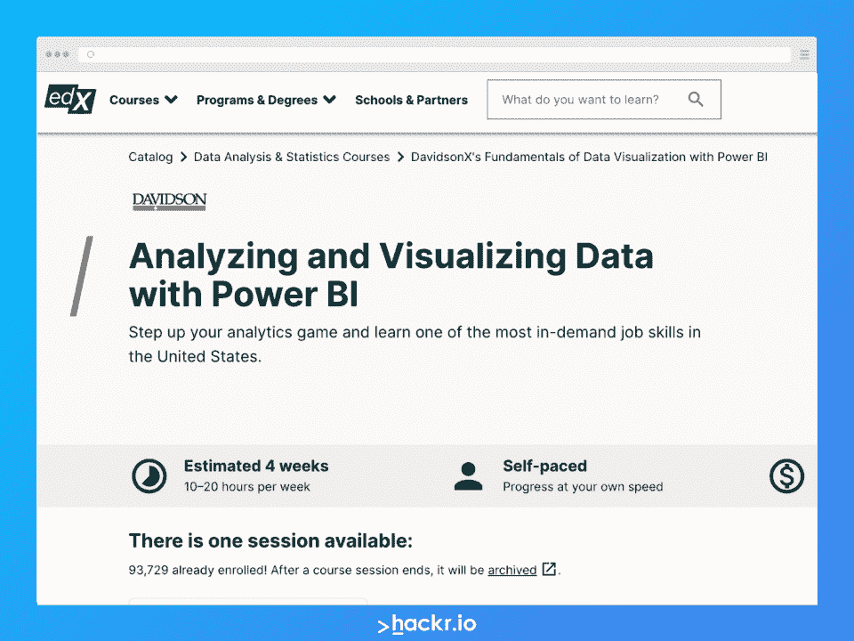](https://edx.sjv.io/c/2890636/1598007/17728?u=https%3A%2F%2Fwww.edx.org%2Fcourse%2Fdata-analysis-in-power-bi)

*   最适合:初学者、学生、研究人员、市场分析师、数据分析师和金融专业人士
*   经验等级:初学者
*   费用:免费

为期四周的自定进度课程，介绍如何在 Power BI 平台中分析和可视化数据。学生将学习如何处理数据，创建可视化，以及准备和共享仪表板。

学生将学习:

*   识别和使用数据集
*   导入和准备电力商业智能数据
*   创建和共享电源 BI 报告

[在此注册](https://edx.sjv.io/c/2890636/1598007/17728?u=https%3A%2F%2Fwww.edx.org%2Fcourse%2Fdata-analysis-in-power-bi)

*   最适合:对学习更多数据分析和数据仓库职位感兴趣的初学者
*   经验等级:初学者
*   费用:150 美元(自定进度)，250 美元(在线直播)

通过实时行业用例，完成实际的电力 BI 项目和任务。本课程包括 20 个小时的课程、16 个小时的实验、灵活的时间表，以及应要求提供的免费演示。这是一门以证书为导向的课程。

学生将学习:

*   Microsoft Power BI 和 BI 桌面
*   处理报告和可视化结果
*   模拟测试和面试

**[在此报名](https://mindmajix.com/power-bi-training)**

[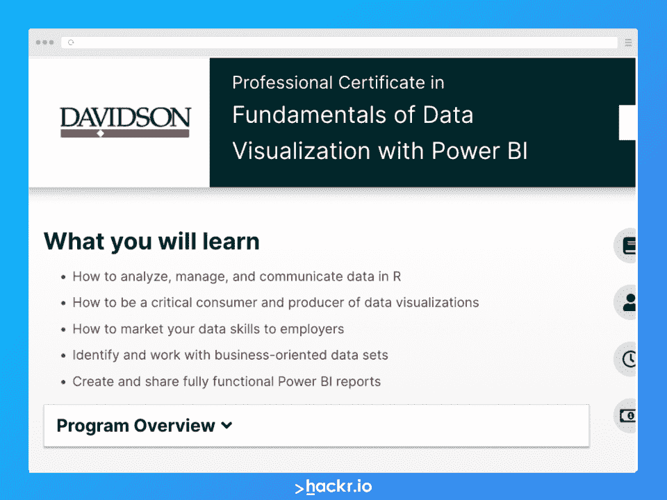](https://www.awin1.com/cread.php?awinmid=6798&awinaffid=428263&ued=https%3A%2F%2Fwww.edx.org%2Fprofessional-certificate%2Ffundamentals-of-data-visualization-with-power-bi%3Findex%3Dproduct%26queryID%3D75d87d3888053fc341cc768d040f8044%26position%3D1)

*   最适合:寻求 Power BI 专业认证的中级数据分析师
*   经验水平:中级
*   费用:358.20 美元

了解如何使用 Power BI 分析和可视化数据，以及数据素养的基本要素。为期两个月的自定进度 Power BI 课程，包括专家指导和两个技能培养课程。非常适合那些不仅想了解数据可视化，还想了解数据分析的人。

学生将学习:

*   分析和管理 R 中的数据
*   产生有意识的数据可视化
*   使用 Power BI 报告

[在此注册](https://www.awin1.com/cread.php?awinmid=6798&awinaffid=428263&ued=https%3A%2F%2Fwww.edx.org%2Fprofessional-certificate%2Ffundamentals-of-data-visualization-with-power-bi%3Findex%3Dproduct%26queryID%3D75d87d3888053fc341cc768d040f8044%26position%3D1)

[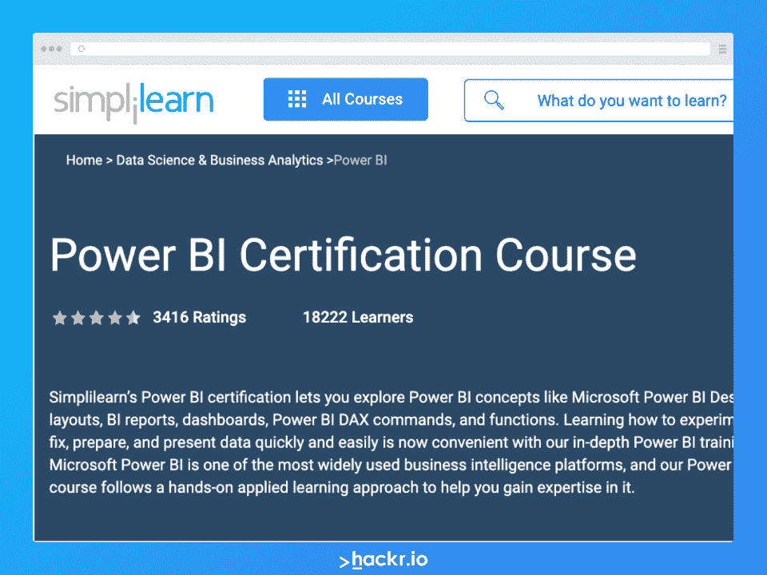](https://www.simplilearn.com/power-bi-certification-training-course#do-you-provide-any-practice-tests-as-part-of-power-bi-course)

*   最适合:商务人士、数据分析师和处理数据的专业人士
*   经验水平:中级
*   费用:799 美元(自定进度)，999 美元(在线训练营)

借助此 Power BI 认证课程，创建 Power BI 报告、分析数据并探索真实的使用案例。通过六个小时的强化学习，学生将获得专业认可的课程证书。该课程可以自学，也可以通过在线训练营学习。

学生将学习:

*   桌面软件
*   数据聚合
*   构建报告和仪表板

[在此注册](https://www.simplilearn.com/power-bi-certification-training-course#do-you-provide-any-practice-tests-as-part-of-power-bi-course)

[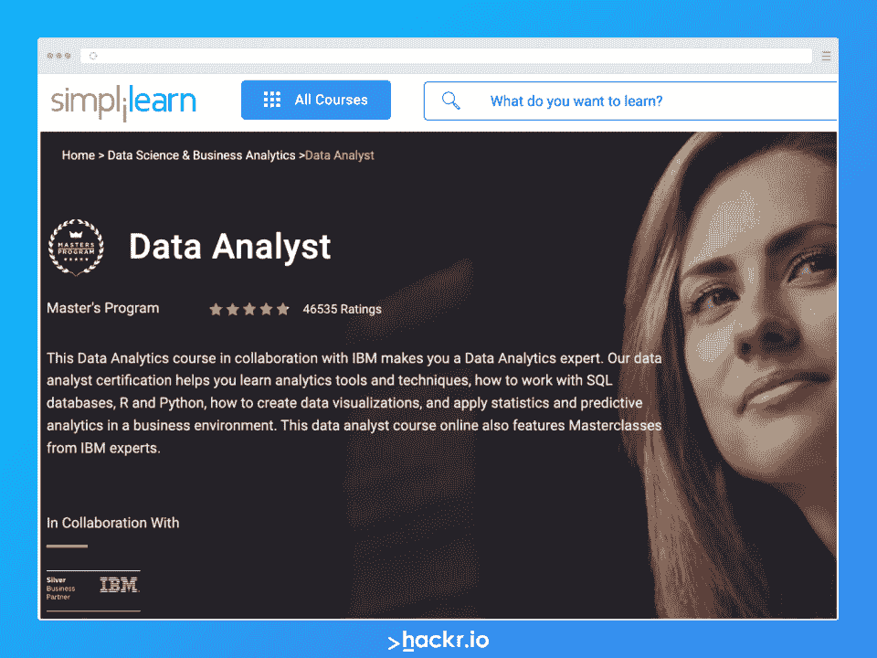](https://www.simplilearn.com/data-analyst-masters-certification-training-course#what-are-the-learning-objectives)

*   最适合:希望了解更多关于 Power BI 的知识并掌握数据分析领域的专业人士
*   经验等级:专家
*   成本:1999 美元

超越权力 BI。在这个综合课程中，学生将学习业务分析、编程基础、Python、Tableau、Excel 和(当然)Power BI。这门预备课程为学生在数据分析职业生涯中取得成功做准备，并为每项技术提供单独的证书。

学生将学习:

*   分析和编程
*   电源 BI 报告和分析
*   Python、Excel 和 Tableau

[在此注册](https://www.simplilearn.com/data-analyst-masters-certification-training-course#what-are-the-learning-objectives)

[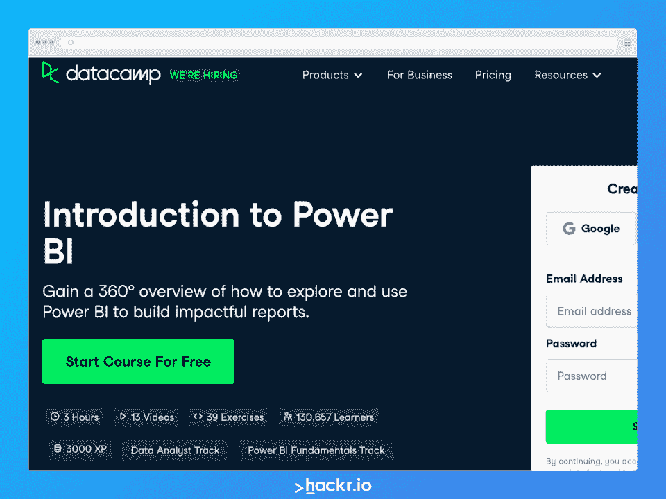](https://datacamp.pxf.io/qn6O9N)

*   最适合:希望开始使用 Power BI 的初学者
*   经验等级:初学者
*   费用:免费

从六个小时的课程开始学习 Power BI，包括 19 个视频和 56 个练习。学生将通过真实场景和动手练习学习 Power BI，掌握从 Power BI 报告到 DAX 查询的各种知识。

学生将学习:

*   如何开始使用 Power BI
*   使用报告可视化数据
*   在 Dax 中使用计算

[在此注册](https://datacamp.pxf.io/qn6O9N)

[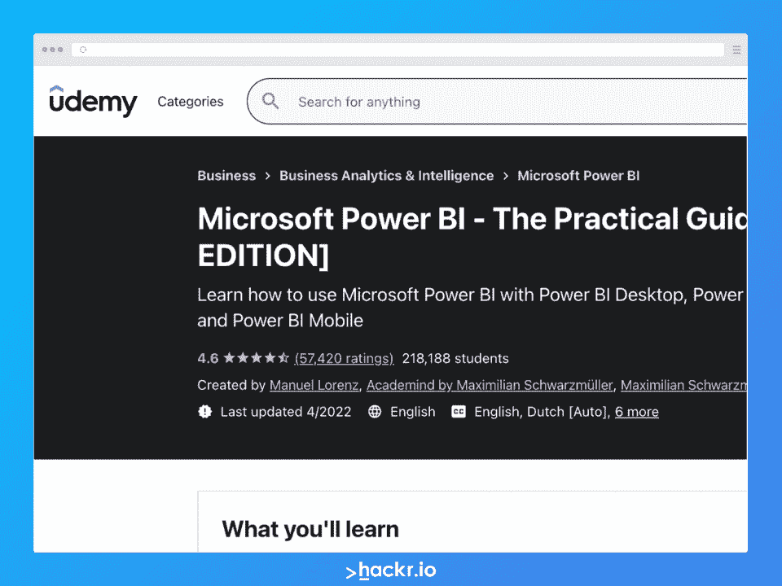](https://click.linksynergy.com/deeplink?id=jU79Zysihs4&mid=39197&murl=https%3A%2F%2Fwww.udemy.com%2Fcourse%2Fpowerbi-complete-introduction%2F%3FranMID%3D39197%26ranEAID%3D6m9Z7SVq%2ATw%26ranSiteID%3D6m9Z7SVq.Tw-L8MVKPmSJMiPWQX231vIbQ%26utm_source%3Daff-campaign%26LSNPUBID%3D6m9Z7SVq%2ATw%26utm_medium%3Dudemyads)

*   最适合:希望从头开始学习 Power BI 的分析师
*   经验等级:初学者
*   价格:19.99 美元

本课程深入介绍了如何使用 Microsoft Power BI 进行业务分析。除了使用 Power BI 平台的许多工具之外，还将引导学生完成汇总、收集和报告数据的过程。

学生将学习:

*   使用不同的数据源
*   分析电源 BI 数据
*   使用电动 BI 工具

[在此注册](https://click.linksynergy.com/deeplink?id=jU79Zysihs4&mid=39197&murl=https%3A%2F%2Fwww.udemy.com%2Fcourse%2Fpowerbi-complete-introduction%2F%3FranMID%3D39197%26ranEAID%3D6m9Z7SVq%2ATw%26ranSiteID%3D6m9Z7SVq.Tw-L8MVKPmSJMiPWQX231vIbQ%26utm_source%3Daff-campaign%26LSNPUBID%3D6m9Z7SVq%2ATw%26utm_medium%3Dudemyads)

[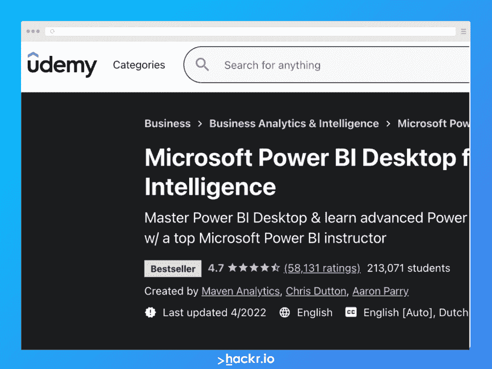](https://click.linksynergy.com/deeplink?id=jU79Zysihs4&mid=39197&murl=https%3A%2F%2Fwww.udemy.com%2Fcourse%2Fmicrosoft-power-bi-up-running-with-power-bi-desktop%2F%3FranMID%3D39197%26ranEAID%3D6m9Z7SVq%2ATw%26ranSiteID%3D6m9Z7SVq.Tw-Gr7HG.i6m8qM2lsMwi76FQ%26utm_source%3Daff-campaign%26LSNPUBID%3D6m9Z7SVq%2ATw%26utm_medium%3Dudemyads)

*   最适合:希望了解更多关于 Power BI 桌面、高级 Power BI 分析和数据可视化的初学者
*   经验等级:初学者
*   价格:17.99 美元

在本课程中，业务分析师将学习如何使用 Microsoft Power BI 生成专业质量的报告，以及如何创建漂亮的交互式仪表板。他们将直接向专业的 Power BI 开发人员学习，并更好地理解数据可视化工作流。

学生将学习:

*   实施电源 BI 报告
*   创建 Power BI 仪表板
*   使用商务智能

[在此注册](https://click.linksynergy.com/deeplink?id=jU79Zysihs4&mid=39197&murl=https%3A%2F%2Fwww.udemy.com%2Fcourse%2Fmicrosoft-power-bi-up-running-with-power-bi-desktop%2F%3FranMID%3D39197%26ranEAID%3D6m9Z7SVq%2ATw%26ranSiteID%3D6m9Z7SVq.Tw-Gr7HG.i6m8qM2lsMwi76FQ%26utm_source%3Daff-campaign%26LSNPUBID%3D6m9Z7SVq%2ATw%26utm_medium%3Dudemyads)

[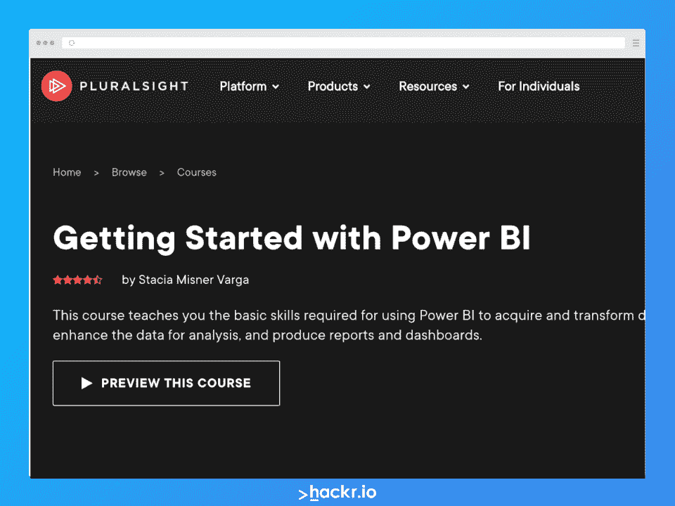](https://pluralsight.pxf.io/EadR1Q)

*   最适合:希望了解如何将 Power BI 应用于其报告流程的商务专业人士
*   经验等级:初学者
*   费用:每月 29 美元

在开始使用 Power BI 时，业务专业人员可以学习 Power BI 的基础知识、不同的数据源、简单的计算、构建报告和创建仪表板。这个由专家主导的课程包括获取数据、转换数据、建模数据、可视化数据和刷新数据。

学生将学习:

*   电力商业智能基础
*   数据汇总和分析
*   报告和仪表板

[在此注册](https://pluralsight.pxf.io/EadR1Q)

[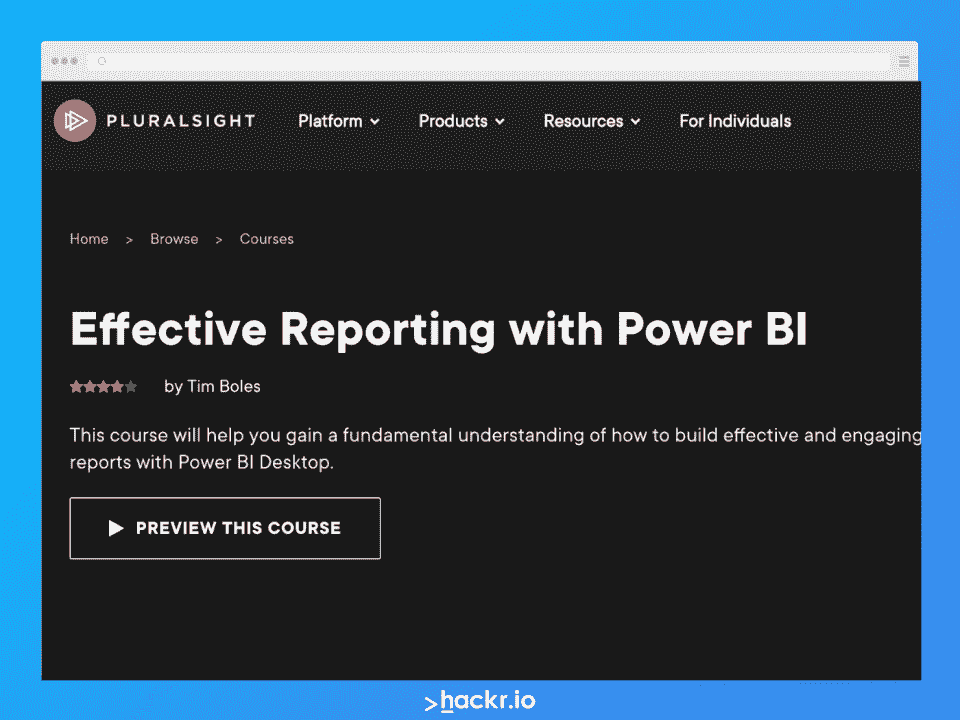](https://pluralsight.pxf.io/6bMV6b)

*   最适合:对数据分析有所了解，但希望使用 Power BI 构建报告的中级用户
*   经验水平:中级
*   费用:每月 29 美元

了解如何使用 Power BI 进行有效的报告。本 Power BI 课程包括 Power BI 的基础知识、创建基本和高级报告、处理异常数据以及实施关键绩效指标(KPI)。通过本课程，个人将学习从基本报告到交互式仪表板的所有内容。

学生将学习:

*   聚集异常数据
*   创建交互式仪表板
*   在报表中建立关系

[在此注册](https://pluralsight.pxf.io/6bMV6b)

[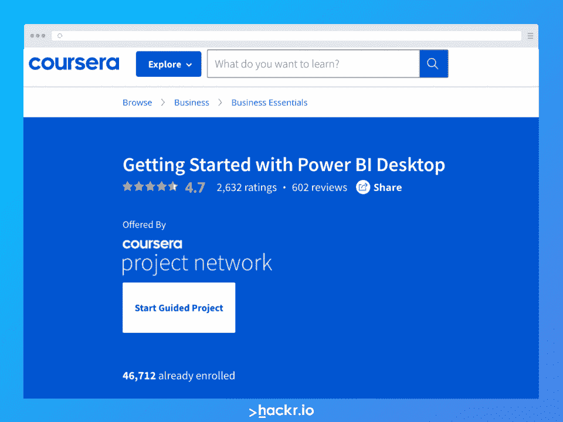](https://imp.i384100.net/vn6EKy)

*   最适合:希望学习 Power BI 桌面平台的初级用户
*   经验等级:初学者
*   费用:每月 39 美元

这个 Coursera 课程将引导初学者完成使用 Power BI 桌面平台的过程。这是一个两小时的初级课程，包括九个循序渐进的课程和指导项目。学生将通过 Power BI Desktop 的实际动手体验来学习。

学生将学习:

*   导入和转换数据
*   创建报告
*   过滤和分析数据

[在此注册](https://imp.i384100.net/vn6EKy)

[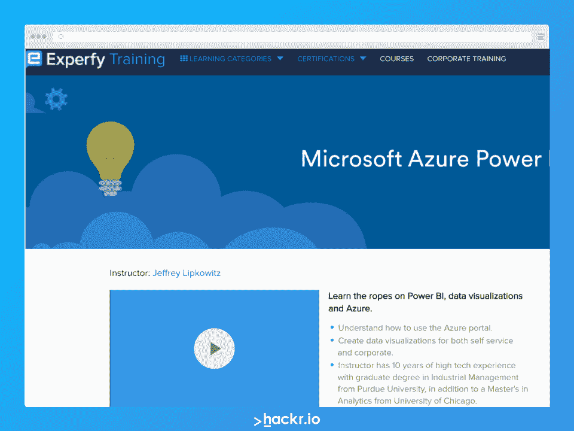](https://training.experfy.com/courses/microsoft-azure-power-bi)

*   最适合:希望了解如何使用 Azure 门户、数据可视化以及 Power BI 桌面和 Power BI 服务解决方案的商业专业人士
*   经验水平:中级
*   费用:49 美元

了解如何使用 Power BI、数据可视化和 Azure。这本多合一初级读本旨在帮助用户了解如何使用 Power BI 桌面和 Power BI 服务解决方案。学生将学习如何制作自助服务和企业可视化。

学生将学习:

*   超级商务智能桌面和超级商务智能服务
*   如何创建有用的数据可视化
*   将 Power BI 应用于数据分析

[在此注册](https://training.experfy.com/courses/microsoft-azure-power-bi)

[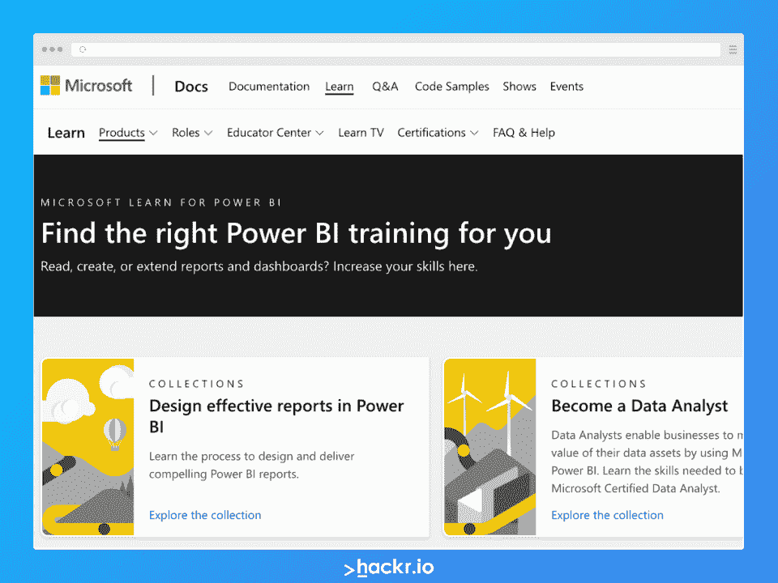](https://docs.microsoft.com/en-us/learn/powerplatform/power-bi?WT.mc_id=powerbi_landingpage-marketing-page)

*   最适合:想要学习 Power BI 的复杂性的初学者、中间用户和专家
*   经验级别:初级、中级、专家
*   费用:免费

微软的 Power BI 学习中心提供了关于如何使用 Power BI 的深入信息。但是，应该注意的是，它不产生任何特定的认证；预备用比较好。Power BI 平台有一系列培训集合。

学生将学习:

*   设计有效的报告
*   成为数据分析师
*   使用 Power 平台开发

[在此注册](https://docs.microsoft.com/en-us/learn/powerplatform/power-bi?WT.mc_id=powerbi_landingpage-marketing-page)

[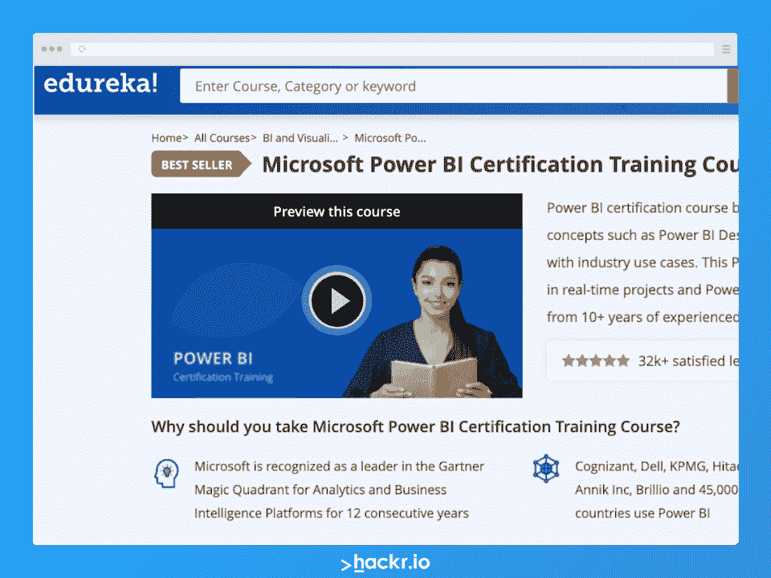](https://click.linksynergy.com/deeplink?id=jU79Zysihs4&mid=42536&murl=https%3A%2F%2Fwww.edureka.co%2Fpower-bi-certification-training%3FqId%3D20e3b20d3f80e26ac00054435bb66a56%26index_name%3Dprod_search_results_courses%26objId%3D820%26objPos%3D1%26ranMID%3D42536%26ranEAID%3D6m9Z7SVq%2ATw%26ranSiteID%3D6m9Z7SVq.Tw-4Am2VO5FZ5GwssQiFFu8ig%26LSNSUBSITE%3DLSNSUBSITE&LSNSUBSITE=LSNSUBSITE)

*   最适合:想要完整的 Power BI 认证课程的初学者，涵盖从业务分析到 DAX 查询的所有内容
*   经验等级:初学者
*   费用:424 美元

Edureka 提供的 bootcamp 课程，包括 Power BI Desktop、DAX、报告、移动应用、架构和其他数据管理。通过 Edureka 的 Microsoft Power BI 培训，专业人员将了解开始使用和配置 Power BI 的整个过程。

学生将学习:

*   商业智能
*   Power BI 的优势和工具
*   认证题库

[在此注册](https://click.linksynergy.com/deeplink?id=jU79Zysihs4&mid=42536&murl=https%3A%2F%2Fwww.edureka.co%2Fpower-bi-certification-training%3FqId%3D20e3b20d3f80e26ac00054435bb66a56%26index_name%3Dprod_search_results_courses%26objId%3D820%26objPos%3D1%26ranMID%3D42536%26ranEAID%3D6m9Z7SVq%2ATw%26ranSiteID%3D6m9Z7SVq.Tw-4Am2VO5FZ5GwssQiFFu8ig%26LSNSUBSITE%3DLSNSUBSITE&LSNSUBSITE=LSNSUBSITE)

[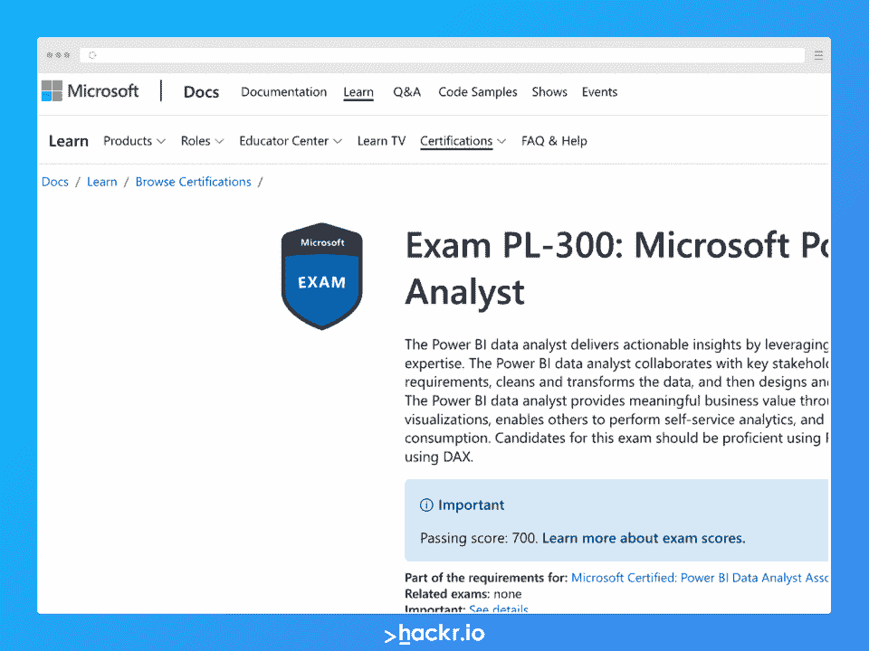](https://docs.microsoft.com/en-us/learn/certifications/exams/pl-300)

*   最适合:希望在高级商务智能领域建立自己的凭证的中级商务智能用户
*   经验水平:中级
*   费用:165 美元

这个数据认证测试的是写表达式、使用幂查询等技能。获得认证需要在考试中获得 700 分的及格分数。此证书可用于 Microsoft Certified: Power BI 数据分析师认证途径。

[在此注册](https://docs.microsoft.com/en-us/learn/certifications/exams/pl-300)

[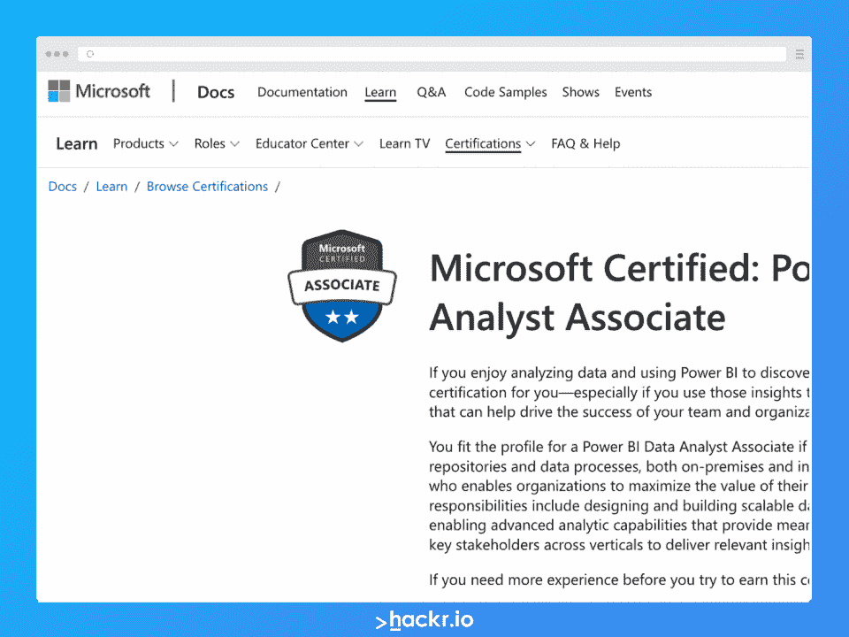](https://docs.microsoft.com/en-us/learn/certifications/power-bi-data-analyst-associate/)

*   最适合:希望在高级商务智能专业中证明自己能力的中级商务智能用户
*   经验水平:中级
*   费用:免费

本课程与 Microsoft Power BI 数据分析师认证相关。它包括数据分析、模型数据、可视化和 Power BI 基础知识方面的免费课程。还提供付费的教师指导课程。本课程最终将获得微软 Power BI 数据分析师证书。

[在此注册](https://docs.microsoft.com/en-us/learn/certifications/power-bi-data-analyst-associate/)

## **如何准备 Power BI 认证**

在参加 Power BI 认证测试之前，请浏览 Power BI 中的一些场景。参加在线商务智能课程——甚至考虑参加训练营。许多认证课程为您参加 Power BI 认证考试做好了充分准备。其他人会有模拟考试来测试你的技能。

## **结论**

Power BI 证书可以打开大门。但是，在您注册微软的 Power BI 认证之前，请考虑通过课程、教程和测试来更新您的 Power BI 知识。参加一些 Power BI 课程和教程，或者将 Power BI 与其他[流行分析工具](https://hackr.io/blog/top-data-analytics-tools)进行比较，将有助于您首次获得认证。

## **常见问题解答**

#### 1.动力 BI 有什么认证吗？

Power BI 有多种认证。其中最知名的是微软认证的 Power BI 数据分析师协会，但也有来自 Coursera、Udemy 和 edX 的其他机构。

#### **2。Power BI 哪个认证最好？**

微软的认证是认可度最高的，但如果你在特定领域或行业，可能会有更适用的认证路径。这取决于你的经验水平，你在哪个国家，你从事什么行业。不过，一般来说，Power BI 认证有助于增加你的薪水。

#### **3。Power BI 认证平均费用是多少？**

Power BI 认证可能会花费您大约 200 美元。认证前的训练营或课程费用可能从 0 美元到 2，000 美元不等。网上有很多免费的认证入门和课程，尤其是通过微软。

#### **4。什么是 Power BI 认证？**

Power BI 认证是行业认可的证书，证明您对领先的商业智能和数据可视化套件 Microsoft Power BI 的精通程度。该认证可以帮助你从其他求职者中脱颖而出，并有可能获得更高的薪水。

#### **5。动力 BI 认证难吗？**

Power BI 认证并不难，但需要对 Power BI 软件有很强的理解。在参加考试之前，考虑参加一个课程或者参加一个训练营来更新你的知识。

#### **6。Power BI 认证需要多长时间？**

Power BI 认证过程可能需要几周到几个月的时间，这取决于您对软件的经验以及您希望通过认证过程的速度。不过，一般来说，你至少要花一个月的时间准备认证考试。许多自定进度的课程需要长达两个月的时间。