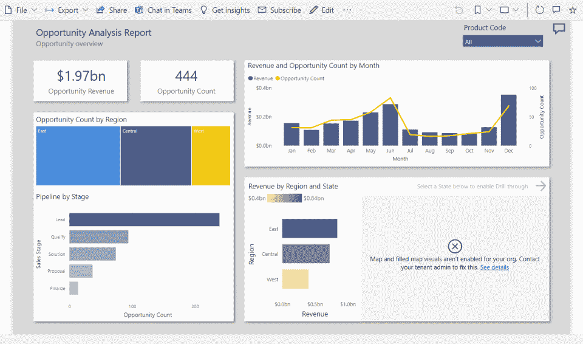
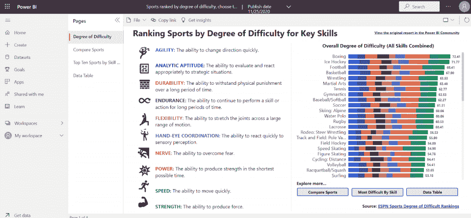
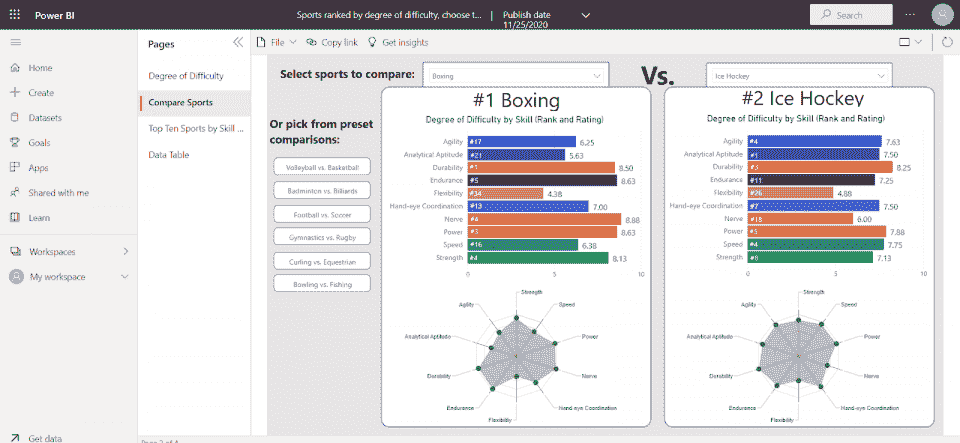
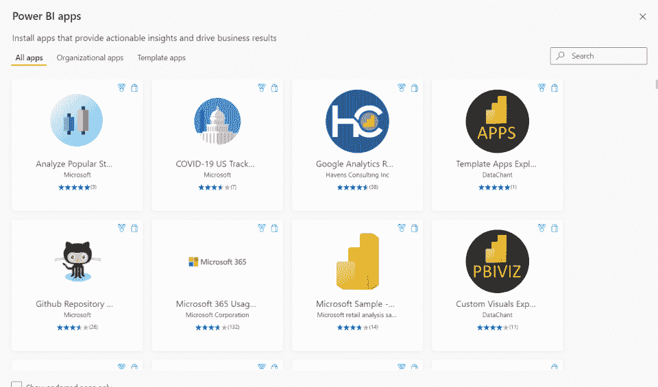
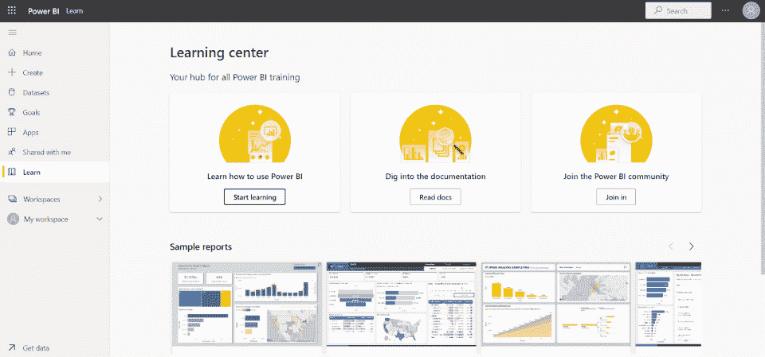
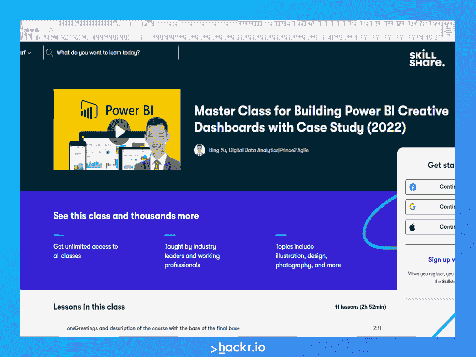

# Top 35+ Power BI 面试问答[2023]

> 原文：<https://hackr.io/blog/power-bi-interview-questions>

面试官用 [权力 BI](https://powerbi.microsoft.com/en-au/) 面试问题来确定你的知识和经验。但不是每个人都能独立思考。通过提前回顾最常见的商务智能问题和答案，你可以练习你的答案，提高你在 A+面试中的胜算。

在进入下一轮面试之前，用这些常见的商务智能问题测试一下你的技能。

## 如何使用 Power BI 面试问答

无论你是制作抽认卡还是 [下载我们的](https://drive.google.com/file/d/1ce9_H34QVCKasWN-11FASDlxV98Seydl/view?usp=sharing) [PDF](https://www.google.com/url?q=https://drive.google.com/file/d/1ce9_H34QVCKasWN-11FASDlxV98Seydl/view?usp%3Dsharing&sa=D&source=editors&ust=1651700620480095&usg=AOvVaw2yvlqmD-fIndj-xHgifSke) ，你都应该至少浏览几次最常见的问题和答案。如果你理解任何事情都有困难，花时间打开 Power BI 平台来练习你的技能。

查看这些 Power BI 面试问题和答案应该有助于你确定自己知识中仍需努力的领域。你可以在自己家里舒适地学习更多关于 Power BI 的知识，避免在面试时感到措手不及。

[点击此处下载 Power BI 面试问答 PDF。](https://drive.google.com/file/d/1ce9_H34QVCKasWN-11FASDlxV98Seydl/view?usp=sharing)

## 基础电源 BI 开发人员面试问题

也许你只有不到一年的 Power BI 经验。或者，也许在你上一份工作中，权力并不是主要职责。如果你的未来角色是入门级或初学者，这些面试问题就足够了。

### 1。什么是 Power BI？

Power BI 是微软提供的商业分析服务。它提供数据可视化和报告工具，帮助用户通过复杂的数据分析从数据中获得洞察力。

### 2。Power BI 有哪些不同的版本？

有[三个版本的异能匕:](https://docs.microsoft.com/en-us/power-bi/fundamentals/service-features-license-type)

*   Power BI 桌面。 这个版本是为个人用户设计的，可以安装在本地机器上。
*   电力 BI 服务。 这个基于云的版本提供协作功能，并允许用户共享他们的报告和仪表板。
*   电力毕移动。 此版本提供从移动设备访问 Power BI 报告和仪表盘的功能。

通常，所有三个版本会被一个团队同时使用。

### 3。Power BI 中的数据模型是什么？

数据模型是代表 Power BI 报告中数据的表格和关系的集合。数据模型创建可视化效果，如图表和图形。

将数据模型想象成一个包含数据的数据库或电子表格，而可视化、图表和图形是一种与数据交互和呈现数据的方式。

### 4。Power BI 中的数据集是什么？

数据集用于在 Power BI 中创建可视化效果。数据集可以从各种来源创建，包括 Excel、CSV 或 SQL 数据库。

### 5。如何连接 Power BI 中的数据源？

要连接数据源，点击 Power BI 界面中的“获取数据”按钮。这将打开“获取数据”对话框，您可以在其中选择要连接的数据源类型。

### 6。Power BI 中最常用的数据源是什么？

Power BI 中最常用的一些数据源包括 Excel、CSV、SQL 数据库和 web[API](https://hackr.io/blog/what-is-api-testing)。Power BI 可以连接到数据湖和数据井，并且可以连接来自多个不同数据源的数据。

### 7 .。Power BI 中的仪表板是什么？

仪表板是一个可视化的集合，提供电源 BI 报告中数据的概述。仪表板可以自定义并与其他用户共享。您应该使用仪表板来查看相关数据或关键数据。

### 8。什么是 Power BI 中的报告？

报告是探索 Power BI 数据集数据的可视化集合。像仪表板一样，您可以自定义报告并与其他用户共享。报表是电力 BI 分析系统的核心。

### 9。如何在 Power BI 中创建视觉效果？

您可以使用工具栏中的“创建视觉效果”按钮在 Power BI 中创建视觉效果。这将打开“可视化”窗格，您可以在其中选择想要创建的可视化类型。可视化用于创建人类可读的数据；虽然数据保持不变，但可视化后更容易理解。

###  10。Power BI 中最常用的可视化是什么？

Power BI 中最常用的一些可视化工具包括条形图、折线图和饼图。Power BI 中使用的可视化非常类似于其他 Microsoft 产品的可视化，例如 Microsoft Excel 或 Microsoft PowerPoint。

## 中级电源 BI 开发人员面试问题

也许你已经成为 Power BI 开发人员至少有几年了。你知道程序的来龙去脉，尽管你可能不是专家。中级或助理职位面试要求候选人深入了解 Power BI 的工作原理。您还应该有一些关于您过去如何使用 Power BI 的故事。

### 11。功率 BI 的衡量标准是什么？

度量是一种计算方法，用于汇总 Power BI 报告中的数据。您可以使用 DAX 语言创建度量，这是一种用于分析 Power BI 数据的简单内部语言。

### 12。Power BI 中的计算列是什么？

计算列是基于算法生成的，并使用 DAX 语言创建。把它们想象成微软 Excel 中的函数，两者类似。

### 13。如何在 Power BI 中创建表之间的关系？

您可以使用 Power BI 界面中的“管理关系”按钮创建关系。这将打开“管理关系”对话框，您可以在其中选择要创建关系的表。

### 14。Power BI 中的 DAX 是什么？

DAX 是一种用于在 Power BI 中创建度量和计算列的语言。DAX 包括许多可以操作数据的函数，很像 Microsoft Excel。

### 15。Power BI 中最常用的 DAX 函数有哪些？

Power BI 最常见的 DAX 函数包括求和、求平均值和计数。SUM 将值相加，AVERAGE 将值相加，COUNT 将计算条目数。

### 16。什么是 Power BI 服务？

Power BI 服务是一个基于云的平台，允许用户共享报告和仪表盘，并就评论和赞进行协作。在一个越来越遥远的世界，Power BI 服务已经变得比桌面应用程序更加有用。

### 17。什么是 Power BI 桌面？

Power BI Desktop 是一款桌面应用程序，允许用户创建和编辑报告。您可以将 Power BI 桌面报告发布到 Power BI 服务，并通过 Power BI Mobile 访问相同的数据。

### 18。Power BI 最常见的用途是什么？

Power BI 最常见的用途包括创建报告和仪表板、与其他用户共享报告以及在报告上进行协作。Power BI 一般用于采集和分析 数据。

### 19。您如何共享 Power BI 仪表盘和报告？

您可以使用 Power BI 界面中的“共享”按钮共享 d 仪表板和报告。这将打开“共享”对话框，您可以在其中输入想要与其共享仪表板或报告的用户的电子邮件地址。

### 20。您如何在 Power BI 内容上进行协作？

您可以使用“评论”和“喜欢”功能来讨论 Power BI 内容。此外，您可以向报告和仪表板添加注释，每个人都可以一起访问这些报告。

## 面向资深专业人士的高级电力 BI 面试问题

你是一名商务智能专家，正在申请高级或领导职位。您过去的大部分工作都是在 Power BI 中完成的。您已经在 Power BI 中创建了许多项目，并且遇到了许多不同的场景。回答以下问题时，尝试分享个人故事和例子。

### 21。使用 Power BI 可以解决哪些最常见的问题？

您可以使用 Power BI 来解决问题、创建报告和仪表板，以及共享或协作处理报告。一个例子可能是分析销售生产力和效率，以确定表现最佳的销售专业人员。

想想:

*   你 用 BI 力量解决的最后一个问题是什么？
*   How did you use Power BI in particular to solve that problem?

### 22。如何在 Power BI 中处理大型数据集？

在 Power BI 中，有几种不同的方法来处理大型数据集。一种方法是使用“查询编辑器”根据需要过滤和聚集数据。另一种方式是使用“DirectQuery”模式，将直接查询底层数据源。

想想:

*   举例说明您必须在 Power BI 中处理的特别大的数据集。
*   您在这个数据集上遇到了哪些新的挑战？
*   How did you interact with it?

### 23。您在 Power BI 中遇到的最常见的性能问题是什么？

Power BI 最常见的一些性能问题包括加载速度慢、刷新速度慢和内存使用率高。

想想:

*   您在 Power BI 中参与的项目是否遇到过性能问题？
*   原因是什么？
*   Importantly, how did you resolve it?

### 24。您如何解决电源 BI 问题？

有几种不同的方法来解决电源 BI 问题。一种是使用“电源 BI 诊断”工具，这是一种收集有关电源 BI 问题信息的工具。另一种方法是使用“Power BI Helper”工具，它可以帮助解决 Power BI 问题。

想想:

*   您上一次遇到重大电源 BI 问题是什么时候？
*   What steps did you take to resolve the problem?

### 25。您遇到的最常见的 Power BI 部署问题有哪些？

一些最常见的 Power BI 部署问题包括不正确的权限、不正确的配置和缺少依赖关系。通常，这些部署问题与不正确地启动 Power BI 有关，这就是为什么部署是一个非常重要的阶段。

想想:

*   您是否遇到过电源 BI 部署问题？
*   它对您的组织有什么影响？
*   How was the deployment issue eventually resolved?

### 26。您在 Power BI 中遇到的最常见的数据治理问题是什么？

Power BI 中的数据治理问题可能包括不正确的数据隐私设置、数据安全设置和数据保留设置。所有这些设置都会对 Power BI 中使用和访问数据的方式产生重大影响。

想想:

*   您是否遇到过数据治理问题？
*   您是否报告、上报或以其他方式解决了问题？
*   What had caused the governance issue—and how was it avoided in the future?

### 27。您如何处理 Power BI 中的安全性？

您可以用几种不同的方式来处理 Power BI 的安全性。一种方法是使用“Power BI 安全模型”，这是一种成熟度模型，定义了如何在 Power BI 中保护数据。您还可以遵循基本的 Power BI 安全最佳实践来保护您的数据。

想想:

*   您组织中的安全协议是什么？
*   您能想出需要实施更严格的安全措施的时候吗？
*   How did your organization manage the security transition?

### 28。您在 Power BI 中遇到的最常见的合规性问题是什么？

Power BI 中的合规性问题可能包括不正确的数据隐私设置、数据安全设置和数据保留设置。这些设置会对 Power BI 中数据的使用和访问方式产生重大影响。

想想:

*   最常见的合规问题通常涉及员工。
*   您过去遇到过哪些合规问题？
*   Was your organization able to implement processes to avoid this?

### 29。您遇到的最常见的电源 BI 集成问题有哪些？

与合规性和数据治理问题类似， Power BI 集成问题也包括不正确的数据隐私设置、数据安全设置和数据保留设置。主要影响？如何在 Power BI 中使用和访问数据。如果第三方解决方案不完全安全，第三方集成也会带来重大的安全问题。

想想:

*   What Power BI integrations have you seen used?
*   What issues have you experienced with integrations, and how were they resolved?
*   你有过不能原生集成 Power BI 的系统吗？你是怎么做到的？

###  30。您如何针对性能优化 Power BI？

我们提到了一些常见的电源 BI 性能问题。但是如何优化 Power BI 呢？一种方法是使用“Power BI Performance Analyzer”工具，该工具收集有关 Power BI 性能的信息。另一种方法是使用微软的 [Power BI 性能最佳实践](https://docs.microsoft.com/en-us/power-bi/guidance/power-bi-optimization) 指南，概述了优化 Power BI 性能的最佳实践。

想想:

*   对于 Power BI，你经历了多少绩效管理？
*   如果您打算主动优化电源 BI，您会采取哪些步骤？

## Power BI 基于场景的面试问题

这些问题可能会让你坐在一个模拟的商务智能面前，要求你在面试室里马上解决问题。一步一步地回顾这些场景，做好准备。

### 31。您将如何使用 Power BI 来分析销售数据？

*   Data. You must first connect to a source that contains sales data. This might be a sales program or a customer relationship management (CRM) suite.
*   Integration. Next, create a report in Power BI with sales data. You might create a top performers list, a year-over-year performance comparison, or sales by product listing.
*   Analyze. Finally, analyze the sales data to identify trends and insights. You might use bar charts, column charts, or pie charts to visualize sales data.

### 32。您如何使用 Power BI 来跟踪网站分析？

*   Data. First, connect to a data source with website analytics data, like Google Analytics.
*   Integration. Next, create a Power BI report with website analytics data. You might create a report that shows website visitors over time or by geographic location.
*   Analyze. Analyze the website analytics using charts that display interactions over time. Line charts are usually the best choice for this scenario.

### 33。您将如何使用 Power BI 来监控社交媒体指标？

*   Data. Connect to a data source with social media data, like Twitter or Facebook, a social media manager, or an aggregation service.
*   Integration. For social media metrics, you might create a report that shows how many times a particular hashtag was used, or how many likes a Facebook page has.
*   Analyze. Analyze the social media data in the report to identify trends and insights. Social media data is intricate; you should start by determining what your organization wants to track. Likes? Follows? Engagements? Conversions?

### 34。您将如何使用 Power BI 来跟踪 KPI？

*   Data. Connect to a data source that contains the KPIs you want to track. This could be an Excel file, SQL database, or data warehousing solution. KPIs are highly situation-dependent, so choose one as an example, such as conversions.
*   Integration. You might create a report that shows how each KPI is performing over time. For conversions, you might want to match conversions, conversion sources, and even customer lifetime value.
*   Analyze. What type of reports would you use to visualize KPIs? For conversion, you might just need a line chart or a graph.

### 35。你会如何使用 Power BI 来预测未来的销售？

1.  连接到您的销售数据仓库。
2.  引入销售数据，并分析年同比、季度环比和月环比。
3.  Forecast data utilizing past performance and projected growth data.

### 36。您将如何使用 Power BI 来预测客户流失？

1.  连接好你的客户数据。
2.  使用 Power BI 从已经离开的客户那里获取数据。
3.  确定符合已离开客户特征的当前客户。
4.  使用这个来识别最有可能流失的客户。

## 下次商务智能面试的技巧

除了复习技术面试问题，回顾一下你在 Power BI 上的个人经历。你接手的项目中有没有涉及到 Power BI 的？您是否自己构建过任何 Power BI 应用程序或安装——您是否曾经不得不排除 Power BI 系统的故障？

下次商务智能面试的技巧:

*   Be prepared to answer both technical and non-technical questions about Power BI.
*   Before your interview, review the most common Power BI interview questions and answers. This will help you identify any areas of weakness in your knowledge.
*   When answering scenario-based questions, take your time to think through each step of the process. If you get stuck, don't be afraid to ask for clarification from the interviewer.
*   Remember to focus on your experiences with Power BI. Be prepared to share any stories or examples that showcase your skills with the platform.
*   Practice an interview with a colleague or a knowledgeable friend. You won’t be caught off-guard by questions.
*   考虑看看 Power BI 知识中心。Power BI 知识中心将为您提供有关使用和优化 Power BI 的更多信息。

记住，面试你的人也不一定是专家。如果他们需要你的澄清或额外信息，不要被打断；有可能你知道的比他们多！

## 结论

不要让一个强有力的 BI 面试吓倒你。如果你有 Power BI 方面的经验——或者即使你只是在学校学过——你应该能够发展你需要的知识。在研究了这些强力商务智能面试问题后，你可能会考虑扩大你的知识面。参加 Power B 的进修课程，或者在网上参加一些 Power BI 课程。

Power BI 是当今许多行业中非常有用的工具，也是许多商业环境中广受欢迎的技能。

[点击此处下载 Power BI 面试问答 PDF。](https://drive.google.com/file/d/1ce9_H34QVCKasWN-11FASDlxV98Seydl/view?usp=sharing)

## 参加本课程，掌握力量 Bi！

有兴趣使用其他数据分析工具吗？查看我们列出的 [最佳分析工具](https://hackr.io/blog/top-data-analytics-tools) 。

## 常见问题解答

1.  ### 电力 BI 中的面试问题有哪些？

Power BI 中的面试问题会因你面试的职位而异。一般来说，面试官希望测试你的技术能力和电力 BI 知识。他们可能还会问一些基于场景的问题，以了解你会如何处理现实世界中的情况。

2.  ### 异能 BI 需要哪些技能？

要使用 Power BI，您需要精通 SQL 等编程语言，并具备数据仓库的工作知识。此外，理解商业智能工具和技术也很有帮助。一些 Power BI 用户是数据科学家，而其他人则是顾问和业务专家。

3.  ### 动力 BI 有哪些基础？

Power BI 是一款商业智能工具，可帮助组织可视化和分析数据。您可以使用它来创建报告、仪表板和数据可视化。Power BI 包括几个特性，比如数据建模、安全性、协作和连接性。

4.  ### DAX 语言是什么？

DAX 是 Power BI 中用于计算度量和列的公式语言。DAX 包括几个函数，如 SUM、AVERAGE 和 COUNT。DAX 还允许您创建定制的度量和列。如果你曾经使用过 Excel 电子表格，你可以使用 DAX 语言。