# PowerShell 备忘单:2023 年的命令、操作符和更多内容

> 原文：<https://hackr.io/blog/powershell-cheat-sheet>

PowerShell 是一个有用的 Windows 命令行语言版本，可以帮助您无缝地执行和自动化系统上的关键任务。但是，如何在 Windows 系统上执行这些任务并充分利用 PowerShell 呢？

别担心，我们已经编制了一份 PowerShell 备忘单，记录了 PowerShell 语法和所有 PowerShell 命令，以帮助您优化 PowerShell，甚至为工作面试做准备。

**在这里** 下载我们的 PowerShell 备忘单 PDF [。](https://drive.google.com/file/d/1QC3smpXOio0O6XvXEIw7TXhOw5zZOZJf/view?usp=sharing)

## **PowerShell 备忘单**

我们先来快速介绍一下 Windows 10 PowerShell 命令。

### **PowerShell 基础知识**

PowerShell 是一个跨平台且常用的任务自动化解决方案，它结合了命令行 Shell、脚本语言和配置管理框架的强大功能。您可以在 Windows、Linux 和 macOS 操作系统上运行 PowerShell。与其他只接受和返回数据的外壳不同，PowerShell 接受并返回数据。NET 对象。

这种外壳具有以下特性。

*   健壮的**命令行历史**
*   丰富的**功能**，如制表符补全和命令预测
*   **命令和参数**别名
*   用于**改变命令的管道**
*   **控制台内帮助系统**，如 Unix 手册页

考虑到任何脚本语言的特性，您可以使用 PowerShell 来自动化系统管理过程和任务。它允许您在 CI/CD 环境中构建、测试和部署解决方案。

PowerShell 构建在。NET 公共语言运行库(CLR)，这意味着所有的输入和输出都是。NET 对象。您不必解析文本输出来从中检索信息。

PowerShell 脚本语言具有以下特性。

*   **函数、类、对象和模块**
*   **简易格式化系统**，提供清晰的输出，增强可读性
*   **内置支持**不同的数据格式，如 CSV、JSON 和 XML
*   **类型系统**用于创建动态类型

现在，让我们进入一些有用的 PowerShell 命令。

[Windows PowerShell 5.1 简介](https://click.linksynergy.com/link?id=jU79Zysihs4&offerid=1045023.1768672&type=2&murl=https%3A%2F%2Fwww.udemy.com%2Fcourse%2Fwindows-powershell-training%2F)

### **PowerShell 命令备忘单**

#### **cmdlet**

Cmdlets 是 PowerShell 的内部命令。这些 cmdlets 将向管道返回一个或多个对象，在管道的末端，我们在下表中提到对象的一些属性，以查看它们在屏幕上显示的值。

| **命令** | **描述** |
| 

```
Get-Help
```

 | 此命令允许您获得 PowerShell 的支持。 |
| 

```
Get-PSdrive
```

 | 这个命令提供了一个可用的 PSDrives 列表，例如 c、env、hklm、hkcu、alias 等。 |
| 

```
Get-ChildItem
```

 | 在任何注册表中，子项都是当前项的子项。要获得所需的详细信息，可以使用下面的命令。 |
| 

```
Get-ChildItem -recurse
```

 | 运行此命令以递归方式列出当前 PSdrive、文件夹或注册表项的所有子项。 |
| 

```
Get-ChildItem -rec -force
```

 | 使用此命令包括隐藏的文件夹(目录)。 |
| 

```
(Get-ChildItem).name or Get-ChildItem -name
```

 | 运行这些命令中的任何一个来获取当前文件夹中的列表文件和目录名。 |
| 

```
(Get-ChildItem).count 
```

 | 使用此命令获取 Get-Children 返回的对象集合中的条目数。 |

#### **PSdrives**

PSdrives 是组合在一起的实体的集合，因此它们可以作为文件系统驱动器来访问。“PSprovider”进行这种分组。

默认情况下，PS 会话可以访问多个 PS 驱动器，包括 c:，env:，alias:，和 HKLM:，其中 c:是指通常的 Windows c 驱动器；env:是 Windows 环境变量的空间；alias:是 cmdlet 别名的集合；HKLM 是注册表中的一个蜂巢。

任何 PS 会话都将进入用户的主文件夹。如果要从 PS 会话切换到另一个 PSdrive 并从该驱动器中检索信息，请考虑以下命令:

| **命令** | **描述** |
| 

```
Switching to env-
```

 | 提示字符将变为“ENV:\ >”。通过运行以下命令设置-Location env:

```
Set-Location env-
```

 |
| 

```
Env:\> Get-Childitem
```

 | 这个命令将获取所有的环境变量。 |
| 

```
Env:\> Get-Childitem userprofile
```

 | 使用此命令获取“userprofile”的环境变量 |
| 

```
Env:\> Set-Location alias:
```

 | 运行以下命令，将提示字符更改为“Alias” |
| 

```
Alias:\> Get-Childitem
```

 | 运行此命令获取所有别名的所有子代。 |
| 

```
Alias:\> Set-Location C:\
```

 | 使用此命令再次获得“C:/>”提示符，回到默认驱动器。 |
| 

```
C:\Users\user_name>$alias:ls
```

 | 运行此命令以查找别名“ls”代表什么。 |

#### **管道**

Cmdlets 使用管道传递对象，而不是像 Unix 一样传递字符流。管道字符是| (ASCII 124)，后跟一个命令，用于处理通过管道传递的输出。管道由以下三个阶段组成。

```
Get-ChildItem *.txt | Where-Object length -lt 1000 | Sort-Object length
```

下表重点介绍了一些基本的管道命令:

| **命令** | **描述** |
| 

```
(Get-Item /Users/praashibansal/Desktop).lastwritetime.year
```

 | 轻松地将“lastwritetime.year”属性的值设置为当前日期和时间，而不会影响文件的内容。 |
| 

```
(Get-ChildItem data.txt.rtf -name).name # -> null
```

 | 提供空结果 |
| 

```
"data.txt.rtf" &#124; Rename-Item -NewName "data_new.txt.rtf"
```

 | 将旧文件名和文件扩展名更改为新文件名和文件扩展名 |
| 

```
Get-ChildItem data.txt &#124; Rename-Item -new {$_.name}
```

 | 调用自动变量的简单重命名命令 |
| 

```
Get-ChildItem data.txt.rtf -name &#124; Rename-Item -new {$_.name}
```

 | 如果管道对象$_ 没有成员属性(名称)，您将收到一个错误，作为参数$_。名称为空 |
| 

```
Get-ChildItem &#124; Select-Object basename &#124; Sort-Object *
```

 | 显示当前文件夹中所有文件的名称列表，按字母顺序排序。 |
| 

```
Move-Item *.txt subdirectory
```

 | 将所有文件移动到文件夹子目录中 |
| 

```
Get-ChildItem *.txt &#124; Move-Item ..\
```

 | 给出移动项目缺少输入的错误消息 |

#### **别名**

Cmdlets 有几个别名。下表重点介绍了几个别名及其描述:

| **命令** | **描述** |
| 

```
Add-Content
```

 | 将值追加到文件中 |
| 

```
Get-Content
```

 | 在数组中查找文件内容 |
| 

```
Set-Location
```

 | 更改文件夹、密钥或 PS 驱动器 |
| 

```
Clear-Host
```

 | 清除控制台 |
| 

```
Remove-Item
```

 | 删除文件 |
| 

```
Get-ChildItem -Path .\
```

 | 列出文件夹、项或 PSDrive 子项 |
| 

```
Write-Output
```

 | 将数组发送到控制台、管道，或将它重定向到文件 |
| 

```
Foreach-Object
```

 | 遍历管道中的每个对象 |
| 

```
Format-Table
```

 | 用每列中每个对象的选定特性格式化表格 |
| 

```
Format-List
```

 | 按名称格式化流程属性 |
| 

```
Get-Alias
```

 | 提供 Cmdlet 别名 |
| 

```
Get-Command
```

 | 仅提供当前会话中的命令 |
| 

```
Get-Member
```

 | 检索所有对象成员 |
| 

```
Get-ItemProperty .\data.txt &#124; Format-List
```

 | 提供指定项目的属性 |
| 

```
Get-ItemPropertyValue -Path '.\data.txt' -Name LastWriteTime
```

 | 使用 name 参数时给出指定属性的当前值 |
| 

```
Get-Variable m*
```

 | 查找会话变量名和会话 |
| 

```
New-Item -Path .\ -Name "testfile1.txt" -ItemType "file" -Value "This is a text string."
```

 | 创建新的文件、目录、符号链接、注册表项或注册表项 |
| 

```
Get-Process
```

 | 给出所有正在运行的进程的完整列表 |
| 

```
Get-Location
```

 | 提供当前目录或注册表项的位置 |
| 

```
Rename-Item -Path “old_name” -NewName “new_name”
```

 | 用新名称重命名旧项目名称 |
| 

```
Remove-Item .\testfile1.txt
```

 | 移除指定的目录、文件或注册表项 |
| 

```
Remove-Variable 
```

 | 移除指定的变量 |
| 

```
Start-Sleep
```

 | 将活动暂停一段指定的时间 |

### **操作员**

| **操作员** | **描述** | **例子** |
| + | 将整数相加；连锁的 | 6 + 2 |
|   | 字符串、数组和哈希表。 | "文件"+"名称"@(1，“一”)+ @(2.0，“二”)@{"one" = 1} + @{"two" = 2} |
| + | 用一个物体做一个数字 | 123 |
| - | 从一个值中减去另一个值 | 6 - 2 |
| - | 计算相反的数字 | - -6 |
|   |   | (获取日期)。添加天数(-1) |
| * | 将数字相乘或复制字符串和数组指定的次数 | 6 * 2 |
|   |   | @("!") * 4 |
|   |   | "!" * 3 |
| / | 将两个值相除 | 6 / 2 |
| % | 模数-返回除法运算的余数 | 7 % 2 |
| -乐队 | 按位 AND | 5 波段 3 |
| -不知道 | 按位非 | -bnot 5 |
| -博尔 | 按位或 | 5 位 bor 0x03 |
| -bxor | 按位异或 | 5-异或 3 |
| -嘘 | 向左移位 | 102 -shl 2 |
| -shr | 向右移位 | 102 -shr 2 |

| **优先级** | **操作员** | **描述** |
| 一 | () | 圆括号 |
| 2 | - | 对于负数或一元运算符 |
| 3 | *, /, % | 用于乘法和除法 |
| 4 | +,- | 用于加法和减法 |
| 5 | -band、-bnot、-bor、-bxor、-shr 和-shl | 对于位运算 |

| **操作员** | **描述** |
| = | 将变量值设置为指定值 |
| += | 将变量值增加指定值或将指定值追加到现有值中 |
| -= | 将变量值减少指定的值 |
| *= | 将变量值乘以指定值，或将指定值追加到现有值 |
| /= | 将变量值除以指定值 |
| %= | 将变量值除以指定值，然后将余数(模数)赋给该变量。 |
| #错误！ | 将变量值、可赋值属性或数组元素增加 1。 |
| -- | 将变量值、可赋值属性或数组元素减 1。 |

| **类型** | **操作员** | **对比测试** |
| 平等 | -情商 | 等于 |
|   | -东北 | 不等于 |
|   | -gt | 大于 |
|   | -葛 | 大于或等于 |
|   | -中尉 | 不到 |
|   | 表示器具名称:bridle ｜ thimble | 小于或等于 |
| 相称的 | 表示“像…的” | 字符串匹配通配符模式 |
| -notlike | 字符串与通配符模式不匹配 | -匹配 |
| 字符串匹配正则表达式模式 | -不匹配 | 字符串与正则表达式模式不匹配 |
| 更换 | -更换 | 替换匹配正则表达式模式的字符串 |
| 包含 | -包含 | 集合包含一个值 |
| -不包含 | 集合不包含值 | 构成有机化合物、药品、蛋白质等的名称 |
| 值在集合中 | -notin | 值不在集合中 |
| 类型 | -是 | 两个对象属于同一类型 |
| -不是吗 | 对象不属于同一类型 | **操作员** |
| **描述** | **例子** | 表示“对象”:　analysand |
| 逻辑与。当两个陈述都为真时为真。 | (1-等式 1)和(1-等式 2) | objects are not the same type |

| 错误的 | 表示“…人” | 逻辑或。当任一陈述为真时为真。 |
| (1-等式 1)-或(1-等式 2) | 真实的 | -异或逻辑异或。当只有一个陈述为真时为真。(1-等式 1)-异或(2-等式 2) |
| 错误的 | -不是 | 逻辑上不是。否定后面的语句。-非(1-等式 1) |
| 弗雷塞 | ！ | 与-不相同！(1 -eq 1) |
| 错误的 | **操作员** | **描述****语法** |
| > | 将指定的流发送到文件 | n >>> |

| 将指定的流追加到文件中 | n > > | >&1 |
| 将指定的流重定向到成功流 | n>&1 | **操作员** |
| **描述** | **例子** | -不是吗 |
| 当输入不是 | specified.NET 类型。 | (get-date) -isNot [DateTime] |

| 错误的 | -作为 | 将输入转换为指定的。网络类型。 |
| "5/7/07" -as [DateTime] | 2007 年 5 月 7 日星期一 00:00:00**其他一些操作者** | **操作员****描述** |
| ()分组运算符 | 允许您在表达式中覆盖运算符优先级 | &()子表达式运算符给出一个或多个语句的结果 |

#### @()数组子表达式运算符

| 以数组形式返回一个或多个语句的结果。 | &后台操作员 |
| Powershell 作业中的此命令执行&之前的管道。 | [] Cast 运算符 |
| 将对象转换为特定类型。 | **正则表达式** |
| 正则表达式是一种模式，用于匹配包含文字字符、运算符和其他结构的文本。默认情况下，PowerShell 正则表达式不区分大小写。 | **方法** |
| **区分大小写** | 选择字符串 |
| 用例敏感开关 | 交换语句 |

### 使用区分大小写选项

经营者

| 以“c”为前缀(-cmatch、-csplit 或-creplace) | 正则表达式可以是文字字符或字符串。 |
| 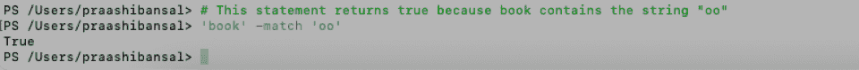 | 这些允许您一次匹配任意数量的字符，而[^character 组]只匹配不在该组中的字符。 |
| 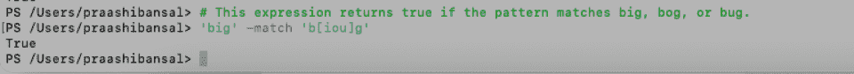 | 模式也可以是一系列字符。字符可以是字母[A-Z]，数字[0-9]，甚至是基于 ASCII 的[ -~](所有可打印字符)。 |
| 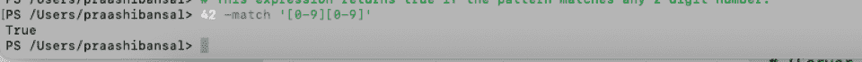 | \d 字符类将匹配任何十进制数字。相反，\D 将匹配任何非十进制数字。 |

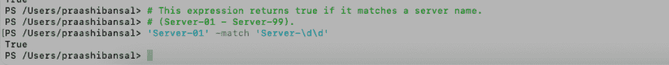

\w 字符类将匹配任何单词字符[a-zA-z0-9]。要匹配任何非单词字符，请使用\W。

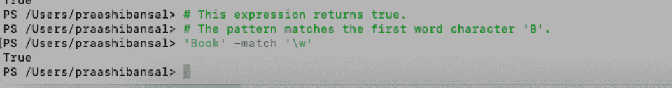

句号(。)是正则表达式中的通配符。它将匹配除换行符(\n)以外的任何字符。

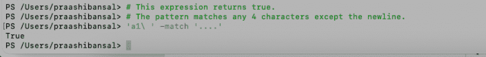

使用\s 字符类匹配空格。使用\S 匹配任何非空白字符，也可以使用原义空格字符“”。

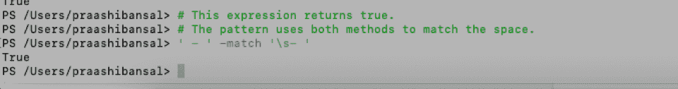

反斜杠(\)用于转义字符，这样正则表达式引擎就不会解析它们。

下列字符是保留字符:[]()。\^$|?*+{}.

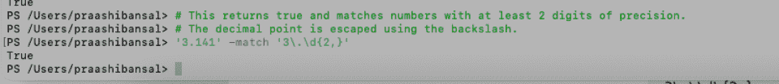

#### **正则表达式中的替换。**

**正则表达式中的替换。**

带有-replace 运算符的正则表达式允许您使用捕获的文本动态替换文本。

-替换<original>、</original>

**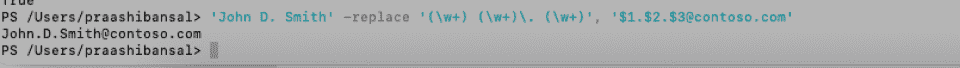**

**流量控制**

ForEach-Object 是一个 cmdlet，它允许您遍历管道中的项目，例如使用 PowerShell 一行程序。ForEach-Object 将通过管道传输对象。

*   尽管 Get-Command 的模块参数接受多个字符串值，但它仅通过使用属性名的管道输入或参数输入来接受这些值。

当指定的条件为真时,“for”循环迭代。

例如:

### *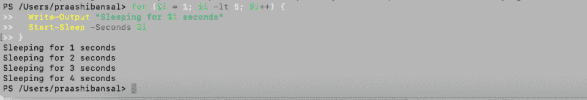*

### PowerShell 中有两个不同的“do”循环。当指定条件为假时，执行*直到*运行。

**例 1:**

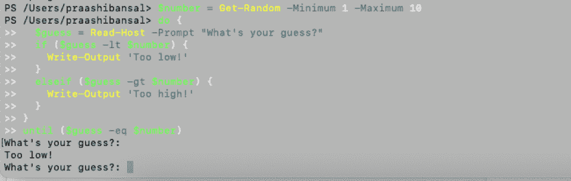

**例 2:**

```
$ComputerName = 'DC01', 'WEB01'

foreach ($Computer in $ComputerName) {

Get-ADComputer -Identity $Computer

}
```

*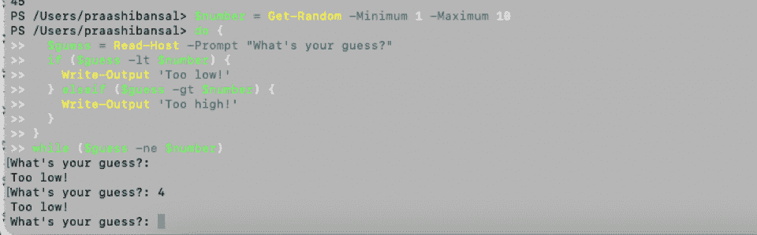*

与 Do While 循环类似，只要指定的条件为真，While 循环就会运行。然而，不同之处在于 While 循环在运行任何代码之前评估循环顶部的条件。因此，如果条件的计算结果为 false，它就不会运行。

```
for ($i = 1; $i -lt 5; $i++) {

Write-Output "Sleeping for $i seconds"

Start-Sleep -Seconds $i

}
```

例如:

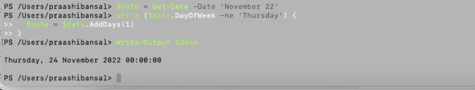

**变量**

```
$number = Get-Random -Minimum 1 -Maximum 10

do {

$guess = Read-Host -Prompt "What's your guess?"

if ($guess -lt $number) {

Write-Output 'Too low!'

}

elseif ($guess -gt $number) {

Write-Output 'Too high!'

}

}

until ($guess -eq $number)
```

PowerShell 允许您存储所有类型的值。例如，它可以存储命令结果和命令表达式元素，如名称、路径和设置。以下是 PowerShell 的一些不同变量。

**用户创建的变量:**由用户创建和维护。您在 PowerShell 命令行中创建的变量将一直存在，直到 PowerShell 窗口打开。当您关闭 PowerShell 窗口时，这些变量将被删除。如果要保存变量，需要将其添加到 PowerShell 配置文件中。您可以创建变量并用三种不同的作用域来声明它们:全局、脚本或局部。

```
$number = Get-Random -Minimum 1 -Maximum 10

do {

$guess = Read-Host -Prompt "What's your guess?"

if ($guess -lt $number) {

Write-Output 'Too low!'

} elseif ($guess -gt $number) {

Write-Output 'Too high!'

}

}

while ($guess -ne $number)
```

**自动变量:**这些变量存储 PowerShell 的状态，由 PowerShell 创建。只有 PowerShell 可以根据需要更改它们的值以保持准确性。用户不能改变这些变量的值。例如，$PSHOME 变量将存储 PowerShell 安装目录的路径。

**偏好变量:**这些变量存储用户对 PowerShell 的偏好，由 PowerShell 创建。这些变量由默认值填充，可以由用户更改。例如，$MaximumHistoryCount 变量指定会话历史中的最大条目数。

要创建一个新的变量，您需要使用赋值语句并为变量赋值。在使用变量之前，不需要声明变量。所有变量的默认值都是$null。

```
$date = Get-Date -Date 'November 22'

while ($date.DayOfWeek -ne 'Thursday') {

$date = $date.AddDays(1)

}

Write-Output $date
```

例如:

### 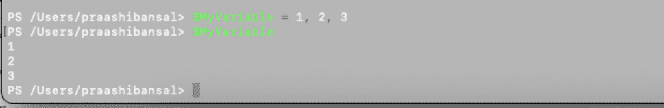

**功能**

*   使用一个 Pascal 大小写名称和一个认可的动词和一个单数名词来命名一个函数。您可以通过运行 Get-Verb 获得批准的动词列表:

*   **获取动词|排序对象属性动词**
*   **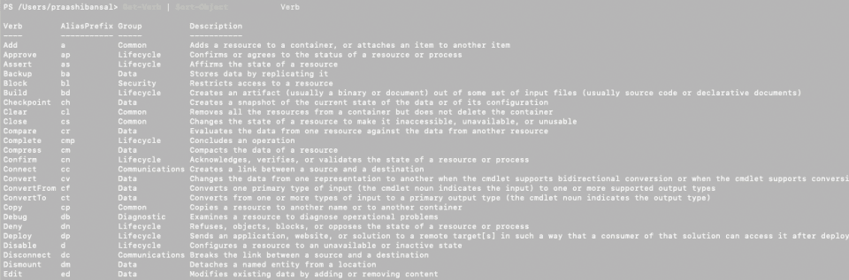**

**创建一个简单的函数**

使用 function 关键字后跟函数名来创建一个简单的函数。然后，使用一个左右花括号。该函数将执行那些花括号中包含的代码。

```
$MyVariable = 1, 2, 3

$MyVariable
```

例如:

### 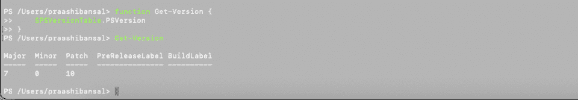

**使用模块**

模块是包含 PowerShell 成员的包，例如 cmdlets、提供程序、函数、工作流、变量和别名。您可以在 PowerShell 脚本和/或编译的 DLL 中实现包成员。首次在已安装的模块中运行任何命令时，PowerShell 会自动导入模块。您可以在模块中使用命令，而无需设置或配置文件配置。

要使用任何模块，您需要首先安装它们。然后，找到模块附带的命令并使用它们。

*   如果您以文件夹的形式获得一个模块，请在 PowerShell 命令行上使用它之前安装它。有些模块是预装的。您可以使用以下命令为当前用户创建模块目录:

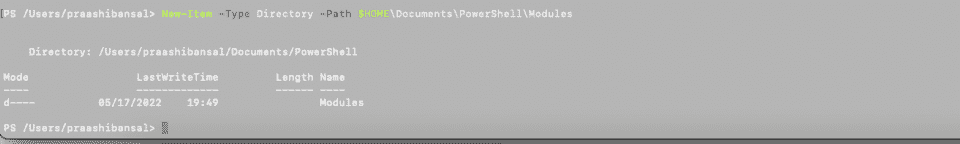

将整个模块文件夹复制到模块目录中。您可以使用任何方法复制文件夹，包括 Windows 资源管理器、Cmd.exe 和 PowerShell。

```
function Get-Version {

$PSVersionTable.PSVersion

}
```

**查找已安装的模块**

### 运行以下命令，查找安装在默认模块位置(非导入)的模块。

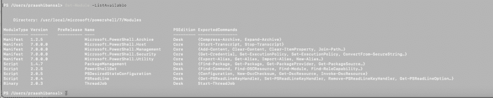

**在模块中查找命令**

运行以下命令来查找模块的命令:

```
New-Item -Type Directory -Path $HOME\Documents\PowerShell\Modules
```

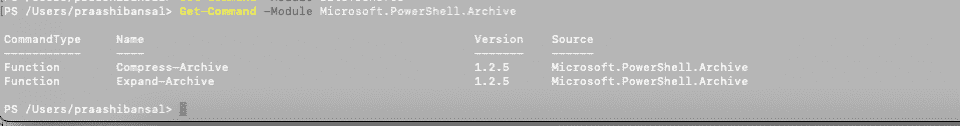

使用正确的模块名称运行以下命令:

*   您可以使用正确的模块名称运行以下命令:

**查看默认模块位置**

```
Get-Module -ListAvailable
```

使用以下命令查看默认模块位置:

*   **添加默认模块位置**

您可以使用以下命令格式:

```
Get-Command -Module <module-name>

Get-Command -Module Microsoft.PowerShell.Archive
```

**在 Linux 或 MacOS 上添加默认模块位置**

仅在 Linux 或 macOS 上，使用以下命令执行与上面相同的命令:

```
Import-Module <module-name>
```

**哈希表**

```
Remove-Module <module-name>
```

*   哈希表是一种复杂的数据结构，以键值对的形式存储数据。我们也将哈希表称为字典或关联数组。要理解哈希表，请考虑一系列 IP 地址和相应的计算机名称。哈希以键-值对的形式存储这些数据，其中 IP 地址指的是键，计算机名指的是它们对应的值。

哈希表语法如下:

```
$Env:PSModulePath
```

*   有序字典的语法如下:

如果要创建哈希表，请按照下列步骤操作:

```
$Env:PSModulePath = $Env:PSModulePath + ";<path>"
```

*   哈希表以 at 符号(@)开始，并用花括号({})括起来。

哈希表应该包含至少一个键值对，因此，在创建哈希表后输入数据。

```
$Env:PSModulePath += ":<path>"
```

### 使用等号(=)将键与其值分开。

用分号(；)分隔哈希表中的键/值对；).

用引号将键之间的空格括起来。值必须是有效的 PowerShell 表达式。另外，用引号将字符串括起来，即使它们之间没有空格。

```
@{ <name> = <value>; [<name> = <value> ] ...}
```

将哈希表保存为变量，以便有效地管理它。

```
[ordered]@{ <name> = <value>; [<name> = <value> ] ...}
```

将有序哈希表赋给变量时，将[ordered]属性放在@符号之前。如果将它放在变量名之前，该命令将失败。

*   例如:
*   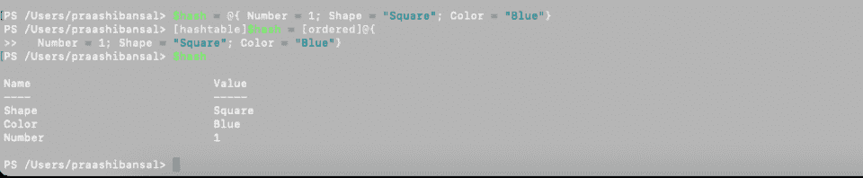
*   **添加和删除键和值**
*   要向哈希表添加键和值，请使用以下命令格式:
*   **$ hash["<key>"]= "<value>"**
*   例如，您可以使用以下语句格式将值为“Now”的“Time”键添加到哈希表中:
*   或者

或者，您可以使用以下语句格式删除密钥:

```
$hash = @{}

$hash = @{ Number = 1; Shape = "Square"; Color = "Blue"}

[hashtable]$hash = [ordered]@{

Number = 1; Shape = "Square"; Color = "Blue"}

$hash
```

**异步事件处理**

*   这些 cmdlets 允许您注册和注销事件订阅，并列出现有订阅。您还可以列出未决事件，并根据需要处理或删除它们。

PowerShell 事件 cmdlets

**事件 Cmdlet 名称**

**描述**

```
$hash["Time"] = "Now"
```

注册对象事件

```
$hash.Add("Time", "Now")
```

此 cmdlet 为生成的事件注册事件订阅。网络对象

```
$hash.Remove("Time")
```

### 注册-WmiEvent

为 WMI 对象生成的事件注册事件订阅

注册引擎事件

| 为 PowerShell 自身生成的事件注册事件订阅 | 获取事件订阅者 |
| 获取会话中已注册事件订阅的列表 | 注销-事件 |
| 移除一个或多个已注册的事件订阅 | 等待事件 |
| 等待事件发生。此 cmdlet 可以等待特定事件或任何事件。它还允许指定超时，限制等待事件的时间。默认是永远等待。 | 获取事件 |
| 从事件队列中获取挂起的未处理事件 | 移除-事件 |
| 从事件队列中移除挂起的事件 | 新事件 |
| 在脚本中调用此 cmdlet，以允许脚本将其自己的事件添加到事件队列中 | **结论** |
| 底线？PowerShell 备忘单是与 PowerShell 语法和命令相关的所有内容的一站式商店。在这个 Windows PowerShell 命令备忘单中，我们讨论了所有的基础知识，甚至可以帮助初学者浏览 PowerShell。 | 像任何其他编程语言一样，您可以使用变量和操作符，创建别名和函数，甚至维护流控制。 |
| 如果您正在为即将到来的面试做准备，请将 PowerShell 5.0 备忘单放在手边，以便快速参考简单的示例。 | 有兴趣使用 Windows 命令行扩展您的知识吗？ |
| [查看我们的 Windows 命令行备忘单](https://hackr.io/blog/windows-cli-cheat-sheet) | **常见问题解答** |

## **1。如何获取 PowerShell 命令列表？**

您可以使用 get-命令。

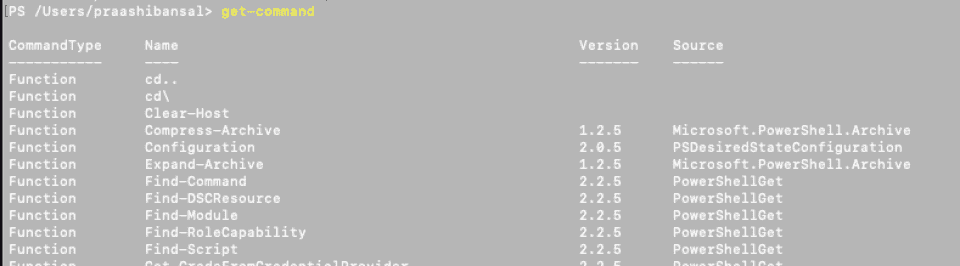

**2。PowerShell 命令有多少个？**

PowerShell 中有超过 200 个命令。

**3。初学者如何学习 PowerShell？**

## 你可以考虑使用微软的 PowerShell 入门指南。它包括简单的语言和简单的例子，以增强您的理解。

#### **4。Windows PowerShell 和命令提示符一样吗？**

下表强调了 PowerShell 和命令提示符之间的主要区别:

**PowerShell**

#### **命令提示符**

2006 年推出

#### 1981 年推出

适用于批处理命令和 PowerShell cmdlets

#### 仅适用于批处理命令

允许您为 cmdlets 或脚本创建别名

| 不支持创建命令别名 | 允许您将 cmdlet 的输出传递给其他 cmdlet |
| 不允许您将一个命令的输出传递给其他命令 | 输出是对象的形式 |
| 输出只是文本 | 可以在脚本中执行一系列 cmdlets |
| 要求一个命令在另一个命令之前完成 | 有编程库，因为它是建立在。net 框架。 |
| 没有编程库 | 与 WMI 无缝集成 |
| WMI 互动需要外部插件 | 支持 Linux 系统 |
| 不支持 Linux 系统 | 运行所有程序类型 |
| 仅运行控制台类型的程序 | **5。如何让命令提示符代替 PowerShell 成为默认？** |
| 打开设置>个性化>任务栏。现在，把菜单中的“用 Windows PowerShell 替换命令提示符”当我右击开始按钮，或者按 Windows 键+X”选项为“关”。 | **人也在读:** |
| Supports Linux systems | Doesn’t support Linux systems |
| Runs all program types | Only runs console type programs |

#### **5\. How Can I Make Command Prompt Default Instead of PowerShell?**

Open Settings > Personalization > Taskbar. Now, turn the “Replace Command Prompt with Windows PowerShell'' in the menu when I right-click the Start button, or press Windows key+X” option to “Off”.

**People are also reading:**