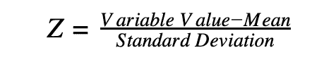
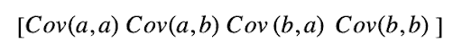

# 理解主成分分析[概述]

> 原文：<https://hackr.io/blog/principal-component-analysis>

随着技术世界的不断变化，跟上技术领域的发展是至关重要的。[机器学习和人工智能](https://hackr.io/blog/ai-vs-machine-learning)是当今市场上一个持续的趋势。主成分分析也是其中之一；这个关于主成分分析的博客帮助你理解有效处理高维数据背后的科学。

在日常的现实世界中，我们需要分析复杂的数据，即多维数据。对绘制的数据和各种隐藏模式进行研究和分析，以训练一些机器学习工具。

## **什么是主成分分析？**

主成分分析(PCA)是一种降维技术，它使您能够识别数据集中的相关性和模式，以便将其转换为维度显著降低的数据集，而不会丢失任何重要信息。

实现 PCA 的主要动机是在给定的数据集中找出独特的模式和相关性。当发现数据集和变量之间有很强的相关性时，就要做出减少数据的最终决定，这样就可以在构建最终数据时保留重要数据。

PCA 是在解决高度复杂且涉及使用高维数据集的数据驱动问题时必不可少的过程。

### **主成分分析的必要性**

当给训练者或机器的数据大而简洁时，机器学习效果最好。拥有大量数据通常有利于获得更好的结果和准确性，因为我们有大量数据来训练机器，但它也有自己的一系列问题和缺陷。最糟糕的是维数灾难。

在高维数据集中，数据集中的特征和冗余数据可能存在许多不一致，这增加了机器的计算时间。

为了摆脱这些问题，我们需要一个过程来简化数据，同时仍然保留用于机器学习的重要数据。降维技术可以用来过滤训练所需的有限数量的重要特征，这就是 PCA 的用武之地。

### **主成分分析的计算**

使用 PCA 执行降维的步骤如下:

1.  数据的标准化
2.  计算协方差矩阵
3.  计算特征向量和特征值
4.  计算主成分
5.  减少数据集的维数

让我们详细讨论每个步骤:

#### **1。数据标准化**

在数据分析和处理中，标准化非常重要，没有数据的标准化，我们得到的结果很可能是有偏见的和不准确的。标准化是以一种所有变量及其值都在相似范围内的方式来缩放数据。

例如，让我们取两个数据集，一个在 25-200 之间，另一个的值在 100-2000 之间。在这种情况下，我们将从这些预测值中获得的结果会由于不均匀的间隔而有偏差，因为范围较大的数据集将对机器的结果产生更大的影响。

所以，标准化成一个可比较的范围真的很重要。标准化是通过从平均值中减去数据中的每个值，然后除以数据集中的总偏差来实现的。

#### **2。协方差矩阵计算**

PCA 有助于识别数据集中特征之间的相关性和依赖性。数据集中不同变量之间的相关性通过协方差矩阵来表示。识别包含冗余和有偏信息的高度相关变量是很重要的，这些变量会随着结果而改变，并降低任何特定系统的性能。

在数学中，协方差矩阵是 P ×P 矩阵，其中 P 表示任何指定数据集的维数。

让我们考虑这样一种情况，我们有一个二维数据集，其中“a”和“b”是两个变量；那么协方差矩阵将表示为

## 

我们可以从上面的矩阵中得出一些结论:

*   Cov(a，a)是变量与其自身的协方差，也就是 a 的方差。
*   Cov(a，b)向我们展示了“a”相对于“b”的协方差。因为协方差是可交换的，所以 Cov(a，b) = Cov(b，a)

#### **3。特征向量和特征值计算**

特征向量和特征值是数学构造，必须从协方差矩阵计算，以确定数据集的主要组成部分。

但是什么是数据集的主成分，让我们先了解更多关于主成分的知识，

**什么是主成分**

主成分可以被描述为从变量的初始 ser 的处理中获得的新的变量集。计算主成分，例如一组新的高度重要且相互独立的变量。这些新的变量集拥有在初始阶段分散在初始变量中的最重要和最有用的信息。

如果你有一个 5 维的数据集，那么从这些维度计算出 5 个主成分，第一个主成分存储最大可能的信息，第二个主成分存储剩余的最大信息，以此类推，你明白了。

现在回到特征向量和特征值，

特征向量和特征值是总是成对计算的两个代数公式。对于每个特征向量，都有一个特征值。数据中的维数决定了需要计算的特征向量的数量。

让我们考虑一个 2-D 数据集，其中两个特征向量是用它们的特征值计算的。计算特征向量和特征值背后的思想是知道数据中哪里存在最大的方差。方差越大，关于该数据的信息就越多，这就有了增强系统的方法。特征向量用于识别和计算主成分。

*特征值也可以解释为各个特征向量的标量。因此，特征向量和特征值将计算数据集的主成分。*

#### **4。主成分计算**

一旦完成我们的特征向量和特征值的计算，我们必须按降序排列它们，其中包含最大值的特征向量是最重要的，因此形成系统的第一主分量。重要性较低的主要成分可以被剔除，以减少数据的维数。

在最后一步，我们必须形成一个称为“特征矩阵”的矩阵这是计算主成分的一个重要步骤。特征矩阵包含所有包含或拥有关于数据的最大信息的数据变量。

[机器学习 A-Z:Python&R in Data Science【2023】](https://click.linksynergy.com/link?id=jU79Zysihs4&offerid=1045023.950390&type=2&murl=https%3A%2F%2Fwww.udemy.com%2Fcourse%2Fmachinelearning%2F)

#### **5。减少数据集的维度**

主成分分析的最后一步是用主成分的最终集合重新排列数据，主成分代表了关于数据集的最大和最重要的信息。你需要把原始数据集的转置和得到的特征向量的转置相乘，用新形成的一组主成分替换原始数据轴。

这结束了 PCA 背后的理论过程。

### 结论

PCA 是一种广泛使用的自适应描述性数据分析工具。它还具有许多适应性，使其适用于多个学科中的各种数据类型和情况。PCA 的适应已经被建议用于二进制数据、顺序数据、组合数据、离散数据、符号数据或具有特殊结构的数据。主成分分析相关方法在其他统计方法中发挥着重要的直接作用，如线性回归和个体与变量的聚类。对应分析、典型相关分析或线性判别分析等方法可能与 PCA 有松散的联系。

主成分分析有大量文献，跨越多个学科。新的适应和方法的结果，以及应用，仍在出现。

**人也在读:**