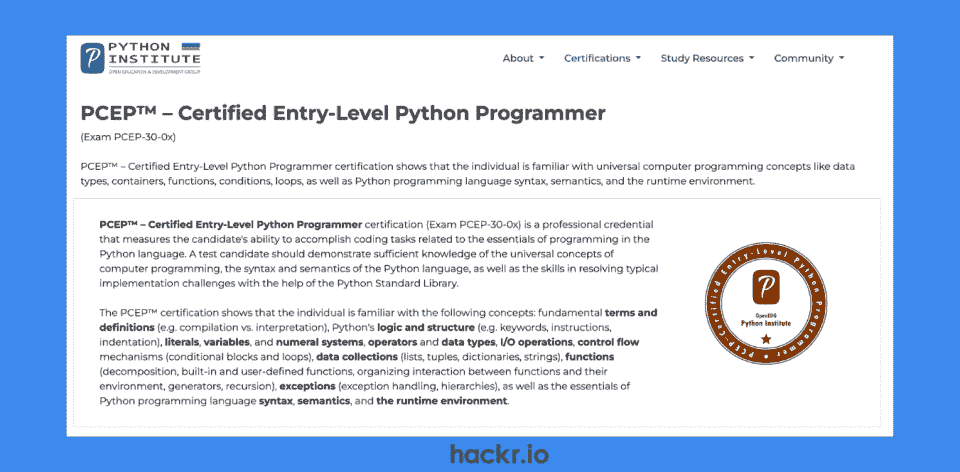
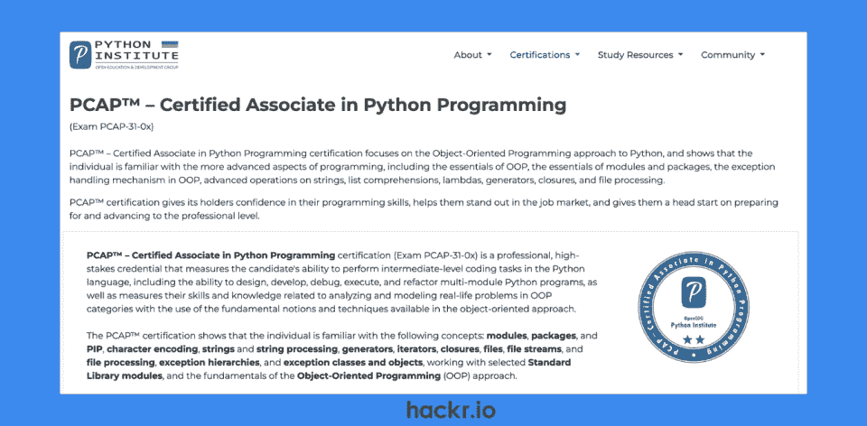
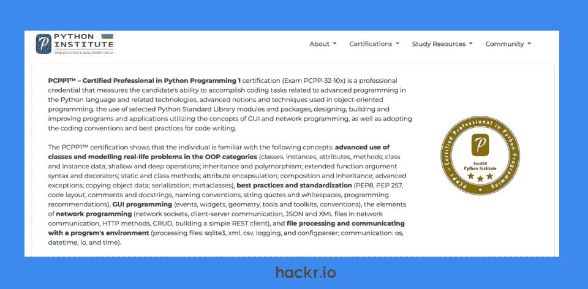
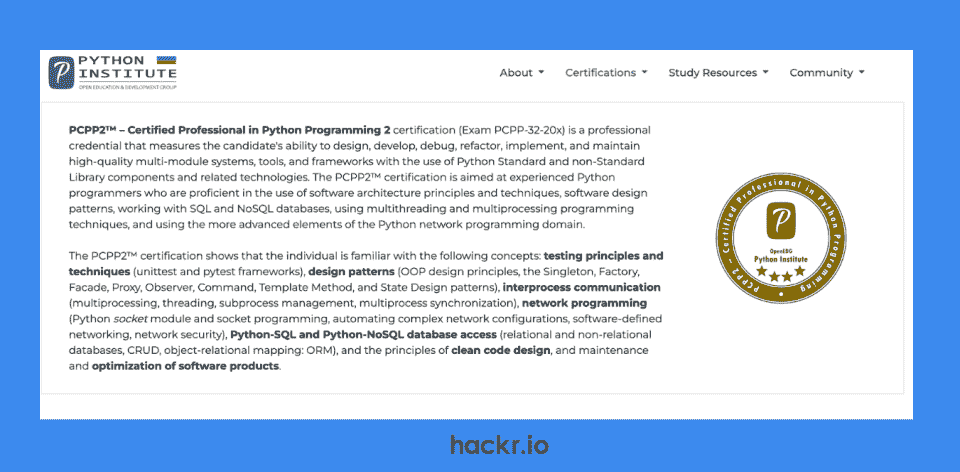
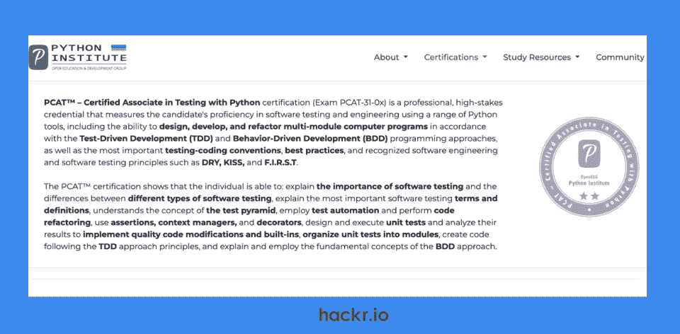
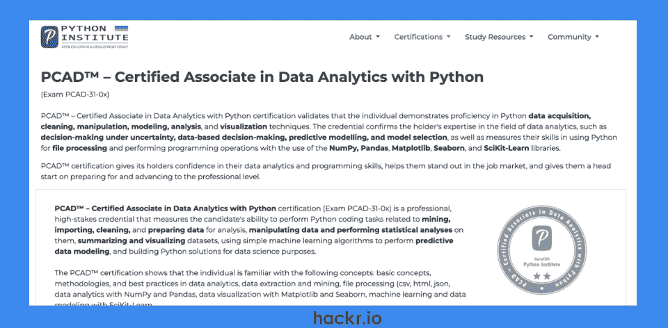

# 2023 年从初学者到专业人员的 6 个最佳 Python 认证

> 原文：<https://hackr.io/blog/python-certification>

凭借直观易学的语法、丰富的第三方库以及随时准备提供帮助的庞大社区， [Python 语言](https://hackr.io/blog/python-programming-language)成为使用最广泛的语言之一也就不足为奇了。

[在最新的 Stack Overflow 开发者调查中，近 50%的受访者选择 Python 作为最受欢迎的语言](https://survey.stackoverflow.co/2022/#technology-most-popular-technologies)，近 44%的专业开发者将 Python 作为各种软件工程学科和行业的首选语言。

无论您是一名有抱负的 Python 开发人员、数据科学家，还是一名专注于持续专业发展(CPD)的经验丰富的员工工程师，Python 认证都是专业验证和展示您的 Python 技能的绝佳方式。

本文将涵盖 2023 年可用的 6 个最佳 Python 认证。从入门级到经验丰富的专业人员，我们将涵盖您需要知道的一切，包括通过考试所需的技能、考试形式、模拟考试可用性、价格点等。

准备好了吗？我们走吧！

## **什么是 Python 认证？**

不要与 Python 证书混淆，Python 证书通常是在你参加并完成 [Python 课程](https://hackr.io/blog/best-python-courses)后授予的，Python 证书是行业公认的验证你能力和专业知识的方法。

要获得 Python 认证，您必须在参加并通过测试您在 Python 编程各个方面的技能和知识的考试之前满足先决条件。

Python 的这些认证可能是针对一般编程的，也可能强调自动化测试或数据分析等特定学科。你经常需要通过在线文档或 [Python 书籍](https://hackr.io/blog/best-python-books-for-beginners-and-advanced-programmers)来刷新你对重要概念和理论的记忆。

有必要指出的是，Python 编码证书更容易获得，它可以成为你通过 T4 的 Python 课程或 Python 训练营进入 T2 学习 Python 的敲门砖。但是本文关注的是由一个公认的机构授予的 *Python 认证*。

2023 年，如果你想获得 Python 认证，唯一的展会似乎是 Python 研究所。微软曾经为 Python 新人提供[认证，但现在已经取消了这个考试。](https://learn.microsoft.com/en-us/certifications/exams/98-381)

有谁比 Python 研究所更适合获得您的认证呢？名字里就有！

**[100 天代码:2023 年](https://click.linksynergy.com/deeplink?id=jU79Zysihs4&mid=39197&murl=https%3A%2F%2Fwww.udemy.com%2Fcourse%2F100-days-of-code%2F)** 完整 Python Pro Bootcamp

## **选择最佳 Python 认证**

如果您不确定哪种 Python 科学认证最适合您，请在做出选择之前考虑以下标准。

*   **所需技能:**你是否具备必要的技术和理论技能？
*   **费用:**你能负担得起考试和潜在实践测试的投资吗？
*   **更新期:**您的认证有效期是多久？需要定期续费还是根本不需要续费？

## **2023 年 6 大最佳 Python 认证**

****

**我们为什么选择这个**

作为进入 PCAP(助理级别)的敲门砖，这一入门级 Python 认证验证了您使用 Python 语言完成基本任务的能力。

要通过 PCEP 考试，你需要对 Python 编程技能、语法和语义、编译和解释的区别、控制流(条件和循环)、数据集合、变量和数据类型、运算符、I/O 操作、函数和异常处理有扎实的理解。

**先决条件:**无

**价格:**

*   仅考试: $59 单次(PCEP-30-02)
*   **考试+模拟考试:** $71 单次(PCEP-30-02)

**有效期:**寿命

**总考题:** 30

**内容:**单项&多选、填空、补码、插码

**考试时长:** 40 分钟

**考试地点:**网上

**及格分数:** 70%

最适合谁？入门级 Python 程序员或软件开发人员

[在此注册](https://pythoninstitute.org/certification/pcep-certification-entry-level/)

****

**我们为什么选择这个**

如果您已经获得了 PCEP，或者您熟悉更高级的 Python 编程技能，PCAP 是一个很好的认证选择，可以展示您设计、编写、调试和重构复杂 Python 程序(包括多模块应用程序)的能力。

要通过 PCAP 考试，你需要了解 Python 语言标准库、PIP、面向对象编程(OOP)、模块和包、异常处理以及字符串、lambda 函数、生成器、列表理解和文件处理的高级用法。

**先决条件:**无

**价格:**

*   仅考试: $259 单次(PCAP-31-03)
*   **考试+模拟考试:** $319 单次(PCAP-31-03)

**有效期:**寿命

**考试总题:** 40 题

**内容:**单项&多项选择

**考试时长:** 65 分钟

**考试地点:**网上(或授权考点)

**及格分数:** 70%

最适合谁？初级 Python 开发人员，或希望转向 Python 的软件开发人员

[在此注册](https://pythoninstitute.org/pcap)

****

**我们为什么选择这个**

PCPP1 是为通过 PCAP 的 Python 编程专业人员设计的，是 Python 研究所两部分专业认证课程的第一阶段。

这种高级 Python 认证向未来的雇主展示了你在各个领域的高级 Python 技能，包括 Python 标准库、函数语法(扩展参数、装饰符等)，以及编码标准化(PEP8、PEP 257、代码布局等)。

为了通过考试，你还需要有高级的 OOP 知识(继承，多态，等等。)、GUI、事件驱动编程、网络编程(HTTP 方法、数据格式)以及简单的 REST 客户端。

您还应该能够展示各种格式(XML、CSV 等)的文件处理的扩展知识。)和异常处理，构建通过 PCAP 所需的技能。

先决条件: PCAP

**价格:** $195 仅考试，单次(PCPP-32-101)

**有效期:**寿命

**总考题:** 45

**内容:**单项&多项选择

**考试时长:** 65 分钟

**考试地点:**网上(或授权考点)

**及格分数:** 70%

最适合谁？寻求职业发展的初级和中级开发人员，或者希望展示 Python 高级知识的团队领导

[在此注册](https://pythoninstitute.org/pcpp1)

****

**我们为什么选择这个**

Python 研究所专业认证课程的第二阶段，PCPP2 通过展示您对 Python 语言的高级知识来完成您的一般 Python 编程认证之旅。

要通过考试，你需要牢固掌握 Python 设计模式(OOP、Singleton、Factory 等)。)、网络和通信、多线程和进程管理、高级标准和非标准库模块、创建和使用 SQL 和 NoSQL 数据库、单元和功能测试框架以及干净代码原则。

该 Python 认证将向潜在雇主展示 Python 专业知识的高级水平，对整个软件设计生命周期的理解，分析和设计技能，以及在各种行业中从事小型到大型多模块项目的能力。

*请注意，从 2023 年 H2 奥运会开始，就可以参加这项考试。*

先决条件: PCPP1(和 PCAP)

**有效期:**寿命

**价格:** $195 仅考试，单次(PCPP-32-201)

**总考题:** 45

**内容:**单项&多项选择

**考试时长:** 65 分钟

**考试地点:**网上(或授权考点)

**及格分数:** 70%

最适合谁？经验丰富的开发人员、工程师、系统架构师和团队领导

[在此注册](https://pythoninstitute.org/pcpp2)

****

**我们为什么选择这个**

作为最新的 Python 研究所认证之一，PCAT 是针对 Python 助理级别的软件测试的专业化认证。这个证书向雇主表明你理解软件测试和自动化的重要性，不同的测试方法，以及测试如何通过重构来加强软件开发。

要通过考试，你需要了解软件测试原则和最佳实践、单元测试基础、软件分解、D.R.Y(不要重复自己)软件工程和 F.I.R.S.T(快速、独立、可重复、自我验证和及时)测试。

您还需要精通测试驱动开发(TDD)和行为驱动开发(BDD)这两种流行的软件开发方法。

PCAT 还使您有资格在 2023 年底获得 Python 研究所在单元测试(PCPT1)、测试自动化(PCPT2)和安全性(PCPT3)方面提供的专业级认证。

*请注意，从 2023 年 Q1 奥运会开始，就可以参加这项考试。*

**先决条件:**无

**有效期:** 5 年

**价格:**

*   仅考试: $295 单次(PCAT-31-0x)
*   **考试+模拟考试:** $319 单发(PCAT-31-0x)

**考试总题:** 40 题

**内容:**单项&多项选择

**考试时长:** 65 分钟

**考试地点:**网上(或授权考点)

**及格分数:** 70%

最适合谁？有在职经验的初级 Python 开发人员或测试工程师

[在此注册](https://pythoninstitute.org/pcat)

****

**我们为什么选择这个**

PCAD Python 研究所的另一项新服务是数据分析助理级认证，以验证您在数据获取、清理和争论、建模和分析以及 Python 可视化方面的熟练程度。

该 Python 认证是展示数据分析方面全面技能和全面知识的可靠方式，包括关键概念和方法以及最佳实践。

要通过考试，您需要熟悉数据科学和分析环境中的统计分析、预测建模和模型选择、机器学习以及流行的 Python 库，如 NumPy、pandas、Matplotlib、SK-Learn 和 Seaborn。

PCAD 认证也将是 Python 研究所在 2023 年底或 2024 年初提供的数据分析(PCPD)专业级认证的先决条件。

*请注意，从 2023 年 Q1 奥运会开始，就可以参加这项考试。*

**先决条件:**无

**有效期:** 5 年

**价格:**

*   仅考试: $295 单次(PCAD-31-0x)
*   **考试+模拟考试:** $319 单发(PCAD-31-0x)

**考试总题:** 40 题

**内容:**单项&多项选择

**时长:** 65 分钟

**及格分数:** 70%

最适合谁？初级 Python 开发人员、数据分析师、数据科学家或软件开发人员，希望转向以数据为中心的职位

[在此注册](https://pythoninstitute.org/pcad)

## **结论**

在最新的[Stack Overflow developer survey](https://survey.stackoverflow.co/2022/#technology-most-popular-technologies)中排名前四，Python 仍然是最受欢迎的编程语言之一，这是因为它简单直观的语法、大量强大的库和强大的志同道合的开发人员社区。

无论您是数据科学家、经验丰富的员工工程师、初级开发人员，甚至是希望获得第一份工作的有抱负的 Python 程序员，Python 认证都是专业验证您的 Python 技能的理想方式。

本文涵盖了 2023 年可用的 6 个最佳 Python 认证。从早期职业开发人员到经验丰富的专业人员，总有适合您的东西。

2023 年，你在寻找提升 Python 技能的方法吗？查看我们的列表:

**[30 个最佳 Python 项目](https://hackr.io/blog/python-projects)**

## **常见问题解答**

#### **1。哪个认证最适合 Python？**

最好的 Python 编码认证取决于你的技能水平、经验、职业目标，以及你是否想要一个专业的认证而不是通用编程的认证。

本文包含了一系列针对不同技能和经验水平的通用编程认证，以及针对测试和数据分析专业的认证。

#### **2。Python 认证有多难？**

如果您考虑入门级的 PCEP，如果您了解 Python 基础知识，这应该不是一个挑战。相比之下，PCPP1 和 PCPP2 Python 专家认证考试要求你是一名具备高级 Python 语言技能的 Python 编程专家。

Python 开发者认证考试应该具有足够的挑战性，以确保你具备成为该证书大使所需的知识。为了帮助你通过考试，研究考试内容，参加模拟考试，学习网上资源和 [Python 书籍](https://hackr.io/blog/best-python-books-for-beginners-and-advanced-programmers)，考虑 [Python 课程](https://hackr.io/blog/best-python-courses)。

#### **3。一个 Python 认证多少钱？**

Python 认证费用取决于级别以及你是否愿意支付额外的练习测试。我们所涉及的 Python 认证从 59 美元到 295 美元不等，取决于您希望获得的认证级别。

#### **4。可以免费获得 Python 认证吗？**

如果你想获得 *Python 认证*，你需要支付认证考试的费用。

这些不应该与完成后提供 Python 编程证书的免费课程相混淆，因为这些课程比行业认可的证书更容易获得。

#### **5。一个 Python 证书值得吗？**

这取决于你的职业抱负和目标。通常，行业认可的认证可以通过专业地验证您的 Python 技能来增强您的简历，这可能会使您在申请工作时比其他候选人更有优势。

#### **6。做了 Python 认证可以就业吗？**

成为一名认证的 Python 程序员向任何潜在的雇主表明，你对你的职业是认真的，但不要因为你获得了 Python 认证就期望得到一份工作。

你仍然需要满足这份工作其余的教育或基于经验的要求。你还需要在每个面试阶段给人留下深刻印象，无论是预先筛选、技术编码挑战，还是与潜在团队领导和团队成员的最后阶段面试。

**查看我们关于**[**65 强 Python 面试问答**](https://hackr.io/blog/python-interview-questions) **的文章，帮助准备。**