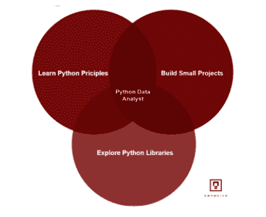

# 用于数据分析的 Python

> 原文：<https://hackr.io/blog/python-for-data-analysis>

正如我们所知，编程中的数据分析是一个过程，通过这个过程，收集的数据和信息在不同软件和程序的帮助下进行处理、排列和分类，以便它们可以被仔细检查并用于洞察。简而言之，它是将原始数据转化为研究、观察和输入。一个公司要运作，他们需要自省，他们通过一个包括收集数据的既定机制来实现这一点。所述数据可以是反馈、模式观察或对公司财务运作的简单洞察。

对这些数据进行有组织的研究和分析可以帮助公司了解其运作情况，了解顾客和客户对此的反应，并从第三方角度审视其表现。我们想说的是，数据分析是任何公司运营的必备工具，应该同样对待。最好的软件和编程应该由它的功能来支配，以便可以实现所需的细微差别。

考虑到数据分析在一个公司中的中心位置，很少有[编程语言](https://hackr.io/blog/best-programming-languages-to-learn)可以被信任，Python 已经成为最受信任的语言之一。

Python 是全球业界最可靠的编程语言之一，多达 44%的数据分析师信任它。它的客户忠诚度出现了前所未有的增长，这一切都来自于它所服务的各种功能以及它对数据解密所采用的整体方法。它并不局限于一个简单的任务，而是带有各种各样的应用程序和其他程序，使您的工作有组织和高效。它也是一种通用编程语言，这意味着它可以用于多种目的，并且不局限于任何人的操作。

## 用于数据分析的 Python

设置和开始使用 Python 一点也不困难，但是如果您是整个领域的新手，您可能会发现自己在许多情况下不知所措。即使您已经设置了程序并使其运行，您可能还不知道它的许多方面，并且您可能没有充分利用 Python 的效率。因此，我们制定了一个循序渐进的指导方针，你可以按照它来设置程序并让它运行。

### **步骤 1:设置 Python 环境**

在运行 Python 程序之前，您需要设置一个运行和运行 Python 程序的环境。这是程序的语言范围，也是一个相对简单的过程。获得 Anaconda 包是免费的，它包含语言和许多库，如 [NumPy](https://hackr.io/blog/numpy-matrix-multiplication) 、Pandas、SciPy、Matplotlib。安装软件包将会让许多程序在你的计算机上运行，其中最重要的是 iPython 笔记本。这不需要互联网连接，因为它使用计算机浏览器开始。

### **第二步:学习基础知识和基本原理**

Python 是一种计算机语言，其深度不是通过一本简单的手册或指南就能理解的。它需要专业的培训和指导，几个在线课程就能获得同样的效果。如果你对这个项目不太熟悉，你可以随时申请这些课程，而且这些课程很充足，也很方便。其中一些课程也是免费的，它们将教你操作 Python 的基础知识，并让你了解 Python 的基础知识。这将有助于你掌握它，你将更好地处理和利用它，以获得最大的利益。

推荐 Python 课程

### [用 Python 完成从零到英雄的 Python boot camp](https://click.linksynergy.com/deeplink?id=jU79Zysihs4&mid=39197&murl=https%3A%2F%2Fwww.udemy.com%2Fcourse%2Fcomplete-python-bootcamp%2F)

**第三步:了解不同的 Python 包**

### 正如我们提到的，Python 是一种通用编程语言，而不是一种特定的语言。这就是为什么它不仅用于解码数据或数据组织，而且包括广泛的库和程序，使数据分析过程完整。因此，您必须了解不同的 Python 包，其中包含不同的程序。你必须知道不同程序的特点和它们的用途。这样，你将能够得到一个最适合你需求的套餐，你也可以为自己策划一个可行的套餐。

**步骤 4:用数据集练习**

### 掌握任何[编程语言](https://hackr.io/blog/what-is-programming-language)最有效的方法是通过实践，在 Python 中也可以做到同样的情况。接触数据集并对其进行实践，不仅能让你掌握使用数据集的技能，还能探索使用数据集的多种方式。你可以探索自己的技能，不受任何人对同一程序操作的限制。您还可以了解自己的优势和劣势，并通过举例和排除特定的优势和劣势来掌握 Python。

**第五步:操作数据**

### 一旦你学会了如何处理数据，你就可以对你将要收到的真实数据做同样的事情。你接收到的数据通常处于非常原始的状态，除非经过组织和标记，否则没有多大意义。这种数据的组织、清理和评估可以在 Python 中各种程序的帮助下完成。你必须熟悉不同程序的不同功能，并将数据输入这些程序，这样你就可以处理和操作收到的数据。

**第六步:可视化数据**

### 在数据分析中使用图像的情况每天都在增加。这是因为它有许多平台和呈现方式，以及它安全和可访问地解释数据的方式。Matplotlib 是用于此功能的 [Python 库](https://hackr.io/blog/top-python-libraries),它以图形、有向图、流程图等可视化形式执行数据。这使得阅读数据变得有趣，也为你提供了一个可以在外行人的平台上使用的生产者，比如你的网站。这使它在视觉上更具吸引力，并创建一个透明的图像。

**步骤 7:数据分析**

### Python 的核心用途不仅在于数据的表示和解密，还在于理解数据。上面提到的过程是理解一个人的业务的更大目标的一部分。许多这种理解可以是手动的，但是通过使用 Sci-kit Learn 和 Stats 模型等程序，您可以获得数据的结果。你将得到一份报告，以后可以讨论和确定。数据分析的用途就在这里，这里的数字没有意义，但只要一点点帮助，你就能对它们的表现有所了解。

摘要

## 以上步骤将引导您开始使用 Python 进行数据分析。这是一个简单的机制，只需要练习就能掌握。使用数据手册和样片是最好的方法。我们都知道数据分析的使用在一个公司中有多重要。一个没有 it 的公司没有发展和改进的空间。因此，数据分析是一家公司采用的增长曲线。我的代理机构也提供同样的服务，获得他们的帮助不成问题。他们会有专业的经验和必要的技能来为你提供你所寻找的东西。然而，对于许多小公司和企业来说，这不是一个财务上可行的选择。遵循这些程序可以方便你掌握它，也可以用来开发一个内部团队来为你钻研它。

[数据科学社区](https://community.ibm.com/community/user/datascience/home)也对这个程序的简单和容易发誓。Python 是世界上最早的通用编程语言之一。因为太多的原因，它赢得了它的名声。首先，它有一个不同的库，在不同的分析阶段为用户服务，并在许多其他方面帮助他们。第二，它的各种功能使它出名，这就是为什么它使用起来相对容易和方便。在线教程和帮助的数量使它非常容易获得。第三，它对用户非常友好，可以根据简单的命令提供服务。这许多原因也足以支持它的流行和程度。

**人也在读:**

**People are also reading:**