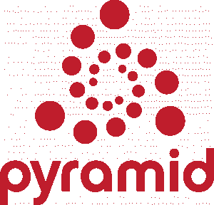

# Web 开发需要学习的 10 个最佳 Python 框架[排名]

> 原文：<https://hackr.io/blog/python-frameworks>

**Python 程序员**需要什么才能让自己的生活更轻松？答案是框架。通过自动化冗余任务的实现，框架减少了开发时间，并使开发人员能够更专注于应用程序逻辑而不是常规元素。

因为是[领先编程语言](https://hackr.io/blog/best-programming-languages-to-learn)之一，所以 Python 的**框架并不稀缺。不同的框架有它们自己的优点和问题。因此，需要根据项目要求和开发商偏好进行选择。**

主要有三种类型的 **Python 框架**，即全栈、微框架和异步。在继续讨论 2023 年的最佳 Python 框架之前，让我们先简要了解一下各种类型的 Python 框架。

## **Python 框架的类型**

### **1。全栈框架**

这种框架是满足所有开发人员需求的一站式解决方案。典型的全栈框架通常提供表单生成器、表单验证和模板布局。

### **2。微框架**

这些是轻量级框架，不提供额外的功能和特性，比如数据库抽象层、表单验证以及特定的工具和库。使用微框架的开发人员需要手动添加大量代码和附加需求。

### **3。异步框架**

最近越来越流行的是，任何异步框架都是允许处理大量并发连接的微框架。通常，为 Python 构建的异步框架使用编程语言的 asyncio 库。

### 推荐 Python 课程

[用 Python 完成从零到英雄的 Python boot camp](https://click.linksynergy.com/deeplink?id=jU79Zysihs4&mid=39197&murl=https%3A%2F%2Fwww.udemy.com%2Fcourse%2Fcomplete-python-bootcamp%2F)

## **最佳 Python 框架**

### **1。AIOHTTP**

type-Asynchronous framework AIOHTTP 是一个非常依赖 Python 3.5+特性的 Python 框架，比如 async & awaits。Python 框架利用了 Python 的 asyncio 库，因此是一个异步框架。除了作为一个服务器 web 框架，AIOHTTP 还可以作为一个客户端框架。它提供了一个请求对象和路由器，可以将查询重定向到为处理查询而开发的函数。

**主要亮点:-**

*   允许有效地构建视图
*   中间件支持
*   可插拔路由
*   信号
*   支持客户端 WebSockets 和服务器 WebSockets，没有回调地狱

### **2。瓶子**

Type–Microframework Bottle 为使用它开发的每个应用程序创建一个单独的源文件。它是最好的 python web 框架之一。Python 的微框架最初是为构建 API 而开发的。除了 Python 标准库，Bottle 没有制作小型 web 应用程序所需的依赖性。使用 Bottle 的一个最重要的优点是，它允许开发人员更靠近硬件工作。除了构建简单的个人应用程序，Bottle 还非常适合学习 web 框架和原型的组织。

**主要亮点:-**

*   对第三方模板引擎和 WSGI/HTTP 服务器的适配器支持
*   允许从 cookies、数据、文件上传和其他 HTTP 相关元数据进行简单访问
*   内置 HTTP 服务器
*   不同数据库的插件支持
*   提供具有 URL 参数支持的请求调度路由

### **3。CherryPy**

Microframework CherryPy 是一个流行的开源、面向对象的 Python 框架，遵循极简主义的方法。微框架是最古老的 Python 框架之一，于 2002 年 6 月首次亮相。

任何基于 CherryPy 的 web 应用程序都是独立的 Python 应用程序，具有自己的嵌入式多线程 web 服务器，可以在任何支持 Python 的操作系统上运行。这种应用程序可以部署在普通 Python 应用程序能够运行的任何地方。

运行使用 CherryPy 开发的应用程序不需要 Apache 服务器。微框架允许开发人员利用任何类型的技术进行数据访问、模板化等等。

**主要亮点:-**

*   许多现成的工具，用于身份验证、缓存、编码、会话、静态内容等等
*   灵活的内置插件系统
*   符合 HTTP/1.1 的 WSGI 线程池 web 服务器
*   对覆盖、分析和测试的内置支持
*   为同时运行多个 HTTP 服务器提供了简单性
*   强大的配置系统
*   在 Android 上运行

### **4。立方网**

由 Logilab 开发和策划的全栈框架，CubicWeb 是一个免费使用的、语义的、开源的、基于 Python 的 Web 框架。基于数据模型，CubicWeb 需要定义相同的数据模型，以便开发功能应用程序。

与其他流行的使用独立视图和模型的 Python 框架不同，CubicWeb 使用了 cube。然后，在数据库、web 服务器和一些配置文件的帮助下，将多个多维数据集连接在一起以创建一个实例。

**主要亮点:-**

*   OWL(网络本体语言)和 RDF(资源描述框架)支持
*   可重用组件
*   安全工作流程
*   通过 RQL(关系查询语言)嵌入简化与数据相关的查询
*   支持多个数据库

### **5。破折号**

Type–micro framework Dash 是一个基于 Python 的开源框架，用于构建分析性 web 应用程序。对于不太了解 web 开发机制的数据科学家来说，这是一个理想的 Python 框架。

用 Dash 设计的应用程序是运行 Flask 并通过 HTTP 请求与 JSON 包通信的 web 服务器。他们的前端使用 ReactJS 呈现组件。Flask 插件可以用来扩展 Dash 的功能。

因为 Dash 应用程序呈现在 web 浏览器中，并且可以部署到服务器上，所以它们是跨平台和移动就绪的。Dash 开发人员可以访问底层 Flask 实例及其所有可配置的属性。

**主要亮点:-**

*   Dash 应用只需要很少的样板代码就可以开始使用
*   错误处理(Dash 部署服务器)
*   高度定制化
*   LDAP 集成(Dash 部署服务器)
*   插件支持
*   用于绑定 UI 控件的简单界面，包括下拉菜单、图表和滑块
*   URL 路由(Dash 部署服务器)

### **6。姜戈**

全栈框架 Django 是开发 Python 应用程序最受欢迎的 web 开发框架之一。事实上，它最终成为了 T2 最好的网络开发框架之一。Django 框架遵循 DRY(**D**on t**R**EPE at**Y**yourself)原则。

与其他框架不同，免费使用的开源全栈 Python 框架包含大量内置特性，而不是作为单独的库提供。Django 利用它的 ORM 将对象映射到数据库表。

这使得代码可以跨不同的数据库工作，也使得从一个数据库迁移到另一个数据库变得更加容易。尽管 Django 本身支持 MySQL、PostgreSQL、SQLite 和 Oracle 数据库，但它也可以通过第三方驱动程序支持其他数据库。

**主要亮点:-**

*   大量现成的库
*   认证支持
*   数据库模式迁移
*   对象关系映射器(ORM)
*   支持 web 服务器
*   模板引擎
*   URL 路由

查看使用 Django 框架的优点和缺点。

下面是编程社区推荐的[最佳 Django 教程](https://hackr.io/tutorials/learn-django)。

### **7。猎鹰**

旨在快速构建 web APIs 的微框架，Falcon 是另一个广泛使用的 Python 框架。与其他需要加载大量依赖项来构建 HTTP APIs 的 Python 框架不同，Falcon 允许开发人员构建更简洁的设计来支持 HTTP 和 REST 架构。

根据 Sanic 进行的基准测试，Falcon 能够在相同的硬件上处理大多数请求。Python 框架的目标是拥有 100%的代码覆盖率。像 LinkedIn、OpenStack 和 RackSpace 这样的大公司都在使用 Falcon。

**主要亮点:-**

*   可扩展、高度优化的代码库
*   通过中间件组件和钩子进行干请求处理
*   通过请求和响应类轻松访问标题和正文
*   Cython 支持的额外速度提升
*   惯用的 HTTP 错误响应
*   受 REST 启发的资源类和 URI 模板提供了直观的路由
*   通过 WSGI 助手和模拟进行单元测试
*   前期异常处理

### **8。烧瓶**

在 BSD 许可下可用的微框架，Flask 是另一个流行的 Python 框架。受 Sinatra Ruby 框架的启发，微框架需要 Jinja2 模板和 Werkzeug WSGI 工具包。由于它的轻量级和模块化设计，Flask 很容易适应。

Flask 允许开发人员构建一个坚实的 web 应用程序基础，在此基础上可以使用任何需要的扩展。微框架与 Google App Engine 兼容。

**主要亮点:-**

*   内置快速调试器
*   HTTP 请求处理
*   内置开发服务器
*   Jinja2 模板
*   RESTful 请求分派
*   支持插入任何 ORM
*   支持安全 cookies 来建立客户端会话
*   基于 Unicode 的
*   单元测试支持
*   符合 WSGI 1.0

想学烧瓶吗？查看这些[最佳烧瓶教程](https://hackr.io/tutorials/learn-flask)。

### **9。乔托**

Type–全栈框架基于模型视图控制器模式，Giotto 是 Python 的一个应用框架。为了让 web 设计人员、web 开发人员和系统管理员能够独立工作，Giotto 将模型、视图和控制器元素按顺序分开。

Giotto 包括控制器模块，使用户能够在 web、IRC(互联网中继聊天)和命令行上创建应用程序。

**主要亮点:-**

*   自动 URL 路由
*   使用 SQLAlchemy 的数据库持久性
*   极其简洁的代码
*   功能性污垢模式
*   通用模型和视图
*   支持 Memcache 和 Redis 的内置缓存(可用于扩展对其他引擎的支持的 API)
*   用于 HTML 模板的 Jinja2(可用于支持其他模板引擎的 API)
*   多个可插拔控制器
*   RESTful 界面，带有普通的“浏览器发布”CRUD 站点

### 10。咆哮者

受 NodeJS 和 Express/Connect 框架的启发，Growler 是一个基于 Python 的 asyncio 库编写的微型 web 框架。

与其他传统的 Python 框架不同，Growler 中的请求不是在框架中处理的，而是通过中间件技术处理的。

Growler 是 Python 框架中用于轻松快速地实现复杂应用程序的首选，其作者最初开发它只是为了简单地学习如何在最底层使用 asyncio 库。

**主要亮点:-**

*   由于缺少必需的回调和适当的 try/except 块，所以很容易看到程序流
*   支持大量开源包
*   使用 decorators 来编写干净的、可重用的代码
*   Ziapp 模块允许将整个应用程序压缩成一个单独的可执行文件

## 额外的 Python 框架

### **11。拥抱**

type–micro frameworkHug 旨在允许 Python 开发者开发一次 API，然后在任何他们希望的地方使用它。Python 框架通过提供多个接口简化了 API 开发。它被称为 Python 3 最快的 web 框架。

无论您是进行本地开发，还是通过 HTTP 或 CLI，Hug 都可以让您快速轻松地完成应用程序开发。为了让性能更上一层楼，Hug 只在需要时消耗资源，并使用 Cython 进行编译。

**主要亮点:-**

*   注释驱动的验证
*   遵循一次编写，随处使用的理念
*   内置版本管理
*   支持自动文档

### **12。更多路径**

type-micro Framework 被称为“超级 Python Web 框架”，MorePath 确保最小的设置占用空间。它是专门为尽快启动和运行大多数典型用例而设计的，包括引入 RESTful Web 服务的常见 Python 数据结构。

微框架 MorePath 是一个非常灵活的模型驱动的 web 框架。Python 框架提供的一个独特功能是，它自动将框架中定义的路径转换为链接，以创建具有最干净 URL 的应用程序。

**主要亮点:-**

*   所有视图都是通用的。在视图中重用视图
*   附带了开发 RESTful web 服务的所有必要工具
*   创建通用用户界面就像创建子类一样简单
*   可通过简单、一致、通用的扩展和覆盖机制进行扩展
*   灵活、简单且强大的权限

### 13。比重瓶

type——微框架 Pycnic 是一个面向对象的微框架，被认为是构建基于 JSON 的 API 最快的。这个小型的、独立的、针对基于 JSON 的 API 框架进行了优化，能够在大玩家中保持良好的地位。因为 Pycnic 只创建 Web APIs，所以它占用的内存最少，因此速度很快。

**主要亮点:-**

*   内置错误处理
*   能够处理基于 JSON 的请求
*   处理路由
*   对 cookies 的支持

### **14。塔架框架**

Type–全栈框架 Pylons Framework 是一个基于 Python 的开源框架，专注于应用的快速开发。该框架的设计融合了一些语言的最佳元素和属性，包括 Perl、Python 和 Ruby。

尽管可以在维护模式下使用，但是一些开发人员仍然使用 Pylons 框架，因为它能够为 web 开发提供高度灵活的结构。为了提高可重用性，全栈框架大量使用了 WSGI (Web 服务器网关接口)。

**主要亮点:-**

*   HTML 表单验证和生成
*   路线
*   基于文本的模板
*   URL 调度
*   通过 WebHelpers 基于路由配置的 URL 映射

### 15。金字塔

### 

type–全栈框架金字塔是另一个领先的 Python 框架。基于 Python 的开源 web 开发框架的主要目标是以最小的复杂性实现尽可能多的功能。

金字塔最令人向往的方面是能够与小规模和大规模的应用程序同样良好地工作。此外，有大量资源可用于根据需求扩展其能力。

**主要亮点:-**

*   灵活的身份验证和授权
*   功能装饰者
*   断言
*   渲染器
*   单文件应用程序
*   模板和资产规范
*   URL 生成

### 16。萨尼奇

Type–异步框架 Sanic 构建在 uvloop 之上，是一个简单的开源 Python 框架，专门为通过异步请求处理提供快速 HTTP 响应而开发。因此，它是 Python 的异步框架。

Sanic 支持异步请求处理程序，这使得它与 Python 3.5 的异步/等待功能兼容。这不仅提高了速度，还提供了无阻塞功能。

在使用一个进程和 100 个连接的基准测试中，Sanic 能够在一秒钟内处理多达 33，342 个请求。

**主要亮点:-**

*   能够读写 cookies
*   允许不同类型的日志记录，如访问日志和错误日志
*   基于类的视图
*   易于应用 decorators 支持的处理程序
*   插件支持
*   支持应用程序中子路由的蓝图
*   配置对象可以通过使用点符号或像字典一样进行修改

### **17。龙卷风**

Type–异步框架 Tornado 是一个开源的 Python 框架和异步网络库。除了解决 C10k 问题(简单地说就是在任何给定时间处理 10k 个连接)，异步框架还使用了非阻塞的网络 I/O。

Python 框架最初是为一家名为 FriendFeed 的公司开发的，该公司于 2009 年被脸书收购。Tornado 是构建要求高性能和数千并发用户的应用程序的理想工具。

**主要亮点:-**

*   允许实施第三方身份验证和授权方案
*   提供高质量的输出
*   实时服务
*   支持翻译和本地化
*   用户认证支持
*   Web 模板

### 18。涡轮齿轮

Type-Full-stack TurboGears 是一个面向 Python 的数据驱动、开源、全栈 web 应用框架。该框架允许开发者快速开发可扩展的数据驱动的 web 应用。

除了支持灵活而强大的 ORM，TurboGears 还提供了可理解的模板。全栈框架利用石根、Repoze、SQLAlchemy 和 WebOb 等组件，轻松快速地开发需要数据库连接的应用。

**主要亮点:-**

*   所有特性都作为函数装饰器来实现
*   可用的命令行工具
*   MochiKit JavaScript 库集成
*   多数据库支持
*   MVC 风格的架构
*   粘贴脚本模板
*   ToscaWidgets 用于简化前端设计和服务器部署的协调
*   使用 Pylons 作为 web 服务器
*   FormEncode 的验证支持

### **19。Web2Py**

对于正在寻找可扩展的全栈框架的 Python 开发人员来说，Web2Py 可能就是答案。开源 Python 框架自带基于 web 的 IDE，包括代码编辑器、调试器和一键部署。

尽管 Web2Py 允许用户用 Python 创建动态 Web 内容，但它不支持 Python 3。票务系统是 Python 框架最重要的特性之一。每当出现错误时，系统都会向用户发出一个票证。

**主要亮点:-**

*   能够在任何支持 Python 或 Java 和 Python 的虚拟主机平台上运行
*   向后兼容性
*   内置数据安全性，可防止多种常见漏洞，包括跨站点脚本、注入缺陷和恶意文件执行
*   没有安装和配置要求
*   遵循 MVC 模式
*   为国际化提供支持
*   多种协议的可读性
*   基于角色的访问控制

## **总结**

为了理解上面提到的所有(或大部分)Python 框架，您至少需要具备高级解释编程语言的中级能力。如果你想学习 Python 或者提高你的 Python 专业技能，Python 编程社区强烈推荐[Python for Everybody Specialization](https://click.linksynergy.com/deeplink?id=Vq5kdUDL6n8&mid=40328&murl=https://www.coursera.org/specializations/python)这门课程。

哪些 Python 框架应该或不应该出现在列表中？你最喜欢的 Python 框架是哪个？通过评论让我们知道。

**人也在读:**