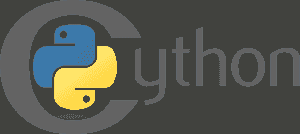
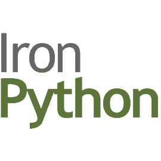
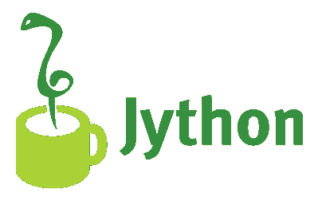
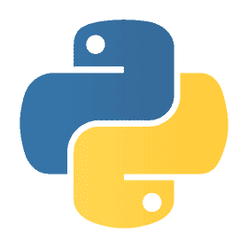

# 最佳 Python 解释器:2023 年选择最佳

> 原文：<https://hackr.io/blog/python-interpreters>

实际上，Python 是一种 Python 编程语言的规范，可以通过多种方式实现。Python 编程语言的每个实现都使用不同的解释器。

作为 2022 年发展最快的编程语言，Python 的解释者并不缺乏。但是因为每一种都迎合了特定的需求，所以你需要先搞清楚哪一种适合你。

在我们继续解释 6 个最流行的 Python 解释器之前，让我们先简要了解一下解释器。

## 什么是口译员？

根据定义，解释器是一种直接执行用某种编程或脚本语言编写的指令的计算机程序。我们所说的直接执行是指不需要先将指令编译成机器语言程序。

## **Python 解释器**

现在，让我们继续简要总结 6 个最流行的 Python 解释器:

### **CPython**

*支持*–最高 Python 3.7

它是 Python 编程语言的默认和最广泛使用的实现。用 C 和 Python 编写的 CPython 是一个解释器，它提供了与 C 和其他编程语言的外部函数接口。

CPython 也可以归类为编译器，因为它在解释之前将 Python 代码转换成字节码。它使用 GIL 全局解释器锁，这可能会造成限制，因为它禁用了进程的并发 Python 线程。

作为 Python 的参考实现，CPython 提供了与 Python 包和 C 扩展模块的最大兼容性。因此，Python 编程语言的所有版本都是用 c 实现的

CPython 是使用依赖 C 扩展才能正常工作的 Python 包的唯一选择。如果希望用 Python 编程语言开发的程序拥有尽可能广泛的受众，那么以 CPython 为目标是必须的。

### **铁皮屋顶**

*支持*–最高支持 Python 2.7

的 Python 编程语言的实现。NET 框架，IronPython 同时使用 Python 和。NET 框架库。它还可以将 Python 代码公开给与。NET 框架。

IronPython 提供了对动态编译的支持，并附带了一个交互式控制台。使用 Python 解释器允许 [与](https://hackr.io/blog/how-to-run-python-script)Python 脚本进行交互。NET 对象。通过 Visual Studio 的 Python 工具，IronPython 可以直接集成到 Visual Studio IDE 中。

### Jython

*支持*–最高支持 Python 2.7

Jython 以前被称为 JPython，是运行在 Java 平台上的 Python 的一个实现。Jython 用 Java 和 Python 编写，将 Python 代码转换成 Java 字节码，因此允许 Python 代码在任何有 JVM 的机器上运行。

Jython 支持静态和动态编译。流行的 Python 解释器的一个重要特性是它允许导入和使用任何 Java 类，比如 Python 模块。

无论您是需要与现有的 Java 代码库交互，还是为 JVM 编写 Python 代码，您都可以将赌注压在 Jython 上。

### py

*支持*——最高支持 Python 2.7、Python 3.5、Python 3.6

PyPy 是 Python 编程语言的一种快速、兼容的替代实现。Python 解释器在 RPython 中实现，RPython 是 [Python 编程语言](https://hackr.io/blog/python-programming-language)的受限静态类型子集。

PyPy 以 JIT 编译器为特色，支持 C、CLI 和 JVM 后端。PyPy 的首要目标是提供与参考 CPython 实现的最大兼容性，同时提高性能。

Python 开发人员使用 PyPy 来提高某些特定 Python 代码的性能。据 PyPy 官方网站介绍，目前流行的 Python 解释器比 CPython 快 4.4 倍左右。

### 推荐 Python 课程

[用 Python 完成从零到英雄的 Python boot camp](https://click.linksynergy.com/deeplink?id=jU79Zysihs4&mid=39197&murl=https%3A%2F%2Fwww.udemy.com%2Fcourse%2Fcomplete-python-bootcamp%2F)

### **皮汤内**

*支持*–Python 2.6 到 Python 3.5

PythonNet 提供了本机 Python 安装与。NET CLR。它的方法可以被认为是与 IronPython 的方法相反。

与 Mono 一起，PythonNet 允许非 Windows 操作系统上的本地 Python 安装在。NET 框架。PythonNet 和 IronPython 一起运行没有任何问题是可能的。

### **无栈 Python**

*支持*–最高 Python 3.7

CPython 和其他流行的 Python 解释器依赖于 C 调用来获得其堆栈。然而，无栈 Python 解释器却不是这样。

虽然无栈 Python 使用的是 C 栈，但是在函数调用之间是清零的。因此，Python 解释器不依赖于 C 调用来获得它的堆栈。和 CPython 一样，无栈 Python 也是用 C 和 Python 编写的。

除了提供对线程的支持，无堆栈 Python 还提供对通信通道、协程、预编译二进制文件、循环调度、任务序列化和微线程的支持。

也许无堆栈 Python 最重要的特性是微线程。该特性有助于避免与典型操作系统线程相关的大量开销。

## **Python 2 还是 Python 3？选哪个？**

随着 2008 年 Python 3 的推出，是坚持使用旧的 Python 2 还是使用最新的 Python 3 一直是一个重要的问题。

这个答案对于那些刚开始学习 Python的人来说可能很容易；开始使用更新更好的 Python 3。然而，对于那些在业务上严重依赖 Python 并拥有庞大 Python 代码库的组织或专业人士来说，这种选择并不简单。

迄今为止，大多数 Python 应用程序都使用 Python 2.7。然而，随着时间的推移，向 Python 3 的过渡越来越多。这部分是因为 Python 2.7 直到 2020 年才会收到安全更新。

要构建新的 Python 应用程序，您必须使用 Python 3。如果您正在开发一个新的开源 Python 库，那么您可能希望同时为 Python 2 和 Python 3 编写它。这是因为很大一部分 Python 开发者仍然优先考虑使用 Python 2。

建议使用最新的 Python 3.x 解释器，因为每个新版本都提供了改进的错误修复、安全性和标准库模块。

只有当你在 Python 2 中已经有了代码库或者有了专门的库，你才需要坚持使用 Python 2。

如果你全心全意地喜欢 Python 2，并且不想继续学习 Python 3，这完全没问题。然而，要知道 2020 年后的 Python 2 不会像今天这样有利可图。因此，现在开始使用 Python 3 和 Python 2 可能是个好主意。

**全部搞定！**

到目前为止，6 个最流行的 Python 解释器列表已经完成。你可以和他们中的任何一个合作。然而，他们每个人都有自己的特权。所以，你最好明智地选择，尤其是在专业工作的时候。

掌握一个以上 Python 解释器的工作知识可能是一件好事。所以你尝试的越多越好。

**人也在读:**