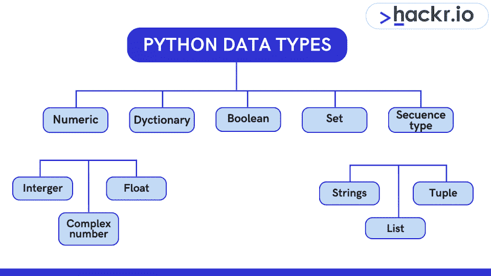
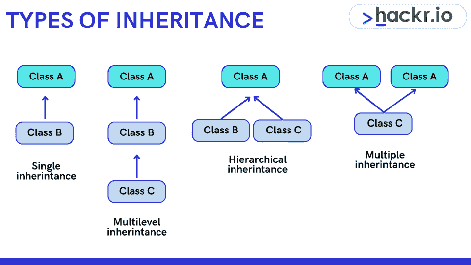
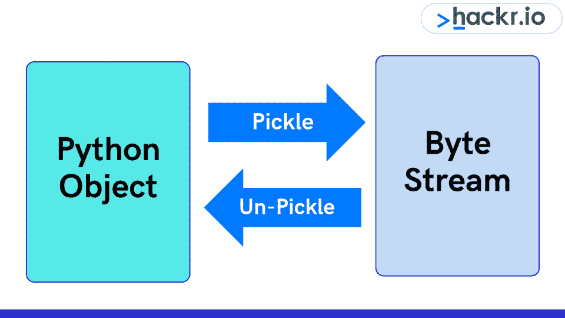

# 2023 年 65 大 Python 面试问答[更新]

> 原文：<https://hackr.io/blog/python-interview-questions>

Python 是最受初学者和专业人士欢迎的语言之一——它很容易掌握，在各个领域都有很多应用。你会经常在 2023 年学习的[最佳编程语言中看到它，而且这看起来不会很快改变。](https://hackr.io/blog/best-programming-languages-to-learn)

所以，答案是肯定的，[学习 Python](https://hackr.io/tutorials/learn-python?ref=blog) 可以带来一份丰厚的职业，如果你全身心地投入这项工作的话。一旦你觉得你已经准备好申请一个职位，你就需要准备技术面试。

我们在这里列出的 Python 面试问题和答案将为你做好准备。我们将这些 Python 面试问题分为初级和高级两个部分。我们还包括了一些 Python 技术面试问题。

## 热门 Python 面试问答

### **Python 基础面试问题**

#### **1。简单解释一下 Python 的一些特点。**

Python 是一种通用的高级解释语言。它是专门为使内容可读而开发的。Python 经常被比作英语，而且与其他语言相比，它的句法结构更少。

#### **2。Python 有哪些鲜明的特点？**

Python 的一些独特特性是:

1.  支持结构化和函数式编程。
2.  它可以被编译成字节码来创建更大的应用程序。
3.  支持高级动态数据类型。
4.  支持动态数据类型的检查。
5.  应用自动垃圾收集。
6.  它可以有效地与 Java、COBRA、C、C++、ActiveX 和 COM 一起使用。

#### **3。什么是 Pythonpath？**

Pythonpath 告诉 Python 解释器定位可以导入程序的模块文件。它包括 Python 源代码库目录和源代码目录。您可以将 Pythonpath 预设为 Python 安装程序。

#### **4。为什么我们要使用 Pythonstartup 环境变量？**

该变量由携带 Python 源代码的初始化文件的执行路径组成。这是启动解释器所需要的。

#### **5。什么是 Pythoncaseok 环境变量？**

Pythoncaseok 环境变量在 Windows 中应用的目的是指导 Python 在导入语句中查找第一个不区分大小写的匹配。

### 推荐 Python 课程

[用 Python 完成从零到英雄的 Python boot camp](https://click.linksynergy.com/deeplink?id=jU79Zysihs4&mid=39197&murl=https%3A%2F%2Fwww.udemy.com%2Fcourse%2Fcomplete-python-bootcamp%2F)

#### **6。Python 中支持的标准数据类型有哪些？**

****

Python 中支持的标准数据类型包括:

1.  列表
2.  数字
3.  用线串
4.  字典
5.  元组

#### **7。什么是元组？**

在 Python 中，元组是具有不可变值的序列数据类型。值 I 元组的数量用逗号分隔。

**推荐 Python 课程**

[](https://click.linksynergy.com/deeplink?id=jU79Zysihs4&mid=39197&murl=https://www.udemy.com/topic/python/)

#### **8。Python 中元组和列表的主要区别是什么？**

Python 中的元组和列表有几个主要区别，包括:

| **元组** | **列表** |
| 元组类似于列表，但与列表不同，元组包含在括号中 | 该列表用于创建一个序列 |
| 元素和大小可以改变 | 元素和大小不能更改 |
| 它们不能被更新 | 它们可以被更新 |
| 它们充当只读列表 | 它们作为一个可变列表 |
| 元组使用括号 | 列表使用方括号 |
| 例如:tup = (1，" a "，" string "，1+2) | 例如:L = [1，" a "，" string "，1+2] |

#### **9。什么是正指数和负指数？**

当从左到右开始搜索时，应用正索引。在负索引中，搜索从右向左开始。例如，在大小为 n 的正索引数组列表中，第一个索引是 0，然后是 1，直到最后一个索引是 n-1。但是，在负索引中，第一个索引是-n，然后是-(n-1)直到最后一个索引-1。

#### 10。标识符的允许长度是多少？

Python 中标识符的长度可以是任意长度。最长的标识符来自 PEP–8 和 PEP–20。

#### **11。方法对象()是做什么的？**

该方法返回一个无特征的对象，该对象是所有类的基。这个方法不接受任何参数。

#### **12。pep 8 是什么？**

Python 增强提案或 pep 8 是一组规定如何格式化 Python 代码以获得最大可读性的规则。

#### 13。Python 中的命名空间是什么？

名称空间是一种命名系统，用于确保名称是唯一的，以避免命名冲突

#### **14。Python 中缩进有必要吗？**

Python 中需要缩进，如果做得不好，代码就不能正确执行，可能会抛出错误。缩进通常使用四个空格字符。

#### 15。用 Python 定义函数。

被调用时执行的代码块被定义为函数。关键字 def 用于定义 Python 函数。

#### 16。用 Python 定义自我。

Self 是 Python 中类或对象的实例。它作为第一个参数包含在内。它有助于区分带有局部变量的类的方法和属性。

#### **17。Pass 语句是什么？**

当我们不能决定在代码中做什么时，使用 Python 中的 Pass 语句，但是我们必须键入一些内容以使其语法正确。

#### 18。Python 有哪些局限性？

Python 有一些限制，包括:

1.  它有设计限制。
2.  与 C 和 C++或 Java 相比，它要慢一些。
3.  这对于移动计算来说是低效的。
4.  它包括一个不发达的数据库访问层。

#### **19。Python 中存在运行时错误吗？举个例子。**

是的，Python 中存在运行时错误。例如，如果你是鸭子打字，东西看起来像一只鸭子，那么它被认为是一只鸭子，即使那只是一面旗帜或印章。在这种情况下，代码将是一个运行时错误。例如，Print“Hackr io”会导致运行时错误，即缺少 Print()所需的括号。

#### 20。我们可以在 Python 中反转一个列表吗？

是的，我们可以使用 reverse()方法在 Python 中保留一个列表。代码如下:

```
def reverse(s):
 str = "" 
 for i in s: 
   str = i + str
  return str
```

#### **21。为什么我们需要休息？**

Break 通过中断当前循环的执行并将控制转移到下一个块来帮助控制 Python 循环。

#### **22。为什么我们需要继续？**

continue 通过跳转到循环的下一个迭代来帮助控制 Python 循环，而不会耗尽它。

#### **23。在 Python 中可以用一个 break 然后一起继续吗？怎么会？**

在 Python 中，Break 和 continue 可以一起使用。break 将停止当前循环的执行，而 jump 将把它带到另一个循环。

#### **24。Python 支持内在的 do-while 循环吗？**

不，Python 不支持内在的 do-while 循环。

#### **25。有多少种方法可以应用反向字符串？**

有五种方法可以应用反向字符串:

1.  环
2.  递归
3.  大量
4.  扩展切片语法
5.  反向函数

#### **26。在 Python 中定义切片。**

切片指的是从序列类型(如列表、元组、字符串)中选择项目范围的机制。

#### **27。什么是 docstring？**

Docstring 是一个 Python 文档字符串，它是一种记录 Python 函数、类和模块的方法。

#### **28。Python 中如何删除文件？**

可以通过以下命令删除该文件:

```
os.remove(filename)
os.unlink(filename)
```

#### **29。线程生命周期的不同阶段是什么？**

线程生命周期的不同阶段是:

*   阶段 1: 创建一个类，我们可以在其中覆盖线程类的 run 方法。
*   **阶段 2:** 我们在新线程上调用 start()。出于调度目的，线程被向前推进。
*   **阶段 3:** 执行发生，其中线程开始执行，并且它达到运行状态。
*   阶段 4: 线程等待，直到调用包括 join()和 sleep()在内的方法。
*   **阶段 5:** 线程等待或执行后，等待线程被发送调度。
*   **阶段 6:** 运行线程是通过执行 terminates 来完成的，并达到 dead 状态。

#### 三十岁。什么是关系运算符、赋值运算符和成员运算符？

*   关系运算符的目的是比较值。
*   Python 中的赋值运算符有助于将所有算术运算符与赋值符号结合起来。
*   Python 中的成员资格运算符，用于验证序列中某个值的成员资格。

#### 31。标识运算符与成员运算符有何不同？

与成员资格运算符不同，标识运算符比较这些值，以确定它们是否具有相同的值。

#### 32。什么是 Python decorators？

Python 语法中为方便地改变函数而做的一个特定改变被称为 Python decorators。

#### 33。区分列表和元组。

元组是不可变的，它可以被散列，例如字典的键。另一方面，列表是可变的。

#### 34。描述 Python 中的多线程。

使用多线程来加速代码不是首选，即使 Python 附带了多线程包。

这个包有 GIL 或全局解释器锁，这是一个构造。它确保在任何给定时间只有一个线程执行。一个线程获取 GIL，然后在将它传递给下一个线程之前执行工作。

这种情况发生得如此之快，以至于对于用户来说，线程似乎是并行执行的。显然，情况并非如此，因为它们只是轮流使用同一个 CPU 内核。GIL 传递增加了执行的总开销。

因此，如果您打算使用线程包来加速执行，不建议使用该包。

#### 35。在 Python 中画出 range 和 xrange 的比较。

在功能上，range 和 xrange 是完全相同的。两者都允许生成整数列表。两者的主要区别在于，range 返回 Python 列表对象，而 xrange 返回 xrange 对象。

Xrange 不能像 range 那样在运行时生成静态列表。相反，它通过一种叫做让步的特殊技术来创造价值和需求。它与一种称为发生器的对象一起使用。

如果需要生成一个列表的范围很大，那么 xrange 是可以选择的函数。这尤其适用于处理内存敏感系统的场景，比如智能手机。

范围是一个内存猪。使用它需要更多的内存，特别是当需求很大的时候。因此，在根据需要创建整数数组时，可能会导致内存错误并最终导致崩溃。

#### 36。解释继承。

继承使一个类能够获取另一个类的所有成员。这些成员可以是属性和/或方法。通过提供可重用性，继承使得创建和维护应用程序变得更加容易。



获取的类称为子类或派生类。它从中获取的类称为超类、基类或父类。Python 支持 4 种形式的继承:

*   **单一继承:**单一派生类从一个超类中获取成员。
*   **多级继承:**至少两个不同的派生类从两个不同的基类获取成员。
*   **层次继承:**许多子类从一个超类获得成员
*   **多重继承:**一个派生类从几个超类中获取成员。

#### 37。解释如何使用 Python 获取任何 URL 或网页的 Google 缓存年龄。

为了使用 Python 获得任何 URL 或网页的 Google 缓存年龄，使用以下 URL 格式:

```
http://webcache.googleusercontent.com/search?q=cache:URLGOESHERE
```

只需将 URLGOESHERE 替换为您需要在 Python 中检索和查看其缓存的网站或网页的网址。

**Python 高级面试题**

#### 38。深度复制和浅度复制有什么区别？

当一个新的实例类型被创建时，我们使用一个浅层拷贝。它保留在新实例中复制的值。就像它复制值一样，浅层复制也复制引用指针。

浅拷贝中拷贝的参考点参考原始对象。在该类的任何成员中所做的任何更改都会影响该类的原始副本。浅层拷贝使程序的执行速度更快。

深度复制用于存储已经复制的值。与浅层复制不同，它不复制指向对象的引用指针。深度拷贝除了存储由其他对象指向的新对象之外，还引用一个对象。

对原始副本所做的更改不会影响使用被引用或存储对象的任何其他副本。与浅层拷贝相反，深层拷贝会降低程序的执行速度。这是因为它为每个被调用的对象制作了一些副本。

#### 39。怎么区分 NumPy 和 SciPy？

通常，NumPy 只包含数组数据类型和最基本的操作，比如基本的基于元素的函数、索引、整形和排序。所有的数字代码都存在 SciPy 里。

由于 NumPy 最重要的目标之一是兼容性，该库试图保留其前身所支持的所有特性。因此，NumPy 包含一些线性代数函数，尽管这些函数更适合属于 SciPy 库。

SciPy 包含 NumPy 可用的线性代数模块的全功能版本，以及其他几种数值算法。

#### 40。以下代码的输出是什么？

```
A0 = dict(zip(('a','b','c','d','e'),(1,2,3,4,5)))
A1 = range(10)A2 = sorted([i for i in A1 if i in A0])
A3 = sorted([A0[s] for s in A0])
A4 = [i for i in A1 if i in A3]
A5 = 
A6 = [[i,i*i] for i in A1]
print(A0,A1,A2,A3,A4,A5,A6)
```

A0 = {'a': 1，' c': 3，' b': 2，' e': 5，' d': 4} #顺序可能不同

A1 =范围(0，10)

A2 = []

A3 = [1，2，3，4，5]

A4 = [1，2，3，4，5]

A5 =

A6 = [[0，0]，[1，1]，[2，4]，[3，9]，[4，16]，[5，25]，[6，36]，[7，49]，[8，64]，[9，81]]

#### 41。用一个例子解释字典。

Python 编程语言中的字典是数据值的无序集合，比如地图。字典保存键:值对。这有助于定义键和值之间的一对一关系。通过键索引，典型的字典包含一对键和相应的值。

让我们以三个关键词为例，即网站、语言和产品。它们对应的值是 hackr.io、Python 和 Tutorials。的代码是:

```
dict={‘Website’:‘hackr.io’,‘Language’:‘Python’:‘Offering’:‘Tutorials’}
print dict[Website] #Prints hackr.io
print dict[Language] #Prints Python
print dict[Offering] #Prints Tutorials
```

#### **42。Python 支持负索引。它们是什么，为什么使用它们？**

Python 中的序列是有索引的。它由正数和负数组成。正数使用 0 作为第一个索引，1 作为第二个索引，依此类推。因此，任何正数 n 的索引都是 n-1。

与正数不同，负数的索引编号从-1 开始，它代表序列中的最后一个索引。同样，-2 表示倒数第二个索引。这些被称为负指数。负索引用于:

*   从字符串中删除任何新行空格，从而允许字符串除去最后一个字符，表示为 S[:-1]
*   显示以正确顺序表示字符串的索引

#### **43。假设您需要从 IMDb 前 250 名电影页面收集并打印数据。为此用 Python 写一个程序。(注意:您可以限制 3 个字段的显示信息；即电影名称、发行年份和分级。)**

```
from bs4 import BeautifulSoup
import requests
import sys
url = 'http://www.imdb.com/chart/top'
response = requests.get(url)
soup = BeautifulSoup(response.text)
tr = soup.findChildren("tr")
tr = iter(tr)
next(tr) 
for movie in tr:
title = movie.find('td', {'class': 'titleColumn'} ).find('a').contents[0]
year = movie.find('td', {'class': 'titleColumn'} ).find('span', {'class': 'secondaryInfo'}).contents[0]
rating = movie.find('td', {'class': 'ratingColumn imdbRating'} ).find('strong').contents[0]
row = title + ' - ' + year + ' ' + ' ' + rating 
print(row)
```

#### **44。以下代码的输出是什么？**

```
try: if '1' != 1:
raise "someError"
else: print("someError has not occured")
except "someError": pr
int ("someError has occured")
```

程序的输出将是“无效代码”这是因为新的异常类必须从 BaseException 继承。

#### **45。Python 中的猴子补丁是什么？**

在 Python 中，运行时对类或模块的动态修改被称为猴子补丁。考虑下面的代码片段:

```
# m.py
class MyClass:
def f(self):
print "f()"
```

我们可以像这样修改程序:

```
import m
def monkey_f(self):
print "monkey_f()"
m.MyClass.f = monkey_f
obj = m.MyClass()
obj.f() 
```

程序的输出将是 monkey_f()。

示例演示了使用我们定义的函数(即模块 m 外部的 monkey_f ),对 MyClass 中 f()的行为所做的更改。

#### **46。解释编译和链接的过程。**

为了编译新的扩展没有任何错误，在 Python 中使用了编译和链接。链接仅在编译完成时启动。

在动态加载的情况下，编译和链接的过程取决于相关系统提供的样式。为了提供配置设置文件的动态加载和解释器的重建，使用了 Python 解释器。

#### **47。什么是 Flask，使用它有什么好处？**

Flask 是 Python 的一个 web [微框架](https://en.wikipedia.org/wiki/Microframework)，依赖 Jinja2 和 Werkzeug。因此，它有一些显著的优势:

*   Flask 对外部库几乎没有依赖性。
*   因为需要更新的外部依赖性很小，安全漏洞也很少，所以 web 微框架是轻量级的。
*   它有一个内置的开发服务器和快速调试器。

#### **48。map()函数是用来做什么的？**

map()函数将给定的函数应用于 iterable 的每一项。然后，它返回结果列表。从 map()函数返回的值可以传递给 list()和 set()之类的函数。

通常，给定函数是 map()函数的第一个参数，iterable 是第二个参数。如果函数接受一个以上的参数，将给出几个表。

#### 49。什么是酸洗和拆线？

****

Python 中的 Pickle 模块允许接受任何对象，然后将其转换为字符串表示。然后，它通过 dump 函数将其转储到一个文件中。这一过程被称为酸洗。取消拾取从存储的字符串表示中检索原始 Python 对象。

#### 50。每当 Python 退出时，并不是所有的内存都被释放。为什么会这样呢？

退出时，Python 内置的有效清理机制开始发挥作用，并尝试释放或销毁所有其他对象。然而，循环引用其他对象的 Python 模块，或者从全局名称空间引用的对象，并不总是被释放或销毁。

这是因为不可能释放那些由 C 库保留的内存部分。

#### 51。用 Python 写一个程序，获取 NumPy 数组中 N 个最大值的索引。

```
import numpy as np
arr = np.array([1, 3, 2, 4, 5])
print(arr.argsort()[-3:][::-1])
Output:
[4 3 1] 
```

#### **52。编写代码并输出以显示列表的随机项目。**

**答案:**

```
from random import shuffle
x = ['hackr.io', 'Is', 'The', 'Best', 'For', 'Learning', 'Python']
shuffle(x) 
print(x)
Output:
['For', 'Python', 'Learning', 'Is', 'Best', 'The', 'hackr.io']
```

#### 53。Python 中是如何管理内存的？

Python 私有堆空间代替了 Python 中的内存管理。它包含所有 Python 对象和数据结构。解释器负责管理这个私有堆，程序员无权访问它。Python 内存管理器负责为 Python 对象分配 Python 堆空间。程序员可以在核心 API 的帮助下访问一些代码工具。Python 还提供了一个内置的垃圾收集器，它可以回收所有未使用的内存并释放内存，使其可用于堆空间。

#### 54。什么是 lambda 函数？

lambda 函数是一个匿名函数。该函数只能有一条语句，但可以有任意数量的参数。

```
a = lambda x,y : x+y
print(a(5, 6))
```

#### **55。Python 中参数是如何传递的？按值还是按引用？**

所有的 Python 都是一个对象，所有的变量都包含对该对象的引用。参考值根据功能而定；因此，引用的值不能更改。

#### 56。Python 提供的内置类型有哪些？

可变内置类型:

不可变内置类型:

#### **57。什么是 Python 模块？**

包含函数和变量等 Python 代码的文件是 Python 模块。Python 模块是扩展名为. py 的可执行文件。一些内置模块包括:

*   操作系统（Operating System）
*   [计]系统复制命令（system 的简写）
*   数学
*   随意
*   数据存取时间
*   JSON

#### **58。//运算符是什么？它有什么用？**

//是一个 for dividing 运算符，用于将两个操作数相除，结果为显示小数点前位数的商。例如，10//5 = 2，10.0//5.0 = 2.0。

#### 59。拆分功能是用来做什么的？

split 函数使用定义的分隔符将字符串分成更短的字符串。它返回字符串中所有单词的列表。

#### 60。解释狗堆效应。

狗桩效应是指当缓存过期，网站被客户端同时发出的多个请求击中。使用信号量锁可以防止狗堆效应。在这个系统中，当一个值过期时，第一个进程获取锁并开始生成新值。

#### 61。Python 中的 pass 是什么？

无操作 Python 语句指的是传递。它是复合语句中的一个占位符，这里应该留有空白或者什么都不写。

#### 62。[::-1}是做什么用的？

[::-1}反转数组或序列的顺序。但是，原始数组或列表保持不变。

```
import array as arr
Num_Array=arr.array('k',[1,2,3,4,5])
Num_Array[::-1]
```

#### 63。string 的第一个字母怎么大写？

capital()方法将字符串的第一个字母大写，如果该字母已经是大写，则返回原始字符串

#### **64。什么是 is，not 和 in 运算符？**

运算符是接受两个或更多值并返回相应结果的函数。

*   **为:**当两个操作数为真时返回真
*   **not:** 返回布尔值的倒数
*   **in:** 检查某个元素是否出现在某个序列中。

#### 65。Python 中的模块是如何导入的？

使用 import 关键字以下列三种方式之一导入模块:

```
import array
import array as arr
from array import *
```

## **结论**

以上总结了 Python 面试的最佳问题。学习从来不会变得更容易，你只会变得更好。有大量的 [Python 书籍](https://hackr.io/blog/best-python-books-for-beginners-and-advanced-programmers)可以帮助你准备 Python。也可以看一下 [Python 之类的课程，数据结构，算法，面试](https://click.linksynergy.com/deeplink?id=jU79Zysihs4&mid=39197&murl=https://www.udemy.com/course/python-for-data-structures-algorithms-and-interviews/)。

作为数据科学考生使用的高需求语言，学习 Python 总是有利的。坚持下去，你会成功的。祝你好运！

## **常见问题解答**

#### **1。如何准备 Python 面试？**

通过很好地掌握理论并把它付诸实践。这里的问题将很好地帮助你做好理论方面的准备，但是不要忽视实际上为面试编写 python 程序。

#### **2。Python 适合编码面试吗？**

Python 是一种受欢迎和受欢迎的语言。学习这门语言可以帮助你获得一个好的职位，但是你还必须学习通用的编程知识，以便进行编码面试。

#### **3。有哪些好的 Python 面试问题？**

上面的列表很好地为您准备了 Python 编码面试。Python 编码面试问题也很重要，要注意这一点。

**人也在读:**