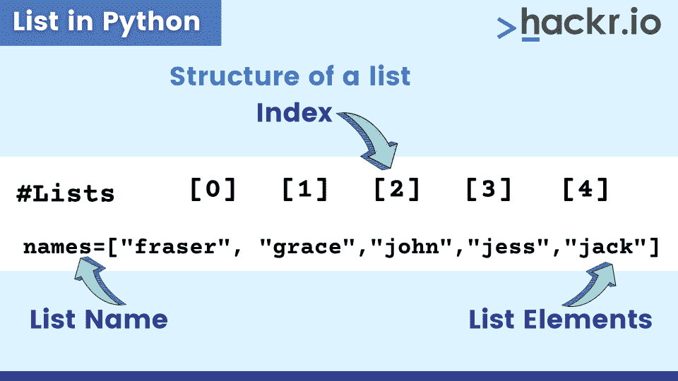
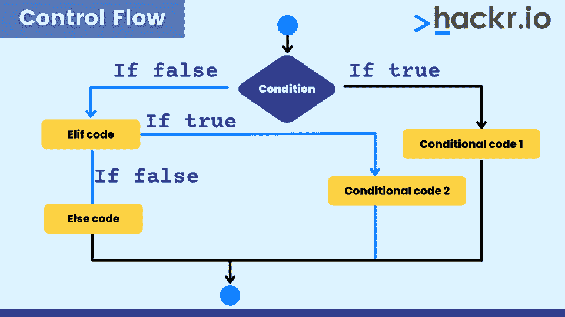
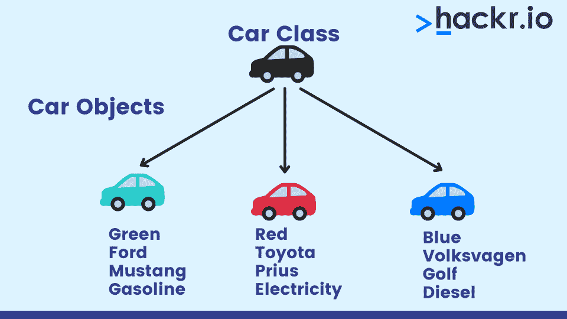

# Python 编程语言:Python 编码介绍[2023]

> 原文：<https://hackr.io/blog/python-programming-language>

作为一名[程序员](https://hackr.io/blog/how-to-learn-programming)(或者潜在的程序员)，你会在某个时候寻找一种易于学习、跨平台、拥有强大的开发人员社区支持，并且具有良好的内置特性可以帮助你快速开发应用程序的语言。其中一种语言是 [Python](https://www.python.org/) 。

Python 是一种无处不在的编程语言，有着广泛的应用。从机器学习到 web 开发，Python 语言在大多数人已经熟悉的行业和公司中都有应用。

这个分步指南将带您了解 Python 编程语言的来龙去脉。它涵盖了 Python 是什么，它在哪里使用，为什么它如此受欢迎，如何安装 Python，以及该语言的一些基础知识。

## **Python 编程语言是什么？**

Python 语言类型是一种高级的动态类型语言，是最流行的通用编程语言之一。它是世界上发展最快的编程语言之一，被软件工程师、数学家、数据分析师、科学家、网络工程师、学生和会计师使用。

Python 也是解释型和面向对象的。它被称为解释语言，因为它的源代码被编译成字节码，然后被解释。CPython 通常在解释之前将 Python 代码编译成字节码。

## **Python 为什么流行？**

Python 的特性和其他特性是它受欢迎的原因。例如，它支持动态类型和动态绑定。在像 [Java](https://hackr.io/tutorials/learn-java?q=java) 、C 和 C++这样的语言中，你不能将*字符串*的值初始化为 *int* 变量，在这种情况下，程序将无法编译。直到代码被执行，Python 才知道变量的类型。

Python 有一个简单的语法，增强了可读性，降低了代码维护的成本。代码看起来优雅而简单。

以下是 Python 受欢迎的原因总结:

*   Python 框架也有模块和包，这促进了代码的可重用性。
*   **开源:**可以免费下载 Python。您还可以阅读和修改源代码。
*   **无代码编译:**编辑-测试-调试周期快
*   **异常处理:**任何代码都会出错。Python 生成可以处理的异常，从而避免程序崩溃。
*   **自动内存管理:**Python 中的内存管理涉及一个私有堆(一个代表队列的数据结构)，包含所有 Python 对象和数据结构。

## **学习 Python 需要多长时间？**

尽管 Python 用途广泛，但它实际上是最容易学习的语言之一。如果你看一下用 3 种不同语言编写的简单程序的相同代码，除了“人类可读”之外，Python 可能需要最少的代码行

在大约 3 - 6 个月的时间里，学习 Python 的[基础并开始你自己的项目是很有可能的。这将取决于个人的能力和你付出的努力，但请放心，如果你正在学习编程，Python 语言是更容易的选择之一。](https://coursera.pxf.io/ORvR1z)

### 推荐 Python 课程

[用 Python 完成从零到英雄的 Python boot camp](https://click.linksynergy.com/deeplink?id=jU79Zysihs4&mid=39197&murl=https%3A%2F%2Fwww.udemy.com%2Fcourse%2Fcomplete-python-bootcamp%2F)

## **Python 是用来做什么的？**

Python 的用途多种多样，相当有影响力。以下是 Python 常用的字段列表:

### **网页开发**

作为一名 web 开发人员，在使用 Python 作为服务器端编程语言时，您可以从大量的 web 框架中进行选择。Django 和 Flask 都很受 Python 程序员的欢迎。Django 是一个全栈的 web 框架，用于 Python 开发复杂的大型 web 应用程序，而 T2 Flask 是一个轻量级的可扩展的 Python web 框架，用于构建简单的 web 应用程序，因为它简单易学，更基于 Python。对于初学者来说，这是一个很好的开始。

Youtube、Spotify、Mozilla、Dropbox 和 Instagram 等应用巨头使用 Django 框架，而 Airbnb、网飞、优步和三星使用 Flask 框架。

### **机器学习**

因为 Python 是一种非常容易理解的语言，所以在它的基础上有很多很棒的库，这使得你的工作更加容易。现有的大量 [Python 库](https://hackr.io/blog/top-python-libraries)帮助你专注于比重新发明轮子更令人兴奋的事情。Python 也是一种优秀的包装语言，用于处理算法和 CUDA/cuDNN 的更高效的 C/ C++实现，这就是为什么现有的机器学习和深度[学习库](https://hackr.io/blog/best-machine-learning-libraries)在 Python 中高效运行的原因。这对于在[机器学习](https://hackr.io/tutorials/learn-machine-learning-ml?ref=blog-post)和 AI 领域工作也是超级重要的。

### **数据分析**

Python 拥有几乎科学计算各个方面的工具。美国银行使用 Python 来处理其金融数据，脸书将 Python 库 Pandas 用于其数据分析。

虽然 Python 中有许多可用于执行数据分析的库，但以下是一些入门库:

*   **NumPy:** 对于用 Python 进行[科学计算来说，NumPy 是必不可少的。它支持大型多维数组和矩阵，并包括一系列高级数学函数来操作这些数组。](http://www.numpy.org/)
*   这与 NumPy 数组一起工作，并为数值积分和优化提供了有效的例程。
*   Pandas :这也是建立在 NumPy 之上的，提供了数据结构和操作来操作数字表和时间序列。
*   Matplotlib: 一个 2D 绘图库，只需几行代码就可以将数据可视化为直方图、功率谱、条形图和散点图。

### **游戏**

Python 和 Pygame 是快速游戏原型制作或初学者学习如何制作简单游戏的好语言和框架。Pygame 是一个免费的开源 Python 编程语言库，用于制作像游戏这样的多媒体应用程序。

著名的迪士尼多人在线角色扮演游戏《卡通小镇 online》是用 Python 编写的，图形使用 Panda3D。战地 2 是一款第一人称射击军事模拟器视频游戏，它的所有附加组件和许多功能都使用 Python。开源芬兰音乐视频游戏 Frets on Fire 是用 Python 写的，用的是 Pygame。

### **桌面应用**

作为 Python 标准库的一部分，Tkinter 允许您创建小而简单的 GUI 应用程序。PyQt 库对于 Qt(基于 C++的)应用程序开发框架的桌面创建 python 绑定是最有用的。PySide 库是跨平台 GUI 工具包 Qt 的 python 绑定。

## **如今谁在使用 Python？**

既然您已经看到了 Python 的各种用途，那么从最大的科技公司到政府机构，每个实体都在使用 Python 就不会感到惊讶了。

使用 Python 的公司包括谷歌、网飞、脸书、贝宝、优步、Spotify、Reddit 等等。

## **Python 与其他语言的比较**

虽然 Python 对于初学者来说是一门优秀的语言，而且用途广泛，但它也不是没有缺点。有些编程语言在某些用途上天生更好，了解 Python 语言与其他语言相比如何是值得的。

### **Java 和 C++**

Python 通常比 [Java 和 C++](https://hackr.io/blog/cpp-vs-java) 运行得慢，即使代码大小和开发时间更短。这部分是因为 Python 是一种动态绑定语言。它有一个使用简单函数和变量的语法。

### **Perl**

Python 和 Perl 来自相似的背景，本质上都是 Unix 脚本。Perl 强调支持常见的面向应用程序的任务，比如从文本文件中提取信息、打印报告、将文本文件转换成其他格式。Python 强调对常见编程方法的支持，如数据结构设计和面向对象编程，并鼓励程序员通过提供优雅的语法来编写可读(从而可维护)的代码。

### **Tcl**

像 Python 一样，Tcl 被用作应用程序扩展语言，以及独立的编程语言。然而，当涉及到数据结构时，Tcl 是弱的，并且通常执行代码比 Python 慢得多。Tcl 还缺乏编写大型程序所需的特性，因此使用 Tcl 的大型应用程序通常包含用 C 或 C++编写的特定于该应用程序的扩展，而等效的应用程序通常可以完全用 Python 语言编写。

### **闲聊**

和 Python 一样， [Smalltalk](https://hackr.io/tutorials/learn-smalltalk?ref=blog-post) 也有动态类型化和绑定，里面的一切都是对象。Smalltalk 的集合数据类型的标准库更优越，而 Python 的库有更多的设施来处理互联网和 web 需求，如电子邮件、HTML 和 FTP。

## **如何安装 Python**

安装 Python 相当简单。你可以在 Windows、Mac OS X 和 Linux (Ubuntu)上安装它。

### **在 Windows 上安装 Python**

这里我们将重点介绍 Windows 安装，但是您也可以选择 Mac OS X 和 Linux 选项来将其安装在相应的系统上。要在更深奥的操作系统上安装它，请访问这个[页面](https://www.python.org/download/other/)。

1.  首先，访问 [Python 网站](https://www.python.org/downloads/)并下载 Python 3.7.3(您可能会看到不同的版本号，这取决于最新发布的版本)
2.  运行下载的可执行文件来安装 Python。安装包括 IDLE、pip 和文档。IDLE 是一个带有 Python GUI 的**集成开发环境(IDE)** ，它与该语言的默认实现捆绑在一起。

你也可以安装 Pycharm，一个由 JetBrains 开发的 Python IDE。Pycharm 帮助开发人员编写简洁且可维护的代码，并提供了高效 Python 开发所需的所有工具。由你决定是否要[下载 Pycharm](https://www.jetbrains.com/pycharm/download/#section=windows) ，它适用于 Linux/Unix、Mac OS X 和 Windows。

## **用 Python 编写你的第一个程序**

现在您已经有了所需的 IDE 设置，您可以开始编写您的第一个程序了。

如果您正在使用 Pycharm，请按照以下步骤操作:

*   单击 PyCharm 欢迎屏幕上的“创建新项目”
*   输入有效的项目名称
*   创建一个新的 python 文件，所以右键单击文件夹名称并选择 New -> Python File
*   键入此代码:

```
# this program prints Hello World on the screen

Print(‘Hello World’)
```

*   将文件另存为 HelloWorld.py
*   运行文件 HelloWorld.py
*   输出将在屏幕上显示为- Hello World

你的第一个 Python 程序已经准备好了！现在让我们看看 Python 的特性是什么，以及它们有什么帮助。

## **Python 语言:特性**

Python 语言有几个基本特性，可以帮助你用 Python 编写自己的程序应用。如果您有使用另一种编程语言的经验，您可能对此很熟悉。

*   评论
*   关键词和标识符
*   变量、常量和文字
*   数据类型
*   流控制
*   功能
*   类别和对象
*   异常处理
*   文件处理

当我们看大多数程序时，通过粗略的浏览理解它的逻辑可能是困难的。注释是任何程序中不被执行的语句——它不影响输出，但确实提高了代码的可读性。用简单的英语写的注释，允许任何用户阅读和理解程序中发生的事情。

在 Python 中有两种注释方式:

**单行注释:如下图**

```
# this line is a sample python comment. The program adds two numbers.

X = 6

Y = 10

Z = x + y

Print(“”# Hello World)

print(z)

However ‘#’ inside a program statement is not a comment. The output will be:

# Hello World

16
```

如果注释在程序语句之外，它就不会被打印出来，只对代码的读者可见。

**多行注释**

对于 Python 中的多行注释，需要在注释的开头和结尾使用三个单引号，如下所示。

```
‘’’

This is a sample multi

Line comment Python will ignore these

Lines.

‘’’

print(“Hello World”)
```

### **关键字和标识符**

关键字是 Python 语言中的保留字。不能使用关键字来命名变量、类、函数等。这些关键字定义了语言语法、流程和结构。

标识符是您定义的变量、函数和类的名称。命名标识符时，需要记住一些规则。

*   标识符可以是小写字母(A 到 Z)或大写字母(A 到 Z)或数字(0 到 9)或下划线 _ 的组合。像 displayNamesClass、intSalary_1、_myName 这样的名称都是有效的标识符。
*   标识符不能以数字开头。1Salary 无效，但 Salary1 有效。
*   如上所述，关键字不能用作标识符
*   不能使用特殊符号，如！、@、#、$、%等。命名标识符时
*   Python 是一种区分大小写的语言，因此*雇员名*和*雇员名*是不同的

### **变量、常数和文字**

**变量**用于存储数据，如有需要，可在程序中使用和更改。

```
empName = “Jason”

empNo = 19160

The = operator is used to assign a value to the variable

print(empName)

Will show the output as - Jason

empName = “Susie”

print(empName)
```

输出将是:

```
Susie
```

由于 Python 是一种动态类型语言，所以在声明变量时不必担心变量的数据类型。执行代码时，将根据变量中的值来识别变量的类型。

**常量**是不能改变的变量类型。您可以创建一个 *config.py* 文件，并将您的常量存储在其中。这些可以用在你的代码中任何需要的地方。

例如:

config.py 文件将包含常量，如**作为**:

```
COMPANYNAME=DATAINC

COMPANYLOC=SAN FRANCISCO
```

要在代码中使用 config.py 常量，请执行以下操作:

```
import config

# this is the config.py file that you have included in your program because you have to

# access the constants which are in the file.

print(config.COMPANYNAME)

print(config.COMPANYLOC)
```

当您运行该程序时，输出将是:

```
DATAINC

SAN FRANCISCO
```

**文字**是赋给变量或常量的数据。Python 有以下文字。字符串、数字、布尔、称为 *None* 的特殊文字和集合文字。

下面是一些文字类型的例子。

*   **字符串:**“德里”
*   **数字:** 100，-46.89(浮点数)
*   **布尔:**真或假。布尔文字只有 2 个值。

### **数据类型**

在 Python 中，数据类型是基于变量包含的值来标识的。Python 是一种面向对象的语言，因此变量被认为是对象，数据类型是类。因为 Python 是一种动态类型语言，所以在使用它们之前，不需要用它们的类型来声明变量。

一些重要的数据类型如下:

#### **数字**

Int、float 和 complex 是表示数字的数据类型。

```
a = 5

b = 8.77

c = 2+3j
```

#### **字符串**

字符串是一系列 Unicode 字符。您可以使用单引号或双引号来表示字符串。多行字符串可以用三重引号、''或"""来表示。Python 中字符串的数据类型是 str。这里有一个例子:

```
S = “This is an example of a string.”
```

#### **布尔型**

如果变量中的值为 true 或 false，Python 会将变量的数据类型视为布尔型。

```
If (number % 2) = 0

noEven = True# noEven is of Boolean type

else

noEven = False
```

#### **列表**

列表数据类型是值的有序序列，它们被广泛使用。列表中的所有值不必都是相同的数据类型。列表是可变的。列表中的值可以修改。



#### **元组**

元组也类似于列表，因为它们是有序的值序列。然而，元组中的值是不可改变的(不可变的)。它们比列表更快，因为它们不会动态变化。

#### **设置**

集合是一个无序的、无索引的项目集合。集合的输出将显示唯一的值。

#### **字典**

字典是键和值对的无序集合。字典是通过按键来访问的。这些键可以是任何数据类型。你也可以把一种数据类型转换成另一种，这叫做类型转换。

### **流量控制**

If，if …else，if…elif…else–这些构成了编程中决策制定的流程控制部分。它有助于您仅在满足某个条件时运行特定的代码。



最好用一些 if 语句示例来解释这一点。下面的程序检查数字是正数还是负数，如果数字是正数、负数或零，则显示相应的消息。您也可以扩展相同的程序来包含 **elif** 。

```
num = 3.4

if num > 0:

print("Positive number")

elif num == 0:

print("Zero")

else:

print("Negative number")
```

你可以使用嵌套的 if，也就是说，你可以有一个- if... 否则如果...另一个 if 中的 else 语句... 否则如果...else 语句。

#### **循环**

循环是一系列不断重复的指令，直到达到某个条件。Python 中有三种类型的循环。

**For 循环:**

```
# Program to print values stored in a list

# List of numbers

numbers = [6, 5, 3, 8, 4]

# iterate over the list and print the values one by one

for val in numbers:

print(val)
```

**While 循环:**

一个*而*循环类似于一个循环的*，然而在一个*循环的*中，你知道你将要迭代的次数。只要条件为真，就会执行一个 *while* 循环。*

这个程序打印从 1 到 9 的所有数字

```
num = 1

# loop will repeat itself as long as

# num < 10 remains true

while num < 10:

 print(num)

#incrementing the value of num

 num = num + 1
```

*中断*和*继续*用于回路中，以改变回路中的流量。*中断*用于在特定条件下退出循环；因此，如果满足条件，则遵循*。*继续*用于跳过一组指令，继续下一次迭代。*

*中断*和*继续*的例子:

```
for num in [20, 11, 9, 66, 4, 89, 44]:

# Skipping the iteration when number is even

if num%2 == 0:

continue

# This statement will be skipped for all even numbers

 print(num)

# program to display all the elements before number 88

for num in [11, 9, 88, 10, 90, 3, 19]:

 print(num)

if(num==88):

 print("The number 88 is found")

 print("Terminating the loop")

break
```

**通过:**

Pass 是 Python 中一个有趣的特性，它充当占位符。如果你想使用一个函数，但是你还没有准备好这个函数的代码，你可以使用‘pass’。这里的 [**Python 解释器**](https://hackr.io/blog/python-interpreters) 并没有忽略‘pass’，而是假设它到现在为止什么都不做。

# pass 只是一个占位符

#稍后将添加的功能。

```
sequence = {'p', 'a', 's', 's'}
```

序列中 val **的**:****

**通过** #目前不做任何事情

### **功能**

函数是执行特定任务的一系列步骤或一段代码。它通常接受一个输入参数，执行一个过程并返回一个结果。一个函数可以从另一个函数或主程序中调用。函数在编码中非常重要。

在程序中使用函数的优点是:

*   提高代码的可读性
*   函数可以重复使用任意次
*   相同的功能可以用在任何数量的程序中
*   它使代码模块化，因此你可以避免错误

Python 中有两种类型的函数:

*   **内置函数:**这些函数是预定义的。您不需要定义函数，只需要在需要的地方调用函数。
*   **用户定义函数:**您在代码中为特定流程创建的函数是用户定义函数。

Python 中的示例函数:

```
defmultiply_nos(num1, num2) # thisisthedefinitionofyourfunctionwith 2 inputparameters

returnnum1 * num2 # functionreturnstheproductof 2 numbers

# nowyouarecallingthefunctioninyourprogram

product = multiply_nos(5,6)

print(product)
```

****输出** **将** **变为**:**

```
30
```

### **类和对象**

Python 是一种面向对象的编程语言(OOP)，并且满足 OOP 的四个原则:封装、抽象、继承和多态。可以用属性和方法创建类和对象。



**类:**

类是对象的蓝图。你可以把一个类想象成一个具有某些属性和方法的骨架。属性是类的属性，方法是特定于类的函数。

**对象:**

当您创建具有特定功能的类的实例时，它就是一个对象。这里的例子将帮助你更好地理解它。

```
# this is a class

classbox:

figuretype = “3D” # this is a class attribute

defboxdimension(self, length, breadth, height)

# theseareinstanceattributesandboxdimensionaclassmethod

print (length* breadth * height)

#nowyoucancreateaninstanceofthisclass

objsquare = box() # objsquareisanobject

objsquare.boxdimension(10,20,30)

# youarepassingthesethreenumbersandthevolumeof

# theboxwillbeshownastheoutput
```

像函数这样的类很好使用，因为它增强了模块性，并且代码是可重用的。当您需要表示将在应用程序的其他地方重复使用的属性和方法的集合时，可以使用它们。

### **异常处理**

执行过程中检测到的错误称为*异常*。Python 中可以处理异常。程序中可以处理各种类型的异常。异常的几个例子是 ValueError、KeyboardInterrupt、OSError 和 ZeroDivisionError。以下是异常处理的一个示例:

```
defthis_fails():

x = 1/0

try:

this _fails()

except ZeroDivisionError as err:

print(‘Handling run time error error name is :’, err)
```

该程序的输出将是:

```
Handling run time error name is: division by zero
```

您可以通过创建新的异常类来定义自己的异常。异常通常应该直接或间接地从异常类派生。

### **文件处理**

文件处理就是打开、读取、写入和关闭文件。

例如，要打开一个文本文件，你可以用中的和**中的**做** it **在** Python 中内置**函数** ' **打开** '**

```
f = open("test.txt") # open file in current directory

f = open("C:/Python33/README.txt") # specifying full path

f.close()
```

您可以使用关闭功能关闭文件。文件可以以各种方式打开，如只读、只写等。

## **在哪里学 Python？**

有几个资源可以用来学习 Python。学习 Python 的[最佳方式](https://hackr.io/blog/best-way-to-learn-python)包括自学和付费课程。虽然完全有可能自己学习 Python，但是 [Python 认证](https://hackr.io/blog/python-certification)将会加快这个过程，并传授很多实用知识。但是如果你不想花钱，网上也有很多更便宜的免费的 [Python 课程](https://hackr.io/blog/best-python-courses)，这些都很值得一试。

## **开始您的 Python 之旅**

到目前为止，你所读到的只是冰山一角。Python 编程还有很多东西，最好通过阅读文档和自己用 Python 实际编码来学习。

如果你想[学习 Python](https://hackr.io/tutorials/learn-python) ，请阅读相关理论，包括更高级的主题，如 Python 迭代器、协程、装饰器和生成器。当然，还有做你的项目！

[**上 Python 这个速成班**](https://coursera.pxf.io/3PqP7X)

由谷歌提供

## **常见问题解答**

#### **1。应该学 Python 2 还是 Python 3？**

对于大多数目的，当然还有教育目的，坚持使用 Python 3。它是应用最广泛的。Python 3 是较新的版本，有一些关键的变化。除非明确要求，否则应该选择 Python 3 而不是 Python 2。

#### **2。Python 是自由语言吗？**

是的，Python 是完全免费的！这也是为什么 Python 编码在初学者中如此受欢迎的原因之一。

#### **3。Python 是开源的吗？**

没错，Python 是开源的！

#### **4。Python 好学吗？**

出于多种原因，Python 被认为是最容易学习的编程语言之一。其中之一是它的语法有点像英语。

**人也在读:******