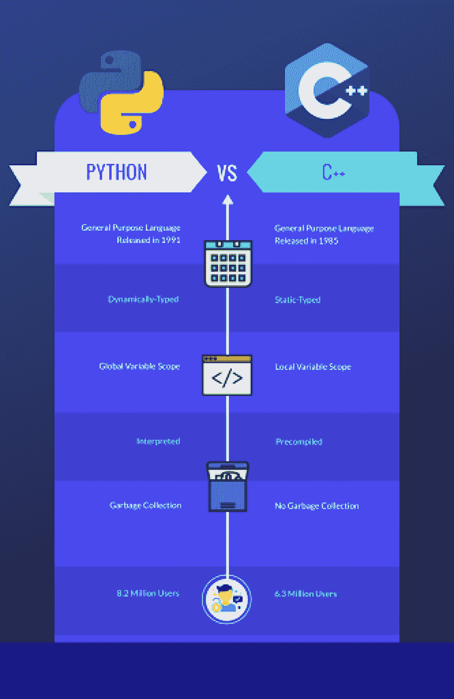

# Python vs C++:难度、受欢迎程度和职业选择

> 原文：<https://hackr.io/blog/python-vs-cpp>

Python 和 C++都是非常流行的通用编程语言，但它们的相似之处也就到此为止了。

虽然 Python 深受 C++的影响，但它们是两种完全不同的语言。Python 更容易学，但是运行起来很慢。C++的执行速度更快，效率更高，但要真正掌握它可能需要数年时间。这是唯一的区别吗？除了执行，c++和 python 有什么区别？

今天，我们来看看 [Python 和 C](https://hackr.io/blog/c-sharp-vs-python) ++的区别。

## **一览:C++ vs Python**

C++和 Python 都是流行的编程语言，平均年薪超过 10 万美元。Python 和 C++主要用于应用程序开发，尽管 Python 越来越多地用于 web 应用程序的开发。如今，许多 Python 和 C++程序员都专注于[移动应用开发](https://hackr.io/blog/how-to-become-a-mobile-app-developer)。



比较这两种语言的一个简单方法是查看它们代码中的差异。

一个完整的 Python“Hello World ”:

```
print('Hello, world!')
```

C++中完整的“Hello World ”:

```
#include <iostream>

int main() {

    std::cout << "Hello World!";

    return 0;

}
```

正如你所看到的，即使对于相对简单的任务，C++也要复杂得多。但是 Python 缺乏行终止同样会让 C++、 [Java](https://hackr.io/blog/what-is-java) ，甚至 PHP 程序员感到不舒服。为了了解 python 和 c++之间的区别，让我们来看看各自的优缺点。

推荐 Python 课程

### [用 Python 完成从零到英雄的 Python boot camp](https://click.linksynergy.com/deeplink?id=jU79Zysihs4&mid=39197&murl=https%3A%2F%2Fwww.udemy.com%2Fcourse%2Fcomplete-python-bootcamp%2F)

**Python 优缺点**

## Python 的许多优势直接导致了它的挑战。它很容易学习，但这也意味着它更容易出错——它是一种解释型语言，而不是编译型语言，但这也会导致运行时错误。

以下是 Python 开发的主要优缺点。

**Python 的优点**

### 容易学习: Python 通常被认为是初学者的语言，因为它很容易掌握、阅读和开始编程。

*   **更适合 web 开发:**今天的焦点主要是 web 应用程序和云。Python 比 C++更适合 web 开发。
*   动态类型化:动态类型化使编程更容易、更灵活、更直观，而严格类型化提供了更好的编程控制。
*   免费和开源: Python 是一种免费的开源编程语言，这使得查找信息、代码片段和社区支持变得更加容易。
*   **重要的库支持:**不仅有通用库，还有额外的库、[框架](https://hackr.io/blog/python-frameworks)，以及围绕 Python 构建的开发包。
*   **解释型语言:**作为一种解释型语言，Python 更加灵活，尽管有小错误也更愿意运行。
*   **Python 的缺点**

### **速度慢:** Python 比其他一些类似的语言运行得慢，尤其是在扩展的时候。

*   **内存效率不高:** Python 比其他旧语言有更自动化的内存管理，但代价是内存效率较低。
*   **对移动计算不利:** Python 的资源负担使得它相对于 C++等其他语言对移动计算的帮助更小。
*   运行时错误:解释型语言更有可能出现运行时错误，而不是编译器错误，这可能更难排除故障。
*   Python 受到了 C++的强烈影响，但却走上了不同的方向，创造了一种高度可移植且受约束较少的语言。然而，更少的约束也可能导致潜在的内存泄漏和性能问题。

**C++的优缺点**

## C++是一种有着惊人寿命的语言——很容易看出为什么。在 Python 中可以完成的事情在 C++中也可以完成，反之亦然。C++是一种严格的结构和控制语言。这也是一种效率极高的语言。

以下是 C++开发的主要优缺点。

**c++的优点**

### 极度可移植性: C++可以移植到任何东西上，这使它成为一种非常通用和有用的语言。

*   **可靠的内存管理:**虽然内存管理掌握在用户手中，但这也意味着内存管理是在更精细、更可控的级别上进行的。
*   快速高效: C++是一种非常轻量级的编程语言，非常适合在物联网设备或移动设备上编程。
*   **类似 C#，C，Java:** 任何已经用 C#，C，或者 Java 编程的人，应该会发现用 C++编程很容易。同样，学习 C++的人会发现转换到 Java 很容易。
*   **广泛的内置库:**随着 C++的发展，它已经获得了广泛的内置库以及其他社区库、框架和开发工具包的使用。
*   **c++的缺点**

### 大型社区: C++有一个广泛的、友好的、有帮助的社区，为那些想了解更多的人提供教程、课程和代码片段。

*   **无垃圾回收:** C++将所有的内存管理放在用户手中；虽然这创造了一个更有效的系统，但它也把所有的责任都推给了用户。
*   不直观的指针:指针管理是最让用户沮丧的事情之一——如果用户不能正确地管理他们的指针，他们的代码将无法工作。
*   **潜在的安全问题:** C++对变量和函数的处理存在一些潜在的安全问题。
*   **不灵活:**总体来说，由于严格的类型和语法，C++往往不太灵活，让初学者学习起来更有挫败感。
*   如你所见，C++比 Python 难学。但在许多情况下，它也更高效、更可靠。

**Python vs C++:面对面的比较**

## 让我们更深入地看看 Python 和 C++在难度、速度、受欢迎程度、就业前景和薪水方面的区别。

**C++ vs Python 难度:Python**

### 大多数人同意:Python 是更容易学习的语言。Python 更容易阅读和理解*，而*更容易立即开始编程。这是由于一些特性的组合:它的语法更干净、更清晰，它是动态类型的而不是静态类型的，它是一种解释型语言而不是编译型语言。

也就是说，从更难的语言开始有一些优势。用 C++编程的人可以顺利地转移到其他编程语言，如 Java 或 C#，而从 Python 转移到 JavaScript 可能会很困难。虽然 Python 更容易，但这种访问的容易程度很大程度上来自于缺乏严格的控制和更简单的语法，这可能会让 Python 对于有经验的程序员来说感觉笨拙。

**C++ vs Python 速度:C++**

### 在速度上，C++胜出。其严格的类型和严格的语法约束的一个主要优点是，这种语言更容易控制和更有效。Python 运行缓慢——在大多数场景中这不是问题，但是它会阻碍资源密集型应用程序的可伸缩性。由于这个原因，C++通常被选择用于轻量级开发。

对于大多数应用程序来说，系统速度不是问题。随着计算系统变得越来越先进，原始速度变得不如开发时间、维护时间和一般用户体验重要。不过，如果你使用的是 Raspberry Pi 或物联网设备，C++会比 Python 更受欢迎。

**C++ vs Python 人气:平局**

### Python 的市场份额明显高于 c++；八百万对六百万。但是两种语言都很受欢迎。在 Github 上，开发人员可以找到足够多的信息来支持 Python 或 C++开发。在 StackOverflow 上，开发人员询问关于这两种语言的问题时，应该会很快看到合格的答案。出于这个原因，尽管 Python *比 C++更受欢迎，但这基本上是一个平局。*

将来，情况可能不会总是如此。实际上，C++正在衰落，而 Python 却在发展。但是 C++也在衰落，因为有其他强有力的替代品；不仅仅是失去了对 Python 的吸引力。由于 web 应用程序相对于桌面应用程序的激增，Java、JavaScript 甚至 C#的市场份额都在增长。因为 Python 可以比 C++更容易地用于 web 应用程序，所以 Python 也看到了它在基于 web 的增长中的份额。

**C++ vs Python 工作展望:Python**

### 当然，大多数开发人员不太关心 C++和 Python 的速度，而更关心哪种语言能让他们被雇佣。这里有一个好消息:一个 C++ *和一个* Python 程序员都会发现找工作很容易。

虽然没有专门的 C++和 Python 职位库，但是可以通过就业市场进行比较。截至 2021 年，谷歌确实发布了 80，000 个 C++职位。相比之下，有 203，000 个 Python 职位可供选择。

雇主招聘 Python 职位的数量远远超过招聘 C++职位的数量。对许多人来说，C++似乎“正在被淘汰”——随着时间的推移，它是一种较老的语言，其市场份额正在被较新的语言夺走。

但是有一个令人困惑的因素，那就是工资。

[C++面试问答](https://hackr.io/blog/cpp-interview-questions)

**C++ vs Python 薪水:C++**

### 事实上，C++开发人员的平均年薪是 117，000 美元。Python 开发者的工资[平均每年 109，000 美元](https://www.indeed.com/career/python-developer/salaries?from=top_sb)。这些工资确实有所不同，但总的来说，收入最高的 C++开发人员可能比收入最高的 Python 开发人员挣得更多。

为什么 C++开发人员的工资更高？是因为可用的比较少，掌握 C++语言比较难。还有更广泛的 Python 开发工作，从小规模的移动开发到大规模的企业应用程序开发。

如果你已经是一名 C++开发专家，那么你可以要求很高的薪水。即使用 C++开发新应用程序的人越来越少，仍然有旧的应用程序需要修改和维护。

但是如果你是一个刚刚开始职业生涯的开发人员，你会发现有更多的 Python 工作可以做，而且掌握 Python 需要的时间也少得多。随着时间的推移，Python 工作可能会开始支付更高的工资，因为公司将继续从 C++平台过渡。

[50 大 Python 面试问答](https://hackr.io/blog/python-interview-questions)

**如何学习 Python 或 C++？**

## Python 和 C++可以用同样的方式学习——通过课程、教程和训练营的组合。

课程和教程提供基础知识。但是 boo tcamps 和项目创造了工作知识，这对于那些真正想要建立职业生涯的人来说非常重要。

学习 Python 的几个很好的选择包括:

同样，您可以通过以下方式学习 C++:

大多数人会使用一些策略来学习编程语言。他们可能会参加一门课程，阅读一本书，并在语言真正“点击”之前开始创建一个文件夹项目参与一个复杂的个人项目是了解更多的好方法。

如何开始 Python 或 C++程序员的职业生涯？

## 无论你是否有计算机科学学位，你都需要能够证明你懂这门语言。这通常从与语言相关的认证开始，这将测试您对语言、其功能和语法的一般知识。

一旦你有了证书，雇主通常希望在 Github 上看到作品集和可用的代码，不管你决定学习哪种语言。一个投资组合应该由至少三到四个你从事过的商业上可行的项目组成——移动应用、小游戏、网络应用等等。

在开始面试之前，你也应该复习一下面试问题。今天许多[编程面试](https://hackr.io/blog/programming-interview-questions)只是一系列“代码面试”问题。他们可能会要求你遍历一个排序树，创建你自己的排序算法，或者以一种独特和创造性的方式解决一个编程问题。

Python 与 C++:面对面的比较

## **参数**

| **Python** | **C++** | **由**开发 |
| 古多·凡·rossum 1991 年 | 1985 年的比雅尼·斯特劳斯特鲁普 | **编译或解释** |
| 解释 | 编辑 | **代码长度** |
| 需要几行代码 | 冗长的代码 | **学习曲线** |
| 低的 | 陡峭的 | **语法** |
| 容易理解 | 困难的 | **垃圾收集支持** |
| 是 | 不 | **速度** |
| 慢的 | 快的 | **文件扩展名** |
| 。巴拉圭 | 。卡片打印处理机（Card Print Processor 的缩写） | **打字专业** |
| 动态分型 | 静态分型 | **关键词数量** |
| 33 | 52 | **职位招聘** |
| 体积更大 | 音量相对较低 | **平均工资** |
| 每年 109，000 美元 | 每年 117，000 美元 | **我该学 C++还是 Python？** |

## 那么，Python vs C++:哪个最好？Python 和 C++都是强大的通用语言，拥有非常稳定的市场。两者都将教会你编程和计算机逻辑的基础——而且它们实际上并不像看起来那样相距甚远。

Python 是一种更容易使用的语言:有很多工作，而且这种语言正在发展。C++是一种很难使用的语言，但是它也更有效率——虽然工作岗位不多，但是薪水可以更高。

初学者学习 Python 更有可能成功，至少在一开始是这样。任何懂得一种语言的人都会发现学习另一种语言相当容易。

也就是说，这并不总是 Python 或 C++的问题。一个开发人员总是可以学习这两者。

**准备好测试你的 Python 或 C++知识了吗？立即获得认证！**

#### [](https://coursera.pxf.io/BXVXKx)

[](https://coursera.pxf.io/BXVXKx)