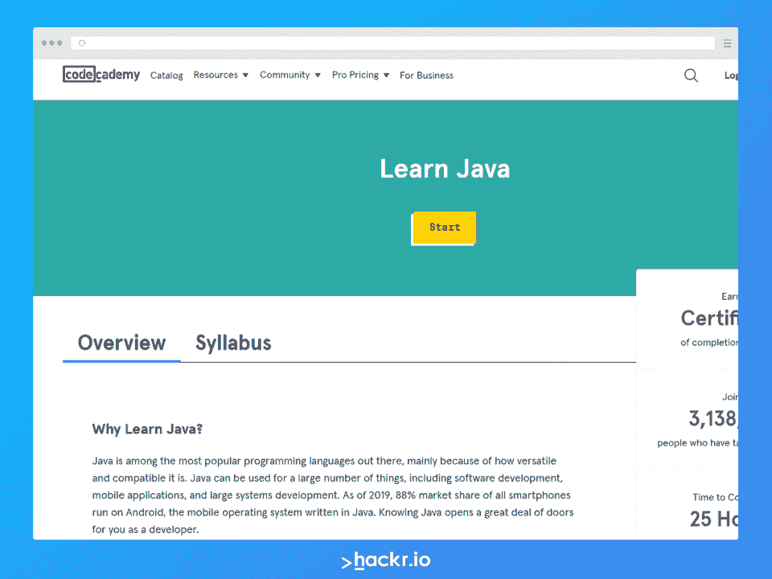
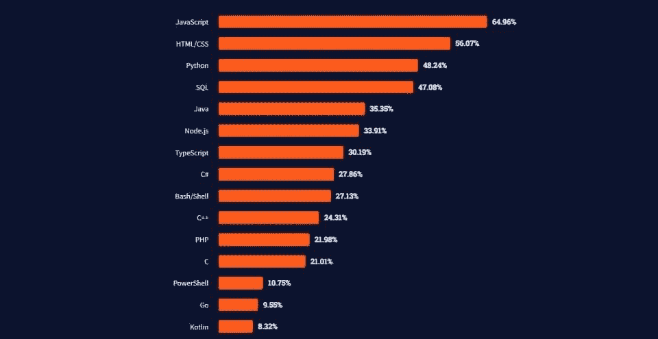
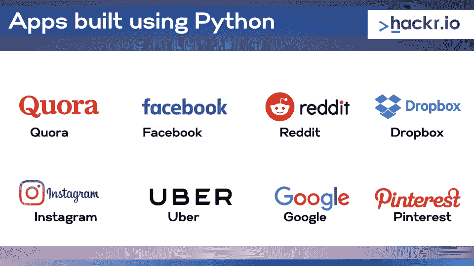
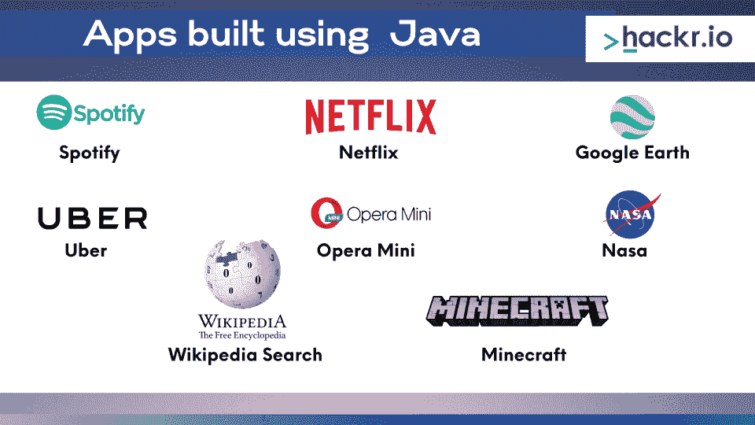

# python vs Java:2023 年哪个最好？

> 原文：<https://hackr.io/blog/python-vs-java>

编程语言是程序员工具箱中的基本工具，对每项活动都至关重要。即使对于有经验的开发人员来说，在编程语言之间进行选择也是令人困惑的。

Python 和 Java 争夺最流行编程语言的头把交椅已经持续了一段时间——Python 在过去几年取得了惊人的进步，而 Java 保住了自己的位置。

这些语言似乎很完美，事实上，它们能够完成大部分的任务。然而，Python 和 Java 之间有一些关键的区别，可以帮助您做出决定。

我们将从解释每种语言及其关键特征开始，然后在计算机科学的不同领域对它们进行比较，以使您的选择更加清晰。

## **Python vs Java:势均力敌的比较**

| **参数** | **Python** | **Java** |
| **人气** | 非常受欢迎 | 非常受欢迎 |
| **语法** | 简单易学 | 有一个有点陡峭的学习曲线 |
| **性能** | 在各种实现中比 Java 慢 | 比较快 |
| **跨平台** | 是 | 是的，多亏了 JVM |
| **后端框架** | 弗拉斯克·姜戈 | 弹簧、刀片 |
| **机器学习库** | Tensorflow, Pytorch | Weka，Mallet，Deeplearning4j，MOA |
| **游戏开发引擎** | Cocos，Panda3d | JMonkeyEngine |

## **Java 是什么？【定义】**

Java 是一种静态类型的通用编程语言，它是一种面向对象的并发语言。

Java 本来是一种 WORA(一次编写，随处运行)语言。在 Java 虚拟机(JVM)的帮助下，它被设计成可以在任何平台上运行，并且具有尽可能少的依赖性。

[](https://www.pntra.com/t/TUJGR0lLR0JHRklKSkdCR0ZISk1N?url=https%3A%2F%2Fwww.codecademy.com%2Flearn%2Flearn-java)

## **Python 是什么？【定义】**

Python 是一种解释型、动态类型的通用编程语言，可用于多种用途。其背后的原始动机是创建一种更高级的语言来弥合 C 和 shell 之间的鸿沟。语法也受到 Algol68、Pascal 和 ABC 等语言的启发，旨在具有可读性和整洁性。

### 推荐 Python 课程

[用 Python 完成从零到英雄的 Python boot camp](https://click.linksynergy.com/deeplink?id=jU79Zysihs4&mid=39197&murl=https%3A%2F%2Fwww.udemy.com%2Fcourse%2Fcomplete-python-bootcamp%2F)

## **Java 与 Python:主要区别**

### **性能**

语言本身没有速度；他们只有语义。如果你想比较速度，你必须选择具体的实现来相互比较。

也就是说，Java 通常更快，因为它是一种编译语言。你可以在一个名为[计算机语言基准测试游戏](https://benchmarksgame-team.pages.debian.net/benchmarksgame/index.html)的项目中找到 Python 和 Java 性能的详细比较，在这个项目中，不同的语言在不同的程序中进行基准测试。

请记住，性能不仅仅是语言执行速度的函数，因为程序的实现和第三方库的性能通常是等式中的首要因素。

所有这些都表明，这里没有严格的 1:1 比较。一般来说，Java 更快，因为它是一种编译语言。然而，Python 需要更少的代码行来执行同样的任务。

### 流行



资源由[栈溢出](https://insights.stackoverflow.com/survey/2021#technology-most-popular-technologies)

根据这个栈溢出调查，Python 在受欢迎程度方面胜过 Java。

这两种语言之间的受欢迎程度一直很高，因为它们与 JavaScript 一样，在受欢迎程度的前三名中一直很接近。在 JS 革命之前，Java 是最流行的语言。JS 刚出来的时候，创始人选择了一个接近 Java 的名字，让它获得牵引力。

根据 Github 的 Octoverse 的数据，Java 是 Github 上使用第三多的语言，排在 JavaScript 和 Python 之后。

在 Stackoverflow 的 2022 年开发者调查中，Python 是仅次于 JavaScript 和 HTML/CSS 的第三大流行语言。48.24%的受访开发者使用 Python，35.35%使用 Java。

可以肯定地说，就受欢迎程度而言，这两种语言差不多。

### 句法

Python 是一种动态类型语言，它不需要你显式地声明变量类型，因为解释器会通过运行时的检查来推断这些类型。这导致了更简单的语法，与英语非常相似。

此外，Python 不使用括号，并遵循缩进规则(就像大多数人写伪代码一样)，这使得代码非常容易阅读并且对初学者友好。

在这个简单的类定义中，有一个名为 fruit 的简单类，它带有一个构造函数，这是创建对象实例时将执行的代码。还有两个简单的函数，每个函数打印对象的一个属性。

```
class Fruit:
 def_init_(mysillyobject, name, color);
 mysillyobject.name=name
 mysillyobject.color=color
 def myfunction(abc) :
 print("hello I'm a "+ abc.name)
 def mycolor(abc) :
 print("hello my Color is " + abc.color)
p1 = Fruit ("Apple", "red")
p1.myfunction()
```

另一方面，Java 遵循严格的语法规则。这是一种静态类型语言，你需要显式地声明你的变量类型，如果发现异常，代码将不会编译。

虽然对初学者来说这不是最容易的事情，但一些开发人员对静态类型语言的清晰性感到满意，而许多开发人员对遵循缩进规则感到不舒服，尤其是对于大型代码库。

```
public class Fruit {
 String name;
 String color;
 public Fruit(String name, String color){
 this.color=color;
 this.name=name;
 }
 public void myfunction()
 {
 System.out.println("Hello I'm a :" +name);
 }
 public void mycolor()
 {
 System.out.println("Hello my color is:" + color);
 }
```

这是我们在 Python 中定义的水果类的 Java 等价物，具有完全相同的功能。

### 工作和薪水

Python 和 Java 在工作岗位或薪资待遇上似乎没有客观的区别或比较。在美国，Python 开发人员的平均年薪约为 96000 美元，而在 T2，Java 开发人员的平均年薪约为 97000 美元。

这两种职业都很受欢迎，所以如果你精通其中任何一种，你可以从软件开发员或实习生开始你的职业生涯。

这些因素不应该成为你选择编程语言的标准。相反，选择一个最适合你的具体需求。

## **使用 Python 构建的应用**



许多流行的应用程序都是使用 Python 构建的。例如 Quora、脸书、Reddit、Dropbox 和 Instagram。

## **使用 Java 构建的应用**



Java 主导着移动应用程序的开发，有几个著名的应用程序是用这种语言开发的。例如 Spotify、Twitter、Opera Mini 和 CashApp。使用 Kotlin(一种与 Java 完全互操作的语言)构建的应用程序的例子有 Pinterest、Coursera、优步和 Tinder。

## **Java vs Python:用途/应用**

### **1。游戏开发**

我们不打算谈论大规模、大预算的游戏开发，因为 Python 和 Java 都无法真正与 C++/C#竞争。游戏开发是一个需要最高性能来为用户提供无缝体验的领域，尽管 Java 和 Python 并不慢，但它们并没有为游戏开发提供最佳性能。

然而，已经有几款基于这些语言的流行游戏发布，尤其是有史以来最畅销的游戏之一《《我的世界》》。

JMonkeyEngine 是一个流行的 Java 开源游戏开发引擎。如果您希望从头开始试验计算机图形或构建自己的引擎，OpenGL 也提供了 Java 语言的绑定。

虽然 Python 本身对于游戏创作来说并不是一个强大的选项，但有一些产品，如 Cocos、Panda3d、Pygame 和其他一些用 Python 构建游戏的引擎/框架。Python 是包括游戏开发者在内的许多开发者的流行脚本语言选项。像 Maya 这样的编辑包也使用 Python 作为脚本语言。

### **2。网络开发**

这两种语言都用于后端 web 开发。后端是 web 开发的一个分支，负责创建将在服务器上运行的软件。根据 StackOverflow 的开发者调查，这是最受欢迎的开发领域。

从头开始编写自己的后端技术不仅困难，而且很难涵盖从安全性到可靠性和有效性的所有设计需求。这就是为什么开发人员创建了框架，它是软件中的一种抽象，允许你不用重新发明轮子就能构建你的后端技术。

Python 最流行的两个框架是 [Django 和 Flask](https://hackr.io/blog/flask-vs-django) 。Flask 是一个微型 web 框架——它提供了你需要的基本功能，比如路由请求，而没有太多的开销。Django 是一个功能更加丰富的选项，可以帮助您构建一个强大的后端，同时利用效率和安全性。Django 配备了一个强大的 ORM 层，便于处理数据库和对数据执行不同的操作。

至于 Java，Spring 可能是最知名的 Java 后端框架，它有一个庞大的生态系统和围绕它的巨大社区。Orange、Dell、ge 和许多其他企业都使用 Spring，尽管它现在不像 Django 那样流行，但它是构建企业级应用程序的一个强大选项。

### **3。机器学习**

因为 Python 在语法上是一种非常简单、成熟的通用编程语言。对于来自不同学科的人来说，它成为了一个受欢迎的选择[，他们希望尝试机器学习](https://hackr.io/blog/how-to-learn-machine-learning)，并将人工智能的力量带入各自的领域。

这就是为什么很多 AI 和机器学习的开发都是用 Python 及其庞大的生态系统和库来完成的。例如，Keras、Scikit-Learn、[脸书的 PyTorch 和 TensorFlow](https://hackr.io/blog/pytorch-vs-tensorflow) 。

谈到机器学习，Java 也被认为是一个很好的选择。它易于调试和使用，已经被用于大规模和企业级应用程序，如银行、会计和电子商务行业。库的选项包括 Weka、Mallet、DeepLearning4 和 MOA。

## 底线

Java 和 Python 都是有能力又受欢迎的语言，所以一旦你选择了其中一种，踏上旅程，就不会缺少资源。

Java 和 Python 之间的区别不是初学者应该担心的。相反，想想你能多快开始建造一些东西。对于这一点，Python 更好。选择 Python 更好，因为它非常简单，并且使用类似英语的语法，世界各地的许多计算机科学入门课程都使用它。

然而，如果您的目标是构建来自 C/ C++世界的企业级应用程序，那么 Java 可能对您来说非常熟悉。这一切都取决于你计划建立什么和你想做什么。

## **常见问题解答**

#### **1。Java 和 Python 哪个好？**

本质上，没有一种编程语言更好。它们各有各的优缺点，所以真的要看你想建立什么，以及你的职业目标。

#### **2。Python 比 Java 简单吗？**

是的，Python 比 Java 容易得多，这也是为什么许多大学和课程使用 Python 来教授编程概念。Python 更容易的一个主要原因是因为它可读性很强，并且使用了类似英语的语法。

#### **3。Java 比 Python 快吗？**

是的，众所周知 Java 比 Python 性能更好。因为它是一种编译语言，所以它通常更快。

#### **4。我应该先学 Java 还是 Python？**

如果这是你的第一门编程语言，那么你应该选择 Python。学起来就容易多了，工作机会和工资数字也不相上下。

#### **5。后端开发应该选择 Python 还是 Java？**

Python 更容易学习，因此它将帮助您相对快速地开始并运行后端开发。然而，从长远来看，注意 Java 确实有更好的性能，但这可能只在运行性能密集型网站时才重要。

#### **6。学 Python 够找工作吗？**

如果你对 Python 有足够的专业能力，并且有一个项目组合，那么 Python 就足以让你找到一份工作。然而，你需要对编程和软件开发基础有很强的理解，而不仅仅是对 Python 的理解。

#### **7。Java 和 Python 哪个工资高？**

正如我们前面所描述的，Java 和 Python 的工资范围是一样的。Python 的报酬略高。Python 的支付中值为 9.7 万美元，Java 在美国的支付中值为 9.6 万美元。

#### **8。我应该从 Java 转到 Python 吗？**

Java 和 Python 开发人员都有很多机会，所以没有理由放弃 Java 和 Python——除非你心中有一个明确的目标。如果你想在某个特定的方向上继续你的职业生涯，那么从一种语言转换到另一种语言是可以的，但是没有好的理由不要这样做。

**人也在读:**