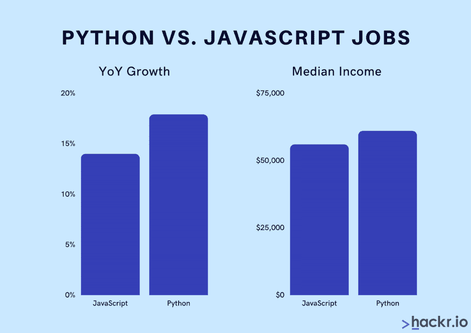
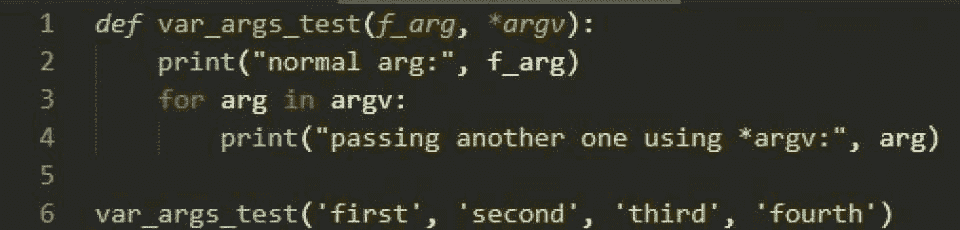
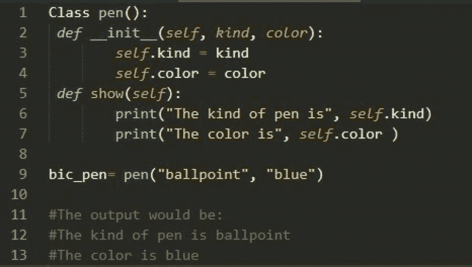
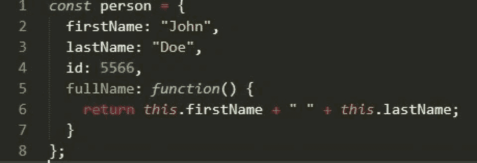

# Python 与 JavaScript: 10+个最重要的区别

> 原文：<https://hackr.io/blog/python-vs-javascript>

Python 和 JavaScript 是目前最流行的两种编程语言。虽然两者都是 [面向对象编程](https://hackr.io/blog/oops-concepts-in-java-with-examples) 语言，但是作用域不同。Python 和 JavaScript 相对容易学习，而且都有大量的工作机会，是开始编码生涯的理想选择。

在[Python](https://www.python.org/)vs . JavaScript 的争论中，了解两者的共同点以及不同点很重要。虽然有很多共同点，但在开始学习任何一种语言之前，还是有一些重要的区别值得了解。

在我们开始列举 JavaScript 和 Python 之间的各种差异之前，让我们先回顾一下这两种语言的概况。

### **Python 是什么？**

Python 是一种高级的、解释性的、强类型的编程语言，具有动态语义和面向对象的设计。它应该易于阅读和实施。经常被引用为最容易学习的编程语言之一，查看一些 [最好的 Python 课程](https://hackr.io/blog/best-python-courses) 以获得对该语言更全面的理解。

Python 也可以作为 Perl 和 Ruby 之类的脚本语言来创建 web 应用程序。Python 的美妙之处在于它允许程序员使用一系列编程风格来开发复杂和简单的程序。

Python 是一种“包含电池的编程语言”，简单来说就是它自带的各种模块。[Python 支持的编程范例](https://hackr.io/blog/programming-paradigms) 有:

*   功能编程
*   命令式编程
*   面向对象编程
*   程序编程

### 推荐 Python 课程

[用 Python 完成从零到英雄的 Python boot camp](https://click.linksynergy.com/deeplink?id=jU79Zysihs4&mid=39197&murl=https%3A%2F%2Fwww.udemy.com%2Fcourse%2Fcomplete-python-bootcamp%2F)

### **JavaScript 是什么？**

JavaScript 或 JS 是一种面向对象的编程语言，广泛用于创建动态网页。它在 ECMAScript 语言规范中是标准化的。除了 OOP，JS 还支持另外两种编程范式:函数式和命令式。

JS 通常用在网页浏览器中，提供使用 CSS 和 HTML 无法实现的动态功能。JavaScript 还支持构建带有日期、文本和正则表达式的标准 web 应用程序。

虽然 JavaScript 最初是用于前端开发的，但现在也用于后端开发。因此，JavaScript 提供了执行全栈开发的能力。事实上，通过 Node.js，js 也可以用于开发独立的桌面应用程序。

[最佳 JavaScript 课程](https://hackr.io/blog/best-javascript-courses) 将为您提供开始前端和全栈开发所需的深度学习。

### 推荐 JavaScript 课程

【JavaScript 全教程 2023:从零到专家！

## **JavaScript 和 Python 哪个更容易？**

从入门的角度来说， [学 Python](https://hackr.io/tutorials/learn-python) 比学 JavaScript 容易多了。事实上，Python 编程语言的主要设计目标之一是易于理解和实现。

这并不是说 JavaScript 是一门难学的语言。它也相对容易学习，你很有可能在开始学习的一两个月内完成一个不错的第一个项目。

由于它们都很容易学，作为一名业余程序员，你应该专注于你想要构建的东西和你的最终目标。

## Python 和 JavaScript 哪个更好？

在 Python 和 JavaScript 之间做出选择是见仁见智的事情。

他们有充足的工作机会，容易学习，并在社区中得到广泛的支持。每一种都有自己的职业发展，并且在某些行业比其他行业更适用。

研究一下掌握每种语言的职业是什么样的，并将其纳入你的决定中。

## **Python 或者 JavaScript 的工作多吗？**

****

Python 和 JavaScript 是目前市场上最流行的两种编程语言。对这两者的需求都很高: [GitHub 数据](https://madnight.github.io/githut/#/pull_requests/2021/4) 显示，在拉取请求方面，它们都位于前两位，Python 的年同比增长率为 17.9%，JS 的年同比增长率为 14%。

[栈溢出开发者调查](https://insights.stackoverflow.com/survey/2022)2022 年的结果显示，JS 的收入中值约为 56000 美元，[而 Python](https://hackr.io/blog/python-while-loop) 的排名略高，为 61000 美元。至于工作机会的实际数量，确切的数字可能会有所不同，但这两个数字都是网上招聘信息中最高的。

所以，简单来说，Python 和 JS 都有大量的工作机会。

## **Python 与 JS:势均力敌的比较**

### **数组、列表和元组**

JavaScript 支持数组作为内置的数据类型。虽然 Python 中没有内置对数组的支持，但是在 Python 中实现 [数组是有变通方法的。这是通过使用列表实现的，这是 Python 提供的最接近数组的东西。](https://hackr.io/blog/python-arrays)

Python 列表类似于 [编程语言](https://hackr.io/blog/what-is-programming-language) 中可用的另一种数据类型:元组。列表和元组之间最重要的区别是前者是可变的，而后者是不可变的。

### **属性和特性**

JavaScript 对象具有可以由底层属性组成的属性。它允许您定义属性。在 Python 编程语言中，使用 getter 和 setter 函数的描述符协议允许您定义属性。

### **代码块**

JavaScript 利用花括号来定义代码块。另一方面，Python 使用缩进来定义代码块。而 JavaScript 有分号(；)作为语句结束符(虽然不是强制的)，Python 使用了换行符。

### **编码格式**

JavaScript 应该编码成 UTF-16。此外，编程语言中没有对处理原始字节的内置支持。除非指定编码格式，否则 Python 源代码默认为 ASCII。

### **函数参数**

****

### *使用 args 关键字传递未指定数量的参数*

如果用不正确的参数调用函数，Python 会引发异常。它还接受带有特殊语法“*args”的附加参数。后者用于向函数传递可变数量的参数。

JavaScript 并不关心函数是否用正确的参数调用。这是因为，默认情况下，JS 中任何缺失的参数都被赋予“未定义”值；如果有任何额外的参数，JavaScript 会将它们视为特殊参数。

### **哈希表**

哈希表是索引结构，允许你定义一个成对值的列表。它们用于搜索、插入和删除操作，比更快

Python 编程语言具有内置的散列表，称为字典、集合等等。字典数据类型是用来表示哈希表实现的数据类型。

JavaScript 有 map 和 set 形式的哈希表支持。

### **隐式转换**

Python 是一种强类型编程语言，也就是说，在编程语言中没有隐式的数据类型转换。不过 Python 对 **都有规定** 强类型和动态类型。

与此相反，JavaScript 是弱类型的，因此提供了隐式的数据类型转换。

例如，在 Javascript 中，类型转换将如下进行:

```
3 + ‘3’; //The output is ‘33’, a string
```

在 Python 中，如果你做同样的事情，你会得到一个类型错误。动态类型是指变量在任何特定时刻根据其赋值改变类型的能力。

### **继承**

Python 和 JavaScript 都支持继承。但是，区别在于它们的类型。JavaScript 使用基于原型的继承模型，而 Python 使用基于类的继承模型。

Python 和 JavaScript 在继承方面的另一个区别是 Python 没有从实例继承的方法，而 JS 有。

### **移动开发**

除了前端和后端开发，JavaScript 也是一个很好的移动开发选项。然而，Python 通常不用于开发移动应用程序。然而，近年来，一些开发人员已经开始使用 Python 进行移动开发。

### **模块和库**

Python 被称为“内置电池的编程语言”,因为它有几个模块。此外，它还有许多用于完成数据分析、机器学习和科学计算的库。

相反，JavaScript 自带的模块数量较少，比如 date、JSON 和 math。JS 的附加功能可以通过主机环境获得，主机环境通常是 web 浏览器，偶尔也可以是不同的东西，比如操作系统。

### **可变性**

可变对象是那些一旦被赋值就可以改变其值的对象。相反，不可变对象不能改变值。

[Python](https://hackr.io/blog/python-programming-language)中的数据类型分为可变类型和不可变类型。例如，集合是可变数据类型，而列表是不可变数据类型。

JavaScript 也有可变和不可变的数据类型。前者的例子是对象、数组和集合，而后者的例子是数字、字符串和布尔值。

### **数字类型**

在 JavaScript 中，你过去只有浮点变量。然而，现代浏览器和 V8 引擎也支持一种新的原语类型:BigInt。

相反，Python 编程语言有几种不同的数字数据类型，如 int、定点十进制和 float。

### **对象访问**

为了访问类的实例，Python 使用了“self”关键字。相反，JavaScript 有“this”方法来访问对象。



*使用 self 关键字访问 Python 中的对象*

**

*使用本方法访问 JavaScript 中的对象*

### **程序编程**

Python 和 JavaScript 都遵循多范例方法，即:它们支持不止一种编程范例。

Python 和 JavaScript 都提供了函数式、命令式和面向对象的编程方法。然而，Python 拥有一种[过程编程语言](https://hackr.io/blog/procedural-programming)的几个方面，而 JavaScript 却没有。

### **REPL(读取-评估-打印-循环)**

随着 Python 在系统上的安装，您获得了 REPL。JavaScript 在所有现代浏览器的浏览器控制台中都有 REPL。您也可以通过安装 Node.js. 获得 JavaScript 的 REPL

### **应用程序**

JavaScript 是构建网站或本地应用的理想选择。另一方面，Python 适合于各种任务，包括数据分析、机器学习和数学密集型操作。

## **Python 和 JavaScript:主要特性和差异总结**

| **特性** | **Python** | **JavaScript** |
| 数组、列表和元组 | 没有对阵列的内置支持 | 支持内置数据类型 |
| 属性和特性 | 描述符协议用于定义属性 | 对象可以有底层属性 |
| 代码块 | 使用缩进定义代码块；新行终止语句 | 用花括号定义代码块；分号来终止语句 |
| 编码格式 | 默认为 ASCII 码 | UTF-16 |
| 函数参数 | 在参数不正确的情况下引发异常 | 缺少的参数被赋予未定义的值 |
| 哈希表 | 支持内置哈希表 | 已经映射并设置了 |
| 隐式转换 | 无隐式数据类型转换 | 提供隐式数据类型转换 |
| 继承 | 基于类的继承模型 | 基于原型的继承模型 |
| 移动开发 | 通常不用于移动开发 | 更好的移动开发工具 |
| 模块和库 | 有几个模块 | 有较少的模块 |
| 可变性 | 支持可变和不可变类型 | 支持可变和不可变类型 |
| 数字类型 | 支持多种数值数据类型 | 浮点变量和 BigInt |
| 物体 | 使用“自我”关键字 | 使用‘this’方法 |
| 程序编程 | 更强大的程序编程支持 | 支持[程序化编程](https://hackr.io/blog/procedural-programming)；不如 Python 健壮 |
| REPL | 内置 | 在现代浏览器控制台上或通过 Node.js |
| 应用程序 | 网站和全栈开发 | 数据分析、机器学习、科学应用 |

## **Python vs Javascript:最后的决定**

现在你知道了 Python 和 Javascript 之间的区别，这应该有助于你在两者之间做出选择。

这两种编程语言有很多共同之处，比如遵循多范例方法和词法范围。与此同时，两者之间有几个不容忽视的差异。

记住，每种语言都有它的用例。然而，您可以用 Python 实现几乎任何可以与 JavaScript 一起使用的东西。

Python 和 JavaScript 并不缺少库和扩展来实现比内置特性更多的功能。虽然两者都有几个工作机会，但 Python 的市场占有率更高，也更容易学习。

无论你选择哪一个，祝你好运，别忘了充分利用在线学习资源来帮助你。

如果你对扩展自己的知识感兴趣，可以看看这些伟大的 Python 认证。

[](https://coursera.pxf.io/BXVXKx)

**人也在读:**

哪一个是你个人最喜欢的？请在评论区告诉我们。