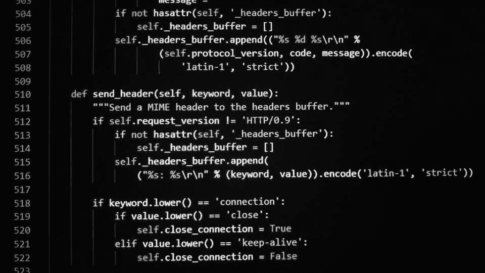
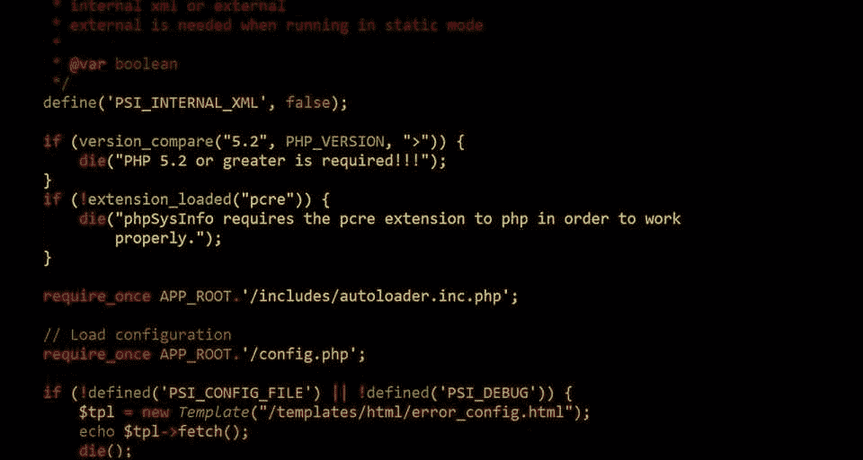
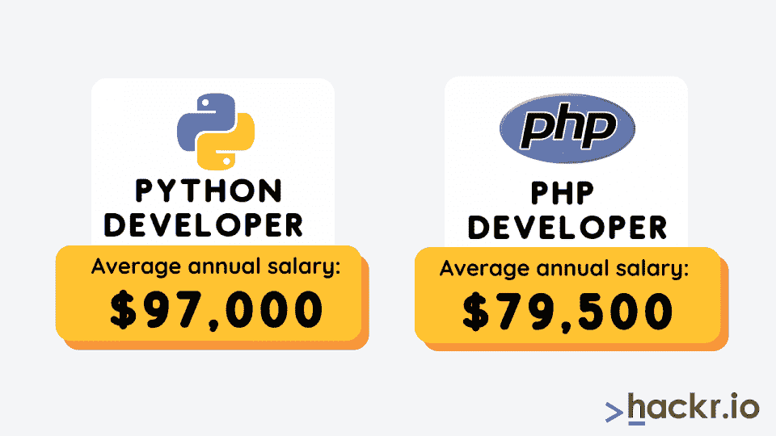
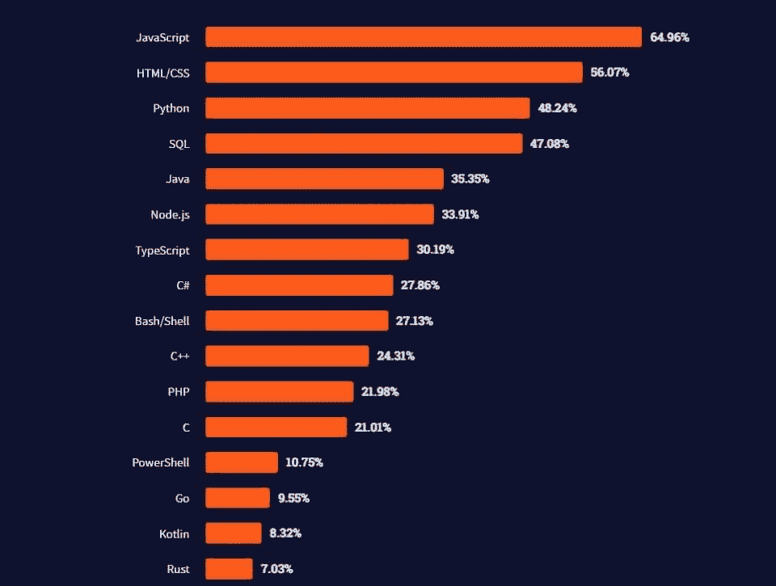

# 2023 年 Python vs PHP 比较、特性和应用

> 原文：<https://hackr.io/blog/python-vs-php>

后端开发是 web 开发的两个和谐部分中的一部分，它是市场上非常受欢迎的技能。几乎所有的新企业/初创公司都需要一个网站和一个移动应用——两者都连接到后端的服务器。

因此，[后端开发人员](https://hackr.io/blog/how-to-become-a-backend-developer)需求量很大，公司愿意向拥有必要技能和经验的开发人员投入大笔资金。在这篇文章中，我们将讨论 PHP 和 Python 这两种用于后端开发的编程语言之间的区别。

但是在我们研究 Python 和 PHP 的更详细的细节之前，让我们看看后端开发选择什么样的[编程语言](https://hackr.io/blog/what-is-programming-language)，以及 Python 和 PHP 的简要概述。如果你想快速一瞥这两者是如何叠加的，下面有一个包含要点的表格。

## Python 与 PHP 在 Web 开发中的比较:概述

| 特征 | 计算机编程语言 | 服务器端编程语言（Professional Hypertext Preprocessor 的缩写） |
| 易于学习 | 简单易学。许多初学者选择 Python 作为他们的编程语言。 | 不是作为通用语言开发的，但是相当容易学习 |
| 社区支持 | 出色的社区支持 | 出色的社区支持 |
| 证明文件 | 全面的文档 | 全面的文档 |
| 图书馆支持 | 非常完善的库支持几乎所有类型的应用程序 | 极少数图书馆，Packagist 是一个著名的图书馆 |
| 数据库连接 | 数据库集成不如 PHP 强大 | 提供对 20 多个不同数据库的访问 |
| 速度 | 可能会很慢，具体取决于应用程序 | 相对更快 |
| 结构 | 姜戈，烧瓶，塔，金字塔 | 密码破译员，发送者，拉拉，symfony |
| 排除故障 | PDB (Python 调试器) | 用于调试的 XDebug 包 |

## 后端开发的编程语言

现在，在我们看一些分析 PHP 和 Python 的标准之前，让我们看一下一般的编程语言。具体来说，我们将研究各种语言，包括 Python 与 PHP 的后端开发。

对于新开发人员来说，学习哪个后端框架总是一个困惑的问题。这么多新的编程语言提供了这么多的特性、库和框架，我们如何决定学习哪种 web 框架呢？

以下是后端开发的[各种编程语言](https://hackr.io/admin/blog/posts/9/%22https:/hackr.io/blog/best-programming-languages-to-learn)的简要总结。

*   Python:后端编程最受欢迎的选择之一。它相对较新，有大量的库支持
*   PHP: PHP 在市场上已经存在很长时间了，现在仍然被广泛使用。例如，脸书最初用 PHP 开发了大量的后端
*   JavaScript:借助 NodeJS 等强大的 web 框架，JavaScript 已经占领了巨大的市场份额，并成为最受欢迎的后端编程语言之一
*   Ruby: Ruby on Rails 是另一个流行的 web 开发框架，有几家初创公司在使用它
*   。NET:微软的。NET framework 最初更多的是一个专有的，但该公司最近一直在开源它。因为有微软的支持，它主要用于企业。

## Python 是什么？

| 赞成的意见 | 骗局 |
| 易于理解的语法，易于调试和维护

*   因为它是一种可移植语言，所以可以在各种平台上运行
*   许多预构建的库，这使得开发更容易
*   Python 的开发方式可以在内部处理内存地址和垃圾收集
*   有一个交互式外壳，可以帮助开发人员在实现之前测试这些东西
*   数据库友好，并为所有主要的商业 DBMS 系统提供数据库接口
*   支持图形用户界面应用程序，并有一个网络框架。例如:tkmter、WXPython、Django

 | 相对较高的内存消耗

*   [功能编程](https://hackr.io/blog/functional-programming)可能不太理想
*   动态类型，这可能导致运行时错误
*   用于移动开发的 Python 不是最佳选择
*   由吉多·范·罗苏姆开发并于 1991 年发布的 Python 是一种解释型高级函数式编程语言。Python 在 web 开发、软件开发和系统脚本中有其用途。它是许多程序员和数据科学家的最爱，因为它提供了支持不同平台、在解释器上运行的能力和类似英语的语法等特性。

 |

尽管 Python 有大量的用途，但最受欢迎的用途还是与 web 应用程序创建、数据库系统读取和修改、大数据分析以及复杂的数学计算有关。

推荐 Python 课程

### [用 Python 完成从零到英雄的 Python boot camp](https://click.linksynergy.com/deeplink?id=jU79Zysihs4&mid=39197&murl=https%3A%2F%2Fwww.udemy.com%2Fcourse%2Fcomplete-python-bootcamp%2F)

Python 的特性

### 对初学者友好的语言

*   Python 可以使用相同的接口在各种平台上执行
*   Python 解释器中可以包含低级模块
*   Python 为大型代码库提供了支持和理想的结构。
*   自动垃圾收集
*   Python 提供了交互式测试和调试会话
*   提供了高级动态数据类型，并且还支持动态类型检查
*   与 Java、C 和 C++集成
*   PHP 是什么？

## 

赞成的意见

| 骗局 | 支持多种操作系统，包括 Windows、Unix、Linux 和 Mac OS |
| 与几乎所有服务器兼容

*   支持一系列数据库
*   高效处理数据库
*   高效的单元测试
*   开源
*   弱类型语言
*   不适合大规模以内容为中心的 web 应用程序

 | 难以修改核心行为

*   额外的功能会影响性能
*   由丹麦裔加拿大程序员拉斯马斯·勒德尔夫于 1994 年创建的超文本预处理器，又名 [PHP](https://hackr.io/tutorials/learn-php) ，是一种广泛使用的开源脚本语言。PHP 能够生成动态页面内容，可以在服务器上创建、打开、读取、写入、删除和关闭文件。它还可以收集表单数据，也可以发送和接收 cookies。
*   此外，PHP 是数据库友好的，可以添加、删除和修改数据库中的数据。它还可以用来控制用户访问和加密数据。
*   PHP 的特点

 |

一种更简单的脚本语言

支持许多数据库，如 Oracle、MySQL

## 与其他脚本语言相比更高效，例如 ASP 和 JSP

*   具有预定义的错误报告常数，以生成错误通知或警告
*   通过创建用户最近访问的摘要来提供访问日志记录
*   开源
*   Python 和 PHP 哪个更容易？
*   对这个问题的看法可以有所不同，两种语言在学习难度上是相似的。当谈到编程时，回答这类问题的背后有很多背景。你是从 PHP 转到 Python 还是从头开始？你的目标是什么？
*   对于 web 应用程序开发，PHP 可能更好，因为它是为此而设计的，但是 Python 并没有那么难，所以您应该放弃它。

# 底线是，就学习 Python 和 PHP 的难度而言，两者相当，所以专注于你想要构建和工作的东西。

2023 年该学 PHP 还是 Python？

这个问题的答案要简单得多:Python 是 2023 年更好学的语言。薪水更高，工作机会也多得多。

在美国，Python 开发人员的平均年薪约为 97，000 美元。PHP 开发人员的平均年薪在[79500 美元](https://www.glassdoor.com/Salaries/php-developer-salary-SRCH_KO0,13.htm)左右。

## 

PHP 可以被 Python 取代吗？

不会。它们都有各自的用途，并且在某些任务上比另一个做得更好。Python 更适合许多应用程序，但是对于某些 web 应用程序目标，使用 PHP 可能更节省资源。就 web 应用程序开发而言，PHP 和 Python 之间的区别在于您试图构建什么。

我应该先学 PHP 还是 Python？

## 

根据 StackOverflow 的调查，最受欢迎的语言是

## 这个要看你的目标是什么。如果你想学习你的第一门编程语言，那么 Python 可能是一个更好的选择，因为薪水更高，而且它是最受欢迎的编程语言之一。

Python vs PHP

现在我们已经对 Python 和 PHP 有了基本的了解，让我们根据选择语言的基本标准来看看它们之间的区别。这样，我们就能更好地理解 PHP 和 Python 哪个更好。

易学——Python 胜出

## Python 更容易学，尽管 PHP 并不难。Python 是一种通用编程语言，可以很快学会。与其他编程语言相比，Python 程序更短、更容易编写，因此，它已经成为许多应用程序的首选。语法相对简单得多，代码可读性极强。

PHP 并不意味着是一种通用语言。它是专门为 web 应用程序设计的，web 应用程序肯定比简单的独立程序更复杂。因此,[学习 PHP](https://hackr.io/tutorials/learn-php) 可能比[学习 Python 要花更多的时间。](https://hackr.io/tutorials/learn-python)话虽如此，PHP 本身并不是特别难。

### Python 和 PHP，都有优秀的社区支持。

PHP 已经进入市场有一段时间了，尤其是在开发 web 应用程序方面。因此，有一个庞大的 PHP 开发人员社区可以提供支持。

Python 在这里也是一样。[社区支持](https://www.python.org/community/)非常出色。

当谷歌开始将 Python 用于 YouTube 等应用时，python 变得流行起来。许多强大的初创公司，如 Instagram、Pinterest 和 Reddit，也使用基于 Python 的 web 应用程序。

话虽如此，但必须指出的是，世界上最大的社交网络脸书是使用 PHP 作为主要后端编写的。

文档- Tie

两种编程语言都有大量的文档。有无数的网站、论坛、讨论板提供了关于如何使用 Python 或 PHP 开发应用程序的优秀教程。

价格捆绑

### Python 和 PHP 都是完全免费和开源的。双方都是赢家。事实上，Python 和 PHP 在这方面都明显优于其他付费 web 框架。

库支持——Python 胜出

### 现在，这是 Python 明显胜过 PHP 的一点。Python 对几乎所有类型的应用程序都有非常完善的库支持。PHP 在这里落后了，但是 [Packagist](https://packagist.org/) (PHP 软件包库)是 PHP 的坚强支柱。

目前，许多初创公司甚至大型组织都在开发机器学习支持的 web 应用程序。Python 提供了一些优秀的[机器学习库](https://hackr.io/blog/best-machine-learning-libraries)像 TensorFlow，Keras，Theano，Scikit Learn 等。这些库快速、易用，最重要的是，它们与 web 框架完美地集成在一起。因此，与几乎任何其他编程语言相比，使用 Python 开发这种类型的应用程序要简单得多。

### 速度限制

这是一个平局，因为它取决于上下文。

PHP 5.x 版本非常慢，执行起来要花很多时间。然而，最新的主要版本 PHP 8.1 要快得多——几乎是典型 Python 程序的 3 倍。

### 在性能关键型应用中，速度往往成为一个重要因素。例如，在一个每天有一百万次点击的核心银行系统中，3 次延迟可能会对整个系统性能产生重大影响。因此，就速度而言，PHP 远远胜于 Python。

但是，必须注意的是，对于大多数简单的应用程序来说，比例非常低，因此没有太多明显的时间延迟。例如，出于实际目的，如果应用程序不是延迟关键型的，10 毫秒和 30 毫秒没有太大区别。

Web 框架的选择——Python 胜出

Python 和 PHP 在这一点上非常接近，因为它们都提供了同样好的选择。然而，新开发人员喜欢使用 Django，因为 Django 的开发时间很短，而且很容易安装。

最常用的基于 Python 的 web 框架有 Django、Flask、Pylons、Pyramid 等。最常用的[基于 PHP 的 web 框架](https://hackr.io/blog/best-php-frameworks)有 Codeigniter、Zend、Laravel、Symfony 等。

### 众所周知，Django 非常快速、可伸缩、安全且易于使用。它非常健壮和强大，在大量应用程序中广泛使用。类似地，Codeigniter 和 Laravel 在市场上被广泛使用，现在几乎所有的 PHP 应用程序都使用这两个框架中的一个。

调试- Tie

Python 提供了一个强大的调试器，叫做 PDB (Python Debugger)。PDB 是有据可查的，并且易于使用，即使对于初学者也是如此。另一方面，PHP 提供了用于调试的 XDebug 包。PDB 和 XDebug 都提供了最常用的调试功能——断点、堆栈、路径映射等。

Python 和 PHP 在这方面是相似的，没有一个是明显的赢家。

### 2023 年应该学 Python 还是 PHP？

综上所述，对于大多数观点来说，Python 和 PHP 都是彼此相似的。但是 Python 在一些关键因素上胜出。最重要的是，Python 的工资中位数更高，工作机会也更多。

所以，从很多方面来说，Python 比 PHP 更胜一筹，PHP vs Python 的问题有点悬而未决。但是我们建议你这样做:

## 如果你是一个有经验的 PHP 程序员，坚持使用 PHP，因为你已经对它了如指掌。PHP 认证可能会有所帮助。

如果你是一个中级程序员，从 PHP 迁移到 Python 应该不难。你可能想学习 Python，并转向它以获得更好的工作机会。

Python 课程帮助您入门

*   
*   无论你决定什么，祝你好运！
*   If you are a novice programmer who wants to learn backend development, start [learning Python](https://hackr.io/blog/best-python-courses) and eventually move to Python-based frameworks.

    ## **人也在读:**

    

Whatever you decide, good luck!

**People are also reading:**