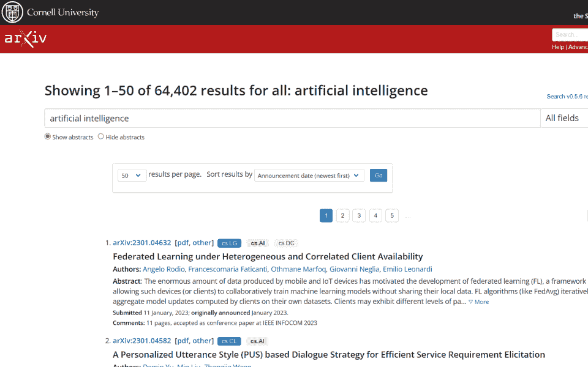
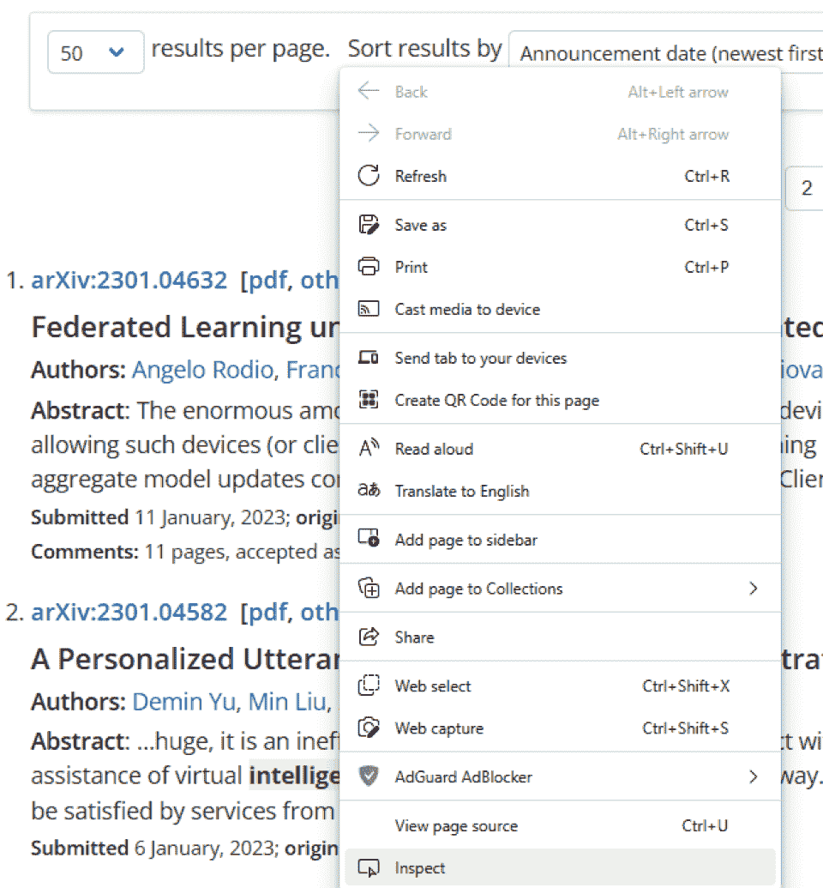
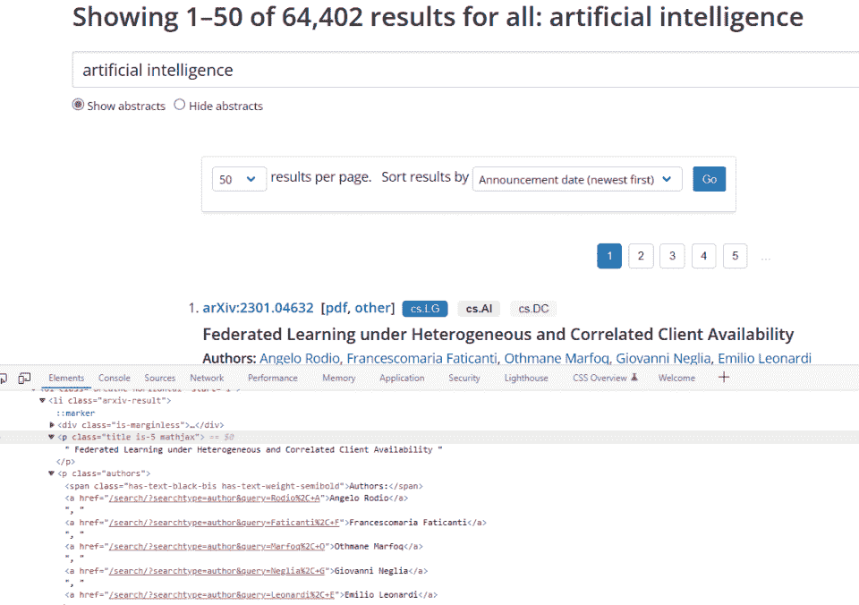
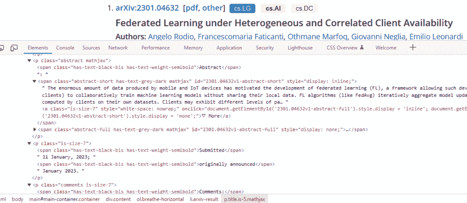
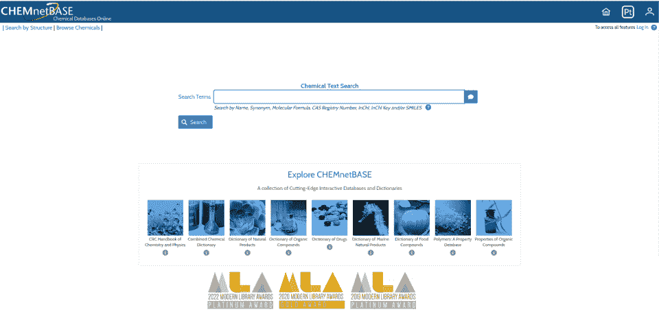
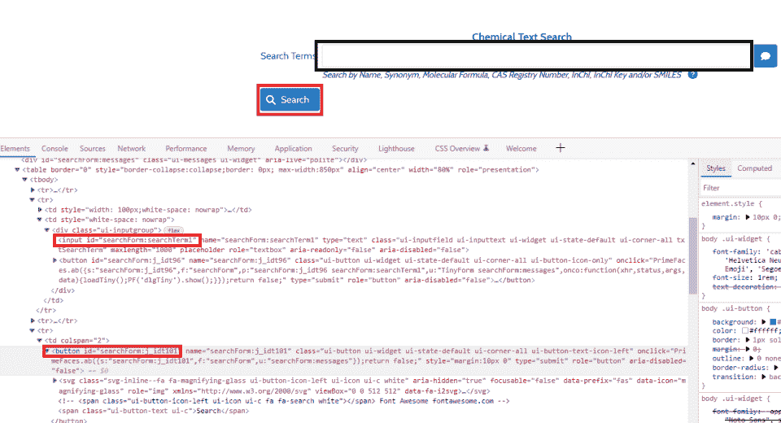
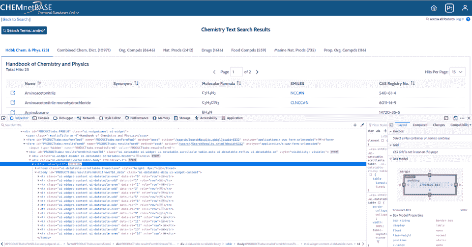

# Python 网页抓取指南

> 原文：<https://hackr.io/blog/python-web-scraping-guide>

网络抓取是一个过程，包括编写程序从网站上获取并解析公开可用的数据。根据网站的设计，这可能是对非结构化数据的简单提取，或者需要您模拟人类的行为，如点击链接或填写表格。

互联网是一个不断增长的网站集合，使其成为一个巨大的信息数据资源。通过利用 web 抓取技术，包括数据科学、商业智能等在内的一系列行业可以从这些信息中提取巨大的价值。

Python web 抓取是完成这一活动最流行的方式之一。凭借直观的语法和一系列强大的第三方 web 抓取库，Python 中的 web 抓取是从公共网站生成结构化数据的一种极佳方式。

## **为什么要学习 Python 网页抓取？**

*   **生成结构化数据:**收集并转换一系列非结构化格式的公开网站数据
*   **自动化:**取代缓慢繁琐的人工收集网页数据的过程，省时省力，提高生产力
*   **替代 API:** 从不提供 API 或其他数据访问方式的网站中提取信息
*   **数据监测:**追踪竞争对手、SEO、新闻开发、社交媒体等
*   **市场营销:**市场分析、销售线索挖掘、市场趋势等

## **Python 数据抓取技巧**

在开始使用 Python 进行数据采集之前，您需要理解各种概念。

*   **Python 基础:**变量、数据类型、集合、循环、控制结构等
*   **领域对象模型(DOM):** 页面加载时浏览器创建的对象的树形结构，允许脚本访问/更新网页内容，结构&风格
*   **HTML & XML 基础知识:**构建和格式化网页，你需要理解标签和属性，Python 才能成功抓取网站数据
*   HTTP 方法:至少理解 GET、POST、PUT 和 DELETE 方法

你是想开始网络抓取的 Python 初学者吗？要提高你的技能，请查看:

**[最佳免费 Udemy 课程](https://hackr.io/blog/free-udemy-courses)**

## **网络抓取 Python 库**

幸运的是，我们可以从一系列[流行的 Python 库](https://hackr.io/blog/best-python-libraries)中挑选来抓取 web 数据。我们选择了三个最受欢迎的第三方库，并在下表中比较了它们的主要特性。因此，如果你想知道如何用 Python 从网站上抓取数据，这可能会有所帮助。

虽然这些对于一般的网络抓取都是有用的，但是根据你的网络抓取目标和你的任务大小，知道什么时候和为什么使用这些工具是有帮助的。

|   | **美汤** | **硒** | **刺儿头** |
| **易用性** | 坦率的 | 中等 | 中等硬度 |
| **速度** | 快的 | 中等 | 快的 |
| **JavaScript 支持** | 不 | 是 | 需要中间件 |
| **学习曲线** | 简单易学 | 中等 | 中等硬度 |
| **文档** | 优秀的 | 好的 | 好的 |
| **优点** | 简单分析器 | 广泛的浏览器支持 | 带有 Spider 的完整 API |
| **缺点** | 需要依赖关系 | 面向测试 | 缺少 JavaScript 支持 |
| **用例** | 从少量页面中提取 HTML 数据 | JavaScript 页面交互性，包括表单、导航等 | 需要高级功能的大型专业项目 |

## **美汤网刮教程**

在这个例子中，我们将通过 Python 库 *BeautifulSoup4* 使用 Python 和 Beautiful Soup 进行 web 抓取。

我们将使用 ArXiv，这是一个数学、物理、计算机科学、生物、金融等领域的科学论文的开放资源库。我们将通过获取标题、摘要和作者来关注人工智能论文。

在我们编写任何代码之前，我们需要访问网页，检查 GUI 和 HTML 内容。这样做表明论文以重复的格式列出，如下图所示。



*从研究网页结构开始*

然后，我们可以使用浏览器的开发工具来检查这个页面的 DOM。您可以进入浏览器菜单，或者右键单击结果页面上的任何文章，然后选择 *inspect，*，如下图所示。



*使用开发者工具访问网页 DOM*

我们知道我们想要抓取与每篇论文相关的特定数据字段，所以我们需要检查 DOM，直到找到包含这些数据的 HTML 元素。



*检查网页 DOM 以找到 HTML 元素*

通过检查 DOM 中的 HTML 元素，我们可以看到论文包含在带有一个类*、【arxiv-result】、*的*、【李】、>、*标签中。这些信息是必不可少的，我们将使用它在我们的 Python 程序中从网页的 HTML 内容中抓取论文。

我们研究的最后阶段是查看这些*、<、李>、*标签中的内部 HTML 元素，如下图所示。

我们可以看到，每个数据元素都包含在 *< p >* 标签中，用不同的类名来标识不同的数据字段。同样，这是我们的基本信息，我们将在 Python 代码中使用它来收集这些数据。



*检查 HTML 元素以找到数据字段*

我们现在准备用 Python 编写漂亮的 Soup web 抓取程序，以获取、处理和存储结构化数据文件中的数据。

查看下面的源代码，您会发现我们必须安装并导入*请求*和*美丽组 4* 库。我们还导入了 *json* 和 *csv* 模块，以便在完成处理后保存结构化数据。

**源代码:**

```
'''
Python Web Scraping: Beautiful Soup
-------------------------------------------------------------
pip install requests beautifulsoup4
'''

import requests
from bs4 import BeautifulSoup
import json
import csv

base_url = 'https://arxiv.org/search/?'
query = 'query=artificial+intelligence&searchtype=all&source=header'
request_url = base_url + query
response = requests.get(request_url)
soup = BeautifulSoup(response.text, 'html.parser')
papers = soup.find_all('li', class_='arxiv-result')

data = []
for paper in papers:
    title = paper.find('p', class_='title is-5 mathjax').text
    abstract = paper.find('p', class_='abstract mathjax').text
    authors = paper.find('p', class_='authors').text
    paper_data = {
        'Title': title,
        'Abstract': abstract,
        'Authors': authors
    }
    data.append(paper_data)

with open('papers.json', 'w') as f:
    json.dump(data, f)

with open('papers.csv', 'w') as f:
    writer = csv.writer(f)
    writer.writerow(["Title", "Abstract", "Authors"])
    for paper in data:
        writer.writerow(paper.values())
```

我们从用*获取网页内容开始。从*请求*中获取()*方法。我们可以将它作为第一个参数传递给 *BeautifulSoup* 构造函数，第二个参数是一个*解析器*参数。我们选择了 HTML 解析器，因为我们的网页将是 HTML 内容。

通过创建一个 *BeautifulSoup* 对象，我们可以将页面的 HTML 内容表示为一个嵌套的数据结构对象，允许我们通过标签类型和标签属性进行搜索。

我们使用*。find_all()* 方法返回嵌套结构中的所有 HTML 元素，嵌套结构是一个 *< li >* 标签，带有一个类*‘arxiv-result’*(我告诉过你这会很有用！).然后，我们可以用 for 循环遍历这个标签对象列表，允许我们处理每一篇文章。

通过迭代文章，我们可以使用*。find()* 方法提取每个页面的标题、摘要和作者的数据字段。

我们使用在初步研究中发现的 *< p >* 标签类来确保获取正确的 HTML 元素。我们也使用*。text* 属性来确保我们只返回包含在 HTML 标签中的文本。

每个循环都将关键信息添加到一个字典中，然后将它附加到我们的 *data* list 对象中，以将我们收集的数据保存到一个数据结构中。该阶段表示通过字典和列表将非结构化网页数据转换成结构化格式。

当我们浏览完文章后，我们使用两种方法将结构化数据保存到一个文件中。

首先，我们使用 *json.dump()* 将数据序列化为 json 格式，保存到一个 JSON 文件中。这对于与其他应用程序共享 JSON 数据非常有用。

其次，我们将数据保存到一个标准的 CSV 文件中，这样我们就可以在电子表格软件或其他应用程序中使用它。这要求我们循环遍历我们的*数据*列表中的每个元素，将每个元素作为一个新行写入 CSV 文件。

查看官方[文档](https://beautiful-soup-4.readthedocs.io/en/latest/)了解更多关于美汤的信息。

## **带硒的 Python 刮痧教程**

在本例中，我们将使用 Python 库 Selenium 通过表单和按钮与网站进行交互。

我们将使用 ChemNetBase 网站，这是一个化学信息的综合数据库，包括化学工业中研究人员、学生和专业人员使用的结构、性质、光谱和反应。

我们将通过搜索名称或描述中包含“氨基”一词的化合物来保持相对简单。

在我们开始任何代码之前，我们需要对网站的 HTML 元素结构进行初步的研究。

首先，我们进入搜索页面检查 GUI，如下图所示。这让我们能够识别将与 Python 程序交互的搜索页面元素。



*研究搜索页面的 GUI 结构*

我们可以通过右键单击搜索栏和搜索按钮来检查搜索页面的 DOM，然后选择*检查*。这突出了我们需要与之交互的 DOM 元素，如下图所示。



*检查搜索页面 DOM 以找到输入的&按钮元素*

我们可以看到，搜索栏包含在 id 为 *'searchForm:searchTerm1'* 的 *< input >* 元素中，搜索按钮包含在 id 为 *'searchForm:j_idt101'* 的 *<按钮>* 元素中。这对我们的 Python 程序至关重要。

第二步是检查搜索结果页面，找到包含我们想要抓取的数据的 HTML 元素。我们将运行对术语“amino*”的搜索，然后右键单击任何结果来*检查*DOM，如下图所示。



*检查结果页面 DOM 以找到 HTML 元素*

我们看到结果包含在一个 *<表>* 中，该表带有一个 *< tbody >* 元素，该元素的 id 为*‘product tabs:results form 0:hitrowsTbl _ data’*。这代表了完整的结果集，但是我们需要通过访问单个 result *< tr >* 元素来用 Python 抓取数据。

我们现在准备编写 Python 程序来与网站交互，获取数据，处理数据，并将其存储在结构化的 CSV 文件中。

查看下面的源代码，您会发现我们必须安装 Selenium 并从 Selenium 库中导入各种类。

其核心是 Selenium *WebDriver* ，这是一个简单但功能强大的面向对象的 API，允许我们在浏览器中以编程方式与网页进行交互。

我们将使用谷歌 Chrome，这意味着我们需要从 *selenium.webdriver* 导入 *Chrome* 。

我们还将从*selenium . web driver . chrome . Options*模块中导入*选项*类。通过创建这样的一个实例，我们可以将我们的 *WebDriver* 对象设置为 *headless* ，允许我们的 Chrome 浏览器在后台运行而无需加载 GUI。

根据您的操作系统，您可能需要从源代码中的链接下载并安装 ChromeDriver。Selenium 在与网页交互时用这个来控制你的 Chrome 浏览器。

如果你更喜欢使用 Firefox、Safari 或其他浏览器，我们的源代码提供了一个你可以修改的模板。我们建议前往官方[文档](https://www.selenium.dev/documentation/)获取每个浏览器的具体细节。

您还会看到，我们从*selenium . web driver . common . By*模块中导入了 *By* 类来帮助定位网页元素，并从*selenium . common . exceptions*模块中导入了 *TimeoutException* 来处理网页超时。

**源代码:**

```
'''
Python Web Scraping: Selenium
-------------------------------------------------------------
Follow instructions to Download chromedriver from:
https://chromedriver.chromium.org/downloads/version-selection

pip install selenium
'''

from selenium.webdriver import Chrome
from selenium.webdriver.chrome.options import Options
from selenium.webdriver.common.by import By
from selenium.common.exceptions import TimeoutException
import csv

opts = Options()
opts.headless = True
timeout = 10
url = 'https://www.chemnetbase.com'

with Chrome(options=opts) as driver:
   driver.get(url)
   driver.implicitly_wait(timeout)
   try:
       search_form = driver.find_element(By.ID, 'searchForm:searchTerm1')
       print('Page is ready!')
       search_form.send_keys('amino*')
       search_button = driver.find_element(By.ID, 'searchForm:j_idt101')
       search_button.click()

   except TimeoutException:
       print('Search page loading took too much time!')

   try:
       result_table = driver.find_element(
           By.ID, 'PRODUCTtabs:resultsForm0:hitrowsTbl_data')
       print('Results are ready!')
       result_rows = result_table.find_elements(By.TAG_NAME, 'tr')
       data = []
       for row in result_rows:
           cols = row.find_elements(By.TAG_NAME, 'td')
           name = cols[1].text
           synonyms = cols[2].text
           molec_form = cols[3].text
           CAS_num = cols[5].text
           data.append([name, synonyms, molec_form, CAS_num])

       with open('amino.csv', 'w') as f:
           csv_writer = csv.writer(f)
           csv_writer.writerow(
               ['Name', 'Synonyms', 'Molecular Formula', 'CAS Number'])
           csv_writer.writerows(data)

   except TimeoutException:
       print('Results loading took too much time!')​
```

现在我们已经导入了所有必要的模块和类，我们可以开始破解了！

我们首先创建一个*选项*对象，并将 headless 属性设置为 True。我们还必须确保 *WebDriver* 允许通过使用带有超时参数的隐式等待来加载页面元素。

这告诉 *WebDriver* to *poll* 在抛出 *TimeOutException* 之前在定义的时间段内查询页面的 DOM。在我们的例子中，我们设置了一个 10 秒的超时变量来使用*。来自 *WebDriver* 类的 implicitly_wait()* 方法。

代码主体使用 Python 上下文管理器来创建(并自动退出)我们的 *WebDriver* 对象。然后我们可以称之为*。让 *WebDriver* 类的 get()* 方法加载我们的 URL，后面是上面概述的隐式等待方法。

我们为搜索页面使用了一个 try-except 块来捕捉任何超时。如果 *WebDriver* 在 10 秒内没有找到我们的 HTML 元素，它将抛出一个*超时异常*。

我们已经使用了*。来自 *WebDriver* 类的 find_element()* 方法来定位我们的搜索栏。这就用到了*。ID* 属性从 *By* 类传入搜索栏的 HTML 元素 ID(来自我们的初步研究)。

在搜索栏加载之后，我们可以调用*。send_keys()* 方法将' amino* '输入到无头浏览器的搜索栏中。在调用*之前，我们可以用同样的方法找到搜索按钮。单击()*完成我们的搜索并加载结果页面。

在这个阶段，我们已经结束了我们的网页互动，并准备刮的结果。

我们再次使用 try-except 块来处理结果页面的超时。加载结果后，我们使用*。来自 *WebDriver* 类的 find_element()* 方法来定位带有我们在研究 DOM 时发现的 ID 的结果表。

然后我们称之为*。find_elements()* 方法对 table 元素返回一个*列表中*的单个*<tr>元素。这就需要我们使用*。Tag_Name* 属性来自 *By* 类。*

在这个阶段，我们可以迭代我们的 *< tr >* 元素列表，允许我们调用*。在每个上找到 _elements()* 并提取一个列表中的*<>*元素。这些表示我们想要抓取的数据字段。

接下来就是从 *< td >* 元素列表中索引我们想要的值，并将这些值赋给变量。注意，我们使用了*。text* 属性返回标签内的文本。

然后，我们可以将变量添加到存放我们结果的列表*中，为我们收集的数据提供结构化的数据格式。*

最后一步是将我们的数据保存到标准的 CSV 文件中。我们通过遍历列表中的每个元素并将每个元素作为新的一行写入 CSV 文件来实现这一点。

如果您想了解更多关于使用 Selenium 的知识，请查看官方的[文档](https://www.selenium.dev/documentation/)。

## **Python 网页抓取的最佳实践**

遵循最佳实践以确保您的网络抓取活动合法、道德、高效，并且不会对您想要抓取的网站造成损害，这一点很重要。

*   遵守服务条款& robots.txt :遵守网站的服务条款和 robots.txt 文件中的限制，负责任地、合乎道德地进行刮擦
*   **代理&轮换 IP 地址:**网站可能会阻止提出过多请求的 IP 地址，因此使用代理或轮换您的 IP 地址以避免被阻止
*   **处理验证码:**验证码(完全自动化的公共图灵测试来区分计算机和人类)会阻止自动抓取，因此您可能需要手动解决这些问题或使用验证码解决服务
*   **避免过多的请求**:如果你在短时间内发出大量的请求，抓取会使网站的服务器不堪重负，所以要注意你的负载以避免拒绝服务
*   **适当的用户代理:**在 HTTP 报头的用户代理字段中，将自己标识为 web scraper，以帮助网站所有者在 Python scraper 出现问题时阻止它
*   **导出数据:**抓取数据后，您需要通过写入数据库、文件(txt、CSV、JSON 等)或编程数据结构来存储数据，以供将来分析

## **常见数据收集挑战**

无论您有多少经验，任何使用 web 抓取从互联网上收集非结构化数据的人都会面临一些共同的挑战。

*   **网站变化:**网站不断更新，这可能会阻止您的自动网络抓取程序提取数据，直到您更改您的抓取代码

*   **屏蔽或限速:**许多网站试图通过验证码测试、基于 IP 的限速或服务屏蔽来阻止或限制网络抓取

*   **认证:**一些网站需要登录才能访问内容或数据，这要求您的 Python web scraper 在抓取数据之前与网页元素进行交互

*   **质量差的数据:**如果网络抓取程序收集不准确、过时或不可靠的数据，会影响对数据进行的任何分析的质量

*   **法律问题:**网络抓取可能会引起争议，被一些人视为一种未经授权的网站访问，导致服务条款禁止网络抓取

*   **道德考量:**如果网络抓取程序在用户不知情或未同意的情况下收集个人数据，可能会引发道德问题

## **网页抓取替代方案**

Web 抓取是一种自动化和加速从网页收集原始数据过程的极好方法，但是这不是从互联网收集数据的唯一方法。

*   **使用 API:**越来越多的网站提供 API 供你从他们的平台上访问和检索数据。这可能是一种更可靠、更高效的数据访问方式，无需直接抓取网站。

*   **Web 数据集成:**一些网站提供预打包的数据馈送，可以轻松集成到您的应用程序或平台中。这可能是从网站访问数据的更直接的方式，因为它避免了编写自定义抓取脚本的需要。

*   **手动数据输入:**在某些情况下，将数据从网站手动输入到您的应用程序或平台可能会更高效。虽然很费时间，但如果您需要的数据无法通过其他方式轻易获得，这可能是必要的。

## **结论**

随着包含有价值且通常是非结构化数据的网站集合的不断增长，对于数据科学和商业智能等行业而言，互联网是一个巨大的信息数据资源。使用网络搜集技术，我们可以编写程序从这些网站获取并解析公开可用的数据。

Python web scraping 是完成这一活动最流行的方法之一，因为它具有直观的语法和一系列第三方 web scraping 库。

本文介绍了如何使用 Python 进行 webscrape 的基础知识，包括 web scrape 最流行的第三方库的比较、最佳实践和常见挑战。

我们还为一个简单的 HTML 网站介绍了一个带有漂亮的 Soup 库的 Python 数据刮刀的详细示例。这允许我们抓取数据、处理数据，并将其保存到结构化的 JSON 和 CSV 文件中。

然后，我们用 Selenium 研究了一个更复杂的 Python web 抓取示例。这需要我们使用 Selenium *WebDriver* 来控制一个*无头*(无 GUI)浏览器，从而与网页元素进行交互。我们进行了搜索，抓取了搜索结果，然后在将它们保存到结构化的 CSV 文件之前对它们进行了处理。

**正在寻找增强 Python 技能的方法吗？接下来读这个:**

**[十大最佳 Python 框架](https://hackr.io/blog/python-frameworks)**

## **常见问题解答**

#### **1。Python 好不好做网页抓取？**

Python 是 web 抓取的流行选择，因为它简单易学，提供了一系列第三方 web 抓取库和 HTML 解析工具，并为 web 抓取活动提供了优秀的文档和社区支持。

#### **2。Python 中网页抓取用的是哪个模块？**

Python 为 web 抓取提供了几个模块，包括 requests、Beautiful Soup、Selenium、Scrapy 等等。用于 Python web 抓取的最佳模块取决于您的 web 抓取项目的范围、您是否需要与 JavaScript 元素交互，以及您自己的 Python 编程经验。

#### **3。学习 Python 网页抓取需要多长时间？**

这取决于您以前的 Python 编程知识以及您对 HTML、XML、DOM 和 HTTP 的一般理解。

如果你已经熟悉了这些技巧，你可以在几个小时内开始刮，尽管如果你是一个绝对的初学者，可能需要更长的时间。不管怎样，我们的例子应该能让你快速掌握基本技能。像所有的编程技巧一样，精通需要时间，你在网页抓取上投入的时间越多，你就会做得越好。

#### **4。刮网站合法吗？**

一般来说，网页抓取并不违法，但根据网站的服务条款、数据保护法和版权法，会有一些限制。有必要了解这些法律问题，以确保您的网络抓取活动在法律范围内。

#### **5。最好的网页抓取语言是什么？**

有几种编程语言可以用于 web 抓取，包括 Python、Java 和 Ruby。Python 因其库和框架而受欢迎，而 Java 因稳定性和性能而闻名。Ruby 也是一个不错的选择，因为它的简单性和丰富的库。

特定项目的最佳语言取决于您的技能和项目需求。