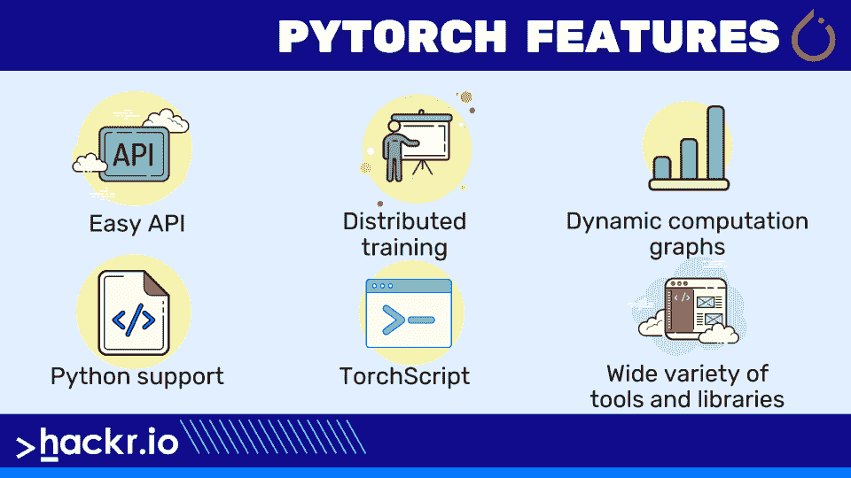
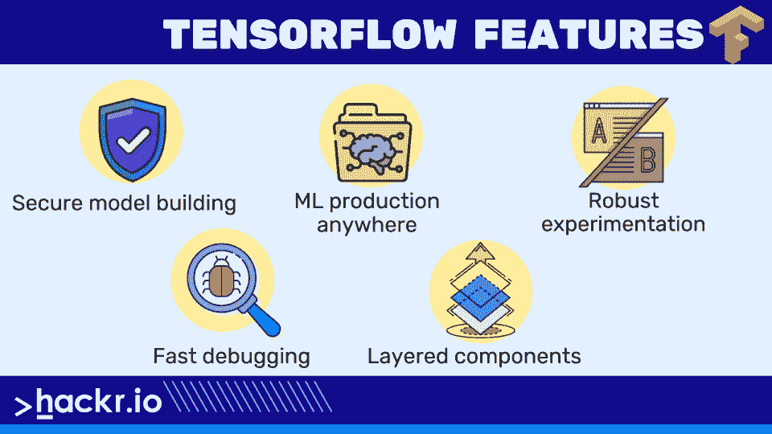
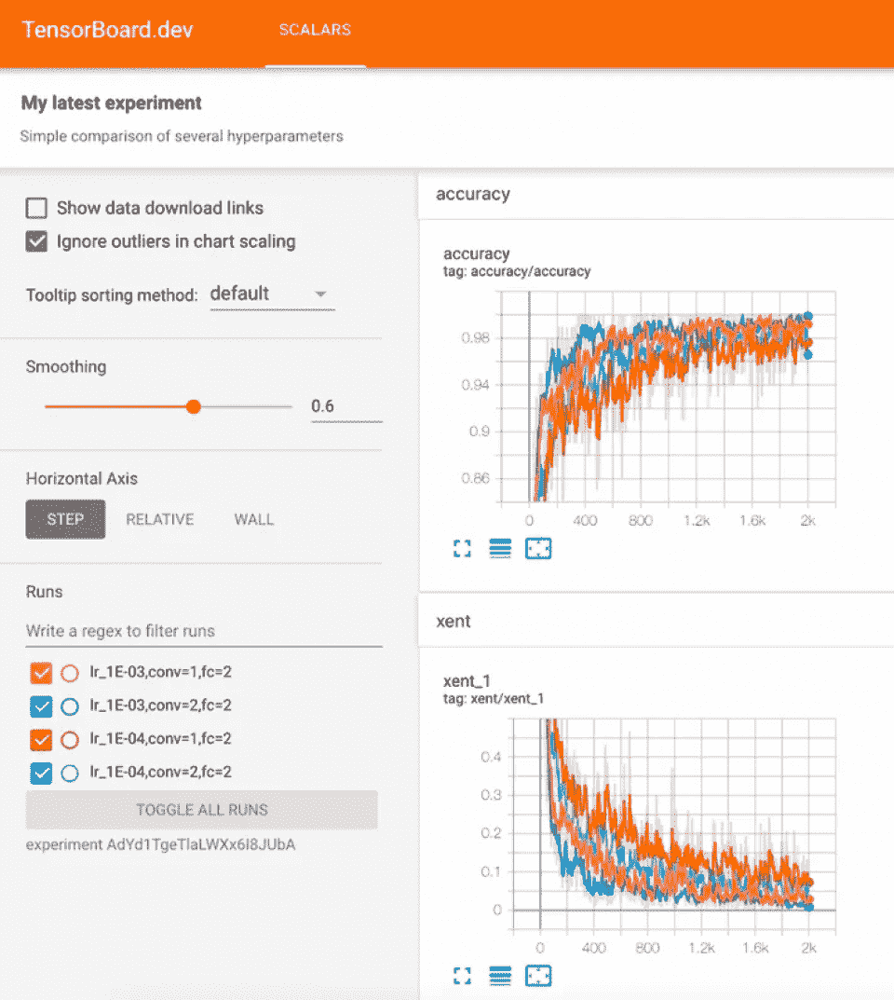
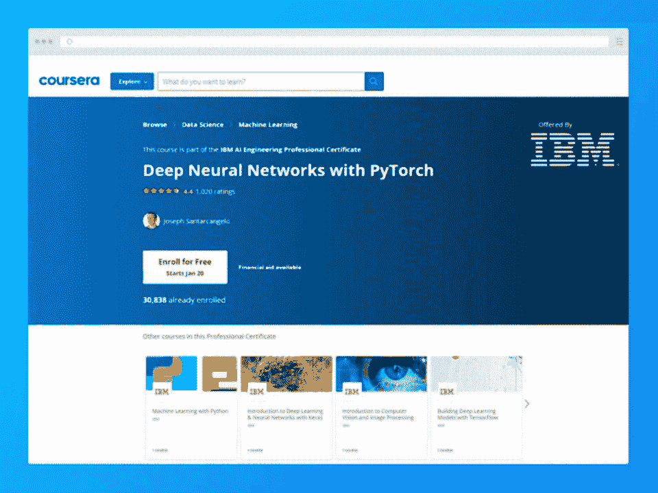

# PyTorch vs TensorFlow:你需要知道的区别

> 原文：<https://hackr.io/blog/pytorch-vs-tensorflow>

Pytorch 和 TensorFlow 是两个最流行的用于机器学习的 Python 库，并且都非常有名。然而，对于新手机器学习和人工智能从业者来说，可能很难知道选择哪一个。你甚至可能不知道其中的区别——没有这些区别，你就无法做出明智的决定。

在这里，我们研究 Pytorch 与 TensorFlow 的争论，包括它们到底是什么，它们之间的区别，以及总结两者的简明对比。有了这些知识，你就能回答 PyTorch 比 TensorFlow 好还是相反的问题。

在我们开始之前，这里有一个 PyTorch 和 TensorFlow 之间的差异的快速对比。

## **PyTorch vs TensorFlow:势均力敌的对比**

| **特性** | **指针** | **TensorFlow** |
| **由**开发 | 脸谱网 | 谷歌 |
| **图表** | 动态的 | 静态 |
| **显著特征** | 高度 Pythonic 化的 | 易于开发的模型 |
| **学习曲线** | 容易的 | 陡峭的 |
| **社区** | 相对较小 | 大的 |
| **设备部署** | 相对较少的支持 | 相对更多的支持 |
| **调试** | 动态计算过程 | 需要 TensorFlow 调试器工具 |
| **项目** | cheXNet，火人，地平线 | 洋红色，十四行诗，路德维希 |

## **py torch 是什么？**

PyTorch 基于 Torch 库，是一个开源的机器学习库。PyTorch 由脸书人工智能研究实验室开发，首次发布于 2016 年。虽然 Python 是最受欢迎的选择，PyTorch 也有 C++和 CUDA 接口。

PyTorch 是必不可少的，这意味着计算立即运行，因此用户不必编写完整的代码来检查它是否工作。它允许您有效地运行一部分代码，并实时检查它。

该库基于 python，旨在作为深度学习开发平台提供灵活性。



以下特性为 PyTorch 作为深度学习开发工具提供了理由:

*   **易于使用的 API**
*   **Python 支持:** PyTorch 与 Python 数据科学栈平滑集成。它类似于 NumPy，所以如果你熟悉它，你会有宾至如归的感觉。
*   **动态计算图:** PyTorch 提供了一个框架来构建计算图，甚至可以在运行时更改它们，而不是具有特定功能的预定义图。在创建神经网络的内存需求未知的情况下，此服务很有价值。

*   **TorchScript:** 提供了图形模式和 eager 模式之间的无缝转换，以加快生产进度。
*   **分布式训练:**它有一个分布式的后端。Torch 支持研究和生产中的性能优化以及可扩展的分布式培训。
*   工具和库:一个充满活力的工具和库生态系统扩展了 PyTorch，并支持计算机视觉、NLP 等领域的开发。
*   使用 PyTorch 的公司包括脸书、微软、SalesForce 和摩根大通。

## **什么是张量流？**

谷歌的 TensorFlow 是一个著名的开源深度学习库，用于数据流和跨一系列任务的可区分编程。该平台最初是由谷歌的谷歌大脑部门为内部使用而设计的，后来被世界上一些最大的公司使用，包括 Airbnb、可口可乐、英特尔和 Twitter。初始版本于 2015 年发布。

TensorFlow 也是一个符号数学库，神经网络等机器学习应用程序使用它。研究和生产是主要的用例。



以下是 TensorFlow 最突出的特性:

*   **安全模型构建:**使用 Keras 等直观的高级 API，该库允许我们通过快速的模型迭代和轻松的调试来构建和训练 ML 模型。查看我们的博客文章，获得 Keras 与 TensorFlow 之间的详细[比较。](https://hackr.io/blog/keras-vs-tensorflow)
*   **ML 随处生产:**在云中、内部、浏览器中或设备上训练和部署模型，而不考虑用户使用的语言。
*   **强大的研究实验:**一个灵活而简单的体系结构，将新想法从概念转化为代码，包括最先进的模型，从而加快发布速度。

### **张量流的组成**

在我们讨论 PyTorch 和 TensorFlow 之间的区别之前，TensorFlow 有两个主要部分值得一提。

*   **Tensor:** Tensor 是库的核心框架，负责 TensorFlow 中的所有计算。张量是一个表示所有类型数据的 n 维向量或矩阵。
*   **图:** TensorFlow 使用的是图框架。在训练期间，图形收集并描述了所有的系列计算。这提供了一些优势，例如运行多个 CPU 或 GPU，甚至移动操作系统。

## **PyTorch vs TensorFlow:区别**

现在我们对 TensorFlow 和 PyTorch 有了一个基本的概念，让我们看看两者之间的区别。

### **1。原始开发者**

TensorFlow 由 Google 开发，基于 Theano (Python 库)，而 PyTorch 由脸书使用 Torch 库开发。

### **2。计算图形构造**

TensorFlow 基于静态图概念，这意味着用户必须首先定义模型的计算图，然后运行 ML 模型。PyTorch 采用动态图形方法，允许随时定义/操作图形。

PyTorch 以其图形创建的动态特性提供了一个优势。这些是通过解释对应于图的特定方面的代码行来构建的。然而，在 TensorFlow 的情况下，构造是静态的——图形需要经过编译，然后执行。

[py torch 速成班简介](https://click.linksynergy.com/link?id=jU79Zysihs4&offerid=1045023.4797786&type=2&murl=https%3A%2F%2Fwww.udemy.com%2Fcourse%2Fintroduction-pytorch%2F)

### **3。调试**

```
import numpy as np
import tensorflow as tf
import tensorflow.python.debug as tf_debug
xs = np.linspace(-0.5, 0.49, 100)
x = tf.placeholder(tf.float32, shape=[None], name="x")
y = tf.placeholder(tf.float32, shape=[None], name="y")
k = tf.Variable([0.0], name="k")
y_hat = tf.multiply(k, x, name="y_hat")
sse = tf.reduce_sum((y - y_hat) * (y - y_hat), name="sse")
train_op = tf.train.GradientDescentOptimizer(learning_rate=0.02).minimize(sse)
sess = tf.Session()
sess.run(tf.global_variables_initializer())
sess = tf_debug.LocalCLIDebugWrapperSession(sess)
for _ in range(10):
sess.run(train_op, feed_dict={x: xs, y: 42 * xs})​
```

*通过梯度下降处理线性方程的 TensorFlow 调试器*

使用 PyTorch，用户不需要学习另一个调试器，因为它使用标准的 python 调试器。对于 TensorFlow，可以通过两种方式进行调试:学习 TF 调试器或者从会话中请求变量。

### **4。功能**

```
# tensor 't' is [[[[ 0, 1, 2, 3],
# [ 4, 5, 6, 7],
# [ 8, 9, 10, 11]],
# [[12, 13, 14, 15],
# [16, 17, 18, 19],
# [20, 21, 22, 23]]]]
# tensor 't' shape is [1, 2, 3, 4]
# 'dims' is [3] or 'dims' is [-1]
reverse(t, dims) ==> [[[[ 3, 2, 1, 0],
[ 7, 6, 5, 4],
[ 11, 10, 9, 8]],
[[15, 14, 13, 12],
[19, 18, 17, 16],
[23, 22, 21, 20]]]]
# 'dims' is '[1]' (or 'dims' is '[-3]')
reverse(t, dims) ==> [[[[12, 13, 14, 15],
[16, 17, 18, 19],
[20, 21, 22, 23]
[[ 0, 1, 2, 3],
[ 4, 5, 6, 7],
[ 8, 9, 10, 11]]]]
# 'dims' is '[2]' (or 'dims' is '[-2]')
reverse(t, dims) ==> [[[[8, 9, 10, 11],
[4, 5, 6, 7],
[0, 1, 2, 3]]
[[20, 21, 22, 23],
[16, 17, 18, 19],
[12, 13, 14, 15]]]]​
```

*反转张量特定维度的代码*

TensorFlow 支持更高级别的功能，并通过提供以下操作提供了广泛的选项:

*   随着维度翻转张量。
*   检查张量的无穷大和 NaN。
*   支持快速傅立叶变换。
*   使用名为 contrib 的包来创建模型。

另一方面，PyTorch 的功能相对较少。

### **5。序列化**

PyTorch 提供了一个简单的 API，可以保存模型的所有权重，也可以保存整个类。

TensorFlow 还允许将整个图形保存为协议缓冲区，包括参数和操作。其他支持的语言，如 [C++和 Java](https://hackr.io/blog/cpp-vs-java) ，可以加载图形；这对于不提供 Python 的部署栈来说至关重要。当用户更改模型源代码并希望运行旧模型时，这也很有用。

### **6。部署**

在小规模服务器端部署的情况下，两个 ML 框架都很容易包装。TensorFlow 非常适合移动和嵌入式部署。然而，部署到 Android 或 iOS 确实需要大量的工作。TensorFlow 提供的另一个值得注意的功能是，在不关闭服务的情况下，模型无法轻松热插拔。

### **7。可视化**

****

在组织中展示任何项目时，可视化都起着至关重要的作用。TensorBoard 在 TensorFlow 中可视化机器学习模型，这有助于模型的训练，并快速发现错误。TensorBoard 是模型图形的实时表示，它描绘了图形表示并实时显示精确的图形。

PyTorch 还集成了 TensorBoard。

### **8。设备管理**

TensorFlow 不需要用户指定任何内容，因为默认值已经设置好了。例如，如果有可用的 GPU，它会自动假设用户是否希望在 GPU 上。TensorFlow 在设备管理方面确实有不足之处，因为即使只有一个 GPU 在使用，它仍然会消耗所有可用 GPU 上的内存。

相比之下，如果明确启用了 CUDA，PyTorch 要求用户将所有内容都移动到设备上。此外，在 PyTorch 中，代码需要频繁检查 CUDA 的可用性。

### **9。生态系统**

PyTorch 和 TensorFlow 周围都建立了大型生态系统，这个系统很接近 call。TensorFlow 有模型花园这样的东西，它提供了 SOTA 模型的来源。它还有 Vertex AI，TensorFlow.js，Colab，Playground。

PyTorch 有 Hub、TorchVision、TorchText、TorchAudio、SpeechBrain 和许多其他工具——都是流行的工具包。它也有 PyTorch 闪电。

在很大程度上，我们会说这是平等的，但 TensorFlow 确实有很多种，并且有与 Google 集成的好处。

### 10。可用型号

PyTorch 和 TensorFlow 都有自己的一套可用模型，这将成为您考虑的因素。对于像 HuggingFace 这样的东西，你会注意到绝大多数模型都是 PyTorch 独有的。研究论文也是如此。

在这方面，PyTorch 胜于 TensorFlow，尽管这在未来可能不会保持不变。在这方面已经有了一些进展，但是 PyTorch 轻松地处理了这个问题。

## **结论:TensorFlow 还是 PyTorch？**

TensorFlow 和 PyTorch 都很有用，背后都有一个支持他们的社区。它们各自的机器学习库也都能够执行各种任务。

现在，选择 TensorFlow 或 PyTorch 将取决于您自己的技能和需求。前者是一个更成熟的平台，提供一些高级功能。然而，PyTorch 很容易学习并且非常 Python 友好。归根结底，这真的取决于个人喜好。

**[起来挑战？参加这个中级课程！](https://imp.i384100.net/LPk5Ro)**

课程将教你如何使用 Pytorch 开发深度学习模型。

[](https://imp.i384100.net/LPk5Ro)

## **常见问题解答**

#### **1。PyTorch 比 TensorFlow 好吗？**

这个问题没有明确的答案。两者各有所长——例如，TensorFlow 提供了更好的可视化，但 PyTorch 更具 Pythonic 风格。

#### **2。PyTorch 和 TensorFlow 哪个更适合深度学习？**

TensorFlow 和 PyTorch 都是深度学习的有力选择。没有明确的答案；这取决于你的项目的要求。

#### **3。PyTorch 比 TensorFlow 快吗？**

这取决于几个因素。基准测试显示 PyTorch 和 TensorFlow 的性能都优于对方，具体取决于计算。

#### **4。PyTorch 比 TensorFlow 硬吗？**

不，PyTorch 更容易上手。新手建议从 PyTorch 开始。

#### **5。特斯拉用 PyTorch 还是 TensorFlow？**

特斯拉将 PyTorch 用于其自动驾驶实现。

**人也在读:**