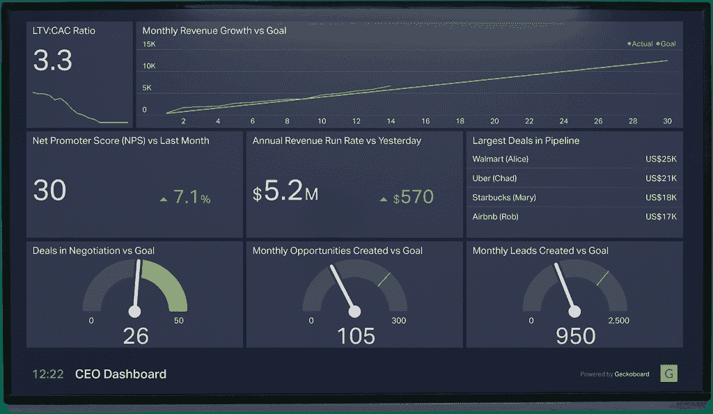
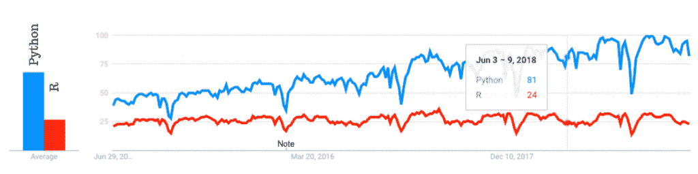

# R vs Python:区别、特性和应用？

> 原文：<https://hackr.io/blog/r-vs-python>

在过去的 5 年里，数据科学社区取得了长足的进步，变得更加成熟。早些时候，IT 部门曾经非常重视像 Java 这样的技术，包括用于编写和测试代码的 Spring 和 Hibernate。随着机器学习和数据分析的出现，焦点转移到 R、Python 和 SAS 等技术上。这些技术正不断被用于机器学习、深度学习、人工智能和更多前沿发现中的算法，这些发现让世界和远见卓识者感到惊讶。

## **什么是 R？**

R 是一种开源编程语言，主要由统计学家和数据工程师使用，他们利用它来构建各种用于统计建模和数据分析的算法和技术。它于 1993 年 8 月首次出现。r 包括大量的内置库，这些库提供了各种各样的统计和图形技术，包括回归分析、统计测试、分类模型、聚类和时间序列分析。大量的软件包已经可用，它们有助于探索性数据分析、基本数据探索和图表形式的数据表示。它能够创建一些强大的图表和仪表板质量图，以展示和监控公司的每月销售或利润。R 语言运行在 R Studio 平台上，这有助于启动和执行 R 中的代码和包

## **Python 是什么？**

与 R 类似，Python 也是一种开源编程语言，用于统计和机器学习模型，如在许多系统中使用的回归和分类。它创建于 1991 年，在机器学习有一个利基市场的时候，它被用于简单的系统中。Python 具有支持面向对象、[过程化](https://hackr.io/blog/procedural-programming)和[函数式编程](https://hackr.io/blog/functional-programming)的能力。它包括一个全面的库集合，有助于处理 Python 中次要和主要的实现。有许多工具和[框架用于 Python](https://hackr.io/blog/python-frameworks) ，但是最流行的是 Jupyter，它负责算法和数据可视化。

### 推荐 Python 课程

[用 Python 完成从零到英雄的 Python boot camp](https://click.linksynergy.com/deeplink?id=jU79Zysihs4&mid=39197&murl=https%3A%2F%2Fwww.udemy.com%2Fcourse%2Fcomplete-python-bootcamp%2F)

## 我们为什么要使用它们及其应用？

R 和 Python 都是机器学习旅目前的火炬手。这两种语言都可以用来启动和修改机器学习中的算法，如分类、回归、聚类、神经网络和人工智能中的算法。这两种语言都有不同的方法来解决给定的问题。无论是建立机器学习模型，还是探索数据以获得一些有用的见解，都在理解数据并从中提取事实方面发挥着重要作用。

### **创建有意义的仪表板**

如今，仪表板已经成为大多数团队会议的主要内容。可以创建这些仪表板来衡量销售额或跟踪公司的当前状态。事实证明，它对于提高任何品牌或公司的绩效指标都是有用的、渐进的。像 Tableau 和 PowerBI 这样的工具非常流行，同时，由于有大量的包可供选择，R 和 Python 确实有能力构建企业级仪表板。r 有 dashboard、ggplot2 和 plotly 软件包，便于数据以图形和图表的形式弹出。Python 包括 matplotlib、seaborn 和 pandas 来处理数据的可视化和数据表示部分。在过去的几年中，我们看到了两个用户群的大量增强和改进，从那时起，他们就一直支持这两种语言，以获得两个世界的最佳效果。

### **让机器变得更聪明、更敏锐**

曾经有一段时间，机器的能力是有限的，并且是为一些预先确定的活动而编程的，这些活动每次都会重复执行一组特定的任务。这种单调现在已经得到了照顾，机器学习出现后，机器变得更加智能和挑剔。这使他们对自己的行为更加了解和自信，并使他们能够执行他们在击中和试验过程中学到的行为。这为公司开启了新的功能和可能性，这些公司可以毫无困难地探索其业务的各个组成部分。

### **用人工智能撼动市场**

迄今为止，所有的机器学习最终形成了一个更广泛的概念，我们称之为人工智能。人工智能基本上涉及机器学习，并试图开发能够使机器像人类一样思考的算法。到目前为止，这是业界最可怕和惊天动地的概念，它已经非常清楚地表明，人工智能是确定的未来。所有公司都在慢慢地将人工智能部署到他们的系统中，以便使它们更加高效和动态。

## **R vs Python:重要的区别，特性**

### **因就业机会增多而受大众欢迎**

上图 中的 表示 Python(用黄色曲线表示)更受欢迎，在系统和业务中被广泛使用。蓝色的曲线属于 R，它看起来确实不错，几乎和 Python 不相上下。在 R 行业中有巨大的机会，但是 Python 赢得了流行度竞赛。

### **库储存库**

R 有一个详尽的图书馆库，在 CRAN 中定期更新，这是一个全面的 R 档案网络。包括 dplyr、mice、ggplot2 等等。Python 包含一个 pip 包索引，其中包含 Python 的所有库。它们包括 matplotlib、熊猫、seaborn 等等。r 拥有更活跃的用户群，这有助于更新其 10，000 个软件包的庞大数据库。甚至 Python 也包含了一个定期更新其包的用户社区，但与 r 相比，这个过程有点复杂

### **数据处理**

R 拥有数据分析的能力，而无需在内存中加载任何包。R 中有许多可用的包，可以用来研究数据并从中获得洞察力。在 python 中，我们需要像 numpy 和 pandas 这样的包来创建数据框和处理数据。这两种语言都足够强大，可以执行数据计算和任务，使用户可以轻松地充分利用数据。

### **灵活性**

每种语言的独特性，使得它在用于机器学习和深度学习算法时，在某些方面也是独一无二的。R 和 Python 都有实现算法的库。但是这里的问题是，尽管 R 很容易学习和掌握，但是由于大量的应用程序和现实世界的实现，Python 将永远领先一步。开发人员一次又一次地依赖于它的强大功能和它提供的执行任何代码的简单性。

### **图形和可视化**

R 有几个高级图形软件包，例如，ggplot2，用于自定义图形。Python 也有一些令人惊叹的可视化库，比如 seaborn 和 bokeh。与 R 相比，Python 有更多的图形和可视化库，但是它们稍微复杂一些。

### **支持深度学习**

R 有两个新的深度学习包——KerasR 和 RStudio 的 Keras。这两个包都提供了 Python 的深度学习包的 R 接口。

Python 有 Tensorflow 和 Keras，都是很厉害的深度学习库。学习 Keras 是开始深度学习 Python 的最简单方法之一。

### **客户支持**

R 和 Python 都没有任何客服支持。这意味着如果你遇到任何麻烦，你只能靠自己了。然而，R 和 Python 都有在线社区可以寻求帮助。因为 Python 比 R 老，所以它比 R 有更大的社区支持

## **利弊**

对这两种语言的需求都在增加，薪水也相当不错。在本节中，我们将了解这两种语言的优缺点，以便帮助您更好地选择它们！

### **Python: Pros**

*   Python 是一种通用语言。它非常简单和直观。学习曲线不是很陡，你可以很快地编写程序。
*   IPython Notebook 是一个非常好的交互式计算环境，使得使用 Python 变得更加容易。这些笔记本可以轻松共享和使用，无需安装任何东西。

### **Python: Cons**

*   Python 有很多不错的可视化库，例如 Pygal、Bokeh 和 Seaborn。然而，从大量选项中进行选择变得有些困难。此外，与 R 相比，这些库产生复杂的可视化效果，看起来可能不太舒服。

### **R:赞成**

*   R 有一个活跃的社区和前沿包组成的丰富的生态系统。你可以在 [R 文档](https://www.rdocumentation.org/) 中找到所有的 R 包。
*   R 拥有令人惊叹的可视化软件包，可以产生奇妙的可视化效果。其中一些软件包是 ggplot2、rCharts、ggvis 和 googleVis。

### **反对意见**

*   R 的学习曲线非常陡峭。可用的文档不一定是用户友好的，如果您事先不熟悉，查找包之类的事情也会非常耗时。

## **R vs Python:势均力敌的比较**

| **参数** | **R** | **Python** |
| **范围** | 主要用于统计计算和图形 | 通用，包括任务自动化、数据分析和数据可视化 |
| **语法复杂度** | 复杂的 | 容易的 |
| **学习曲线** | 高的 | 低的 |
| **包裹分发** | 综合档案网络 | Python 包索引 |
| **深度学习库** | KerasR and RStudio’s Keras | Tensorflow and Keras |
| **统计包** | 强大的 | 不太强大 |
| **IDEs** | r 指挥官，Rkward 和 Rstudio | Spyder、Atom 和 Eclipse+Pydev |
| **图形和可视化包** | Ggplot，plotly，和 | seaborn 和 bokeh |
| **数据建模库** | Tidyverse | NumPy、SciPy 和 Scikit-Learn |
| **数据处理** | 不需要加载包 | 需要包 |

## **结论**

初创公司和跨国公司依赖这些技术来扩张，并在行业中留下印记。大量的编码人员和开发人员正在积极学习和实践这两种趋势语言。任何希望提高其商业价值的人肯定都知道机器学习在市场上的价值，并准备为此投入巨额资本。很难对哪种语言“更好”做出结论性的声明，因为这两种语言都有很大的需求，并且可以用来解决许多独特的问题。

**人也在读:**