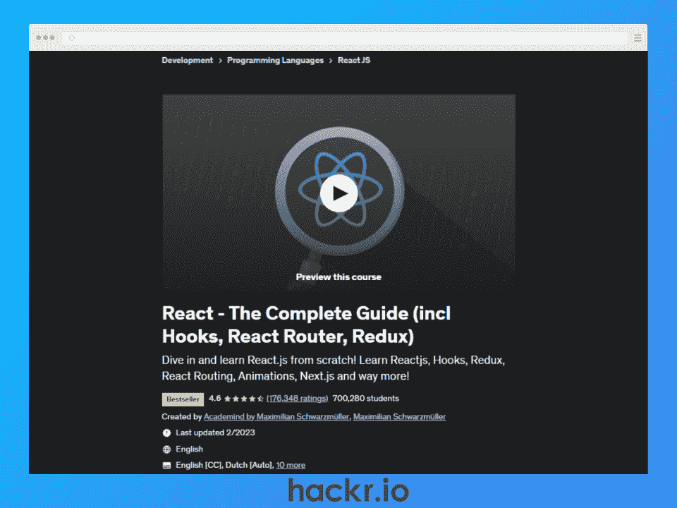
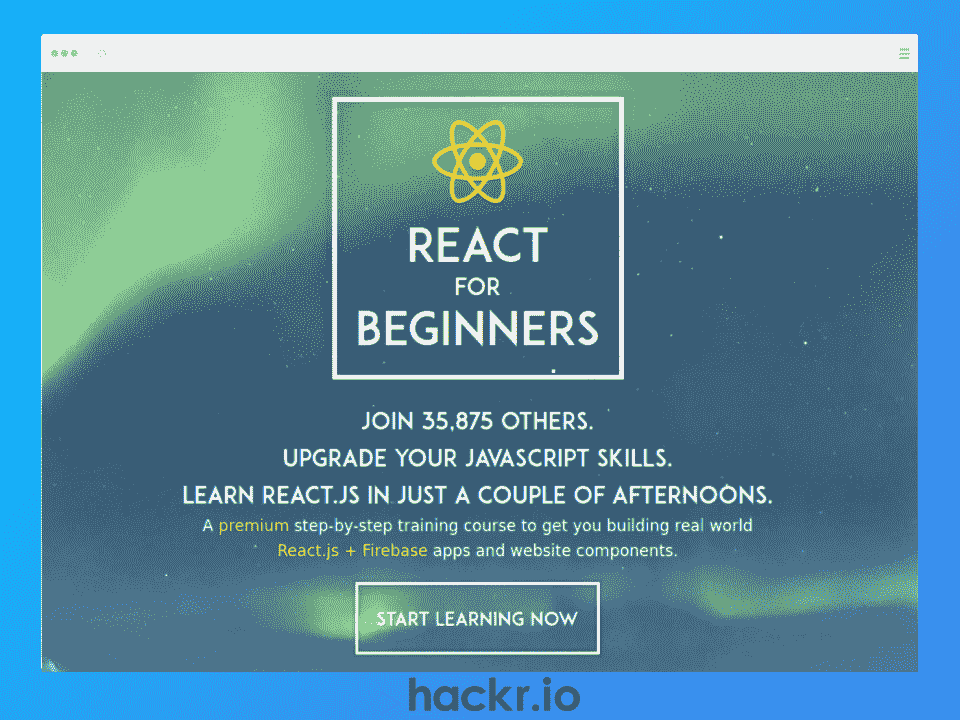
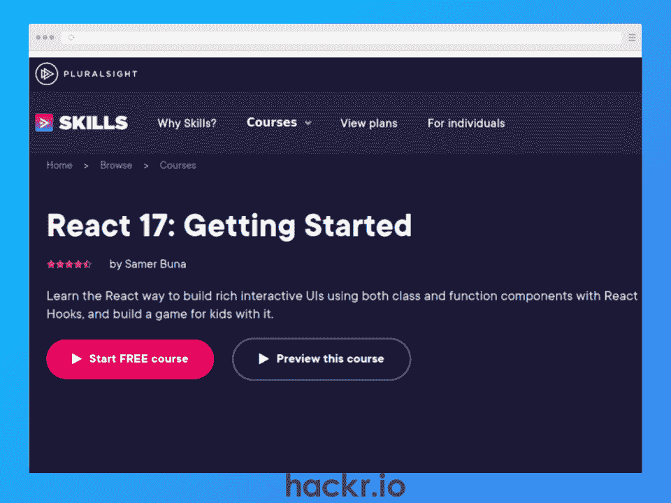
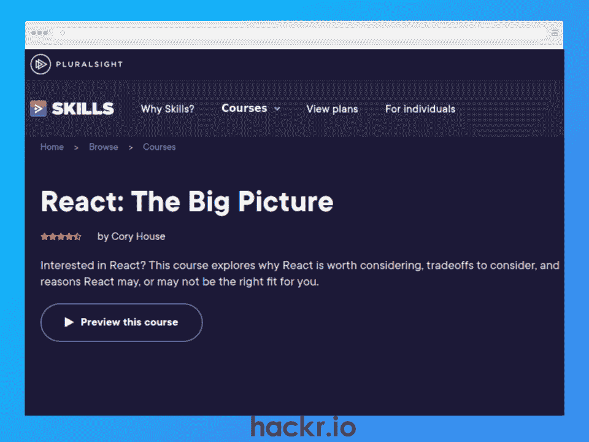
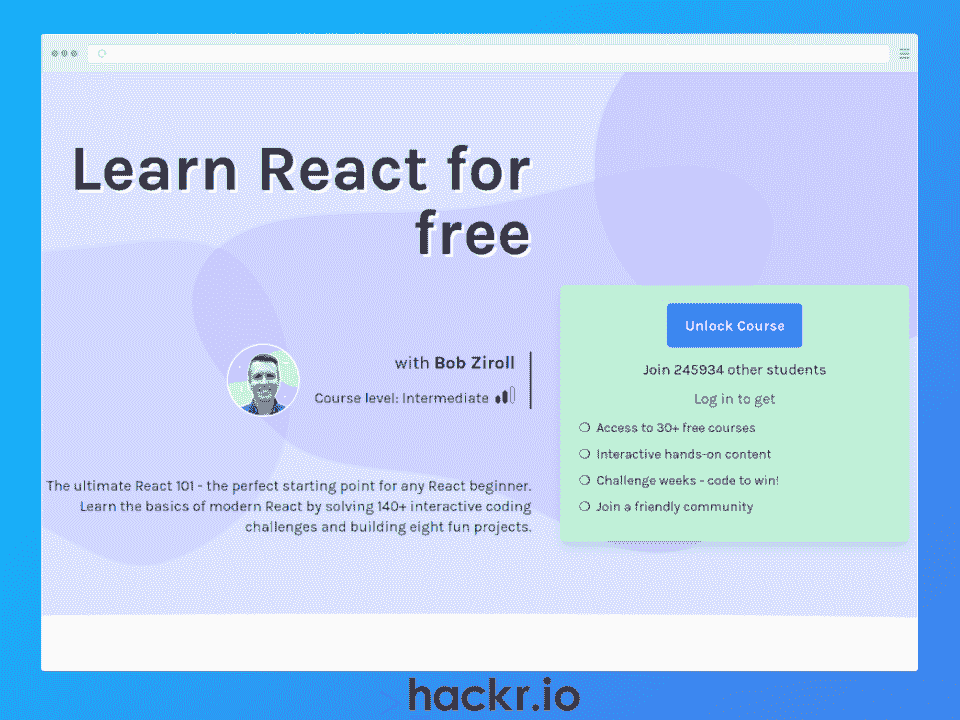
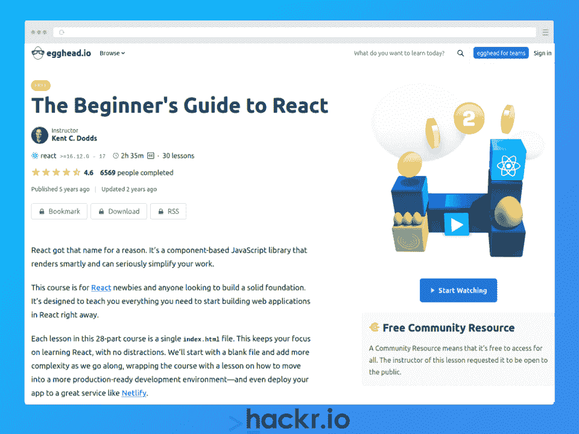
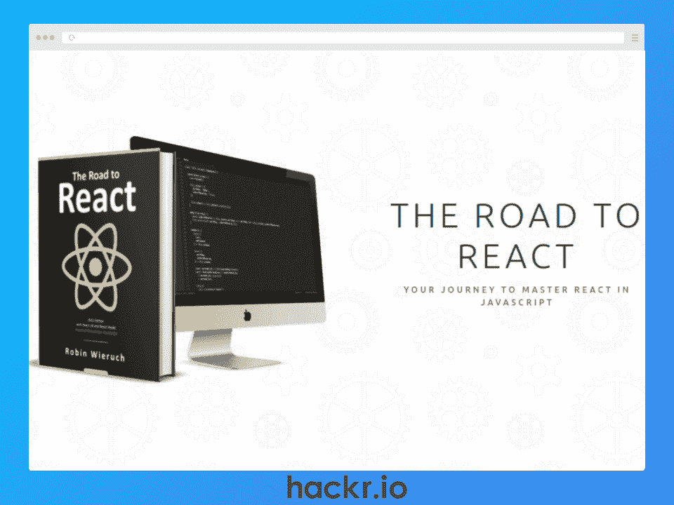

# 2023 年 12 个最佳 React 课程[免费+付费] |初级到专业

> 原文：<https://hackr.io/blog/react-courses>

超过 1500 万个网站和网络应用程序使用 React 库，毫不奇怪它会与 T2 顶级网络框架竞争。这一令人印象深刻的采用率和受欢迎率反映了 React 在前端开发人员中的接受程度。

公平地说，在 React 中学习技能可能是 2023 年职业发展的绝佳选择。平均基本工资超过 80，000 美元，这是参加在线 React 课程的最佳时机。

如果您正在寻找合适的课程提供商和拥有顶级课程材料的学习平台，我们可以提供帮助，因为我们已经编制了 2023 年 12 个最佳 React 课程的列表，并为完全初学者和高级前端开发人员提供了选项。

**精选 React 课程【编辑推荐】**

## **为什么要学习 React 来构建 Web 应用？**

*   **可重用组件:**节省时间，因为开发人员不需要从头重写代码，使他们能够专注于构建复杂和可扩展的应用程序。
*   互操作性:可与其他库和框架一起使用，为您创建应用程序提供了更多选择。例如，您可以使用 React Native 开发移动应用程序，使用 Next.js 创建服务器渲染的 React 应用程序。
*   **可维护性** : React 开发人员可以创建易于重构和升级的模块化和可维护的代码，使维护变得更容易，成本更低。
*   **一般生产力:**您可以构建加载速度快、提供令人满意的用户体验的 SPAs(单页应用),而无需第三方库。
*   就业市场: React 被广泛使用，这意味着对 React 开发人员的需求很大。

## **选择最佳反应过程**

在构建最佳 React 在线课程列表时，我们考虑了各种基本要素。

*   **课程资料:**课程资料组织是否清晰？是否包含详细的最新视频内容？
*   **讲师:**作为讲师，他们是否接受过必要的培训并具备相关经验？
*   实用性:React 课程是否强调实际应用，课程是否吸引人？
*   支持:因此，它涉及教育者或团体支持吗？如果你需要帮助，很容易找到吗？
*   **证书:**你收到作品集/简历的结业证书了吗？

你是在申请 React 工作吗？准备好

**[状元反应面试问答](https://hackr.io/blog/react-interview-questions)**

## **2023 年 12 门最佳 React 在线课程**

[****](https://click.linksynergy.com/deeplink?id=jU79Zysihs4&mid=39197&murl=https%3A%2F%2Fwww.udemy.com%2Fcourse%2Freact-the-complete-guide-incl-redux%2F)

**[了解更多](https://click.linksynergy.com/deeplink?id=jU79Zysihs4&mid=39197&murl=https%3A%2F%2Fwww.udemy.com%2Fcourse%2Freact-the-complete-guide-incl-redux%2F)**

**我们为什么选择本课程**

这个面向初学者的实践课程涵盖了成为 React JS 开发人员所需的一切，您将深入研究基础知识、示例应用程序，并了解更高级的概念，如身份验证、单元测试和 React Router 路由。

作为在线最佳 React 课程的候选人和 Udemy 上最佳 React 课程之一，讲师为最新的 React 18 彻底修改并从头重新录制了这门课程。

这个 React 课程包括你需要知道的基本主题，比如组件、道具、动态数据绑定、React 钩子、调试等等。它还包括一个关于 Redux 处理状态的部分和一个 JavaScript 复习课程，以防您有点生疏。

**优点**

*   React 18 上的最新课程材料
*   学习反应和还原
*   包括一个 JavaScript 刷新程序
*   全面的内容涵盖基础和高级主题

**Cons**

**关键信息**

**先决条件:**基本的 HTML、CSS 和 JavaScript 知识

**讲师:**maximilin black fill er

**等级:**初学者

**免费或付费:**付费

**证书:**是

**持续时间:** 48 小时

[**![[Udemy] Modern React with Redux [2023 Update]](img/ac80573386e1f6a21c8c9062e235da17.png)**](https://click.linksynergy.com/deeplink?id=jU79Zysihs4&mid=39197&murl=https%3A%2F%2Fwww.udemy.com%2Fcourse%2Freact-redux%2F)

**[了解更多](https://click.linksynergy.com/deeplink?id=jU79Zysihs4&mid=39197&murl=https%3A%2F%2Fwww.udemy.com%2Fcourse%2Freact-redux%2F)**

**我们为什么选择本课程**

作为初学者最好的 React 课程之一，这个全面的 React 课程定期更新，所以你知道内容将永远是重点。您将学习构建 React 应用程序的基础知识，以及如何使用 Redux 来管理状态。它也是动手操作，所以你会得到大量的编码实践。

本课程结束时，您将了解 React JS 的基础知识，包括 JSX、道具、如何构建可重用组件、Redux 如何在幕后工作等等。

你甚至可以学习使用一些基本的工具，比如 NPM(节点包管理器)、网络包和通天塔。另一个好处是这门课程提供了小抄来帮助巩固你的知识。

**优点**

*   综合课程材料
*   精益 React、Redux、NPM、Webpack 和 Babel
*   带编码活动的实践学习
*   帮助你学习的小抄

**缺点**

*   没有核心项目添加到您的投资组合

**关键信息**

**先决条件:**无

讲师:斯蒂芬·格里德

**等级:**初学者

**免费或付费:**付费

**证书:**是

**持续时间:** 37.5 小时

[****](https://reactforbeginners.com/ "React for Beginners Course")

**[了解更多](https://reactforbeginners.com/)**

**我们为什么选择本课程**

React 课程强调可读性和简单性，这是提高 React JavaScript 技能的最佳方式之一。

通过基于项目的方法，您将学会使用 ReactJS 替换 jQuery 并创建现代应用程序。它还涵盖了一些基本主题，如实时 web 套接字、应用程序状态、UI 组件、用 JSX 编写标记、URL 路由、部署 React 应用程序等等。

**优点**

*   基于项目的实践学习
*   涵盖路由、web 套接字、州、JSX 等基本内容
*   Slack 学生支持小组

**缺点**

*   短期课程，所以可能不适合完全初学者

**关键信息**

**先决条件:**基本的 HTML、CSS 和 JavaScript 知识

**讲师:**韦斯·博斯

**等级:**初学者

**免费或付费:**付费

**证书:**是

**持续时间:** 5 小时

[****](http://pluralsight.pxf.io/2rnaN0)

**[了解更多](http://pluralsight.pxf.io/2rnaN0)**

**我们为什么选择本课程**

这个简短的 React JS 课程非常适合初学者。在进入现代 JavaScript 复习课程之前，您将从 React 基础知识的介绍开始。这包括 React 所需的基本 JS 技能，比如箭头函数、类、async/await 等等。

然后，您将准备好构建一些 React 应用程序！期望学习和实现重要的技能，比如定制钩子、读取 API 数据、为在线和移动界面使用命令式逻辑、管理副作用等等。

只需 4 个小时，这是一个很好的方式来激起你对 React 的兴趣，因为在本课程结束时，你将拥有理解 React 和构建简单 React 应用程序的核心知识和技能。

**优点**

*   针对完全初学者的简短入门 React 课程
*   包括一个 JavaScript 刷新模块
*   基于项目的应用构建学习

**缺点**

*   简短的课程意味着你可能需要补充学习

**关键信息**

**先决条件:**基础 JavaScript

**教官:**萨梅尔布纳

**等级:**初学者

**免费或付费:**付费

**证书:**否

**持续时间:** 4 小时

[****](http://pluralsight.pxf.io/9WvLY4)

**[了解更多](http://pluralsight.pxf.io/9WvLY4)**

**我们为什么选择本课程**

从未使用过 React，但您想了解它的工作原理吗？对于想要快速获得基本信息的 React JS 初学者来说，这可能是最好的课程。只有 1 个小时，这是一个学习 React 的权衡、它的主要用例以及您需要了解的重要缺点的简短而有趣的方式。

虽然在学习完本课程后，您还没有准备好构建 React 应用程序，但您将会了解整体情况，这在您学习更长时间、更具实践性的 React 课程时会有很大帮助。

**优点**

*   非常简短的反应介绍
*   理解用例、权衡和缺点并做出反应

**缺点**

*   不是动手操作，所以你需要另一门课程来开始构建应用

**关键信息**

**先决条件:**无

**指导老师:**科里屋

**等级:**初学者

**免费或付费:**免费

**证书:**否

**持续时间:** 1 小时

[****](https://scrimba.com/learn/learnreact "[Scrimba] Learn React for Free")

**[了解更多](https://scrimba.com/learn/learnreact)**

**我们为什么选择本课程**

作为 React JS 的最佳课程之一，Scrimba 提供的课程设计类似于终极 101 课程，也是免费的。作为一门项目驱动的课程，您将获得 4 个模块、8 个项目和超过 140 个交互式编码练习，以实际操作 React 学习。

期望通过涵盖诸如 JSX、可重用组件、道具、状态、表单、API 调用、异步编程等主题来学习各种基本技能。

虽然它被宣传为中级课程，但它与我们其他需要基本 HTML、CSS 和 JS 知识的初级课程处于同一水平。

**优点**

*   完全自由
*   基于项目的学习
*   为您的投资组合构建应用
*   斯克林巴纷争中的学生支持

**缺点**

*   课程结束时没有证书

**关键信息**

**先决条件:**基本的 HTML、CSS 和 JavaScript 知识

教练:鲍勃·齐罗尔

**等级:**中级

**免费或付费:**免费

**证书:**否

**持续时间:** 12 小时

**想知道 React & React Native 的区别？结账**

**[React vs React Native](https://hackr.io/blog/react-vs-react-native)**

[**![[The Net Ninja] Full Modern React Tutorial](img/6a54a599b25cefa92023e92fd346461d.png)**](https://www.youtube.com/playlist?list=PL4cUxeGkcC9gZD-Tvwfod2gaISzfRiP9d "[The Net Ninja] Full Modern React Tutorial")

**[了解更多](https://www.youtube.com/playlist?list=PL4cUxeGkcC9gZD-Tvwfod2gaISzfRiP9d)**

**我们为什么选择本课程**

这是 React 的顶级课程之一，面向希望在 4 小时内学习如何从头开始创建 React 应用程序的新人。通过动手实践，你将学会建立一个微博 SPA 来展示你在作品集中的技能。

网络忍者在创造优秀的指令方面享有很高的声誉，这也不例外。希望涵盖所有标准主题，如可重用组件、路由、状态管理、异步代码和钩子。您甚至可以获得为 React 应用程序创建吸引人的用户界面的技巧。

作为另一个免费课程，这是新手的理想选择，他们想开始使用 React，而不需要对我们的付费课程做出财务承诺。

**优点**

*   完全免费的课程
*   涵盖路由、状态、挂钩等基本主题
*   SPA 为您的投资组合提供实践学习

**缺点**

*   课程结束时没有证书

**关键信息**

**先决条件:**基本的 HTML、CSS 和 JavaScript 知识

教练:肖恩·佩林(网络忍者)

**等级:**初学者

**免费或付费:**免费

**证书:**否

**持续时间:** 4 小时

[**![[Frontend Masters] Complete Intro to React, V8](img/7fdba3507fca010befdda9a6b02a6669.png)**](https://frontendmasters.com/courses/complete-react-v8/ "[Frontend Masters] Complete Intro to React, V8")

**[了解更多](https://frontendmasters.com/courses/complete-react-v8/)**

**我们为什么选择本课程**

本课程为新手提供了一些最好的 React 培训，以全面了解从头开始创建 React 应用程序所涉及的步骤。而且，作为最新版本，您将使用 React 18。

虽然这是一个相对较短的课程，但您将学习所有基本的 React 技能，如挂钩、效果、React 组件、引用、门户等。甚至有一节是关于使用 Git 对你的应用程序进行版本控制的，这真的很有帮助。

最重要的是，您还将学习使用适合 React 生态系统的其他有用工具，如 React Router & React Query、Parcel、ESLint 和 TailwindCSS。这也将是你要构建的 keystone 项目的一部分，然后你可以将它添加到你的文件夹中。

**优点**

*   React 18 的最新课程内容
*   短期课程涵盖了挂钩、组件、布线等基础知识
*   涵盖了有用的工具，如 Git、React Router、TailwindCSS 等等
*   为你的作品集打造一款应用

**缺点**

*   尽管有报酬，但没有证书

**关键信息**

**先决条件:**基础 JavaScript 知识

讲师:布莱恩·霍尔特

**等级:**初学者

**免费或付费:**付费

**证书:**否

**持续时间:** 6 小时

[****](https://egghead.io/courses/the-beginner-s-guide-to-react "[egghead.io] The Beginner’s Guide to React")

**[了解更多](https://egghead.io/courses/the-beginner-s-guide-to-react)**

**我们为什么选择本课程**

如果您正在寻找简短有趣的 React 开发人员课程，这个选项对于希望学习 React 如何简化前端开发人员的工作量的新手来说是非常好的。

通过动手操作的方式，您将拥有 28 节迷你课，每节课都围绕一个 HTML 文件旋转，以便在您培养技能时保持简单。随着你学习课程内容的进展，这也是一个很好的方法来构建更多的复杂性。

本课程结束时，您将学习 React 如何在幕后工作，如何使用 JSX，如何使用钩子管理状态，以及如何构建表单。您还将学习使用 Netlify 部署 React 应用程序。简单地说，对于 React 初学者来说，这是一个很好的入门课程。

**优点**

*   初学者简介
*   在每节课中构建一个更复杂的应用程序
*   React 基本主题的实践学习

**缺点**

*   短期课程，因此可能需要补充学习

**关键信息**

**先决条件:**基本的 HTML、CSS 和 JavaScript 知识

讲师:肯特·c·多兹

**等级:**初学者

**免费或付费:**免费

**证书:**否

**持续时间:** 2.5 小时

[****](https://www.roadtoreact.com/ "The Road to React")

**[了解更多](https://www.roadtoreact.com/)**

**我们为什么选择本课程**

也许你是守旧派，你在学习基于文本的课程后反应？对你来说，这可能是学习 React JS 的最佳课程，因为你将获得一本电子书、一系列教程和 React 培训的代码示例。

通过本课程，您可以学习如何使用最佳实践编写当代 React 代码，以从头开始构建现实世界的应用程序。这包括像 JSX，反应，道具，状态，副作用，钩子，异步等基本技能。

通过查看基本工具，如 Webpack、ESLint、Babel 和 testing with Jest，您甚至可以超越基础知识。甚至还有涵盖基本库的内容，包括 Redux、Firebase、GraphQL 等等。

**优点**

*   带电子书的基于文本的课程
*   包括 50 多个练习
*   涵盖 React 基础知识和高级主题
*   涵盖了 Redux、Firebase、GraphQL 等库

**缺点**

*   教科书式的学习可能不适合那些喜欢先看视频的人

**关键信息**

**先决条件:**基础 JavaScript 知识

教练:罗宾·威鲁奇

**等级:**初学者

**免费或付费:**付费

**证书:**否

**持续时间:**不适用

[**![[Simplilearn] React.js Training Course](img/68cbfb7055da1edffd27041b3abe2363.png)**](https://www.simplilearn.com/react-js-certification-training-course "[Simplilearn] React.js Training Course")

**[了解更多](https://www.simplilearn.com/react-js-certification-training-course)**

**我们为什么选择本课程**

这是最好的 React 认证课程之一，结合了自定进度视频和讲师指导部分。因此，如果你正在寻找更接近 React 训练营的 React 最佳课程，这是一个可靠的选择。

通过本课程，您将学习成为 React 专业人员所需的技能，包括 JSX、道具、状态、事件、动作、减速器，甚至深入了解 Redux 的状态管理。

您甚至可以构建自己的 MERN 应用程序(MongoDB、Express、React、Node ),作为自定进度课程的一部分，这是为一个受欢迎的技术堆栈学习现实世界技能的好方法。作为讲师指导部分的一部分，您还将学习 ES6 JavaScript。

最重要的是，你还将建立一个顶点项目添加到你的投资组合。

**优点**

*   自定进度和讲师指导课程(类似于新兵训练营)
*   了解 React 要点，包括 MERN 堆栈
*   您投资组合的顶点项目
*   行业认可的证书

**缺点**

*   价格昂贵，因此并非所有学员都可以使用

**关键信息**

先决条件:【HTML、CSS 和 JavaScript 的前端 web 开发经验

**讲师:**不适用

**等级:**中级

**免费或付费:**付费

**证书:**是

**持续时间:** 14 小时(自定进度)

[**![[epicreact.dev] Epic React](img/8b4996d53498856d5ed66e3e92a01070.png)**](https://epicreact.dev/ "[epicreact.dev] Epic React")

**[了解更多](https://epicreact.dev/)**

**我们为什么选择本课程**

行业专家 Kent C. Dodds 在 PayPal 拥有丰富的经验，同时也是谷歌开发专家，他为现有的 React 开发人员设计了这个 React 高级课程。

通过使用一系列自定进度的交互式编码研讨会，您将沉浸在真实的开发环境中。这对于更有经验的开发人员来说是理想的，因为它模拟了 React 专业人员的日常开发任务。

虽然是为更有经验的开发人员设计的，但本课程在深入研究高级钩子、高级 React 模式、测试和性能之前，先从 React 的基础开始。

学习完这些模块后，您将构建一个名副其实的“epic”React 应用程序，这是对您的专业投资组合的一大补充。另外，还有一系列与行业专家和专业人士的预先录制的采访。

**优点**

*   面向有经验的开发人员的高级课程
*   真实开发环境中的交互式编码
*   关于挂钩、图案、测试、性能等的深入材料
*   React 专业人员和专家的额外采访

**缺点**

*   不是为开发新手设计的，所以请确保您拥有参加本课程所需的技能

**关键信息**

**先决条件:**较强的 HTML、CSS 和 JavaScript 技能

讲师:肯特·c·多兹

**等级:**高级

**免费或付费:**付费

**证书:**是

**持续时间:** 19 小时

## **结论**

对具有 React 技能的前端开发人员的需求不太可能很快放缓，因为目前有超过[1500 万个网站](https://trends.builtwith.com/javascript/React)依赖于这个 web 框架。React 开发人员的工资也很高，平均年薪超过 8 万美元(T2)。

本文涵盖了 2023 年 12 门最佳 React 在线课程，帮助你学习 React 框架。因此，无论你是前端开发新手，还是想要在简历中添加 React 技能的经验丰富的专业人士，我们都为你找到了一门课程。

**想要提升您的 React 产品组合吗？看看这些**

**[冷静反应项目思路](https://hackr.io/blog/react-projects)**

## **常见问题解答**

#### **1。哪个反应过程是最好的？**

最好的 React JS 课程是那些结合了你偏好的学习方法、难度和适合你当前技能的内容的课程。

你还应该考虑你学习的空闲时间，你是否想要一个证书，以及你是否想为你的作品集建立一个项目。我们上面列出的任何课程都是很好的选择，适合初级、中级和高级学习者。

#### **2。为什么我应该使用 React 而不是 Angular 等其他框架？**

React 非常适合有抱负的 web 开发人员，他们喜欢简单易学、功能强大的 web 框架，依靠可重用的 web 组件来构建 web 应用程序。它也特别适合水疗。

像 Angular 这样的 Web 框架有一个更陡峭的学习曲线，这对想要立即开始构建应用程序的初学者来说是一个挑战。虽然 Angular 适合构建复杂的应用程序，但初学者可能会发现，在以后学习 Angular 之前，最好先从 React 开始，磨练自己的 web 开发技能。

#### **3。我应该参加哪些课程:付费还是免费？**

如果你想找到最好的 React JS 在线课程，无论是免费的还是付费的，你都需要考虑证书是否是必不可少的，因为我们列表中的免费课程不提供这个。

如果你的预算很低，或者你想在尝试 React 课程之前避免财务负担，免费课程可能是开始学习 React 的好方法。如果你准备好投入专业课程，想要一份简历证书，我们列表中的大多数付费课程都提供这种证书。

**人也在读:**