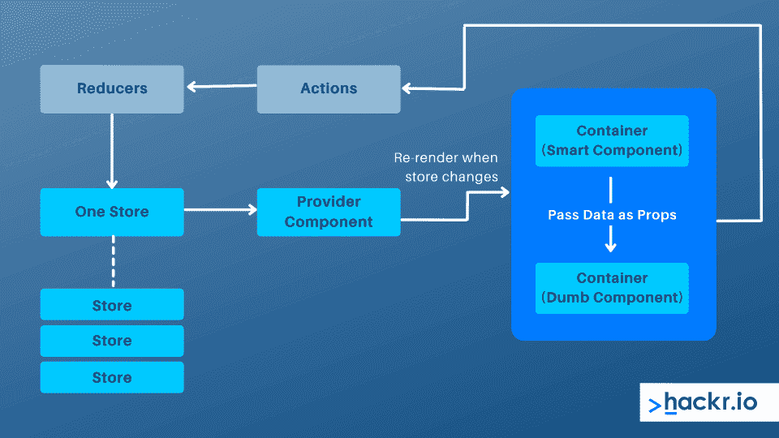
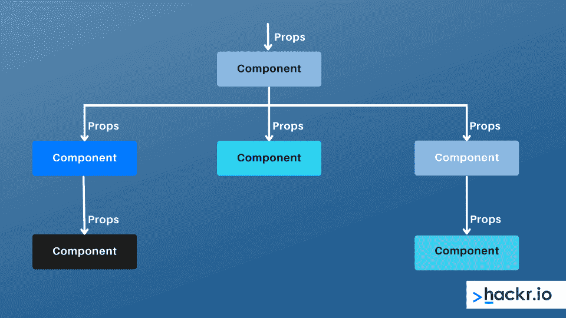
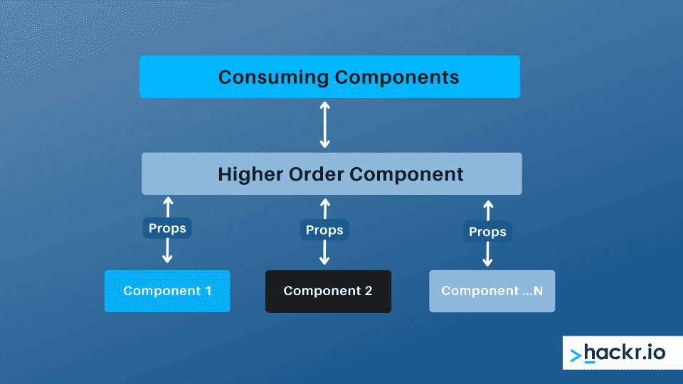

# 2023 年 Top React 面试问答[更新]

> 原文：<https://hackr.io/blog/react-interview-questions>

React 是当今 JavaScript 前端 web 开发行业不可或缺的一部分。对于那些希望在前端使用 JS 的人来说，拥有足够的 React 知识是必要的。

React 是领先的 JavaScript 框架之一，并且可能会继续保持下去。虽然被认为是一个前端框架，但 React 实际上是一个前端库。事实上，React 作为一个 web 开发框架的想法非常好，它已经成为领先的 [web 开发框架](https://hackr.io/blog/web-development-frameworks)之一。

在这里，我们来看看一些常见的 React 面试问题和答案。

## **Top React 面试问答**

拥有 React 的理论和实践知识是很重要的，因此才有了这些面试问题。React 技术面试问题和 React 高级面试问题很好地结合在一起。

#### **1。什么是反应？它的一些主要特征是什么？**

React 是脸书在 2011 年开发的一个前端 JavaScript 库。它增强了应用程序的性能，同时允许在客户端和服务器端工作。

使用 React 编写 UI 测试用例很简单，也很容易与 Angular、Meteor 和其他流行的 JS 框架集成。React 的一些主要特性如下:

*   非常适合开发复杂的交互式 web 和移动 UI。
*   遵循基于组件的方法，促进可重用的 UI 组件。
*   拥有出色的社区支持。
*   使用虚拟 DOM 而不是真实 DOM。
*   依赖于服务器端呈现。
*   支持单向数据流或数据绑定。

### **2。什么是状态，如何使用状态？**

状态是 React 组件的数据源。它们是负责确定组件行为和渲染的对象。因此，它们必须尽可能简单。您可以使用语法 this.state()来访问状态

状态是可变的，并创建动态和交互式的组件。状态的使用可以通过下面的代码片段来可视化:

```
classAppextendsReact.Component {

constructor() {

super();

this.state={

foo: 'bar'

}

}
```

### **3。为什么我们要在 React 中使用 render()。**

在 React 中，每个组件都必须有一个 render()函数。它返回一个 React 元素，这实际上是原生 DOM 组件的表示。

当需要呈现多个 HTML 元素时，我们将它们放在一个封闭标签中。render()函数需要在每次被调用时返回相同的结果，也就是说，它需要保持纯净。

### **4。画一个图表，显示数据如何通过 Redux 流动。**

****

[React -完整指南(包括钩子、React 路由器、Redux)](https://click.linksynergy.com/deeplink?id=jU79Zysihs4&mid=39197&murl=https%3A%2F%2Fwww.udemy.com%2Fcourse%2Freact-the-complete-guide-incl-redux%2F)

### **5。ES5 和 ES6 中语法的主要区别是什么？**

从 ES5 到 ES6，语法发生了巨大的变化。ECMAScript 的两个版本之间的重要区别是:

*   **Require vs . Import:**ES5 中使用的 Require 现在替换为 Import . var React = Require(' React ')；//现在替换为
    从‘React’导入 React；//在 ES6 中
*   **export vs. Exports:** 现在用 Export 代替 Exports，Export 默认组件；//替换
    模块，exports = Component；//在 ES6 中
*   **组件和功能:**组件和功能的使用也从 ES5 变成了 ES6。

**在 ES5 中:**

```
var MyComponent = React.createClass({

render: function() {

return

Hello World!

;

}

});
```

**在 ES6:**

```
classMyComponentextendsReact.Component {

render() {

return

Hello World!

;

}

}
```

*   道具:使用道具的规则也从 ES5 变成了 ES6

**在 ES5 中:**

```
var App = React.createClass({

propTypes: { name: React.PropTypes.string },

render: function() {

return

Hello, !

;

}

});
```

**在 ES6:**

```
classAppextendsReact.Component {

render() {

return

Hello, !

;

}

}
```

*   **状态:**ES6 的使用状态也被调整了。

**在 ES5 中:**

```
var App = React.createClass({

getInitialState: function() {

return { name: 'world' };

},

render: function() {

return

Hello, !

;

}

});
```

**在 ES6:**

```
classAppextendsReact.Component {

constructor() {

super();

this.state = { name: 'world' };

}

render() {

return

Hello, !

;

}

}
```

### **6。什么是虚拟 DOM，它是如何工作的？**

虚拟 DOM 是一个轻量级 JS 对象。它只是真实 DOM 的一个副本。虚拟 DOM 是一个节点树，它列出了各种元素、它们的属性以及作为对象和它们的属性的内容。

React 中的 render()函数负责从 React 组件创建一个节点树。然后，响应于由于用户或系统做出的各种动作而导致的数据模型中的突变，更新该树。

虚拟 DOM 通过三个简单的步骤运行:

*   **步骤 1:** 一旦底层数据发生变化，整个 UI 就会以虚拟 DOM 表示重新呈现。
*   **步骤 2:** 计算先前的 DOM 表示和新的 DOM 表示之间的差异(作为底层数据变化的结果)。
*   **第三步:**计算成功完成后，实际的 DOM 只根据被改变的内容进行更新。

### 7 .**。真实的 DOM 和虚拟的 DOM 有什么不同？**

*   **DOM 操纵:**真正的 DOM 在 DOM 操纵上是很贵的。相反，虚拟 DOM 是廉价的。
*   **元素更新:**真正的 DOM 在元素更新时会创建一个新的 DOM。虚拟 DOM 不会，而是更新 JSX。
*   **内存浪费:**真实的 DOM 造成了大量的内存浪费，而虚拟 DOM 则没有内存浪费。
*   **更新速度:**真实 DOM 更新慢但虚拟 DOM 更新快。
*   **更新 HTML:** 真实 DOM 可以直接更新 HTML，虚拟 DOM 不能直接更新 HTML。

### **8。React 组件的生命周期方法有哪些？**

*   **componentidmount():**在第一次渲染后在客户端执行。
*   **componentDidUpdate():** 在 DOM 中进行渲染后立即调用。
*   **componentWillMount():** 在客户端和服务器端渲染开始之前立即执行。
*   **componentWillReceiveProps():**当从父类接收到属性时，在调用另一个渲染之前调用。
*   **componentWillUnmount():** 用于清理内存空间。在组件从 DOM 中卸载后立即调用。
*   **componentWillUpdate():** 在 DOM 呈现之前立即调用。
*   **shouldComponentUpdate():** 返回真或假。尽管默认情况下为 false，但如果组件需要更新，则需要设置为返回 true。

### **9。用一个代码例子解释 JSX。为什么浏览器读不出来？**

JSX 是 JavaScript XML 的缩写。它利用 JavaScript 的表现力使 HTML 代码易于理解。JSX 文件在提高应用程序性能的同时，使应用程序更加健壮。JSX 的一个例子是:

```
render(){

return(

React learning made better by Hackr.io!!

);

}
```

JSX 不是一个普通的 JS 对象。浏览器不能读取 JSX 是因为浏览器只能读取普通的 JS 对象。

为了使 web 浏览器能够读取 JSX 文件，需要将它转换成一个常规的 JavaScript 对象。为此，JSX 变形金刚，像[巴别塔](https://babeljs.io/)被使用。

### 10。编写代码来演示将两个或更多组件嵌入到一个组件中。

```
classMyComponentextendsReact.Component{

render(){

return(

Hello

);

}

}

classHeaderextendsReact.Component{

render(){

return

Header Component

};

}

ReactDOM.render(

, document.getElementById('content')

);
```

###  **11。用一个例子，解释如何在 React 中模块化代码。**

为了模块化 React 中的代码，使用了导出和导入属性。它们有助于在不同的文件中清楚地编写组件:

```
exportdefaultclassChildComponentextendsReact.Component {

render() {

return(

This is a child component

);

}

}

import ChildComponent from'./childcomponent.js';

classParentComponentextendsReact.Component {

render() {

return(

);

}

}
```

###  **12。React 路由器与传统路由有何不同？**

*   **URL 的变化:**HTTP 请求被发送到服务器，用于以常规路由接收相应的 HTML 页面。React routing 仅在历史属性发生变化时才这样做。
*   **导航:**在传统的路由中，用户实际上为每个单独的视图在不同的网页之间导航。在 React routing 中，用户感觉像是在浏览不同的网页，而实际上并不是这样。
*   **Pages:** 在 React 路由中只涉及一个 HTML 页面，但是在传统路由中，每个视图对应一个新文件。

### 13。状态和道具有什么区别？

*   子组件内部的更改可以通过 props 实现，但不能通过 state 实现。
*   组件内部的改变不能用道具来实现，但是可以用状态来实现。
*   Props 允许父组件改变值，state 不允许。

### **14。如何区分 Redux 和 Flux？** 

*   **组件:** React 组件订阅 flux 中的存储，而在 redux 中，容器组件使用 connect
*   **调度器:**redux 中没有调度器。另一方面，flux 有一个单独的调度程序
*   **商店数量:**虽然 flux 有多家商店，但 redux 只有一家商店
*   **状态:**对于 flux 是可变的，但是对于 redux 是不可变的
*   **存储:**流入，存储包含状态以及变化逻辑。与此相反，redux 中的存储与更改逻辑是分开的
*   **店铺类型:**flux 中的所有店铺都是断开的、平坦的。redux 不是这种情况，在 redux 中，只有一个带有层次化归约器的存储

### 15。你如何在 React 中创建一个表单？

React 表单与 HTML 表单相同。但是，状态包含在 React 中组件的 state 属性中，并且只能通过 setState()方法更新。

因此，React 表单中的元素不能直接更新它们的状态。他们的提交由 JS 函数处理，该函数可以完全访问用户输入到表单中的数据。

以下代码演示了如何在 React 中创建表单:

```
handleSubmit(event) {

alert('A name was submitted: ' + this.state.value);

event.preventDefault();

}

render() {

return (

Name:

);

}
```

 **16。使用 Redux 有什么好处？**

*   更好的代码组织 : Redux 在如何组织代码方面非常精确。这导致了对任何开发团队都可行的一致的代码
*   开发人员工具:这些工具允许开发人员实时跟踪从动作到状态变化的一切。
*   **易测试** : Redux 代码主要由隔离的、纯的、小的函数组成。这使得测试更加容易。
*   **大型社区** : Redux 背靠庞大的社区。它为一个不断增长和完善的具有即用型应用程序的库做出了贡献。
*   可维护性:由于可预测的结果和严格的结构，代码更容易维护。
*   **输出可预测性**:将当前状态与动作以及应用程序的其他部分同步不会引起混淆，因为只有一个[单一的事实来源](https://stackoverflow.com/questions/47182888/what-does-the-single-source-of-truth-mean)，即商店。
*   **服务器端渲染**:你只需要把在服务器端创建的 store 传递给客户端。除了对初始渲染有用之外，它还提供了更好的用户体验，因为它优化了应用程序的性能。

### **17。什么是道具？**

Prop 是 React 中 Properties 的缩写。这些只读组件需要保持不变，即保持纯净。在整个应用程序中，道具从父组件传递到子组件。



为了保持单向数据流，子组件被限制向其父组件发回道具。这也有助于呈现动态生成的数据。

### 18。在 React 代码中，应该把 AJAX 调用放在哪里？

React 可以使用任何 AJAX 库，比如 Axios、jQuery AJAX 以及内置的浏览器 window.fetch。

带有 AJAX 调用的数据需要添加到 componentDidMount()生命周期方法中。这样，一旦检索到数据，就可以使用 setState()方法更新组件。

### **19。编写示例代码来更新 React 中组件的状态。**

React 中组件的状态用 this.setState()更新，如下面的代码示例所示:

```
classMyComponentextendsReact.Component {

constructor() {

super();

this.state = {

name: 'Akhil',

id: '101'

}

}

render()

{

setTimeout(()=>)},2000)

return (

Hello

Your Id is

);

}

}

ReactDOM.render(

, document.getElementById('content')

);
```

###  **20。你对“在 React 中，一切都是组件”这句话有什么看法？**

React 应用程序 UI 的构建块称为组件。使用 React 创建的任何应用程序 UI 都可以分成许多独立的、可重用的小部分，称为组件。

React 使每个组件相互独立。因此，在应用程序 UI 的其余部分上呈现组件没有任何影响。

### **21。React 最鲜明的特点是什么？**

React 最显著的特点是:

*   它使用虚拟 DOM 代替真实 DOM。
*   服务器端渲染。
*   数据的单向流动。
*   数据绑定。

### **22。React 的优势是什么？**

React 有几个优点，包括:

*   改进的应用程序性能。
*   可用于客户端和服务器端呈现。
*   增加 JSX 代码的可读性。
*   易于与其他框架集成，包括 Angular、Meteor 等。
*   使用 React 可以使 UI 更加直观。

### **23。反应有什么限制吗？**

反应有几个限制，包括:

*   它充当一个库，而不是一个框架。
*   图书馆的内容非常庞大，要花相当多的时间才能理解。
*   这对新手来说很难理解。
*   当应用内联模板和 JSX 时，编码过程变得更加复杂。

### **24。浏览器能读懂 JSX 吗？**

不，浏览器不能读取 JSX，因为它不是一个普通的 JavaScript 对象。

### **25。React 和 Angular 有什么区别？**

React 和 Angular 之间有几个[差异，例如:](https://hackr.io/blog/angular-vs-react)

| **功能** | **反应** | **角度** |
| **架构** | 仅支持 MVC 的视图。 | 支持完整的 MVC 视图。 |
| **渲染** | 客户端和服务器端呈现。 | 客户端渲染。 |
| **家** | 使用虚拟 DOM。 | 使用真正的 DOM。 |
| **数据绑定** | 单向数据绑定。 | 双向数据绑定。 |
| **调试** | 编译时调试。 | 运行时调试。 |
| **开发者** | 由脸书开发。 | 由谷歌开发。 |

### **26。React 和它的组件有什么关系？**

React 及其组件密切相关。React 的组件充当 UI 的 React 应用程序的构建块。将整个 UI 分割成小的、独立的、可重用的部分有助于创建 React 应用程序的 UI。

### **27。React 中的状态是什么？**

React 中的状态充当数据源，并且保持简单，以便决定组件呈现和行为的对象变得可变。

### **28。父组件可以改变状态和道具的值吗？**

父组件可以更改 props 中的值，但不能更改状态中的值。

### **29。可以在组件内部进行更改吗？**

可以在状态内部进行更改，但不能在道具中进行更改。

### 三十岁。我们可以在子组件内部进行修改吗？

是的，我们可以在 props 的子组件内部进行修改，但是不能在 states 的情况下进行修改。

### 31。什么是有状态组件？

有状态组件在内存中存储更改。它具有改变状态的权限，并且包含关于过去、当前和未来变化的重要信息。

### 32。无状态组件和有状态组件有什么不同？

无状态组件计算组件的内部状态，但无权更改状态。没有关于过去、现在或未来的知识，但是从有状态组件接收道具，这些道具被视为回调函数。

### 33。React 中的合成事件是什么？

React 中的合成事件是 React 中的对象，充当浏览器本机事件的跨浏览器包装器。主要目的是在 API 上组合不同的浏览器，以便事件显示不同的属性。

### 34。React 中的 refs 是什么？

Refs 代表参考反应。它帮助存储对特定 react 元素或组件的引用，这些元素或组件可以由组件呈现配置函数返回。

### 35。什么时候引用最多？

引用主要用于以下情况:

*   当需要管理焦点时，选择文本或应用媒体回放。
*   启动命令式动画。
*   加入第三方 DOM 库。

### 36。React 中可以模块化代码吗？怎么会？

是的，我们可以在 React 中模块化代码。这可以通过使用导出和导入属性来完成。

### 37。React 中的受控组件有哪些？

React 中的受控组件是那些可以保持其状态的组件。数据由它们的父组件控制，它们使用 props 考虑当前值，然后使用回调通知更改。

### 38。非受控组件与受控组件有何不同？

不受控制的组件保持它们的状态，它们的数据由 DOM 控制。在非受控组件中使用 Refs 来获取它们的当前值，而不是在受控组件中使用 props。

### 39。什么是 HOC？

HOC 代表高阶分量。这是重用组件逻辑的一种高级方法，它将另一个组件包装在一起。



### 40。HOC 有什么好处？

特设有几个好处，包括:

*   可重用代码。
*   逻辑和引导抽象的应用。
*   提供了很高的黑客设施。
*   支持状态抽象和操作。
*   道具操作。

### 41。什么是纯组件？

纯组件是简单且易于编写的组件。它们可以很容易地替换任何组件作为呈现器()。

### **42。什么是减速器？**

Reducers 是纯函数，它清楚地说明了当执行某些操作时，应用程序的状态是如何变化的。这样，它会考虑先前的状态和动作来创建新的状态。

### **43。Redux 的店铺是什么？**

store 是一个 JavaScript 对象，它可以保存应用程序状态、访问它们以及应用调度操作和注册侦听器。

### **44。我们为什么需要路由器？**

我们在 React 中需要一个路由器，这样每当用户键入一个特定的 URL 时，我们就可以定义多个路由。这样，当 URL 与路由器内部定义的路径匹配时，就可以应用特定的路由器。

## **结论**

这总结了我们列出的最常见的面试问题和答案。除了扎实的技术知识，你还需要清晰自信地展示自己。如果你还想了解更多关于 React 的知识，请查看这些 [React 教程](https://hackr.io/tutorials/learn-react?ref=blog)和[最佳 React 课程](https://hackr.io/blog/react-courses)。

更多编程问答也可以在书中找到，[破解编码面试:189 个编程问答](https://geni.us/MmRP)。祝你好运！

## **常见问题解答**

#### **1。在 React 面试中我能期待什么？**

在面试中，你可能会被问到理论和 React 编码的问题。让你记下你的基本知识，并复习这里的问题，以了解通常被问到的问题。

#### **2。React 面试应该学什么？**

从简单的概念到代码实现，你都应该学习。关注组件、状态、Redux、props 之类的东西——基本上就是你在 React JS 面试问题列表中看到的东西。

#### **3。你如何准备 React 面试？**

通过确保你有你的基本原则和练习来准备 React 面试。看视频教程，看书也有帮助。请记住，React 编码面试问题也将在那里，所以不要吝啬这些。

**人也在读:**