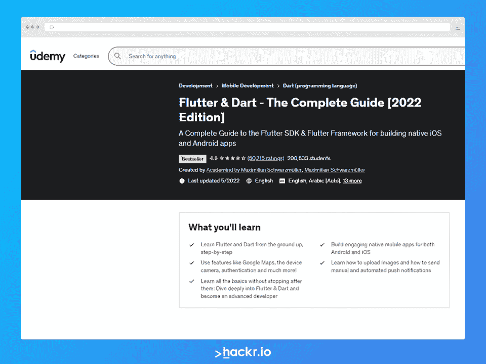
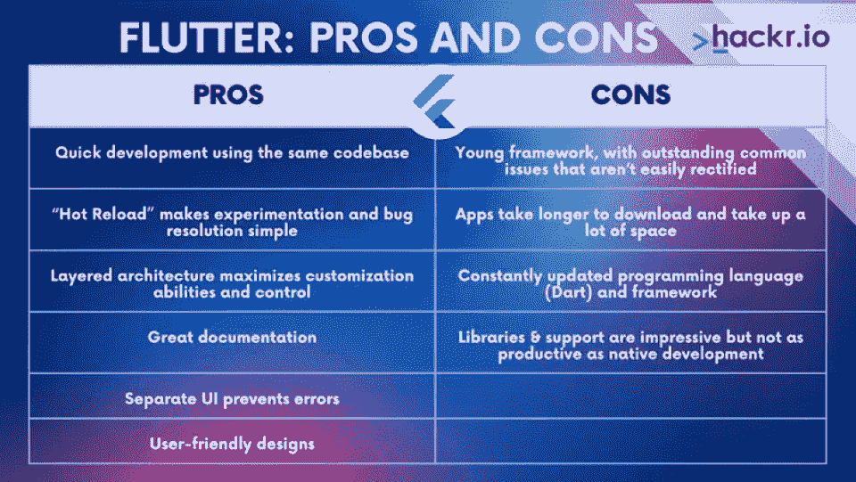
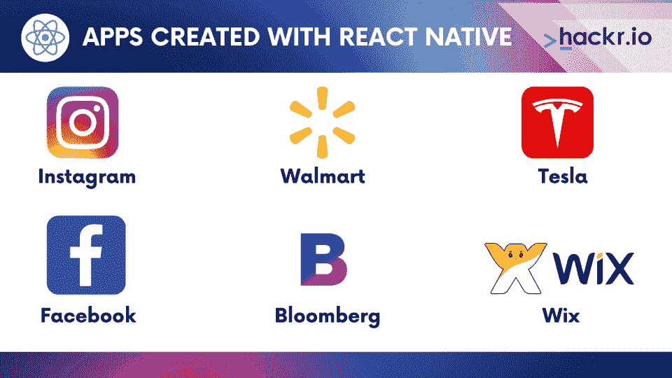
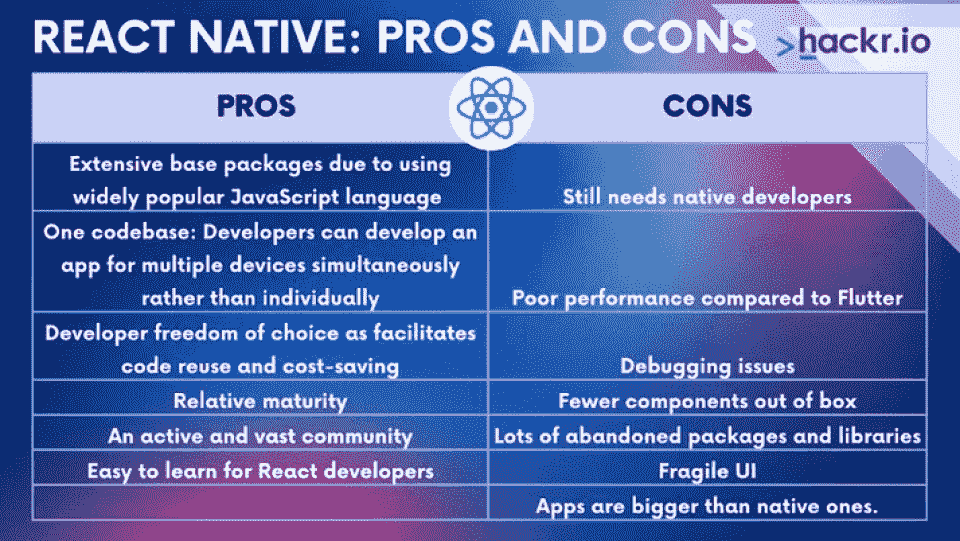

# 2023 年颤振与反应原生:详细比较

> 原文：<https://hackr.io/blog/react-native-vs-flutter>

移动应用开发是一个快速增长的行业，尤其是在新冠肺炎对特定生活方式和通讯应用的需求之后。但同时为 iOS 和 Android 开发应用程序意味着有两个不同的团队和技能组合。

解决方案是跨平台的移动应用解决方案，如脸书的 React Native 和谷歌的 Flutter。但是哪个更好:颤振还是反应原生？

今天，我们将带您浏览在每个平台上开发的流行应用，并根据它们的功能和历史对 Flutter 和 React Native 进行比较。在本指南结束时，您将对 Flutter 和 React 本地问题有一个坚实的理解，包括它们各自的优缺点。

但是首先，快速浏览一下这两种解决方案，这会让您了解 Flutter 和 React Native 之间的区别。

## **颤振与自然反应:正面对比**

| **技术** | **反应原生** | **颤动** |
| 由…创造 | 脸谱网 | 谷歌 |
| 首次发布 | 2015 年 1 月 | 2017 年 5 月 |
| 主要建筑 | 通量和冗余 | 集团 |
| 程序设计语言 | Java Script 语言 | 镖 |
| 组件库 | 大型包容性图书馆 | 较小，非包容性 |
| 表演 | 由于 JavaScript 桥接，性能较慢 | 高性能、快速 |
| 自适应组件 | 有些是自动适应的 | 组件不是自适应的。需要手动配置 |
| 学习曲线 | 易于掌握，尤其是如果您以前习惯于 React 或 Javascript | 组件不是自适应的。需要手动配置 |
| 生态系统 | 相当成熟，在全球许多大公司的生产中使用，有许多可用的软件包 | 尚未成熟，套餐数量较少 |
| 热重装 | 支持 | 支持 |
| 应用程序 | Instagram，脸书，特斯拉 | 谷歌广告，飞利浦 Hue，Postmuse |
| 上市时间 | 相对较慢 | 相对更快 |

## **什么是颤振？**

## Flutter 是一个反应式、开源、跨平台的移动开发框架，使用 Dart 编程语言。谷歌创造了 Dart 和 Flutter，这家科技巨头在其一些最大的应用程序中使用该框架。最初的 alpha 版本发布于 2017 年 5 月。然而，谷歌每隔几个月就会发布新版本，2021 年 5 月。

让我们深入了解 Google Flutter 的几个特征，包括反应式编程、开发、安装等等。

**用 Flutter 创建的著名应用**

## ****

尽管这是一个比 React Native 更近的发展，但 Flutter 已经诞生了许多我们今天知道并喜欢的著名应用程序。这里有一个快速列表:

**1。谷歌广告**

### 谷歌广告可以让你从智能手机上方便地管理广告活动。该服务通过实时提醒、编辑、实时竞价、丰富的统计数据和应用客户支持来帮助您跟踪您的广告。

**2。密文**

### cryptographic 是一个应用程序，可以让你监控数千种加密货币及其性能，包括以太坊和比特币。您可以访问每种货币的汇率图和市场历史。

**3 .邮务员〔t1〕**

### 如果你是一名社交媒体或营销专业人士，你可能知道 Postmuse，它可以大大增强你的内容。该应用程序允许您使用独特的图像质量、书法、故事模板等来改进您的内容。

推荐课程:扑镖指南

### **带颤振的反应式编程**

### Flutter 是一个反应式框架——但这意味着什么，为什么它对[应用开发](https://hackr.io/blog/how-to-become-a-mobile-app-developer)如此有用？

假设您想向服务器发送一个请求，并根据响应执行一个操作。如果您在响应返回之前采取行动，也就是说，在您拥有对象之前，您将采取一个会导致著名的十亿美元错误的行动:空引用。如果你来自 Android 和 Java 世界，你会知道 [Kotlin](https://hackr.io/blog/how-to-learn-kotlin) 背后的主要动机之一是消除空引用。

当数据异步到达时，有多个用户点击和请求，许多程序部分必须响应传入的数据。换句话说，如果没有反应式编程，将会是一片混乱。

**颤振开发和安装**

### Flutter 应用程序的主要构件是一个小部件。小部件类似于 React Native 中的组件。Flutter 附带了几个现成的小部件，其中大部分实现了材质设计概念。有两种类型的小部件:无状态和有状态小部件，就像 React 中的类和功能组件一样。不幸的是，Flutter 的小部件不具有自适应性，因此您必须手动进行特定于平台的自适应。

开始使用 Flutter 相当容易。您需要做的就是下载 Flutter 包，解压缩它，然后创建一个环境变量，指向解压缩后的文件夹中的一个文件夹。如果你不想用手机，你可能还需要下载 Android Studio 并设置一个模拟器。

Flutter 支持热重新加载特性，使您能够在开发过程中根据自己的调整重新运行应用程序，从而加快开发速度。目前，Android Studio、IntelliJ Idea 和 Visual Studio 代码正式支持 Flutter。

**颤振 UI 组件**

### 与 React Native 相比，Flutter 具有丰富的组件集。该框架附带了许多 UI 呈现组件、导航、库、API 访问和许多其他组件来帮助您开发优秀的应用程序。该程序的许多小部件也使得在 Android 和 iOS 设备上设计 UI 更加容易。

**颤振生态系统**

### Flutter 的一个缺点是，当谈到生态系统时，它落后于 React Native。在 Flutter 发布之前，React Native 已经存在了两年，为前者提供了大量可用的软件包。然而，随着许多移动开发核心包可供公众使用，Flutter 正在迅速赶上。由于一个活跃和专注的社区，Flutter 生态系统也有很大的动力。目前，有超过 23，000 个[包](https://pub.dartlang.org/flutter)可用于 Flutter。

**颤振性能**

### 当谈到性能时，Flutter 的方法与 React Native 甚至 NativeScript 的方法截然不同。Flutter 的应用是用 arm C/C++库编译的。这使它更接近机器语言，并提供更好的本机性能。与 React Native 不同，它不仅编译了 UI 组件；反而整件事都是编的。

Dart 本身是一种相当高性能的语言，这导致许多人认为 Flutter 占了上风。不奇怪，考虑到它流畅，每秒 60 帧的速度！

**颤振文件**

### Flutter 有很好的文档和活跃的共享社区。而且 Flutter 的团队也挺帮忙的，相对容易上手平台。请记住，虽然文档很全面，但如果您没有编程经验，可能会很难理解。但是，一些用户也报告说，这些文档对某些常见问题没有帮助。

**颤振架构**

### Flutter 相对较新，这使得一些程序员不确定为您的应用程序实现最佳架构。

一种流行的架构是 BLoC 架构(业务逻辑组件)。Google 在 DartConf2018 上描绘了该架构，它指出业务逻辑应该从表示层中取出，放在业务逻辑组件中。阻塞模式严重依赖于流和 RxDart(反应式 Dart)。

使用 Redux/Flux 您可能会感觉更舒服，这在某些 Flutter 包中是可能的。如果您对创建小应用程序感兴趣，并且只是尝试一下 Flutter，这些就足够了。

**颤振的利弊**

### **优点:**

使用相同的代码库快速开发

*   “热重装”使实验和错误解决变得简单
*   分层架构最大化了定制能力和控制
*   出色的文档
*   独立的用户界面防止错误
*   用户友好的设计
*   **缺点:**

年轻的框架，有一些不容易纠正的常见问题

*   应用程序需要更长的时间来下载，并占用大量空间
*   不断更新的编程语言(Dart)和框架
*   库和支持令人印象深刻，但不如本地开发有成效
*   **何时使用颤振**

### 小额预算

*   较短的开发时间
*   以用户界面为中心的应用
*   迭代(热重装)
*   **什么是 React Native？**

谈到跨平台移动开发，脸书的 React Native 可能是最著名的。React Native 始于 2013 年脸书的一个内部黑客马拉松项目，于 2015 年向公众发布。React Native 是一个使用 React 库构建的 JavaScript 框架,它可以帮助你用一个代码库发布 IOS 和 Android 应用。

**用 React Native 创建的著名应用程序**

## 以下是一些用 React Native 创建的流行应用:

**1。Instagram**

Instagram 是我们都知道并使用的照片分享、故事拍摄、后期制作社交媒体巨头。Instagram 使用 React Native 作为其直观的用户界面，首先是推送通知和网络视图。因为高达 85%-99%的代码是共享的，所以开发比平常要快。

### **2。沃尔玛**

每个月，有 1.2 亿人访问沃尔玛的热门应用程序。这家百货巨头最近用 React Native 重写了其移动应用程序代码，称其具有速度和效率提高等优势。

### **3。特斯拉**

特斯拉为电动汽车爱好者和车主创建了一个应用程序，以帮助诊断问题和识别特征。令人震惊的是，该应用程序甚至可以部分控制汽车的运动！

**开发和安装**

React Native 使用组件，但不是像 Div 和 H1 这样的 web 组件，而是使用 react-native 库为移动开发提供的组件集。React Native 也使用虚拟 DOM 与本机 UI 元素进行通信。React Native 提供的小部件不如 Flutter 多，但它包含了自适应组件。

### 要开始使用 React Native，您必须首先安装带有 npm 的 create-react-native-app 包，使用它来创建新的 React Native 应用程序。使用 React Native 进行开发的一个有用方面是它的 Expo 集成条款。Expo 可以让你在移动设备上运行你的代码，而不用连接它。相反，你只需要扫描控制台上出现的二维码。

**生态系统**

React Native 上市时间更长，因此得到了大多数编辑的广泛支持。该平台还支持热重装，如颤振。当谈到软件包时，React Native 是明显的赢家，其软件包数量是 Flutter 的五倍以上。框架也比 Flutter 更成熟稳定。

### **文档**

React Native 的文档足够了，而且比 Flutter 的更加用户友好。官方文档包括正确解释、指南和流行的跨平台开发主题，如安装本机模块。

### **UI 组件**

React Native 没有 Flutter 那么丰富的组件集。相比之下，它只提供 UI 渲染，依靠第三方库访问原生模块。一些用户发现 React Native 过于依赖这些第三方。

**性能**

### React Native 的方法与 Flutter 不同。整个应用程序没有被编译成 C/c++(T1)或一种本地语言。相反，UI 组件被编译成它们的本机等效组件，JS 代码在一个单独的线程中运行，并通过桥与本机模块通信以执行任何所需的操作。

不幸的是，初始化 Javascript 和要求模块是一个密集的任务。React Native 可能比 Ionic 或 Cordova 等混合动力替代品的性能更高，但与 Flutter 相比，它的性能有所下降。

React Native 的表现还是有希望的。许多优化领域可能会提高性能，包括惰性要求、惰性本机模块加载和增量缓存读取。

### **架构**

构建 React/React to native 应用主要有两种模式:Flux 和 Redux。

Flux 是由框架创建者脸书创建的，而 Redux 是社区中最受欢迎的选项。

这些框架是关于单向数据流和将应用程序的状态存储在一个叫做 Store 的中心位置。它们也让你的应用组件尽可能的无状态。您还可以使用 Context API，这是一个用于状态管理的新的 React 特性。

**React Native 的利弊**

**优点:**

由于使用了广泛流行的 JavaScript 语言，基础包非常丰富

一个代码库——开发者可以同时为多个设备开发一个应用，而不是单独开发

开发人员的自由选择促进了代码重用和成本节约

### 相对成熟度

一个活跃而庞大的社区

*   React 开发人员易于学习
*   **缺点:**
*   仍然需要本地开发人员
*   与颤振相比性能较差
*   调试问题
*   开箱即用的组件更少

许多废弃的包和库

*   脆弱的用户界面
*   应用程序比原生程序大
*   **何时使用 React Native**
*   大预算和复杂项目
*   复杂的跨平台应用
*   重用移动和桌面应用程序的代码
*   由于大量的文档支持，开发人员经验较少

### **结论**

*   正如我们所看到的，React Native 与 Flutter 的辩论对双方都有利有弊，但其想法是填补两个平台(Android 和 iOS)之间的差距。
*   一些行业专家预测 Flutter 是移动应用开发的未来。但 React Native 仍然是当今市场上一些最令人印象深刻的应用的王者，如脸书和 Instagram。
*   底线是每个平台服务于不同的目的，所以在使用一个平台之前你应该考虑你的需求。
*   有兴趣了解更多关于颤振和反应原生？想找一份 React 开发人员的工作？

查看我们的 2023 年颤振指南和我们的综合[最佳反应原生教程](https://hackr.io/tutorials/learn-react-native)和这些[反应面试问题](https://hackr.io/blog/react-interview-questions)以获得更多帮助。

**常见问题解答**

**1。Flutter 比 React Native 好吗？**

两者都有利弊。如果您计划用适中的预算创建小型应用程序，并且重视丰富的组件集，那么 Flutter 可能是您更好的选择。

**2。Flutter 比 React Native 快吗？**

是的，Flutter 比 React Native 快。React Native 依赖 JavaScript 来桥接本地组件，这使得它的过程更慢。

**3。2023 年应该学 React Native 还是 Flutter？**

## 如果你打算创建更深入的项目和更复杂的应用程序，你应该在 2023 年学习 React Native。但是许多编程专家推荐 Flutter，因为它具有无与伦比的性能。查看本文的“何时使用 Flutter”和“何时使用 React Native”部分，了解更多信息。

#### **4。Flutter 有前途吗？**

随着不断增长的功能和市场发展，专家们将 Flutter 视为移动应用开发未来的重要参与者。

#### **5。Flutter 2023 量产准备好了吗？**

是的，谷歌最近宣布，Flutter 将有资格获得微软的 IDE Visual Studio 2023 版本。

#### **3\. Should You Learn React Native or Flutter in 2023?**

You should learn React Native in 2023 if you plan on creating deeper projects and more complex apps. But many programming experts recommend Flutter for its unparalleled performance. Check out our “When to Use Flutter” and “When to Use React Native” sections of this article for more clarity.

#### **4\. Does Flutter Have a Future?**

With ever-growing features and market development, experts see Flutter as a big player in the future of mobile app development.

#### **5\. Is Flutter Ready for Production 2023?**

Yes, Google recently announced that Flutter would be eligible for Microsoft’s IDE Visual Studio 2023 version.