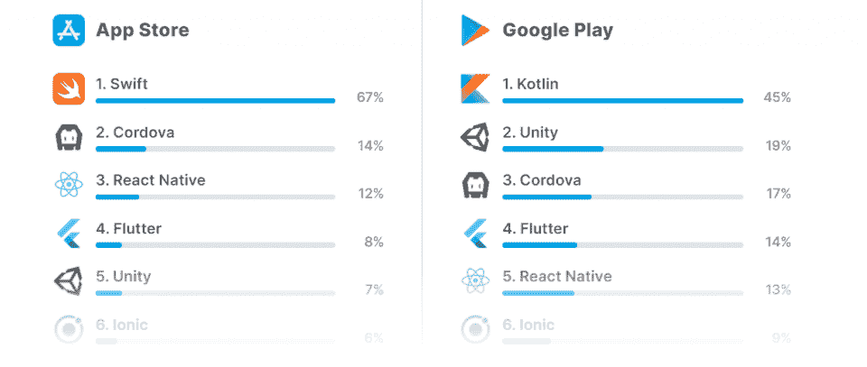
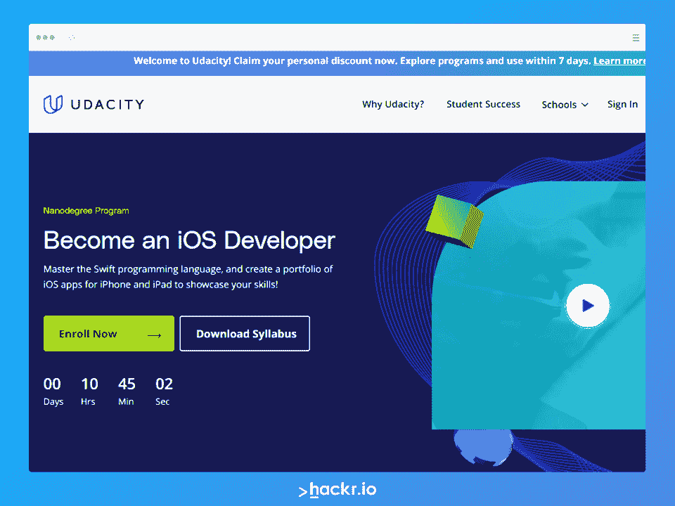

# React Native vs Swift:势均力敌的比较[2023]

> 原文：<https://hackr.io/blog/react-native-vs-swift>

今天，我们将探讨 Swift 与 React Native——两种常用于构建移动应用的强大技术。开发人员同时使用 Swift 和 React Native 进行应用程序开发和设计，但它们并不相同。

Swift 首先是 iOS 的开发语言，而 React Native 用于跨平台开发。

**以下是你需要知道的:**

*   Swift 是苹果为 iOS 中的移动应用开发的专有[编程语言](https://hackr.io/blog/what-is-programming-language)。
*   React Native 是脸书(现为 Meta)开发的开源软件框架，常用于开发移动应用。

**下面是你将要学习的内容:**

*   什么时候应该使用 Swift vs. React？
*   你能用 Swift 做任何你能用 React 做的事情吗？
*   React Native vs. Swift:应该学哪个？

## **什么是 React Native？【定义】**

React Native 不是编程语言；相反，它是一个 [JavaScript](https://hackr.io/blog/how-to-learn-javascript) 编程框架，用于为 iOS 和 Android 构建原生移动应用。React Native 是“React”的一个分支，它是同一个[框架](https://hackr.io/blog/react-vs-react-native)，没有本地移动焦点。因为 React Native 是基于 JavaScript 构建的，所以对于大多数开发人员来说很容易学习，并且可移植性极强。您可以创建 React 本机 iOS、Android 和 Windows mobile 应用程序。

React Native 主要是一种*构建*接口的方法，所以它非常基于视图。如果你想创造一个“你好，世界！”在 React Native 中编写程序，您可以按如下方式进行:

```
const HelloWorld = () => {
return (
<View>
<Text>Hello, World!</Text>
</View>
)
}​
```

因为它是一个完整的框架，React Native 不“只是 JavaScript”——它更类似于了解 CSS 和学习 Bootstrap。尽管如此，JavaScript 程序员可以很快适应 React Native 的使用。React Native 的优点是快速部署。React Native 强调速度、性能和可伸缩性。

| **优点** | **缺点** |
| 基于 Javascript 构建

*   跨平台
*   快速部署
*   什么是 React vs. React Native？

 | 如前所述，React Native 是从 React 构建的。React 是一个基于组件的 JavaScript 库，使得开发 web 应用程序变得更加容易。React Native 也是一样的东西，但是它开发的是移动的原生应用程序，而不是 web 应用程序或渐进式 web 应用程序。 |

### **什么是雨燕？【定义】**

Swift 是苹果开发 iOS 应用的专有编程[语言。Swift 可以移植到 Android，例如通过 Kotlin，但它旨在通过 iOS 生态系统进行本地开发。Android store 上有用 Swift 写的应用，所以 Swift 不是不能移植或者不可移植；只是没有 React Native 那么跨平台。](https://www.apple.com/swift)

## Swift 不应该和 Swift UI 混为一谈，虽然它们是联姻的技术。然而，Swift UI 和 React Native 之间的差异可能更大，因为 Swift UI 可以被视为一个 UI 框架，与 React Native 非常相似。Swift 是一种语言，Swift UI 是一种创建 UI 代码的方式。

在 Swift UI 中，一句“你好，世界！”程序应该是这样的:

**优点**

**缺点**

```
import SwiftUI
structContentView: View {
var body: some View {
Text("Hello, world!")
}
}​
```

| 专为 iOS 打造 | 语言+用户界面工具包 |
| 快速部署

*   **通过本课程免费学习 Swift！**
*   [](https://imp.i115008.net/n1QZza)
*   **什么是 Swift vs. Swift UI？**

 | Swift 是苹果公司为 iOS 开发的一种编程语言。Swift UI 是基于组件的框架，通过提供开发 UI 的简单框架，有助于在 Swift 中开发应用程序。Swift/Swift UI 经常互换使用，但需要注意的是，Swift 是编程语言，Swift UI 是 UI 套件。 |

[React -完整指南(包括钩子、React 路由器、Redux)](https://click.linksynergy.com/deeplink?id=jU79Zysihs4&mid=39197&murl=https%3A%2F%2Fwww.udemy.com%2Fcourse%2Freact-the-complete-guide-incl-redux%2F)

[iOS & Swift -完整的 iOS 应用开发训练营](https://click.linksynergy.com/deeplink?id=jU79Zysihs4&mid=39197&murl=https%3A%2F%2Fwww.udemy.com%2Fcourse%2Fios-13-app-development-bootcamp%2F)

### 【React Native 和 Swift 有什么区别？

所以，我们知道 React Native 是用 JavaScript 写的框架，Swift UI 是用 Swift 写的框架。两者都用于原生移动应用，尽管 React Native 是跨平台的，Swift UI 主要用于 iOS 开发。

**使用 React Native 的公司**

**使用 Swift 的公司**

## 沃尔玛

微软

| 特斯拉 | 脸谱网 |
|  | 正如你所看到的，React Native 在大型企业中更加根深蒂固，而 Swift 则更多地用于专用应用程序、初创公司和颠覆者。尽管如此，app store 上的绝大多数应用都使用 Swift。

*   
*   ([源数据](https://appfigures.com/top-sdks/development/all))
*   React Native 用 Swift 吗？
*   React Native 使用 JavaScript，具体是 React 库；它不使用 Swift。偶尔，开发人员可能会看到引用以迅速做出反应。您可以在 Swift 中实现 React 库，但是它不能解决任何一个框架的问题。

 |

**React Native 比 Swift 容易吗？**

不一定。JavaScript 开发人员可能会发现，过渡到 React 原生框架比学习另一种语言(如 Swift)更容易。但是没有开始开发生涯的人可能会发现，Swift 和 Swift UI 从一开始就更简单易用。对于一个程序员新手来说，React Native 相对于简单的学习 Swift 和 Swift UI，需要具备 JavaScript、React、React Native 的知识。

**为什么 Swift 比 React Native 好？**

### React Native 和 Swift 之间没有明显的赢家，但许多人认为 Swift 更适合 iOS 开发。当谈到 iOS Swift 与 React native 时，Swift 无疑是为 iOS 环境设计和开发的。

**React Native vs. Swift:势均力敌的比较**

### **反应原生**

**Swift UI**

### **发达**

2015

## 2019

| **平台** | 安卓、iOS、Windows |
| ios | **结构** | 结构 |
| 语言/框架 | **易用性** | 挑战性的 |
| 挑战性的 | **语言** | Java Script 语言 |
| 迅速发生的 | **哪个更容易学？** | 易用性主要取决于程序员的背景。已经了解 JavaScript 的程序员会发现 React Native 很容易学习，尽管他们需要学习框架的功能。程序员可能需要从头开始学习 Swift 和 Swift UI，但一旦他们都学会了，开发应该会相对快速和简单。 |
| **性能:哪个更快？** | React Native 和 Swift 的性能非常相似。虽然 Swift 的运行速度可能会比 React Native 快，尤其是在 iOS 上，但这两种语言都是高度抽象的语言，开发人员不需要在性能或内存管理方面做太多手脚。 | 结果是任何一方都可能有技术债务，因为 React Native 和 Swift UI 都定位于快速*部署*而不是优雅和可伸缩性。这并不是说两者都不能表现得很好，只是可能需要一些额外的努力。 |

### **哪个更百搭？**

React Native 绝对比 Swift 好用。同时，可能会出现 iOS 开发是唯一需要的开发的情况。许多开发人员仍然喜欢分别为 Android、iOS 和 Windows 平台编程，而不是试图开发一个单一的解决方案，然后移植到每个平台。

### React Native 有一个更大、更活跃的社区，但 Swift 社区也是强大而紧密的。开发者可能会发现 React Native 有更多可用的材料和支持，但 Swift 背后有苹果的全力支持。

React Native 和 Swift 都有积极的支持和各种各样的工具，但 React Native 总体上确实更可用。

**职业:Swift 与 React Native 的薪酬**

### 据 ZipRecruiter 称，一名 Swift 开发人员的平均预期收入约为 111，000 美元，这取决于他们的居住地。

然而，ZipRecruiter pegs 对本土薪资的反应更高，为 12.9 万美元。这种差异可能部分是由于 React 本机开发的整体效用，因为它是一个跨平台的开发过程。

不过，请注意，Swift UI 开发人员比 React 原生开发人员少。Swift UI 是一个相对较新的技术和框架……而且专门的 iOS 开发者比较少。

**反应自然迅速的替代方案**

### 当谈到*框架*时，反应原生和 Swift UI 的最流行的替代方案是:

[颤振](http://flutter.dev)。Flutter 是一个由谷歌设计的开源框架，但像其他谷歌技术一样，它的采用一直是不稳定和断断续续的。Flutter 是用 Dart 编写的多平台 app 解决方案。

[MobileUI](http://mobileui.github.io) 。MobileUI 主要用于渐进式 web 应用程序，可以通过浏览器使用，也可以在移动设备上本机使用。它是一个基于 Java 的 UI 框架，适用于 iOS 和 Android。

[NativeScript](http://nativescript.org) 。NativeScript 是一个开源的基于 JavaScript 的框架，用于苹果 iOS 和 Android 开发。

## 立即通过本课程创建您的 iOS 应用

[](https://imp.i115008.net/BXMVQ4)

*   **结论**
*   作为一名移动开发人员，您可能很难在 React Native 和 Swift 之间做出选择。
*   其实两者都是优秀的技术，会很好的为你服务。最终，要知道对于移动应用开发者来说，最好的技术是完成应用的技术。
*   [Xamarin](https://dotnet.microsoft.com/en-us/apps/xamarin). Xamarin is a free, open-source app development platform for Android and iOS, developed by a Microsoft subsidiary.

    ### **你要学会** [**反应原生**](https://hackr.io/tutorials/learn-react-native) **如果:**

    你已经知道了 JavaScript 和它的一些框架。

## 您对开发跨平台应用程序感兴趣。

您需要一个框架来帮助您快速部署应用程序。

你应该[学习 Swift](https://hackr.io/blog/best-way-to-learn-swift) 如果:

你主要对开发 iOS 系统感兴趣。

*   你想创造一个优雅的，有吸引力的用户界面/UX 体验。
*   您不关心跨平台应用程序。
*   如果您仍然不确定，您可能需要学习更多关于移动应用程序开发和设计的知识。

**人也在读:**

*   **常见问题解答**
*   **1。Swift 比 React Native 快吗？**
*   这里有两个关键因素:部署时间和处理时间。许多开发人员发现 React Native 在部署方面更快；React 本机代码可以快速编写和测试，然后移植到多个平台。Swift 代码一般需要更长的开发时间，而且只针对 iOS。

就处理时间而言，您可能期望 Swift 比 React Native 更快(因为 Swift 是为其运行的操作系统而设计的)。但事情没那么简单。

React Native 和 Swift 都使用抽象层来使编码和部署过程更快更容易，而不需要开发人员对机器级代码进行微观管理。由于这个原因，React Native 和 Swift 没有处理能力；它们的速度取决于代码的优雅程度。

## **2。iOS 开发可以用 React Native 吗？**

#### React Native 可用于 Android 和 iOS 开发，非常适合跨平台操作。但是，Swift 也可以用于 iOS 开发——Swift 和 Swift UI 是面向 iOS 应用的。大多数 iOS 应用程序都是在 Swift 中开发的。

**3。我应该学 Swift 还是 React Native？**

如果你是 JavaScript 或 Android 开发者，你应该学习 React Native。如果你是 iOS 开发者，你应该学习 Swift。但是没什么说两个都学不到的。事实上，许多开发人员同时学习 React Native 和 Swift 来增加他们的跨平台效用。

**4。苹果支持 React Native 吗？**

#### 苹果并不“支持”React Native，但 React Native 的应用可以很容易地移植到苹果智能手机和苹果平板电脑等苹果设备上。虽然 iOS 商店中超过 60%的应用程序是在 Swift 中开发的，但也有相当一部分是在 React Native 中开发的。

**5。脸书使用 Swift 吗？**

#### 脸书主要使用 React Native 脸书发展了本土反应。但近年来，脸书已开始在一些应用中使用 Swift。

**6。什么时候应该使用 React Native？**

#### 当您希望快速部署以及希望能够生成跨平台应用程序时，请使用 React Native。React Native 可以移植到 Android、iOS 和 Windows，而 Swift 只能移植到 iOS(有一些例外)。

7 .**。我应该何时使用 Swift？**

#### 当您希望在 iOS 上部署应用程序并重视 UI/UX 开发时，请使用 Swift。特别是，当您依赖于最普遍或特定于 iOS 环境的应用程序功能时，您可能希望使用 Swift。

Facebook primarily uses React Native; Facebook developed React Native. But in recent years, Facebook has started to use Swift for some applications.

#### **6\. When Should I Use React Native?**

Use React Native when you want fast deployment and when you want to be able to produce cross-platform applications. React Native can port out to Android, iOS, and Windows, whereas Swift can only port out (with some exceptions) to iOS.

#### **7\. When Should I Use Swift?**

Use Swift when you want to deploy applications on iOS and put UI/UX development at a premium. In particular, you may want to use Swift when you’re leaning on application functions that are most prevalent or specific to iOS environments.