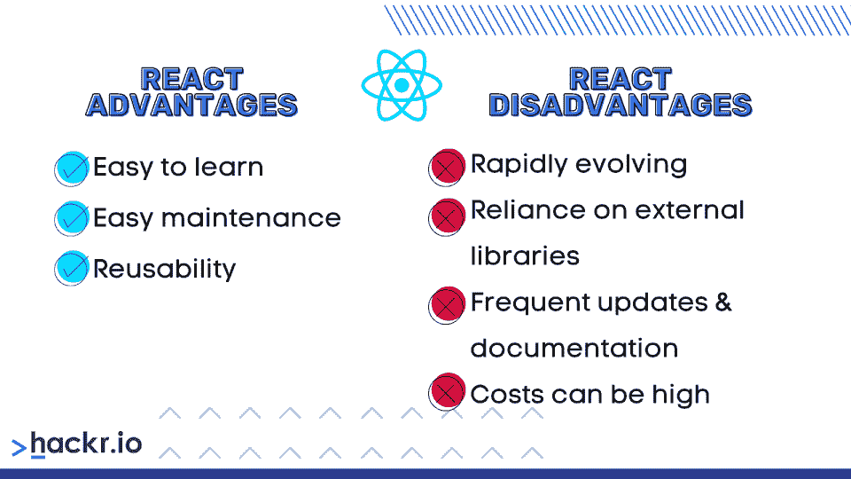
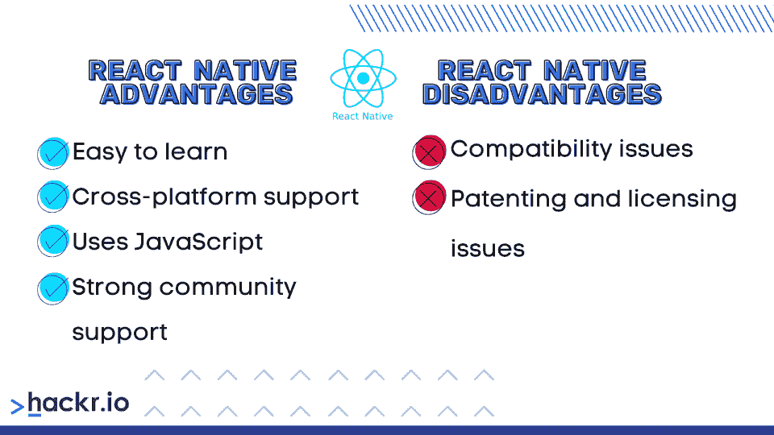

# React vs React Native:有什么区别？

> 原文：<https://hackr.io/blog/react-vs-react-native>

ReactJS 和 React Native 都是脸书本地人，为移动应用程序和 web 开发提供了无与伦比的能力。两者之间的差异归结于它们的功能和关键目的。

今天，React Native 和 ReactJS 之间的差异在全球流行的网站上显而易见。这两项强大的技术是许多流行网站和移动应用程序的基础。

检查 ReactJS 与 React Native 的对话是应用程序开发领域中常见的对话。然而，即使是经验丰富的开发人员也可能不清楚 React 与 React Native 之间的细微差别。

解释主要区别的简单方法是:React 更基于网络，而 React Native 有助于移动框架。

但是区别比这更深入——这就是我们在本指南中所涉及的。

## **React vs React Native:面对面比较**

| **反应堆** | **反应原生** |
| 当使用 ReactJS 时，开发人员和程序员可以开发一个高性能的用户界面(UI)作为他们自己的 JS 库 | 使用 React Native，无论 iOS 还是 Android，都需要构建完整的框架 |
| 提供更好的安全性 | 相对较差的安全性 |
| 提供更好和更多的动画 | 提供较少的动画功能。 |
| ReactJS 是 web DOM 的基础 | 将原生函数反应为导数本身 |
| 对于 ReactJS，代码是从 DOM 呈现的 | 而在 React Native 中，API 用于移动应用程序 |
| ReactJS 的基地有一个图书馆。这意味着您可以使用它来开发高性能的用户界面。 | React Native 是框架，没有语言库 |

## **React Native vs ReactJS 的历史**

在开发 React 或 React Native 之前，脸书遇到了几个问题。其中之一是用户不能同时查看新闻和聊天。

React(更好地称为 ReactJS)是第一个被概念化来解决这些问题的。ReactJS 是一个 JavaScript 库，它利用一种先进的方式来支持前端和服务器。简而言之，React Native 通过提供框架扩展了该功能。

ReactJS 最早出现在 2011 年左右，当时脸书的工程师注意到他们系统的频繁更新正在阻碍生产力。在此之前，脸书用户在时间线和聊天之间切换有困难。一位脸书的工程师，乔丹·沃克，利用 XHP 开发了名为 FaxJS 的原型，它很快成为 ReactJS。该应用程序是所有脸书需要有一个最直观的用户界面(ui)。

脸书后来收购的其他应用程序在编程中使用了 ReactJS，包括 Instagram，这是从仅仅依赖 HTML 的一个巨大飞跃。React Native 与 ReactJS 主题的迷人之处在于，虽然 ReactJS 提供了巨大的好处，但 React Native 往往更受青睐，因为它可以做更多的事情。

让我们深入了解一下本机堆栈之间的反应:

## **技术概述:React 与 React Native**

React 与 React Native 之间的技术概述取决于各自的关键组件。请记住，ReactJS 是一个 JavaScript 库，它支持前端创建交互式 ui，而 React Native 支持更广泛需求的功能。

### **什么是 ReactJS？**

正如我们已经强调的，ReactJS 使得开发人员创建交互式 ui 变得非常容易。通过简单地使用 ReactJS，您可以 100%确定您的用户将查看您的应用程序的每个状态。

ReactJS 是少数几个可以在数据发生变化时更新和呈现组件的工具之一，如果不是唯一一个的话。此外，ReactJS 为编码人员提供了一个声明性的视图，这意味着您可以轻松地使您的代码更加可预测和易于调试。

#### **特性**

*   速度:由于它的虚拟文档对象模型(DOM)特性，ReactJS 极大地提高了应用程序的性能。ReactJS 将首先开发一个内存中的数据缓存，用于配置差异，然后在 DOM 中更新这些差异。
*   ReactJS 允许你创建动态应用:如果你想用更少的代码行创建一个用户友好的 web 应用，react js 是一个不错的选择。
*   **JavaScript 语法特性:**当您想要描述应用程序的用户界面时，这个特性非常方便。
*   **单向绑定数据功能:**该功能有助于减少错误。例如，在进行小的更改时，不需要重新加工整个父组件。它提供了 ReactJS 实现之前所没有的代码稳定性，从而使维护变得更加容易。
*   **基于组件的框架:**也许 ReactJS 最令人兴奋的特性之一就是你可以把它分成多个组件。您可以使用它在整个应用程序中传递数据，而不会影响您的 DOM。
*   你仍然可以使用 HTML :好消息是 ReactJS 在允许你使用 HTML 的同时，还允许你访问库。
*   从一开始， **ReactJS 就一直是经验丰富的开发人员信赖的中心，他们通过额外的库和扩展来增强它。**
*   **效率** : ReactJS 给你一个所有变化的实时视图，让你花更少的时间编码。您可以对不同的组件使用相同的代码，这最终为开发人员节省了时间和金钱。
*   SEO 提升功能: ReactJS 支持 SEO 优化，允许更快地对网站进行索引。反过来，SEO 优化有助于网站的成功，内容在服务器级别被编入索引。对于企业主和网站开发者来说，这意味着更多的线索。
*   更快的加载时间: ReactJS 向你保证一件事:更低的用户跳出率。网页分析是一个至关重要的特性，当检查 React 与 React 本地差异时，它可能会影响开发人员。当一个网页需要更长的时间来加载时，用户会转向一个渲染速度更快的页面。ReactJS 在这方面有优势。

[React -完整指南(包括钩子、React 路由器、Redux)](https://click.linksynergy.com/deeplink?id=jU79Zysihs4&mid=39197&murl=https%3A%2F%2Fwww.udemy.com%2Fcourse%2Freact-the-complete-guide-incl-redux%2F)

[React Native -实用指南【2023】](https://click.linksynergy.com/deeplink?id=jU79Zysihs4&mid=39197&murl=https%3A%2F%2Fwww.udemy.com%2Fcourse%2Freact-native-the-practical-guide%2F)

### **什么是 React Native？**

React Native 是一个完全不同的开发框架。从技术上来说，这是一种开源模式，脸书推出这种模式是为了改善其移动应用程序或任何其他应用程序。

今天，React Native 提供了大量的特性和可重用组件。在其基础上，React Native 使用 ReactJS，但使用完全不同的库。通过 React Native，开发者可以将 ReactJS 的覆盖范围扩大到包括 Windows、 [Android](https://hackr.io/tutorials/learn-android) 和 [iOS](https://hackr.io/blog/best-way-to-learn-swift) 在内的平台。自 2015 年问世以来，全球已有超过 25000 款应用使用 React Native。

#### **特性:**

*   **React Native 可用于任何移动应用:**这意味着一个开发团队可以使用其 API 来提高性能或将其与任何移动应用集成。
*   出色的架构:它提供了一个灵活的架构，使得任何开发人员都可以轻松编写代码。
*   **灵活的 CocoaPods 支持:**这意味着你可以将其与你的 iOS 编码项目关联起来。
*   **兼容 JavaScript** : JavaScript 支持使得 React Native 成为最容易使用的之一。
*   **UI 聚焦**:如果你想要可定制性和交互性，React Native 是个不错的选择。
*   **React Native 为您节省时间和金钱** : React Native 降低了代码密度，支持跨平台开发。这样，您将节省时间，因为您的代码不需要为每个移动应用程序重新编写，这降低了维护成本。
*   **出色的支持:**众所周知，React 本地社区非常支持。

## **React 和 React Native 的区别**

React 与 React Native 的主要区别在于 ReactJS 可以在任何平台上使用，而 React Native 则不能。然而，还有更微妙的差异。

对于初学者来说**，**使用 ReactJS 时，开发者和程序员可以开发一个高性能的 UI 作为自己的 JS 库。而使用 React Native，你可以构建整个框架，不管是 iOS 还是 Android。

下面几节将介绍 React 和 React Native 之间的一些更具体的区别。

### **安全**

众所周知，ReactJS 提供了更好的安全性。鉴于 React Native 的移动性，其安全性可能会更差。

### **动画**

ReactJS 比 React Native 提供了更多更高级别的动画。它主要是通过用 ReactJS 实现 CSS 来完成的，而 React Native 依靠 API 来产生动画。

尽管如此，两者都在 web 开发和移动应用程序中使用，因为它们都很灵活，并且具有提供可重用组件的优势，这改进了功能。

### **移动应用与计算**

React Native 更适合移动应用和标准计算。另一方面，ReactJS 在更复杂的计算中表现得更好，可以用于更多的应用程序。

### **组件**

ReactJS 是 web DOM 的基础，而 React Native 函数本身就是一个衍生物。换句话说，组件是不同的。虽然流程可能看起来相似，但在功能上还是有一些不同。

### **图书馆**

ReactJS 也有很大的局限性，因为它只是一个基本的库。它提供了开发高性能用户界面的优势。另一方面，React Native 是框架而不仅仅是语言库。

### 代码是如何呈现的？

代码的呈现方式也是一个关键的区别。对于 ReactJS，您可以从 DOM 呈现代码，而对于 React Native，您可以在移动应用程序中使用 API。造型方法也不同。例如，可以将 CSS 与 ReactJS 配对，将样式表与 React Native 配对。

## **反应堆的优点**

### **简单易学**

学习 ReactJS 非常容易，这意味着新开发人员可以很快开始开发动态 web 应用程序。代码量也更少，同时不影响功能。

### **易于维护**

较少的代码行和模块化特性使得 ReactJS 易于维护。这可以让开发人员更加关注项目背后的实际逻辑，而不是调试。

### **可重用性**

ReactJS 使用可重用的组件，每个组件都有自己的逻辑和控件。您可以在不同的项目中使用它们，并极大地简化开发体验。

## **反应堆的缺点**

### **快速进化**

ReactJS 正在迅速发展，对许多人来说，这也可能是一个缺点。对于新手开发人员或寻求提高技能的程序员来说，在开发环境中更高的速度可能不是有益的。它意味着灵活地适应快速变化。

### **依赖外部库**

外部库允许开发人员扩展他们能使用什么和不能使用什么，但是 ReactJS 需要外部模块来完成应用程序。ReactJS 的本地库本身不能完成这项工作，因为它们主要关注 UI。此外，您必须彻底了解外部库，这可能是一个额外的负担，而且这些库也可能会被弃用，这需要进一步的学习。

### **频繁更新和记录**

虽然速度是 ReactJS 的一个显著优势，但它也可能在其他一些方面产生负面影响。由于开发速度的原因，创建关于 ReactJS 的更新或文档并不总是容易的，这迫使开发人员自己编写更新或文档。

### **成本可能很高**

ReactJS 的开销通常也高于 React Native 应用程序。这是因为开发人员有时可能需要下载额外的组件来使用特定的 UI，这增加了他们的总体项目时间和资源消耗。

## **React Native 的优势**

### **简单易学**

和 ReactJS 一样，React Native 也很好学。毕竟是建立在前者的基础上。因此，如果你付出了适度的努力来学习 React Native，它将会对你的开发技能起到真正的推动作用。

### **跨平台支持**

React Native 支持多个系统，这是一个真正的福音。您只需编写一次代码，就可以在各种平台上部署它。

### **使用 JavaScript**

React Native 使用的是 [JavaScript](https://hackr.io/blog/how-to-learn-javascript) ，这是一种非常流行且简单易学的语言。这降低了进入门槛，也意味着你在技能组合中增加了一门有价值的语言。

React Native 拥有强大的社区支持，所以如果你遇到了什么问题，你很可能会找到一个快速的解决方案。这会大大缩短您的开发时间，即使您找不到已经存在的解决方案，您也一定会找到答案。

## **React Native 的缺点**

### **兼容性问题**

开发人员经常会遇到兼容性问题，更糟糕的是无法调试。然而，熟悉 React Native 和这些问题的开发人员不太可能遇到这种情况，也不太可能浪费时间进行故障排除。

### **专利和许可问题**

在研究 React JS 和 React Native 之间的差异时，专利和许可问题也可能会出现。脸书仍然保持对 React Native 的完全控制，这些专利问题不会消失。与此同时，React Native 仍然作为开源许可证提供，但如果脸书有开发者问题，开发者会知道的。

## 应该选择 ReactJS 还是 React Native？

React Native 和 React 哪个好？通常，这个问题没有直接的答案。无论您选择什么样的框架，都必须具备您所从事项目的所有必要特性。

此外，最终的决定将完全取决于开发人员更喜欢什么，或者他们认为什么能够节省组织的时间和金钱。这两个因素对于决定两个解决方案中的哪一个是至关重要的。我们不能忽视这样一个事实，这两个框架都有独特的特性，并提供来自开发社区的强大支持。

将这两点作为指导方针:

*   ReactJS 是一个组件，而 React Native 函数是一个框架。 ReactJS 的功能是补充 React Native 并与其一起工作，这就是 React Native 被开发的原因。

*   ReactJS 提供了分离计算的高级功能，而 React Native 则为移动应用提供了整体的原生能力。尽管如此，两者都有其局限性和缺点。在选择最适合您的技术之前，请了解每种技术的不同优缺点。

**结论**

## 一些开发人员可能会回答 React Native vs React JS 的问题:“它们都可以很好地协同工作，那么你为什么一定要做出选择呢？”

虽然这两者可以很好地互补，但对于某些项目来说，每一个都是理想的。选择正确的框架至关重要，尤其是构建一个动态的、响应性强的 UI。

就前端开发而言，速度和易用性是开发人员用来决定使用正确工具的关键决定因素。如果这两点都满足了，下一个考虑就是改进 SEO，这应该是你的最终目标之一。这就是 ReactJS 派上用场的地方。同时，如果你正在寻找一个可靠的框架，React Native 就是其中之一。

**常见问题解答**

## **1。React 和 React Native 哪个好？**

#### 两者都不明显更好。选择 React 还是 React Native 将取决于您正在处理的具体问题。

**2。React 和 React Native 一样吗？**

#### 不，React 是组件，React Native 是框架。它们相辅相成。

**3。我应该学习 React 还是 React Native？**

#### 理想情况下，你应该两者都学。然而，你可能想先学习 React，因为很多 React Native 都是基于前者的。

**人也在读:**

**People are also reading:**