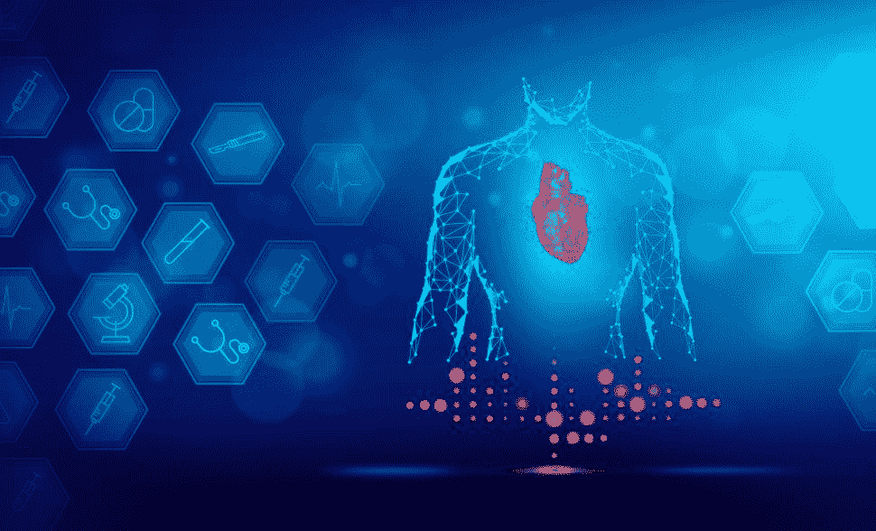
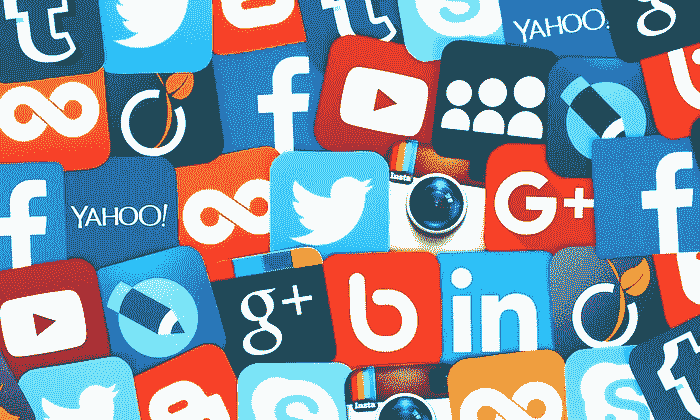
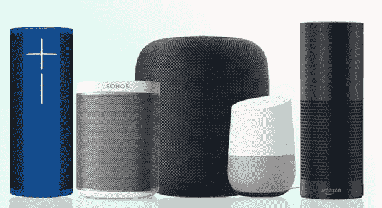

# 十大现实世界机器学习应用

> 原文：<https://hackr.io/blog/real-world-machine-learning-applications>

我们都知道，人工智能技术形式的机器学习正在我们的生活中继续普及。[机器学习(ML)](https://hackr.io/blog/what-is-machine-learning-definition-types) 是一种涉及一组算法的技术，这些算法允许软件系统在预测结果时变得更加准确和精确，而无需显式编程。换句话说，在 ML 中，算法接收输入数据，并使用统计分析来预测结果，从而赋予计算机像人类一样思考的能力。在我们的生活中，有很多日常场景涉及到 ML 的使用；也许我们没有注意到这一点。

现在让我们看看我们在现实生活中是如何遇到机器学习的。

## **真实世界** **机器学习** **应用**

### **1。保健和医疗诊断**

****

机器学习涉及各种工具和技术，有助于解决各种医学领域中的诊断和预后问题。疾病进展预测、提取医学知识用于结果研究、治疗和计划与支持以及整体患者管理是我们使用机器学习分析临床参数的一些示例。我们还将 ML 用于医疗记录的[数据分析](https://hackr.io/blog/what-is-data-analysis-methods-techniques-tools)，例如检测数据的规律性、处理不完整的数据、解释重症监护室产生的连续数据，以及智能报警，从而实现高效和有效的监控。

### **2。通勤预测**

****

*   ***预测交通*** **:** 我们都是边开车边用 [GPS 服务](https://gssc.esa.int/navipedia/index.php/GPS_Services)导航。在这种情况下，ML 帮助我们在日常生活中避开交通堵塞，准时到达目的地。编程 GPS 的工作原理是，当我们使用它导航时，它会将我们的位置和速度保存在管理交通的中央服务器中，然后用于构建当前交通的地图。因此，ML 做了一个拥堵分析，唯一的缺点是，如果较少数量的汽车在驾驶时使用 GPS，它有时似乎不准确。
*   ***在线交通应用:*** 我们都用过像优步、Ola、Lyft 这样的出租车预订应用；所有这些应用程序都在预订时预测旅行的价格和预计到达时间。ML 算法定义了这种应用背后的机制。

****

如今，我们大多数人都沉迷于社交媒体，为什么我们不会呢？社交媒体有趣且吸引人，从通过视频教你 DIY 和新东西到新闻和网络。ML 技术在开发用户友好的社交媒体网站和应用程序中起着至关重要的作用。

*   ***建议朋友:*** 像脸书这样的社交网站会记录我们联系的朋友、我们经常访问的个人资料、共享的群组、兴趣和工作场所。基于不断的学习，脸书建议我们可以成为朋友的人。
*   ***人脸识别*** **:** 像脸书和 Instagram 这样的社交网站和应用程序会在我们将照片上传到媒体的那一刻立即识别出我们的朋友，并开始发出通知给他们添加标签。虽然界面相当人性化，前端看起来也很舒服，但是后端整个流程相当复杂。

### **4。智能助理**

****

使用智能助手是我们全天候的工作。我们都在 Pixel 和 iPhone 等智能手机以及 Echo 和 Google Home 等智能音箱上使用过 Siri、谷歌助手、Alexa 和许多其他软件。除此之外，三星还准备推出一款智能电视，其虚拟助手名为 Bixby。作为“助手”，他们的工作是协助我们的日常工作，我们需要做的就是激活他们。

助手在我们日常生活中的重要用途包括设置闹钟和提醒，通过通知向用户更新实时新闻等活动。回答类似“日本的酒店价格是多少？”或者“我附近有意大利餐馆吗？”也是由这些智能助手处理的。这些助手可以查找信息，回忆相关的查询，或者向其他资源(在网络上)发送命令来收集信息和回答用户的问题。

[完全机器学习&数据科学训练营 2023](https://click.linksynergy.com/deeplink?id=jU79Zysihs4&mid=39197&murl=https%3A%2F%2Fwww.udemy.com%2Fcourse%2Fcomplete-machine-learning-and-data-science-zero-to-mastery%2F)

### **5。优化搜索引擎结果**

****

像谷歌这样的搜索引擎利用机器学习算法来改善搜索结果。算法跟踪我们对展示给我们的结果的反应。例如，如果生成的结果对用户有效且有用，则用户会在网页上停留很长时间，这将有助于搜索引擎了解生成的结果与查询一致。相反，如果结果是无用的，并且用户移动到搜索结果的第 4 或第 5 页，而没有打开中间的任何网页，则搜索算法会注意到结果是无效的，并且没有达到目的。

### **6。视频监控和安全**

****

由一个人或者甚至一个小型安全团队来跟踪数百个监控摄像机是乏味且令人讨厌的。曼梯·里训练监视摄像机，通过在犯罪发生前发现犯罪来使这项任务变得容易。这些摄像机被设计成可以密切监视公众，并注意到任何可疑的活动，例如，如果有人长时间站着不动，或者有人经常去某个地方查看。如果智能摄像机预测到任何不幸，就会通知服务员，从而挽救了许多人的生命。

### **7。网络安全**

****

机器学习为防止在线货币欺诈提供了潜在的洞察力，从而使网络空间成为交易和网上银行的安全场所。像 PayPal，GPay，Paytm 这样的应用程序都有一套工具，可以帮助他们跟踪交易，区分合法和非法交易，从而防止任何虚假交易。

### **8。客服**

****

当你访问某些网站时，你见过弹出的聊天框吗？这很有可能是一个 ML 编程的聊天机器人。他们扮演客户服务代表的角色，帮助用户解决问题。这些机器人被编程为通过从网站的数据存储中提取信息来回答用户。

ML 算法通过理解用户查询并为他们提供正确的答案，增强了机器人与时俱进的能力。

### **9。垃圾邮件**

****

目前，电子邮件客户端和其他应用程序使用几种垃圾邮件过滤方法。为了确保安全性和这些垃圾邮件过滤器不断更新，它们由 ML 算法驱动。通过观察特定模式和基于规则的垃圾邮件过滤，可以轻松检测垃圾邮件制造者的最新伎俩。一些垃圾邮件过滤技术的例子是感知器和 C 4.5 决策树。

### 10。产品推荐

****

毫无疑问，在过去的几年里，网上购物已经占领了零售市场。网上购物提供了一个很好的体验，给定的产品有多种选择，有竞争力的折扣，还有送货上门的便利。现在，您可能已经注意到，如果用户从网站或应用程序搜索或购买产品，类似或相同的产品会在用户下次访问该应用程序时推荐给用户。产品推荐是基于网站或应用程序的行为、过去的购买、喜欢的商品或愿望清单，以及最终购买的商品。这种精致的购物体验是因为 ML 运行在应用程序或网站的后端。

## **你在日常生活中的哪些地方使用机器学习？**

除了上述应用之外，还有大量的其他部门和领域采用了 ML 技术。请在下面的评论中分享[机器学习](https://hackr.io/tutorials/learn-machine-learning-ml?ref=blog-post)如何改变你的生活，让你的生活更加舒适。

**人也在读:**