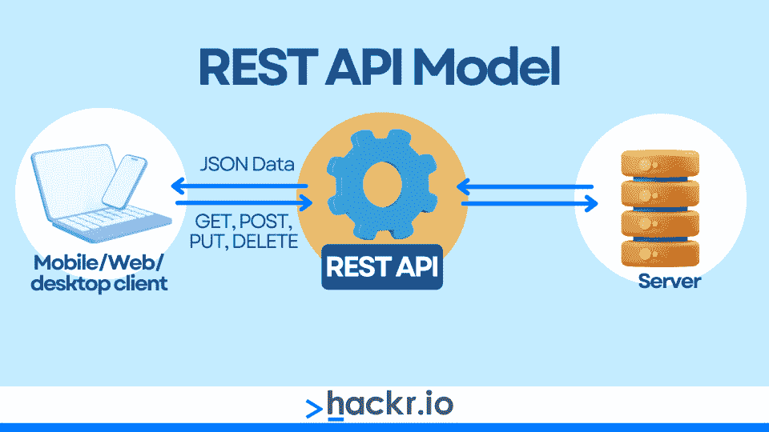
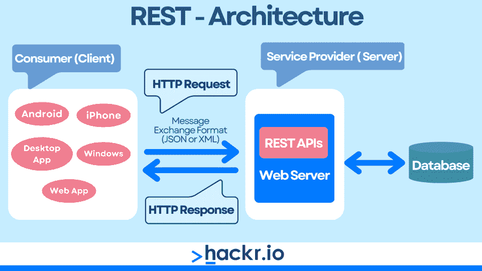
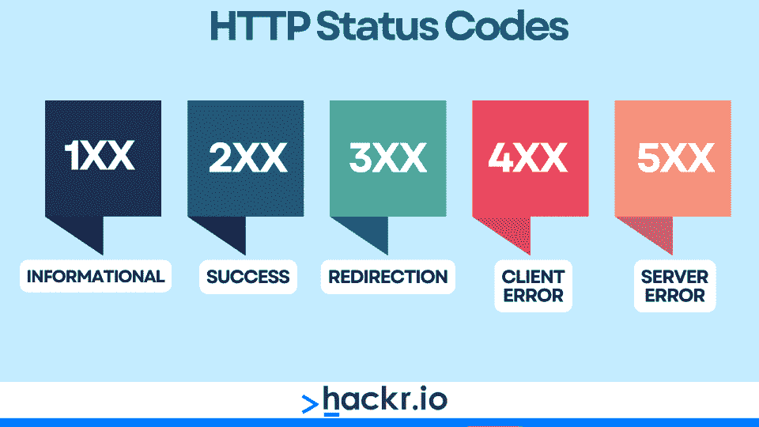
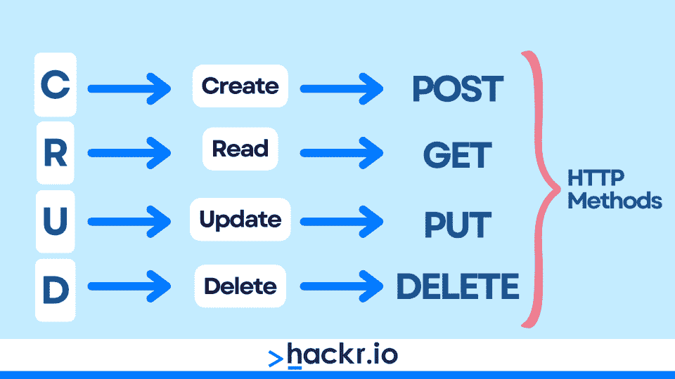
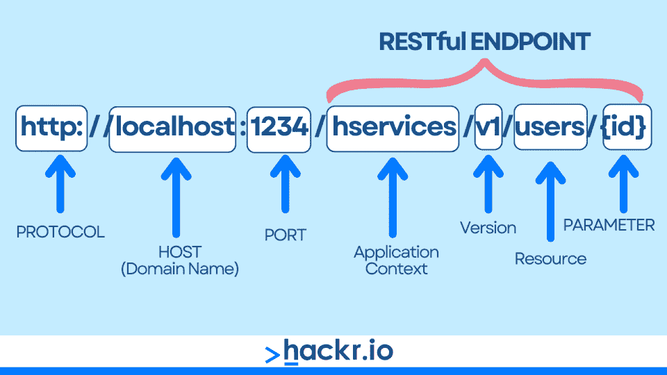

# REST API 面试问答[2023]

> 原文：<https://hackr.io/blog/rest-api-interview-questions>

现代技术面临的主要挑战之一是需要数量不断增加的软件应用程序和服务进行交互。解决方案是实现某种形式的标准化，这通常涉及到 REST API。

因此，毫不奇怪，大多数科技公司都希望他们的软件工程师在面试过程中具备基于网络的应用编程接口的工作知识。而且通常情况下，这将倾向于 REST API 问题，包括 RESTful web 服务面试问题。

因此，无论你是想获得软件工程师的第一份工作，还是想在新公司担任新角色的有经验的后端工程师，你都需要在回答这些 REST 面试问题时展示你的 REST 技能和知识。

本文涵盖了 20 个最流行的 REST API 面试问题和答案，从初级到高级不等。

**[在这里下载我们的 REST API 面试问答 PDF。](https://drive.google.com/file/d/10PjqQbO3NduJ4lUItxzL8QJ_TggqusJW/view?usp=sharing)**

## **REST API 面向初学者的面试问题**

### **1。什么是 REST API？**

REST 或表述性状态转移是一种 web 服务架构，它使用 HTTP 请求(包括 GET、PUT、POST 和 DELETE)来发送和访问来自不同来源的数据。

REST APIs 允许前端和后端应用程序通过 HTTP 请求和 API 端点相互交互，这通常类似于标准的 URL。

您可以使用大多数现代编程语言来创建 REST APIs，这些 API 通常使用 JSON 或 XML 数据格式发送/接收数据。



注意，这可能是 REST API 上最明显的面试问题之一，所以一定要准备好！

### **2。什么是 RESTful Web 服务？**

RESTful web 服务是通过遵循 REST 架构设计模式创建的，这意味着它们是使用 HTTP 协议及其各种方法实现的。

通常，RESTful web 服务是可维护的、可伸缩的，并且允许各种其他应用程序之间的通信，而不管用于制作应用程序的基础编程语言是什么。



附带说明，这是另一个非常明显的 REST web 服务面试问题，所以请确保您已经回答了这个问题！

### **3。什么是 REST API 资源？**

任何可以用 REST API 访问的内容都是资源。这些资源就像面向对象编程中的对象，这意味着它们具有类型、方法、数据属性以及与其他 API 资源的逻辑关系。

通常，我们认为 API 资源是某种类型的数据，无论是文本、多媒体(图像/视频)、源文件等。REST 客户端可以使用 HTTP 请求访问资源，以与资源的 URI(统一资源标识符)进行交互。

### **4。什么是 URI？**

URIs 或统一资源标识符在 REST APIs 中用来*标识*API 服务器上的 API 资源。每个 API 资源都有其唯一的 URI，这是一个传递给 HTTP 请求的字符串，用于访问或修改 API 服务器上的资源。

**典型 URI 格式:**

```
<protocol>://<service-name>/<ResourceType>/<ResourceID>​
```

**举例 URI:**

```
https://api.test.com/resource-type/resource-id​
```

### **5。列出并总结常见的 HTTP 响应代码**

HTTP 响应代码可以通过第一个数字快速分析出来。

*   **1XX** -信息响应
*   **2XX** -成功响应
*   **3XX** -重定向
*   **4XX** -客户端错误
*   **5XX** -服务器错误

一些更常见的 HTTP 响应有:

*   **200(正常):**请求成功
*   **201(已创建):**请求成功&资源创建
*   **400(错误请求):**由于用户错误(打字错误或数据丢失)，请求不成功
*   **401(未授权):**请求不成功，客户端未认证/授权
*   **403(禁止):**请求不成功；客户端已通过身份验证，但未授权
*   **404(未找到):**请求不成功；服务器找不到资源
*   **500(内部服务器错误):**由于意外的服务器错误，请求失败
*   **502(错误网关):**由于服务器响应无效，请求失败
*   **503(服务不可用):**服务器正在维护/不可用，无法处理请求



注意，这是 REST web 服务面试问题和答案之一，如果您打算使用或设计 REST APIs，您应该立即知道答案。

### **6。如何使用 REST API？**

例如，如果您想从电子商务数据库中检索客户订单信息，您需要指定 API 端点，一个用于检索数据的特定 URL。

接下来，您将通过为 API 的资源访问逻辑指定必要的 JSON 参数值来定义想要检索的数据。该信息将通过 HTTP 请求的头(或者有效负载，如果您想使用 API 删除或修改数据的话)来传递。

然后，对于本例，您将向 API 端点提交一个 HTTP 请求，可能是一个 GET。然后，API 将在 JSON 有效负载中返回请求的数据，您可以在本地机器上处理这些数据。

### 7 .**。REST API 是如何无状态的？**

无状态意味着 REST API 服务器不存储任何关于以前客户端通信的信息。结果，服务器和客户机没有关于彼此的状态的信息，这使得服务器可以释放存储空间，否则就需要为每个请求维护记录。

因此，对 REST API 的每个请求都被视为一个全新的交互，这意味着在每种情况下，客户端都需要提供所有必要的信息来成功完成 API 请求。

### **8。如何解决 REST API 资源请求问题？**

1.  **初始调试:**检查服务器日志中的错误细节，包括访问了哪个端点 URL 以及请求中发送了哪种数据类型
2.  **检查标题:**验证所需的标题和查询参数是否发送正确，格式是否正确
3.  **端点测试:**使用不同的客户端或浏览器检查端点 URL，以发现响应问题的任何模式
4.  **工具:**使用 *curl* 、 *Postman* 或其他[工具](https://hackr.io/blog/best-api-testing-tools)发送样本请求并验证响应是否如预期，包括状态代码和输出格式

### **9。如何保护 REST API 免受垃圾软件或僵尸工具的攻击？**

速率限制可以防止用户在特定时间间隔内超过 REST API 请求的预定义阈值。这将通过短时间限制用户 API 访问来防止 API 服务器过载或崩溃。

这种限制通常与用户的 IP 联系在一起，保护 API 服务器免受垃圾邮件机器人或其他恶意攻击。根据用户的技术熟练程度，他们可以通过检查 HTTP 响应代码和 API 返回的任何 JSON 数据来确认自己受到了速率限制。

### 10。总结 REST APIs 可用的主要 HTTP 方法

1.  **GET** :通过指定一个端点 URL 从 API 检索数据，不需要用户发送消息体
2.  **POST** :发送新数据供 API 处理，通常创建一个新资源，API 返回给用户。需要邮件正文来提交数据
3.  **PUT** :类似 POST，但用于更新或修改现有资源
4.  **补丁:**修改服务器上资源的指令(不同于 PUT，因为它不发送修改后的版本，而只是修改指令)
5.  **删除**:从 API 服务器中删除现有资源

REST API 还使用了另外两种 HTTP 方法，但这两种方法不太常见。

1.  **选项:**检索可用于 REST API 资源的受支持方法的列表
2.  **HEAD:** 类似 GET，但是检索关于 API 资源的元数据

### **11。REST&SOAP API 有什么区别？**

*   SOAP 是一种用于构建安全 API 的协议，而 REST 是一种具有一套指导原则的架构设计模式
*   SOAP 使用资源逻辑的服务接口，而 REST 使用 URIs(统一资源指示器)
*   SOAP 客户端就像软件应用程序，而 REST 客户端更像基于浏览器的 web 应用程序
*   REST APIs 通常比 SOAP APIs 构建起来更简单，速度也更快。
*   SOAP APIs 可能被认为更安全，因为 REST 依赖于它所使用的协议(例如 HTTP)的安全性
*   REST 允许缓存响应，但是 SOAP 不允许
*   SOAP 使用 XML 来编码数据，但是 REST 允许您使用 JSON、XML、MIME、文本等等

请注意，这可能是最受欢迎的 REST 服务面试问题之一，所以如果您花一些时间刷新这个话题，将会有所收获。

### **12。REST API 上下文中的 CRUD 是什么？**

CRUD 是一个众所周知的缩写词，用来表示*创建*，*读取*，*更新*，以及*删除*。这些不同的操作通常与数据库相关联。在 REST API 的上下文中，我们可以通过 HTTP 请求在数据库上执行每种操作类型。



*   **创建:**需要 *HTTP POST* 方法
*   **Read:** 需要 *HTTP GET* 方法
*   **更新:**需要 *HTTP PUT* 方法
*   **删除:**需要 *HTTP DELETE* 方法

### 13。总结 HTTP 请求的主要部分

*   **请求方法:**获取、发布、上传或删除
*   **URI:** 识别 API 服务器上的资源
*   **HTTP 版本:**让 API 知道用哪个版本来响应(即 HTTP v1.1)
*   **请求头:**元数据，包括用户代理、接受文件格式、请求体格式、语言、缓存等
*   **请求体:**发送到 API 服务器的消息内容，通常通过 POST 或 PUT 与修改操作一起使用

### **14。总结 REST & AJAX** 的区别

| **休息:表象状态转移** | AJAX:异步 JavaScript 和 XML |
| 访问资源(数据)的 HTTP 请求和 URIs | XMLHttpRequest 对象请求服务器数据，用 JavaScript 动态解释 |
| API 的架构设计模式 | 动态网页内容 |
| 客户端和服务器需要交互 | 异步服务器交互 |

## **高级 RESTful API 问题**

### 15。如何使用 Curl 来测试 REST API 端点？

*curl* 命令行工具允许您从终端发送 HTTP 请求，这有助于从 API 端点检查正确的响应格式和正确的状态代码。

当使用 *curl* 测试 API 端点时，各种可选参数会有所帮助。

*   **curl -H :** 改变*内容类型*或*接受*标题

*   返回详细的输出

*   **curl -I :** 获取 HTTP 头(包括响应代码)

*   **curl -L :** 跟随重定向到最终目的地

使用下面的语法，我们可以使用 *curl* 测试 REST API 端点。在这个例子中，我们使用了上面显示的每个可选参数来返回尽可能多的细节。我们还指定了 JSON 格式的 Accept 头。

**通用语法:**

```
curl [OPTIONS] [ENDPOINT_URL]​
```

**测试 API 端点:**

```
curl -H "Accept: application/json" -v -I -L http://www.api.test.com
```

### 16。可以将 TLS(传输层安全性)与 REST API 一起使用吗？

是的，TLS 可以用来加密客户端和 REST API 服务器之间的通信，提供了一种安全的访问 API 资源的方式。

为了从 TLS 加密和安全性中获益，必须使用 HTTPS 而不是标准的 HTTP 发出请求。这很重要，因为 REST API 承担了它用于通信的协议的安全属性。

### **17。REST API 上下文中的缓存是什么？**

REST APIs 可以使用缓存将服务器响应临时存储在一个内存位置，允许将来更快地获取这些响应，这通过减少频繁活动和请求的服务器工作负载来提高服务器性能。

请注意，缓存与服务器活动和存储有关服务器请求的信息有关，这意味着它不包括特定于客户端的交互细节。因此，REST APIs 可以实现缓存，并且仍然保持无状态。

### 18。如何保护 REST API？

一般来说，REST APIs 不如 SOAP APIs 安全，这意味着它们不太适合共享敏感信息。尽管如此，您可以利用各种安全功能来确保相对较高的安全性。

*   **URIs 中的非敏感信息:**用户名、口令或认证令牌不应在资源 URI 中可见
*   **加密:**客户端-服务器连接的 TLS 或 SSL 可防止请求被拦截
*   **速率限制:**请求阈值和节流防止 DDoS 或其他暴力攻击
*   **认证&授权:**认证验证客户端身份，授权确认客户端访问资源的权限
*   **验证:**在提供对资源的 API 访问之前，扫描“恶意”代码请求，如 SQL 注入攻击

### **19。总结创建 URIs 的最佳实践**

*   明确的复数名词
*   **连字符**用于分隔长资源名称的单词(无空格或下划线)
*   **小写**字符，无特殊字符
*   **通过 HTTP 300 代码保持向后兼容性**
*   **避免文件扩展名**(。doc，。txt，。png 等。)
*   **修正 HTTP 方法** (GET、PUT、DELETE 等。)
*   **在 URIs 不要使用 HTTP 方法名**，即不要使用…/get-resource
*   **正斜杠**定义资源层次



### 20。什么是幂等方法？

无论请求的频率如何，幂等方法都返回相同的结果。这对于防止重复的客户端请求被 REST API 处理特别有用，无论是有意为之还是因为客户端代码中的意外错误。

关于 REST APIs 使用的 HTTP 方法， *GET* ， *PUT* ， *DELETE* ， *HEAD* ， *OPTIONS* 是幂等的，而 POST 不是，因为它是用来创建新资源的，这不能每次都产生相同的输出。

你可能会认为 *PUT* 和 *POST* 有着相同的特征；然而，如果一个客户机在多个场合用相同的参数更新一个资源，那么在每个实例中输出将是相同的，这意味着 *PUT* 是等幂的。

请注意，这是一个会给任何招聘经理留下深刻印象的 RESTful 面试问题，所以不要跳过它！

## **API 设计面试问题的额外提示**

1.  **选择最佳框架:**了解各种可用于构建 REST API 的 [web 开发框架](https://hackr.io/blog/web-development-frameworks)，如 Django、Flask、Express.js 等
2.  **优先考虑效率&性能:**了解延迟、带宽、缓存、数据序列化等。，影响效率和性能
3.  **强调简单性&灵活性:**使用标准化的 HTTP 方法访问资源，标准化的数据格式如 JSON，提供清晰的文档供开发者使用
4.  **采用最佳实践:**熟悉 JSON 响应、HTTP 状态代码、URI 命名约定、缓存策略等的通用设计模式

## **结论**

REST APIs 通常是允许各种软件应用程序高效、可靠和安全地通信的解决方案。

因此，软件工程师应该掌握 REST APIs、RESTful web 服务以及 JSON 数据格式、HTTP 方法/响应代码等相关主题的工作知识。

无论你是在申请你的第一份软件工程工作，还是在寻找一个需要 REST API 知识的新角色，你都需要温习你的 REST API 技能；这样，您就可以准备好处理常见的 RESTful 服务面试问题。

本文涵盖了 20 个最常见的 REST API 面试问题，主题从初学者到高级 REST 面试问题以及针对有经验工程师的答案。

如果你花一些时间研究这些宁静的面试问题和答案，你应该准备好面对他们抛给你的任何东西！

**[在这里下载我们的 REST API 面试问答 PDF。](https://drive.google.com/file/d/10PjqQbO3NduJ4lUItxzL8QJ_TggqusJW/view?usp=sharing)**

**想成为一名 REST API 开发人员，但不确定从哪里开始？**

**我们推荐这门 Udemy 课程:**

**[用 Flask 和 Python 休息 API](https://click.linksynergy.com/deeplink?id=jU79Zysihs4&mid=39197&murl=https%3A%2F%2Fwww.udemy.com%2Fcourse%2Frest-api-flask-and-python%2F)**

## **常见问题解答**

### **1。什么是 REST API 面试问题？**

REST API 面试问题通常集中在 HTTP 方法、如何对 REST API 进行故障排除、REST 和 SOAP APIs 的区别、REST 和 AJAX 的区别、URI 命名的最佳实践、如何使用缓存等主题上。看看上面的 20 个问题和答案。

### **2。最常见的四种 REST API 操作是什么？**

四个最常见的 REST API 操作是 *GET* 、 *POST* 、 *PUT* 和 *DELETE* 。这些对应于读取数据(GET)、创建新资源(POST)、更新现有资源(PUT)以及移除或删除资源(DELETE)的标准 HTTP 方法。

### **3。REST API 是用来做什么的？**

REST APIs 通常用于构建 web 应用程序和服务，允许用户通过一组标准化的 HTTP 请求来访问和修改数据。