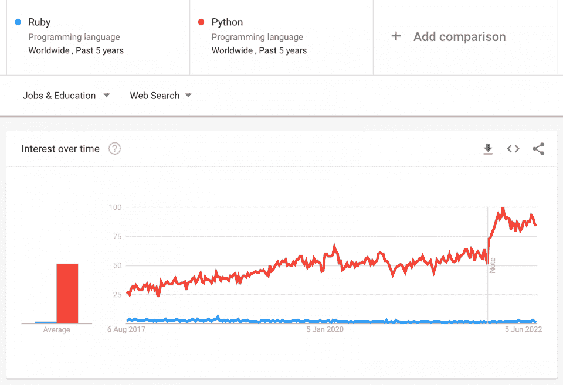
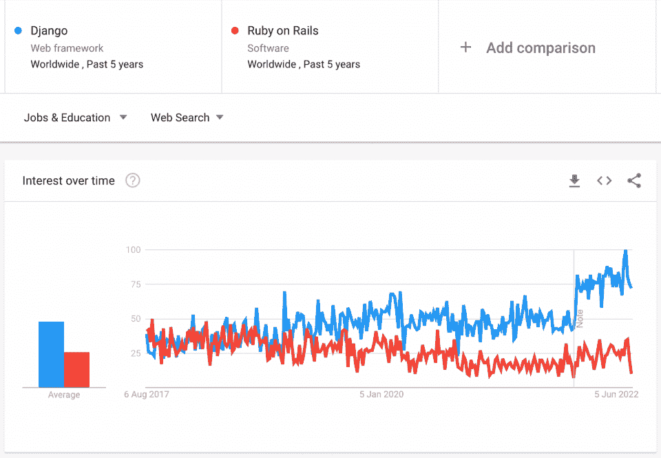

# Ruby vs Python:你应该知道的区别【更新】2023

> 原文：<https://hackr.io/blog/ruby-vs-python>

Ruby 和 Python 之间，哪个是更好的编程语言？

在过去的几年里，编程世界发生了指数级的变化。随着对一切数字化的需求不断增长，了解哪种编程语言非常适合哪种需求是至关重要的。几十年前，Java 和。NET 是两种最流行的语言。不用说，时代变了！

在当今时代，用更舒适、更友好的语言来更新自己是很重要的，比如 Python 和 Ruby 等等。在本文中，我们将讨论 Ruby、Python 以及它们各自的框架，以便更好地理解它们。然后，我们将看到 Ruby 与 Python 的较量，看看哪种编程语言胜出。

让我们开始吧！

## 【Ruby 和 Python 的主要区别

当谈到 Python 和 Ruby 之间的区别时，有几个关键点你可能要考虑。

*   Ruby 支持单一继承，而 Python 支持多重继承
*   Ruby 更倾向于用于函数式编程和 web 开发(感谢 Rails)，而 Python 是一种更面向人工智能、学术、数据科学、机器学习和其他科学编程的语言
*   Python 只支持单行 lambda 函数。Ruby 允许更大的 lambda 函数
*   Python 有函数，但 Ruby 有方法
*   下一点有点主观——Python 的语言更简单、更明确，使得 Python 代码读起来更优雅。Ruby 可能更难调试

## **什么是红宝石？**

Ruby 是创建 web 应用程序最常见、最流行的通用语言之一。Rails 或 Ruby on Rails 是一个优雅而健壮的框架，它构建在 MVC 架构之上，拥有大量的库和内置函数，因此您不必从头开始开发任何东西，可以专注于特定的业务需求。Rails 旗下有一些大牌——Shopify、Airbnb、GitHub 都是用 Ruby on Rails 构建的。

用 Ruby 编写代码就像和另一个人交谈一样——富有表现力且易于理解。Ruby 中没有原始类型——一切都是关于对象的！一个简单的 Hello World 程序只有一行，

把“你好，世界！”；

Ruby 注释以' # '开头，就像 Python 中一样。

Ruby 的语法与 C 或 Perl 等语言非常相似。

一些流行的 Ruby 编辑器有 RubyWin、Ruby 开发环境(RDE)和 Vi。

大多数想要强大的数字存在的创业公司和公司更喜欢 Ruby，因为用 Ruby 可以快速构建可扩展的、健壮的 web 应用程序。Ruby 社区也是基于 web 的。

Ruby 支持匿名函数，比如 lambdas、blocks、procs。此外，lambda 函数更加突出，不像 Python(稍后我们将看到 lambda 函数的一个小示例)。

在这里用 Ruby 学习编码。

### **Ruby 的利与弊**

| **优点** | **缺点** |
| 像 Python 一样，Ruby 非常容易学习 | Ruby 的语法比 Python 的稍微复杂一些 |
| Ruby 和 Rails 允许用户高效快速地开发 web 应用程序——比其他框架快得多 | 因为语法可能会更加复杂，所以调试 Ruby 代码会更加困难 |
| Ruby 自带了大量开箱即用的优秀特性，非常适合 web 开发 | 除了 web 开发，这种语言和框架没有太多的其他用例 |
| 像 Python 一样，Ruby 也有一个发展良好的社区，这使得你在遇到任何问题时更容易找到支持 | 找到图书馆和宝石会更加困难 |
| 有许多有用的工具供开发人员在项目中使用 | Ruby 的受欢迎程度正面临持续下滑 |
| Ruby 和 Rails 一起被认为是非常安全的，并且具有针对 CSRF、XSS 和 SQL 注入的内置保护，这些是 web 应用程序经历的一些最常见的攻击

*   **Python 是什么？**

 |

## Python 是最流行的语言，流行也来自于它是数据科学家的首选语言。它有一套广泛的[统计库，可用于数据科学](https://hackr.io/blog/top-data-science-python-libraries)，这是当今最受欢迎的职业。这也使得它成为学习统计和数据建模的学生中的流行语言。

Python 很容易学，如果你是新手，Python 是开始你编程之旅的好方法。你写的程序就像写简单的英语一样简单明了。

Python 是开源的。你可以下载 [PyCharm](https://hackr.io/blog/best-python-ide#2-pycharm) 并且只要你想就开始学习 Python！就像 Ruby 一样，一个简单的“Hello World”只有一行代码

print("Hello World！")

注意在 Ruby 中使用了 print 而不是 puts，并且没有分号来结束一行。

在 Python 中，空格很重要，表示代码块。举个例子，

```
if x > 7: print (“Success”) print (“Get the next value of x”)
```

| 

```
if x > 7: print (“Success”) print (“Get the next value of x”)
```

 | 注意，右边的代码会给出语法错误，因为没有其他空格。必须至少有一个区域来指示代码块，否则 Python 会给出一个错误。在其他语言中，花括号表示代码块“{}” |

Python 也有四种类型的集合——列表、元组、集合和字典。列表和元组也支持负索引。

Python 只支持 Lambda，这是一个匿名函数，可以计算任意数量参数的单个表达式。举个例子，

l =λa，b，c: a * b * c

然后我们可以在任何地方使用 l 作为 l(13，23，46)。

许多框架都支持 Python ，其中最流行的两个是 Django 和 Flask，它们使开发人员能够构建健壮的 web 应用程序。然而，Python 的力量不仅仅在于 web 应用程序——有像 Pandas 这样的库来帮助数据准备和管理，有数学库和统计库来帮助数据解释，有 TensorFlow 来完成机器学习任务，还有 Matplotlib 来实现数据可视化——数据科学所需的一切都在那里！

推荐 Python 课程

[用 Python 完成从零到英雄的 Python boot camp](https://click.linksynergy.com/deeplink?id=jU79Zysihs4&mid=39197&murl=https%3A%2F%2Fwww.udemy.com%2Fcourse%2Fcomplete-python-bootcamp%2F)

**Python 的利与弊**

**优点**

### **缺点**

| Python 的语法简单而优雅，所以你写的程序可以更容易阅读。它的语法比其他语言(如 C、C++和 Java)更简单，因此对初学者更友好 |  |
| 开发人员有时会遇到复杂设计的问题，所以公司通常会雇佣有经验的 Python 开发人员而不是新的开发人员 | 由于其庞大的标准库，支持编程中的许多常见任务 |
| Python 默认不是 100%安全的，你需要采取措施来解决这个问题 | 支持多种操作系统 |
| 如果您想开始用 Python 编程，首先需要设置您的工作环境。初学者或不太懂技术的人可能会遇到这方面的问题，所以最好先尝试使用集成开发环境 | 有许多开发人员可以使用的便利工具 |
| Python 使用大量内存，并且存在垃圾收集问题，因此开发人员在处理项目时需要小心这一点 | 由于语法更简单，代码更容易调试和维护 |
| 作为一种动态语言，Python 在运行时可能会显示更多的错误 | Python 有一个很大的社区，所以如果你遇到任何问题，很容易找到支持 |
| Python 是可嵌入的，这允许你在其他语言中使用它，比如 C++ |
| Python 具有极强的可伸缩性 |
| 如果你想进入人工智能和机器学习领域，Python 是最好的学习语言之一

*   【Ruby 和 Python 有什么相似之处？

 |
| Ruby 和 Python 类似吗？在某些方面，的确如此。这两种编程语言之间有一些相似之处。这些相似之处可能会把水搅浑一点，让回答“我应该先学习 Ruby 还是 Python？”这个问题变得困难

*   这两种语言到底有什么相同之处？Ruby 和 Python 的一些标准特性是:

 |

## Python 和 Ruby 都是跨平台语言，在 FSF 和 OSI 许可下都可以使用。

两者都是高级语言，不需要编译(解释语言)

两者都是动态类型语言；其中变量可以在开始时不声明就使用(不像 Java 或 C，变量只有在声明后才能使用，否则编译器会崩溃)

*   两者都遵循 OOP 的原则([面向对象编程](https://hackr.io/blog/oops-concepts-in-java-with-examples))
*   Ruby 和 Python 提供了标准库、交互式 shell 和持久性支持，并支持多种平台，包括 Unix、Linux、Windows 等等
*   在 Ruby-Python 的比较中，你会发现两者都是用于 web 开发的优秀语言。当您使用每种语言的 web 框架时，这一事实尤其真实。Rails (Ruby)和 Django (Python)是为 web 开发而构建的框架
*   **代码级差异**
*   **红宝石**
*   **Python**

## 没有原始数据类型。一切都是物体。

|  | 既有基本类型又有对象 |
| 

*   因为支持多重继承，所以可以使用混合。

 | 

*   不能使用 mixin，因为 Python 不支持多重继承

 |
| 

*   如果条件为 elsif，则为 else 的语法

 | else if 写成 elif |
| 支持 switch/case 语句

*   不支持开关盒

 | 

*   支持“Rinda”形式的元组，分布式 Ruby 库 d Ruby 提供了这种元组。其他集合有数组、哈希、集合和结构。

 |
| 

*   支持元组、集、列表和字典(哈希)。

 | 

*   Ruby 功能不多；它只有必须包装在过程中才能传递的方法。

 |
| 

*   Python 使用了很多函数

 | 

*   导入是通用的，开发人员不知道导入的哪一部分支持确切的功能。

 |
| 

*   Python 要求开发人员从库中导入特定的功能

 | 

*   迭代器的使用并不常见，它们并不扮演重要的角色

 |
| 

*   Python 的迭代器与我们在 Java 中使用迭代器的方式相同，是这门语言的基本要素

 | 

*   不可能修改内置类

 |
| 

*   内置类是可修改的

 | 

*   闭包可以使用块来定义，并且从外部作用域对变量有完全的读写权限。

 |
| 

*   嵌套函数是可能的；然而，特勤局只能读取外部函数的变量，但不能更改这些函数的值。

 | **参加 Python 课程！**
[](https://click.linksynergy.com/deeplink?id=jU79Zysihs4&mid=39197&murl=https://www.udemy.com/topic/python/)

*   **Ruby vs Python:势均力敌的比较**

 |
| 除了代码上的差异，在用法、目的、整体理念和其他方面还有一些差异，我们将在下表中重点介绍这些差异——

*   **红宝石**

 | **Python**

*   **用于网络开发**

 |

一种通用语言，非常适合快速高效地构建 web 应用程序。

## 它非常适合构建 web 应用程序，但是没有 Ruby 那么快。

**库和用例**

| 有一组有限的库，主要致力于开发可伸缩和高流量的 web 应用程序。 | 拥有丰富的库，不仅可供 web 开发人员使用，也可供数学家、学生和其他人用来解决统计问题和进行数据分析 |
| **首选用途** | 如果你的重点是数字营销和建立可以有效编码和维护的网站，Ruby 是最好的选择 | Python 是数据科学家使用的首选语言，因为它包含特定的库来操作、解释和可视化数据。 |
| **语法和语言** | 更具表达性、可读性(即使没有编程经验的人也能理解)和灵活性 | 易于学习和编码，更稳定的版本，更少的更新和高效。 |
| **灵活性** | 更加灵活，因为您总能找到多种方法来完成任何任务 | 只有一个显而易见的方法来做一项特定的工作，因此更严格。 |
| **范围** | 对于特定的领域，Ruby 是一个很好的选择——特别是对于函数式编程和 web 开发 | Python 的范围更广，是目前最顶尖的编程语言之一，主要是因为它对数据科学更有用。 |
| **代码可重用性** | 代码可以重用，并且自动依赖关系解析是可能的。然而，这个过程有点麻烦，也不是很直接 | 以模块的形式提供可重复使用的代码，随时可以使用，也可以按类别过滤它们，选择最合适的一个 |
| **学习曲线** | 虽然 Ruby on Rails 框架有很多内置特性，您可以毫不费力地使用，但是习惯这种语言需要时间。 | 学起来更快，尤其是如果你是初学者。根据您的需求，选择一个有用的框架可能是一项令人兴奋的任务 |
| **社区基础** | Rails 社区年轻而充满活力，拥有适当的文档，解决了集中在 web 上的问题。 | Python 社区非常庞大，有大量关于 Python 和 Django 的文档、论坛和会议。 |
| **开发环境** | 仅 Eclipse IDE | 多种 ide 可用 |
| **面向对象语言** | 完全面向对象 | 不完全面向对象 |
| **目前由**使用 | GitHub，苹果，Hulu，Twitter，ZenDesk | 谷歌、Instagram、Dropbox、Mozilla、Youtube、雅虎 |
| 【Ruby 和 Python 的区别:流行度竞赛 | 你可能想知道 Ruby 和 Python 哪个是更流行的语言。答案很简单——目前，Python 是两者中更受欢迎的。这些年来，它越来越受欢迎，特别是自从数据科学、机器学习和人工智能变得越来越受欢迎以来。 |  |
| 看这两张图，很容易看出 Ruby 和 Rails 停滞不前，甚至失去了人气。与此同时，Python 和 Django 一起扶摇直上。 |  | **你应该先学哪个？** |

## 乍一看，Django 和 Python 的结合似乎有点太复杂了。幸运的是，如果你的目的是尽快将一款网络应用推向市场，这并不是必须的。

如果你想开发 web 应用，你可能想先学习 Ruby(和 Rails)。Rails 是当今 web 应用程序开发的最佳框架之一，您会发现围绕它的社区提供了出色的支持，帮助您解决开发过程中可能遇到的问题。

然而，即使你是第一次学习 Ruby 和 Rails，当你有时间的时候学习 Python 也是很好的，因为它更适合科学计算和数据科学。由于数据科学职业将统治未来几十年，Python 将有更多的需求。此外，跨应用程序重用 Python 代码也很容易。

两种语言都是独一无二的，各有特色，学习多种语言展示一份更好的简历总是好的！如果您不确定如何区分这两者，看看一些 Ruby 和 Python 代码示例会有所帮助，帮助您搞清楚这一切。

**Python vs Ruby:新手用哪个好？**

## 如果你是一个完全的初学者，想要涉足开发领域，那么确定首先学习哪种语言可能是一个挑战。

许多人倾向于从 Ruby 和 Rails 开始，只是因为它是当今创建 web 应用程序的最佳工具之一。对于那些不打算开发商业级别的 web 应用程序的人来说，Python(和 Django)可能是更好的选择。

Python 倾向于使用更容易学习和理解的语法。另一方面，Ruby 往往是“更令人愉快”的选择(尽管这取决于开发人员，相当主观)。人们倾向于首先学习 Ruby，因为它是初创公司非常流行的语言——所以你被雇用的机会更高一点！

**结论**

正如我们所见，Ruby 和 Python 都是为特定目的而编写的高级面向对象编程语言。决定先学哪一个纯粹是基于你的业务需求。当然也是个人选择。

## 我们希望这场 Ruby 与 Python 的对决能够帮助您找出哪种语言最适合您的需求。如果你想学习这两种语言，Hackr.io 提供了一些学习 Ruby 和 Python 的教程，你可以在这里找到:

**常见问题解答**

**1。Ruby 比 Python 好吗？**

这个问题会引发一场很容易演变成疯狂的大辩论。如果你看看 Python 和 Ruby，它们当然有相似之处。然而，当涉及到教育用途和制作快速应用程序时，Python 通常更好，而 Ruby 通常是那些想要制作商业 web 应用程序的人的选择。选择取决于你(或你的项目)的需求，并最终归结为个人偏好。

## **2。Ruby 和 Python 哪个更容易？**

如果你是初学者，想学习这两种语言中的任何一种，你可能想知道从哪一种开始更容易。判断哪一个更容易的最好方法之一是看看 Ruby 和 Python 的语法。纯粹基于语法，Python 胜出了——仅仅因为它使用了更简单、更自然的语言。

**3。Ruby 和 Python 哪个更受欢迎？**

## 说到在 web 开发中的使用，Ruby 通常更受欢迎。Python 倾向于在学术和科学领域更受欢迎。

#### **4。Ruby 和 Python 可以一起用吗？**

是啊！当然有可能一起使用 Ruby 和 Python。如果你想知道更多关于 Ruby 和 Python 如何协同工作的信息，你可以看看这篇文章。它甚至包括一个例子！

#### **5。什么是 Ruby 能做而 Python 不能做的？**

坦白地说，Ruby 和 Python 是可以互换的——Ruby 能做的，Python 也能做。Ruby 和 Python 之间的选择由开发人员决定。然而，在很多情况下，开发者倾向于仅仅因为 Rails 而青睐 Ruby。

#### **6。Ruby 适合初学者吗？**

Ruby 对初学者来说是非常好的，尤其是它被设计成从一开始就帮助加强良好的编码习惯。它是开源的，所以你可以随时免费使用它。这很简单，也允许快速开发，所以你可以很快启动并运行你的第一个项目。

#### **7。Ruby 是前端还是后端？**

Ruby 和 PHP、Python 一样，都是后端编程语言。

#### **人也在读:**

Quite honestly, both Ruby and Python tend to be interchangeable — what Ruby can do, Python can also do. The choice in Ruby versus Python is the developer’s to make. However, in many cases, developers tend to favor Ruby simply because of Rails.

#### **6\. Is Ruby good for beginners?**

Ruby can be quite good for beginners, especially as it’s designed to help enforce good coding habits from the very beginning. It’s open-source, so you can use it for free whenever you need it. It’s simple and also allows for *fast* development, so you can get your first project up and running quite quickly.

#### **7\. Is Ruby front end or back end?**

Ruby, like PHP and Python, are back-end programming languages.

**People are also reading:**