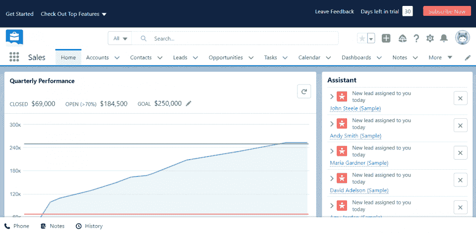
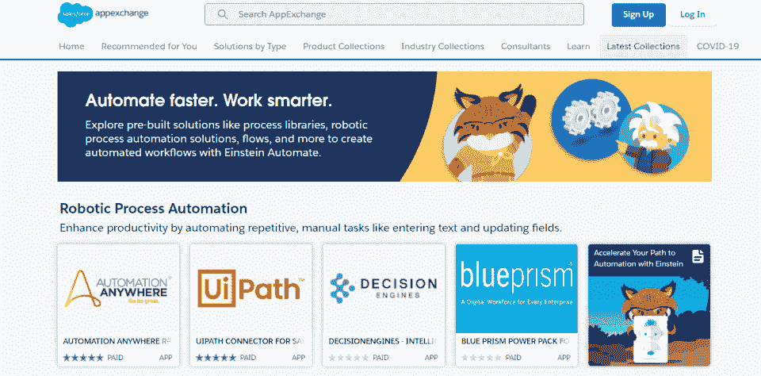
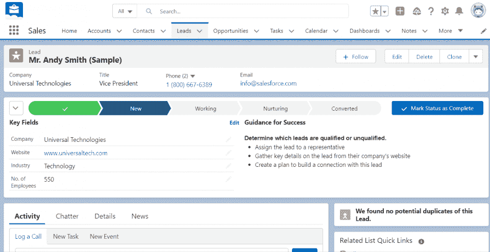
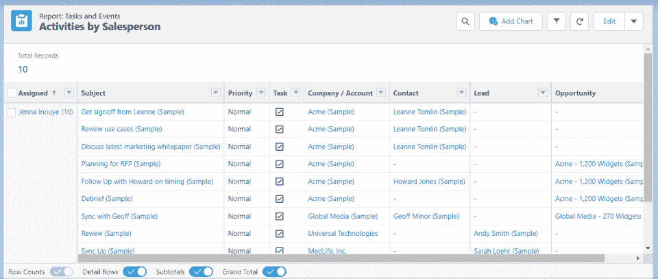
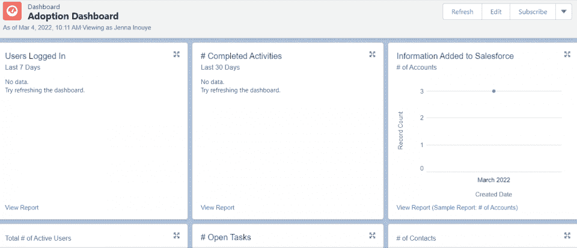

# 2023 年前 25 名以上 Salesforce 面试问题和答案

> 原文：<https://hackr.io/blog/salesforce-interview-questions-answers>

您是否即将参加一场 [Salesforce](https://www.salesforce.com/) 面试？你会遇到一些关于 Salesforce 如何工作的问题，要求比一般的[程序员面试问题](https://hackr.io/blog/programming-interview-questions)更具体的见解。

一些 Salesforce 职位对平台知识的要求很低；其他的需要专家。我们根据您想要的角色，将 Salesforce 面试问题分为基本、中级和高级。最后，您将精通常见问题，并了解为什么 Salesforce 面试问题在准备面试时很有价值。

## Salesforce 面试问题

Salesforce 问题让您深入了解您应该学习的内容，以及雇主需要了解您的 Salesforce 经验和背景。但是在我们开始之前，让我们讨论一下什么是“销售力量”面试。

许多公司使用 Salesforce。作为专业人员，您可能会遇到要求您将 Salesforce 用作销售代表的职位，或者要求您为 Salesforce 开发应用程序和实用程序的职位。

使用 Salesforce 只是一个熟悉软件的问题。培训通常是有的。为 Salesforce 编程(成为一名 Salesforce 开发人员)是一个更加利基(但更有利可图)的市场。

在申请之前，准确地看一下工作清单是为了什么，雇主需要什么样的经验。“在 Salesforce 中”的经历并不总是意味着同样的事情。

### Salesforce 基本面试问题

基本的面试问题假设你有一些 Salesforce 的经验，但不一定有很多经验。你应该了解这个平台是做什么的，它的基本特性，以及如何在其中导航。

#### 1.什么是 Salesforce？

Salesforce 是一个完全基于云的 SaaS 系统。最初推出时，Salesforce 是一个 CRM:客户关系管理套件。但是今天，它是一个完整的云服务和基础设施。在 Salesforce SaaS 解决方案下，团队可以管理他们与潜在销售线索的所有联系。

#### 2.为什么您应该使用 Salesforce？

Salesforce 之所以受欢迎，是因为它是一种基于云的分散式服务，可以从任何地方访问，并集成到许多其他解决方案中。它易于访问、可扩展且价格合理。它现在是许多组织的技术基础。

#### 3.销售云和服务云有什么区别？

Salesforce 提供两种主要产品:销售云和服务云。销售云支持销售团队，而服务云支持客户服务人员。销售云是创收服务，而服务云是客户服务门户。

sales force Force.com 平台允许组织在低代码环境中更新和改进他们的应用程序。通过定制他们的应用程序，组织可以更好地控制他们的流程。但这也意味着组织需要低代码开发人员加入他们的团队。

#### 5.什么是 Salesforce AppExchange？

Salesforce AppExchange 是 Salesforce 的应用商店。通过 AppExchange，组织可以下载和安装修改或改善其 Salesforce 体验的应用程序。这种交换使组织能够改进和微调他们的操作，而不必编写新的集成代码。

#### 6.Salesforce 的主要功能是什么？

Salesforce 提供联系管理、机会管理、销售线索管理和一般销售数据。首先，Salesforce 使获取和评估潜在客户、管理客户关系、分析数据和做出相关预测成为可能。

#### 7.您如何定制 Salesforce 的外观？

为您的组织自定义 Salesforce 是一个好主意。可以通过品牌颜色、背景图像和徽标自定义 Salesforce。定制延伸了你的品牌形象，培养了你的公司文化。

中级 Salesforce 技术面试问题将假设您拥有至少一年的平台经验。这些问题将更多地询问您如何使用 Salesforce 以及您的经历。

#### 8.Salesforce 更新是如何发布的？

Salesforce 更新会持续发布，因为该系统是一个基于云的软件即服务平台。您的组织不需要接受这些 Salesforce 版本；它们会自动发生。

Salesforce 通过滚动更新实现了高级别的安全性。这些安全更新至关重要，因为 Salesforce 处理高度敏感的数据。当开发人员发现 Salesforce 中的漏洞时，他们可以立即推出补丁。

#### 9.您如何测试 Salesforce 中的变化？

开发人员应在将 Salesforce 中的所有更改推向生产环境之前，将其推入沙盒环境。Salesforce 提供了被称为“沙箱”的分隔化虚拟化环境，开发人员可以在将更改应用于实时数据之前测试这些环境。沙盒系统用于防止数据丢失或系统中断。

在任何软件系统中，数据和元数据都很重要。数据是指诸如联系人或潜在客户等信息，而元数据是关于数据的信息。元数据的一个例子可能是线索第一次输入系统的时间，最后一次修改的时间，以及有多少用户修改了它。

#### 11.Salesforce 中的队列是什么？

在 Salesforce 中，几乎所有内容(如销售线索和活动)都分配给一个人。Salesforce 中的每个项目都有人负责。队列是一个例外。队列是存储未分配的事物或任务的地方；例如，一桶线索可以由合适的销售人员重新营销。

#### 12.什么是 Salesforce 客户 360？

Salesforce Customer 360 是客户及其与组织的交互的完整视图。通过 Salesforce Customer 360，组织及其员工可以更好地查看他们的客户关系、客户体验和买家旅程。客户 360 可以通过跟踪和分析客户行为并识别指示承诺的行为来改进线索评分。

#### 13.什么是合作伙伴入口网站与客户入口网站？

客户入口网站和合作伙伴入口网站为那些与组织互动的人提供了一种内聚的体验。客户和合作伙伴可以连接到相关的门户网站，与组织进行交流或发起请求。组织通过这些门户提供一致的用户体验。

#### 14.什么是不同类型的报告？

Salesforce 拥有一系列高度可靠的报告。但是，有四种不同类型的报告:

*   表格:这些报告类似于电子表格。
*   摘要:这些报告汇总了其他报告中的数据。
*   矩阵:这些报告比表格报告提供了更多的可见性和定制。
*   联接:这些报表联接多个报表进行比较。

另一方面，您可以在这些报告中查看从销售线索评分到时事通讯打开率的所有内容。

#### 15.什么是动态仪表板？

Salesforce 中的每个仪表板都是动态的，因为用户可以根据自己的需要自定义所有仪表板。销售代表可以将他们的控制面板定制为他们需要查看的特定指标，以确保为他们的销售线索和联系人提供尽可能好的服务和体验。

#### 16.您如何提高 Salesforce 用户采用率？

即使新服务更好，组织也可能难以采用新服务。培训、功能开发和大使可以提高用户的接受度。最终，用户需要看到产品会让他们更容易完成工作；然后，他们会拥抱它。

#### 17.Salesforce 如何规范化和清理其数据？

Salesforce 通过规范化和清理数据确保销售代表和客户支持代表始终使用正确的记录。Salesforce 在保存数据之前首先验证其数据(例如，确保电子邮件有效)。它还提供重复的管理服务，所以重复的条目不会被保存。

### 针对有经验用户的 Salesforce 面试问题

这些 Salesforce 测试面试问题针对那些至少在 Salesforce 工作过几年的人。这些人应该对 Salesforce 及其操作有相当多的了解，但他们可能不是 Salesforce 开发或管理方面的专家。

#### 18.角色和个人资料有什么区别？

角色决定某人可以访问哪些信息，而简档决定某人可以访问哪些类型的对象和字段。两者都保护 Salesforce 中数据的安全性。它们一起在套件中提供隐私和身份验证服务。

Salesforce 有三个主要的自动化工具:Workflow、ProcessBuilder 和 flow。自动化工具可以简化和改进 Salesforce 的运营；它们是在某些触发条件下发生的设定过程，比如保存客户记录。在 Salesforce 下，您可以让新的销售线索自动发送给销售代表，以接听电话。

#### 20.您可以在 Salesforce 中建立哪些关系？

关系可以是亲子关系，也可以是连带关系。通过在 Salesforce 中连接数据，您可以改进您的数据管理。当数据被连接时，它减少了一些可能被遗漏的机会。

#### 21.Salesforce 的执行顺序是什么？

Salesforce 有严格的执行顺序，即特定任务启动的优先级。理解执行顺序对于那些想要自定义 Salesforce 的人来说很重要；例如，记录可能在触发 Apex 代码之前或之后保存。

#### 22.什么是 Apex？

Apex 是 Salesforce 的主要编程语言。虽然 Salesforce 中的许多变化都发生在低代码环境中，但仍有必要深入挖掘。熟悉其他静态类型语言的程序员应该会发现 Apex 相对容易使用，尤其是使用过 C 或 Java 的程序员。Apex 可以在 Salesforce 的各个领域触发，尤其是在自动发送电子邮件时。

#### 23.什么是 SoQL？

SoQL 是一种类似于 [SQL](https://hackr.io/blog/how-to-learn-sql) (结构化查询语言)的语言，用于从 Salesforce 数据库中查询数据。开发人员可以使用 SoQL 直接从数据库中提取数据或直接操作数据，从而提供更高的定制级别。

#### 24.什么是 Mulesoft？

Mulesoft 是一个集成套件，使 Salesforce 更容易与其他产品集成。许多公司的技术堆栈中都有 Salesforce central 他们将一切与系统的其余部分集成在一起。如果没有 Mulesoft，开发人员将需要手动编写集成代码。

#### 25.什么是 Apex 触发器？

Apex 触发器是触发自定义 Apex 代码的操作，例如保存文件、将文件传输给其他人，甚至关闭文件。开发人员可以将自定义代码注入这些点，以改进 Salesforce 系统的自定义。

#### 26.什么是 Apex 测试覆盖率？

开发人员必须测试所有定制代码，以在维护自动化系统流程的同时实现更好的安全性。在开发人员部署代码之前，代码必须符合 Apex 测试覆盖率的标准。最小测试覆盖率是 75%。

## 我如何准备 Salesforce 面试？

和任何面试一样，你知道的越多，你就越自信。花点时间在 Salesforce 平台上。如果可以，参加 Salesforce 的课程，甚至参加 Salesforce 认证。

如果上面有任何你不知道如何回答的问题，现在是时候找出更多了。您可能需要了解更多关于 Salesforce 报告、集成或定制的信息，您所了解的任何信息都将使您成为更强有力的候选人。

## Salesforce Professional 挣多少钱？

根据 Indeed 的数据，Salesforce 开发人员平均收入为 110，685 美元。目前需要 Salesforce 开发人员。由于 Salesforce 越来越受欢迎，各行各业都有很多企业采用它。

作为入门级的 Salesforce 管理员或用户，您可能会赚较少的钱，但是获得培训、认证和经验可以帮助您在职业生涯中达到工资范围的上限。

### 如何赢得 Salesforce 面试

对于背景问题或模拟测试，这里有一些让你的评论更出色的小技巧:

*   对你的技能要诚实:雇主通常愿意培训一名初级员工。专注于您对 Salesforce 的了解，并乐于学习更多内容。
*   不要过度准备:如果你申请的是销售职位，他们会让你为 Salesforce 写代码是值得怀疑的；你只需要知道最基本的。
*   使用 Salesforce 练习:您应该登录 Salesforce 并使用测试数据练习，直到您确信您已经“刷新”了您的技能。
*   获得 Salesforce 认证:成为 Salesforce 认证的专业人员可以帮助您在 Salesforce 支持或 Salesforce 开发部门找到工作。

Salesforce 是一款强大的产品。即使是专家也可以用它工作几年而不接触项目的某些部分。Salesforce 团队继续添加新功能并改进产品。很少有雇主会期望你一下子就了解 Salesforce 的一切。

## 结论

以上 Salesforce 面试问题和答案可以帮助您准备下一次面试并取得成功。但是没有什么比直接体验软件更好的了。

无论您是完全的初学者还是想要提高技能的高级用户，都可以考虑参加 Salesforce 课程。由于 sales force 更新如此频繁，您可能需要了解更多有关新功能和集成的信息。

由于销售人员的知识是一项非常抢手的技能，你应该有很多面试机会。祝你的求职之旅好运！

**人也在读:**