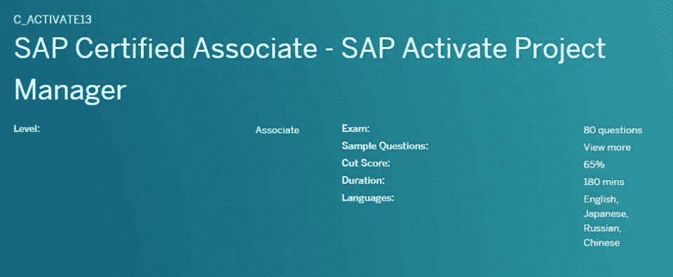
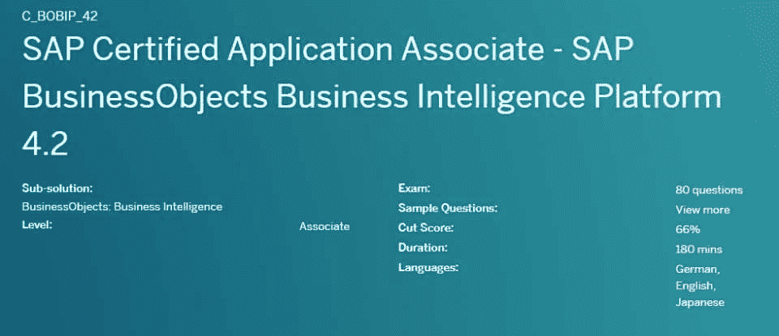
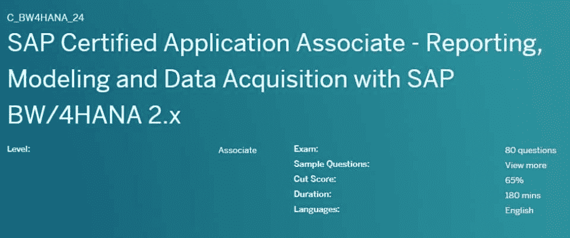
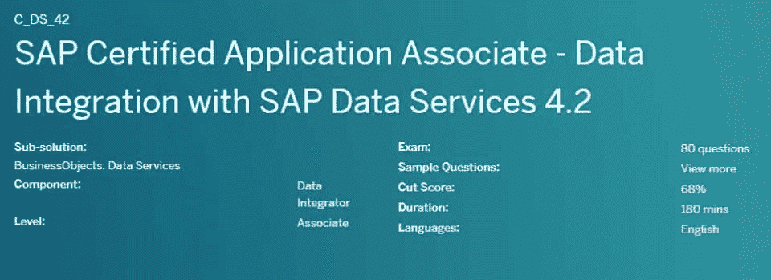
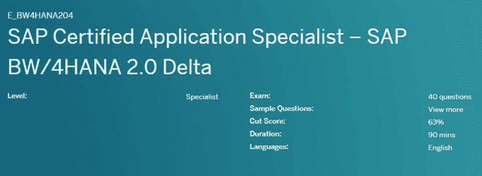
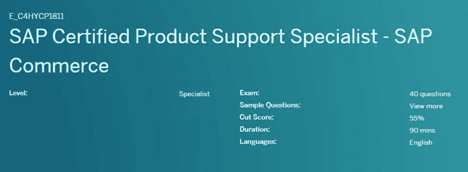
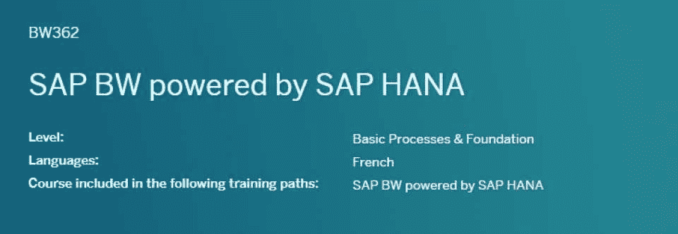
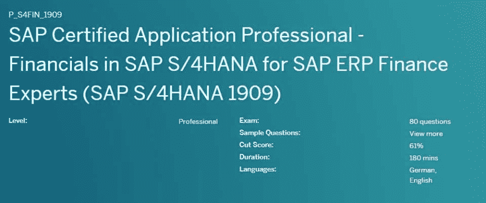
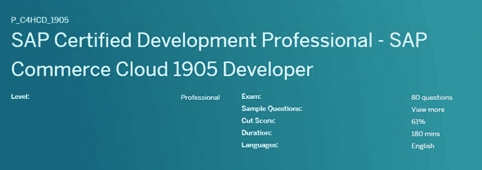
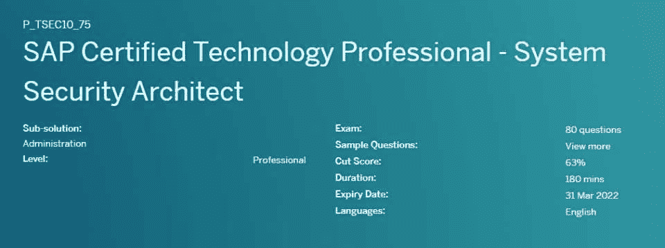

# 帮助您取得成功的 10 大 SAP 认证[更新]

> 原文：<https://hackr.io/blog/sap-certification>

任何对大数据感兴趣的人都必须了解数据处理领域的系统、应用和产品，简称 SAP。虽然非常实用的 SAP ERP 是所有产品中最知名的，但 SAP 提供了一系列产品和服务来处理大数据。其中包括 SAP CRM(客户关系管理)、SAP PLM(产品生命周期管理)、SAP S/4HANA、SAP SCM(供应链管理)和 SAP SRM(供应商关系管理)。

SAP 为在不同信息技术领域工作的专业人员提供超过 135 个认证项目。鉴于有大量的选项，很难知道选择哪一个作为你的第一个认证。

我们已经编制了一份十大最佳 SAP 认证清单，供您考虑，按等级排列—助理、专家和专业人员。为了便于您参考，我们将认证汇总到一个表格中，并在下面以 SAP 认证列表的形式提供了详细信息。

## **SAP 认证汇总**

| **费用** | **及格分数** | **持续时间** | **总提问数** | **题型** | **语言** |
| [**SAP 激活项目经理**](https://training.sap.com/certification/c_activate13-sap-certified-associate---sap-activate-project-manager-g/) | $592 | 65% | 180 分钟 | 80 | 多项选择 | 英语、汉语、日语和俄语 |
| [**SAP BusinessObjects 商务智能平台 4.2**](https://training.sap.com/certification/c_bobip_42-sap-certified-application-associate---sap-businessobjects-business-intelligence-platform-42-g/) | $592 | 66% | 180 分钟 | 80 | 多项选择 | 英语、德语和日语 |
| [**使用 SAP BW/4HANA 2.x**](https://training.sap.com/certification/c_bw4hana_24-sap-certified-application-associate---reporting-modeling-and-data-acquisition-with-sap-bw4hana-2x-g/) 进行报告、建模和数据采集 | $592 | 65% | 180 分钟 | 80 | 多项选择 | 英语 |
| [**与 SAP 数据服务 4.2 的数据集成**](https://training.sap.com/certification/c_ds_42-sap-certified-application-associate---data-integration-with-sap-data-services-42-g/) | $592 | 68% | 180 分钟 | 80 | 多项选择 | 英语 |
| [**SAP BW/4 HANA 2.0 Delta**](https://training.sap.com/certification/e_bw4hana207-sap-certified-application-specialist--sap-bw4hana-20-delta-g/) | 学习中心年度订阅费 | 63% | 90 分钟 | 40 | 多项选择 | 英语 |
| [**SAP 认证产品支持专家- SAP 商务**](https://training.sap.com/certification/e_c4hycp1811-sap-certified-product-support-specialist---sap-commerce-g/) | $592 | 55% | 90 分钟 | 40 | 多项选择 | 英语 |
| [**SAP BW 搭载 SAP HANA**](https://training.sap.com/course/bw362-sap-bw-powered-by-sap-hana-classroom-013-g-fr/) | $592 | 60% | 90 分钟 | 40 | 多选项，多选择 | 英语、法语 |
| [**面向 SAP ERP 财务专家的 SAP S/4HANA 财务系统(SAP S/4HANA 1909)**](https://training.sap.com/certification/p_s4fin_1909-sap-certified-application-professional---financials-in-sap-s4hana-for-sap-erp-finance-experts-sap-s4hana-1909-g/) | 不适用的 | 61% | 180 分钟 | 80 | 多项选择 | 英语、德语 |
| [**SAP 商务云 1905 开发者**](https://training.sap.com/certification/p_c4hcd_1905-sap-certified-development-professional---sap-commerce-cloud-1905-developer-g/) | $592 | 61% | 180 分钟 | 80 | 多项选择 | 英语 |
| **系统安全架构师** | $592 | 63% | 180 分钟 | 80 | 多项选择 | 英语 |

## **什么是 SAP 认证？**

SAP 认证课程是对您与 SAP 开发的产品和平台互动能力的认可。其中包括与财务规划、供应链管理、客户体验和人力资源相关的产品。SAP 认证有三个不同的级别:助理、专家和专业人员。

## **SAP 认证计划等级**

每个认证属于三个级别之一:助理、专家和专业人员。在深入了解顶级 SAP 认证之前，让我们先简要了解一下这些 SAP 熟练程度。

### **关联**

助理级别证明候选人具备开始提供专业服务所需的所有基本技能和知识。那些拥有准水平证书的人准备好进入下一个学习水平，即在工作中或作为顾问提供专业服务。

### **专家**

专家级认证侧重于特定的(工作)角色或集成组件。SAP 认证专家被组织聘为中高级职位。

### **专业**

专业级 sap 认证课程是最高级的。这种类型的认证确保候选人在各自的认证领域拥有先进的知识。

这些候选人通常还拥有多年的真实项目经验、业务流程知识，以及对特定于认证的 SAP 工具的深入了解。

## **十大 SAP 认证项目**

SAP 在线认证的可用性因国家而异。对于这个列表，我们将讨论美国提供的前 10 个 SAP 认证。

### **关联级别**

[****](https://training.sap.com/certification/c_activate13-sap-certified-associate---sap-activate-project-manager-g/)

#### **考试详情**

*   **总提问:** 80
*   **题型**:多选项，多项选择
*   **最低及格分数:** 65%
*   **持续时间** : 180 分钟
*   费用:592 美元
*   **语言:**英语、中文、日语和俄语

SAP 激活项目经理是最受欢迎的助理级认证之一。SAP 认证建立在通过多个项目获得的基本顾问技能和经验之上。SAP 激活项目经理认证测试候选人:

*   SAP 项目管理和变更管理的基本知识
*   高级商业技能
*   能够应用 SAP 激活方法
*   内部和外部利益相关者的管理
*   应用和实施不同方法和工具的能力

SAP 认证的项目经理能够为项目执行制定路线图，监控从销售到实现的一切，并确保适当的[测试](https://hackr.io/blog/what-is-software-testing)和质量管理。

#### **涵盖的主题:**

*   敏捷交付方法
*   敏捷项目规划
*   SAP 激活:
*   过渡路径:

*   “新实施 SAP S/4HANA”
*   “新实施 SAP S/4HANA 云”
*   新实施 SAP S/4HANA 云，单租户版
*   “选择性数据转换”
*   “系统转换”

*   工作流概述

[****](https://training.sap.com/certification/c_bobip_42-sap-certified-application-associate---sap-businessobjects-business-intelligence-platform-42-g/)

#### **考试详情**

*   **总提问:** 80
*   **题型:**多项选择，多项选择
*   **最低及格分数:** 66%
*   **时长:** 180 分钟
*   费用:592 美元
*   **语言:**英语、德语和日语

SAP 认证应用助理-SAP Business objects Business Intelligence Platform 4.2 认证测试候选人是否具备设计、部署和操作 SAP Business objects Business Intelligence Platform 的所有必要技能和知识。

获得准 SAP BusinessObjects 认证的候选人具备在 SAP 商业智能平台部署中配置和管理服务器的技能。他们在支持 SAP 商业智能平台的用户和组所需的任务方面经验丰富。

#### **涵盖的主题**

*   建筑和管理
*   身份验证、授权和安全性
*   内容管理
*   设计和部署
*   信息流
*   安装和备份
*   监控和审计
*   平台配置
*   平台功能
*   解决纷争

#### [****](https://training.sap.com/certification/c_bw4hana_24-sap-certified-application-associate---reporting-modeling-and-data-acquisition-with-sap-bw4hana-2x-g/)

#### **考试详情**

*   **总提问:** 80
*   **题型:**选择题
*   **最低及格分数:** 65%
*   **时长:** 180 分钟
*   费用:592 美元
*   **语言:**英语

SAP Certified Application Associate-Reporting，Modeling，and Data Acquisition with SAP BW/4HANA 2 . x certification 证明了候选人在使用 SAP BW/4 HANA 进行数据采集、建模和查询设计方面的能力、知识和经验。

通过该认证，候选人在 SAP 项目团队中担任指导角色的深度知识和技术技能将得到检验。SAP BW/4HANA 2.x 报告、建模和数据采集认证考试是入门级资格考试。

#### **涵盖的主题**

*   数据采集到:
*   (SAP HANA 的)基础知识
*   信息对象和信息提供者
*   原生 SAP HANA 建模
*   SAP 分析工具
*   SAP BW/4HANA:

*   数据流
*   建模
*   项目和建模过程

*   SAP BW 查询设计

[****](https://training.sap.com/certification/c_ds_42-sap-certified-application-associate---data-integration-with-sap-data-services-42-g/)

#### **考试详情**

*   **总提问:** 80
*   **题型:**选择题
*   **最低及格分数:** 68%
*   **时长:** 180 分钟
*   费用:592 美元
*   **语言:**英语

通过 SAP 认证应用助理-数据集成与 SAP 数据服务 4.2 认证，候选人可确保具备以下所需的技能和知识:

*   实现 ETL 项目，以及
*   使用 SAP 数据服务管理项目。

SAP Data Services 4.2 认证的助理级数据集成测试候选人在 SAP 数据服务方面的能力和知识。

这从数据集成概念开始，然后应用性能调优和调整方法。接下来是实施复杂的设计方法来执行数据转换、故障排除和恢复。

#### **涵盖的主题**

*   高级数据转换
*   基本数据转换
*   变更数据捕获
*   复杂设计方法
*   数据集成概念
*   数据管理
*   性能优化设计
*   恢复和故障排除

### **专家**

#### **5。** **SAP BW/4HANA 2.0 Delta**

****

#### **考试详情**

*   **总提问:** 40
*   **题型:**多项选择，多项选择
*   **最低及格分数:** 63%
*   **持续时间:** 90 分钟
*   **费用:**学习中心年费
*   **语言:**英语

专业级 SAP BW/4HANA 2.0 Delta 认证面向那些希望作为 SAP BW 应用顾问提供服务的人。通过认证要求具备 SAP BW/4HANA 知识，并作为 SAP BW 团队的一员具备使用该软件的经验。

此 SAP 培训认证的主要重点是检查候选人是否具备使用 SAP BW/4HANA 2.0 实施和建模所需的知识和技能。

虽然不一定要求，但强烈建议在参加 SAP 认证应用专家- SAP BW/4HANA 2.0 Delta 认证考试之前，通过以下三项认证考试之一:

*   C_TBW55_73 (SAP 认证应用助理-使用 SAP BW 7.3 和 SAP BI 4.0 进行建模和数据管理)
*   C_TBW60_74 (SAP 认证应用助理-使用 SAP BW 7.4 进行建模和数据管理)
*   C_TBW50H_75 (SAP 认证应用助理-使用 SAP BW 7.5 进行建模和数据采集，由 SAP HANA 提供支持)

#### **涵盖的主题**

*   SAP BW/4HANA 中的核心建模构件
*   SAP HANA 和 SAP BW/4HANA 中的数据供应
*   开始使用(SAP HANA)
*   混合场景中的混合建模
*   通往 SAP BW/4HANA 的道路
*   SAP S/4HANA 与 SAP BW 的相关性
*   运行 SAP BW/4HANA 数据仓库
*   SAP BW/4HANA 数据生命周期管理
*   SAP HANA 建模

[****](https://training.sap.com/certification/e_c4hycp1811-sap-certified-product-support-specialist---sap-commerce-g/)

#### **考试详情**

*   **总提问:** 40
*   **题型:**多项选择，多项选择
*   **最低及格分数:** 55%
*   **持续时间:** 90 分钟
*   费用:592 美元
*   **语言:**英语

SAP 认证产品支持专家- SAP 商务认证允许候选人担任 SAP 商务产品支持专家的角色。

要参加该认证的考试，考生必须完成 SAP 认证开发专家- SAP 商务云 1811 开发人员(P_C4HCD_1811)认证。

要成功通过专家级 SAP 商务认证考试，需要具备 SAP 商务平台的丰富知识和多年的实际操作经验。

#### **涵盖的主题**

*   (SAP 商务套件的)配置
*   一般支持(针对 SAP 商务套件)
*   (SAP 商务云与其他 SAP 产品的)集成
*   (已实施系统的)性能
*   产品支持流程
*   故障排除(SAP 商务套件)

[****](https://training.sap.com/course/bw362-sap-bw-powered-by-sap-hana-classroom-013-g-fr/)

#### **考试详情**

*   **总提问:** 40
*   **题型:**多项选择，多项选择
*   **最低及格分数:** 60%
*   **持续时间:** 90 分钟
*   费用:592 美元
*   语言:英语、法语

SAP Certified Application Specialist-SAP BW powered by HANA SPs 12(2016 版)认证面向 SAP BW 应用顾问的有志之士。成功通过考试需要对 BW-on-HANA 有全面的了解和实践经验。

如果您拥有以下任何一项认证，参加 SAP 认证应用专家-由 HANA SPS12 支持的 SAP BW(2016 版)认证考试会更容易:

*   C_TBW45_70 (SAP 认证应用助理 SAP NetWeaver 7.0 商务智能)
*   C_TBW55_73 (SAP 认证应用助理-使用 SAP BW 7.3 和 SAP BI 4.0 进行建模和数据管理)
*   C_TBW60_74 (SAP 认证应用助理-使用 SAP BW 7.4 进行建模和数据管理)
*   C_TBW65_73 (SAP 认证应用助理-使用 SAP BW 7.3 和 SAP BI 4.0 进行管理和操作)
*   P_BIE_70 (SAP 认证应用专家-采用 SAP NetWeaver Business Warehouse BW 7.0 的企业数据仓库)
*   P_BIE_73 (SAP 认证应用专家-使用 SAP BW 7.3 和 SAP BI 4.0 进行建模和数据管理)

#### **涵盖的主题**

*   SAP HANA 和 SAP BW 中的数据供应
*   SAP BW 和 SAP HANA 入门
*   混合场景中的混合建模
*   在 SAP HANA 上迁移到 SAP BW
*   使用 SAP 的参考架构 LSA++建模
*   基于 SAP HANA 的 SAP BW 中的优化领域
*   基于 SAP HANA 数据管理的 SAP BW

### **专业**

[****](https://training.sap.com/certification/p_s4fin_1909-sap-certified-application-professional---financials-in-sap-s4hana-for-sap-erp-finance-experts-sap-s4hana-1909-g/)

#### **考试详情**

*   **总提问:** 80
*   **题型:**多项选择，多项选择
*   **最低及格分数:** 61%
*   **时长:** 180 分钟
*   费用:592 美元
*   **语言:**英语和德语

拥有 SAP ERP 财务专家 SAP S/4HANA 中的 SAP 认证应用程序专业人员-财务(SAP S/4HANA 1809)认证的专业人员可以在 SAP 项目中准备、设置和领导 SAP S/4HANA 中财务的实施。

感兴趣的候选人必须有至少 5 年的 SAP ERP(财务会计或管理会计)经验。专业级 SAP 认证评估候选人对 SAP ERP Financials 和 SAP S/4HANA Finance 之间的架构和功能差异的理解。

拥有 SAP S/4HANA 中的财务信息以获得 SAP ERP 财务专家(SAP S/4HANA 1809)认证的候选人具备在负责实施 SAP S/4HANA 中的财务信息的团队中担任应用顾问或主管的所有知识和技能。

#### **涵盖的主题**

*   SAP S/4HANA 和中央财务解决方案中的财务架构概述
*   由 SAP HANA 支持的 SAP 会计中的资产会计配置
*   基于 SAP HANA 和 SAP BPC 的 SAP S/4HANA 现金管理基础知识
*   SAP HANA、SAP S/4HANA 和 SAP 费奥里的基础知识
*   SAP S/4HANA 中财务部门的转换和转换后活动
*   由 SAP HANA 支持的 SAP 会计中的财务会计配置
*   由 SAP HANA 支持的 SAP 会计中的管理会计配置
*   SAP S/4HANA 中财务转换的系统准备和配置

[****](https://training.sap.com/certification/p_c4hcd_1905-sap-certified-development-professional---sap-commerce-cloud-1905-developer-g/)

#### **考试详情**

*   **总提问数** : 80
*   **题型:**多项选择，多项选择
*   **最低及格分数:** 61%
*   **时长:** 180 分钟
*   费用:592 美元
*   **语言:**英语

SAP Certified Developer Professional-SAP Commerce Cloud 1905 Developer certification 可确保候选人具备使用 SAP Commerce Cloud Suite 1905 平台的专业知识和经验。

除了学习上述主题领域以准备专业级 SAP 认证考试之外，考生还必须学习 help.hybris.com 提供的 SAP 商务云套件文档。

至少 3 年的 SAP 商务云实践经验是参加 SAP 商务云 1905 开发人员认证的先决条件。

#### **涵盖的主题**

*   后台办公室和后台办公室驾驶舱修改
*   商业和加速器
*   商务云和云门户基础知识
*   客户体验
*   [数据建模](https://hackr.io/blog/what-is-data-modeling)
*   命令
*   PCM 基础知识和价格建模
*   平台基础
*   平台功能
*   搜索和导航
*   用户管理

#### 10.**系统安全架构师**

****

#### **考试详情**

*   **总提问:** 80
*   **题型:**多项选择，多项选择
*   **最低及格分数:** 63%
*   **时长:** 180 分钟
*   费用:592 美元
*   **语言:**英语

SAP 认证技术专家-系统安全架构师认证确保候选人在 SAP 系统安全和授权方面拥有深入的知识和多年的经验。

拥有系统安全架构师认证的专业人员可以担任 SAP 安全架构师的角色，该角色对技术咨询有很好的理解，并且可以使用该技术来指导或指导特定 SAP 项目的实施。

该 SAP 安全认证证明系统安全架构师能够评估和审查复杂云、混合系统和内部架构的安全性。

#### **涵盖的主题**

*   SAP HANA 中的授权、安全性和场景
*   SAP 商务套件的授权概念
*   SAP S/4HANA 的授权概念
*   SAP Netweaver 应用服务器安全性
*   SAP 系统安全基础
*   安全的 SAP 系统管理
*   SAP 网关和 SAP 费奥里系统环境中的安全性

## **SAP 认证考试结构和方法**

每个认证允许考生有 6 次通过认证考试的机会。根据你的喜好选择考试日期是可能的。对于每项认证，SAP 建议将[首选教育课程](https://training.sap.com/)与实践经验相结合。

除了在线模式，考生还可以选择在 SAP 培训中心进行现场考试。每个认证考试都有其独特的知识领域，称为主题领域。而且每门考试都有不同的时长，总题量，最低通过率。

准备 SAP 认证的方法还取决于熟练程度，即，是助理级别、专家级别还是专业级别。

大多数助理级认证都是入门级项目，即:他们不需要工作经验。许多专业级认证需要几年的行业经验。专业级项目需要多年的工作经验。

某些认证考试可能包含未评分的项目。这些主要是为相关考试的未来版本而测试的。这些被称为未评分，因为它们没有被计入最终得分。此外，这些项目任意分布在各个主题中。

[面向初学者的 SAP ABAP 编程-在线培训](https://click.linksynergy.com/deeplink?id=jU79Zysihs4&mid=39197&murl=https%3A%2F%2Fwww.udemy.com%2Fcourse%2Fsap-abap-programming-for-beginners%2F)

## **为什么要获得 SAP 认证？**

获得 SAP 认证有很多好处。其中之一是它是行业领先的认证之一。此外，SAP 认证其产品和服务，因此认证具有很高的价值。

获得 SAP 认证的其他主要优势包括:

*   增强执行各种基于 SAP 的任务的知识
*   更好的晋升机会
*   加薪前景

所有认证都由 SAP 教育和认证与支持影响委员会提供。

## **立即获得 SAP 认证**

以上总结了我们挑选的最佳 SAP 认证项目，以及它们的额外津贴和认证考试方法。希望现在您可以更容易地选择最合适的认证，或者至少更好地了解 SAP 认证。如果你想了解 SAP ABAP 运行时环境和 ABAP 编程语言，请查看[最佳 SAP ABAP 教程](https://hackr.io/tutorials/learn-sap-abap?ref=blog-post)。

你决定从列表中选择什么认证？您是否选择了其他 SAP 认证？你认为哪种认证是最好的？请在评论中告诉我们。

## **常见问题解答**

#### **SAP 认证要花多少钱？**

SAP 认证费用因课程和国家而异。在美国，SAP 认证的费用从 500 美元起。在印度，它从₹40000.开始其他国家的价格通常也保持在这个数字左右。

#### **SAP 考试难吗？**

这将取决于参加考试的个人，但有许多轶事证据表明，SAP 认证比其他 IT 认证更容易。请记住，这也将取决于具体的课程。无论如何，你都要做好准备，所以不要过分强调难度，而是要有扎实的学习材料。

#### 获得 SAP 认证需要多长时间？

这也各不相同，一般时间范围从几周到几个月不等。具体的认证将是最大的因素，有些认证需要更长的时间才能完成。这也取决于你能多快让自己做好准备。幸运的是，它们是 SAP 全球认证，这意味着它们在任何地方都有效。

#### SAP 需要编码吗？

即使是顶级的 SAP 认证课程通常也不需要大量的代码确认，尽管它确实涉及高级业务应用编程(ABAP)，一种专有的编程语言。一些认证不需要使用 ABAP 编码，而另一些则需要。无论如何，这里的编码并不特别难，至少与其他编程语言相比是这样的。

#### **SAP 认证的有效期是多久？**

SAP 认证并不会完全过期，直到过期才有效。当发布新的解决方案和附带的认证时，它们就会过时，要求您进行“增量评估或保持最新评估”以保留该认证。您只需参加一次助理级 SAP 认证。

**人也在读:**