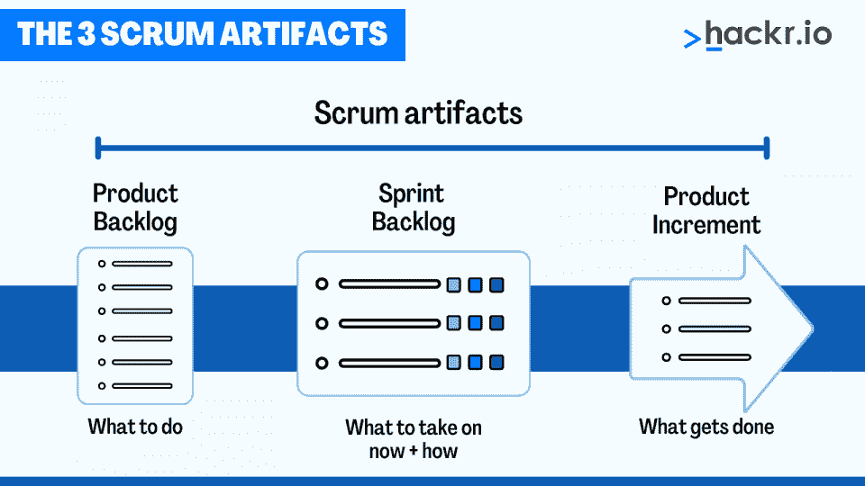
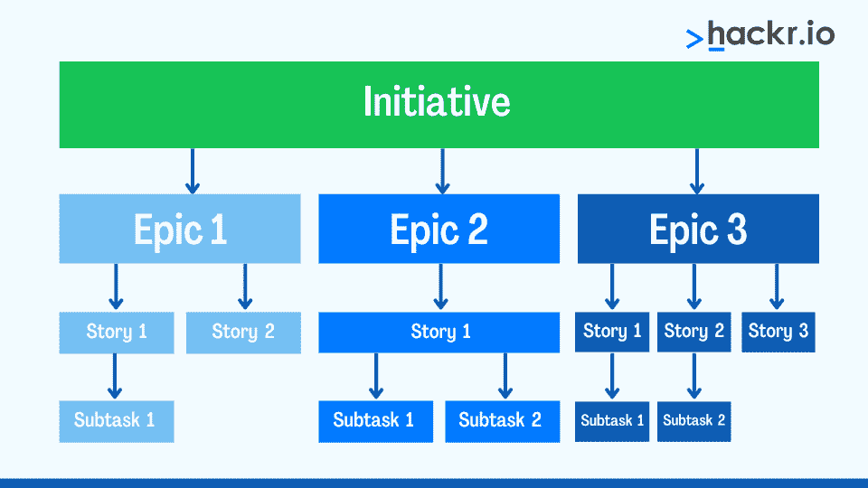
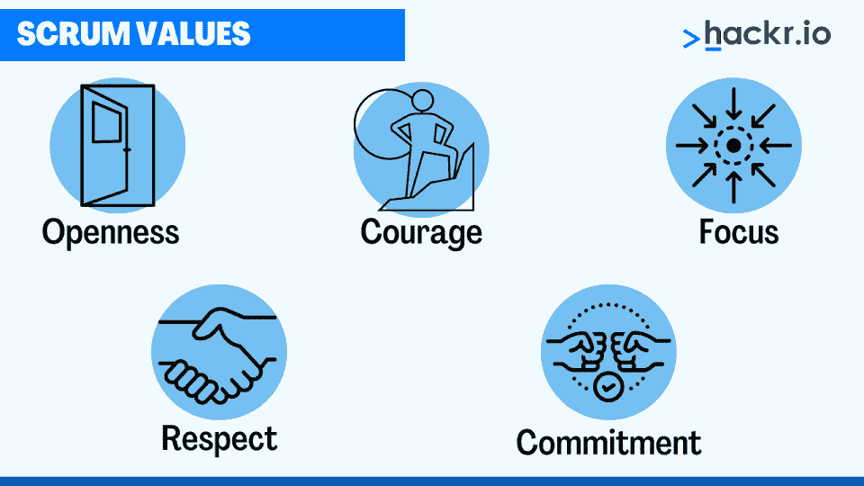

# 50 大 Scrum 大师面试问答[2023]

> 原文：<https://hackr.io/blog/scrum-master-interview-questions-and-answers>

Scrum 是一个众所周知的简单的敏捷框架。它通过适应性强的解决方案和项目管理技术产生组织价值。这个框架主要集中于软件开发，尽管各种行业都使用它，包括市场营销和销售。

Scrum 框架体现了职业生涯中的三个主要角色:产品所有者、Scrum Master 和开发团队。scrum 大师是负责领导整个 Scrum 团队并确保项目开发符合 Scrum 最佳实践的专业人士。

梦想成为 scrum 大师？用 Scrum 知识，一种顶级的 SDLC 方法论，你将打开项目管理世界的许多大门。用我们总结的 50 个 scrum 大师面试问题为你的下一次面试做准备。自己阅读或者和朋友一起练习 scrum master 面试问题和答案！

## **50 大 Scrum 大师面试问答**

我们将 Scrum 问题分成三类:基础、中级和高级。先从基础层面开始吧。

### 【Scrum Master 角色的基本面试问题

#### **1。你说的 Scrum 是什么意思？**

Scrum 是一个敏捷的框架，促进生产力和团队协作。Scrum 允许团队在接受挑战、反思成就和失败、从过去的错误中学习并做出调整时进行自我组织。

这第一个面试问题经常被用作开始谈话的起点。

#### **2。描述 Scrum 团队的角色。**

*   **产品负责人**:产品负责人负责通过决定如何优先考虑产品特性、下一个 sprint 的重点等等来提高投资回报率。产品所有者会经常更新这些项目。

*   Scrum Master:[Scrum Master](https://www.atlassian.com/agile/scrum/scrum-master)指导团队优化 Scrum 原则以满足业务目标。

*   Scrum 开发团队:开发团队是一组合作来保证涉众满意的人。

#### **3。Scrum 团队的职责范围是什么？**

Scrum 团队负责以下事项:

*   为每个 sprint 创建和交付工作产品
*   以所有权和透明度管理工作
*   参加所有会议以确保一致性和进度
*   独立工作，协作完成冲刺目标

#### **4。什么是敏捷？**

敏捷是一种迭代的项目管理和软件开发方法，帮助组织和团队简化项目并交付更多价值。

敏捷团队不是推动一个大的发布，而是以可管理的块来交付工作。对需求、方法和结果的定期评估为团队提供了一种适应自然变化的方式。

#### **5。Scrum 过程工件有哪些？**

****

*   **产品积压**:基于研究和分析，构建产品所需的活动、特性和修复的列表。

*   Sprint backlog:Sprint Backlog 是产品 Backlog 的一个子集——它们是单独的产品 Backlog 任务，被分解成可执行的任务来完成 Sprint 目标。

*   产品增量:在冲刺阶段完成的产品待办事项被认为是可交付的(产品增量)。

#### **6。谁是 Scrum 大师？**

scrum master 确保开发团队和产品所有者了解完成他们的 sprints 所需的承诺和交付。

一个好的 scrum 大师必须向他的团队强调坚持工作流程的价值，并识别任何阻碍团队实现目标的结构性问题。

#### 7 .**。描述 Scrumban。**

Scrum 和看板的结合——两个项目管理工作流——被称为 Scrumban。您可以使用 Scrumban 来满足团队需求，减少工作批处理，并构建基于拉动的方法。它巧妙地将 Scrum 框架与看板的适应性和可视化能力结合起来。

#### **8。你对单口相声了解多少？**

站立会议是每天 15 分钟的会议，在 sprint 的每一天讨论进展、更新和问题。团队可能会回答以下问题:

*   哪些任务是成功的？

*   完成了哪些作业？

*   还有哪些项目是开放的？

*   团队面临的挑战。

会议有助于您了解项目的总体范围和当前状态。

#### **9。什么是秒杀和冲刺 0？**

Sprint 0 是用于开发产品 backlog 的基本版本的短暂时间。它还提供了发布估计建议，对于以下情况是必要的:

*   构建项目框架并增加研究峰值

*   保持简单的审美

*   完成几个故事的开发

spike 是使用极限编程(XP)进行研究、设计、调查和产生概念证明的任务的集合。它通过获取数据和信息来更好地理解需求和增加可靠性，从而降低了技术方法的风险。

#### 10。 **什么是 Scrum 中的 Scrum？**

scrum 中的 scrum 需要来自每个团队或项目的一个代表在会议中讨论高层次的问题和更新。这是一个让每个人都跟上进度并提供一组项目的鸟瞰图的好方法。

在 Scrum of Scrums 中讨论的一些事情包括:

*   当前状态
*   进步
*   障碍
*   目标
*   属国
*   风险管理

#### **11。什么是用户故事映射？**

用户故事映射表示和安排用户故事，以更好地理解系统功能、系统积压、计划发布，以及如何向客户提供价值。

在水平轴上，用户故事根据它们的优先级排列。根据复杂程度的上升，它们被表示在纵轴上。

#### **12。在 sprint 回顾会议中会发生什么？**

sprint 回顾会议帮助团队评估他们在前一次 sprint 中的表现，并确定需要改进的地方。

团队经常检查团队成员关系、涉众联系和反馈、内部流程、工具和阻碍开发的常见问题。

会议有助于团队决定如何监控变更，确定未来增强的优先级，并选择至少一个在即将到来的 sprint 中实现。

#### 13。Scrum 的经验过程控制需要什么？

Scrum 的经验过程控制是一个包含调查、透明和适应性的原则。

Scrum 大师认识到产品范围并不总是固定的；相反，策略是使用短周期将产品分成小块。在此基础上，我们可以对其进行分析和调整，以纳入内置流程，从而确保透明度和效率。

#### **14。Scrum 有哪些缺点？**

以下是使用 Scrum 的一些最典型的缺点:

*   **高学习曲线:**有经验者优先。一个缺乏经验的 scrum 大师冒着项目失败的风险。

*   **紧密协作:**团队必须合作、交流，并致力于取得成果。

*   沟通问题可能代价高昂:每个任务的清晰轮廓对于成功和最小化项目延迟至关重要。

*   扩展是困难的:虽然 Scrum 对于次要的工作很有效，但是扩展到更大、更复杂的项目需要大量的协调工作。

#### 15。Scrum 大师的主要技能和知识是什么？

一个 scrum 大师应该具备以下主要知识和专长:

*   Scrum 和敏捷方法

*   熟悉技术体系

*   管理和指导

#### 16。Scrum 团队可以使用什么策略来解决冲突？

scrum 团队通过以下步骤处理冲突:

*   确定问题的根本原因。

*   建立责任和所有权。

*   向团队成员分配任务以纠正问题。

*   建立一个明确的截止日期。

*   提供完全透明并监控进度。

#### **17。用户故事和史诗、任务有什么区别？**

****

*   **用户故事**:关于产品特性的简短易懂的描述。

*   **史诗**:一组相连的用户故事。

*   任务:Scrum 中最小的工作单元，分解用户故事。

#### 18。用户故事是什么？

用户故事是一种项目管理和敏捷软件开发工具，它从最终用户的角度为团队提供清晰、自然的项目特性描述。

#### **19。描述一下冲刺。**

sprint 是一个有时间限制的迭代。在冲刺阶段，开发团队生产一个特定的产品模块。冲刺可能持续 1-2 周。

#### 20。什么是速度？

速度是一个统计数据，它决定了一个团队在一次冲刺中完成了多少工作，特别是完成了多少用户故事。

#### **21。产品负责人的职责范围是什么？**

以下是产品负责人的一些常见职责:

*   建立项目的策略。
*   预测客户需求并开发相关的用户案例。
*   评估项目的状态。
*   充当所有产品咨询的联络人。

#### **22。描述一下燃耗。**

燃耗图是一种记录 sprint 剩余和已完成工作的工具。

#### **23。什么是燃尽图？**

燃尽图展示并比较了已完成的工作和用户故事中剩余的工作和时间。

#### **24。Scrum 项目中的评估是什么？**

估算表明了完成产品待办事项任务所需的时间和精力。评估有助于团队规划资源，包括预算和劳动力。

#### **25。使用 Scrum 有什么风险？**

Scrum 是交付项目的有效工具，但是它也有一些风险:

*   预算: Scrum 团队在估算项目完成成本时并不总是准确的，尤其是在产品开发的第一阶段。考虑到客户的要求和发展，费用可能会很快超过预算。

*   **知识不足:**团队成员必须具备 Scrum 和敏捷原则的工作知识，才能顺利运行 Scrum 项目。如果一个没有经验的产品负责人或团队成员加入进来，出错和延迟的可能性会更大。

*   Sprint 延迟:当一个项目开发并包括比最初预期更多的任务和可交付成果时，范围蔓延经常发生在 Scrum 中，导致 Sprint 的完成延迟。

#### **26。你如何在 Scrum 中管理风险？**

风险管理是有效 Scrum 的重要组成部分。你可以通过以下策略来管理风险:

*   识别潜在的风险，根据需要添加风险，并将它们包含在每个产品待办事项中。
*   评估为每个风险做准备的价值，并决定预算限制和严重性是否值得。
*   对每种风险进行分类。

#### **27。一个好的用户故事应该遵循什么原则？**

一个好的用户故事遵循投资原则。INVEST 代表:

*   I:独立
*   n:可以商量
*   v:有价值
*   艾凡:难能可贵
*   小杯
*   t:可测试的

#### **28。什么是 MVP？**

MVP 代表*最小可行产品*——一种精益创业理念，强调客户使用产品特性所需的最小特性和功能。

#### **29。什么是 MMP？**

MMP 代表*最小可销售产品*——一种你可以向观众推销的具有有用特性的产品。本产品包含可为客户提供价值的最低使用量。

#### 三十岁。DoD 是什么意思？

完成定义(DoD)描述了一组可交付成果，如书面代码、代码注释、单元测试、集成测试、设计文档、发布说明等。这以可测量和可观察的方式增强了项目开发的价值。当确定完成项目目标的可交付成果时，DoD 有利于 scrum。

#### 31。国防部如何协助产品开发？

国防部以下列方式提供协助:

*   建立交付迭代所需的过程
*   使用合适的工具，如燃尽，来改进工艺
*   确保整个项目的及时投入
*   确保完成并理解产品待定项演练
*   汇编产品待办事项列表。
*   在 sprint 回顾和 sprint 回顾中包括产品负责人。

#### 32。一个 Scrum master 如何充当仆人领导？

“仆人式领导者”这个短语主要强调领导者应该表现出的服务态度。因此，一个 Scrum 大师应该有促进、指导、指导和其他技能来鼓励更好的团队表现和参与。

#### 33。不同的团队如何沟通协调？

一种常见的 Scrum 沟通和协调技术是 Scrum of Scrum(SoS)会议，每个 Scrum 团队的代表成员在会上回顾进展、表现、问题、风险等。

### **面向资深专业人士的高级 Scrum Master 面试问题和答案**

#### 34。Scrum 的价值观是什么？

****

以下是五个 Scrum 价值观:

如果每个 Scrum 团队成员想要在短时间内取得显著的进步，他们必须诚实地面对自己的发展。

Scrum 团队需要有勇气对自己和其他利益相关者开放、诚实和真诚地对待他们遇到的任何瓶颈和项目的发展。团队成员还必须有勇气在必要时寻求帮助，尝试新方法，并尊重不同意见和公开辩论。

每个团队成员都必须关注当前的工作，并理解它如何影响冲刺目标。Scrum masters 可能会限制分配给每个团队成员的任务数量或优先级，以保持冲刺阶段的参与度。

Scrum 团队中的尊重包括承认没有人的输入比其他人的更有价值。尊重意味着承认你的成功，信任你的队友，尊重他们的意见。

Scrum 团队必须合作完成一个共同的目标。这需要彼此信任，以完成任务并尽最大努力。只有当每个团队成员都全身心地投入到团队和项目中，这种情况才会发生。

#### 35。什么是冲刺规划会议？

sprint 规划会议确定下一个 sprint 可以完成的任务，并建立时间表。

#### 36。冲刺评审的目的是什么？

开发团队、产品负责人和 scrum master 出席了 sprint 评审会议，可能还包括其他利益相关者。在这个会议上，团队向产品负责人展示了他们在 sprint 期间构建的增量(或演进产品)的演示。此外，团队在会议上确定任何必要的产品改进。

#### 37。你如何准备冲刺计划会议？

以下是你如何准备 sprint 计划会议的方法:

产品负责人负责待办事项整理，这需要收集和安排所有可能包含在 sprint 中的待办事项。

*   **了解团队的能力和速度。**

计算参与者在 sprint 中可以有效完成的工作量。评估之前的 sprint 结果，并考虑完成任务所需的设备和能力。

*   设定你的冲刺目标。

选择你的冲刺目标，以及你希望完成的目标。将这写下来是有益的，这样团队成员以及那些没有参与到 sprint 中的涉众就清楚了。

#### 38。什么是积压精细化？

在非敏捷开发过程中，backlog 精化是需求管理和分析。尽管它的结构与过去的传统需求工件非常不同，但是 backlog 就是需求规格。由于您无疑将不得不重做您花费时间来完善的工作，以便在未来进行更多的冲刺，PO 正在持续地工作以保持团队的积压工作，而不会走得太远。

Scrum 的诞生是为了促进需求的持续发展。PO 可以在没有整个团队协助的情况下进行改进。它们应该包含了解需求的涉众以及在所有相关领域都有经验的团队成员。

#### 40。敏捷和 Scrum 的区别是什么？

*   Scrum 适合于从事需求经常变化的项目的团队，而敏捷最适合于专业人员或专家组成的小型团队。

*   测试和开发在敏捷中不断迭代。Scrum 是尽快提升产品商业价值的敏捷方法。

#### 41。谁创造用户故事？

产品负责人创建用户故事。

#### **43。产品积压和 sprint 积压的区别是什么？**

sprint backlog 包含您的团队必须在 sprint 中完成的任务。产品待办事项包含为了构建产品而必须完成的任务，您可以从中创建列表。

#### **44。定义范围蔓延。**

当项目变更和开发导致完成 sprint 或项目的时间更长、成本更高时，就会出现范围蔓延。

#### **45。你会采用哪些方法来控制范围蔓延？**

以下是避免范围蔓延的方法:

*   密切关注工作，每天评估进展。

*   通过向团队成员清楚地解释愿景，确保他们参与进来。

*   记录并定期检查项目需求(相对于交付的内容)。

*   确保所有引入的变更通过变更控制得到批准，并根据变更请求批准到位。

#### **46。Scrum 中的时间盒是什么？**

时间框要求为每项活动分配一定的完成时间，通常是 15 分钟左右。

#### **47。什么是信任投票？**

信心投票发生在团队聚集在一起，提高他们的声音，并就他们对完成可交付目标的信心程度进行投票的时候。

#### **48。用户故事中的三个 c 是什么？**

*   **卡片**:用于计划和评估的叙述的书面摘要。

*   **对话**:激励敏捷团队以微小的增量进行合作的对话，以创建对问题和可行解决方案的共同理解。

*   **确认**:将基本需求转化为测试验收标准，以检测用户故事何时满足团队的标准。

#### **49。在与难相处的利益相关者打交道时，你的策略是什么？**

利益相关者管理是 Scrum 的主要职责。要与难相处的利益相关者打交道，请遵循以下步骤:

*   识别他们并倾听他们的需求。
*   让他们感到被倾听和理解。
*   确定他们最迫切的动机和业务需求。
*   保持沟通畅通，确保你的工作和进展是透明的。
*   查找并显示解决方案。

#### 50。你如何处理错误？

你的第一步行动是尝试在当前 sprint 的范围内修复错误。如果这是不可能的，将受损的用户故事放在你的产品 backlog 中，并在以后修复你的错误。

## **结论**

我们已经到了 scrum master 面试问题的末尾。试着和一个朋友练习每一个来赢得下一次面试。

想要增加你的知识吗？将敏捷方法添加到您的知识名册中。

## **常见问题解答**

#### **1。我该如何准备 Scrum 大师面试？**

如果你以前没有 Scrum 大师的工作经验，我们的面试问题列表是一个很好的起点。你也可以考虑进行自己的研究，或者参加 SDLC 方法论、敏捷和 Scrum 的课程。

#### **2。Scrum Master 的面试问题有哪些？**

我们编制了一个 50 个常见 scrum 大师面试问题的列表，涵盖了各种 scrum 主题，比如 Scrum 会议、工件、用户故事等等。

#### **3。如何通过 Scrum 面试**

你通过 scrum 面试的最好机会是清楚地展示 Scrum 知识，并证明你在以前的角色或日常生活中使用过它的原则。

#### **4。敏捷和 Scrum 有什么区别？**

Scrum 和敏捷经常互换使用，但两者并不相同。敏捷是一种项目管理方法，其原则反映在 Scrum 中。然而，Scrum 在敏捷之后，作为一种方法在软件开发周期和其他项目中实现其哲学。

**人也在读:**