# Selenium IDE:历史、特性和安装指南

> 原文：<https://hackr.io/blog/selenium-ide>

## **简介:硒自动化测试的需求**

在真实的场景中，手动测试人员有大量复杂的动态测试要运行。如果通过自动化测试运行一些标准的工作流，它将节省大量的时间和冗余，尤其是在集成测试、性能测试、兼容性测试、系统测试、端到端测试和回归测试阶段！自动化测试也有助于带来一致的结果，并使整个过程健壮。Selenium 测试还有助于促进敏捷开发，因为它完全符合持续集成/交付的概念，其中代码被持续地构建、部署和测试。

## **让我们深入硒 IDE**

但是，在此之前，硒到底是什么？

Selenium 是一个测试框架，你可以用 Java、Groovy、C#、PHP、Python、Scala、Ruby、Perl 和 Selenium 的脚本语言 Selenese 编写测试用例。它有三个组件——Selenium web driver、Selenium Grid 和 Selenium IDE。

Selenium IDE 是一个记录和回放工具，可以对任何 web 应用程序进行功能测试，而不需要任何编码或脚本语言知识。该工具作为一个附件可以在许多浏览器上运行，包括 Firefox 和 Chrome。

Selenium IDE 不需要任何设置。您所需要做的就是安装特定于浏览器的扩展。测试人员可以使用 IDE 提供的 GUI 记录他们与任何网站的交互。Selenium IDE 是 Selenium 测试套件的一部分。

每当必须执行测试时，测试人员在 IDE 中启用录制选项，然后在浏览器上播放测试用例。然后，IDE 能够重放相同的交互，并报告差异/错误(如果有)。

## **一点历史**

最初由 Jason Huggins 在 2004 年开发，后来当 Paul Hammant 加入团队时，Selenium 被命名为 Selenium Remote Control 或 Selenium RC。该项目继续发展，许多其他人携手合作。来自一家名为 ThoughtWorks 的公司的 Simon Stewart 能够在大约同一时间创建一个更好的浏览器自动化工具，即 Selenium WebDriver。经过一番讨论后，决定合并这两个项目，最终的工具被命名为 Selenium WebDriver。Selenium IDE 是由 Shinya Kasatani 单独开发的，他在 2006 年将其捐赠给了 Selenium 项目；然而，直到 2018 年，它才得到很好的维护。

## **硒 IDE 的独特功能**

Selenium IDE 的一些独特功能和优势包括:

*   您可以选择要运行的测试用例，或者一次运行整个套件。
*   特定的测试用例可以在任何时候暂停/恢复。
*   控制测试用例的速度。
*   能够将所有 Selenese 命令组合在一起，并作为一个单独的命令执行。
*   测试用例的自动记录。
*   调试更容易，因为测试人员可以在测试用例执行过程中的任何地方设置断点。
*   测试用例可以在整个套件的多个功能中重用。

[硒 IDE (Udemy)](https://click.linksynergy.com/deeplink?id=jU79Zysihs4&mid=39197&murl=https%3A%2F%2Fwww.udemy.com%2Fcourse%2Fselenium-ide%2F)

## **作为扩展/附件的 Selenium IDE**

以前版本的记录工具有许多问题，如缺乏跨浏览器支持，无法扩展功能或进行可视化测试，不支持并行调试或运行脚本，等等。Selenium IDE 直到 2018 年才问世，因为大多数人都关注 Selenium WebDriver。从 2018 年 12 月到现在，Selenium IDE 的增长一直在稳步增长，这意味着它的受欢迎程度越来越高。截至 2006 年，IDE 只在 Firefox 上运行，但是今天它可以作为插件在所有主流浏览器上运行。使用命令行测试运行程序 SIDE runner，IDE 也可以在 Selenium WebDriver 服务器上测试用例。Selenium IDE 支持的浏览器有:

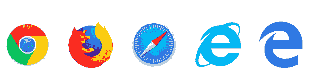

## **安装和设置**

安装和设置非常简单。我们将逐一描述如何安装和设置 Edge、Firefox 和 Chrome 的 IDE。

### **边上硒 IDE 安装**

1.进入[微软 edge 官方安装页面](https://microsoftedge.microsoft.com/addons/detail/selenium-ide/ajdpfmkffanmkhejnopjppegokpogffp)。

2.点击“获取”

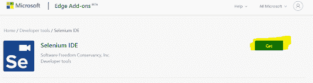

3.将出现一个弹出窗口，要求确认添加: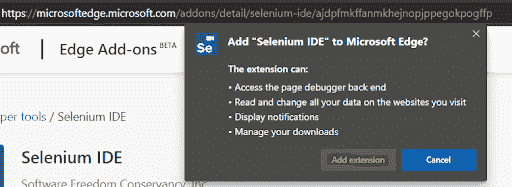

4.点击“添加扩展”

5.完成后，您将收到一个通知，告知您扩展已被添加。要验证这一点，点击设置(右上角的三个点)，然后点击扩展: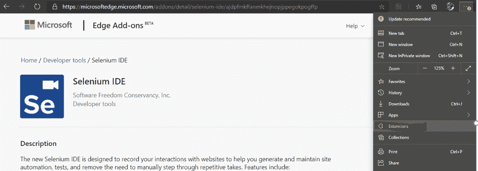

6.一个包含所有已安装扩展的新标签将会打开，其中 Selenium 应该是最新的: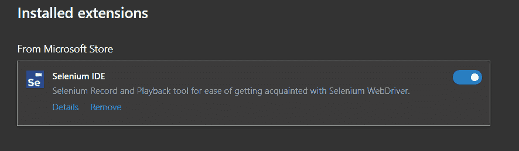

### **Chrome 上的 Selenium IDE 安装**

要在 Chrome 上安装 Selenium，你必须访问 [Chrome 网上商店](https://chrome.google.com/webstore/detail/selenium-ide/mooikfkahbdckldjjndioackbalphokd?hl=en)，搜索 Selenium IDE，然后点击“添加到 Chrome”，你就应该完成了！

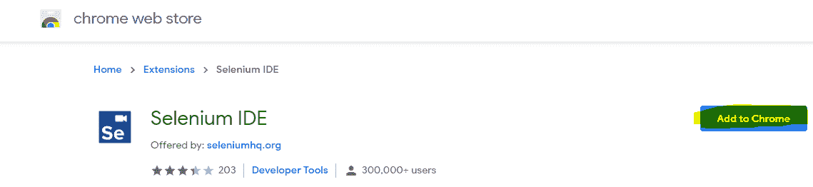

### 在 Firefox 上安装 Selenium IDE

Selenium IDE 可以作为附加组件添加到 Firefox 上。只要浏览到火狐的[附加页面](https://addons.mozilla.org/en-US/firefox/addon/selenium-ide/)，点击‘添加到火狐’就搞定了！

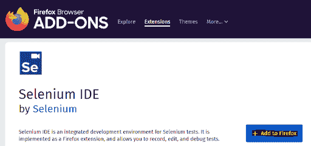

一旦 IDE 安装完毕，就可以使用了！

## **硒命令**

Selenium 命令是用它的编程语言 Selenese 编写的。我们使用这些命令来测试 web 应用程序。

Selenium 中有三种类型的命令:

*   **动作:**应用程序状态的变化——例如，如果你点击提交按钮，你会被重定向到其他页面。
*   **访问器:**启用当前应用程序状态的验证和存储。
*   **断言:**对结果的断言，如果预期和实际结果相同，则返回 true，否则返回 false。断言告诉我们测试用例是失败了还是通过了。有三种断言模式——断言、验证和等待。

检查 [Selenium API](https://www.selenium.dev/selenium-ide/docs/en/api/commands) 以了解更多命令。

## **硒 IDE 基础知识**

Selenium IDE 接口相当自明和简单明了；然而，我们将在下面看到一些重要的特性。

让我们看看 Selenium IDE 提供的一些基本菜单和选项。对于本文，我们将使用 Chrome，但是其他浏览器上的选项也几乎相同。

首先从浏览器的菜单栏启动 Selenium IDE: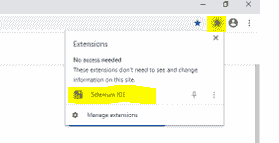

你也可以锁定 IDE，这样你就不用再点击扩展了。

你会看到一个欢迎窗口，有四个选项: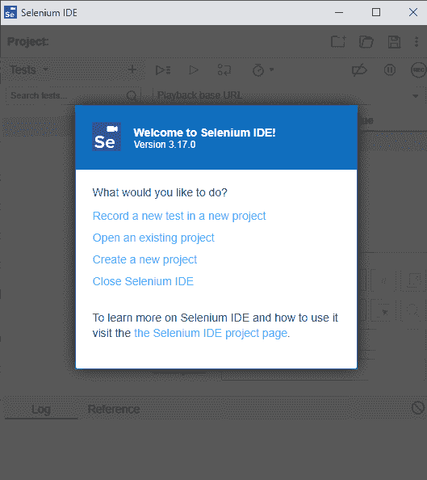

所以，让我们创建一个新项目！选择“创建一个新项目”并给你的项目取一个好听的名字。然后，您可以给出要测试的网站或应用程序的 URL。打开要运行的测试套件或测试。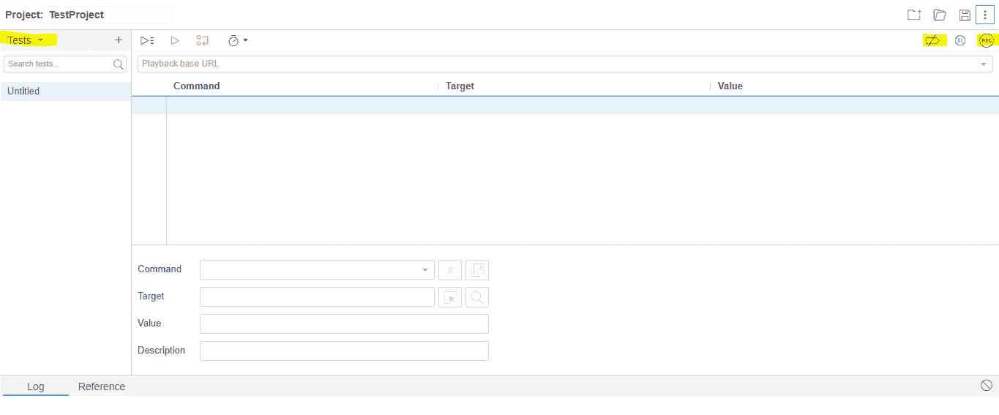

请注意上图中突出显示的内容。您可以从测试、测试套件和执行测试用例视图中进行选择。在右上角，您可以看到一个禁用或启用断点的选项，然后是记录选项。测试用例的结果出现在日志中。例如，如果一个断言失败，您将得到类似这样的结果: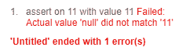

一个简单的动作示例:

一旦你点击了任何一个链接，Selenium IDE 会给出一条消息，表明它已经记录了一次点击(动作):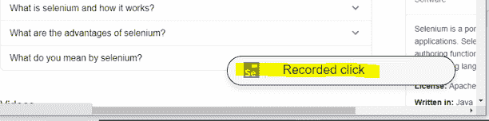

所有的东西都会被记录在仪表盘上:

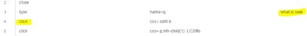

**测试:**可使用左上角的“+”图标(侧栏菜单)随时添加新的测试。

**Suites:** 许多测试可以被分组形成一个可以同时运行的套件。当您创建一个新项目时，Selenium IDE 默认创建一个套件，并且第一个测试被添加到默认套件中。您还可以通过单击左侧菜单中测试套件标题旁边的“+”图标来手动添加套件。您可以使用“删除”选项删除单个测试或整个测试套件。同样，您可以使用 save 图标来保存测试或者测试套件。

#### **控制语句和 JavaScript 表达式**

您可以添加控制语句，如 if-else if-else、do repeat if、while、end、times 等。来改变你的测试行为。不仅如此，您还可以提供要评估的 JavaScript 表达式。

## **硒 IDE 的一些局限性**

虽然我们可以说 Selenium 有一些优秀的功能，但是它不适合测试大量的数据集。它不能处理多个窗口或 web 应用程序的动态部分。此外，市场上的其他工具甚至可以捕获失败测试的屏幕截图，这是 Selenium IDE 目前无法做到的。我们无法测试与数据库连接相关的案例。

## **结论**

毫无疑问，Selenium IDE 是最简单、最容易使用的测试工具，不需要任何设置。它可以在瞬间安装。轻量级和跨浏览器兼容，它带有大量命令，可以记录各种场景，以在浏览器上测试 web 应用程序。要了解更多关于 Selenium IDE 和 WebDriver 的信息，请查看这些[精彩的教程](https://hackr.io/tutorials/learn-selenium?ref=blog-post)。

您可以使用浏览器内回放选项在 IDE 中流畅地回放测试。您可以选择单个测试或整个套件。要在其他浏览器上并行运行测试，您可以安装 Selenium IDE [命令行运行程序](https://www.selenium.dev/selenium-ide/docs/en/introduction/command-line-runner)，获取所需的浏览器驱动程序，并从 cmd(命令提示符)启动运行程序，使用您想要的任何选项。

**人也在读:**