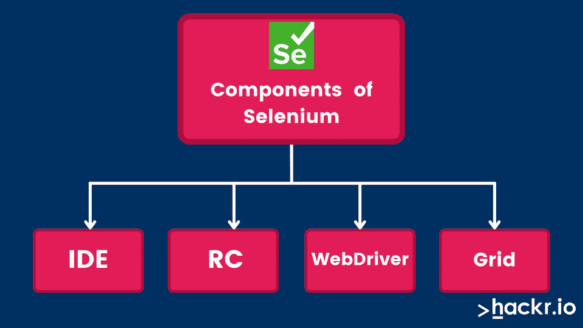

# 2023 年硒面试 40 强问答[更新]

> 原文：<https://hackr.io/blog/selenium-interview-questions>

完全用 Java 编写的， [Selenium](https://hackr.io/blog/what-is-selenium) 是使用最广泛的自动化测试工具之一。它易于使用、简单，并支持用各种各样的[编程语言](https://hackr.io/blog/best-programming-languages-to-learn)编写测试脚本，包括 C#、Groovy、Java、Perl 和 Python。

每个有抱负的测试人员，尤其是那些致力于使用基于 web 的应用程序的测试人员，都必须了解一些关于 Selenium 的知识。如今，基于网络的测试职位几乎肯定会出现 Selenium 面试问题。

我们收集了一些最常见的 Selenium 面试问题和答案。为了方便起见，它们被分为基本问题和高级问题。我们从一些基本的硒测试面试问题开始。让我们开始吧。

[点击这里下载 Hackr.io 的 Selenium 面试问题 PDF](https://drive.google.com/file/d/1H5t1hE0tJm24xBUeHVANC1VrwyZY6Mxu/view?usp=sharing) 。

## **基础硒面试问题**

### **1。硒是什么？陈述它的组成部分。**

Selenium 是一套专门用于自动化 web 测试的工具。它的组件是 Selenium IDE(集成开发环境)、WebDriver 和 RC 以及 Grid。



### **2。硒 2.0 和硒 3.0 有什么不同？**

Selenium 2.0 整合了 Selenium RC 和 WebDriver 做了一个单一的工具，而 Selenium 3.0 是最新版本，有 Beta 1 和 Beta 2 更新。

### **3。Selenium 支持哪些不同的测试类型？**

Selenium 支持的测试类型有:

1.  功能的
2.  回归
3.  巡航控制
4.  哈得孙
5.  詹金斯
6.  快速构建

### **4。测试自动化框架有哪些不同的类型？**

*   **行为驱动的开发框架:**允许为不同的专业人员，包括分析师、开发人员和测试人员，以易于阅读和理解的格式自动化功能验证。
*   **数据驱动测试框架:**帮助分离测试脚本逻辑和测试数据。它还允许将测试数据以键值对的形式存储在一些外部数据库中。这些键用于访问和填充测试脚本中的数据。
*   **关键字驱动测试框架:**它是数据驱动测试框架的扩展，除了将测试数据从测试脚本中分离出来，关键字驱动测试框架还将测试脚本代码的一部分存储在外部数据文件中。
*   **库架构测试框架:**工作原理是确定正确的步骤，然后将它们组合成一个库下的功能。这些函数在需要的时候会在测试脚本中调用。
*   **基于模块的测试框架:**将每一个被测试的应用分成若干逻辑的、隔离的模块。为每个模块创建不同的测试脚本。
*   混合测试框架:提供属于不同类型测试框架的特性。这个想法是用一个单一的测试工具获得各种方法的所有好处。

### **5。断言的作用是什么，有哪些各种类型？**

断言的作用是作为一个验证点。它有助于验证应用程序的状态，确保它符合预期。有三种类型:

1.  维护
2.  核实
3.  等待

### **6。详细解释硒的成分。**

尽管被称为自动化测试工具，Selenium 并不是一个独立的工具。相反，它是几个工具的包，因此是一个测试套件。Selenium 套件包含以下组件:

*   Selenium IDE: 作为 Firefox 插件发布，Selenium IDE 是一个记录和回放工具
*   **Selenium Grid:** 允许跨多个平台和环境同时分布测试执行
*   Selenium RC: 一个服务器，它允许用户用理想的编程语言创建测试脚本。Selenium RC 还允许在各种 web 浏览器上执行测试脚本。
*   **Selenium WebDriver:** 除了使用其本机兼容性实现自动化之外，还直接与 web 浏览器通信。

### **7。硒的局限性是什么？**

*   仅支持基于 web 的应用程序
*   不支持位图比较
*   出于报告目的，需要第三方工具
*   与惠普 UFT 公司等其他商业工具相比，供应商支持非常少
*   在硒中维持物体具有挑战性
*   不提供条形码和验证码阅读器测试

### **8。Selenium 中有哪些不同类型的定位器？**

定位器是一种地址，它提供了一种在网页上识别 web 元素的独特方式。Selenium 有一系列定位器来识别网页的不同元素，即:

*   类名
*   CSS 选择器
*   数字正射影像图
*   身份证明
*   链接文本
*   名字
*   部分链接文本
*   TagName
*   XPath

### **9。Selenium 中的 assert 和 verify 有什么区别？**

断言和验证命令都负责检查给定条件是真还是假。然而，两者之间的主要区别在于它们在条件检查完成后各自做了什么。

如果在验证命令的情况下条件为假，则执行停止，并且不会执行进一步的测试。然而，如果条件为真，则程序控制将继续执行下一个测试步骤。

另一方面，verify 命令不关心条件检查的结果。不管是真还是假，程序继续执行，所有的测试步骤都将完成。

### 10。硒中的参数有哪些？

Selenium 中有四个参数，包括:

1.  主持
2.  统一资源定位器
3.  通道数
4.  浏览器

### **11。什么是同源策略，如何处理？**

来源是 URL 的主机、方案和端口的顺序组合。[同源策略](https://developer.mozilla.org/en-US/docs/Web/Security/Same-origin_policy)的发布限制了从不同于用户试图访问文档的来源的来源访问文档的 DOM。

硒核不允许从不同于它被发射的地方获取元素。引入 Selenium 远程控制是为了处理同源策略的问题。

### **12。WebDriver 中有哪些不同类型的驱动程序和等待？**

WebDriver 支持以下驱动程序:

*   机器人司机
*   chrome 驱动器
*   FirefoxDriver
*   HtmlUnitDriver
*   InternetExplorerDriver
*   iphone 驱动程序
*   操作驱动程序
*   SafariDriver

WebDriver 中有两种类型的等待:

*   **隐式等待:**用于提供整个测试脚本中每个连续测试步骤或命令之间的默认等待时间。因此，下一个测试步骤或命令将仅在自前一个测试步骤或命令的执行完成以来已经过了设定的默认等待时间(比如 30 秒)时执行。它可以应用于一个特定的实例或几个实例。
*   **显式等待:**用于暂停执行，直到特定条件出现或最大时间过去。仅适用于特定实例。

### 13。什么是对象存储库？你如何创造一个？

术语对象存储库指的是属于 AUT(被测应用程序)的 web 元素及其定位器值的集合。每当脚本中需要元素时，可以从对象存储库中填充相应的定位器值。

不是在脚本中硬编码定位器，而是使用对象存储库将它们存储在一个集中的位置。通常，对象存储在 Selenium 中的 excel 表中，Selenium 充当对象存储库。

[硒 IDE (Udemy 课程)](https://click.linksynergy.com/deeplink?id=jU79Zysihs4&mid=39197&murl=https%3A%2F%2Fwww.udemy.com%2Fcourse%2Fselenium-ide%2F)

### **14。硒和 QTP 有什么区别？**

| **硒** | **QTP** |
| 开源 | 商业 |
| 用于测试基于 web 的应用程序 | 用于基于 web 的应用程序和测试客户端-服务器应用程序 |
| 支持 Linux、Mac 和 Windows 上的 Safari、Opera 和 Firefox | 仅支持 Windows 上的 Internet Explorer |
| 支持 Python、Java、Perl 和 Ruby | 仅支持 VB 脚本 |
| 在使用自动化测试工具时，需要手动创建对象存储库 | QTP 自动创建并维护一个对象存储库 |
| 没有供应商支持 | 有供应商支持 |

## **高级硒面试问题**

### 15。如何使用文本点击超链接？

以下命令使用 linkText()方法查找指定的元素，然后单击该元素将用户重定向到相应的网页:

```
driver.findElement(By.linkText(“Google”)).click(); 
```

可以用于相同目的的另一个命令是:

```
driver.findElement(By.partialLinkText(“Goo”)).click();
```

在这个命令中，我们使用 partialLinkText()方法。前面提到的命令根据所提供的链接的子字符串(在本例中是 Goo)来查找元素。

### 16。driver.close()和 driver.quit()命令之间最重要的区别是什么？

close()方法关闭 WebDriver 当前访问的窗口。该命令既不需要参数，也不返回值。

与 close()方法不同，quit()方法用于关闭程序打开的所有窗口。像 close()命令一样，quit()方法不需要参数，也没有任何返回值。

### **17。如何在列表中找到多个 web 元素？**

Selenium 提供了一个 WebElement 列表，用于在列表中查找多个 web 元素。以下代码片段演示了这一点:

```
List elementList =

driver.findElements(By.xpath(“//div[@id=‘example’]//ul//li”));

Int listSize = elementList.size();

for (int i=0; i<listSize; i++)

{

serviceProviderLinks.get(i).click();

driver.navigate().back();

}
```

### 18。如何知道一个元素是否显示在屏幕上？

Selenium 套件的 WebDriver 组件允许您检查 web 元素的可见性，这些元素可以是按钮、复选框、下拉框、标签、单选按钮等等。以下三种方法可以让您做到这一点:

*   **is display()**
*   **isEnabled()**

    ```
    boolean searchIconEnabled = driver.findElement(By.id(“some id”)).isEnabled();​
    ```

*   **is selected()**

### **19。如何获取 web 元素的文本？**

为了检索指定 web 元素的内部文本，Selenium 提供了 get 命令。它返回一个字符串值，不需要任何参数。命令是用于验证错误、标签、消息等的最广泛使用的命令之一。显示在网页上。get 命令的一般语法是:

```
String Text = driver.findElement(By.id(“Text”)).getText();
```

### 20。Selenium 中的 XPath 是什么？

XPath 是 Selenium 中的一种定位器，用于根据 XML 路径定位 web 元素。XML 代表可扩展标记语言，用于存储、组织和传输任意数据。与 HTML 标记非常相似，XML 以键值对的形式存储数据。

因为 HTML 和 XML 都是标记语言，所以 XPath 可以用来定位网页上的 HTML 元素。XPath 的基本原理是在整个网页的几个元素之间遍历，并允许它们通过引用其他元素来找到一个元素。

### **21。如何使用 WebDriver 启动浏览器？**

使用 WebDriver 启动 Google Chrome、Mozilla Firefox 和 Internet Explorer 的语法分别为:

*   web driver driver = new Firefox driver()；
*   web driver driver = new chrome driver()；
*   web driver driver = new internetexplorer driver()；

### **22。在 Selenium 中，如何处理基于 web 的弹出窗口？**

WebDriver 允许通过警报界面处理基于 web 的弹出窗口。一般语法是:

```
Alert alert = driver.switchTo().alert();

alert.accept();
```

共有 4 种方法可用于处理基于网络的弹出窗口，即:

*   String getText() -返回显示在警告框上的文本
*   void accept()–弹出窗口一出现，就单击“确定”按钮
*   void dissolve()–弹出窗口一出现，就单击“取消”按钮
*   void sendKeys(String String tosend)–在警告框中输入指定的字符串模式

### **23。导航命令有哪些不同的类型？**

Selenium 总共支持 4 个导航命令，如下所示:

*   **导航()。back()**–根据网络浏览器历史记录将用户带回到上一个网页。不需要参数。
*   **导航()。forward()**–将用户导航到网络浏览器历史记录中的下一个网页。不需要参数。
*   **导航()。refresh()**–刷新当前网页，重新加载所有网页元素。不需要参数。
*   **导航()。to()**–允许用户启动一个新的 web 浏览器窗口，并导航到作为参数给出的指定 URL。

### **24。findElement()和 findElements()是什么时候？**

函数 findElement()用于查找当前网页中与指定定位器值匹配的第一个元素。不管正匹配的数量是多少，只有第一个元素将被获取。它的一般语法是:

```
WebElement element = driver.findElements(By.xpath(“//div[@id=’some id’]//ul//li”));
```

函数 findElements()用于在当前网页中查找所有匹配指定定位器值的元素。所有匹配的元素都将被获取并存储在 WebElements 列表中。该方法的一般语法是:

```
List elementList = driver.findElements(By.xpath(“//div[@id=’some id’]//ul//li”));
```

### **25。什么是 JUnit？JUnit 的各种注释是什么？**

JUnit 是 Apache 的一个基于 Java 的测试框架，是对 Selenium 的补充。JUnit 注释如下:

*   **@ After**–让系统知道该方法将在每次测试方法完成时执行
*   **@ after class**–让系统知道该方法必须在任何测试方法之后执行一次
*   **@ Before**–让系统知道该方法将在每次测试方法开始执行之前执行
*   **@ before class**–让系统知道该方法必须在任何测试方法开始执行之前执行一次
*   **@ Ignore**–以免系统知道该方法应该被忽略，即不被执行
*   **@ Test**–让系统知道这个方法是一个测试方法。在一个测试脚本中有几个测试方法是可能的。

### **26。区分键入键和键入命令。**

类型键使用 JavaScript 收集不同的值属性，而类型命令是实际的用户输入。

### **27。set Speed()和 Sleep()方法的作用是什么？**

set Speed()和 Sleep()的作用是延缓执行的速度。

### **28。定义高权限浏览器。**

高权限浏览器充当代理注入，允许不同的网站做通常不允许的事情。这些浏览器允许 Selenium core 直接穿透 AUT，从而读取和写入其内容，而无需通过 Selenium RC 服务器传递整个 AUT。

Selenium 测试工具和 Borland Silk 测试工具的主要区别在于:

| **硒测试工具** | **Borland 丝绸测试工具** |
| 自由的 | 商业 |
| 自动化的 | 指南 |
| 支持 Internet Explorer、Firefox、Safari、Opera 和其他各种浏览器 | 支持 Internet Explorer 和 Firefox |
| 支持多种语言的测试 | 支持脚本语言测试 |
| 仅支持 web 应用程序 | 仅支持客户端-服务器应用程序 |

### 三十岁。Webdriver 如何优于 Selenium 服务器？

Webdriver 不需要 Selenium 服务器，因为它使用了完全不同的技术。它提供了 Selenium RC 功能，该功能向后兼容 Selenium 1.0。

它还直接调用各种浏览器来实现自动化。同时，对于 Selenium RC，它要求 Selenium 服务器将 Javascript 输入到浏览器中。

### 31。Selenium 1.0 中的 Selenium WebDriver 有哪些特性？

来自 Selenium 1.0 的 Selenium WebDriver 的一些特性是:

*   处理多个框架、浏览器、窗口、警告和弹出窗口
*   页面内导航
*   在页面上提供拖放功能
*   应用基于 Ajax 的用户界面(UI)元素
*   提供多种浏览器测试工具，有助于改进浏览器的功能

### 32。我们能在 WebDriver 中处理颜色吗？

是的，我们可以使用 getCssValue(arg0)函数在 WebDriver 中处理颜色。它通过发送“颜色”字符串作为参数来帮助获取颜色。

### 33。我们可以存储一个值吗？这个值是一个文本框。

是的，我们可以存储一个值，它是一个使用 WebDriver 的文本框。

代码是

```
driver.findElement(By.id(“your Textbox”)).sendKeys(“your keyword”);
```

### 34。切换时可以考虑哪三个参数？

切换时可以考虑的三个参数包括:

1.  **一个数字:**这将通过从零开始的索引选择数字
2.  **名称或 ID:** 这将通过名称或 ID 选择一个框架
3.  **以前找到的 WebElement:** 这将有助于使用以前找到的 WebElement 来选择框架

### 35。Selenium WebDriver 有哪些例外？

****

Selenium 中有许多 WebDriver 异常。然而，最常见的是:

1.  NoSuchElementException
2.  ElementNotVisibleException
3.  SessionNotFoundException
4.  NoSuchFrameException
5.  NoAlertPresentException
6.  nosuchwindowsexception
7.  staleelemontreferenceexception

### 36。哪个是最好的 WebDriver 实现？

HTML 单元的最佳 WebDriver 实现是最快的，因为它不在浏览器上执行测试，而是应用普通的 HTTP 请求，这很快，有助于启动浏览器和执行测试。

### 37。 **在 WebDriver 中写一段代码启动 Chrome 浏览器。**

```
WebDriver driver = new ChromeDriver();

WebDriverWait wait = new WebDriverWait(driver, 30);

String url = "https://www.google.com";

driver.get(url);

wait.until(ExpectedConditions.titleContains("Google"));

System.out.println("Page title is: " + driver.getTitle());

driver.quit();
```

### 38。XPath 中的'/'和'//'有什么区别？

单斜杠(即“/”)用于创建具有绝对路径的 XPath，而双斜杠(即“//”)用于创建具有相对路径的 XPath。

在绝对路径中，创建的 XPath 将从文档节点或起始节点开始选择。但是，在相对路径中，创建的 XPath 可以从整个 web 文档中的任何地方开始选择。

### 39。你如何处理认证弹出窗口？

要处理身份验证弹出窗口，请验证其外观，然后使用显式 wait 命令处理它们。

从显式等待命令开始:

```
WebDriverWait wait = new WebDriverWait(driver, 10);
```

使用警报类进行验证:

```
Alert alert = wait.until(ExpectedConditions.alertIsPresent());
```

验证后，提供凭据:

```
alert.authenticateUsing(new UserAndPassword(<username>, <password>));
```

### 40。SwitchTo()命令是什么？

switchTo()命令在应用程序中的窗口、框架或弹出窗口之间切换。每个窗口都有一个唯一的字母数字值，称为“窗口句柄”，由 WebDriver 给出。

使用您想要切换到的特定窗口的窗口句柄:

```
String handle= driver.getWindowHandle();

Switch to the window:

driver.switchTo().window(handle);

You can also do this:

for(String handle= driver.getWindowHandles())

{ 
driver.switchTo().window(handle); 
}
```

## **开始准备这些 Selenium 面试问题**

以上总结了 Selenium 面试中最常见的问题和答案。这将有助于您为即将到来 Selenium 面试做准备。记住也要将所有这些概念付诸实践。

如果你正在寻找更多的 Selenium 学习材料，Selenium 自动化和敏捷面试的 QA 准备是一门有用的课程。您也可以查看一些[最佳 Selenium 教程](https://hackr.io/tutorials/learn-selenium)，我们将进一步帮助您解决 Selenium 面试问题。

## **奖励提示**

除了准备 Selenium 面试问题之外，还有一些其他的事情你必须关注。

最重要的是，确保你了解 Java，并能正确实现它。您还应该特别注意 API 测试。

通过搜索 Selenium Java 面试问题，您还应该可以找到在线练习，以及更多以 Java 编程为重点的问题。

## **常见问题解答**

Selenium 是一个开源项目，它为自动化测试提供了一系列测试工具和框架。您可以在我们上面列出的 Selenium 测试面试问题中了解更多关于这些工具的详细信息。

Selenium 提供了许多工具。其中包括 Selenium IDE、Selenium WebDriver 和 Selenium Grid。我们提供的 Selenium 自动化面试问题详细解释了这些工具。

**人也在读:**