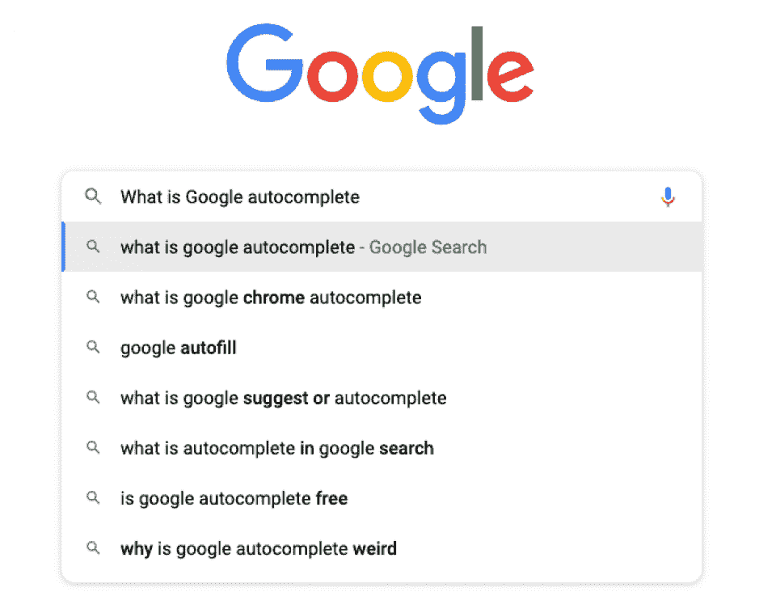
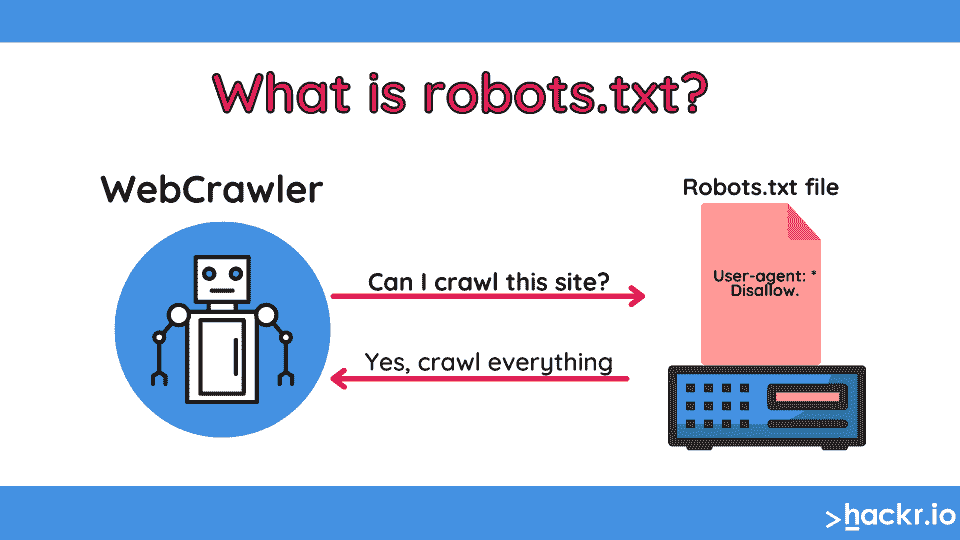
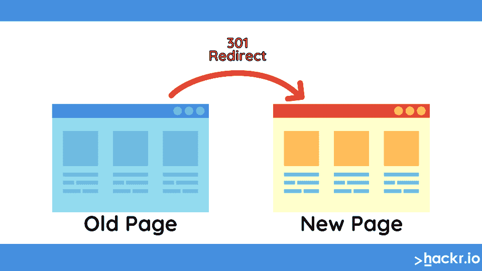
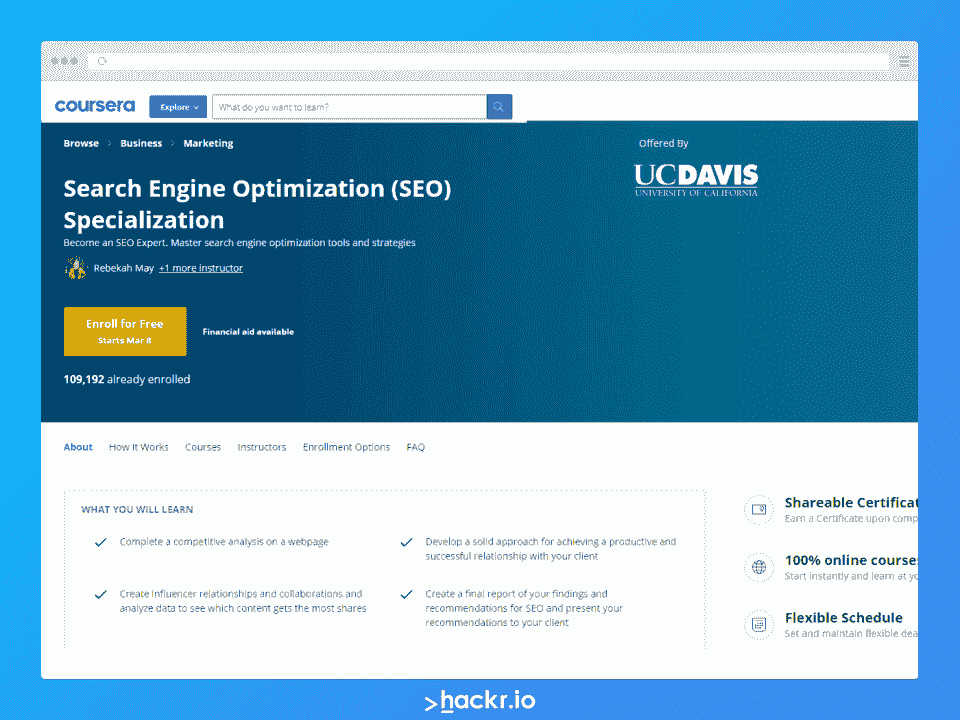

# 40 多个顶级 SEO 面试问题:初级、中级和高级

> 原文：<https://hackr.io/blog/seo-interview-questions>

要明白 SEO 是一个变化非常快的学科。人们理解这一点。如果你一年前学习了 SEO，可能会有一些你现在不了解的变化——这是一个不断发展的学科。SEO 主要与谷歌打交道，而谷歌对它所做的修改并不完全透明。通常，SEO 专家需要“弄清楚”到底发生了什么。

这对你意味着什么？你需要对你的 SEO 知识有信心，因为事情总是在变化的。在搜索引擎优化面试中，搜索引擎优化专家希望知道你了解基础知识 ，并且知道如何跟上这些变化。

## 基础 SEO 面试问题

任何从事 SEO 的人都应该能够回答这些基本的 SEO 问题。SEO 面试通常会从一些基本问题开始，以衡量你对一般市场的理解。如果你正在参加一个 SEO 面试，却不知道这些问题的答案，你可能需要复习一下。

### 1。什么是搜索引擎优化？

最基础的 SEO 面试问题: [什么是搜索引擎优化](https://hackr.io/blog/what-is-seo) ？SEO 是使一个网站在搜索引擎中排名靠前的过程。

### 2。什么是技术型 SEO？

技术 SEO 可以分为两部分:服务器端和客户端。服务器端的技术搜索引擎优化包括优化你的 robots.txt，网站地图，确保你不会阻止搜索引擎抓取你的网站，如果你移动或重新设计了一个页面，设置 301 重定向。

客户端技术 SEO 包括确保你的网站在代码中设置正确。例如，如果你使用 WordPress，你是否使用了子主题？你确定把永久链接设置成正确的格式了吗？你在页面和文章之间设置了规范吗？你是否正确地使用了内部链接？你的网站对移动用户有反应吗？

### 3。为什么 SEO 很重要？

搜索引擎优化很重要，因为搜索引擎会增加网站的流量和销售额。如果没有人能在网上找到你的网站，你将无法获得销售或客户。

### 4。什么是域权限？

域名权威是 Moz 创造的一个分数，用来衡量一个网站在互联网上的权威性和影响力。这个分数是 100 分对数标度。

### 5。搜索引擎最重要的因素是什么？

对搜索引擎来说，最重要的因素是向用户提供最好的结果。

### 6。有机搜索结果和付费搜索结果有什么区别？

有机搜索结果是出现在搜索引擎顶部的列表，这些是免费列表。谷歌或必应上的付费搜索结果通常是出现在搜索引擎右侧或顶部的广告。

### 7。哪些元标签最重要？

最重要的元标签包括标题标签、元描述(出现在搜索结果中)和元关键字标签。

### 8。你应该把关键词放在哪里？

你应该在页面标题、正文和元描述中包含关键词。在过去，人们可能会在正文中“填充”关键字。今天，最好在语义上包含相关的关键词，而不是试图多次关注一个关键词。

### 9。哪些搜索引擎最重要？

谷歌和必应是最重要的搜索引擎。迄今为止，谷歌是 T2 最受欢迎和最重要的搜索引擎。

### 10。什么是 alt 标签，它们有什么作用？

alt 标签是描述图像的 HTML 标签。这些标签对 SEO 很重要，因为搜索引擎不能读取图像，但是 alt 标签中的信息告诉搜索引擎那张图像是什么。

### 11。什么是谷歌分析？

Google Analytics 是 Google 的免费产品，向您展示您的客户是如何使用您的网站的。它会告诉你它们来自哪里(有机的，付费的，等等。)，他们使用什么设备，以及他们的地理位置。用户界面可能有点让人不知所措，但重要的是你知道如何使用它。

[SEO 培训大师班 2023:初级到高级 SEO](https://click.linksynergy.com/deeplink?id=jU79Zysihs4&mid=39197&murl=https%3A%2F%2Fwww.udemy.com%2Fcourse%2Fseo-with-google-other-large-platforms-to-get-great-scale%2F)

这些中级面试问题是针对 SEO 专家或高级 SEO 专家的面试问题。他们假设被采访的人对这个学科有中级到高级的知识，并且他们已经在这个学科工作了一段时间。

### 12。什么是谷歌自动完成？

Google Autocomplete 是 Google 发明的一种算法，用于搜索用户可能不知道如何拼写的术语，或者当他们在搜索栏中输入术语时。

### 

### 13。什么是关键词频率？

关键词频率是一个特定的关键词或短语在你的网站上出现的次数。当你在做 SEO 的时候，让关键词或者短语在页面上出现多次是很重要的，这样 Google 就知道这个页面是关于什么的了。它不应该与关键字密度混淆。一个关键词在 200 个单词中出现 5 次，和一个关键词在 2000 个单词中出现 5 次是不一样的。

### 14。什么是关键词密度？

关键词密度是特定关键词或短语占页面总字数的比率。例如，如果你的网站有 200 个单词，你的关键词被提到 5 次，那就是 10%的比率。

### 15。什么是关键词量？

关键词量是特定关键词或短语的总搜索次数。知道这一点很重要，因为如果你的网站排名很低，你就不太可能获得流量。

### 16。什么是关键词难度？

关键词难度是指某个特定关键词或短语的排名有多难。关键字难度(或 KD)的计算方法是，将特定短语的搜索次数乘以排名前 10 位页面的页面权限。这不是一个硬性规定，而是一个衡量排名难度的通用指标。

### 17。长尾关键词的定义是什么？

长尾关键词是一个搜索量低但购买意愿高的特定短语。一般是 4-5 个字的长度。一个例子是“在网上买红色的衣服”很多人把长尾关键词定义为任何超过四个词的关键词。但在更广泛的层面上，长尾关键词是一个更具体的针对更小的利基市场的关键词。

### 18。什么是跳出率？

反弹是指有人来到你的网站，然后没有停留在页面上就离开了。退场率，或者说跳出率，是来到你的网站并马上离开的人的百分比。如果你的网站有 40%的跳出率，这意味着有 40%的人会立即离开。

### 19。robots.txt 是什么？

Robots.txt 是一个文件，你可以用它来告诉搜索引擎你网站上的哪些页面可以被抓取和索引。许多人用这个来屏蔽他们网站上不想让谷歌抓取的部分，或者强调他们网站的结构。

### 20。什么是反向链接？

反向链接是其他网站到你网站的链接。搜索引擎在计算一个网站的重要性或其域名权威时会查看这些链接。拥有反向链接对 SEO 来说很重要，但是你应该永远记住质量链接比数量更重要。

### 21。什么是页面内与页面外 SEO？

页面搜索引擎优化是你可以在网站范围内做的任何事情，来帮助排名。比如有一个清晰的标题标签，一个元描述和内部链接。离页搜索引擎优化是你在你的网站之外做的任何事情，以帮助它排名更高，如在社交媒体上发布它，以产生活动和潜在的反向链接。

### 22。什么是“黑帽”SEO？

黑帽 SEO 是一种用来给网站排名的诡计。这包括在网站上隐藏文本、填充关键字和操作链接。这不是获得高排名的推荐策略，因为谷歌会不断更新其算法来检测和惩罚任何此类活动。

白帽 SEO 是任何形式的道德搜索引擎优化策略。这意味着不使用诡计或不光彩的方法来排名你的网站。白帽 SEO 是被谷歌认可的，这让你在尝试给你的网站排名时有优势。

### 23。SEO 和 SEM 有什么区别？

SEM 是搜索引擎营销的缩写。这包括你在搜索引擎上做的任何形式的点击付费(PPC)广告，包括谷歌广告和必应广告。当有人搜索一个短语时，他们在谷歌侧边看到的广告是 SEM。

SEO 是搜索引擎优化，它包括你用来在有机搜索结果中排名更高的策略，而无需付费。

### 24。nofollow 和 dofollow 链接有什么区别？

Nofollow 链接是应用了 nofollow 标签的链接。一个链接的目的有两个:提供信息或者对你想推广的网站/页面进行排名。nofollow 标签告诉搜索引擎在给你的网站排名时不要给这个链接任何权重或权威。他们看不到任何关注链接，就好像它们不存在一样。

DoFollow 链接是常规的、正常的超链接，确实传递了权威或权重。搜索引擎在给你的网站排名时不会忽略这些链接。

### 25。什么是 301 重定向？

301 重定向是永久性的。你可以用它们将人或搜索引擎从一个 URL 发送到另一个。如果您已经移动了您的网站，或者如果您想要通过将人们转发到正确的位置来使内容更容易找到，这将非常有用。

### 26。你如何让一个页面被索引？

被索引的页面意味着搜索引擎已经准备好抓取和索引你页面上的内容。你可以通过使用谷歌搜索控制台来提交你的站点地图。你也可以直接告诉谷歌，提交你想单独索引的每个页面的网址。如果你提交了太多的网址，谷歌可能会忽略它们。

### 27。域名如何影响 SEO？

更高的域名级别将会有更大的整体搜索引擎优化权威。这意味着如果你使用. com，而你的竞争对手使用. net，你可能会在 SERPs 中排名更高。这要归功于 a .com 在谷歌眼中赢得的信任和权威。

### 28。获得反向链接的最好方法是什么？

获得反向链接的最好方法是自然地建立它们。这意味着在社交媒体上发布你的网站或内容，为其他网站写客座博文，或者在其他人谈论你的行业的文章中出现。

### 29。什么是谷歌我的业务？

Google My Business 是 Google 的免费目录列表工具。它允许你在谷歌地图上列出你的企业，也允许你更新你的企业简介。这对 SEO 很重要，因为它给了 Google 在相关搜索结果中显示你的业务所需的信息。

### 三十岁。什么是竞争对手分析？

竞争对手分析是一份详细描述竞争对手 SEO 策略的报告。它列出了他们所有的排名关键词，也显示了他们在 SERPs 中的表现。

## 高级 SEO 面试问答

这些是高级 SEO 专家面试问题。这些 SEO 工作面试问题会假设某人已经在这个行业工作了几年，甚至在 SEO 策略方面领导过团队。这些是 SEO 经理职位的面试问题；处于初级 SEO 位置的人不会被期望知道答案。

### 31。什么是潜在语义索引？

潜在语义索引是一种增加搜索引擎结果相关性的索引方法。这有助于搜索引擎将搜索查询与最佳页面相匹配。

### 32。是什么让网站搜索引擎变得友好？

搜索引擎友好的网站是按照 SEO 最佳实践来编码的。它们有大量的相关内容、可靠的导航和快速的加载时间。

### 33。是什么让一个网站移动友好？

如果一个网站在智能手机和平板电脑上看起来不错，那么它就是移动友好的。它应该适合屏幕，不需要任何滚动，易于单手操作，内容易读。

### 34。你如何衡量 SEO 的成功？

在审视你的 SEO 成功时，有几个因素需要考虑:关键词排名、流量和有机搜索的转化率。你需要设定你的商业目标，以衡量你的搜索引擎优化的成功。

### 35。你如何地理定位一个网站？

网站的地理定位通常是通过在元页面标题和文本中添加位置名称，以及撰写特定区域内的事件和景点来实现的。对于实体企业来说，地理定位是一个必不可少的过程。

### 36。你是如何进行关键词研究的？

要进行关键词研究，你需要了解搜索引擎是如何工作的。如今，最好的关键词越来越长，越来越具体。他们的目标是寻找非常具体的产品、服务或信息的人。

### 37。什么是链接建设，为什么它很重要？

链接建设是获取入站链接的过程。这些进来的链接向谷歌表明你的网站或博客是权威和值得信赖的。他们也给你的网站带来流量。链接建设对于 SEO 的成功非常重要。

### 38。如何提高页面速度？

你可以通过使用 CDN、调整图片大小以及寻找减少网站重定向次数的方法来提高网页速度。谷歌也有一个页面速度工具，可以帮助你诊断性能问题，像 WebPagetest 这样的工具可以让你在真实的移动设备上测试你的网站。

### 39。如何赢得谷歌特色片段？

为了赢得一个谷歌特色片段，你需要有很高的页面权威，正确的结构，和一些运气。在某些情况下，赢得谷歌片段可以导致有机流量的大幅增加——但这很难。

第一，页面权限。如果你没有好的域名权威，你根本不可能赢得一个片段。但是如果你正在为一次大的推进做准备，你可能想从一开始就包含一些片断，要知道你不会马上赢得这些片断。说到片段，页面权威是相对的。如果你看到一个的权限比你 低的页面当前有一个片段，这个片段你可能会赢。

第二，你需要正确的结构。食谱、列表、定义、比较和“精华”片段表现更好。谷歌希望当搜索者提出类似这样的问题时，能够立即给出正确的答案

*   最好的 CRM 解决方案是什么？
*   你如何烹饪一只鸡？
*   应该选斯巴鲁傲虎还是斯巴鲁福雷斯特？

如你所见，这些片段通常也是对一个直接问题的回应。

最后，还有运气的成分。因为我们不知道谷歌的算法，你无法“保证”一个片段。你能做的就是确保你发布的每一篇高质量的内容都有一个选项 。这增加了你在整个网站上获得片段的机会。

### 40。你见过哪些常见的 SEO 错误？

准备好描述你自己的背景和一些最常见的 SEO 错误。常见的 SEO 错误包括关键字填充(在一个页面上添加太多关键字)，关键字蚕食，或者只是在没有任何策略的情况下在页面上添加关键字。此外，建立错误类型的链接是有害的，会让你的网站受到惩罚。

##  **获得 Coursera 认证的 SEO**

## 最重要的 SEO 工具

除了一般性的问题，SEO 面试官会经常问一些特定的技术。这些都是行业标准技术。你可能没有广泛地使用它们，但是你可能至少遇到过它们。在面试前温习一下这些工具是个好主意。

### 41。尖叫青蛙是用来做什么的？

尖叫的青蛙是一个搜索引擎优化爬虫，它向软件发送关于你的网站的数据。您可以使用这些信息来发现网站上的问题和机会。

### 42。塞姆拉什是做什么用的？

[SEMrush](https://semrush.sjv.io/c/2890636/1008501/13053) 是一款多功能的 SEO 软件。搜索引擎营销人员可以使用它来研究竞争对手，跟踪他们的结果，监控排名，并找到最佳的目标关键字。

### 43。什么 是 Ahrefs ？

Ahrefs 是一个全面的 SEO 套件，包括竞争对手分析、关键词研究、链接建设等等。有了 Ahrefs，企业可以努力提高自己的域名评级和谷歌排名。

### 44。你如何使用谷歌搜索控制台？

谷歌搜索控制台可以让你深入了解你的网页的性能，包括你的网页目前在搜索引擎结果页面上的排名，以及你的网站如何随着时间的推移而流行。

## 在 SEO 面试中你应该说什么？

介绍你自己，讨论你在 SEO 领域的背景和历史。进一步，讨论你正在做什么来提高你的 SEO 知识，你未来的目标，以及你下一步想学什么。SEO 是一个不断发展的行业；你的面试官想知道你是否愿意提高自己的技能。

## 面试技巧

仅仅能够直截了当地回答问题是不够的。你需要对这个领域有透彻的了解，并且有足够的自信去展示它。SEO 是一个非常严谨的职业；很多都需要深入分析。你不可能在几分钟内围绕一个关键词发起一场搜索引擎优化运动；你应该知道允许你这样做的基本原则。

### 关注 HubSpot、Ahrefs 和 Backlink.io 等 SEO 博客

这些 SEO 博客将阐明最新的 SEO 策略。他们还将探索新的策略和新的理论。你将跟上最新的发展，同时也能够深入挖掘 SEO 的基本原则。通常，面试官会问你类似“你从哪里获得搜索引擎优化新闻？”或者“你最近从 SEO 中学到了什么？”准备好回答这些问题，阅读更多关于当前的搜索引擎优化景观。

### 深入研究像尖叫青蛙和 SEMrush 这样的搜索引擎优化工具。

如果你不熟悉 Ahrefs、Google Analytics 或其他行业标准产品，现在是时候了解它们了。这些产品中的大多数都被有意设计成使用起来相对容易和直观。这是因为成为 SEO 专家的大部分是关于策略的；这些工具不会为你做所有的事情，它们只是给你创建正确计划所需的信息。

[了解更多关于 SEMrush 的信息](https://semrush.sjv.io/c/2890636/1008501/13053)

### 谈谈你在 SEO 方面的经验和学到的东西。

当你在面试的时候，谈谈你在那之前在 SEO 领域做了什么。你可能会惊讶地发现你的资历已经给人留下了深刻的印象。因为 SEO 是一个新兴的行业，而且变化如此频繁，人们经常成为“冒名顶替综合症”的受害者。但是，如果你在过去为客户取得了任何积极的成果，你就已经在 SEO 方面取得了成功。在大多数情况下，SEO 面试官不太关心你描述技术术语的能力，而更关心你展示实际结果的能力。

### 准备带领某人完成你的搜索引擎优化过程。

当你得到一个新的 SEO 客户端时，你会怎么做？每次你开始一项活动时，你的流程是什么？从一个本地企业加载一个页面，思考你将如何为他们创建一个新的活动策略。让自己做好准备，让别人了解你的 SEO 过程，不仅仅是你做了什么，还有你为什么要这么做。这将让他们更深入地了解你的思维方式，以及你对这个过程了解多少。

### 写下一些问题，向他们询问他们的流程。

记住面试也是一个学习的机会。提前写下一些你想从他们那里知道的问题。他们用什么工具？他们选择什么关键词？他们怎么知道他们想去哪一页？他们刷新旧页面的流程是什么？他们如何确保他们的技术搜索引擎优化符合要求？所有这些问题实际上会为你将来的面试和你在公司的未来做好准备。

## 结论

SEO 面试既是获得工作的机会，也是展示你技能的机会。除了温习 SEO 之外，还可以把它当成一个学习更多行业知识和了解更多其他公司正在做的事情的机会。他们使用什么工具？他们遵循什么原则？

搜索引擎优化行业发展如此之快，以至于很少有“错误”的答案，只有错误的过程。你需要对 SEO 是什么以及它是如何工作的有一个透彻的理解——但是除了基础知识之外，还要明白技术是会改变的。

现在，你可以钻研搜索引擎优化教程 ，了解更多关于谷歌的工作方式，并研究网站优化的技术层面。