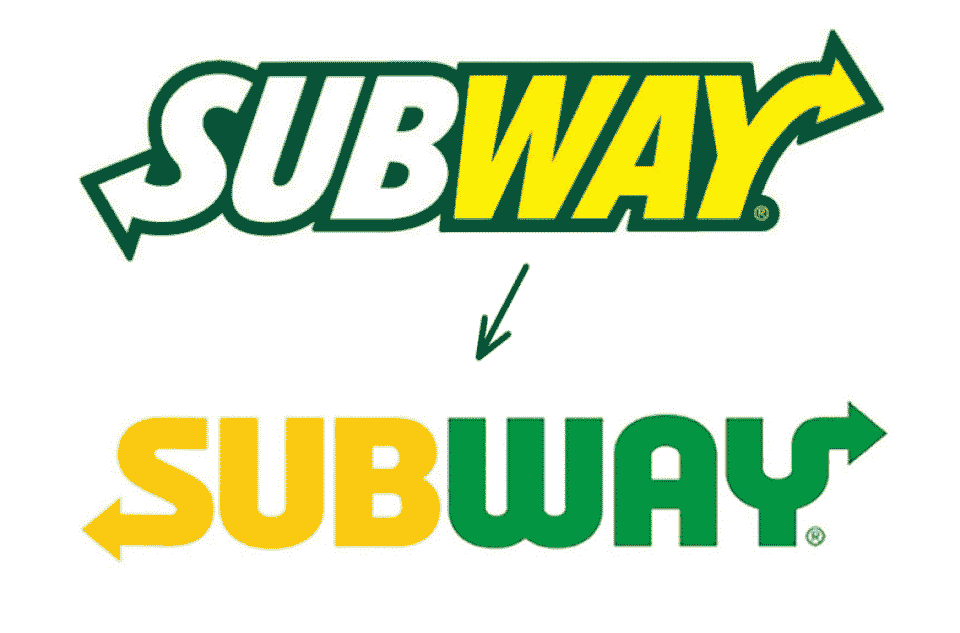
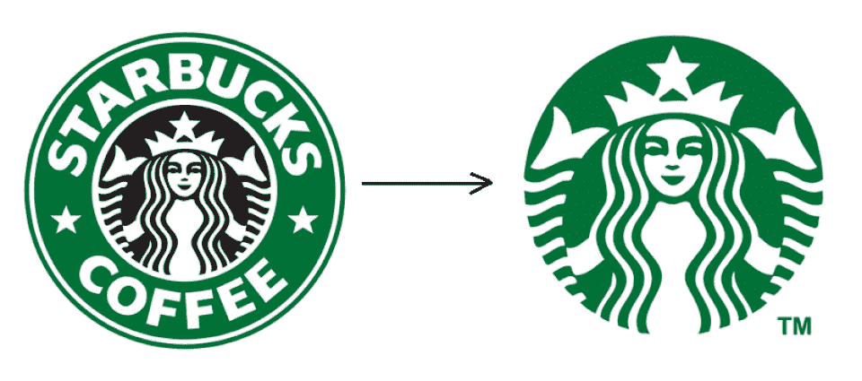
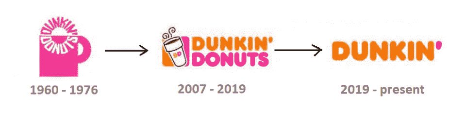
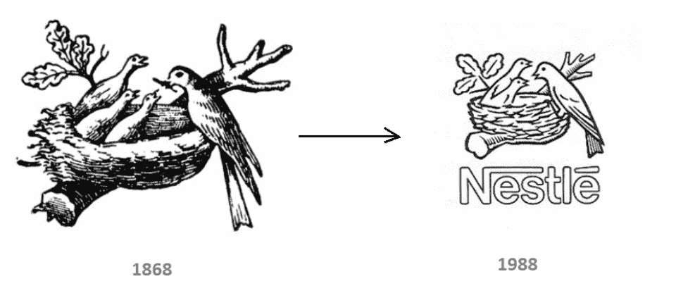
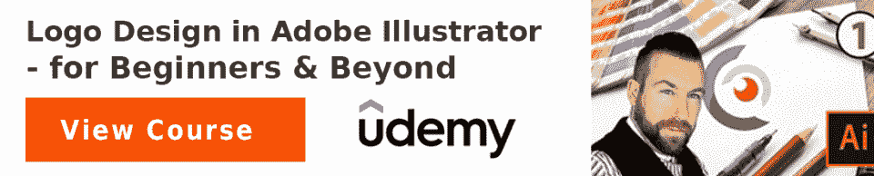

# 5 个标志是时候重新设计你的标志了

> 原文：<https://hackr.io/blog/signs-its-time-to-redesign-your-logo>

你还记得谷歌上世纪 90 年代的标志吗？看着它，你会想起年轻的美国第 42 任总统夏奇拉的照片，还有你口袋里的 CD...

随着时间的推移，事情发生了变化。

对于一个公司或品牌来说，永远保持其身份和标志不变是错误的。一些人认为更换商标会带来负面影响，而另一些人则认为保持旧的外观太久弊大于利。

对于不久前推出的品牌和根据设计趋势制作标识的企业来说尤其如此。时代在变，趋势、技术和消费者行为也在变:你的 logo 可能不再像以前那样新鲜、相关和可信。

[平面设计](https://hackr.io/blog/graphic-design-books)是一个优秀的时标。我们周围的标志和符号比建筑、服装或技术变化快得多。我们总是对过时的设计有一种直觉。问题是，到底是什么*让它如此？*

 *下面是五个标志，是时候[为你的企业创造一个酷的标志了](https://create.vista.com/create/logo-maker/)。看看你目前的标志设计，如果出现以下情况，开始发出警报:

## 1)它的字体已经过时

字体是最容易过时的，很少有例外。这条规则不适用于经典和中性字体，比如说，已经流行了半个世纪的 Helvetica 字体。

但品牌很少选择经典和中性的字体作为标志，试图用排版来表达他们的排他性，这就是为什么他们的字体在标志重新设计过程中经常发生最大的变化。

故意粗糙的方形字体现在已经过时了:它们看起来笨重、笨拙，好像来自 21 世纪的某个地方。

另一个过时的效果是字母周围的轮廓。在大多数情况下，这是公司试图在他们的标识中避免的不必要的元素。

自定义样式应该在很长一段时间内保持相关性，所以设计师在制作时尽量避免使用沉重的、额外的装饰性字体。字母越花哨，过时越快。

然而，简单的元素也需要定期更换:更圆、更有棱角、更宽、更长的字母现在说了算。

## 2)它有过多的细节

现代设计力求简洁:你的标志越简洁，在移动界面或桌面版本中使用的功能就越多，例如打印在三米长的横幅上或放在一支钢笔上。

因此，今天许多品牌重新设计他们的标志，去掉不必要的元素，创造一个简单的[响应设计](https://hackr.io/design)。

Logo 简化不是万能的，元素丰富的设计也有一席之地。然而，简洁的标志看起来更相关和现代，更容易记住，并给品牌更多的机会在不同的媒体和设备上展示。

## 3)它包含 3D 图形

三维图形已经成为设计趋势好几年了，但它似乎并没有立即完全吞没标志球，这是一个好现象。

谷歌旧标志的体积字母是一种大多数设计师会称之为不礼貌的效果，现在很少使用。相反，品牌拒绝考虑标志的数量，而是选择 2D 图形。

3D 标志设计在某种程度上是关于#2 标志中提到的过多细节。你几乎不需要它，因为它经常使感知变得复杂。

## 4)颜色太丰富了

颜色是品牌标识的一部分，它们不会像字体或形式一样过时，所以在重新设计你的标志时，你几乎不需要改变它们。红色、黄色、蓝色、绿色、紫色——所有这些都超越了潮流和时间。诀窍是对在一个标志设计中加入所有这些元素说不。

正如你可能注意到的，有多色标识的公司通常会放弃它们，而倾向于单一的主导品牌颜色。

有时，是一种[颜色组合](https://hackr.io/tutorials/learn-color-theory)让你的 logo 变得过时。一旦成功的颜色组合出现，许多设计师开始在他们的作品中使用它。因此，我们到处都能看到看起来一样的标识，这损害了品牌认同和沟通。

你的标志颜色越少，与其他企业融合并失去你的品牌知名度和认知度的威胁就越小。

## 这是老式的

标志设计不仅仅是一种形式，更是一种内容。可能会发生你的 logo 不再跟随时代的脾气了。

例如，你可能已经有了一个固定的客户群，但是你的品牌已经准备好和年轻客户说话了。在这种情况下，标志重新设计可以帮助您联系新的受众。或者，你的业务扩大了，你增加了[个新产品](https://hackr.io/tutorials/learn-product-design)，而你的标志不再覆盖它:

这就是达美乐在更新其可识别的标志时所遵循的指导方针:现在，他们不仅仅是披萨，他们的新标志反映了他们菜单的增加。

或者，让我们看看 Dunkin' Donuts 标志的演变。首先，他们在里面放了一个标准的咖啡杯，但后来用一种纸质的外带咖啡代替了它。生活变了，顾客更愿意带着咖啡出去，而不是坐在咖啡馆里，这就是 Dunkin' Donuts 现在的形式。

嗯，他们今天的标志根本没有杯子，但那是另一个故事，我们讲过的关于标志简化和没有过多细节的故事。

另一个例子是雀巢标志的演变:

19 世纪，鸟巢中有三只小鸟，但自 20 世纪 80 年代以来，只有两只小鸟在那里。传说这是因为现代欧洲家庭没有过去那么多孩子了。

这只鸟的消失可能只是为了更好的构图，但这个故事仍然很重要。有时一切都很明显:你不再在里面喝咖啡了，所以你必须就咖啡外带进行沟通。有时你的服务不会改变，但信息会改变——所以你的标志应该把这些变化传达给观众。

## 标志重新设计与标志更新

如果你的 logo 符合以上至少一个标志，可能是时候重新设计了。但是，不要急着把它里面换出来。也许，稍微刷新一下就够了。

徽标更新是指对调色板、字体、信息或简化整体外观的轻微更新。把它想象成一次改造:设计师对已经存在的东西做一些小的改变。

反过来，标志的重新设计让人想起了一次大规模的整形手术:你采用了新的配色方案、新的信息传递方式，甚至是公司名称的新变体(就像联邦快递(Federal Express)变成了联邦快递(FedEx))。

例子:[动物星球](https://1000logos.net/animal-planet-logo/)。

他们希望向全世界展示他们的品牌，并需要在全球范围内进行翻译。因此，颜色、字体和熟悉的文字都被一个更简化的版本所取代，用一只大象来捕捉品牌的个性。

在您决定是否更新或完全重新设计您的徽标之前，请回答以下问题:

1.  **我现在的 logo 怎么了？**考虑我们上面提到的五种迹象。
2.  在新版本中，我的徽标需要保留哪些元素？特定的颜色、大写字母或形式可以传达您品牌的本质，并作为受众的识别标志。
3.  我的标志与我的顾客有很强的关联吗？您的受众可能会对您的旧徽标产生强烈的视觉联系，因此其完整的重新设计可能会显得很戏剧化，让他们感到困惑。花些时间去探索标志重新设计的可能后果，并理解这个游戏是否值得。也许，稍微刷新一下 logo 会更合适。

你的标志的任务是传达品牌身份，吸引你的目标受众，给他们一个积极的第一印象。刷新或重新设计您当前的徽标时，请记住这一点。

## 外卖食品

所有的品牌都会不时地重新设计他们的商标。这是一种常见的做法，特别是对于不久前推出的企业或基于设计趋势创建其徽标的企业。时代在变，趋势和客户行为也在变，让你现在的 logo 看起来过时了，不像以前那么可信了。

在这篇文章中，我们讨论了五个标志，它们可以帮助你判断你的 logo 是否需要重新设计或者更新。但是请认真对待这个过程:

确定哪些标志元素对你的品牌至关重要，哪些可以告别。当你 100%准备好，并且确信这些改变不会伤害你的品牌认知度、信息和客户群时，开始重新设计的过程。

如果你对学习标志重新设计感兴趣，我们强烈推荐这门课程。

*