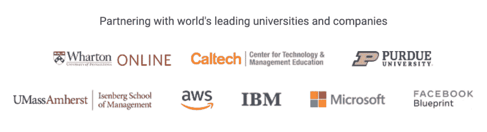
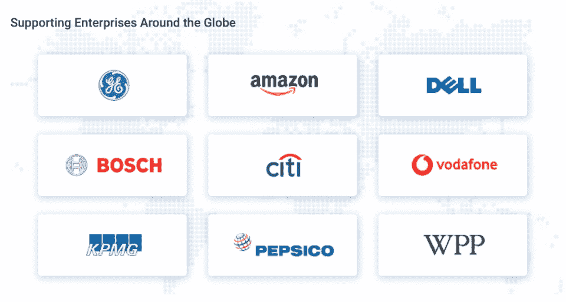
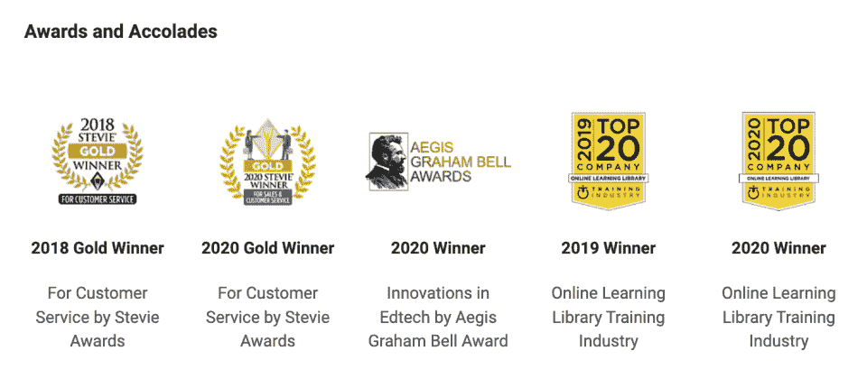
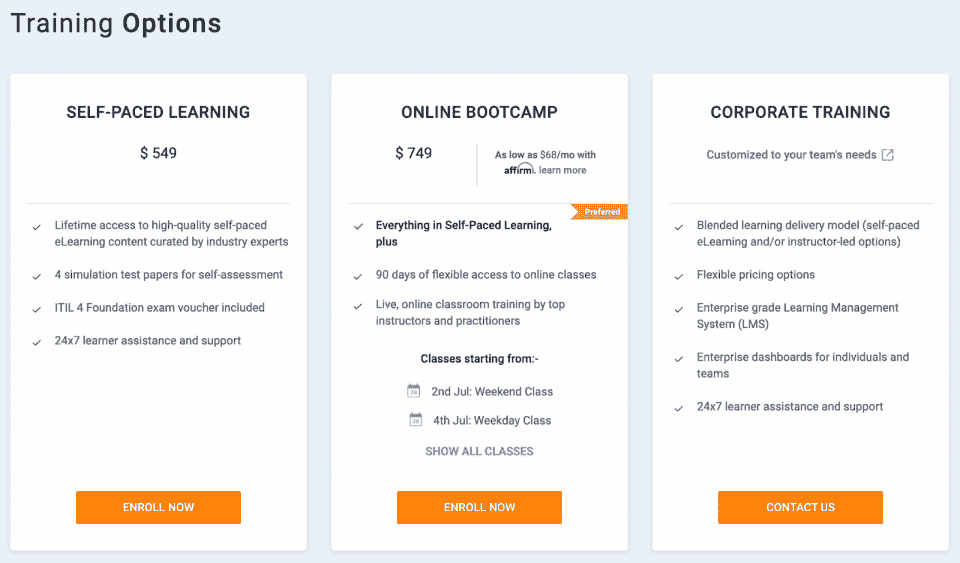
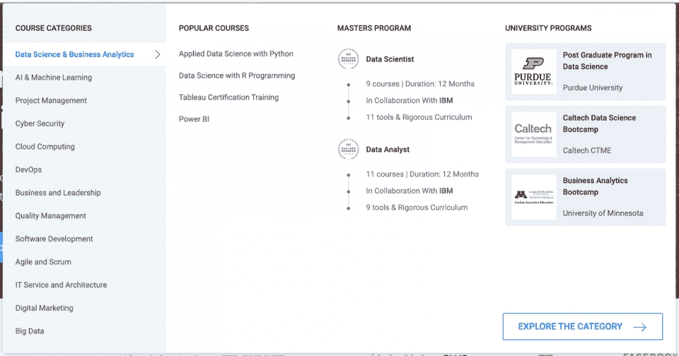

# Simplilearn 评论:优点、缺点和选择[2023]

> 原文：<https://hackr.io/blog/simplilearn-review>

Simplilearn 是全球 40 多家培训机构认可的最佳在线课程学习平台之一。它提供了一种独特的学习方式，通过自定进度的学习视频和现场讲师指导课程进行学习。

| 教练 | 5/5 |
| 课程 | 4/5 |
| 经验 | 4/5 |
| 总数 | 4.3/5 |

**一览:**

*   Simplilearn 是全球大多数雇主和 40 多家培训机构认可的官方认证培训提供商。
*   Simplilearn 提供不同的学习计划:**自定进度**如果你想慢慢来，走自己的路；以及**在线训练营**如果你想混合自定进度和现场讲师指导培训。
*   Simplilearn 通过一些课程的现场讲座脱颖而出。
*   学习起价 600 美元，最高可达 3000 美元。
*   虽然在业内广受好评，但 Simplilearn 的评论有时可能会显示一些学生对平台上一些课程质量的不满。

那么，Simplilearn 值得吗？

在这个 **Simplilearn 评论**中，我们将讨论关于该平台的所有信息，它是如何工作的，它的成本是多少，以及它的[认证](https://hackr.io/blog/best-cybersecurity-certification)是否有价值。我们还将对每个方面进行分解和评级，让您对 Simplilearn 有一个整体的了解。Simplilearn 适合你吗？请继续阅读，寻找答案！

## 什么是 Simplilearn？

Simplilearn 是一个在线[学习平台](https://sites.google.com/site/videoblocksreview/online-learning-platforms)，由克里希纳·库马尔于 2009 年在印度本加卢鲁创建。作为官方在线认证培训提供商，Simplilearn 与 IASSC 和 PMI 等 40 多家认证机构合作，帮助学生获得认证。这个多次获奖的公司现在在印度的班加罗尔和加州的旧金山都有办公室。

### Simplilearn 合法吗？

绝对的！对在线学习平台保持警惕是很正常的，尤其是当他们的要价无论如何都不是微不足道的时候。但是，你可以放心，Simplilearn 是 100%合法的。不相信我们？让下面的信息来说话吧:

Simplilearn 与世界知名的教育和技术公司合作。

Simplilearn 继续为全球公司提供教育，帮助他们提高员工技能。

Simplilearn 获得了许多奖项和荣誉，包括下面截图中的那些。

底线？如果你报名参加 Simplilearn 的课程，你的钱(和学习经验)会得到妥善保管。

### Simplilearn 是否得到认可和认证？

如果你正在寻找可以作为继续大学或研究生教育学分的课程，你可能在这里找不到。

然而，因为它是全球四十多个培训机构认可的官方认证培训提供商，Simplilearn 提供雇主认可的证书。它与 IASSC、PMI 和 Exin 等全球认证机构合作，确保其课程仅由在各自领域备受尊敬的资深专家开发。

Simplilearn 认证值得吗？在我们看来，绝对是。事实上，全球未来的雇主认可来自该平台的认证是有效的和受尊敬的，这使得 Simplilearn 上的课程是一项值得投资的投资。你可以将证书添加到你的简历和 LinkedIn 个人资料中。

### 谁应该使用 Simplilearn？

对于任何想学习新技术或商业技能的人来说，Simplilearn 是一个极好的选择。但是，如果你是一名寻求“升级技能”或提高你的知识和技能的专业人士，它可能是你的*完美的*选择。通过 Simplilearn 获得的知识可以帮助你改善职业生涯，尤其是如果你在课程期间表现出色的话。

Simplilearn 区别于其他类似平台的一点是，它认识到不是每个人都以相同的方式学习。Simplilearn 明白，有些人比其他人更喜欢不同的学习方法，这就是为什么该平台的许多课程有多种学习选择。如果你喜欢发号施令，你可以选择自定进度。或者，如果您在参加现场讲座时表现最佳，您可以选择在线训练营选项。

Simplilearn 似乎对每个人都有帮助——或者至少对那些想在技术和商业领域学习的人有帮助。

## Simplilearn 是如何工作的？

注册 Simplilearn 既简单又直观。一旦你有了帐户，你就可以开始注册课程。然后，您可以选择自定进度或现场课程。Simplilearn 课程一般持续一个月左右，尽管有些可能更短或更长。要求学生观看视频，参加现场讲座(如果符合条件)，完成测验，完成项目和作业，并完成期末考试。

### **如何开立 Simplilearn 账户**

在 Simplilearn 注册一个帐户非常简单，只需遵循以下步骤！

1.  进入[Simplilearn.com](https://simplilearn.com)，点击页面右上角的中的**登录。**
2.  从下一页，点击**注册**。
3.  选择你喜欢的选项，然后按照指示去做——就是这样！

## **Simplilearn 的利与弊**

Simplilearn 好吗？这可能很难决定，但这些利弊可能会有所帮助:

| **优点** | **缺点** |
| 课程质量极高，由经验丰富的专家教授

*   免费课程通过 SkillUp 提供，但它们与 Simplilearn 上的课程不同
*   许多课程为学生提供自定进度或在线训练营的选项，以便他们选择最适合自己的学习方法
*   Simplilearn 为它的一些课程提供现场讲师指导讲座，这是大多数其他学习平台所不提供的
*   您通过完成课程获得的证书是被认可的，因为 Simplilearn 被认可为官方认证培训提供商。这是 Simplilearn 证书值
*   客户支持非常出色，反应非常迅速。选择电话(或要求回电)或实时聊天
*   Android 和 iOS 上都有移动应用
*   您可以下载课程内容进行离线查看
*   Simplilearn 具有社区功能，允许与他人互动，因此您可以要求(或给予)反馈和指导
*   有一个 7 天的[免费试用期](https://www.simplilearn.com/terms-and-conditions#free-trial)你可以注册
*   有 7 天退款政策
*   平台上的支付选项有限，你只能通过信用卡或借记卡(万事达卡或维萨卡)和贝宝支付。值得一提的是，如果你想将你的付款分成更小的金额，Simplilearn 似乎可以通过 Splitit、Affirm 或 ClimbCredit 来接受付款

 | 与其他平台相比，Simplilearn 的 400 多门课程库要小得多

*   虽然 Simplilearn 在超过 176 个国家/地区提供，但课程仅提供英语版本。也没有字幕——如果英语不是你的第一语言，你可能会感到吃力
*   许多课程评论都对课程质量不满意，Simplilearn 是否已经解决了这些问题还有待观察
*   Simplilearn 课程多少钱？
*   Simplilearn 根据课程提供不同的培训选项。一些课程只提供自定进度的学习，而其他课程只提供在线训练营选项。然后，当然，你会得到两种选择都有的课程。所有课程似乎都提供企业培训，但如果你想知道价格，你需要联系 Simplilearn 的销售人员。

 |

## 

自定进度学习的起价似乎在 400-500 美元左右，而在线训练营的起价在 700 美元左右。Simplilearn 提供一次性购买的课程。

Simplilearn 退款政策

Simplilearn 确实提供 7 天的退款政策。如果您对某门课程不满意，从购买之日起，您有七天的时间来退货退款。但是，重要的是要记住，如果出现以下情况，您将**不再有资格获得退款:**

### 您已经访问了 25%或更多的课程内容

您已经下载了本课程的电子书

*   您已经参加了超过一天的在线/直播课程
*   如需了解更多信息，您可以点击查看 Simplilearn 的信息页面[。](https://www.simplilearn.com/terms-and-conditions#refund-policy)
*   Simplilearn 提供免费课程吗？

只是在最近，Simplilearn 增加了一个免费试用选项，让你试用该平台七天。在此之前，你只能看到课程预览，仅此而已！

### Simplilearn 不免费提供任何主要课程。然而，有一个好消息——2023 年 5 月在[，Simplilearn 的 SkillUp 平台上线了。](https://www.simplilearn.com/introducing-simplilearn-skillup-program-article) [SkillUp](https://www.simplilearn.com/skillup-free-online-courses) 是 Simplilearn 网站的一个特殊部分，为每个人提供许多免费课程。在 SkillUp 上，学习者可以学习超过 1000 个小时的约 300 多种非常受欢迎的技能。

Simplilearn 上有哪些课程？

Simplilearn 提供数据科学家、全栈开发者等硕士项目。它也提供大学课程。当你参加 Simplilearn 的一个大学项目时，你会得到你通常会得到的所有好处，就像你实际上参加了大学一样，例如大学证书、校友身份和职业支持。

## 除了这些选择，你当然还有 400 多门技术和商业相关的课程。

Simplilearn 有十三个主要类别(见上面的截图)。你可以期望了解网络安全、数据科学、云计算、DevOps、人工智能和机器学习等方面的知识。

**如何找到最好的 Simplilearn 课程**

如果你想找到最好的 Simplilearn 课程，请考虑以下几点:

## **查看所有课程信息** -每个课程页面都有大量信息，可帮助您决定该课程是否适合您。你甚至可以**预习**课程中包含的一些课程。**课程常见问题解答**也可以帮助回答你的一些问题。

[报名参加免费试用](https://www.simplilearn.com/terms-and-conditions#free-trial)。

*   下载课程大纲 -课程大纲将帮助你更好地了解课程的内容。
*   **查看课程评论**-simpli learn 上的课程有大量的评论来帮助指导你的决定。不要只看五星级的——检查每个等级的评论，让你对课程的质量有更好的了解。
*   查看课程导师 -每门课程都展示了导师是谁，包括简短的简历和他们的经历。你还可以看到他们的社交媒体链接。
*   **最佳简化学习课程**
*   Simplilearn 提供硕士和研究生课程，这是提高你的技能和简历的绝佳方式。但是，我们仍然认为有必要提及一些单独的课程，例如:

## **[机器学习](https://www.simplilearn.com/big-data-and-analytics/machine-learning-certification-training-course?tag=machine%20learning)**——这门关于人工智能和机器学习的深度课程涵盖了实时数据、算法开发以及使用 Python 从数据中得出预测等主题。本课程包括 44 小时的学习和四个动手项目。

**[CSM](https://www.simplilearn.com/agile-and-scrum/csm-certification-training)** 或认证 Scrum master——如果你想更好地理解 Scrum 方法和实现，这个课程是最好的。它通过了 Scrum Alliance 认证，由一位拥有 20 多年经验的专家教授。

*   如果你有兴趣获得六适马认证，Simplilearn 有一个[精益六适马绿带认证课程](https://www.simplilearn.com/quality-management/lean-six-sigma-green-belt-training?tag=%22Six%20sigma%22)，一个[精益六适马黑带认证课程](https://www.simplilearn.com/quality-management/lean-six-sigma-black-belt-training?tag=%22Six%20sigma%22)，一个[精益六适马专家硕士课程](https://www.simplilearn.com/quality-management/lean-six-sigma-certification-training-all-in-one-bundle?tag=%22Six%20sigma%22)，以及一个[精益六适马研究生课程](https://www.simplilearn.com/pgp-lean-six-sigma-certification-training-course?tag=%22Six%20sigma%22)(与 UMass Amherst 的 Isenberg 管理学院合作)。

*   **我们的 Simplilearn 回顾:总结**

想快速了解一下我们对 Simplilearn 的看法吗？以下是不同标准的分类:

## **用户友好度:4.5/5**-simpli learn 网站导航简单直观。很容易找到帮助/支持的链接。

**便利性:5/5** - Simplilearn 拥有适用于 iOS 和 Android 的移动应用程序。如果你想离线学习，也可以下载课程电子书、视频和资料。

*   可访问性:3/5 -不幸的是，Simplilearn 不提供除英语以外的任何语言的课程。它的视频也没有字幕。

*   可负担性:4/5 - Simplilearn 不是最实惠的选择，但我们给它打了四星分，因为它确实有一次性购买模式，而不是订阅模式。它最近也开始接受 Affirm 等平台的分期付款，尽管你需要支付利息。

*   **认证:5/5**——虽然你不能用这个平台上的证书作为大学的学分，但你在这里获得的证书是全球雇主认可和接受的。

*   目录:4/5 -只有 400 多门课程，Simplilearn 的目录可能会更好。

*   **课程质量:4.25/5** -我们不愿意在这个标准上给 5/5 星，因为许多 Simplilearn 课程评论抱怨质量。

*   **用户支持:5/5** - Simplilearn 提供便捷的实时聊天和电话支持。你也可以要求回电。

*   **付款方式:4.25/5** - Simplilearn 接受借记卡/信用卡(Visa、Mastercard)和 PayPal。它现在还可以与 Splitit、Affirm 和 ClimbCredit 一起使用，允许您拆分付款(包括利息)。

*   退款政策:4.5/5-7 天退款政策可能会更长，但这不是我们见过的最糟糕的。

*   **最终裁决和评级**

*   作为在线课程提供商，Simplilearn 努力与其他类似平台竞争。

## 然而，它确实有其独特的功能，例如它提供在线直播课程和一个名为 SkillUp 的免费技能培训平台。

多年来，Simplilearn 也一直在努力为学生提供更好的体验。因此，尽管有不少关于其课程的负面评论，但我们相信该平台将继续为其客户提供改进。

Simplilearn 值得吗？是的——它提供许多前沿技术课程，这些课程将对你的职业发展大有裨益。但是 Simplilearn 证书*有价值吗*？同样，是的——考虑到有多少雇主将该平台视为认证提供商，它是一项宝贵的资源。

我们的结论: **4.3/5 星**。

**simpli learn 的替代方案**

如果你觉得 Simplilearn 不太适合，你可以考虑一些替代方案。如果你只想学习，而不一定要获得潜在雇主认可的证书，你可以尝试 Udemy 等平台上的课程。查看我们的 [**Udemy review**](https://hackr.io/blog/udemy-review) ，看看为什么它可能是适合你的在线课程提供商。

## 然而，如果你想获得雇主认可的证书，或者至少是全球认可的证书，你可以考虑以下选择之一:

**[【Udacity】](https://imp.i115008.net/2rzJk7)**——如果你正在寻找一个以高质量课程和许多雇主认可的证书而闻名的在线学习平台，你可以试试 uda city。Udacity 还提供其纳米学位，其中许多是与谷歌和星巴克等大型公司合作开发的。Udacity 提供按月订阅的计划和课程。要了解更多信息，您可以查看我们的 Udacity 评论。

**[Coursera](https://imp.i384100.net/AoD4WK)**——Coursera 成立于大约十年前，是知名教育机构开设课程的绝佳选择。Coursera 甚至通过合作学校在线提供学士和硕士学位。你可以通过支付每月 59 美元(或一年 399 美元)的订阅费来注册 Coursera 的课程。个别课程的价格可能会有所不同，但费用通常会低于 100 美元。学位课程是完全独立的费用。你可以查看我们的 [Coursera 评论](https://hackr.io/blog/coursera-review)了解更多信息。

*   **[EdX](https://www.awin1.com/cread.php?awinmid=6798&awinaffid=428263&ued=https%3A%2F%2Fwww.edx.org%2F)**——另一个极好的选择是 EdX，这是麻省理工学院和哈佛大学联合成立的 MOOC(海量在线课程提供商)。光是那些大牌大概就够吸引人了，不过 EdX 也提供一些免费课程。在 EdX，你可以找到各种学科的大学水平的课程——如果你还想要科技以外的东西，你可能会在这里找到。你也可以找到训练营，学士和硕士学位课程。

*   **结论**

*   找到合适的平台和合适的课程需要时间和精力。然而，重要的是不要急于做出决定，尤其是考虑到 Simplilearn 课程的费用可能会非常昂贵。

## Simplilearn 课程并不便宜，但也不像其他平台那么贵。我们对这个平台唯一真正关心的是，当我们阅读一两篇 Simplilearn 课程评论时，一些过去的学生似乎报告了不满。

即便如此，考虑到其认证得到了全球雇主的认可，该平台仍提供了卓越的价值。

我们希望这篇 Simplilearn 评论能够帮助您更好地了解这个平台是什么，以及它是否适合您。除了商业和技术课程，[编程语言](https://hackr.io/blog/best-programming-languages-to-learn)也让你为高薪的技术工作做好准备。

**常见问题解答**

**1。Simplilearn 合法吗？**

## Simplilearn 是 100%合法的。除了存在了十多年之外，这家公司还获得了多个奖项，并且之前与脸书、IBM、微软和亚马逊等科技巨头建立了关系。Simplilearn 与沃顿商学院(宾夕法尼亚大学)、加州理工学院(加州理工学院)和普渡大学等知名教育机构合作提供研究生课程。Simplilearn 还与 40 多家认证机构合作，如 IASSC 和 Exin，这意味着您在这里获得的证书得到了潜在雇主的认可。

#### **2。Simplilearn 获得认证了吗？**

作为在线认证的提供商，Simplilearn 与全球 40 多家培训机构合作。因为 Simplilearn 是公认的官方认证培训提供商，你在这里获得的证书是全球公认的潜在雇主。

#### **3。Simplilearn 的费用是多少？**

Simplilearn 课程价格不菲。课程的自定进度版本起价约为 400 至 500 美元，而在线训练营的起价为 700 至 800 美元。在这里注册一门课程，费用可能在 400 美元到 3000 美元之间。

#### **4。Simplilearn 提供直播课吗？**

是的。如果您在注册课程时选择了在线训练营选项，您就可以参加讲师指导的现场课程。请注意，在线训练营选项比选择自定进度选项花费更多。并非所有的课程都有所有的培训选项(例如，在某些情况下，只提供自定进度的学习)。

#### **5。如何在 LinkedIn 中添加 Simplilearn 认证？**

要将您的认证添加到您的 LinkedIn 个人资料中，请遵循以下说明:

#### 访问 LinkedIn 并登录，然后导航到您的个人资料。

找到**添加个人资料部分**的下拉菜单，选择**背景**，然后点击**执照&认证**。

1.  在“ **Name** ”下输入您的课程名称。
2.  在**发证机构**下输入 Simplilearn。
3.  然后，如果您愿意，填写其余的字段。别忘了保存！
4.  **6。Simplilearn 是美国公司吗？**

Simplilearn 由 Krishna Kumar 于 2009 年在印度本加卢鲁成立。今天，它在加利福尼亚州的旧金山和印度的班加罗尔都设有办事处。

#### **6\. Is Simplilearn a US Company?**

Simplilearn was established by Krishna Kumar in Bengaluru, India in 2009\. Today, it has offices in San Francisco, California, and Bangalore, India.