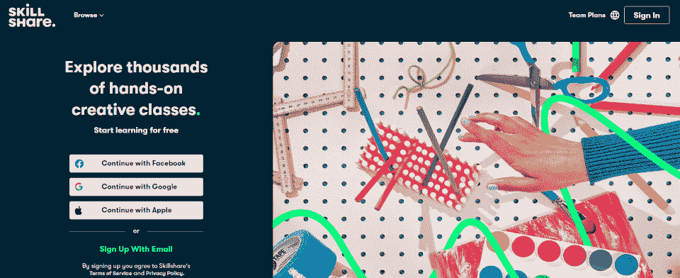
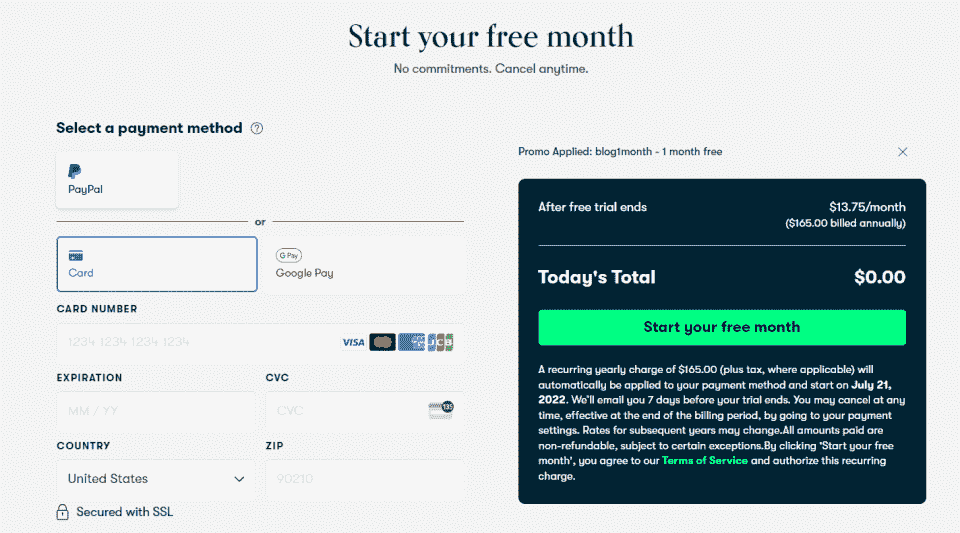
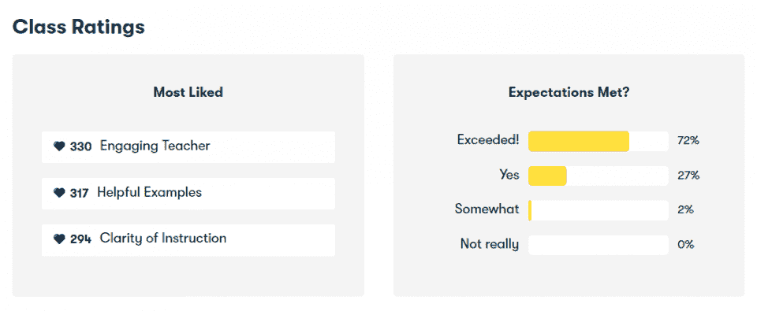
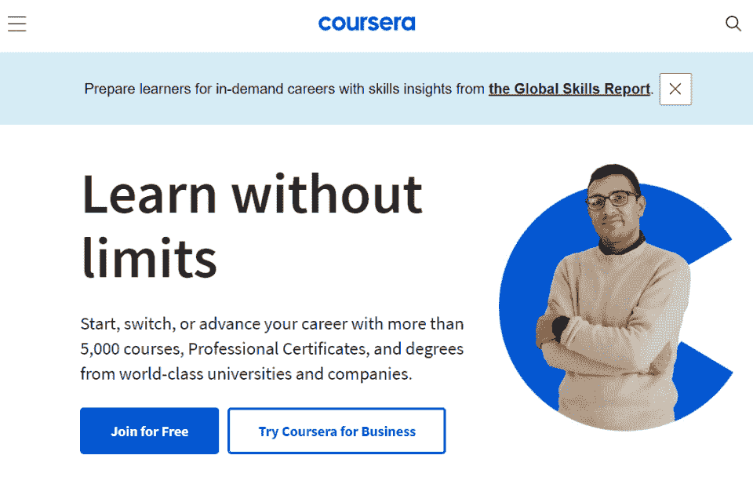
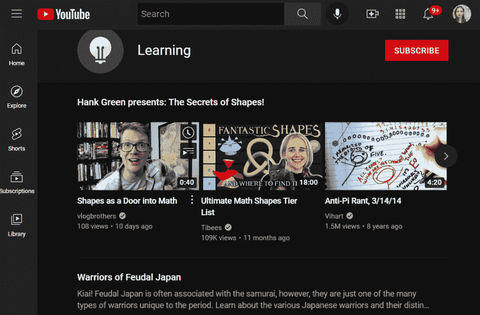

# 2023 年技能分享回顾:优点、缺点和选择

> 原文：<https://hackr.io/blog/skillshare-review>

Skillshare 提供了大量社区主导的课程，包括市场营销、[插图](https://hackr.io/tutorials/learn-drawing)和音乐。尽管如此，Skillshare 最适合业余爱好者和那些想要增加现有知识的人，因为班级和教师的质量都是高度可变的。

| 教练 | 3/5 |
| 课程 | 4/5 |
| 经验 | 3/5 |
| **总计** | **3.5/5** |

一目了然:

*   Skillshare 给你需要做的知识，但主要关注个人成长、生产力和探索。
*   Skillshare 上的教师自己可能不一定有专业证书，学生也不能获得证书(如证书)。
*   Skillshare 比类似的平台(如 Coursera 或 Codecademy)更专注于**创造性的努力**。
*   Skillshare 上的许多课程都很简短、简单、容易操作。
*   Skillshare 的高额年费(和自动续费)让一些学生望而却步。

简而言之，Skillshare 比其他提升技能的平台更“懒散”；你不会拿到证书或学位。但是你可能会学习一个新的工具或技术，甚至开发一个全新的项目组合。

今天，我们将探讨技能分享评论、定价、利弊，并回答最重要的问题。

Skillshare 值得吗？

## Skillshare 能提供什么？

[Skillshare](https://skillshare.eqcm.net/e4Md96) 提供超过 **30，000 门在线课程**，主要集中在创意学科、市场营销、网页设计和用户体验。

这似乎是一个不切实际的班级数量。即使是最好的 Skillshare 课程也往往比你在其他平台上找到的课程要短。例如，Coursera 上的课程可能超过 30 个小时。技能分享课程更有可能是小规模的——一次大约一个小时。

Skillshare 的课程更像是**工作坊。** Skillshare 专注于提供来自*真正的*设计师、插画师和创意人员的实用知识。当你观看 Skillshare 视频时，你正在从业内人士那里获得建议。

许多技能分享导师都有追随者，这意味着你在向已经取得成功的人学习。现在，一些视频有了“特别嘉宾”，比如奥利维亚·维尔德。

让我们来看看 Skillshare 最受欢迎的一些讲师:

*   [杰西卡·希斯彻(作家兼插画家)](https://skillshare.eqcm.net/RyjJky)。杰西卡曾在韦斯·安德森、蒂芙尼&公司、纽约时报和企鹅图书公司工作。在 Skillshare 上，她教授插图刻字、设计师刻字和标识打字。
*   [拉齐·乔丹(多学科艺术家)](https://skillshare.eqcm.net/mg3xAZ)。拉西·乔丹曾为华特·迪士尼、美国广播公司和创意艺术家机构工作。在 Skillshare 上，她有一门面向所有人的数字插图课程。
*   [亚伦·德拉普林(设计师和创始人，德拉普林设计公司)](https://skillshare.eqcm.net/DVgDPq)。Aaron Draplin 曾为杂志、滑雪板公司和电影制作公司工作，创作具有复古风格的数字设计。在 Skillshare 上，他会定期上传像 Draplin 的肮脏设计这样的课程。
*   [罗珊妮·盖伊(作家兼编辑)](https://skillshare.eqcm.net/rn3jZB)。罗珊妮·盖伊是《坏女权主义者》和《难相处的女人》等书籍的出版作者。在 Skillshare 上，她教授创意写作课程。

与大多数学习平台相比，Skillshare 更依赖于其讲师的证书。尽管如此，Skillshare 上的大部分课程并不是由拥有上述*和*令人印象深刻资历的专业人士开设的。Skillshare 有 30，000 门课程(并且还在增长),确实存在质量问题——它是一个开放的市场，几乎任何人都可以加入。

| 【Skillshare 给证书吗？如果你正在寻找一份职业证书，Skillshare 并不适合你。Skillshare 更可能教你如何给汽车换油，而不是如何改善你的职业生涯(尽管这并不是说没有专业课程)。 |

## Skillshare 是给谁的？

让我们面对现实吧:大多数“提升技能”的平台都是基于像 it 和计算机科学这样的技术追求。但是 Skillshare 是建立在创造性企业的基础上的——设计、插图、艺术、写作和编辑。

除此之外，Skillshare 拥有一大批想要学习基本生活技能的人。例如，该平台有个人理财、预算和修理家庭用品的课程。

在 Skillshare 上你能学到什么？首先，Skillshare 将其类分为**创建**、**构建**和**茁壮成长**。

| **创建** | **建造** | **茁壮成长** |
| 动画

*   创意写作
*   电影和视频
*   精细工艺
*   装帧设计艺术
*   说明
*   音乐
*   摄影
*   用户界面/UX 设计
*   Web 开发
*   商业[分析](https://hackr.io/blog/what-is-data-analytics)

 | 自由职业者和企业家

*   领导和管理
*   营销
*   Skillshare 的理念不是“让你成为最好的朝九晚五的职业”——它肯定倾向于艺术追求和自由职业。而这也足以让它区别于其他很多顶级平台。
*   Skillshare 是如何工作的？

 | Skillshare 是一个真正的市场。专业人士、业余爱好者、思想领袖和大师注册并上传他们的课程。一旦他们的类通过了“质量测试”，他们就会发布给用户。然后，用户可以注册一门课程——通常只是一个视频。 |

Skillshare 只收取一笔年费，你可以提前注册一个月免费使用。请注意，大多数教师每堂课每月仅挣 200 美元，这可能是质量如此不稳定的部分原因。

## Skillshare 上的课程大多只是视频。这些视频通常只有一个小时左右。你可以把许多 Skillshare 的“课程”含糊其辞地变成教程，这些教程也可以在 YouTube 上找到。然而，技能分享课程有时是由有资质的专业人士制作的，并且重点突出。

**如何开立技能共享账户**

如果你不确定 Skillshare，你可以注册一个 30 天的免费账户。但请注意，它将作为一个每月高达 165 美元的付费帐户更新。这是唯一一个受欢迎的技能平台，这可以理解地让一些人犹豫是否购买。

### 除此之外，开立一个 Skillshare 账户非常简单。你可以使用现有的谷歌或脸书账户，只需点击几下就可以开设一个 Skillshare 账户(你也可以通过贝宝或信用卡支付)。

Skillshare 一个月多少钱？Skillshare 免费与高级

免费试用

30 天

## 每月成本

| 13.75 美元(按年计费) | 年度费用 |
| $165 | 假设你只对一门技能分享课程感兴趣。只需注册 30 天免费试用。大多数技能分享课程大约一个小时；你可以用你的试用帐户免费享受这些课程。 |
| 但也许你想了解更多。如果你想继续一系列的 Skillshare 课程(或者只是学习更多的技能)，你可以继续支付每月 13.75 美元的订阅费。但是有一个警告。 | 回到 2021 年，你可以支付年费或月费(32 美元/月)。Skillshare 取消了这个选项。现在，你需要一次性支付一整年的技能分享费。 |

这并不是说 Skillshare 不值得。

只要付年费，你就可以进入他们的 30，000 多门课程的图书馆。如果你觉得你每年会参加几个以上的技能分享课程，这是非常值得的。

Skillshare 需要花钱吗？

Skillshare 过去有免费选项和每月订阅，但现在没有了。一旦你的 30 天免费试用期到期，你就必须每年支付 165 美元的年费。

值得注意的是，谈到其定价计划，Skillshare 有点，嗯，*可疑*。你必须采取行动注册 30 天的免费试用，然后它会告诉你要花多少钱，它会自动为你续订全额年费。

| Skillshare: 7 天还是 30 天试用期？如果你现在访问 Skillshare 的网站，你可能会看到 7 天的试用期。但是如果你尝试注册，退出，然后稍后再试，你会注意到 30 天的试用期。 |

您也可以通过合作伙伴网站获得 30 天的免费试用。

## 所以，再一次，Skillshare 在支付方面有点可疑——你会注意到在其网站上，它经常提到一个难以形容的“试用期”通过合作伙伴可以获得更长的试用期。默认时间只有一周。

完全披露:是的，我们第一次忘记取消我们的免费试用。说说贴纸休克吧！

技能分享对你的职业发展有好处吗？

Skillshare 对技能提升有多好？看情况。

Skillshare 并不关注就业和传统的职业发展。基于技能分享课程，你不太可能找到工作或获得晋升。但这也是 Skillshare 与众不同的地方。

## Skillshare 更适合发展具体的、独特的、可操作的技能，这将提高你的工作表现或推动自由职业生涯。想要学习如何使用 Adobe Illustrator 的艺术家可以参加 Coursera 证书课程，想要学习“如何在 Adobe Illustrator 中绘制 3D 图像”的艺术家可以参加 Skillshare 课程。

如果你曾经想知道，“我如何做 X 技术，”Skillshare 是适合你的平台。

技能分享可以建立你的职业生涯，尤其是在创新领域。但这是间接的，给你成功所需的工具和技术，而不是证书。

类似地，Skillshare 更多地面向已经在这个行业中的专业人士，并且希望提高他们的技能。虽然有一些初学者级别的课程，但大多数都是针对那些基础知识水平的人。

相反，一个真正的初学者可能甚至不知道他们需要学习什么技术。

Skillshare 是否得到认可/认证？

也许 Skillshare 最大的缺点是它不被认可，不被认可，不被认证。因此，虽然你将从行业领袖和专业人士那里学习，但你不会获得证书或任何可分享的东西。但是你也许能创造出一个伟大的投资组合。

| **Skillshare 上最受欢迎的课程**Skillshare 提供什么？理解 Skillshare 好处的最简单的方法是看一看它最受欢迎的一些课程。 |

## [掌握抖音:停止滚动，发布你的第一张抖音](https://skillshare.eqcm.net/do04my)。泰勒·罗兰，这堂课将带领学生创建他们的第一个抖音并学习抖音平台。对于那些想要探索这个新的营销场所的人来说是理想之选。

## 创意人员的生产力:建立一个能发挥你最大潜能的系统。托马斯·弗兰克帮助创意人员建立一个生产力系统，让他们保持高效、有组织和有灵感。

从简单的文字到令人惊叹的艺术:结合手写字体和插图。Gia Graham 向插画师展示了如何通过一个简短的课程将他们的排版变成一种艺术形式。

1.  [记录你的生活:更有目的地生活的 4 种方法](https://skillshare.eqcm.net/2rqnAG)。自我保健大师纳撒尼尔·德鲁向学生们展示了他们如何通过记录更用心地生活。
2.  如你所见，这些课程不像 Codecademy 课程。他们并不打算提升一个爆炸性的技术职业。相反，Skillshare 课程是为设计师、营销人员、插画师、艺术家和那些只想改善生活的人开设的。
3.  Skillshare 上最著名的导师是谁？
4.  Skillshare 首先提升其讲师。据 Skillshare 称，其导师每年从版税和推荐收入中获得超过 10 万美元的收入。

我们之前讨论过一些热门导师。Skillshare 还列出了几个值得关注的导师:

## Anne Ditmeyer:专注于 Adobe InDesign 的设计师和专家。

Tiago Forte:工作流设计师和生产力专家。

格蕾丝·贝洛:格尔尼卡的社论写作专家。

*   Brad Woodard:拥有自己设计工作室的设计师和插画师。
*   多米尼克·弗拉斯克:独立设计师和色彩理论专家。
*   该平台很快强调任何人都可以成为讲师。你不会发现斯蒂芬·金在 Skillshare 上谈论写作的艺术——但你仍然会发现著名的行业专业人士。
*   **如何在 Skillshare 上找到最好的课程**
*   虽然我们之前已经暗示过，Skillshare 确实有一点质量问题。这可以理解成千上万的课程。

Skillshare 的讲师都是大名鼎鼎、背景和技能都很好的人。他们的课程往往有极高的生产价值和许多可操作的技巧。但实际上，任何人都可以上传文件到 Skillshare。

## 你怎么知道你得到了你需要的建议？

跟踪 Skillshare.com 评论，密切关注用户生成的评级，并调查课程讲师。在 Skillshare 页面上，你可以看到有多少学生参加了某门课程——如果有 20，000 人，那么这门课程可能很棒。如果有 20 个，也不一定。

熟读老师的作品。教师有资格支持他们的课程吗？最后看班级收视率。Skillshare 不像大多数公司那样对课程进行评级，它不是星级评级。

相反，学生根据具体类别(吸引人的老师、清晰的教学)和他们的期望是否得到满足(超出、是的、有点、不完全)进行评级。

**技能分享评论:优点、缺点和用户评论**

**优点**

**缺点**

## 设计、插图和其他创意领域的丰富课程库

| 由在各自领域处于领先地位的教师支持的课程 | 简短的、可操作的、很有冲击力的课程 |
| 

*   没有证书或官方文件
*   需要一大笔年费
*   并不是所有的课程都是由具有可靠资质的教师授课的

 | Skillshare 居住在一个独特的空间。学生喜欢快速学习基本技能的能力，而无需经历整个新兵训练营或课程计划。Skillshare 直接、简单且(再次)可行。

*   Skillshare 在 TrustPilot 上的[为 1.8/5，这主要是由于以下问题:](https://www.trustpilot.com/review/skillshare.com)
*   你可能需要挖掘合适的材料。任何人都可以上传到 Skillshare(尽管课程必须符合基本质量标准)。因此，你必须做一些跑腿的工作来找到适合你的课程。
*   Skillshare 对其定价模式相当怀疑。7 天免费试用期直接转为大额年费。此外，Skillshare 不会在其网站上公开其定价。你必须注册才能知道。

 |

Skillshare **几乎悄无声息地取消了它的月付费模式。大多数人习惯了 Skillshare 的月付选项，并对年度账单感到惊讶。**

然而，Skillshare 仍然有一些很棒的老师和课程，尽管这个平台还需要一些工作。阅读 TrustPilot 上的 Skillshare 评论，你会发现一系列类似的抱怨:Skillshare 出人意料地向人们收费，拒绝退款，并试图提供折扣而不是退款。

*   另一方面，如果你知道你想学什么，Skillshare 有很有价值的课程。如果你能在 7 天的免费试用期内学会它们(并在收到账单前取消)，那就更棒了。
*   **技能共享的替代方案**
*   Skillshare 最直接的替代品可能是 Udemy。Udemy 提供了一系列不同质量的类，其中包含了一些非凡的宝石。以下是 Skillshare 与各种竞争对手相比的简要概述:

**技能分享**

**Coursera**

## **YouTube**

**我们打**

| **类** | 30,000+ | 7,000+ | 数百万 | 185,000+ |
| **学生** | 一千二百万 | 八千二百万 | 26 亿 | 四千万 |
| **成本** | 165 美元/年 | 39 美元/月 | 自由的 | 12 美元到 200 美元 |
| **Coursera** |  | Coursera 类似于 Skillshare，但有更长的课程、训练营、认证途径和学位。 | Skillshare 的课程时长约一小时，涵盖一个单一的离散主题，而 Coursera 的课程通常会深入到一个一般的领域或职业道路。因此，Coursera 更适合那些试图提升传统职业或探索新职业的人，而 Skillshare 更适合学习个人技能。 | **YouTube** |

### 

没错。YouTube。

关于 Skillshare 的一个有趣的事实是，你可以在 YouTube 上找到许多类似的课程。这是因为专业人士、业余爱好者和艺术家已经在 YouTube 上上传教程，并通过广告收入赚钱。

例如，你可以在 YouTube 上搜索“标志的手写字体”,找到一些非常高级的教程。如果你过去学习过 YouTube 教程，你会发现 Skillshare 确实是一个货币化的 YouTube 平台，尽管它有更多的关注点和(某种程度上)更多的教师互动。

### 由于 Skillshare 不提供凭证或证书，学生们可能会发现，在支付高额年费之前，先看看 YouTube 上的教程是明智之举。

**我们打**

Udemy 有 185，000 门课程，比 Skillshare 的 30，000 门课程多得多。但是更多的课程意味着更多的质量变化。但与此同时，Udemy 也以较低的价格提供了许多类似于 Skillshare 的课程。

Udemy 的课程介于 Skillshare 和 Coursera 之间:有像 Skillshare 这样的简短、可操作、强有力的课程，但也有一些较长的课程。

Skillshare 有什么特别之处？与 Coursera、YouTube 和 Udemy 相比，Skillshare 的独特目标是创意和营销。大多数其他平台都是面向技术的。

### 结论:Skillshare 合法吗？

以下是我们从 Skillshare 评估中收集到的信息:

技能分享课程和他们的导师一样合法；这完全取决于信息的来源。Skillshare 不会直接改善你的职业生涯，因为它不提供任何证书或凭证。但是它会通过给你新的策略、工具和技巧来间接地改善你的职业生涯。

**Skillshare 非常适合:**

学习你感兴趣的特定技术或工具。

## 了解更多关于**创造性追求**的信息，例如设计和插图。

向各自领域内的专业教师学习。

提高特定领域内的**生产率**和**效率**。

但是 Skillshare 对于那些实际上想要直接提升职业生涯、获得晋升或证明自己才能的人来说并不好。此外，其不太合法的定价结构足以让许多人踌躇不前。

*   **想学编程？**
*   Skillshare 主要用于设计和艺术创作。虽然在编程方面有一些重叠，但是你最好参加一个免费的在线编程课程。
*   [今天为初学者学习编码](https://hackr.io/blog/coding-for-beginners)
*   **常见问题解答**

**1。Skillshare 真的有用吗？**

| 这取决于你需要什么。Skillshare 是从业内人士那里学习实用技能的好方法，但不是从头开始发展职业的好方法。只要你的期望得到控制，Skillshare 就是一个优秀的平台。**2。免费试用后可以取消 Skillshare 吗？**只要您在自动续订日期之前取消 Skillshare，就可以获得全额退款。如果你的免费试用自动更新，你将很难获得全额退款。 |

## **3。Skillshare 能给你找份工作吗？**

#### Skillshare 不会让你独自得到一份工作，但它可以帮助你积累找工作或发展投资组合所需的*技能*。Skillshare 不提供证书或凭据；而是提供知识和策略。

**4。Skillshare 上你能上多少课？**

#### 通过 Skillshare 订阅，您可以选择任意多或任意少的课程。

**5。我可以为其他人购买 Skillshare 吗？**

#### 不，您不能为其他人购买 Skillshare。但是，您可以购买 Visa 礼品卡(或工作团队卡),他们可以使用*兑换* Skillshare。

**6。Skillshare 发证书吗？**

#### 不，Skillshare 不颁发证书。然而，有些课程会产生一个专题，然后可以作为作品集使用。

You can take as many or as few classes as you like with a Skillshare subscription. 

#### **5\. Can I Buy Skillshare for Someone Else?**

No, you can’t buy Skillshare for someone else. However, you can purchase a Visa gift card (or work teams card) that they can use *toward* Skillshare.

#### **6\. Does Skillshare Give Certificates?**

No, Skillshare does not give certificates. However, some classes will produce a project, which can then be used as a portfolio piece.