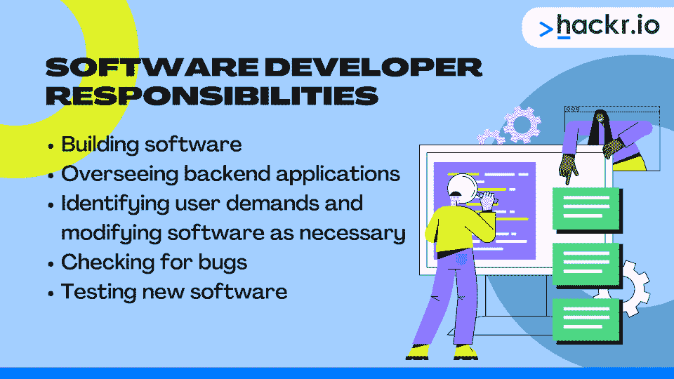

# 软件开发人员与软件工程师:主要区别

> 原文：<https://hackr.io/blog/software-developer-vs-software-engineer>

如果你对软件开发人员和软件工程师的区别感到困惑，你不是唯一一个。甚至行业专家和专业人士也在争论这些角色之间的真正区别，有些人甚至宣称根本没有真正的区别！

那么，软件开发和软件工程之间有什么区别吗？

是的，这两种职业有明显的区别。如果你正在考虑软件开发人员或软件工程师的职位，你会想知道它们之间的区别。它是

我们将详细讨论每个角色，包括薪水、职责、技能以及软件工程师和软件开发人员的区别，以帮助你决定你理想的职业道路。

## **什么是软件开发者？**

软件开发人员为各种平台设计、开发、编程和维护软件，包括桌面程序、智能手机应用程序和 web 应用程序。这些专业人员使用各种编码语言从头开始构建软件——独立地或与团队一起。例如，开发人员可能单独工作，也可能与其他专业人员(如图形设计师)合作。

美国劳工统计局(Bureau of Labor Statistics)记录了超过 180 万份软件开发工作，预计到 2030 年将增加 40 多万份。软件开发人员显然需求量很大，这使得它成为一个很有前途的职业。

尽管成为软件开发人员并不需要学位，但大多数人都至少拥有计算机科学等相关领域的学士学位。认证项目和“编码训练营”也是有抱负的软件开发人员的受欢迎的教育途径。

软件开发人员在日常工作中需要各种硬技能和软技能。雇主在招聘软件开发人员时会寻找一些抢手的技能，比如:

*   精通一种或多种编码语言
*   数据库知识(包括数据结构和算法)
*   有源代码控制管理的经验
*   彻底理解软件测试程序
*   各种操作系统的经验
*   密码学培训
*   理解软件框架
*   具有集成开发环境的经验
*   能够在软件开发生命周期内工作
*   优秀的沟通技巧
*   独立工作或与团队合作的能力
*   创造性解决问题的能力
*   注意细节

### **软件开发人员的主要工作职责**

****

软件开发人员的主要职责可能因公司而异，但通常包括:

*   构建运行平台、应用程序或系统的软件
*   监督软件的后端应用程序
*   确定用户需求并根据需要修改软件
*   检查软件中的缺陷或错误
*   新软件发布前的测试

### **软件开发人员的平均工资**

根据 Glassdoor 的数据，在撰写本文时，美国软件开发人员的平均起薪为 111，021 美元。然而，高级软件开发人员的平均工资为 127，834 美元。

[软件开发从 A 到 Z - OOP、UML、敏捷、Python](https://click.linksynergy.com/deeplink?id=jU79Zysihs4&mid=39197&murl=https%3A%2F%2Fwww.udemy.com%2Fcourse%2Fsoftware-development-from-a-to-z%2F)

### **软件开发人员最佳实践**

一些软件开发人员最佳实践包括:

*   保持你的代码简单。
*   持续地开发你的软件，从构思到完成。
*   尽可能考虑让第二双眼睛盯着你的代码。
*   设定现实的期限和预算。
*   创建一个编码目标的每日待办事项列表，以保持进度。
*   首先从项目中最具挑战性的部分开始。

## **什么是软件工程师？**

软件工程师专注于计算机或手机软件的结构设计。当然，软件工程师可能负责设计和开发这个软件；然而，这份工作更侧重于维护、评估、测试和调试。这些职责要求对应用程序的构建、处理以及最终用户最想要或最需要的东西有更广泛的理解。

根据最近的统计数据，到 2028 年，对软件工程师的需求预计将增长 21%,并产生数十万个新的美国工作岗位。像软件开发人员一样，软件工程师享受着高需求的职业前景。

成为软件工程师不一定需要学位。尽管如此，你可能会发现，没有至少一个学士学位，最好是计算机科学学士学位，在这个领域找工作是很有挑战性的。另一方面，计算机科学硕士学位会让你要求更高的薪水，在更高的职位上工作。认证项目也可以改善你的职业前景。

软件工程师需要一套全面的技能，包括硬技能和软技能，以有效地完成他们的工作。雇主追求的技能包括:

*   精通一门或多门计算机编程语言(最好至少两门)
*   软件开发经验
*   面向对象设计的知识
*   彻底理解软件测试和调试的最佳实践
*   优秀的书面和口头沟通技巧
*   独立工作或与团队合作的能力
*   逻辑思维能力
*   创造性解决问题的技能
*   注意细节
*   各种 web 开发框架的工作知识
*   创建响应性网页和设计的经验
*   丰富的前端应用程序开发经验

### **软件工程师的主要工作职责**

****

软件工程师的主要工作职责因公司而异。然而，大多数软件工程师职位都包含以下职责:

*   通过算法开发计算机指令
*   通过流程图和图表记录流程
*   识别软件问题、常见模式和改进机会
*   制定标准操作程序
*   设计和实现新的软件系统
*   维护现有的代码库，包括在必要时进行改进
*   与其他 IT 专业人员合作实施各种技术设计
*   提供书面知识传授材料

### **软件工程师的平均工资**

根据 Glassdoor 的数据，软件工程师的平均起薪[为 118，860 美元。然而，高级软件工程师的平均工资为 139014 美元。](https://www.glassdoor.com/Salaries/software-engineer-salary-SRCH_KO0,17.htm)

### **软件工程师最佳实践**

一些软件工程师最佳实践包括:

*   保持你的代码简洁明了。
*   始终测试您的代码，以确保它们正常运行。
*   通过版本控制简化流程。
*   为变量、函数和方法使用简单、适当的名称，使它们更容易阅读。
*   尽可能避免在代码中使用缩写。
*   使用一致的代码格式。
*   详细记录你的所有过程。
*   对你所有的代码、软件和过程都要有意识。

## **软件工程师和软件开发者有什么区别？**

| **职位名称** | **软件开发商** | **软件工程师** |
| **首选程度** | 计算机科学或信息技术学士学位；相关认证 | 计算机科学学士或硕士学位 |
| **工作流程** | 软件项目构建过程的一部分。 | 参与项目建设过程的各个方面。 |
| **活动类型** | 软件开发更多的是团队活动，但有时可能需要独立工作。 | 软件工程更加独立，但有时可能需要团队合作。 |
| **工作方式** | 通常从头开始编写完整的代码。 | 在各种软件组件上工作，通常使用开发人员或其他工程师创建的代码。 |
| **必备技能** | 

*   中级数学能力
*   至少精通一种编程语言

 | 高等数学能力

*   理解工程原理
*   项目管理经验
*   至少精通一门编程语言(最好是两门或两门以上)
*   **典型的职业道路**

 |
| 软件架构师 | 软件开发人员

*   软件工程师
*   首席软件工程师

 | 首席软件开发工程师

*   **平均工资**
*   111，021 美元/年
*   118，860 美元/年

 |
| 软件工程师和开发人员的技能和职责有很多重叠。然而，他们完成工作的方式是不同的。此外，软件工程师必须有更高的经验水平和更广泛的技能组合——这意味着他们的工资往往比开发人员略高。 | **理解软件开发人员和工程师的区别:关键要点** | 总而言之，这两种立场之间的主要区别包括: |

软件工程师通常比开发人员需要更高的学位。

## 开发人员只参与软件开发过程的一部分，而工程师参与所有的过程。

软件工程师经常单独工作，而开发人员通常是团队工作。

*   开发人员通常编写自己的代码，而工程师通常使用他人编写的代码。
*   软件开发人员的工资比软件工程师略低，尽管工程师需要更广泛的技能。
*   **结论**
*   在软件工程师和软件开发人员之间做出选择可能会很棘手。回顾每个职位的职责和要求，在选择一个职位之前考虑你的兴趣。
*   有兴趣开始你的编程生涯吗？

## **[探索免费编码训练营](https://hackr.io/blog/free-coding-bootcamps)**

**常见问题解答**

**1。软件开发人员和工程师哪个好？**

当比较软件开发人员和软件工程师的职业时，你会发现两者都没有本质上的优势。这取决于你最喜欢做什么。软件开发人员更关注单一任务(开发软件)，而工程师在一个工作日内有几个不同的任务，如测试、调试和编写新代码。

## 如果你更喜欢专攻软件开发的某个方面，你可能会发现软件开发职业更有回报。另一方面，如果你渴望工作多样化，软件工程师可能是更好的选择。

#### **2。软件工程师或软件开发人员赚钱多吗？**

平均而言，软件工程师的年收入比软件开发人员高。然而，经验水平、雇主和工作地点等因素都会影响这两个职位的薪水。

**3。软件工程师可以成为软件开发人员吗？**

#### 是的，软件工程师可以成为软件开发人员。事实上，这些角色的重叠意味着一个工程师经常可以在没有额外培训的情况下进入软件开发人员的角色。然而，软件开发人员需要进一步的教育、经验和培训才能成为工程师。

On average, a software engineer earns more annually than a software developer. However, considerations like experience level, the employer, and location all affect salaries for either position. 

#### **3\. Can a Software Engineer Become a Software Developer?**

Yes, a software engineer can become a software developer. In fact, the overlapping of these roles means an engineer can often step into the software developer role with little to no additional training. However, a software developer will require further education, experience, and training to become an engineer.