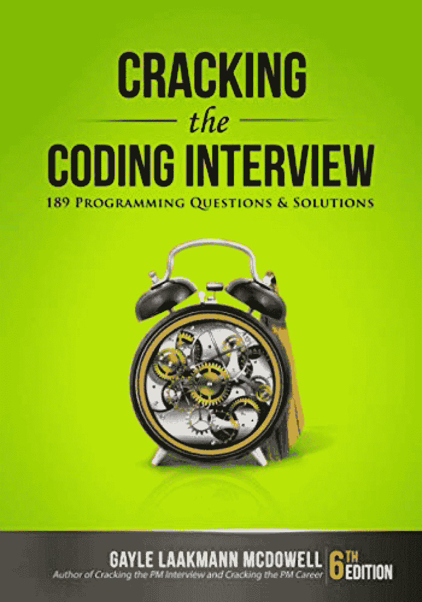
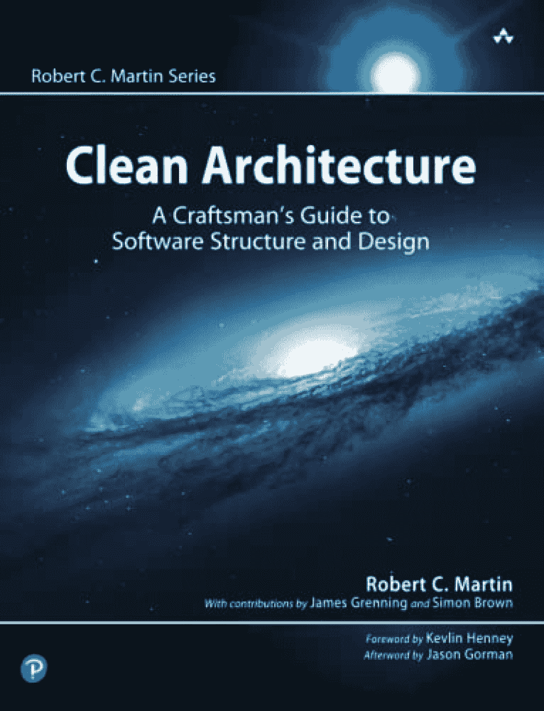
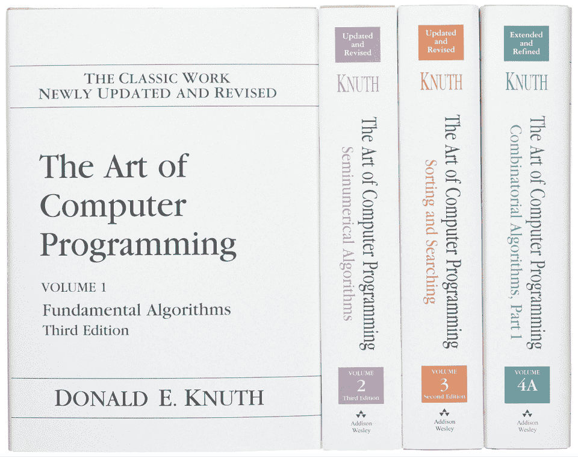
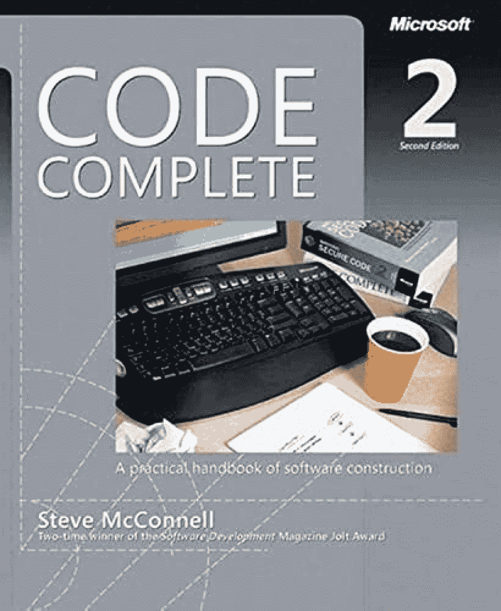
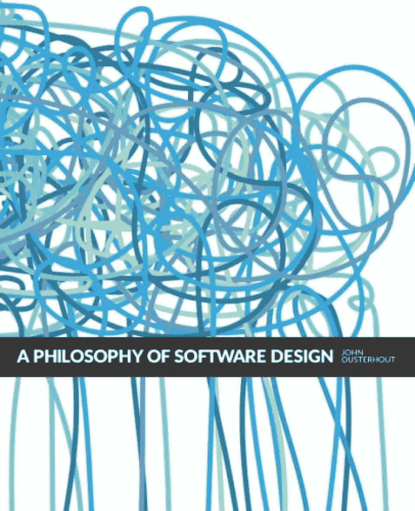
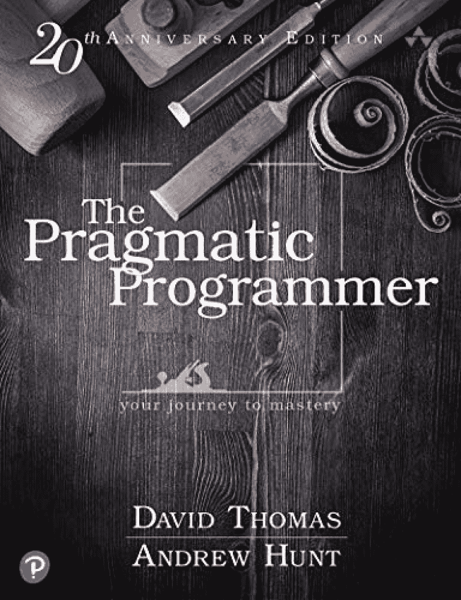
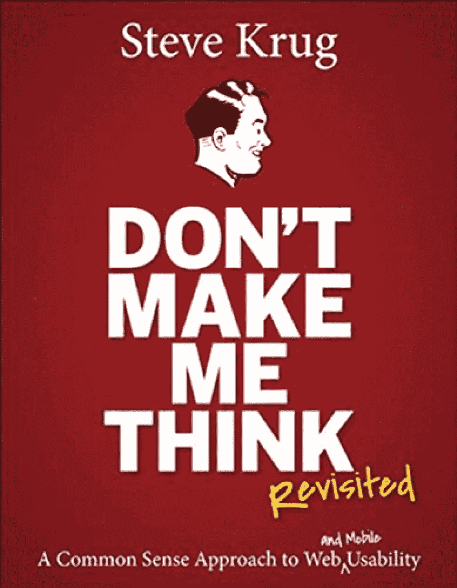
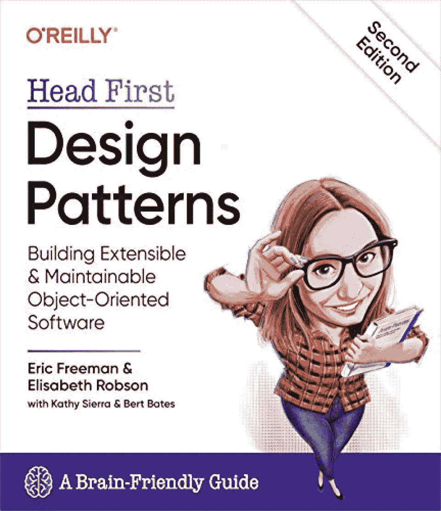
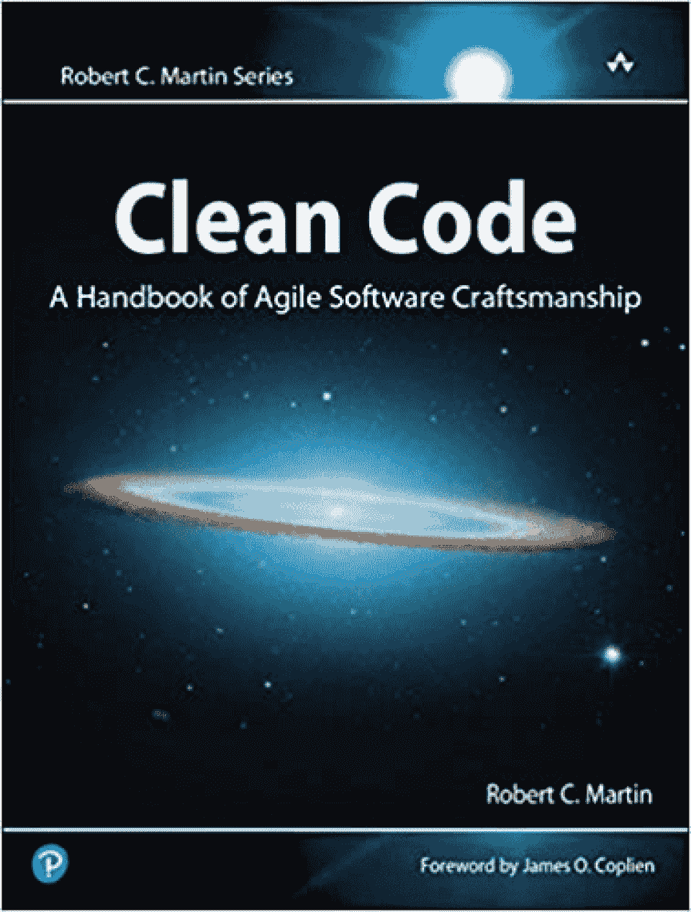
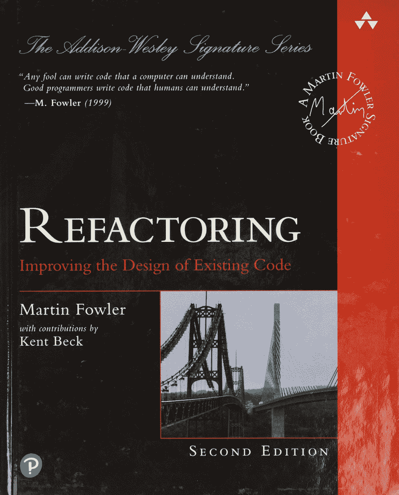

# 2023 年阅读的 10 本最佳软件工程书籍

> 原文：<https://hackr.io/blog/software-engineering-books>

软件工程书籍一直是了解你所在领域更多信息的好方法。不管你是一个有抱负的、初学者还是有经验的软件工程师，在一本伟大的软件工程书中总会有新的东西要学。

如今，有各种各样的软件书籍可以帮助你获得你可能从未听说过的新知识和技巧。这本书的主题从干净的代码到设计模式和哲学。有些甚至可以帮你准备大型工作面试！

下面，我们编辑了一些关于软件工程的最佳书籍。如果你想获得可能对你的职业生涯有所帮助的新见解和新观点，不妨看看这些书。

## **软件工程师最佳书籍**

在这份软件工程师最佳书籍列表中，我们挑选了以下几本:

如果你准备好进入这个不断发展的领域，请阅读我们方便的[软件工程职业起步指南](https://hackr.io/blog/start-career-in-software-engineering)！

## **软件工程的种类**

作为一个领域，软件工程非常广泛。因此，行业中的开发人员通常围绕各种事情拥有不同的技能和专业知识，例如构建软件或面向消费者的网站、维护网络或网络安全、构建和管理计算机信息系统等等。

**有** [**三种**](https://www.castsoftware.com/glossary/introduction-to-software-engineering-types-meaning-explanation-what-is-definition) **软件工程的初级类型:**

*   **操作** -这个层次的软件工程更加关注软件产品如何在其系统内工作和交互。它强调软件的可用性、功能性、可靠性和成本——比如确保它在预算之内。操作软件工程也可能考虑软件产品带来的风险。

*   **过渡性** -软件工程的过渡性着眼于产品从一个环境(或系统)转移到另一个环境(或系统)时的反应。它还关注软件产品的灵活性和可伸缩性。

*   **维护** -软件工程维护，或者循环软件工程，关注软件如何在现有系统中运行，尽管随着时间的推移会有任何变化。

有许多软件工程工作通常属于上述三种类型之一。同样值得注意的是，软件工程师可以从事前端或后端工作，也可以是全栈开发人员。也有其他工作，像开发人员或质量保证工程师。

## **最值得阅读的软件工程书籍**

[****](https://www.amazon.com/Cracking-Coding-Interview-Programming-Questions/dp/0984782850)

*   **作者:**格利·拉克曼·麦克道尔
*   **发布者:**career cup；第六版

如果有一件事可能会吓到专业人士，那就是求职面试过程。如果你发现自己在一次面试中毫无准备，面试中你被告知要快速想出算法，或者被要求在白板上写下你的代码(希望毫无瑕疵)，这本书可能是你的一本好书。

Gayle Laakmann McDowell 所著的《破解编码面试》是对希望提高工作面试成功率的软件工程师有抱负者的最佳书籍之一。根据她面试和指导无数软件工程师的经验，麦克道尔创作了一本有 189 个真实世界面试问题的书来帮助你练习。这本书还包括方便的提示和五个经过验证的策略，证明可以帮助你回答类似的问题，并提出解决问题的方法(即使你以前没有练习过回答这些问题)。

[在此查看更多](https://www.amazon.com/Cracking-Coding-Interview-Programming-Questions/dp/0984782850)

[****](https://www.amazon.com/Clean-Architecture-Craftsmans-Software-Structure/dp/0134494164/)

*   **出版社:**培生；初版

Clean Architecture 是传奇软件工程师(被亲切地称为“软件工匠”)Robert C. Martin 写的一本书。这本书的目的是在任何系统的生命周期中帮助显著提高软件开发人员或工程师的生产力。

干净架构帮助软件工程师学习干净软件架构设计的基础和原则。在本书中，Martin 针对你作为软件工程师可能面临的各种挑战给出了直接、严肃的建议和解决方案——包括可能对你的项目产生重大影响的成败挑战。他宝贵的洞察力来自五十多年的经验，可以帮助任何系统分析师、设计师、架构师，甚至软件经理。

[在此查看更多](https://www.amazon.com/Clean-Architecture-Craftsmans-Software-Structure/dp/0134494164/)

[****](https://www.amazon.com/Computer-Programming-Volumes-1-4A-Boxed/dp/0321751043)

*   **作者:**唐纳德·克努特和唐纳德·约翰·富勒

*   **出版者:**艾迪生-卫斯理专业；初版

虽然肯定是在价格较高的一端，但四卷本的《计算机编程艺术》系列是任何有自尊心的软件工程师的书架上都应该有的资源。这本书由四本书组成，为程序员提供了基本的信息来帮助他们，不管他们的水平如何。无论你是初学者还是资深软件工程师，这些精装书都有你不应该错过的重要信息。

本书系列的主要目标之一是让读者熟悉编程中常用的综合工具。然而，值得一提的是，这本书系列并不是什么值得一读的东西——相反，它是一个你可以在方便的时候参考的资源。

[在此查看更多](https://www.amazon.com/Computer-Programming-Volumes-1-4A-Boxed/dp/0321751043)

[****](https://www.amazon.com/Code-Complete-Practical-Handbook-Construction/dp/0735619670)

*   **出版社:‖**微软出版社；第二版

Steve McConnell 的《Code Complete(第二版)》被广泛认为是当今最实用的编程指南之一，也是你今天能找到的最好的软件工程师书籍之一。十多年来，这本书的第一版一直在帮助程序员提高他们的代码质量。现在，第二版是一个完全修订和更新的书，包含更新，在行业中使用的尖端实践。

这本书包含了来自研究、学术、甚至商业环境中日常使用的普通实践的知识。对于任何经验水平的人来说，这都是一本很好的读物，因为它旨在帮助你激发和启发你的思维方式，从而让你提高代码的质量。

由微软出版社出版的 Code Complete 包括许多永恒的技术，帮助你以最大的创造性和最小的复杂性设计你的软件。

[在此查看更多](https://www.amazon.com/Code-Complete-Practical-Handbook-Construction/dp/0735619670)

[****](https://www.amazon.com/Philosophy-Software-Design-2nd/dp/173210221X)

*   **作者:**约翰·k·奥斯特豪特

顾名思义，这本书讨论软件设计，但重点是降低设计的复杂性。它的主要目的是帮助软件工程师在软件设计和工程过程中管理复杂性。它还描述了软件工程师和程序员在产品开发过程中必须遵循的任何过程的许多哲学方面。

这本书使用一个迷人的结构来帮助解释清楚而简单的概念。一切都以一种易于理解的方式展开，如果你正在寻找软件工程中涉及的哲学的深入观点，这是一个极好的读物。

[在此查看更多](https://www.amazon.com/Philosophy-Software-Design-2nd/dp/173210221X)

[****](https://www.amazon.com/Pragmatic-Programmer-journey-mastery-Anniversary/dp/0135957052)

*   **作者:**戴维·托马斯·安德鲁·亨特

*   **出版者:**艾迪生-卫斯理专业；第二版

事实上，这本书已经出版 20 周年了，而且仍然具有相关性并广受好评，这足以说明它的质量、实用性和有用性。毕竟，它“旧”并不意味着它过时或无用。现在是第二版，这个周年纪念版从另一个角度看现代程序员意味着什么。

《实用程序员》中有广泛的主题，包括架构技术、个人责任、职业发展等等。作为软件工程最佳书籍的有力竞争者,《实用程序员》可以帮助您保持代码易于重用，同时保持其适应性和灵活性。

从这本书里，你将学到诸如编写动态代码、解决底层问题、防范安全漏洞、无情而有效的测试等等。对于任何水平的程序员来说，这都是一本很好的读物，甚至对负责软件项目的经理也有好处。

[在此查看更多](https://www.amazon.com/Pragmatic-Programmer-journey-mastery-Anniversary/dp/0135957052)

[****](https://www.amazon.com/Dont-Make-Think-Revisited-Usability/dp/0321965515/)

*   **发布者:**新骑手；第三版

《不要让我思考》是史蒂夫·克鲁格写的一本书，他是可用性专家，也是信息设计和直观导航的专家。这本书的第一版于 2000 年出版，对于那些希望了解更多 UX(用户体验)设计的人来说，这是一个有益的资源。目前这是它的第三版，已经更新到包括一章覆盖移动可用性。

如果你想获得软件或网站设计方面的新观点和实用建议，请阅读这本书。这本书的重点是简洁、简单，并在设计中加入常识，以使用户体验愉快。

[在此查看更多](https://www.amazon.com/Dont-Make-Think-Revisited-Usability/dp/0321965515/)

[****](https://www.amazon.com/Head-First-Design-Patterns-Object-Oriented/dp/149207800X)

*   **作者:**埃里克·弗里曼，伊丽莎白·罗布森，凯西·塞拉，伯特·贝茨

*   **发行方:**奥莱利传媒；第二版

Head First 设计模式是由四位权威撰写的——Eric Freeman、Elisabeth Robson、Kathy Sierra 和 Bert Bates。这本书聚焦于无数可能不断挑战软件工程师的问题，至少在设计模式方面。

这本写得很好的书使用了视觉上丰富的结构和格式，旨在与人类的思维最佳地合作。它的主要目的是向不同层次的软件工程师教授软件设计中最关键的模式。但是它并没有就此停止——它还向软件工程师展示了如何以及何时使用这些模式。此外，Head First 设计模式教导软件工程师应该完全避免使用的模式(以及为什么)。

如果你想提高你在面向对象设计方面的技能，这本书是非常好的，特别是如果你是一个视觉学习者，或者只是想要比固定的文本墙更令人兴奋的东西。然而，这本书可以改进的一点是提供更多的代码示例来代替至少一些插图。

[在此查看更多](https://www.amazon.com/Head-First-Design-Patterns-Object-Oriented/dp/149207800X)

[****](https://www.amazon.com/Clean-Code-Handbook-Software-Craftsmanship/dp/0132350882)

*   **出版社:**培生；初版

如果作者 Robert C. Martin 听起来很熟悉，那是因为他是编写《干净的架构》的同一位软件工匠，该书是软件工程最佳书籍列表的第二项。

在这本书里，罗伯特·c·马丁(或者很多人亲切地称他为“鲍勃叔叔”)认识到，即使是糟糕的代码仍然会起作用。然而，Martin 也知道，如果代码不干净，可能会带来麻烦。混乱的代码会耗费无数的人力和大量的资源。

因此,“干净代码”旨在帮助软件工程师和开发人员改进他们的代码，并“清理”它们以最小化将来的问题。《干净的代码》无疑是最好的软件工程书籍，尤其是对那些刚开始涉足这个领域的人来说。

[在此查看更多](https://www.amazon.com/Clean-Code-Handbook-Software-Craftsmanship/dp/0132350882)

[****](https://www.amazon.com/Refactoring-Improving-Existing-Addison-Wesley-Signature/dp/0134757599)

*   **出版者:**艾迪生-卫斯理专业；第二版

《重构:改进现有代码的设计》,作者 Martin Fowler，这本书二十多年来一直是全世界程序员的有用资源。这本书旨在帮助改进遗留代码的设计，无论是你的还是别人的。这是一本大多数软件开发人员或工程师可能想要阅读的软件开发书籍，因为其中的见解可以对软件产品的可维护性产生巨大的影响。

这本书的主要目标之一是教读者如何让他们当前的代码更容易理解。在本书中，您将找到 JavaScript 示例以及其他代码示例，它们有助于演示无需类的重构过程。

阅读这本书可以帮助你理解重构的基本原理和原则，这样你就可以从一开始就很好地构建(或编辑)你的代码。如果你想让你的软件产品随着时间的推移变得更容易改变和更新，你可以试一试这本书。

[在此查看更多](https://www.amazon.com/Refactoring-Improving-Existing-Addison-Wesley-Signature/dp/0134757599)

## **结论**

在列出这个清单的同时，我们得出了一个结论:没有一本关于软件工程的最好的书。只要你愿意花时间阅读，许多书可以提供自己的见解、有用的提示等等。你也不会总是同意所有顶尖的软件工程书籍——有一天，你可能会不可避免地发现与你的观点不一致的观点。

尽管如此，我们希望这份最佳软件工程书籍清单能帮助你找到下一本好书！如果你认为我们错过了一个应该在这个列表中的，请不要犹豫，在下面的评论中告诉我们！

如果你想知道更多关于每个领域的相似和不同之处，请阅读我们深入的[软件开发人员与软件工程比较](https://hackr.io/blog/software-developer-vs-software-engineer)！

## **常见问题解答**

#### **1。看书能成为软件工程师吗？**

通过阅读一些最好的软件工程书籍，有可能学到软件工程师需要的一些基础知识和核心概念。然而，如果你真的想在这个行业取得成功，你必须用一些实践练习和动手项目来补充书本知识。

#### **2。哪些是最好的软件工程书籍？**

有太多的软件英语书籍，而不是屈指可数的几本，这就是为什么我们列出了其中的一些最佳书籍。考虑读读罗伯特·c·马丁的书以及《计算机编程艺术》系列的第 1 卷到 4A 的书。

#### **3。作为一名软件工程师，你读什么？**

作为一个有抱负的、初学者或有经验的软件工程师，你的阅读清单可能理想地包含一些上面提到的软件工程教科书。然而，通过关注一些权威和博客、加入论坛等等来保持对该领域的最新和最重要变化的更新也是至关重要的。

#### **4。软件工程容易吗？**

这要视情况而定——每个人都是不同的，对你来说容易的事情对一些人来说可能是有挑战性的(反之亦然)。软件工程对你来说确实很容易学，尤其是如果你对这个行业中的一些概念、技能和工具特别感兴趣或有所倾向的话。

#### **5。软件工程包括哪些主题？**

随着技术的进步，软件工程所涵盖的主题很可能会在数量和复杂性上继续增长。然而，现在涉及的一些最受欢迎的主题包括设计架构、可用性、编程简单性(相对于复杂性)等等——所有的原则和基础都用于软件工程的各个领域，例如系统安全、系统设计、应用程序或 web 开发等等。