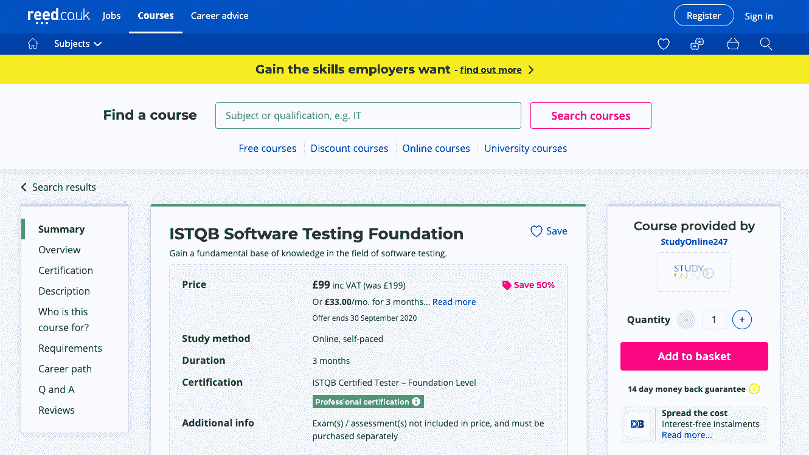

# 2023 年要学的 10 门最佳软件测试课程[更新]

> 原文：<https://hackr.io/blog/software-testing-course>

快速发展的软件业导致了对真实、直观和可靠的软件的需求不断增长。然而，对可靠软件的需求很大，但是不能忽视其质量。因此，在将产品投入专业使用之前，测试产品的缺陷是至关重要的。测试确保软件符合设定的标准，并能有效地交付期望的结果。

最好的部分是软件测试课程可以派上用场，创造高质量的软件。从初学者到一流的软件开发人员，都可以通过这些学习项目来提高自己的技能。让我们看看网上排名靠前的软件测试课程。

## **十大最受欢迎的在线软件测试课程**

****

计划进入软件开发和测试领域的初学者应该参加这个学习项目。从验证你的技术技能到建立软件测试的坚实基础，本课程将使你对概念有更深的理解。好处是课程的教学大纲符合国际软件测试资格委员会的标准。

本课程帮助学生学习下列概念:

*   有效测试技术
*   测试过程
*   测试设计技术
*   测试设计管理
*   测试技术选择过程
*   测试开发

IT 专业人员、测试设计人员、用户验收测试人员、测试工程师、测试分析师、测试经理、测试顾问以及其他类似角色的专业人员也可以从本课程中受益。它将给你实践经验和几个基本软件测试概念的知识。

**先决条件:**参加该学习项目不需要任何相关领域的正规教育。

**等级:**初级
**等级:** 5.0 **时长:** 3 个月(约)

你可以在这里注册。

这是一个每周一期的系列节目，旨在帮助个人提高对技术的理解，并在专业前沿提高工作效率。Nick Brazzi、Jess Stratton 和 Garrick Chow 的心血结晶，本课程将向您介绍构建强大设备和软件所需的技术。对于汽车销售人员、It 专家、客户服务专家和其他类似领域的专业人士来说，这是一个理想的学习计划。

本课程包含以下主题:

*   提高工作效率
*   生产率软件
*   计算机技能(Mac 和 Windows)
*   Microsoft Office 使用
*   使用谷歌平台
*   社交网络技能
*   ios
*   学生和教师工具

该课程旨在通过向他们介绍优化各种平台的工具和技巧来丰富他们的职业生涯。此外，您还将了解一系列软件测试方面的知识。请注意，该计划不向学员提供认证，因为它是一个持续的系列。

先决条件:必须具备技术、软件和其他相关领域的知识和经验。

**等级:**中级
**等级:** 4.6 **时长:** 27 小时(大约)

你可以在这里注册。

对于那些希望获得使用 Selenium 自动化基于 web 的应用程序的实践经验的人来说，这是一门理想的课程。这个简单的 Udemy 课程帮助学习者在学习 java 编程和各种集成 API 的基础知识的同时开始使用 Selenium automation。

此外，本课程还提供了页面对象模型、数据驱动、混合等框架实现的实践经验。学生还有机会通过设计复杂的框架、制作交互式报告以及有效使用范围报告、XSLT 和 ReportNG 的实时项目来丰富他们的技能。

该课程包含的广泛内容包括:

*   硒基础知识
*   核心 Java
*   循环和数组
*   类、对象、Else 和 If 语句
*   先决条件和配置 Java
*   Java 配置
*   WebDriver 基础知识和阅读 Javadocs
*   同步——隐式、显式和流畅的等待

该计划还提供在线培训和网络研讨会。此外，学生可以与业内顶尖的硒专家讨论他们的疑问。除了 Selenium，您还将了解各种 API 集成，如 TestNG、JUnit 和 Cucumber BDD，它们将帮助您创建高端框架。

**先决条件:**课程从零开始，因此不需要预先的编码或 Java 知识

**等级:**初级
**等级:** 4.5 **时长:** 125 小时(约)

你可以在这里注册。

对于希望学习机器人框架测试自动化基础知识和创建测试自动化套件的学习者来说，这是一门理想的课程。此外，该计划还揭示了各种元素的安装和配置，以及它们与测试自动化基础的关系。

此外，您将学习定义用专业领域术语表达测试的关键词。该课程还允许学生学习页面对象模式的使用，以创建安全的解释，可重用的测试自动化脚本。

本课程的各种主题是:

*   机器人框架测试自动化
*   命令行和路径基础
*   硒库和机器人框架
*   Windows 10 安装
*   Mac 安装
*   测试自动化脚本创建
*   标量变量
*   Selenium Webdriver 测试自动化，等等

通过该计划，学生可以从 Jenkins、Windows 任务计划程序、命令窗口和批处理文件中获得运行机器人框架自动化测试的实践经验。为了方便学生，这里有大量点播视频、可下载材料、文章和其他参考资料。

先决条件:学生应该了解软件测试的基础知识和手工测试用例的创建。不过，不需要有测试自动化、 [Selenium Webdriver](https://hackr.io/blog/what-is-selenium-webdriver) 或编程的经验。

**等级:**中级
**等级:** 4.4 **时长:** 6.5 小时(约)

你可以在这里注册。

Udemy 上的这门课程涵盖了一系列移动设备自动化[测试主题](https://hackr.io/blog/manual-testing-interview-questions)。它将帮助您学习如何使用 Uiautomatorviewer 和 Appium inspector 来识别应用程序中的各种元素。除此之外，它还提供了关于工具安装的知识，以及在自动化测试中扮演重要角色的其他基本因素。

本课程主要涵盖以下主题:

*   Appium 手势
*   使用 Appium 实现 Android 应用程序自动化
*   詹金斯服务器
*   Cucumber 和 Ruby 框架
*   iOS 应用程序项目设置

通过本课程，您将学会从头开始创建项目。本课程结束时，学员将熟练掌握使用 Ruby 和 Cucumber 实现可扩展框架。该计划包括 50 多个视频讲座、几个可下载的资源和点播视频。

先决条件:不需要事先了解 Ruby 编程

**等级:**初级
**等级:** 4.4 **时长:** 6 小时(约)

你可以在这里注册。

这是 Udemy 上最受欢迎的自动化测试课程之一，使学习者能够深入了解自动化测试流程、WebDriver IO、Selenium、NodeJS、JavaScript 等。通过这个项目，您将更好地了解 JavaScript、Jenkins、Mocha、NodeJS、Selenium、Chai 和高级报告等技术。

本课程中详细介绍的概念是:

*   网络驱动
*   Selenium 独立设置
*   创建自动化测试
*   Wdio -审核和创建
*   摩卡
*   测试和同步模式
*   NPM 脚本和硒独立
*   节点断言
*   记录
*   页面对象建模、抽象等等。

此外，该课程为学生提供了对自动化框架的宝贵见解。此外，这也有助于他们获得/提高与该领域相关的技能。它还讲述了使用下一代 WebdriverIO 测试框架开发高级框架的方法。

**先决条件:**具有 Selenium、编程和测试概念方面的知识将是有益的。

**等级:**初级-高级
**等级:** 4.3 **时长:** 17 小时(约)

你可以在这里注册。

对于想成为一名自动化工程师的人来说，这是一个完美的课程选择。这个 LinkedIn 学习课程将帮助你学习加速软件交付所需的一系列技术，同时提高他们的整体软件开发和测试技能。

通过该计划，您将了解:

*   测试自动化基础
*   学习硒
*   硒元素训练
*   测试人员脚本
*   机器人框架测试自动化

通过这个项目，学生可以了解使用 Selenium 编写 web 应用程序以及使用 Selenium Grid 和 Selenium WebDriver API 对软件进行测试的技巧和技术。从测试自动化基础到组件交互和高级定位器，该课程几乎涵盖了测试自动化的每个方面。

**前提:**编程及相关概念零知识的新手可以去上这门课。

**等级:**初级
**等级:** 4.3
**时长:** 13 小时(约)

你可以在这里注册。

本课程采用测试驱动的方法，通过视频练习和课程，让您创建高端、完美的 Java 应用程序，同时利用可测试性。这个程序非常适合学习测试驱动循环的快速反馈循环如何提供质量和生产力的好处。此外，您将了解测试的陷阱，在为 Java 应用程序编写测试用例时应该避免这些陷阱。

本课程的核心主题是:

*   测试驱动的开发周期
*   反向波兰计算器演示
*   坚实的设计原则
*   真实世界测试
*   存根、假货和仿制品
*   测试遗留代码
*   测试原则
*   应用 TDD

对于期待提高软件程序测试技能的程序员来说，这个课程是一个完美的选择。有了正确的技能，他们可以快速测试他们编写的程序。另外，他们还将学习应用 TDD。

**先决条件—**必须具备基本的 Java 概念知识。

**等级:**初级
**等级:** 4.2
**时长:** 3 小时(约)

你可以在这里注册。

这门 Udemy 课程是为初学者设计的，它为学生提供了一种实用的方法来处理各种软件测试主题。有机会参与实时项目，你将获得在专业环境中工作的实践经验。所有的概念都在这个程序中得到了很好的阐述。

完成本课程后，学员将对 QA 基础知识和[测试类型](https://hackr.io/blog/types-of-software-testing)有很好的理解。此外，他们将知道开始测试的技巧和技术。您还将了解缺陷、测试用例以及计划。

本课程涵盖一系列主题，包括:

*   API 测试
*   实时项目
*   发布流程
*   JIRA 安装和其他测试管理工具
*   测试案例
*   缺陷生命周期
*   测试计划
*   不同的环境
*   实时测试

参加这个项目，你将学习关于软件测试过程的一切，不同的软件开发方式，客户需求文档，实时测试等等。总而言之，你将成为一名完整软件测试方法的专家。

**先决条件:**学习者必须精通电脑操作，并能接入高速互联网。

**等级:**初级
**等级:** 4.1 **时长:** 4 小时(约)

你可以在这里注册。

由艾莉森介绍，这个免费的在线课程向学生提供计算机网络文凭。此外，它还为他们提供了 1 级专业工作培训。希望学习广域网、局域网、网络协议和用于安全目的的体系结构的新手应该选择这门课程。

添加到本课程的不同主题包括:

*   局域网络
*   采用 Osi 模型的网络
*   网络基础
*   有线和无线网络
*   因特网协议
*   TCP/IP 工具
*   DHCP 和 DORA
*   广域网
*   网络基础设施和网络安全

除此之外，学员还可以获得各种技术和软件基础知识，如 IP 地址、信号、电缆、路由等。此外，您还将了解不同的局域网组件，如路由器、交换机、集线器等。有助于高效和有效的局域网通信。

**先决条件:**学习本课程不需要编程或其他相关技术知识。

**等级:**初级
**等级:** 4.0
**时长:** 自定进度

你可以在这里注册。

### **结论**

上面列出的在线软件测试课程将为你提供与软件测试技术和概念相关的重要信息。要成为一名熟练的软件测试人员，您必须深入了解处理该领域复杂性所需的高级工具，并拿出完美的软件。这些课程可能会改变新进者和软件开发专家的职业生涯。

**人也在读:**