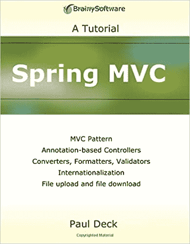
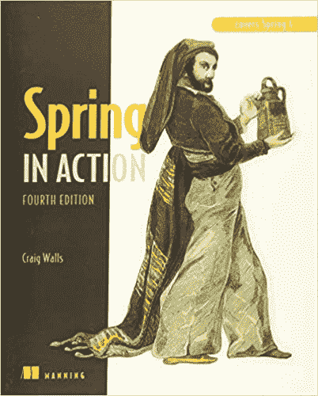
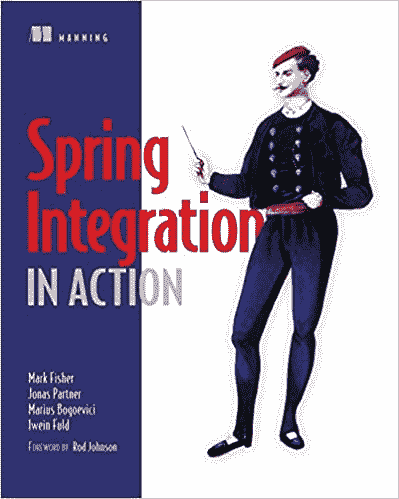
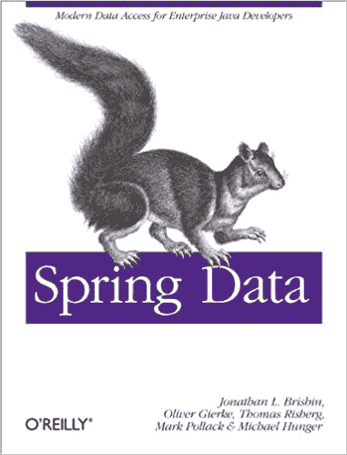
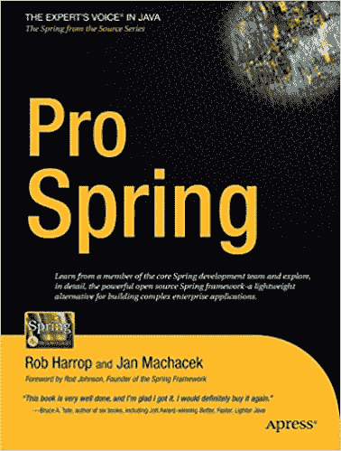
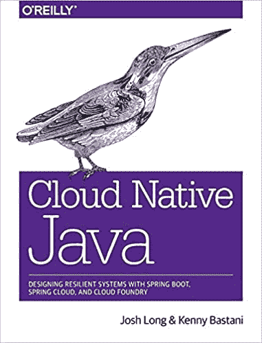
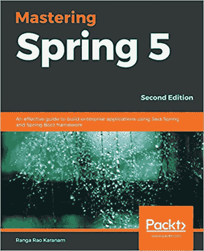

# 用 MVC 学习 Spring 的 10 本最佳 Spring 书籍[更新]

> 原文：<https://hackr.io/blog/spring-books>

Spring 是最流行最强大的 [Java 框架](https://hackr.io/blog/java-frameworks)。使用 Spring，可以快速构建高性能的全栈应用程序。Spring 提供了许多特性，比如依赖注入(控制反转)、面向方面编程。人们需要熟悉这些概念，才能正确地使用它们来构建 spring 应用程序。

您可以通过在线教程和指南学习 Spring，但是，有几本书可以帮助您一步一步地学习，并在需要时快速参考。我在阅读时总是带着荧光笔来标记重要的概念，以便以后参考。书籍是真实的，并且总是容易得到，因此是学习 Spring 框架的最好方法之一。

## 最佳春季书籍

以下是市场上众多春季书籍中的 10 本，排名不分先后:

[** **](https://geni.us/9dQXD7) 这是一本对 Java、JSP、web 编程有所了解，还有点 Spring 的开发人员的好书。它非常好地解释了 Spring MVC。但是，它直接从概念和代码示例开始，不包括设置您的系统或者安装和配置您的 IDE。这不是一本非常详尽的书，所以你可以把它作为参考书，但是从 servlets 的基础开始，然后讨论 Spring API。然后作者继续解释为什么一个概念被发展和它如何进化到今天的样子。作者的写作速度对于很好地掌握概念是完美的，伴随着简单而相关的例子。这本书详细解释了验证器、表单标签、转换器和表达式语言，这些在大多数 Spring 书籍中都找不到。

你可以在这里买到这本书。

 这是一本适合所有类型学习者的好书——初学者、中级和高级。它可以是很好的学习材料、快速参考或指南，也可以作为高级概念的好材料。作者给出了很好的例子来解释每个概念，从核心容器、依赖注入、AOP、高级 bean 连接，到用 Spring 构建一个完整的 web 应用程序，包括前端和持久性(数据)层。文笔简洁明了。对于[全栈软件开发人员](https://hackr.io/blog/how-to-become-a-web-developer)来说，这是一本很棒的书，作者对数据库和核心容器方面给予了同等的关注。如果您有 Spring 的工作知识，您也可以跳到第 2 部分，该部分主要讨论 [web 应用程序开发](https://hackr.io/blog/web-application-architecture-definition-models-types-and-more)。这本书还向读者介绍了 Spring boot，尽管只涉及了基础知识。

你可以在这里买到这本书。

 这也是一本中级到高级水平的书，涵盖了关于 Spring integration 的一切。不要指望这本书里有像 DI，AOP 这样的基本核心概念。这本书详细而全面。作者采用了一种很好的方法，他首先告诉你如何用普通的 Java 做一些事情，然后如何使用 Spring integration 来改进它。这本书很好地平衡了概念、解释和例子。图表很好。这本书的大部分内容都是基于实践的方法。除了详细介绍集成之外，它还介绍了批处理和调度等更高级的概念。如果您对 EIP(企业集成模式)没有太多的了解，您可以参考其他资源；这本书假设你已经掌握了 Java、J2ee 和 Spring 的一些基础知识。

你可以在这里买到这本书。

 这是一本给有抱负的数据科学家的好书。这本书最好的部分是它涵盖了如何将 Spring 与 Apache Hadoop 集成，这是大数据和数据科学的重要组成部分。你可以从作者的语气中感受到他知识的深度和概念的清晰。除了对 Spring 数据的彻底解释，还有很多例子。你可以按照书中的指导来设置你的系统，这样你就可以在工作中使用这些例子了。如果你想了解 Spring 的核心概念，这本书不适合你。它只讨论了数据库层以及 Spring 如何与之集成。Spring 数据模块有详细介绍。这个流程很好，因为作者首先从 JDBC 等传统方法开始，然后转移到 MongoDB、Neo4j、HBase 等非关系数据库。

你可以在这里买到这本书。

这是一本鼓励你通过实践而不是阅读关于一个概念的理论来学习的书。它清晰简洁，非常适合初学者。从开始的一步一步的指导开始，到后面介绍更复杂的主题，这本书组织得很好，涵盖了 Spring 框架的所有方面。对于那些从事 Spring 项目并希望偶尔刷新或参考一些材料的人来说，这是一个很好的参考指南。这些例子很实用，可以帮助你从更大的角度思考我们为什么要这样做。第一章概述了核心概念，如容器、AOP、DI、web 应用程序、消息传递、集成和单元测试模块。关于这两个方面的后续章节还涵盖了 Spring 数据和 Spring 安全性。

后面的章节还分别介绍了用 Java 和 RxJava2 进行函数式和反应式编程。

你可以在这里买到这本书。

 这对每个 Java/J2ee 程序员来说都是一个很好的资源。这本书假设读者是新手；但是，如果你已经有了一两个 Spring 项目的经验，你仍然会受益匪浅。这本书涵盖了广泛的主题，其中大部分是详细的，有些只是概述。这本书更侧重于为什么你需要一个概念，而不仅仅是解释概念本身。有许多代码示例，它们都很容易理解和使用。作者遵循简单的语言，流程一致。对于如此庞大的一本书，人们会期望作者涵盖 Spring security、boots 和微服务。然而，这本书并没有涵盖这些，而是关注核心 spring、web 开发、持久性和事务管理。你也可以看看这本书的[更新版本](https://www.amazon.com/Pro-Spring-Depth-Guide-Framework/dp/1484240553/)，它涵盖了 Spring 5。

你可以在这里买到这本书。

这本书初看起来似乎杂乱无章，笨拙不堪，但当你浏览各章时，你会发现这本书的方法非常好。这是彻底的，易于理解，并充满了代码示例。作者给出了许多解决问题的方法，读者可以通过选择适合他们项目的方法来充分利用这些方法。唯一的缺点是从提到的网站(Apress)下载的源代码与书中使用的略有不同。有一些错误，您必须在运行代码之前纠正它们——这看起来可能是一件非常糟糕的事情，但是它允许您首先自己纠正错误，而不用查看书本。一本好书包含了大量关于 Spring 基础和高级概念的信息，包括 AOP、DI、安全性、事务、MVC、REST、消息传递、集成等等。

你可以在这里买到这本书。

 这是一本给高级程序员的书。如果你正在寻找 Spring 的核心概念，这不是你要找的。它涵盖了如何使用 Spring boot、cloud 来简化您的应用程序，并使用示例温和地介绍了这些概念。这本书的方法是不同的。它通过例子而不仅仅是理论来解释概念。这本书触及了所有的高级概念，尽管它没有深入解释其中的许多概念——例如，你不会找到太多关于 cloud foundry 的内容，尽管它已经在任何地方使用，另一方面，这本书将一切都基于微服务。然而，作者向您指出了许多有用的资源，在这些资源中，您可以阅读关于 cloud foundry 和本书中很少解释的许多其他主题。

你可以在这里买到这本书。

这本书用简洁的例子解释了许多设计模式，让你开始最佳的编码实践。您将能够将每个设计模式与 Spring 的核心概念对应起来，以及如何在您的项目中轻松实现它们。这不是基础的 Spring 教程；通过遵循好的设计模式来解决设计问题是一个很好的尝试。核心概念遍布全书，解释透彻。书的语言很简单，作者似乎很懂一个开发者的心理。章节的流程是系统的。然而，你可以跳到任何一章，因为每个设计模式都是独立的——在阅读这本书之前，你应该了解 Java、XML 和 JSP。如果你以前做过 Spring 项目，也可以更好地理解这本书的内容。

你可以在这里买到这本书。

 虽然作者有时假设你对 Spring 有工作知识，但他解释所有的核心概念就像在向外行人解释一样。这本书的结构很好，作者详细说明了每章的内容。第一章概述了所有重要的特性和概念。随着每章的深入，主题的复杂性也在增加。流程很好，这本书涵盖了广泛的主题，如 Spring 安全、构建 RESTful APIs、React、Spring Boot、Spring 数据、Kotlin 和 Spring 微服务，虽然没有太多细节，但这是一个好的开始。对于高级主题，您可能还需要参考其他资源。不过基本概念解释的很好。

你可以在这里买到这本书。

[春天&初学冬眠(包括 Spring Boot)](https://click.linksynergy.com/deeplink?id=jU79Zysihs4&mid=39197&murl=https%3A%2F%2Fwww.udemy.com%2Fcourse%2Fspring-hibernate-tutorial%2F)

## **春季赠书**

奖金书不是关于 Spring core，而是分别关于 Spring boot 和微服务。这些是学习引导和微服务的最佳书籍——但是你必须首先学习 Spring 框架的基础知识才能欣赏这些书籍。

 这本书有动手操作的方法，所以如果你正在寻找基本概念和一步一步的解释，你可能会发现一开始很难理解。然而，随着章节的进展，你会开始理解作者为什么采用这种方法。

你可以在这里买到这本书。

如果你是一个拥有基础知识和至少几个月 Spring 经验的 java 开发人员，这将是你一直想要拥有的财富。例子很棒，作者语气温和，自然带你从理论走向实践。概念的详细描述和涵盖的主题非常广泛。最棒的是，作者通过解释为什么微服务对构建应用程序如此有用，让你开始欣赏微服务。

你可以在这里买到这本书。

## 还有呢？

## 此外，我还发现“[Professional Java Development with the Spring Framework](https://www.amazon.com/Professional-Java-Development-Spring-Framework/dp/0764574833?tag=javamysqlanta-20)”是一本很好的参考书，一步一步地解释了 Spring Framework。虽然大约 15 岁，概念和例子仍然保持良好，比任何较新的书籍。这本书没有上榜，因为它没有新的春季功能，但它仍然值得一提。

**结论**

## 学习 Spring 很容易，如果你已经知道 Java，你总是可以使用 eclipse IDE 或者任何你喜欢的 IDE 来解决它。我们提到的许多书籍在你的项目中都是很方便的参考资料。关于 Spring 5 设计模式的这本书是为 Java 开发人员准备的，他们已经掌握了 Spring 概念的工作知识，但是希望通过最佳的编码实践来提高代码性能。如果你对 Spring 一无所知，“Spring 框架入门”将帮助你入门，接下来是“Spring 在行动”如果你是一名数据科学家，正在寻找 Spring 如何处理你的大数据的想法，Spring data 将是一本完美的书。无论您选择哪本书，在开始学习更复杂的概念(如 Spring integration、remoting 和微服务)之前，建立一个坚实的基础是非常重要的。

**人也在读:**

**People are also reading:**