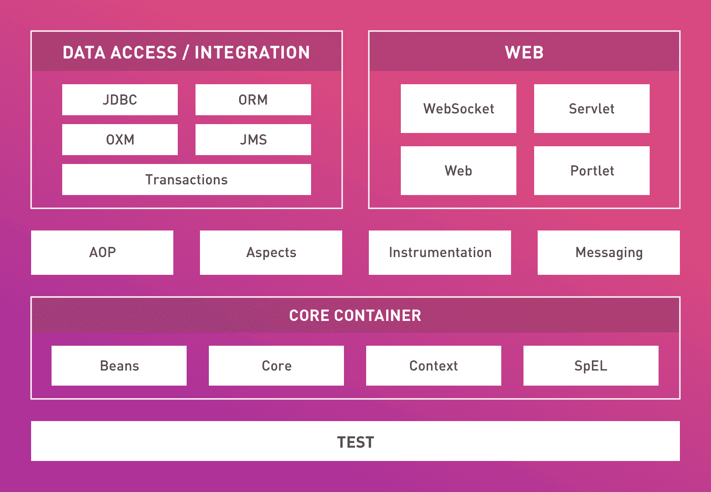

# 50 个最佳春季面试问答[更新]

> 原文：<https://hackr.io/blog/spring-interview-questions>

自从 2002 年 10 月发布以来，Spring Framework 已经成功地成为 Java 开发人员的顶级应用程序框架。事实上，它在领先的后端 web 开发框架中占据了一席之地。因此，选择 Spring Framework 职业是非常有利可图的。

## 春季面试常见问题和答案

Spring Framework 有大量的概念，为了在游戏中保持领先地位，人们需要对这些概念有一个有效的理解。如果你正在准备春季求职面试，那么这里有一些你必须知道答案的春季面试问题:

#### **问题:**请列出 Spring 框架的各种特性以及使用这些特性的优势。

**答案:**

Spring 框架的特性:

*   允许创建和管理应用程序对象的配置和生命周期
*   AOP(面向方面编程)通过将应用程序业务逻辑从系统服务中分离出来，为统一开发提供了支持
*   高度可配置的 MVC web 应用程序框架，能够轻松切换到其他框架
*   对象给出它们的依赖关系，而不是寻找或创建依赖对象。这种设计原则被称为 IoC(控制反转)
*   轻量级选手
*   为事务管理提供了一个通用的抽象层，也可以在无容器环境中使用
*   JDBC 抽象层提供了简化错误处理的异常层次结构

优势:

*   支持进一步支持持续集成和可测试性的 [POJO(普通旧 Java 对象)](https://en.wikipedia.org/wiki/Plain_old_Java_object)编程
*   没有供应商限制的开源软件
*   由于依赖注入和控制反转，简化了 JDBC
*   由于分层架构，很容易保留您想要的，丢弃您不想要的

#### **问题:H**Spring 框架有多少模块？

**回答:** Spring 框架大概有 20 个模块。它们中的每一个都被分类为以下层之一:

*   Spring 核心容器——Spring 框架的基本核心层。它具有以下模块:
*   Spring 表达式语言
*   春豆
*   弹簧芯
*   春天语境
*   数据访问/集成——这是负责支持与数据库交互的层。它包含以下模块:
*   JDBC (Java 数据库连接)
*   Java 消息服务
*   对象关系映射
*   OXM(对象 XML 映射器)
*   交易
*   Web——为创建 web 应用程序提供支持是这一层的职责。它有这些模块:
*   网
*   web–MVC
*   web–Portlet
*   网络-插座
*   面向方面的编程——允许使用建议、切入点和其他方法来分离代码
*   插装——为类插装和类加载器实现提供支持
*   测试——负责为使用 JUnit 和 TestNG 完成测试提供支持

一些额外的 Spring 框架模块是:

*   方面——提供与 AspectJ 集成的支持
*   消息传递——提供对 STOMP 和注释编程模型的支持，用于处理和路由来自 WebSocket 客户端的 STOMP 消息



#### **问题:**一个 Spring 应用有哪些组件？

**答:**典型的弹簧应用可以细分为以下几个部分:

*   Bean 类——包含属性、函数、setter 和 getter 方法等等
*   Bean 配置文件–包含关于类以及如何配置类的信息
*   接口–定义功能
*   Spring 面向方面编程——提供横切关注点的功能
*   用户程序–使用该功能

#### **问题:**你对 Spring IoC 容器的理解是什么？说明他们的类型。

**答:**Spring IoC 容器位于 Spring 框架的核心。该容器使用依赖注入来管理各种 Spring 应用程序组件。

IoC 容器负责创建对象，配置它们，将它们连接在一起，并管理它们的生命周期。容器从所提供的配置元数据中接收大致相同的指令。

用于提供配置元数据的装置可以包括 Java 注释、Java 代码或 XML。Spring 中有两种 IoC 容器:

*   application context–提供附加功能。它构建在 BeanFactory 接口之上。
*   beans factory——一个预打包的类，包含一组 bean。根据客户端的要求，随时实例化 bean

#### **问题:**请解释一下春天的依赖注入。同样的东西有多少种用法？

**答:**依赖注入允许定义应该如何创建对象，而不是直接创建对象。因此，代码不直接包含将组件和服务连接在一起。

配置文件包含哪些组件需要哪些服务的信息。IoC 容器负责将组件与适当的服务连接起来。依赖注入可以以下列形式使用:

1.  建筑注射
2.  定型剂注射

#### **问题:**你能区分春天的 ApplicationContext 和 BeanFactory 吗？

**答案:**

*   基于注释的依赖——bean factory 不支持基于注释的依赖，而 ApplicationContext 支持
*   接口定义–bean factory 接口在 org . spring framework . beans . factory . bean factory 中定义，而 ApplicationContext 接口在 org . spring framework . context . application context 中定义
*   国际化支持——虽然 ApplicationContext 支持国际化，但 BeanFactory 不支持
*   对象管理–bean factory 使用语法来提供资源对象。相反，ApplicationContext 自己创建和管理资源对象
*   初始化类型–application context 利用急切或主动初始化。另一方面，BeanFactory 使用惰性初始化

**答:**配置元数据提供给 Spring 容器的方式有三种，列举如下:

*   基于注释的配置——默认情况下，Spring 容器中的注释连接是关闭的。在适用的类、字段或方法声明上使用注释，可以替代使用 XML 来描述 bean 连接。
*   基于 Java 的配置——这是 Spring Framework 中最新形式的配置元数据。它有两个重要组成部分:
    1.  @Bean 注释–与<bean>元素的注释相同</bean>
    2.  @Configuration annotation–允许通过简单地调用同一个@ Configuration 类中的其他@bean 方法来定义 Bean 间的依赖关系
*   基于 XML 的配置——依赖关系以及 beans 所需的服务是在遵循 XML 格式的配置文件中指定的。通常，这些配置文件包含几个特定于应用程序的配置选项和 bean 定义。

#### **问题:W** 你对春豆的理解是什么？Spring 框架支持多少个 bean 作用域？

**答:**由 Spring IoC 容器配置、实例化、管理和连接的 Spring Beans 是构成 Spring 应用程序核心的对象。Spring Beans 是用提供给 Spring IoC 容器的配置元数据创建的。

Spring Framework 总共支持 5 个作用域:

*   Global-session *–为全局 HTTP 会话提供 bean 定义的范围
*   prototype——为具有任意数量的对象实例的单个 bean 定义提供范围
*   request *–为 HTTP 请求提供 bean 定义的范围
*   session *–为每个 Spring IoC 容器的单个实例提供 bean 定义的范围
*   singleton——为每个 Spring IoC 容器的单个实例提供 bean 定义的范围。仅在使用 web 感知的 ApplicationContext 时可用。

#### **问题:P** 请解释一下 Spring Bean Factory 容器中的 Bean 生命周期？

**答案:**

1.  bean 生命周期从 Spring IoC 容器实例化 XML 文件中 bean 定义的 bean 开始
2.  正如 bean 定义中所指定的，Spring 然后使用 DI 填充所有属性
3.  如果 bean 实现了 BeanNameAware 接口，则通过传递 bean ID 来调用 setBeanName()方法
4.  如果 bean 实现了 BeanFactoryAware 接口，则通过传递 bean 的实例来调用 setBeanFactory()方法
5.  如果有任何 BeanPostProcessors 与 bean 相关联，那么将调用 preprocessbeforeininitial ization()方法
6.  如果为 bean 指定了 [init 方法](https://stackoverflow.com/questions/5419695/init-method-in-spring-controller-annotation-version),则调用该方法
7.  最后，如果有任何与 bean 相关联的 bean postProcessAfterInitialization()方法将被调用。

**问题:什么是 Spring 配置文件？**

**答:**由于 spring 是基于依赖注入的概念，所以所有的类、接口以及它们的依赖关系都存储在一个称为 Spring 配置文件的文件中。它是一个. xml 文件。spring 容器使用这个文件来控制 spring beans 的生命周期。一个 bean 被配置为:

```
<bean id = "..." class = "..." init-method = "..." lazy-init="true" destroy-method="....">
 <!-- bean dependencies and configurations -->
</bean>
```

#### **问题:IoC(控制权倒置)有什么好处？**

**答案:**优点有:

*   不需要编写大量关于如何创建服务和获取对象引用的代码。一切都可以通过简单的配置实现。只需添加一个构造函数或 setter 方法，就可以添加新的依赖项和服务。
*   代码更易于单元测试，因为它被设计成几个组件，开发人员可以注入他们的对象并切换实现。
*   部件耦合松动。
*   允许对象和依赖关系的延迟加载。

#### **问题:Spring Bean Factory 容器中的 Bean 生命周期是怎样的？**

**答案:**豆子生命周期如下:

*   从 spring 配置文件中找到的 bean 定义中，Spring 容器实例化了 bean。
*   使用依赖注入，bean 定义中指定的所有属性都被填充。
*   如果 bean 实现了 BeanNameAware 接口，则 bean factory 会绕过 bean 的 ID 来调用 setBeanName()。
*   如果 bean 实现了 BeanNameAware 接口，则通过传递 bean 的实例来调用 setBeanFactory()。
*   如果任何 BeanPreProcessors 与 bean 相关联，则调用 preprocessbeforeininitial ization()方法。
*   如果为 bean 定义了 Init-method，就会被调用。
*   最后，如果需要，调用 postProcessAfterInitialization()方法。

#### **问题:解释春天的内豆。**

**答案:**内豆是存在于另一个豆的范围内的豆。这个概念类似于 Java 中的内部类。内部 bean 被定义为外部 bean id 标记内的目标。

```
<bean id = "outerBean" class = "...">
 <property name = "target">
 <bean id = "innerBean" class = "..."/>
 </property>
</bean>
```

#### **问题:**什么是基于标注的容器配置？另外，解释如何在 Spring 框架中打开注释连接。

**答:**基于注释的容器配置是 XML 设置的替代方案。开发人员不使用 XML 来描述 bean 连接，而是通过在适当的类、字段或方法声明上使用注释，将配置转移到组件类。

因为默认情况下注释关联是关闭的，所以需要打开它才能使用。这是通过在 Spring 配置文件中配置元素来完成的。

#### **问题:**请解释一下 Spring 支持的各种注释。

**答案:**

*   @ auto wired–用于在 setter 方法、属性、构造函数或具有任意名称或多个参数的方法上自动连接 bean。它可以精确控制自动布线的方式和位置。
*   @ Component——Spring 管理的组件的一个通用原型，它将一个 Java 类标记为一个 bean，可以被组件扫描机制拾取并将其放入应用程序上下文中。
*   @ Controller–将类标记为 Spring Web MVC 控制器。用该注释标记的 Beans 被自动导入依赖注入容器。
*   @ Qualifier——与@Autowired 注释一起使用，用于指定几个相似的 beans 中只有一个需要连接。
*   @ Repository——组件注释的专门化，具有几乎相同的用途和功能。具体来说，它为 [DAOs(数据访问对象)](https://docs.spring.io/spring/docs/4.2.x/spring-framework-reference/html/dao.html)提供了额外的好处。
*   @ request mapping–将特定的 HTTP 请求方法映射到负责处理相应请求的控制器中的特定类或方法。
*   @ Required–应用于 bean 属性设置器方法，它指示需要在配置时使用 bean 定义中的显式属性值或通过自动连接来填充 bean 属性。如果没有填充 bean 属性，容器将抛出 BeanInitializationException 消息。
*   @ Service——组件注释的另一个专门化。尽管它没有在组件注释上提供任何额外的行为，但是它可以在服务层类中的@component 注释上使用，以更好的方式指定意图。

#### **问题:W** 你说的弹簧刀托是什么意思？

**回答:**Spring DAO 支持以一种可靠的方式简化了数据访问技术，比如 JDBC、JDO 和 Hibernate。此外，它允许编码而不用担心捕捉特定技术的异常，并且很容易在持久性技术之间进行切换。

#### **问题:**JDBC API 包含哪些类？

**答案:**

*   JDBC 模板
*   NamedParameterJdbcTemplate
*   SimpleJdbcCall
*   SimpleJdbcInsert
*   SimpleJdbcTemplate

#### **问题:**你将如何使用 Spring 框架访问 Hibernate？

**答:** [Hibernate](https://hackr.io/tutorials/learn-hibernate-framework?ref=blog-post) 使用 Spring 框架可以通过以下两种方式访问:

1.  扩展 HibernateDAOSupport，然后应用 AOP 拦截器节点
2.  用 Hibernate 模板和回调实现控制反转

#### **问题:**列举 Spring 支持的事务管理类型。

**答:** Spring 框架支持两种类型的事务管理:

*   声明式事务管理——虽然事务管理与业务代码分离，但只有注释或基于 XML 的配置用于管理事务。
*   程序化交易管理–通过编程来管理交易。虽然极其灵活，但维护起来非常困难。

#### **问题:**请解释一下 AOP 技术。

**回答:** AOP 或面向方面编程是一种编程技术，它允许程序员模块化跨越典型的责任划分或横切关注点的行为。日志和事务管理是横切关注点的例子。

#### **问题:**春天的忠告是什么？解释它的各种类型。

**答:**在 Spring 框架中，某个方面在某个特定连接点上采取的任何动作都被称为 Advice。Spring AOP 利用 advice 来维护连接点“周围”的拦截器链，即作为一个拦截器。建议可以是以下类型:

1.  After(finally)–使用@After 注释标记配置，在连接点方法之后执行，无论是正常退出还是抛出异常
2.  返回后——使用@AfterReturning 注释标记配置，在连接点方法完成正常执行后立即执行
3.  抛出后——使用@AfterThrowing 注释标记进行配置，当且仅当 jointpoint 方法通过抛出异常退出时才执行
4.  Around–使用@Around 注释标记配置，在连接点方法之前和之后执行
5.  Before–使用@Before 注释标记配置，在连接点方法之前执行

#### 问题:你能比较一下 Spring AOP 中的关注点和横切关注点吗？

**回答:**虽然关注点是开发人员希望在 Spring 应用程序的特定模块中拥有的行为，但是横切关注点是适用于整个 Spring 应用程序的关注点。

#### **问题:**你所理解的 Spring MVC 框架是什么？

**回答:**Spring MVC 框架负责提供模型-视图-控制器架构以及现成的组件，用于开发灵活、松耦合的 web 应用。

MVC 模式有助于分离应用程序的各个方面，比如业务逻辑、输入逻辑和 UI 逻辑，此外还提供了这些分离元素之间的松散耦合。

#### **问题:**请解释 DispatcherServlet。

**回答:**dispatcher servlet 是 Spring Web MVC 框架的精髓，它处理所有的 HTTP 请求和响应。在从配置文件接收到处理程序映射条目后，DispatcherServlet 将请求转发给控制器。

此后，控制器返回模型和视图的对象。之后，Dispatcher Servlet 检查配置文件中的视图解析器条目，并调用指定的视图组件。

#### **问题:春天是什么？**

**答:** Spring 是一个集成框架，用于用 Java 语言开发企业应用。

#### 问题:Bean 工厂和应用程序上下文之间有什么不同吗？

**回答:**是的，Bean Factory 和 Application Context 有很多区别。这些情况说明如下:

| 豆制品厂 | 应用程序上下文 |
| 这是一个基本的容器 | 这是一个高级容器 |
| 它的界面有限。 | 它扩展了 Bean 工厂接口 |
| 它提供各种基础设施。 | 它提供了比 Bean Factory 更多的功能，包括与 Spring AOP 的集成、i18n 的消息资源处理以及其他各种功能。 |

#### 问:构造函数注入和 Setter 注入有什么区别？

**答:**构造器注入和设置器注入之间的区别如下

| 构造函数注入 | 定型剂注射 |
| 它有一个完整的注射 | 它有部分注射 |
| 它不重写 setter 属性 | 当两者都被定义时，它重写构造函数属性。 |
| 当需要修改时，它会创建新的实例。 | 当属性值更改时，它不会创建新的实例。 |
| 它比 Setter 注入有更多的优点 | 这对一些房产是有好处的。 |

#### **问题:定义春天自动写作？**

**回答:**Spring 中的 Autowiring 帮助计算机程序员自动应用 bean，无需编写显式注入逻辑。各种自动书写模式包括以下几种。

1.  号码
2.  别名。
3.  byType。
4.  构造函数。

#### **问题:Spring 框架中有哪些不同类型的 Bean 作用域？**

**答案:**Spring 框架中主要有五种类型的 Bean 作用域。其中包括以下内容。

1.  单身。
2.  原型。
3.  请求。
4.  会话。
5.  全球会议。

#### **问题:春天的切入点是什么？**

**回答:**切入点是 Spring AOP 的一种表达式语言。

Spring framework 有哪些不同的最新版本？

Spring 框架的最新版本如下。

1.  春天 2.5
2.  春天 3.0
3.  春天 4.0

#### 问题:什么是连接点？

**答:**连接点是程序执行过程中的一个点，代表方法执行。它包括方法的执行，甚至是异常的处理。

#### **问题:Spring AOP 和 AspectJ AOP 有什么区别？**

**答:**Spring AOP 和 AspectJ AOP 有几个不同之处，分别陈述如下:

| 春季 AOP | AspectJ AOP |
| 代理是通过运行时编织完成的。 | 编译时编织是通过 AspectJ Java 工具完成的 |
| 应用了方法级切入点 | 应用字段级切入点 |
| 它基于 DTD | 它基于模式和注释配置 |

#### **问题:Spring 框架中的代理是什么？**

**答:**Spring 框架中的代理是指在将建议应用到特定的目标对象之后创建一个对象。

#### **问题:什么时候目标对象和代理对象是一样的？**

**答:**客户端对象的情况下，目标对象和代理对象是一样的。

#### **问题:Spring 框架中的编织是什么？**

**答:**Spring framework 中的编织是将一个特定方面与其他应用类型或对象链接起来，从而创建一个建议对象的过程。它主要在运行时执行。

#### **问题:什么是春安？**

**答:** Spring Security 是 Spring 框架中的一个独立模块，主要提供可在 Java 应用程序中使用的认证和授权方法。

#### 问:什么是 Spring Boot？

**答:** Spring Boot 是一个项目的名字，它提供了一套预先配置好的框架，目的是减少样板配置。它有助于用较少的代码启动和运行 spring 应用程序。

#### **问题:什么是反应式编程？**

**回答:**反应式编程是一种非阻塞、事件驱动的应用。它可以通过少量线程进行扩展。反压力在于关键成分，它确保生产者不会压倒消费者。

#### **问题:反应式编程有什么好处？**

**回答:**反应式编程有各种好处，包括以下几点。

1.  它有助于提高计算资源的利用率，包括多核和多 CPU 硬件。
2.  通过减少序列化过程，它有助于提高性能。

#### **问题:无功系统的重要特征是什么？**

**答案:**无功系统的重要特性包括以下几点。

1.  消息驱动。
2.  有弹性。
3.  反应灵敏。
4.  有弹性。

#### **问题:定义 Spring Webflux？**

**答案:** Spring Web flux 是 Spring 的一个高反应性的 Web 框架。它作为 Spring MVC 的替代，提供了一个高度可伸缩的非阻塞堆栈。

#### **问题:定义单声道和通量类型？**

**答案:** Mono 和 Flux 类型，都是弹簧框架 5 的电抗器。Mono 表示单个异步值，而 Flux 表示异步值的流。它们一起帮助实现发布者接口，该接口在反应流规范中有明确的定义。

#### **问题:春季 Mono 和 Flux 的基本区别是什么？**

**回答:** Mono 实现发布器并返回 0 个甚至一个元素而 Flux 实现发布器并返回 N 个元素。

#### **问题:Mono 和 Flux 有什么共同特征？**

**答案:**Mono 和 Flux 的共同特征包括以下几点。

1.  它们代表溪流。
2.  如果不使用 subscribe 方法消耗流，就不能执行它们。
3.  它们是不可变的，可以被反复调用来创建 Flux 或 Mono 的新实例。

#### **问题:Web 客户端和 Webtestclient 的区别？**

**回答:**Web 客户端和 Webtestclient 的区别可以陈述如下。

| Web 客户端 | Webtestclient |
| Web 客户端充当执行非阻塞 HTTP 请求的被动客户端。 | Webtestclient 还充当了一个可以在测试中使用的反应式客户端。 |
| 它可以处理带背压的反应流。 | 它可以通过应用模拟请求和响应对象直接绑定到 WebFlux 应用程序。 |
| 它可以利用 JAVA 8 Lambdas。 | 它可以通过 HTTP 连接连接到任何服务器。 |

#### **问题:你认为 Spring 5 兼容旧版本的 JAVA 吗？**

**回答:**不会，Spring 5 不兼容老版本的 JAVA。它至少需要 JAVA 8 来获得兼容性。

#### 问题:Spring Boot 能允许在同一个应用程序中使用 Spring MVC 或 Spring WebFlux 吗？

**答:**是的，Spring Boot 允许在同一个应用程序中使用 Spring MVC 或 Spring WebFlux，但条件是一次只能使用一个。这是因为 MVC 是一个阻塞范例，而 WebFlux 是非阻塞范例，因此不能一起使用。

#### **问题:Spring MVC 能在 Netty 上运行吗？**

**回答:**不能，Spring MVC 不能在 Netty 上运行。

#### **问题:Spring 5 能和 Jdk9 模块化集成吗？**

**回答:**是的，Spring 5 可以与 Jdk9 模块化集成。这可以表述如下。

步骤 1:创建新类:

```
package com.hello;
public class HelloWorld {
    public String sayHello(){
        return "HelloWorld";
    }
}
```

步骤 2:创建新模块:

```
module com.hello {
    export com.hello;
}
```

步骤 3:创建一个新的 [Java 项目](https://hackr.io/blog/java-projects):

```
module com.hello.client {
    requires com.hello;
}
```

步骤 4:测试新模块:

```
public class HelloWorldClient {
    public static void main(String[] args){
        HelloWorld helloWorld = new HelloWorld();
        log.info(helloWorld.sayHello());
    }
}
```

## 结论

所以，这就是春季面试的首要问题。这些问题一定会帮助你准备好春季面试。

寻找更多春季面试问题？下面是同样很棒的 udemy 课程:[春季面试问题准备课程](https://click.linksynergy.com/deeplink?id=jU79Zysihs4&mid=39197&murl=https://www.udemy.com/course/spring-interview-questions-preparation-course/)。

这里有一本很棒的书，可以帮助你为任何编程面试做好准备:[破解编码面试:189 个编程问题和解决方案](https://geni.us/MmRP)。

祝一切顺利！

一定要看看这些[最佳弹簧教程](https://hackr.io/tutorials/learn-java-spring-framework?ref=blog-post)来进一步完善你的弹簧知识。

**人也在读:**