# 2023 年 12 大最佳 SQL 认证和计划

> 原文：<https://hackr.io/blog/sql-certifications>

数据库是所有数据事务的中心，SQL 是与数据库交互的最流行的语言。学习 SQL 将在你的职业生涯中以多种方式帮助你，如果你是独自学习或与项目一起学习，你可能会留下一些在你的特定项目中不使用但在其他方面很重要的概念。

一些认证给你一个强大的学习方法，然后授予你证书，而其他的测试你的知识，奖励你的优秀。由于您向专家学习，您将获得有效使用 SQL 以获得最佳性能和更少执行时间的实用知识和技巧。

在此了解最佳 SQL 认证，从这些认证的概述开始。

## **2023 年最佳 SQL 认证**

| **课程** | **难度** | **持续时间** | **成本** |
| [**微软认证:Azure 数据基础**](https://docs.microsoft.com/en-us/learn/certifications/azure-data-fundamentals/) | 中间的 | 几个星期 | $99 |
| 新手 | 14.5 小时 | $95 | 新手 |
| 几个星期 | $200 | 新手 | 几个星期 |
| $245 | 初级-高级 | 10 小时 | $45 |
| 新手 | 4 个月，每周 5 小时 | 自由的 | $45 |
| 新手 | 14.5 小时 | $95 | 新手 |
| 7 个月，每周 4 小时 | 自由的 | 14.5 hours | 新手 |
| 1.5 小时 | 1 个月免费试用，如果按年计费，则每月 19.99 美元，如果按月计费，则每月 39.99 美元 | 新手 | 大约 4 个月，每周 3 小时 |
| 自由的 | Beginner | 新手 | 6 周 |
| 每月 19.99 美元的年费或 39.99 美元的月费 | 新手 | 1.5 小时 | 1 个月免费试用，如果按年计费，则每月 19.99 美元，如果按月计费，则每月 39.99 美元 |
| 新手 | 20 小时 | $45 | **2023 年一个 SQL 认证值得吗？** |
| SQL 认证让你比其他拥有相同技能和经验的候选人更有优势。 | 当然，经验和技术知识很重要，但是当需要筛选具有相似背景的候选人时，证书就成了决定性因素。 | 有不同的认证，根据你申请的职位和你拥有的经验，你应该根据需要参加认证。 | 认证还可以帮助你在公司获得更好的项目和角色。如果你在同一家公司换了团队，认证可以帮助你的新团队了解你的专长和核心技能。获得认证表明你对该特定技术非常了解。 |
| **最佳 SQL 专业认证** | **1。** [**微软认证:Azure 数据基础**](https://docs.microsoft.com/en-us/learn/certifications/azure-data-fundamentals/) | [**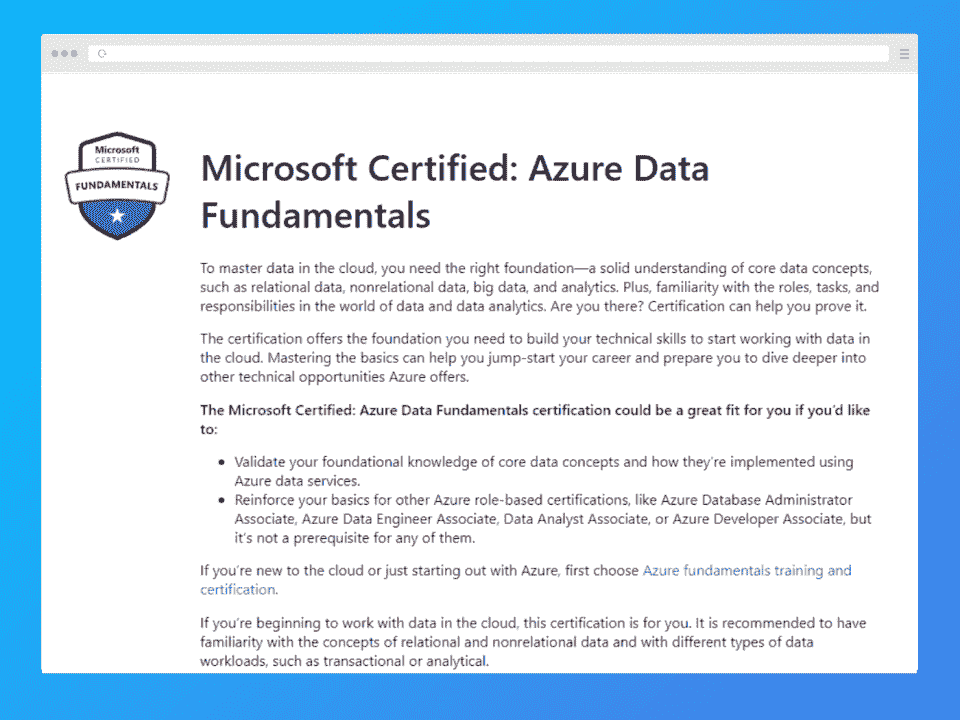**](https://docs.microsoft.com/en-us/learn/certifications/azure-data-fundamentals/) | **课程信息** |

## **课程大纲**

**前提:【Azure 服务、数据定义语言(DDL)、数据操作语言(DML)的基础知识，RDBMS 相关的基本概念**

**难度:**中级

持续时间:几周

**费用:**99 美元

## 核心数据概念，如批处理数据、流数据和关系数据的特征

Azure 上的关系数据

Azure 上的非关系数据

| 数据仓库、架构和工作负载 | 这份微软认证的 Azure 数据基础认证非常关注云中的数据。它教授关系数据、非关系数据、大数据和分析等。如果你打算大量使用 Azure，这是一门不错的课程。 |
| 该课程还为你准备了其他 Azure 认证，如 Azure 数据库管理员助理、Azure 数据工程师助理和 Azure 开发人员助理。此外，您还可以报名参加讲师指导的培训活动。[在这里报名](https://docs.microsoft.com/en-us/learn/certifications/azure-data-fundamentals/)[**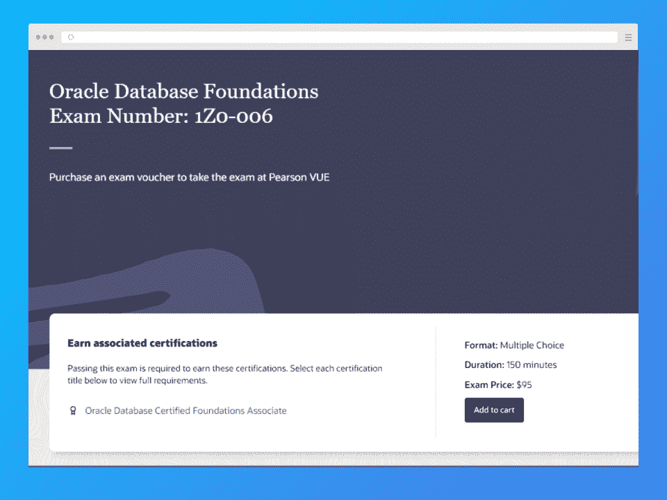**](https://education.oracle.com/oracle-database-foundations-novice-level-exam/pexam_1Z0-006) | **课程信息**

*   **课程大纲**
*   **先决条件:**无
*   **难度:**初学者
*   **持续时间:** 14.5 小时

 |

**费用:**95 美元

数据库基础。

数据库设计与 SQL 编程。

用 PL/SQL 编程。

应用程序快速开发基础。

| 本 [Oracle Academy SQL 基础课程](https://education.oracle.com/oracle-database-foundations-novice-level-exam/pexam_1Z0-006)是一门优秀的基础课程，非常注重职业发展，使用行业相关技术。数据库课程由 4 个专业组成，让您对如何使用 SQL 有一个广泛的了解。您也可以不参加课程而参加认证考试。 | [在这里报名](https://education.oracle.com/oracle-database-foundations-novice-level-exam/pexam_1Z0-006) |
| [**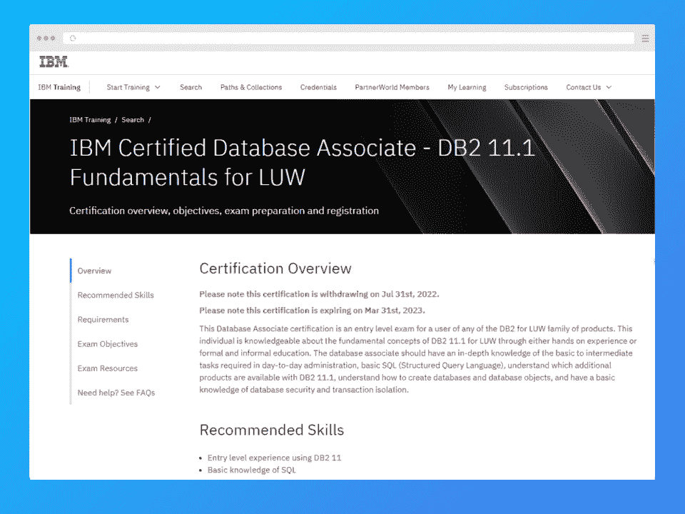**](https://www.ibm.com/training/certification/08003506)**课程信息****课程大纲****先决条件:**SQL 基础知识，使用 DB2 11 的入门级经验 | **难度:**初学者

*   持续时间:几周
*   **费用:**200 美元
*   使用 SQL 和 XML
*   数据安全

 |

连接到 DB2 服务器和其他数据规划概念

编写数据库定义语言 SQL 语句

桌子的知识

| 这个 [IBM 认证数据库助理认证](https://www.ibm.com/training/certification/08003506)是三个中的第一个，也是最基本的一个。您将了解用于 LUW 产品家族的 Db2 关系数据库管理系统。该课程涵盖基本的 SQL 知识、数据库创建、数据库安全性和事务隔离。 | 完成这门课程意味着你可以进入下一门课程。您必须参加 IBM 提供的每个数据库认证的考试。 |
| [在这里报名](https://www.ibm.com/training/certification/08003506)[**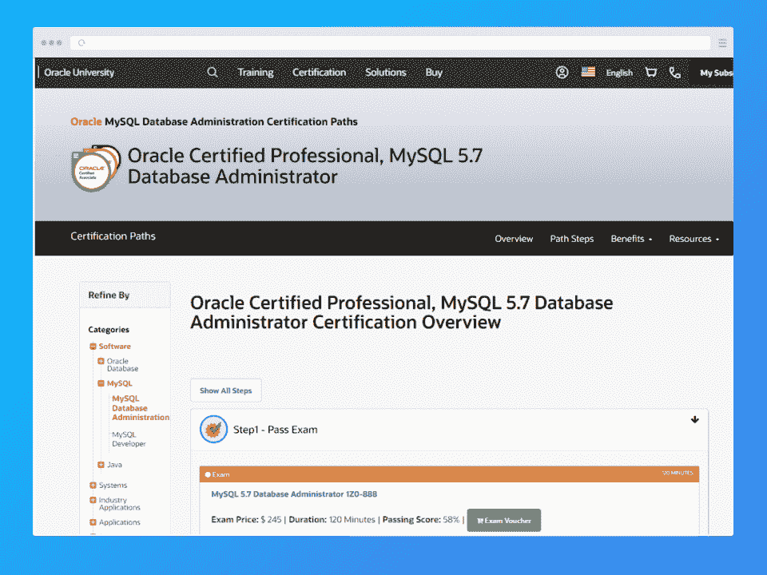**](https://education.oracle.com/oracle-certified-professional-mysql-57-database-administrator/trackp_888)**课程信息****课程大纲** | **先决条件:**无

*   **难度:**初学者
*   持续时间:几周
*   费用:245 美元
*   安装、启动和停止 MySQL
*   了解 MySQL 架构

 |

管理用户

识别 MySQL 的安全风险和其他安全方面

[甲骨文的 MySQL 5.7 数据库管理员认证](https://education.oracle.com/oracle-certified-professional-mysql-57-database-administrator/trackp_888)将侧重于对 MySQL 的基本了解。如果您通过了考试，您将证明您能够安装、配置和监控数据库管理系统。

这是一个非常著名的测试，也是进入 MySQL 世界的一个很好的入口。除了基础知识，您还将学习如何管理用户和识别安全风险。

| [在这里报名](https://education.oracle.com/oracle-certified-professional-mysql-57-database-administrator/trackp_888) | **最佳 SQL 认证项目** |
| [**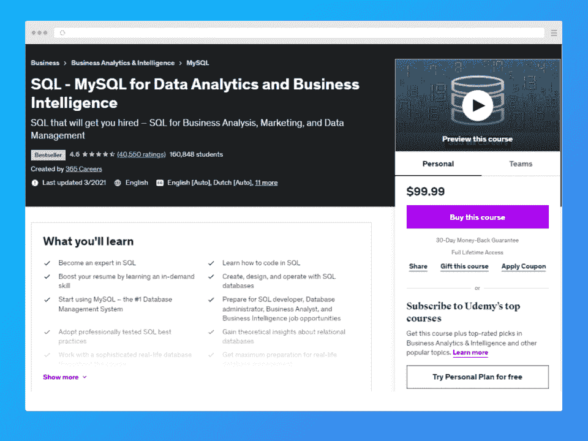**](https://click.linksynergy.com/deeplink?id=jU79Zysihs4&mid=39197&murl=https%3A%2F%2Fwww.udemy.com%2Fcourse%2Fsql-mysql-for-data-analytics-and-business-intelligence%2F&u1=blog%2Fsql-certifications_amcid-OIF2El7zZ2QqYVlgN63xZ)**课程信息****课程大纲****先决条件:**无 | **难度:**初级-高级

*   **持续时间:** 10 小时
*   **费用:**45 美元
*   数据库、SQL 和 MySQL 介绍。
*   SQL 理论

 |

正在安装 MySQL。

数据库创建

MySQL 约束

## SQL 选择、插入、更新、删除、聚合函数、连接、子查询、视图、存储例程。

高级 SQL 主题，如会话、全局变量和触发器

| 结合 SQL 和 Tableau | 如果你想成为数据和商业分析方面的专家，这个 Udemy SQL 课程是合适的。本课程详细介绍了 MySQL，从基础开始，然后转向更高级的 SQL 主题。它也有很多练习来完善你的知识。 |
| [在这里报名](https://click.linksynergy.com/deeplink?id=jU79Zysihs4&mid=39197&murl=https%3A%2F%2Fwww.udemy.com%2Fcourse%2Fsql-mysql-for-data-analytics-and-business-intelligence%2F&u1=blog%2Fsql-certifications_amcid-OIF2El7zZ2QqYVlgN63xZ)[**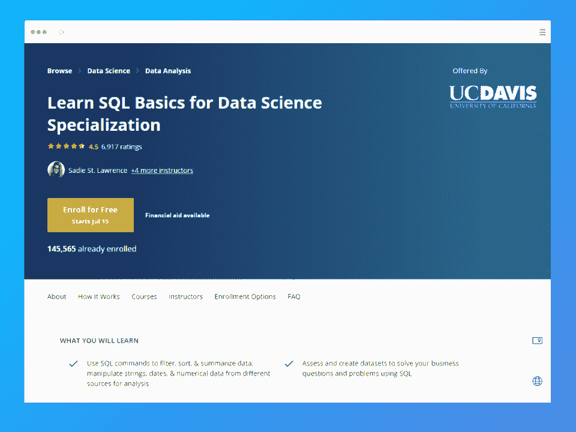**](https://coursera.pxf.io/0JMJ9E?subId3=blog%2Fsql-certification_amcid-zo3A3F77eUYs2xsOqbsVA)**课程信息****课程大纲** | **先决条件:**无

*   **难度:**初学者
*   **持续时间:** 4 个月，每周 5 小时
*   **费用:**免费
*   用于数据科学的 SQL
*   使用 SQL 进行数据争论、分析和 AB 测试
*   使用 Spark SQL 的分布式计算
*   SQL for Data Science 顶点项目
*   本 [SQL 课程由加州大学戴维斯分校](https://coursera.pxf.io/0JMJ9E?subId3=blog%2Fsql-certification_amcid-zo3A3F77eUYs2xsOqbsVA)教授您将 SQL 概念应用到实际的数据科学项目中。它侧重于数据争论、Spark SQL 分布式计算和 AB 测试等概念。

 |

[在这里报名](https://coursera.pxf.io/0JMJ9E?subId3=blog%2Fsql-certification_amcid-zo3A3F77eUYs2xsOqbsVA)

[**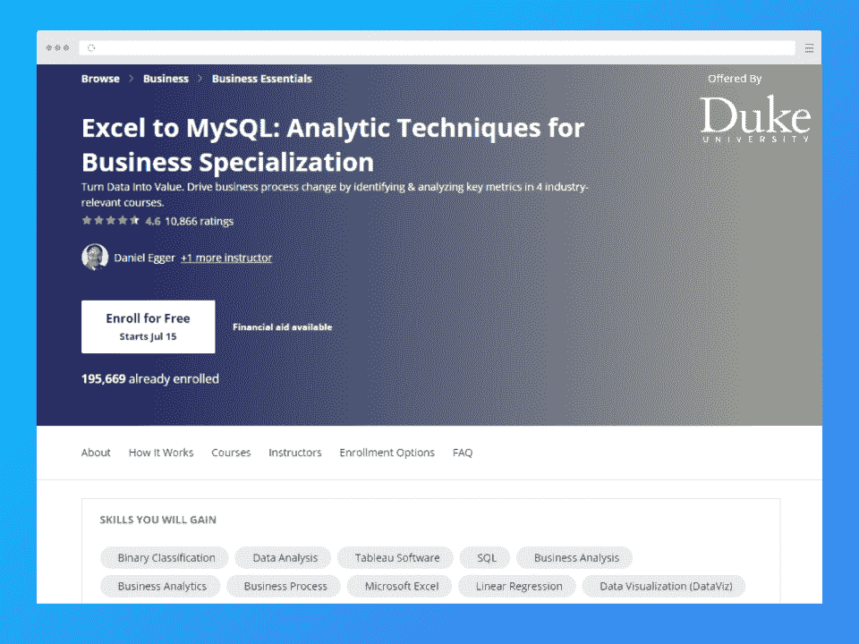**](https://coursera.pxf.io/ORvRYr?subId3=blog%2Fsql-certification_amcid-2r3eEVZFmx6mZlEY2rFzZ)

**课程信息**

| **课程大纲** | **先决条件:**无 |
| **难度:**初学者**持续时间:** 7 个月，每周 4 小时**费用:**免费数据驱动型公司的业务指标 | 掌握 Excel 中的数据分析

*   数据可视化和与 Tableau 的通信
*   使用 MySQL 管理大数据
*   增加房地产管理利润:利用数据分析
*   本[SQL 和 Excel 专业课程](https://coursera.pxf.io/ORvRYr?subId3=blog%2Fsql-certification_amcid-2r3eEVZFmx6mZlEY2rFzZ)旨在从商业角度触及 SQL。如果你的目标是进入数据科学或相关领域，这是一门很好的课程。除了 SQL，你还将学习微软 Excel、商业分析、一些[数据科学工具](https://hackr.io/blog/data-science-tools)和算法。

 |

[在这里报名](https://coursera.pxf.io/ORvRYr?subId3=blog%2Fsql-certification_amcid-2r3eEVZFmx6mZlEY2rFzZ)

[****](https://linkedin-learning.pxf.io/kjWG0z?subId3=blog%2Fsql-certification_amcid-EMxm2NUbMlo2oA63U7sJ2)

**课程信息**

| **课程大纲** | **先决条件:**无 |
| **难度:**初学者**持续时间:** 1.5 小时**费用:** 1 个月免费试用，如果按年计费，则每月 19.99 美元，如果按月计费，则每月 39.99 美元 | 从数据库中选择数据。

*   了解联接类型。
*   数据类型和一些有用的函数
*   添加或修改数据。
*   克服常见的 SQL 错误。
*   关于 SQL 编程的 LinkedIn 课程面向初学者，涵盖了 SQL 的基础知识。这是一门受欢迎的课程，常见的疑问和问题通过广泛而活跃的论坛得以解决。

 |

完成后，您还将能够理解如何进行性能调优和数据库查询的最佳方法，以及所有核心概念，如连接、聚合和选择。

[在这里报名](https://linkedin-learning.pxf.io/kjWG0z?subId3=blog%2Fsql-certification_amcid-EMxm2NUbMlo2oA63U7sJ2)

[**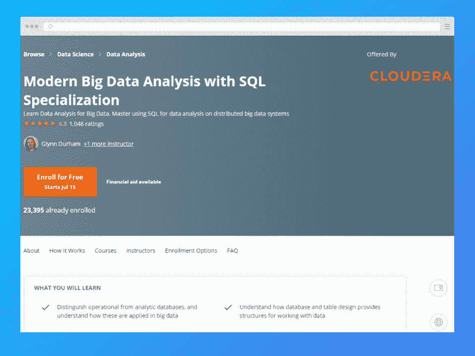**](https://coursera.pxf.io/BXVXnW?subId3=blog%2Fsql-certification_amcid-7B7eUrQz6Z7EVxxYIimJp)

| **课程信息** | **课程大纲** |
| **先决条件:**无**难度:**初学者**持续时间:**大约 4 个月，每周 3 小时**费用:**免费 | SQL 大数据分析基础

*   使用 SQL 分析大数据
*   管理集群和云存储中的大数据
*   这是一门[初级 SQL 课程](https://coursera.pxf.io/BXVXnW?subId3=blog%2Fsql-certification_amcid-7B7eUrQz6Z7EVxxYIimJp)，在这里您可以学习 SQL 并将其应用于大数据分析。它最适合大数据分析，您还将学习如何管理集群和云存储中的大数据。课程也是免费的。
*   [在这里报名](https://coursera.pxf.io/BXVXnW?subId3=blog%2Fsql-certification_amcid-7B7eUrQz6Z7EVxxYIimJp)
*   [**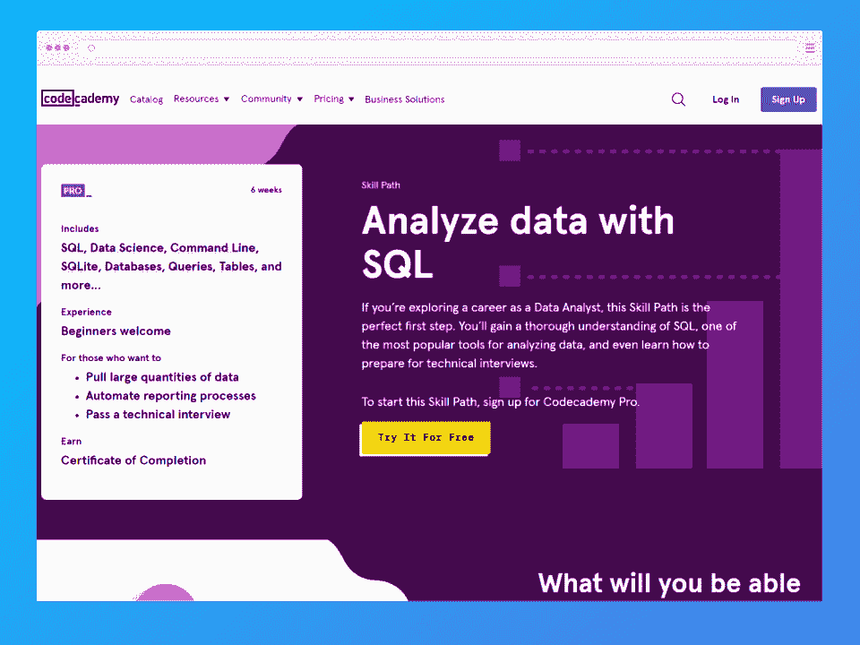**](https://www.pntrac.com/t/TUJGR0lLR0JHRklKSkdCR0ZISk1N?url=https%3A%2F%2Fwww.codecademy.com%2Flearn%2Fpaths%2Fanalyze-data-with-sql)

 |

**课程信息**

**课程大纲**

**先决条件:**无

**难度:**初学者

| 持续时间:六周 | **费用:**年费 19.99 美元/月或月费 39.99 美元 |
| SQL 基础知识数据查询计算和汇总数据连接 | 用 SQL 分析真实数据

*   动手项目:计算流失率、RPA 客户细分、RPA 欺诈检测
*   这个 [Codecademy SQL 课程](https://www.pntrac.com/t/TUJGR0lLR0JHRklKSkdCR0ZISk1N?url=https%3A%2F%2Fwww.codecademy.com%2Flearn%2Fpaths%2Fanalyze-data-with-sql)对每个人都有用，不管你是营销人员还是分析师。如果你以前没有编程知识，并且想进入技术角色，与数据打交道，这是一个很好的开始。还有几个动手项目。
*   [在这里报名](https://www.pntrac.com/t/TUJGR0lLR0JHRklKSkdCR0ZISk1N?url=https%3A%2F%2Fwww.codecademy.com%2Flearn%2Fpaths%2Fanalyze-data-with-sql)

 |

[**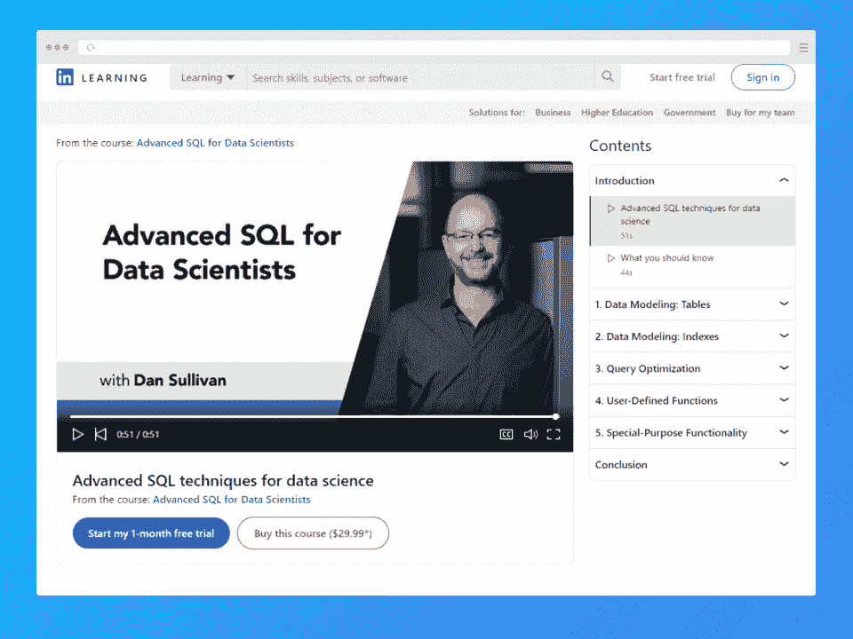**](https://linkedin-learning.pxf.io/9WEaW0?subId3=blog%2Fsql-certification_amcid-IgZUzBJebYiUpYM2MVFZq)

**课程信息**

**课程大纲**

| **先决条件:**无 | **难度:**初学者 |
| **持续时间:** 1.5 小时**费用:** 1 个月免费试用，如果按年计费，则每月 19.99 美元，如果按月计费，则每月 39.99 美元SQL 是数据科学的工具 | 使用 SQL 的基本统计

*   使用 SQL 进行数据管理
*   过滤连接聚合
*   窗口函数和有序数据
*   为分析工具准备数据
*   本[面向数据科学家的高级 SQL 课程](https://linkedin-learning.pxf.io/9WEaW0?subId3=blog%2Fsql-certification_amcid-IgZUzBJebYiUpYM2MVFZq)教授 SQL 过滤和数据操作的基本和高级内容。该课程旨在关注 SQL 对数据科学家的要求，并从数据科学家的角度讲述 SQL 的基本知识。
*   [在这里报名](https://linkedin-learning.pxf.io/9WEaW0?subId3=blog%2Fsql-certification_amcid-IgZUzBJebYiUpYM2MVFZq)

 |

[**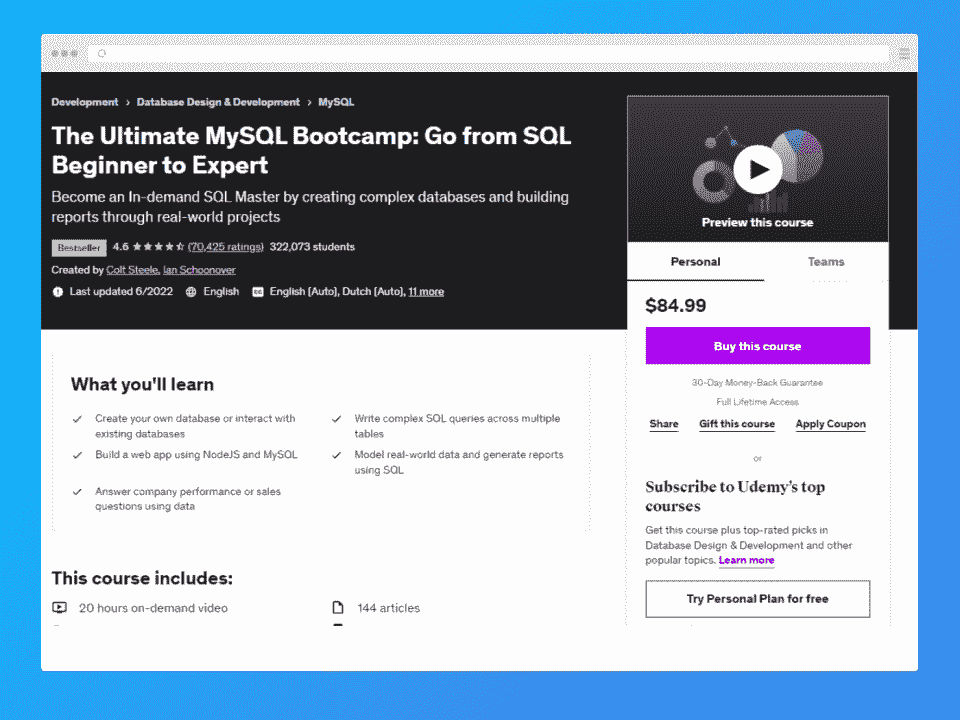**](https://click.linksynergy.com/deeplink?id=jU79Zysihs4&mid=39197&murl=https%3A%2F%2Fwww.udemy.com%2Fcourse%2Fthe-ultimate-mysql-bootcamp-go-from-sql-beginner-to-expert%2F&u1=blog%2Fsql-certifications_amcid-EeqioE6qPxZFNNBJgoFgp)

**课程信息**

**课程大纲**

| **先决条件:**无 | **难度:**初学者 |
| **持续时间:** 20 小时**费用:**45 美元SQL 概述和安装创建数据库和表 | 数据插入、NULL、NOT NULL、主键、表约束

*   CRUD 命令
*   字符串函数
*   使用 distinct、order by、limit、like 通配符
*   聚合函数
*   数据类型
*   逻辑运算符

 |

一对多

Instagram 数据克隆

使用大数据

| 引入节点 | 构建 web 应用程序 |
| 数据库触发器这个 Udemy SQL 课程是一个很好的训练营，它将带你了解这个主题的所有理论。它从基础开始，一直到一些高级概念。它也有很多练习来测试你的知识。当你完成它的时候，你应该准备好去尝试一些真正严肃的项目。[在这里报名](https://click.linksynergy.com/deeplink?id=jU79Zysihs4&mid=39197&murl=https%3A%2F%2Fwww.udemy.com%2Fcourse%2Fthe-ultimate-mysql-bootcamp-go-from-sql-beginner-to-expert%2F&u1=blog%2Fsql-certifications_amcid-EeqioE6qPxZFNNBJgoFgp)**结论** | MySQL 和微软 SQL 是最流行的数据库平台。无论是对于 web 应用程序还是数据科学项目，SQL 都很容易学习并且极其重要。

*   有许多 NoSQL 数据库，但是 SQL 被广泛接受并用于大多数大型项目。有了证书，你可以接触到许多实际项目，并将其添加到你的个人资料中，这将对你有长远的帮助。
*   大多数列出的认证都是针对初级和中级开发人员的，涵盖了您在大多数实际应用中需要的大多数 SQL 技能。

*   通过这个训练营快速学习 SQL
*   [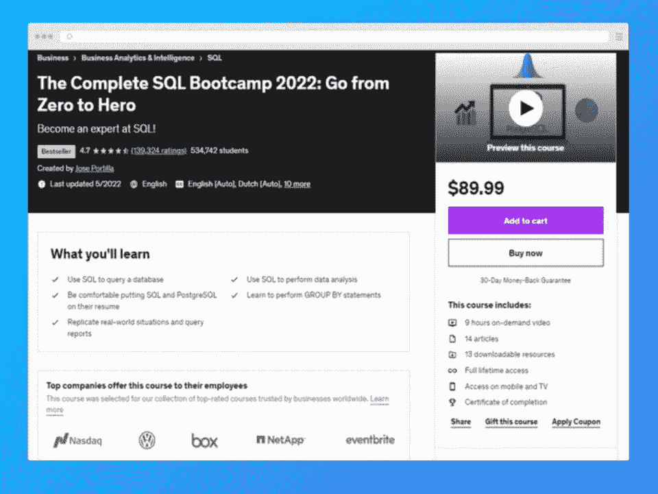](https://click.linksynergy.com/deeplink?id=Qouy7GhEEFU&mid=39197&murl=https://www.udemy.com/course/the-complete-sql-bootcamp/)
*   **常见问题解答**
*   **1。我如何获得 SQL 认证？**
*   您可以通过在线参加顶级 SQL 认证来获得认证。本文中的列表涵盖了许多这样的课程。
*   **2。学习 SQL 需要多长时间？**
*   获得 SQL 证书应该不会花太长时间。预计需要几周到几个月的时间来为这个主题打下坚实的基础。
*   **3。SQL 可以自学吗？**
*   SQL 可以自学，也就是说你通过 SQL 认证在线课程自学。你需要一门课程来指导你学习基础知识和一些理论。
*   **4。哪个证书最适合 SQL？**
*   没有一个证书最适合学习 SQL。一些 SQL 认证专注于特定领域，如数据分析师的 SQL 认证。对于初学者来说，有几个是最好的；检查上面的列表。
*   **5。一个 SQL 证书要多少钱？**

 |

SQL 认证课程的价格可能相差很大。有些课程是免费的，包括上面列表中的几门。其他的价格可能在 50 到 100 美元之间。

**人也在读:**

## **Conclusion**

MySQL and Microsoft SQL are the most popular database platforms. SQL is easy to learn and extremely important, both for web applications and data science projects. 

There are many NoSQL databases, but SQL has wide acceptance and is used in most big projects. With certifications in hand, you can gain exposure to many practical projects and add the same to your profile, which will help you in the long run. 

Most of the listed certifications are for basic and intermediate-level developers, covering most of the SQL skills you will need for most practical purposes.

### Learn SQL Fast With This Bootcamp

## **Frequently Asked Questions**

#### **1\. How do I get SQL certified?**

You can get certified by taking the top SQL certifications online. The list in this article covers many of those courses.

#### **2\. How much time will it take to learn SQL?**

It shouldn’t take too long to earn an SQL certificate. Expect to take anywhere between a few weeks and a few months to get a strong grounding in the subject.

#### **3\. Can SQL be self-taught?**

SQL can be self-taught, meaning you learn by yourself through SQL certification online courses. You’ll need a course to guide you through the basics and some theory. 

#### **4\. Which certificate is best for SQL?**

There’s no one certificate that’s best for learning SQL. Some SQL certifications focus on specific fields, like SQL certifications for data analysts. For beginners, there are several that qualify as the best; check the list above.

#### **5\. How much does a SQL certificate cost?**

SQL certification courses can vary in price quite a bit. Some courses are free, including a few on the list above. Others may cost anywhere between $50 to $100.

**People are also reading:**