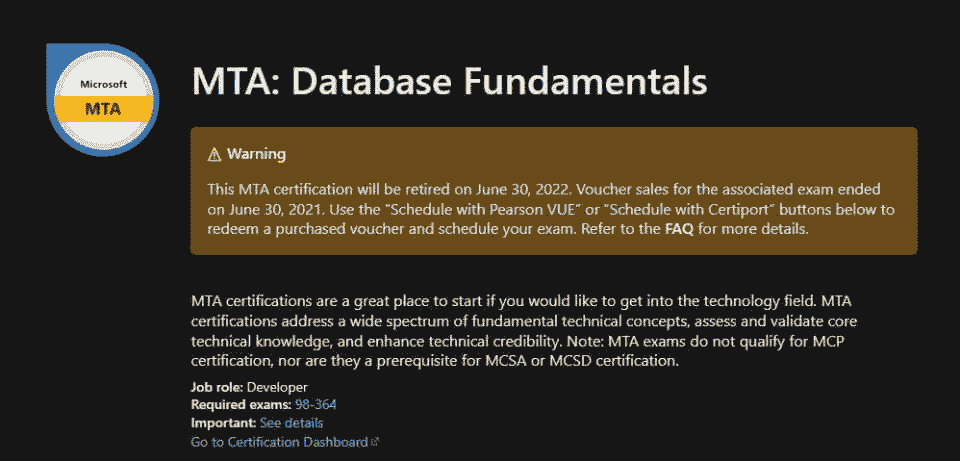
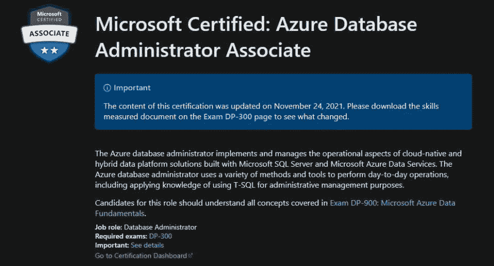
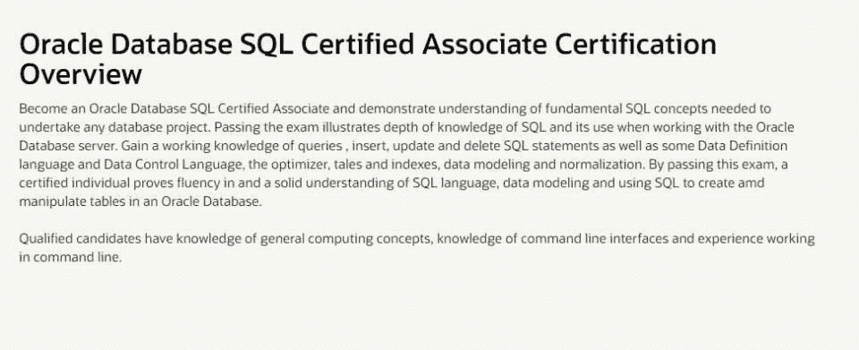
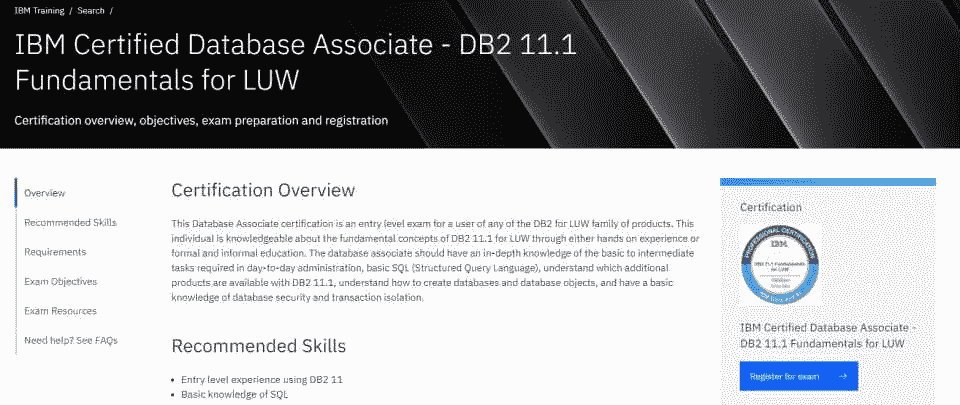
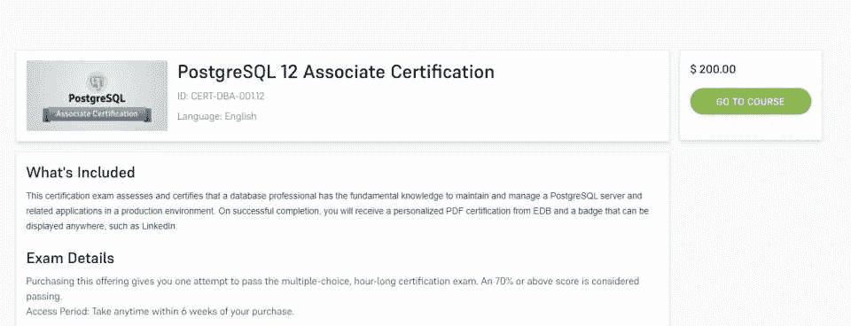

# 推动您职业发展的五大 SQL Server 认证

> 原文：<https://hackr.io/blog/sql-server-certifications>

商业智能和[大数据](https://hackr.io/tutorials/learn-hadoop-big-data?ref=blog-post)将在 2023 年继续增长，因为组织严重依赖数据库来获得有助于形成重要商业决策的见解。因此，需要 SQL 开发人员和数据库工程师。

扎实的 SQL 知识是设计、开发和维护大型关系数据库的关键。展示你技能的最好方法之一是获得 SQL 认证。

这就是我们在这里看到的，在线列出了 5 个最好的 SQL Server 认证。但是首先，让我们来看一些关于 [SQL 认证](https://hackr.io/blog/sql-certifications)的一般性问题。

## **拥有 SQL 认证的好处**

SQL server 认证证明了您的专业知识、技能，最重要的是，证明了您对相关领域的奉献精神。拥有 SQL server 认证对于任何想抓住数据库管理、分析或开发最佳机会的人来说都是有利的。无论你的目标是升职还是寻找一份新的工作，拥有一份证书都会有所帮助。

## **SQL Server 认证**

[****](https://docs.microsoft.com/en-us/learn/certifications/mta-database-fundamentals/)

级别–入门级

| **课程详情** | **教学大纲** |
| **考试编号:** 98-364

*   **费用:**127 美元
*   **问题数量:** 40-60 个

*   **及格分数:** 700/1000

*   **时长:** 45 分钟
*   **必备:**基础 IT 知识

 | 理解核心数据库概念

*   创建数据库对象
*   操纵数据
*   了解数据存储
*   管理数据库
*   [MTA:数据库基础](https://docs.microsoft.com/en-us/learn/certifications/mta-database-fundamentals/)是任何想要获得初级 SQL Server 认证的人的首选。对于很少或没有数据库经验的候选人来说，Microsoft SQL Server 数据库认证是最好的起点。该 SQL 认证验证了基本的数据库和 SQL Server 知识和技能。

 |

你不需要有以前的工作经验来获得这个 SQL 认证。但是，具备基本的 IT 知识是必要的。

[查看认证](https://docs.microsoft.com/en-us/learn/certifications/mta-database-fundamentals/)

[****](https://docs.microsoft.com/en-us/learn/certifications/azure-database-administrator-associate/)

**课程详情**

| **教学大纲** | **检查编号:** DP-300 |
| **费用:**165 美元

*   **问题数量:** 40-60 个
*   **及格分数:** 700/1000

*   **时长:** 120 分钟

*   **必备:**基础 IT 知识

*   规划和实施数据平台资源

 | 实施安全的环境

*   监控和优化运营资源
*   优化查询性能
*   执行任务自动化
*   规划和实施高可用性和灾难恢复(HADR)环境
*   使用 T-SQL 执行管理
*   [微软认证:Azure 数据库管理员助理认证](https://docs.microsoft.com/en-us/learn/certifications/azure-database-administrator-associate/)课程让你走上成为 Azure 数据库管理员的道路。您将了解如何管理和实施使用 Microsoft SQL Server 和 Microsoft Azure 数据服务构建的云原生和混合数据平台解决方案的运营方面。
*   要完成这个微软 SQL server 认证，你需要一些关于微软 Azure 数据基础的经验，但这并不困难，而且这是开始使用云的一个很好的方式。

 |

[查看认证](https://docs.microsoft.com/en-us/learn/certifications/azure-database-administrator-associate/)

[完整的 SQL Bootcamp 2023:从零到英雄](https://click.linksynergy.com/deeplink?id=jU79Zysihs4&mid=39197&murl=https%3A%2F%2Fwww.udemy.com%2Fcourse%2Fthe-complete-sql-bootcamp%2F)

****

**课程详情**

**教学大纲**

| **考试编号:** 1Z0-071 | 费用:244 美元 |
| **问题数量:** 63

*   **及格分数:** 63%
*   **时长:** 120 分钟
*   **必备:**基础 IT 知识

*   了解查询、插入、更新和删除 SQL 语句
*   一些数据定义语言和数据控制语言特性

 | 优化器、故事和索引，

*   数据建模和规范化
*   [Oracle 数据库 SQL 认证助理认证课程](https://education.oracle.com/oracle-database-sql-certified-associate/trackp_457)是您成为 Oracle 认证数据库专家的第一步。这是一门初学者课程，你将学习管理和更新数据库的基础知识。您只需要一些基本的 IT 知识，很容易就可以开始学习这门课程。
*   [查看认证](https://education.oracle.com/oracle-database-sql-certified-associate/trackp_457)

 |

[****](https://www.ibm.com/training/certification/08003506)

**课程详情**

**教学大纲**

**考试编号:** C2090-616

| **费用:**200 美元 | **及格分数:** 68% |
| **持续时间:** 90 分钟

*   **先决条件:**使用 DB2 11 的初级经验，SQL 的基本知识
*   规划

*   安全性
*   使用数据库和数据库对象
*   使用 SQL 处理 DB2 数据

 | 使用 DB2 表、视图和索引

*   数据并发
*   [IBM Certified Database Associate-db 211.1 Fundamentals for LUW](https://www.ibm.com/training/certification/08003506)课程也是一个入门级的 SQL 认证项目，重点是 LUW 系列产品。您需要一些基本到中级的 DB2 11 经验，但这并不困难。本课程包括使用 SQL 处理数据库；表、视图和索引。和数据并发性等等。
*   [查看认证](https://www.ibm.com/training/certification/08003506)

*   [****](https://www.enterprisedb.com/course/postgresql-12-associate-certification)
*   **课程详情**

 |

**教学大纲**

**考试 ID:** CERT-DBA-001.12

**费用:**200 美元

**及格分数:** 70%

| **时长:** 60 分钟 | **先决条件:**PostgreSQL 课程基础 |
| 

*   PostgreSQL 的基础知识，包括系统架构和基础 SQL，
*   数据库的安装、创建和管理

*   PostgreSQL 数据库系统的操作和维护，包括如何备份/恢复和执行日常维护
*   EnterpriseDB 的 PostgreSQL 12 Associate 认证重点是 PostgreSQL，是 SQL 的更高级版本。这是 PostgreSQL 的基础认证，包括学习如何使用它安装、创建和管理数据库。如果你对 PostgreSQL 感兴趣，这个 SQL 证书是个不错的选择。
*   [查看认证](https://www.enterprisedb.com/course/postgresql-12-associate-certification)

 |  

*   **选择一个 SQL Server 认证并开始使用！**
*   SQL server 课程是证明您已为行业角色做好准备的绝佳方式。获得 SQL server 证书需要经验、知识、技能和奉献精神，但它会给你带来超越其他候选人的优势。
*   实践和不断学习是不断提高技能的关键，所以不要认为仅仅通过 SQL 认证就万事大吉了。你可以做很多事情来扩大你的知识面。2023 年的 SQL 认证包含了一些前沿技术，因此非常值得参加以促进你的职业发展。

 |

如果你是一个完全的初学者，你可能想看看[最佳 SQL Server 教程](https://hackr.io/tutorials/learn-sql-server?ref=blog-post)。您还应该考虑阅读书籍、加入数据库社区以及浏览 Hackr for SQL 教程的其余部分。祝你好运！

另外，如果你正在寻找打折的主机包，我们建议你去看看 Namecheap，看看价格合理的[域名](https://www.namecheap.com/domains/registration/gtld/xyz/?clickID=wUoTbQ3KtxyNR9L3K50RiSEKUkAx5g19kXBZwI0&irgwc=1&utm_source=IR&utm_medium=Affiliate&utm_campaign=2890636&affnetwork=ir&ref=ir)和[主机方案。](https://www.namecheap.com/hosting/shared/?clickID=wUoTbQ3KtxyNR9L3K50RiSEKUkAx5gwZkXBZwI0&irgwc=1&utm_source=IR&utm_medium=Affiliate&utm_campaign=2890636&affnetwork=ir&ref=ir)

**常见问题解答**

## **SQL Server 认证的费用是多少？**

SQL 认证的费用会有很大的不同，这取决于您从哪里获得认证以及具体的认证。SQL server 培训费用预计在 100 美元到 250 美元之间。这里列出的 SQL server 课程的平均费用是 187 美元。

**如何获得 SQL 认证？**

获得 SQL 认证非常容易——你所需要做的就是访问 SQL 证书提供商。在这个列表中，我们涵盖了流行的微软 SQL server 认证计划，所以你可以看看这些，以获得你的第一个 SQL 证书。如果你有知识和技能，通过考试就能获得认证。

**哪个 SQL 认证最好？**

## 没有一个 SQL 认证是最好的。如果你是一个完全的初学者，那么你必须从数据库基础 SQL 认证开始，这将是最适合你的。但是每个认证都是有目的的，不能说哪个比哪个好。

## **人也在读:**

The cost of an SQL certification can vary greatly depending on where you get your certification from and the particular certification. Expect to pay somewhere between $100 to $250 for SQL server training. The average cost of the SQL server courses listed here is $187.

## **How Do You Get SQL Certified?**

It’s quite easy to get SQL certified - all you need to do is visit a SQL certificate provider. In this list, we cover popular Microsoft SQL server certification programs, so you can take a look at these to get your first SQL certificate. Provided you have the knowledge and skill, it should not take more than just passing the exam to get certified.

## **Which SQL Certification is Best?**

There is no one SQL certification that is the best. If you’re a complete beginner, then you’ll have to start with the Database fundamentals SQL certification, and that will be best for you. But each certification has a purpose, so it can’t be said that any one is better than the other.

**People are also reading:**