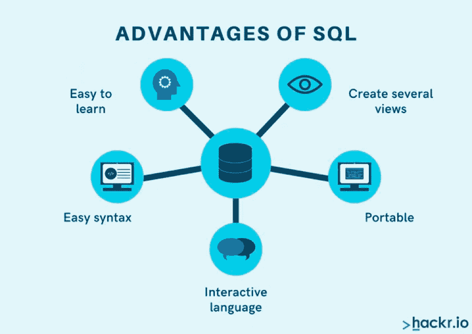
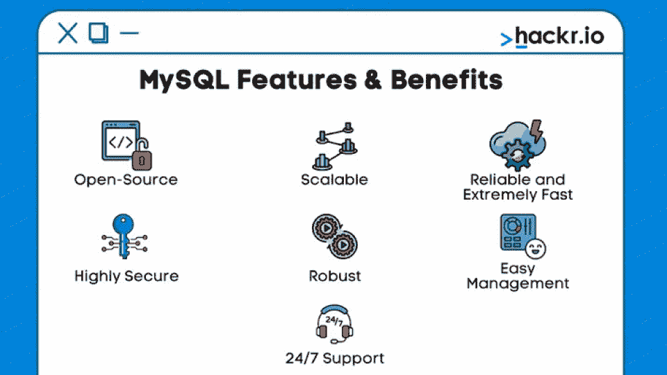
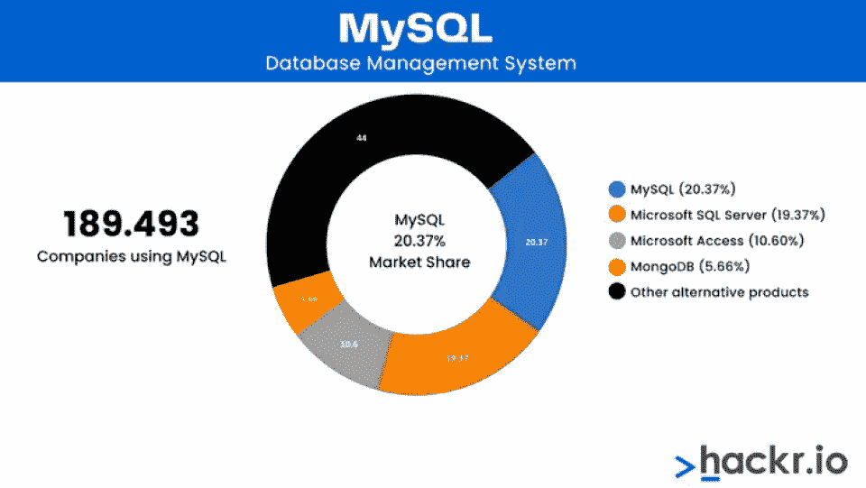

# SQL 与 MySQL:有什么区别，选择哪一个

> 原文：<https://hackr.io/blog/sql-vs-mysql>

如果你曾经研究过数据库和数据库管理，你可能会碰巧同时提到 SQL 和 MySQL。但是这两者有什么区别呢？你该学哪个，该用哪个？

很可能你会两者都用。“SQL”指的是[结构化查询语言](https://hackr.io/blog/what-is-sql%20)，一种用于查询数据库的语言。MySQL 是 SQL 的一个实现，使用 SQL 来操作数据库。所以，当你使用 MySQL 时，你使用的是 SQL——尽管反过来不一定是正确的。

让我们更深入地了解一下 SQL 和 MySQL 之间的区别。但是首先，这里有一个 MySQL 和 SQL 讨论中的差异的快速总结。

## SQL 与 MySQL:面对面的比较

| **参数** | **SQL** | **MySQL** 的实现 |
| **性质** | 查询语言 | 关系数据库管理系统 |
| **由**开发 | 微软 | 最初由 MySQL AB 开发 |
| **语法** | 易于使用、固定且具有声明性 | 使用 SQL 查询数据 |
| **发牌** | 所有人 | 开放源码 |
| **语言支持** | 本身就是一种查询语言 | C、C++、Perl、PHP、Python、Ruby 以及许多其他语言 |
| **复杂度** | 容易的 | 容易的 |
| **更新** | 已修复且无更新 | 频繁更新 |
| **连接器** | 没有连接器 | MySQL 工作台 |

## **什么是 SQL？**

****

SQL 指的是结构化查询语言，它是一套用于建立和维护计算机数据库的语言标准。MySQL 是 SQL 语言的一种实现。因此，SQL 不同于 MySQL，但 MySQL 确实使用 SQL。

再比如微软 SQL。这是 MySQL 的替代方案，它也使用 SQL 模式，但它不是 MySQL。

## **什么是 MySQL？**

****

SQL 是一种数据库语言，MySQL 是一种数据库程序。MySQL 是一个开源的关系数据库——不仅仅是任何开源的关系数据库，而是世界上最流行的数据库。这是迄今为止最流行的 SQL 实现。作为一个开源解决方案，它提供了社区版(免费)和企业版(付费支持)。

## **SQL 和 MySQL 有什么区别？**

为什么大多数人会交替使用 MySQL 和 SQL？因为 MySQL 主导了 SQL 程序的学习领域。MySQL 是一个开源平台，而微软 SQL 和其他竞争对手是商业化的。所以，MySQL 被初学者更多的使用，因为它是免费的。它也非常轻便、有竞争力和稳定。



资料来源:[升](https://enlyft.com/tech/products/mysql)

注意 MS Access 和 MongoDB 不是 SQL 数据库。MySQL 和 Microsoft SQL 是目前最流行的 SQL 数据库。

使用 SQL 时，您应该知道 MySQL、Microsoft SQL 和 PostgreSQL 的操作方式都差不多。主要的区别在于它们的图形用户界面以及与数据库交互和构建数据库的方法。

## **SQL 和 MySQL 是用来做什么的？**

SQL 用于组织和管理数据。使用 SQL，您可以将数据放入由行和列组成的表中，就像电子表格一样。但与电子表格不同的是，这些数据是动态且相互关联的。

让我们举个例子:

客户电子邮件电话

约翰·多伊·John@Doe.com 555-5555

在电子表格中，这是你拥有的数据。或许，你可以从头到尾组织你的客户，或者通过电子邮件组织他们。但是，如果您有一个数据库，您可以编写以下查询:

```
select email from customers wherename = "John Doe";
```

然后，数据库将返回:

John@Doe.com

你甚至可以这样写:

```
select email from customers wherenamelike"John%";
```

这将返回姓名以 John 开头的所有客户的所有电子邮件地址，而不仅仅是 John Doe。

您也可以像这样更新您的数据库:

```
update customers set email = "John@Gmail.com"wherename = "John Doe";
```

简而言之，数据库从根本上使操作和查找数据变得更加容易。JavaScript、PHP、C++和许多编程语言将直接与 MySQL 数据库接口。但是这些系统都将使用 SQL，而不是本地语言，来与数据库进行交互。

## **我该学 SQL 还是 MySQL？**

虽然这是一个有趣的问题，但几乎总是错误的问题。与其说 SQL 是一种操作语言，不如说它是一套标准和规范。要使用 SQL，你需要致力于一个 SQL 平台，比如 MySQL 或者微软 SQL。不学习 SQL 平台就学不会 SQL，除非你只是在学习查询语言本身。

但这并不意味着这不是一个重要的问题，因为 MySQL 不是唯一可用的选项。流行的 SQL 平台包括 Microsoft SQL 和 PostgreSQL，这两个平台已经存在很长时间了，并且非常健壮，适应性也非常强。获得微软 SQL 认证可以极大地改善一个人的职业生涯。

如果你是第一次学习数据库，MySQL 是一个很好的选择，因为它非常受欢迎。它被用在 LAMP 堆栈中，以及整个独立和商业开发中。一旦你了解了 MySQL，你会发现学习其他 SQL 数据库更容易，即使它们并不完全相同。

## **我该学 MySQL，微软 SQL，还是 PostgreSQL？**

大多数人选择 MySQL 有几个原因。首先，它很容易获取。它也是开源和免费的。MySQL 得到了开发社区如此好的支持和喜爱，它已经被打包成 LAMP stacks 之类的东西。

但是这并不意味着其他系统没有其他的优势。

Microsoft SQL 很好地集成到了 Microsoft 环境中，所以如果您正在使用 Microsoft 环境，您可能会更喜欢它。微软服务器特别适合。NET 应用程序和。网络整合。

### **MySQL 和 SQL Server 一样吗？**

当人们说“SQL Server”时，他们可能指两种情况之一。他们通常可以引用任何 SQL 服务器，也包括 MySQL。或者他们可以引用 Microsoft SQL Server，其名称中特别包含“SQL Server”。微软 SQL Server 是 MySQL 的主要竞争对手之一。

所以，MySQL 是一个 SQL 服务器，但不是唯一的。

### MySQL 和 SQL Server 哪个更快？

MySQL 倾向于为更小、更快、更轻量级的应用程序而设计。在事务性应用和轻量级应用中，MySQL 一般表现更好。但是 SQL server 在大型生产环境中具有优势。

如果你正在用 PHP 编写一个后端，你可能想使用 MySQL。但是 MySQL 对生产有好处吗？不幸的是，通常不会。

也就是说，大多数人不会将系统设计到重要的规模。对于需要同时支持 10，000 名用户的大型企业用例，Microsoft SQL Server 可能是首选。但是 MySQL 仍然是大多数 web 应用程序的首选，因为它轻量级，易于使用，而且(重要的是)完全免费许可。

## 什么是 NoSQL？【定义】

如果你听说过 MySQL，你可能也听说过 NoSQL。NoSQL 被认为是一种与 MySQL 非常不同的数据库。MySQL 是关系数据库；数据库保存在列和行中，所有的数据通过键连接。例如，在以下数据库中:

PRIMARY_ID 姓名电子邮件电话

1 约翰·John@doe.com 555-555-5555

客户姓名、电子邮件地址和电话号码都与主键相关联。你可以通过参考其他信息来调用所有这些信息。

```
select * from customers where primary_id = 1;
```

这将返回:

1 约翰·John@doe.com 555-555-5555

但是 NoSQL 数据库是非关系数据库。它是一个信息数据库，而不是像 MySQL 那样的数据库模式。NoSQL 数据库被用来处理大量数据，其中许多可能并不相关。

世界上一些最大的网站使用 NoSQL 数据库，但它们是本质上不同的技术，用于完全不同的用例。如果你应该使用 NoSQL 数据库，你应该已经知道了——因为普通的数据库是行不通的。

*查看[这篇文章](https://hackr.io/blog/nosql-vs-sql)，了解 NoSQL 与 SQL 的区别。*

## **SQL 是一项有价值的技能吗？**

SQL 是一项非常有价值的技能。无论您是进入移动应用程序开发、云开发、web 开发还是内部开发，总有一天您需要了解 SQL。更重要的是，一般的 [SQL 开发人员的工资是 10.1 万美元](https://www.ziprecruiter.com/Salaries/SQL-Salary)。

现在，您可能不需要知道如何设计甚至维护数据库。但是如果你想成为一名程序员，你至少应该知道如何查询数据库。

你对 SQL 了解得越多，你的知识就越有价值。如果您了解 SQL 的一切，您将能够真正深入了解数据分析和数据存储的特性。最终，你可以成为数据库管理员或架构师，这两个职位都有六位数的薪水。

## **你能多快学会 MySQL？**

大多数人可以在一周内学会 MySQL 的基础知识。但是掌握它需要更长的时间。如果你已经理解了数据库是如何工作的，MySQL 应该是相对容易的。如果您来自另一种 SQL 技术，如 Microsoft SQL 或 PostgreSQL，您可能不需要任何时间；你也许可以带着一些文档立即投入工作。

学习 MySQL 最快的方法一般是在里面运行几个项目。下载 MySQL，构建一个简单的客户数据库，并学习如何插入记录、修改记录、删除记录和查询记录。也可以上几堂课[看几本 SQL 教程](https://hackr.io/tutorials/learn-sql)。

有许多 MySQL 训练营可以让你在一天之内复习 MySQL 的基础知识。但是要真正记住这些知识，你可能需要练习。像 Udemy 上的课程是全面了解 SQL 的好选择。

## **底线:MySQL vs SQL**

那么，MySQL 和 SQL 一样吗？不是。MySQL 是一个使用 SQL 的数据库平台。SQL 是一种旨在简化创建、修改和删除数据库数据的语言。

如果你想成为一名数据库管理员，你必须学习 MySQL——这意味着学习 SQL。它将帮助你组织和管理大量的数据。

但您可能仍然会发现自己在 MySQL 或 SQL 之间进行选择，因为也有不同的 SQL 技术，如 Microsoft SQL 和 PostgreSQL。还有其他类型的数据库，如 NoSQL 非关系数据库。

想学 SQL，[今天就可以开始](https://hackr.io/blog/how-to-learn-sql)。它不仅相对容易学习，而且是一项非常通用的技能。

## **常见问题解答**

#### **1。MySQL 和 SQL Server 一样吗？**

不，MySQL 和 SQL server 不一样。MySQL 是一个 SQL 服务器，但它不是唯一的一个。

#### **2。有哪些程序使用 SQL 和 MySQL？**

SQL 被公司用来查询和处理数据库。MySQL 是一个数据库管理系统，一些使用 MySQL 的流行公司和网站有脸书、Flickr、Twitter 和 YouTube。

#### **3。MySQL 可以免费使用吗？**

是的，MySQL 是免费开源的。你可以在这里下载[。](https://www.mysql.com/downloads/)

#### **4。应该先学哪个 SQL？**

首先，最好使用 MySQL 并尝试一些查询。还有其他的选择，但是 MySQL 是如此受欢迎，以至于它值得首先进入。

**人也在读:**