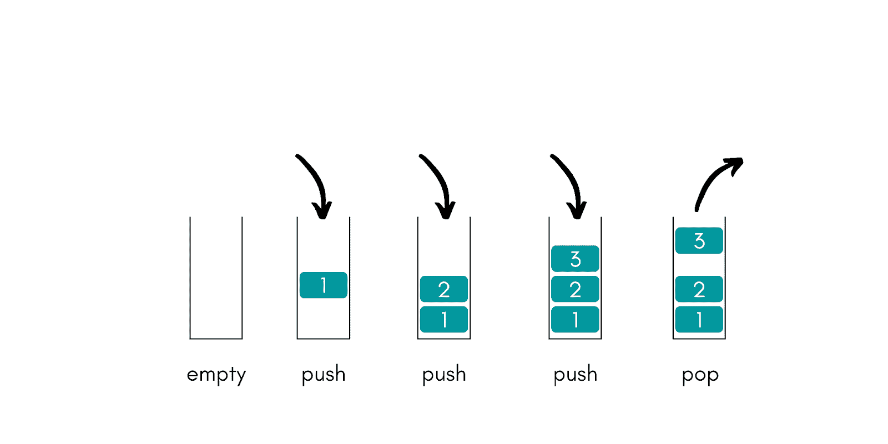
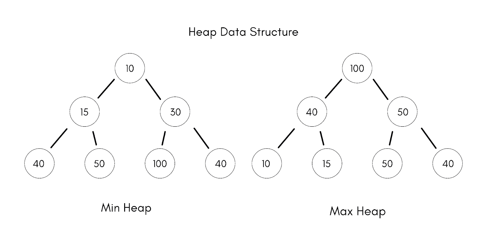

# 栈 vs 堆:有什么区别？

> 原文：<https://hackr.io/blog/stack-vs-heap>

编程是一个独立的世界，因为这份工作有很多方面和变量。程序员花很长时间挤在电脑前，为网页、软件、硬件和其他用途键入代码。虽然程序员可以使用许多工具，但是堆栈和堆——基于内存分配——是最重要的两个工具。

你可能会问，“什么是栈和堆，两者之间的主要区别是什么？”还有，说到栈和堆，哪个更好用？

在本文中，我们将强调两者之间的差异，并回答您的一些问题。

## 什么是堆栈？

堆栈是表示线性数据结构中可用的对象或元素序列的结构。那是什么意思？它只是意味着你可以以线性顺序添加或删除元素。这样，保持变量被创建的一部分内存可以暂时运行。

你可以把一堆想象成一堆盘子，如上图所示。

使用堆栈时，变量的声明、存储和初始化发生在运行时。堆栈的过程类似于 20 世纪 90 年代后期苹果的旧磁盘 RAM，因为一旦任务完成，堆栈内存会自动擦除其中的数据。因此，堆栈中的数据结构可以像闪存或 NAND 一样容易地访问。

栈的一个缺点是变量不能调整大小，内存是在一个块中分配的。还有基于操作系统的大小限制，这些大小是固定的，不能调整。

## 堆栈的优点

*   在编译代码时，堆栈内存会给程序员带来很大的帮助。
*   您可以完全控制如何分配和释放内存，这对进程非常重要。
*   您可以用 LIFO(后进先出)方法管理数据，这在 heap 中是不可能的。
*   你的对象在堆栈内存下被自动清理，你的变量不能调整大小。
*   您的局部变量存储在“被调用函数”下的堆栈中，并在返回时立即终止。

## 堆栈的缺点

编程代码时使用堆栈有一些缺点。

*   内存大小是有限的，所以如果你需要很大一部分内存，堆栈就不够用了。
*   编译代码时在堆栈中放入过多的对象会有堆栈溢出的风险。
*   使用堆栈时，您将失去随机访问的能力，并且您可能会覆盖变量存储，这会影响程序或函数的行为。

[数据结构和算法:使用 Java 进行深入研究](https://click.linksynergy.com/deeplink?id=jU79Zysihs4&mid=39197&murl=https%3A%2F%2Fwww.udemy.com%2Fcourse%2Fdata-structures-and-algorithms-deep-dive-using-java%2F)

## 什么是堆？

相比之下，堆内存可以存储全局变量(stack 只能存储局部变量)，对堆内存的用途限制较少。

堆在分层系统中存储数据，因此访问速度比堆栈内存慢一点。随着时间的推移，堆内存可能会因碎片而堵塞，就像过去旧的盘片硬盘驱动器一样。

heap 的一个亮点是内存大小没有限制，如果需要，可以调整变量的大小。

由于旧盘片硬盘驱动器的存储相似性，堆内存的工作方式与随机存储的内存类似。这就是访问速度较慢的原因，因为数据需要从芯片内的许多随机点检索。

## 堆的优点

*   堆有很多优点，最大的优点可能是内存大小没有限制。
*   你需要大量的内存分配吗？希普给你提供了更多的信息！
*   您可以在堆下全局访问变量，也可以在需要时调整变量的大小。

## 堆的缺点

使用堆有一些缺点，这些只是影响编程速度和性能的一些缺点。

*   执行时间比堆栈慢，而且与堆栈相比，管理堆的内存要困难得多。
*   在堆上运行计算比在堆栈上运行计算花费的时间更长，使用堆可以最大限度地利用计算机中的 RAM。

## 堆栈与堆:比较

堆栈和堆之间的主要区别是多方面的，了解它们在编程过程中的最佳使用位置是一个很好的实践。我们将看看使用每种方法的优缺点，然后在下面直接比较堆和栈。

*   堆栈主要用于静态内存分配，而堆则用于动态内存分配。堆栈和堆的一个共同点是它们都存储在计算机的 RAM 中。
*   堆栈内存管理遵循 LIFO(后进先出)顺序；存储变量为新变量创造了空间。另一方面，堆不遵循任何顺序。它只是动态地处理内存块。
*   堆栈内存是在创建线程的同时自动创建的。同时，堆中的内存是在您创建对象时创建的，这些对象会占用堆内存中的空间。
*   堆栈负责处理代码中正在执行的内容。另一方面，堆跟踪你的对象，也就是说，它跟踪你的所有数据。

## 堆栈与堆:比较概要

这里有一个快速分解，显示了栈和堆的特性与我们上面提到的数据的对比情况。

| **功能** | **堆栈** | **堆** |
| 费用 | 较少的 | 更大的 |
| 变量解除分配 | 不需要 | 需要显式取消分配 |
| 寻道访问时间 | 更快的 | 慢的 |
| 灵活性 | 固定大小 | 可以调整大小 |
| 参考位置 | 自动编译时指令 | 足够的 |
| 痛点 | 内存不足 | 内存碎片 |
| 履行 | 3 种不同的方式——基于简单数组、动态内存和基于链表 | 2 种不同的方式-数组和树 |
| 分配和取消分配 | 由编译器指令自动完成 | 由程序员手动完成 |
| 存储器分配 | 一个毗连区块 | 任意顺序 |
| 可变大小调整 | 无法调整大小 | 可以调整大小 |
| 存储容量 | 有限的大小-取决于操作系统 | 内存大小没有限制 |
| 可变访问 | 仅局部变量 | 全局访问变量 |
| 空间管理 | 操作系统高效的空间管理 | 内存块- FIFO 格式 |
| 存取速率 | 高速接入 | 比松弛时间慢 |
| 数据结构 | 线性数据结构 | 分层数据结构 |

正如你所看到的，我们在上面强调的这个分解，哪个更好的答案在于程序员在他们的项目中的最终目标。

## 结论

堆内存和栈内存的老问题很难回答。

如果程序员使用[大型结构](https://hackr.io/tutorials/learn-data-structures-algorithms?q=data%20structure)或大小数组，他们最好使用堆，因为你可以给它分配一个大的大小。如果程序员只需要很小的变量，只需要快速进出，那么利用堆栈将是更好的选择。事实上，这取决于用户选择哪一个更好。

对程序员来说，一个更好的问题是，在压力下，他们希望拥有哪种“存储”内存？一个 NAND 闪存棒(堆栈)，还是他们想要旧的标准(堆)？如上所述，两种选择各有利弊。