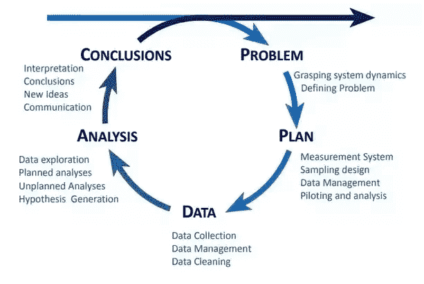
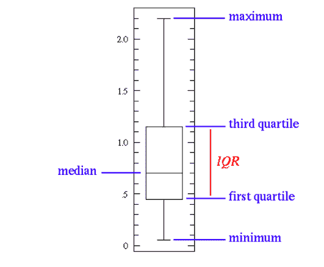
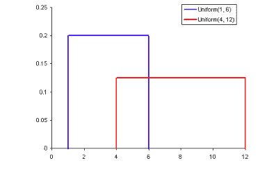
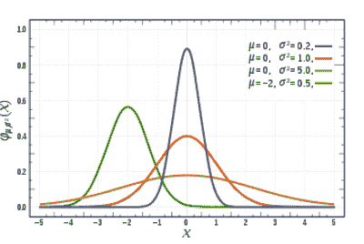
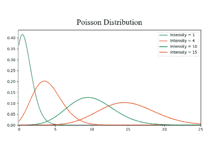
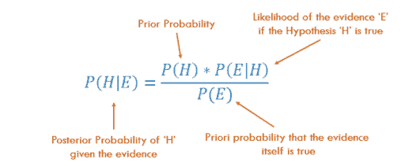

# 数据科学统计学:基本概念

> 原文：<https://hackr.io/blog/statistics-for-data-science>

## 什么是统计学，为什么数据科学需要统计学？

机器学习算法的必要基础包括学习数据科学的数学和统计学。数据科学家必须实践统计学，因为正如维基百科所说，它是对数据的收集、分析、解释、展示和组织的研究。数据科学和统计学之间有着紧密的联系。数据科学家需要数据科学项目的统计数据，因为它提供了工具和方法来发现结构，并提供对数据更深刻的见解。

数据科学领域的一些流行术语是:

*   群体:收集数据的一组来源。
*   样本:总体的一个子集。
*   变量:可以测量或计数的任何数字、特征或数量，也称为数据项。
*   统计参数:也称为统计模型或总体参数。它是一系列概率分布的指数，例如，人口的平均值、中位数。

统计在数据科学中的主要作用是:

*   研究人员利用数据资源提取知识，并通过统计框架问题获得更好的答案。
*   统计推断表明，数据中存在随机成分，这使得研究人员能够在基本过程中制定问题，并量化他们答案中的不确定性。

统计调查周期

*   统计框架允许研究人员区分因果关系和相关性，从而确定导致结果变化的干预措施。
*   该框架允许科学家建立估计和预测的方法，从而量化确定性的程度，这是通过使用表现出可再现和可预测行为的算法来完成的。
*   统计方法旨在将注意力集中在可以由其他研究人员用不同的数据资源复制的发现上。
*   统计方法允许研究者积累知识。

## 使用统计进行分析

以下是事件分析的类型:

*   定量分析:也称为统计分析，是用图表和数字收集和解释数据以确定模式和趋势的科学。
*   定性分析:也称为非统计分析，提供一般信息，并使用文本、声音和各种其他形式的媒体来完成。

例如，如果我们买了一张电影票，它是作为银票、金票或白金票出售的，这是定性分析的一个例子。但如果剧院每周售出 200 张普通票，这就是定量分析，因为我们有一个数字代表每周售出的票。

## 统计中的类别

学习统计学涉及三个类别:

### **1。描述性统计**

描述性统计有助于分析人员以有意义的方式描述、显示或总结数据，例如，我们可以从数据中得出模式。然而，描述性统计不允许我们在已经分析过的数据之外做出结论，也不允许我们就已经做出的任何假设得出结论。对描述性分析的需求是必不可少的，因为如果我们展示原始数据，就很难想象以前的数据显示了什么。因此，描述性统计使我们能够以更有意义的方式呈现数据，从而允许对数据进行更直接的解释。通常存在两种类型的描述数据的统计:

1.  集中趋势的度量:描述一组数据的频率分布的中心位置。频率分布是从最低到最高得分的分布和模式标记。
2.  分布度量:通过描述分数如何分布来汇总一组数据。例如，100 名学生的平均分是 65 并不意味着所有学生都得了 65 分；相反，他们的分数是分散的。分布的度量有助于总结分数的分布程度。有几种统计数据可用，包括用于描述分布的范围、四分位数、绝对偏差、方差和标准偏差，

### **2。推理统计**

众所周知，描述性统计提供了下一组数据的信息。例如，计算这 100 名学生的考试分数的平均值和标准偏差，并提供关于这 100 名学生的有价值的信息。群体可大可小，只要它包含用户感兴趣的所有数据。例如，如果您只对 100 名学生的考试分数感兴趣，那么这 100 名学生将代表总体。描述性统计适用于总体和总体的属性，如均值或标准差，称为参数，因为它们代表整个总体。

然而，通常情况下，用户无法访问您感兴趣调查的全部人群，而只能访问有限数量的数据。例如，您可能对美国所有学生的考试分数感兴趣，但要测量整个美国所有学生的考试分数是不可行的。因此，用户必须测量较小的学生样本(例如，100 名学生)，该样本用于代表所有美国学生的较大群体。样本的属性，如标准差或平均值，是统计数据，而不是参数。

推断统计学是一种允许用户利用这些样本对从中抽取样本的总体进行归纳的技术。因此，样本准确地代表被称为抽样的总体是至关重要的。推断统计学的出现是由于抽样自然会产生误差，因此样本不能正确地代表总体。推断统计学的方法是(1)检验统计假设和(2)估计参数。

### **3。预测建模**

预测建模是使用数据挖掘和概率来预测结果的过程。每个模型由几个预测因子组成，这些预测因子是可能影响未来结果的变量。一旦收集了相关预测的数据，就可以建立统计模型。该模型可以采用简单的线性方程，也可以是复杂的神经网络，由复杂的软件绘制出来。随着更多的数据变得可用，统计分析模型被验证或修订。

预测建模的应用:

*   气象学和天气预报
*   在线广告和营销
*   贝叶斯垃圾邮件过滤器
*   欺诈检测
*   客户关系管理
*   容量规划
*   变更管理
*   灾难恢复
*   工程
*   物理和数字安全管理
*   城市规划

[数据科学和商业分析统计](https://click.linksynergy.com/deeplink?id=jU79Zysihs4&mid=39197&murl=https%3A%2F%2Fwww.udemy.com%2Fcourse%2Fstatistics-for-data-science-and-business-analysis%2F)

## 数据科学家必须了解数据科学的概念

### **1。核心统计特征**

统计特征通常是数据科学家在探索数据集时应用的第一种统计技术，包括偏差、平均值、方差、百分位数和中位数等。统计特征是数据科学中最常用的概念，因为它相对容易理解并在代码中实现。

下图进一步解释了这一点:

基本盒状图

中间的线代表数据的中值。科学家更喜欢中值而不是平均值，因为它对异常值更稳健。第一个四分位数基本上是 25%的百分位数，即 25%的点低于该值。类似地，第三个四分位数是第 75 个百分位数，即 75%的点低于该值。最大值和最小值分别代表数据的下限和上限。

箱形图可以说明我们可以利用统计特征做的所有事情:

一个短的方框图意味着许多数据点是相似的，因为在一个小范围内有许多相似的值。

高方框图意味着许多数据点差异很大，因为它使用的数值范围很广。

如果接近底部的中值告诉我们大部分数据具有较低的值，反之，如果接近顶部的中值则告诉我们大部分数据具有较高的值。简而言之，如果中位数不在盒子的中间，它表明数据是有偏差的。

“胡须很长”是一个短语，意思是数据具有高标准偏差和方差，即分布的值变化很大。如果数据在一个方向上变化很大，那么晶须只存在于盒子的那一边。

### **2。概率**

根据维基百科，概率是量化事件发生可能性的度量。概率通常在 0 到 1 的范围内量化，其中 0 表示我们确信这种情况不会发生，1 表示发生的可能性。概率分布是代表实验中所有可能值的概率的函数。

下面讨论的是标准概率分布:

### **3。均匀分布**

****

均匀分布

均匀分布具有仅出现在特定范围内的单一值，而超出该范围的任何值都被视为 0。这是一个“开或关”分布，因为我们可以把它作为一个分类值的指示。分类值可以有除 0 以外的多个值，但科学家仍然可以将其可视化为多个均匀分布的分段函数。

### **4。正态分布**

****

正态分布

也称为高斯分布，通过其均值和标准差明确定义。标准差控制分布，平均值在空间上改变分布。与其他概率分布的主要区别在于，标准差在所有方向上都是相同的。因此，高斯分布显示了数据集的平均值和数据的分布范围，也就是说，它分布在很大的范围内，并且高度集中在几个值周围。

### **5。泊松分布**

该分布类似于正态分布，只是增加了一个偏态因子。泊松分布在各个方向上具有相对均匀的分布，就像偏度值较低的正态分布一样。但是当偏斜度值在数量级上很高时，那么我们的数据的分布在不同的方向上不同；在一个方向非常分散，在另一个方向高度集中。

### **6。维度缩减**

在机器学习的分类问题中，有太多的特征是我们进行最终分类的基础。随着特征数量的增加，可视化训练集并对其进行处理变得更加困难。大多数特征有时是相关的或冗余的，这就需要使用降维算法。降维是通过获得一组主变量来减少所考虑的随机变量的数量的过程。

**降维的组成:**

*   特征选择:试图找到原始变量集或特征集的一个子集，以获得一个更小的模型，用于对问题进行建模。以下三种方式中的任何一种都可以进行特征选择:
*   特征提取:将高维空间中的数据降维到一个低维空间，即维数更低的空间。

特征修剪是降维的另一种方式，它包括移除对分析不重要的特征。例如，在探索数据集之后，10 个特征中的 7 个特征可能与输出具有高相关性，但是其他 3 个具有非常低的相关性。因此，这三个特性可能不值得计算，我们可以在不篡改输出的情况下从分析中删除它们。

PCA 是最常见的维数约减，其本质上创建特征的向量表示，从而显示它们对于输出(即相关性)的重要性。

### **7。贝叶斯思维与统计**

贝叶斯统计是一种将概率应用于统计问题的数学方法。它为人们提供了工具来更新他们对新数据证据的信念。一个人必须有线性代数和概率统计方面的技能，因为它们是在贝叶斯统计之前需要知道的先决条件。

贝叶斯思维中使用的概念:

#### **条件概率**

事件 A 的概率给定 B 等于 B 和 A 一起发生的概率除以 B 的概率-定义了条件概率。

#### **贝叶斯定理**

****

贝叶斯定理

概率 P(H)是频率分析；给定先验数据，事件发生的概率是多少。等式中的 P(E|H)是可能性，本质上是我们的证据是正确的概率，其中信息来自频率分析。P(E)是实际证据有效的概率。

#### **机器学习**

学习和探索机器学习模型有助于进入数据科学的统计学领域。选择几个模型来定义几个关键概念。

1.  线性回归:找出目标与一个或多个预测值之间的关系。它有两种类型:简单和多重。
2.  朴素贝叶斯分类器:基于贝叶斯定理的算法集合，共享一个通用原则，即每对被分类的特征是相互独立的。
3.  多臂强盗:多臂强盗问题是强化学习的一个例子，其中我们有一个叫做强盗的“n”臂吃角子老虎机，每个臂都有其操纵的成功概率分布。通过拉动任意一只手臂给予随机奖励；成功的奖励是 R= +1，失败的奖励是 R=0。目标是按顺序一个接一个地拉动手臂，使收集的总分数最大化。

## 摘要

当执行数据科学的艺术时，统计学被证明是一个强有力的工具。统计学被定义为使用数学对数据进行技术分析。像条形图这样的基本可视化技术可以提供高层次的信息，但是有了统计数据，我们还可以对数据进行操作，这更具有信息驱动性和针对性。所涉及的数学形成了关于数据的具体结论，而不是猜测。

通过使用统计数据，我们可以获得深入细致的见解，并了解数据是如何构建的，以及如何基于该结构应用其他数据科学技术来获取更多信息。

喜欢这篇文章吗？有反馈或疑问吗？

请在下面的评论中告诉我们！

**人也在读:**