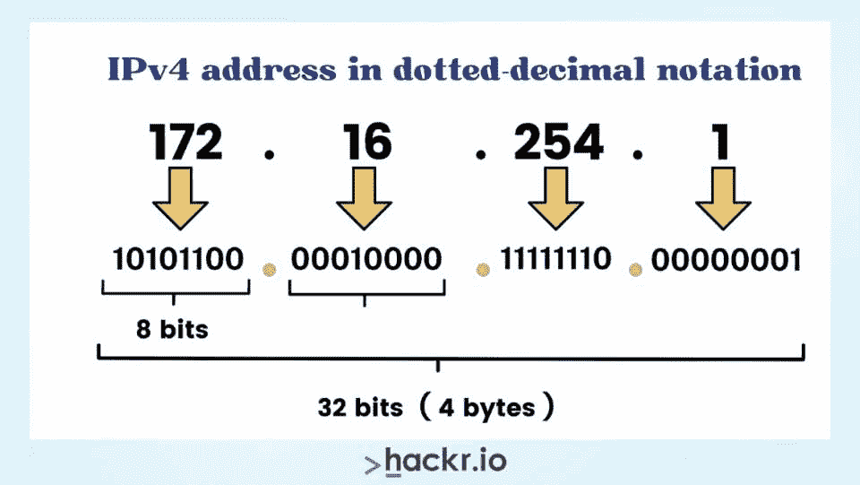
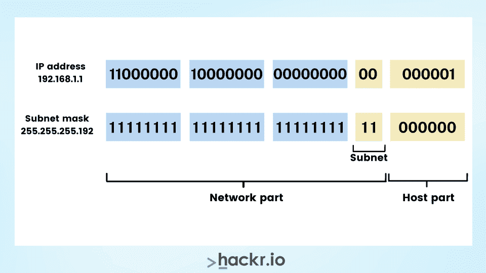

# 子网备忘单 PDF(成为子网划分大师)

> 原文：<https://hackr.io/blog/subnet-cheat-sheet>

如果您是网络工程师，您可能会遇到子网和子网掩码的用法。您可能还需要查找所需的子网掩码值并理解它们的含义。无论你的子网工作需要什么，你都可以用这个子网备忘单快速解决每个问题。

在我们进入子网和网络掩码备忘单之前，让我们先浏览一下子网划分基础知识，如何[计算子网](https://www.subnet-calculator.com/)等等。

本文的子网划分备忘单将帮助您处理日常工作，甚至准备一些软件或网络工程师的工作面试！

## **IP 地址块是如何工作的？**

每个 IP 地址被分配给不同的“块”或网络。IPv4 是互联网协议版本 4，是最常见的协议。它由四个二进制块组成，每个二进制块包含 8 位，代表从 0 到 255 的数字。

完整的 IPv4 地址为 32 位，因此互联网上有 400 多万个地址。IPv4 地址的一个例子是 172.16.254.1。

我们可以使用下表在十进制和二进制形式之间转换 IP 地址:

| 128 | 64 | 32 | 16 | 8 | 四 | 2 | 一 |
| X | X | X | X | X | X | X | X |

请记住，1 相当于“开”，0 相当于“关”。因此，要将第一个块(168)转换成二进制，您必须从图表的开头开始，在该单元格中放置 1 或 0，直到您得到的和为 168。让我们以 IP 地址 168.210.225.206 为例。您只需将地址分成四个块(168、210、225 和 206)，然后使用上图将每个块转换成二进制。上图是 8 位八位组。

**例如:**

| 128 | 64 | 32 | 16 | 8 | 4 | 2 | 1 |
| 1 | 0 | 1 | 0 | 1 | 0 | 0 | 0 |

128 + 32 + 8 = 168，在二进制中是 10101000。

如果你对其余的方块也这样做，你将得到 10101000 . 1101000 . 110100001

## 什么是子网划分？

IPv4 有 32 位，创建了 400 多万个地址空间，但这些空间已经耗尽。因此，需要更多的地址空间来满足更多使用互联网的设备的需求。

几年前，人们曾探讨过地址空间短缺的问题。开发人员决定将 IP 地址分成更小的网络以创造更多的空间，这些更小的网络被称为子网。创建这些较小网络的过程称为子网划分。

在此过程中，开发人员将 IP 地址的主机部分划分为子网。

您必须知道 IP 地址由网络和主机位组成，如下所示。

子网划分允许您执行以下操作:

*   将网络分成子网
*   允许设备确定另一个设备或 IP 地址是否在同一个本地网络上。

子网划分的一个完美例子是您的家庭无线网络。如果不使用子网划分，那么互联网上的每台设备都需要其 IP 地址。但是现在，由于无线路由器是可用的，您将只需要一个 IP 地址为您的路由器，这是由您的互联网服务提供商(ISP)分配的。连接到该路由器的每台设备都有自己的私有或内部 IP 地址。

假设您的内部 IP 地址为 192.168.1.101 的设备想要与另一台设备通信，该设备必须使用另一台设备的 IP 地址和子网掩码。IP 地址和子网掩码允许位于 192.168.1.101 的设备检查另一台设备是否位于同一网络(如位于 192.168.1.103 的设备)或不同的网络中。

[简单介绍 IP 寻址和子网划分](https://click.linksynergy.com/deeplink?id=jU79Zysihs4&mid=39197&murl=https%3A%2F%2Fwww.udemy.com%2Fcourse%2Fsubnetting-the-easy-way%2F)

## 子网掩码是如何工作的？

子网掩码充当 IP 地址的过滤器。在子网掩码的帮助下，设备检查 IP 地址以确定哪些部分是网络位，哪些是主机位，从而使设备能够高效通信。

如果您曾经在路由器或计算机上看到过网络设置，您可能会看到 255.255.255.0。与 IPv4 地址一样，子网掩码也是 32 位。此外，当您将 IP 地址转换为二进制时，您可以转换子网掩码。

**例如:**

| 128 | 64 | 32 | 16 | 8 | 四 | 2 | 一 |
| X | X | X | X | X | X | X | X |

现在，我们将转换第一个二进制八位数 255:

| 128 | 64 | 32 | 16 | 8 | 4 | 2 | 1 |
| 1 | 1 | 1 | 1 | 1 | 1 | 1 | 1 |

这是一个简单的 255.255.255.0。

111111111.1111111.1111111.0000000 二进制。

现在，我们将考虑子网掩码和 IP 地址，来计算 IP 地址的哪些部分是网络位和主机位。

以下是十进制和二进制的两种格式:

| **类型** | **Decimal ** | **二进制** |
| IP 地址；网络地址 | 192.168.0.101 | 11000000.10101000.00000000.01100101 |
| 子网掩码 | 255.255.255.0 | 11111111.11111111.11111111.00000000 |

您可以轻松地将 192.168.0.101 分成网络位和主机位。

如果二进制子网掩码中的位是 1，那么二进制 IP 地址中的相同位就是网络的一部分。由于二进制的二进制八位数 255 是 11111111，因此 IP 地址中的整个二进制八位数是网络的一部分。因此，前三个二进制八位数 192.168.0 是 IP 地址的网络部分，101 是主机部分。

如果位于 192.168.0.101 的设备想要与具有子网掩码的另一台设备通信，它将知道 IP 地址为 192.168.0.xxx 的另一台设备位于同一个本地网络中。

## **CIDR 是什么意思，CIDR 符号是什么？**

CIDR 代表[无类域间路由](https://en.wikipedia.org/wiki/Classless_Inter-Domain_Routing)，在 IPv4 中很常见。让我们来看一张迷你 CIDR 备忘单，以补充我们的子网备忘单。

1993 年，CIDR 因减缓 IPv4 地址的使用速度而崭露头角。CIDR 提出了几个重要的概念:

*   **可变长度子掩码(VLSM)** ，允许网络工程师为未使用的 IP 地址创建不同大小的子网。
*   **CIDR 符号**，子网掩码的简写，代表 IP 地址可用的位数。例如，192.168.0.101/24 中的/24 相当于子网掩码为 255.255.255.0 的 IP 地址 192.168.0.101。

## **如何计算 CIDR 符号**

要检查给定子网掩码的 CIDR 符号，您必须将子网掩码转换为二进制，并计算 1 或“开”数字的数量。

例如:

| **类型** | **Decimal ** | **二进制** |
| 子网掩码 | 255.255.255.0 | 11111111.11111111.11111111.00000000 |

在上表中，我们有三个二进制八位数为 1，有 24 个“开”位，这意味着 CIDR 表示法是/24 子网。用/24 比 255.255.255.0 写起来容易多了。

让我们考虑带有 IP 地址的同一个子网掩码:

| **类型** | **Decimal ** | **二进制** |
| IP 地址；网络地址 | 192.168.0.101 | 11000000.10101000.00000000.01100101 |
| 子网掩码 | 255.255.255.0 | 11111111.11111111.11111111.00000000 |

子网掩码的前三个二进制八位数都是“开”位，代表 IP 地址中与网络位相同的三个二进制八位数。

现在，让我们更详细地考虑最后一个或第四个二进制八位数:

| **类型** | **Decimal ** | **二进制** |
| IP 地址；网络地址 | 101 | 01100101 |
| 子网掩码 | 0 | 00000000 |

子网掩码为 255.255.255.0 的 IP 地址 192.168.0.101 的 CIDR 表示法是 192.168.0.0/24。子网掩码中最后一个二进制八位数的所有位都是“关”，表示 IP 地址中与主机位相同的位。每当你写 CIDR 符号时，你必须使用网络 ID。

## **子网中的主机数量**

您必须始终检查给定子网中可以有多少台主机，以及一个子网可以容纳多少台主机。

您可以很快解决这个问题，因为子网中的主机位数比网络位数少 32 位。另外，您需要减去 2 来获得可用的 IP 地址，这是因为第一个 IP 地址代表网络本身，最后一个 IP 地址代表广播地址。

计算某些主机的公式如下:

232-网络 _ 位- 2

例如，在/24 子网中，主机数量计算如下。(一个 24 有几个 IP)

232-24 - 2 = 28 - 2 = 256 - 2 = 254

如果您使用点分十进制表示法来表示子网掩码，那么/24 就更容易，也更有意义。

例如，要计算 200.1.0.64 255 . 255 . 255 . 192 中有多少可用的 IP 地址，您必须计算 256–192–2，即 62。

但是，如果我们考虑子网掩码小于/24，这将是复杂的。对于这类问题，最好快速将子网掩码转换为前缀长度格式。

例如，检查 172.16.23.0 255.255.240.0 中有多少可用的 IP 地址。所以 255.255.240.0 是/20。因此，可用 IP 地址的数量是 4094，即 2^(32-20)-2。

## **特定数量主机的最小子网大小**

要找出特定数量主机的最小子网大小，您需要做以下工作。

涵盖主机的数量，这要求您按照 2:

*   **1 位:** 2^1 = 2 个可能的 IP(包括网络/广播)
*   2 位: 2^2 = 4 个可能的 IP
*   7 位: 2^7 = 128 个可能的 IP
*   **11 位:** 2^11 = 2048 个可能的 IP 等。

您还需要考虑网络和广播地址这两个不可用的 IP 地址。

因此，所需的最小主机位数是 5 位(2^5 = 32)。4 比特(2^4 = 16)将太小。因此，我们可以使用的最小子网大小是/27。

## **地址块中的子网数量**

要计算地址块中子网的数量，首先应该使用以下公式计算参考地址块。

2 新网络位-参考网络位

*   从/24 地址块中可以得到多少个/27 子网？

227-24 = 23 = 8 个子网

*   来自/17 块的/25 子网怎么样？

225-17 = 28 = 256 个子网

*   从有类地址块 171.44.0.0 中可以得到多少个/20 块？

在这种情况下，您必须了解 IP 地址类。查看 171.44.0.0 地址块，您会发现一个使用 16 位代表网络部分的 B 类地址。

因此，几个子网将是:

220-16 = 24 = 16 个子网

## **子网掩码图**

| **地址** | **主机** | **Netmask** | **丙类金额** |
| /30 | 4 | 2 | 255.255.255.252 | 1/64 |
| /29 | 8 | 6 | 255.255.255.248 | 1/32 |
| /28 | 16 | 14 | 255.255.255.240 | 1/16 |
| /27 | 32 | 30 | 255.255.255.224 | 1/8 |
| /26 | 64 | 62 | 255.255.255.192 | 1/4 |
| /25 | 128 | 126 | 255.255.255.128 | 1/2 |
| /24 | 256 | 254 | 255.255.255.0 | 1 |
| /23 | 512 | 510 | 255.255.254.0 | 2 |
| /22 | 1024 | 1022 | 255.255.252.0 | 4 |
| /21 | 2048 | 2046 | 255.255.248.0 | 8 |
| /20 | 4096 | 4094 | 255.255.240.0 | 16 |
| /19 | 8192 | 8190 | 255.255.224.0 | 32 |
| /18 | 16384 | 16382 | 255.255.192.0 | 64 |
| /17 | 32768 | 32766 | 255.255.128.0 | 128 |
| /16 | 65536 | 65534 | 255.255.0.0 | 256 |

*   IP 范围/25 个子网- 2 个子网- 126 台主机/子网

| **网络号** | **IP 范围** | **广播** |
| 0 | .1-.126 | 0.127 |
| 0.128 | .129-.254 | 0.255 |

*   IP 范围/26 个子网- 4 个子网- 62 台主机/子网

| **网络号** | **IP 范围** | **广播** |
| 0 | .1-.62 | 0.63 |
| 0.64 | .65-.126 | 0.127 |
| 0.128 | .129-.190 | 0.191 |
| 0.192 | .193-.254 | 0.255 |

*   IP 范围/27 个子网- 8 个子网- 30 台主机/子网

| **网络号** | **IP 范围** | **广播** |
| 0 | .1-.30 | 0.31 |
| 0.32 | .33-.62 | 0.63 |
| 0.64 | .65-.94 | 0.95 |
| 0.96 | .97-.126 | 0.127 |
| 0.128 | .129-.158 | 0.159 |
| 0.16 | .161-.190 | 0.191 |
| 0.192 | .193-.222 | 0.223 |
| 0.224 | .225-.254 | 0.255 |

*   IP 范围/28 个子网- 16 个子网- 14 台主机/子网

| **网络号** | **IP 范围** | **广播** |
| 0 | .1-.14 | 0.15 |
| 0.16 | .17-.30 | 0.31 |
| 0.32 | .33-.46 | 0.47 |
| 0.48 | .49-.62 | 0.63 |
| 0.64 | .65-.78 | 0.79 |
| 0.8 | .81-.94 | 0.95 |
| 0.96 | .97-.110 | 0.111 |
| 0.112 | .113-.126 | 0.127 |
| 0.128 | .129-.142 | 0.143 |
| 0.144 | .145-.158 | 0.159 |
| 0.16 | .161-.174 | 0.175 |
| 0.176 | .177-.190 | 0.191 |
| 0.192 | .193-.206 | 0.207 |
| 0.208 | .209-.222 | 0.223 |
| 0.224 | .225-.238 | 0.239 |
| 0.24 | .241-.254 | 0.255 |

*   IP 范围/29 个子网- 32 个子网- 6 台主机/子网

| **网络号** | **IP 范围** | **广播** |
| 0 | .1-.6 | 0.7 |
| 0.8 | .9-.14 | 0.15 |
| 0.16 | .17-.22 | 0.23 |
| 0.24 | .25-.30 | 0.31 |
| 0.32 | .33-.38 | 0.39 |
| 0.4 | .41-.46 | 0.47 |
| 0.48 | .49-.54 | 0.55 |
| 0.56 | .57-.62 | 0.63 |
| 0.64 | .65-.70 | 0.71 |
| 0.72 | .73-.78 | 0.79 |
| 0.8 | .81-.86 | 0.87 |
| 0.88 | .89-.94 | 0.95 |
| 0.96 | .97-.102 | 0.103 |
| 0.104 | .105-.110 | 0.111 |
| 0.112 | .113-.118 | 0.119 |
| 0.12 | .121-.126 | 0.127 |
| 0.128 | .129-.134 | 0.135 |
| 0.136 | .137-.142 | 0.143 |
| 0.144 | .145-.150 | 0.151 |
| 0.152 | .153-.158 | 0.159 |
| 0.16 | .161-.166 | 0.167 |
| 0.168 | .169-.174 | 0.175 |
| 0.176 | .177-.182 | 0.183 |
| 0.184 | .185-.190 | 0.191 |
| 0.192 | .193-.198 | 0.199 |
| 0.2 | .201-.206 | 0.207 |
| 0.208 | .209-.214 | 0.215 |
| 0.216 | .217-.222 | 0.223 |
| 0.224 | .225-.230 | 0.231 |
| 0.232 | .233-.238 | 0.239 |
| 0.24 | .241-.246 | 0.247 |
| 0.248 | .249-.254 | 0.255 |

*   IP 范围/30 个子网- 64 个子网- 2 台主机/子网

| **网络号** | **IP 范围** | **广播** |
| 0 | .1-.2 | 0.3 |
| 0.4 | .5-.6 | 0.7 |
| 0.8 | .9-.10 | 0.11 |
| 0.12 | .13-.14 | 0.15 |
| 0.16 | .17-.18 | 0.19 |
| 0.2 | .21-.22 | 0.23 |
| 0.24 | .25-.26 | 0.27 |
| 0.28 | .29-.30 | 0.31 |
| 0.32 | .33-.34 | 0.35 |
| 0.36 | .37-.38 | 0.39 |
| 0.4 | .41-.42 | 0.43 |
| 0.44 | .45-.46 | 0.47 |
| 0.48 | .49-.50 | 0.51 |
| 0.52 | .53-.54 | 0.55 |
| 0.56 | .57-.58 | 0.59 |
| 0.6 | .61-.62 | 0.63 |
| 0.64 | .65-.66 | 0.67 |
| 0.68 | .69-.70 | 0.71 |
| 0.72 | .73-.74 | 0.75 |
| 0.76 | .77-.78 | 0.79 |
| 0.8 | .81-.82 | 0.83 |
| 0.84 | .85-.86 | 0.87 |
| 0.88 | .89-.90 | 0.91 |
| 0.92 | .93-.94 | 0.95 |
| 0.96 | .97-.98 | 0.99 |
| 0.1 | .101-.102 | 0.103 |
| 0.104 | .105-.106 | 0.107 |
| 0.108 | .109-.110 | 0.111 |
| 0.112 | .113-.114 | 0.115 |
| 0.116 | .117-.118 | 0.119 |
| 0.12 | .121-.122 | 0.123 |
| 0.124 | .125-.126 | 0.127 |
| 0.128 | .129-.130 | 0.131 |
| 0.132 | .133-.134 | 0.135 |
| 0.136 | .137-.138 | 0.139 |
| 0.14 | .141-.142 | 0.143 |
| 0.144 | .145-.146 | 0.147 |
| 0.148 | .149-.150 | 0.151 |
| 0.152 | .153-.154 | 0.155 |
| 0.156 | .157-.158 | 0.159 |
| 0.16 | .161-.162 | 0.163 |
| 0.164 | .165-.166 | 0.167 |
| 0.168 | .169-.170 | 0.171 |
| 0.172 | .173-.174 | 0.175 |
| 0.176 | .177-.178 | 0.179 |
| 0.18 | .181-.182 | 0.183 |
| 0.184 | .185-.186 | 0.187 |
| 0.188 | .189-.190 | 0.191 |
| 0.192 | .193-.194 | 0.195 |
| 0.196 | .197-.198 | 0.199 |
| 0.2 | .201-.202 | 0.203 |
| 0.204 | .205-.206 | 0.207 |
| 0.208 | .209-.210 | 0.211 |
| 0.212 | .213-.214 | 0.215 |
| 0.216 | .217-.218 | 0.219 |
| 0.22 | .221-.222 | 0.223 |
| 0.224 | .225-.226 | 0.227 |
| 0.228 | .229-.230 | 0.231 |
| 0.232 | .233-.234 | 0.235 |
| 0.236 | .237-.238 | 0.239 |
| 0.24 | .241-.242 | 0.243 |
| 0.244 | .245-.246 | 0.247 |
| 0.248 | .249-.250 | 0.251 |
| 0.252 | .253-.254 | 0.255 |

## **结论**

当您有一些例子可以参考时，一切都变得简单了，包括子网划分！这个子网备忘单可以帮助任何日常使用子网、IP 地址、主机等的人。

当您在计算子网、多台主机和 IP 时遇到困难时，您可以快速参考此备忘单，并使用标准公式和示例解决您的问题。

有兴趣收集更多的小抄吗？查看我们的 [Java](https://hackr.io/blog/java-cheat-sheet) 和 [SQL](https://hackr.io/blog/sql-cheat-sheet) 备忘单！
也看看 Coursera 的相关课程吧！

## **常见问题** 

#### **1。一个 24 有多少个子网？**

24 有 65534 个子网。

#### **2。如何计算子网？**

对于有六个子网的 IP 地址 192.35.128.93，我们可以使用以下步骤来计算子网:

1.检查给定 IP 地址的网络类别。

2.因为地址以 192 开头，所以网络类是 c 类。

3.计算定义子网的位数。

位数= Log2(子网数+ 2)。

位数= Log2(子网数+ 2) = Log2(6+2) = 3 位。

4.使用默认的二进制分类以二进制形式组成子网掩码。

*   *   IP 地址的二进制分类为 111111111.11111111.1111111.0000000。

5.现在，替换子网位 111111111.1111111.1111111**. 111**00000。

6.使用以下规则将二进制值转换为等效的十进制值:

*   *   对于“1111111”八位字节，请写“255”
    *   对于“00000000”八位位组，请写“0”
    *   如果二进制八位数同时包含“1”和“0”，请使用以下公式:整数=(128 x n)+(64 x n)+(32 x n)+(16 x n)+(8 x n)+(4 x n)+(2 x n)+(1 x n)，其中“n”是二进制八位数序列中相应位置的 1 或 0。

7.如果我们使用上述规则将 IP 11111111111 . 11111111 . 11100000 转换为二进制，我们会得到:

*   *   11111111 = 255
    *   11111111 = 255
    *   11111111 = 255
    *   11100000-(128 x 1)+(64 x 1)+(32 x 1)+(16 x 1)+(8 x n)+(4 x 0)+(2 x 0)+(1 x 0)= 224

因此，IP 子网掩码= 255.255.255.224

#### 3.你如何为假人划分子网？

每一类 IP 地址都有其默认的子网掩码。下表提供了一个简单的子网备忘单:

| 班级 | 网络前缀 | 点分十进制 | 第一八位字节 | 第二个八位字节 | 第三个八位字节 | 第四个八位字节 |
| A 级 | /8 | 255.0.0.0 | 11111111 | 0 | 0 | 0 |
| B 类 | /16 | 255.255.0.0 | 11111111 | 11111111 | 0 | 0 |
| C 类 | /24 | 255.255.255.0 | 11111111 | 11111111 | 11111111 | 0 |

#### 4.252 子网中有多少个 IP？

. 252 子网掩码最多允许 64 个子网，每个子网有足够的主机地址供两台主机使用。

**人也在读:**