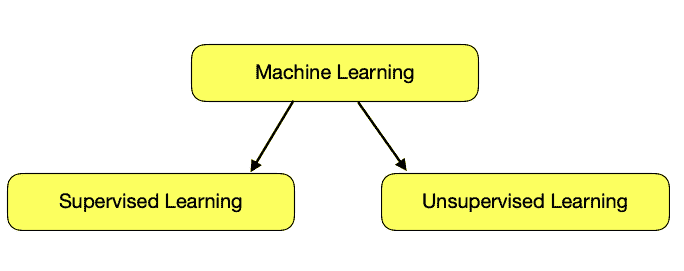
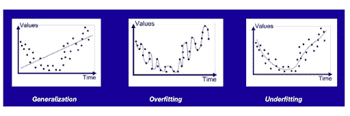
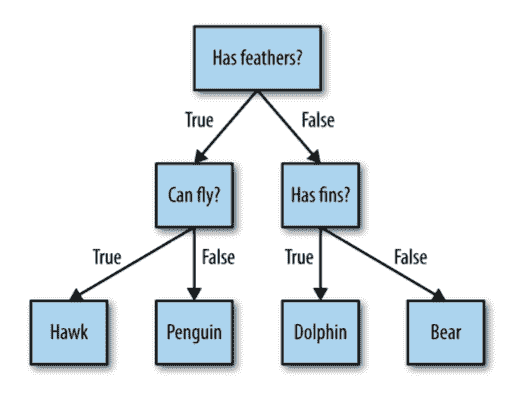
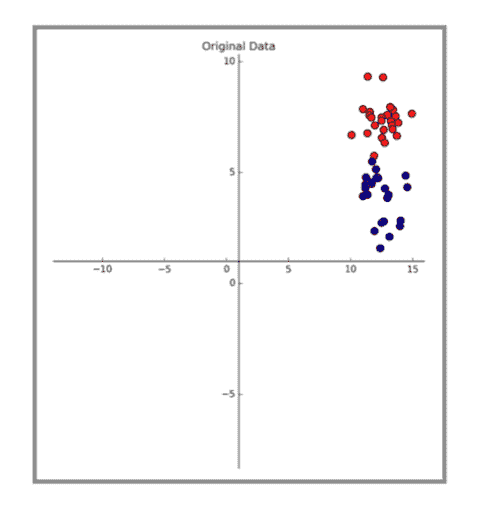
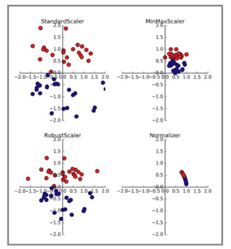
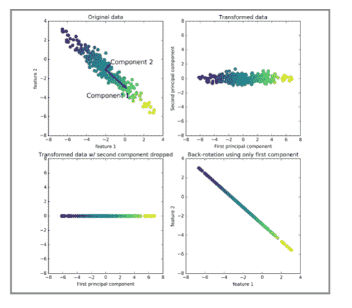
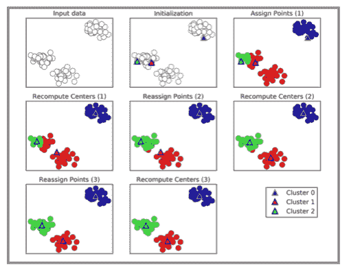
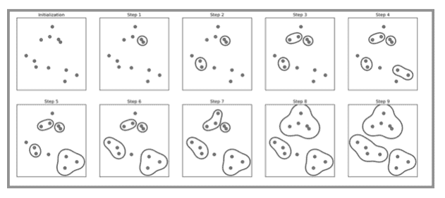

# 监督学习和非监督学习的区别

> 原文：<https://hackr.io/blog/supervised-vs-unsupervised-learning>

最成功的机器学习算法是那些通过从已知的例子中归纳来自动化决策过程的算法。在这篇文章中，我们讨论了机器学习的两种形式，即监督学习，非监督学习，以及两者之间的比较。

## 监督学习

在监督学习中，我们为算法提供成对的输入和用户期望的输出，以找到在给定输入的情况下产生期望输出的方法。这种学习是最常用和最成功的[类型的机器学习](https://hackr.io/blog/what-is-machine-learning-definition-types#types-of-machine-learning)之一，每当需要从给定的输入中预测特定的结果时都会用到，并且我们有输入/输出对的样本。从这些输入/输出对建立机器学习模型，该模型包括训练集。目标是对新的、前所未见的数据做出准确的预测。监督学习通常需要人工努力来建立训练集，但之后会自动执行，并且通常会加速一项费力或不可行的任务。

例如，垃圾邮件分类使用机器学习。用户向该算法提供大量电子邮件(这些电子邮件是输入)。关于这些电子邮件是否是垃圾邮件的信息(这是期望的输出)也与输入一起提供。然后给该算法一封新邮件，以预测该新邮件是否是垃圾邮件。

### 泛化、过度适应和欠适应

#### **1。一般化**

在监督学习中，我们希望在训练数据上建立一个模型，然后能够对新的、看不见的数据做出准确的预测，这些数据与我们使用的训练集具有相同的特征。如果一个模型成功地对未知数据做出了准确的预测，我们说它可以从训练集推广到测试集。

#### **2。过度装配**

衡量算法在新数据上是否表现良好的唯一标准是对测试集的评估。对于我们所拥有的信息量来说，建立一个过于复杂的模型是不合适的。当模型过于符合训练集的特性，并且获得在训练集上工作良好但不能推广到新数据的模型时，就会发生过度拟合。

#### **3。供应不足**

如果模型过于简单，那么捕捉数据中的所有方面和可变性将是一个挑战，因此模型在训练集上表现不佳。选择过于简单的模型是不合适的。

### 模型复杂性与数据大小的关系

模型的复杂性与训练数据集中包含的输入的变化有关:数据集包含的数据点种类越多，在不过度拟合的情况下可以使用的模型就越复杂。收集更多的数据点会产生更多的变化，因此更大的数据集允许构建更复杂的模型。

## 监督机器学习算法

现在让我们看看最流行的监督机器学习算法，并解释它们如何从数据中学习，以及它们如何进行预测。我们研究算法的优点、缺点，以及它们最适合应用于什么样的数据。

### 1.k-最近邻

k-NN 算法可以说是最简单的机器学习算法。建立模型仅包括存储训练数据集。该算法在训练数据集中查找最近的数据点，即它的“最近邻居”，以预测新的数据点。

#### 优势、劣势和参数

**1。强度**

k-NN 的优点之一是模型易于理解，并且经常通过大量调整给出合理的性能。

**2。弱点**

当使用 k-NN 算法时，预处理是必要的

数据。该方法在具有许多特征的数据集上表现不佳，在大多数情况下大多数特征为 0 的数据集上表现尤其糟糕。

**3。参数**

k-NN 分类器有两个关键参数:邻居的数量和如何测量数据点之间的距离。

### 2.线性模型

线性模型使用输入要素的线性函数进行预测。

回归有不同的模型，下面让我们简单介绍一下:

#### **1。线性回归**

线性回归，或普通最小二乘法(OLS)，是最简单和最经典的线性回归方法。线性回归在训练集上查找使预测和正确的回归目标 y 之间的均方误差最小化的参数。均方误差是预测值和真实值之间的平方差之和。线性回归没有参数，这是一个好处，但是也没有办法控制模型复杂度。

#### **2。岭回归**

在岭回归中，选择系数来拟合附加约束，而不仅仅是为了很好地预测训练数据。我们还希望系数的幅度尽可能小。直观地说，这意味着每个特征对结果的影响应该尽可能小(这意味着有一个轻微的斜率)，同时仍然可以很好地预测。这个约束就是所谓的正则化的一个例子。正则化意味着明确地限制模型以避免过度拟合。岭回归所使用的特殊类型被称为 L2 正则化。

#### **3。套索**

Lasso 是 Ridge 的替代方法，用于正则化线性回归。使用 lasso 将系数限制为接近零，但方式略有不同，称为 L1 正则化。L1 正则化的后果是，当使用套索时，一些系数恰好为零。这意味着模型完全忽略了一些特征。让某些系数恰好为零通常会使模型更容易解释，并且可以揭示模型的基本特征。

#### 优势、劣势和参数

**1。强度**

*   线性模型训练速度非常快，预测速度也很快。它们可以扩展到非常大的数据集，并且可以很好地处理稀疏数据。
*   线性模型的另一个优势是，使用我们前面看到的回归和分类公式，它们可以相对容易地理解如何进行预测。

**2。弱点**

不清楚为什么系数是这样的。如果数据集具有高度相关的要素，情况尤其如此；在这些情况下，系数可能很难解释。

当特征数量与样本数量相比较大时，线性模型通常表现良好。它们也经常用于大规模数据集，只是因为训练其他模型不可行。但是，在低维空间中，其他模型可能会产生更好的泛化性能。

**3。参数**

线性模型的主要参数是正则化参数，在回归模型中称为α，在 LinearSVC 和 LogisticRegression 中称为 C。大的α值或小的 C 值意味着简单的模型。

### 3.朴素贝叶斯分类器

朴素贝叶斯分类器与线性模型非常相似。它们在训练中甚至更快，但反过来，朴素贝叶斯模型通常提供泛化性能，尽管它比 LogisticRegression 和 LinearSVC 等线性分类器稍差。

朴素贝叶斯模型通过单独查看每个要素来学习参数，并从每个要素中收集简单的每类统计数据，从而使模型高效。GaussianNB、BernoulliNB 和 MultinomialNB 是 sci-kit learn 中实现的三种朴素贝叶斯分类器。GaussianNB 适用于任何连续数据，而 BernoulliNB 假定二进制数据，MultinomialNB 假定计数数据(比如一个单词在句子中出现的频率)。文本数据分类使用 BernoulliNB 和多项式 iNB。

#### 优势、劣势和参数

**1。强度**

他们训练和预测的速度非常快，而且训练过程很容易理解。这些模型对高维稀疏数据非常有效，并且对参数相对稳健。朴素贝叶斯模型是很好的基线模型，通常用于大规模数据集，在这种情况下，即使训练一个线性模型也可能需要很长时间。

**2。弱点**

朴素贝叶斯分类器的缺点与线性模型的缺点相同。

**3。参数**

BernoulliNB 和 MultinomialNB 只有一个控制模型复杂性的参数 alpha。alpha 的工作方式是，算法将许多虚拟数据点添加到数据 alpha 中，这些虚拟数据点对所有特征都具有正值。这导致了统计数据的“平滑”。显著的 alpha 意味着更平滑，导致模型不太复杂。该算法的性能相对于 alpha 的设置来说是健壮的，这意味着设置 alpha 对于优秀的性能来说并不重要。但是，调整它通常会在一定程度上提高精确度。

GaussianNB 主要用于非常高维的数据，而朴素贝叶斯的其他两种变体广泛用于稀疏计数数据，如文本。MultinomialNB 通常比 BinaryNB 性能更好，尤其是在具有相对大量非零要素的数据集(即大型文档)上。

### 4.决策树

决策树是广泛用于分类和回归任务的模型。本质上，他们学习 if/else 问题的层次结构，从而做出决定。

这些问题类似于在一个有 20 个问题的游戏中人们可能会问的问题。假设一个用户想要区分以下四种动物:熊、鹰、企鹅和海豚。目标是通过尽可能少地问如果/否则的问题来得到正确的答案。用户可以从询问动物是否有羽毛开始，这个问题将可能的动物缩小到只有两种。如果答案是“是”，他可以问另一个问题来帮助他区分鹰和企鹅。例如，人们可以问动物是否会飞。如果动物没有羽毛，可能的动物选择是海豚和熊，他需要问一个问题来区分这两种动物——比如问动物有没有鳍。

#### 优势、劣势和参数

**1。强度**

*   由此产生的模型很容易被非专家可视化和理解(至少对于较小的树)，并且算法对数据的缩放完全不变。
*   决策树算法不需要像特征标准化或规范化这样的预处理，因为所有特征都是单独处理的，并且数据的可能分割不依赖于规模。

**2。弱点**

决策树的主要缺点是，尽管使用了预修剪，但它们往往会过度拟合，并提供较差的泛化性能。因此，在大多数应用中，我们接下来讨论的集成方法通常用于代替单个决策树。

**3。参数**

预修剪参数控制决策树中的模型复杂度，在树完全形成之前停止树的构建。

选择一种预修剪策略(设置 max_depth、max_leaf_nodes 或 min_samples_leaf)足以防止过度拟合。

用机器学习的说法，我们建立了一个模型，使用“有羽毛”、“会飞”和“有鳍”这三个特征来区分四类动物(鹰、企鹅、海豚和熊)我们可以使用监督学习从数据中学习这些模型，而不是手动建立这些模型。

[数据科学:Python 中的监督机器学习](https://click.linksynergy.com/deeplink?id=jU79Zysihs4&mid=39197&murl=https%3A%2F%2Fwww.udemy.com%2Fcourse%2Fdata-science-supervised-machine-learning-in-python%2F)

### 5.神经网络

一个被称为神经网络的算法家族最近以“深度学习”的名义复兴了。虽然深度学习在许多机器学习应用中显示出巨大的前景，但深度学习算法通常是针对特定的用例精心定制的。在这里，我们讨论一些相对简单的方法，即用于分类和回归的多层感知器，它们可以作为更复杂的深度学习方法的起点。

一个被称为神经网络的算法家族最近以“深度学习”的名义复兴了。虽然深度学习在许多机器学习应用中显示出巨大的前景，但深度学习算法通常是针对特定的用例精心定制的。有一些相对简单的方法，即用于分类和回归的多层感知器，作为更复杂的深度学习方法的起点。

#### 神经网络模型

##### 1.调谐神经网络

##### 优势、劣势和参数

**1。强度**

其主要优势在于，它们能够捕捉大量数据中包含的信息，并构建极其复杂的模型。

**2。弱点**

神经网络，尤其是大型和强大的神经网络，通常需要很长时间来训练。正如我们在这里看到的，它们还需要对数据进行仔细的预处理。

**3。参数**

调整神经网络参数本身也是一门艺术。与支持向量机类似，它们最适用于“同质”数据，其中所有特征都有相似的含义。对于具有不同类型特征的数据，基于树的模型可能更好。

## 无监督学习

无监督学习包括所有类型的机器学习，其中没有已知的输出，没有老师来指导学习算法。在无监督学习中，学习算法只是显示输入数据，并被要求从这些数据中提取知识。

### 无监督学习的类型

#### 1.数据集的转换

数据集的无监督转换创建了数据的新表示，与数据的第一种表示相比，这可能更容易被人类或其他机器学习算法理解。无监督变换的一个典型应用是降维，它采用数据的高维表示，由许多特征组成，并找到一种新的方法来表示这种数据，用较少的特征总结本质特征。降维的一个典型应用是为了可视化的目的而对两个维度进行降维。

无监督转换的另一个应用是查找“组成”数据的部分或组件。这方面的一个例子是对文本文档集合的主题抽取。任务是找到每个文档中谈到的未知主题，并了解每个文档中出现的主题。它有助于跟踪社交媒体上对选举、枪支管制或流行明星等主题的讨论。

#### 2.使聚集

另一方面，聚类算法将数据划分为不同的相似项目组。考虑将照片上传到社交媒体网站的例子。为了便于您组织图片，网站可能会将显示同一个人的图片组合在一起。然而，该网站不知道哪些图片显示了谁，也不知道你的照片集中出现了多少不同的人。一个明智的方法是提取所有的人脸，并把它们分成看起来相似的人脸组。希望这些对应的是同一个人，这些图像可以为你分组在一起。

## 无监督学习的挑战

无监督学习中的一个重大挑战是评估算法是否学到了有用的东西。无监督学习算法应用于不包含任何标签信息的数据，因此我们不知道正确的输出应该是什么。因此，很难说一个模型是否“做得很好”例如，我们假设的聚类算法可以对所有显示侧面人脸的图片和所有全脸图片进行分组。这当然是一种可能的方法来分割一组人脸照片，但这不是我们想要的方法。然而，我们没有办法“告诉”算法我们在寻找什么，通常评估无监督算法结果的唯一方法是手动检查。

因此，当数据科学家希望更好地理解数据时，无监督算法通常用于探索性设置，而不是作为更广泛的自动系统的一部分。

非监督算法的另一个常见应用是作为监督算法的预处理步骤。学习数据的新表示有时可以提高监督算法的准确性，或者可以减少内存和时间消耗。

在我们开始“真正的”无监督算法之前，我们简要讨论一些经常派上用场的简单预处理方法。即使预处理和缩放经常与监督学习算法一起使用，缩放方法也不利用监督信息，使它们成为无监督的。

## 预处理和缩放

图中的第一个图显示了具有两个要素的合成两类分类数据集。第一个特征(x 轴值)介于 10 和 15 之间。第二个特征(y 轴值)介于 1 和 9 之间。

以下四个图显示了转换数据的四种不同方式，以产生更多的标准范围。

**标准缩放器**通过使所有特征达到相同的幅度，确保每个特征的平均值为 0，方差为 1。然而，这种缩放并不确保特征的任何特定的最小值和最大值。

**鲁棒定标器**的工作方式与标准定标器相似，它确保每个特征的统计属性，从而保证它们处于相同的比例。但是，RobustScaler 使用中值和四分位数 1，而不是平均值和方差。它使鲁棒定标器忽略与其他数据点非常不同的数据点。这些独特的数据点也称为异常值，会给其他缩放技术带来麻烦。

**最小最大缩放器**移动数据，使得二维数据集的所有特征精确地在 0 和 1 之间。这意味着所有数据都包含在由 0 到 1 之间的 x 轴和 0 到 1 之间的 y 轴创建的矩形内。

最后，**规格化器**缩放每个数据点，使得特征向量的欧几里德长度为 1。换句话说，它在半径为 1 的圆或球体上投影一个数据点。这意味着每个数据点都有不同数量的刻度。当只有数据的方向(或角度)重要，而特征向量的长度不重要时，使用这种归一化。

## 无监督算法

使用无监督学习转换数据可能有许多动机。最常见的动机是可视化、压缩数据，以及找到一种对进一步处理更有意义的表示。

对于所有这些，最简单和最广泛使用的算法之一是主成分分析。我们还将研究另外两种算法:非负矩阵分解(NMF)，用于特征提取，以及 t-SNE，用于使用二维散点图的可视化。

### 1.主成分分析

主成分分析是一种旋转数据集的方法，以使旋转要素在统计上不相关。这种旋转之后，根据新要素对解释数据的重要程度，仅选择新要素的子集。以下示例说明了 PCA 对合成二维数据集的影响:

第一个图(左上角)显示了原始数据点，用颜色区分它们。该算法首先找到最大方差的方向，标记为“分量 1”它是数据中包含大部分信息的方向(或向量),或者是特征彼此最相关的方向。然后，该算法找到包含最多信息同时与第一个方向正交(成直角)的方向。在二维空间中，只有一个可能的直角方向，但是在高维空间中，会有(无限)多个正交方向。虽然两个分量都画成了箭头，但是头和尾在哪里并不重要；我们可以把第一个组件从中心画到左上角，而不是右下角。使用此过程找到的方向称为主成分，因为它们是数据中变化的主要方向。一般来说，主成分和原始特征一样多。

第二个图(右上)显示了相同的数据，但现在进行了旋转，使得第一个主分量与 x 轴对齐，第二个主分量与 y 轴对齐。在旋转之前，从数据中减去平均值，因此转换后的数据以零为中心。在 PCA 找到的旋转表示中，两个轴是不相关的，这意味着除了对角线之外，该表示中数据的相关矩阵为零。

我们通过只保留一些主成分来使用 PCA 进行降维。在这个例子中，我们可能只保留第一个主成分，如图中的第三个面板所示(左下角)。它将二维数据集的数据缩减为一维数据集。然而，请注意，我们没有只保留一个原始特征，而是找到了最令人兴奋的方向(第一个面板中从左上到右下),并保留了这个方向，即第一主成分。

最后，我们可以撤消旋转，并将平均值添加回数据。其结果是图中最后一个面板所示的数据。这些点在原始特征空间中，但是我们只保留了包含在第一主成分中的信息。这种变换有时用于从数据中去除噪声影响，或者可视化使用主成分保留的信息部分。

### 2.非负矩阵分解

非负矩阵分解是另一种旨在提取有用特征的无监督学习算法。它的工作原理类似于 PCA，也可以用于降维。与 PCA 一样，我们试图将每个数据点写成一些分量的加权和，如上图所示。但是在主成分分析中，我们需要正交分量，这可以解释尽可能多的数据差异，而在 NMF，我们希望分量和系数是非负的；也就是说，我们希望分量和系数都大于或等于零。因此，这种方法可以应用于每个特征都是非负的数据，因为非负分量的非负和不会变成负的。

将数据分解为非负加权和的过程对于作为几个独立源的相加(或叠加)而创建的数据特别有用，例如多人说话的音轨，或带有许多乐器的音乐。在这些情况下，NMF 可以识别组成组合数据的原始组件。总的来说，NMF 导致比 PCA 更多的可解释成分，因为负成分和系数会导致难以解释的抵消效应。例如，图中的本征脸包含正负两部分，正如我们在 PCA 的描述中提到的，符号是任意的。在我们将 NMF 应用于人脸数据集之前，让我们简单回顾一下合成数据。

### 3\. t 雪

虽然 PCA 通常是转换数据的首选方法，因此您可以使用散点图来可视化数据，但这种方法的性质(应用旋转，然后放下方向)限制了它的实用性，正如我们在 Wild 数据集的标记面散点图中看到的那样。有一类可视化算法称为流形学习算法，它允许更复杂的映射，并且通常提供更好的可视化。一个特别有用的是 t-SNE 算法。

流形学习算法旨在可视化，因此很少用于生成两个以上的新特征。其中一些，包括 t-SNE，计算训练数据的新表示，但不允许新数据的转换。这意味着这些算法只能转换它们被训练的数据，而不能应用于测试集。流形学习可以用于探索性数据分析，但如果最终目标是监督学习，则很少使用。t-SNE 背后的想法是找到数据的二维表示，以尽可能最好的方式保留点之间的距离。t-SNE 从每个数据点的随机二维表示开始，然后尝试使原始特征空间中靠近的点更近，而原始特征中远离的点间隔更远。SNE 霸王龙更注重近处的点，而不是远处的点之间的距离。换句话说，它试图保留指示哪些点彼此相邻的信息。

### 4.使聚集

如前所述，聚类是将数据集划分成组(称为聚类)的任务。目标是以这样一种方式分割数据，使得单个聚类中的点非常相似，而不同聚类中的点不同。与分类算法类似，聚类算法为每个数据点分配(或预测)一个数字，指示特定点属于哪个聚类。

#### 1.k 均值聚类

k-means 聚类是最简单、最常用的聚类算法。它试图找到代表特定数据区域的聚类中心。该算法在两个步骤之间交替:

*   将每个数据点分配到最近的聚类中心
*   然后将每个聚类中心设置为分配给它的数据点的平均值。

当实例到集群的分配不再改变时，算法完成。以下示例说明了合成数据集上的算法:

聚类中心显示为三角形，而数据点显示为圆形。颜色表示集群成员。指定目标是寻找三个聚类，因此通过随机声明三个数据点作为聚类中心来初始化算法。然后迭代算法开始。首先，将每个数据点分配给它最接近的聚类中心(请参见“分配点(1)”)。接下来，聚类中心被更新为指定点的平均值(请参见“重新计算中心(1)”)。然后这个过程再重复两次。第三次迭代后，聚类中心的点分配保持不变，因此算法停止。

#### 2.凝聚聚类

凝聚聚类是指一组聚类算法，它们都建立在相同的原则上:算法首先声明每个点是其聚类，然后合并两个最相似的聚类，直到满足某个停止标准。scikit-learn 中实现的停止准则是簇的数量，因此相似的簇被合并，直到只剩下指定数量的簇。几个关联标准规定了如何精确地测量“最相似的聚类”。该度量始终在两个现有群之间定义。

下图说明了二维数据集上的聚集聚类的进展，寻找三个聚类:

 

最初，每个点都是它的簇。然后，在每一步中，合并两个最接近的聚类。在前四个步骤中，选取两个单点聚类，并将它们连接成两点聚类。在步骤 5 中，两点集群中的一个被扩展到第三点，等等。在步骤 9 中，只剩下三个集群。当我们指定我们正在寻找三个集群时，算法就停止了。

#### 3.基于密度的噪声应用空间聚类

另一种有利的聚类算法 DBSCAN(具有噪声的应用的基于密度的空间聚类”)。

DBSCAN 的工作原理是识别特征空间“拥挤”区域中的点，在这些区域中，许多数据点靠得很近。这些区域在特征空间中被称为密集区域。DBSCAN 背后的想法是，集群形成密集的数据区域，由相对空的区域隔开。

核心样本定义为密集区域内的点，定义如下。DBSCAN 有两个参数:eps 和 min_samples。如果在 eps 到给定数据点的距离内有至少 min_samples 个数据点，则该数据点被分类为岩心样本。比 eps 距离更近的岩心样本被 DBSCAN 放入同一个聚类中。

该算法通过选取任意一点来工作。然后，它会找到与该点的距离为 eps 或更小的所有点。如果在起点的距离 eps 内有少于 min_samples 的点，则该点被标记为噪声，这意味着它不属于任何聚类。如果在 eps 的距离内有超过 min_samples 个点，则该点被标记为核心样本，并被分配一个新的聚类标签。然后，访问该点的所有邻居(在 eps 内)。如果尚未为它们分配集群，则会为它们分配刚刚创建的新集群标签。如果是核心样本，则依次访问其邻居，以此类推。该聚类增长，直到在该聚类的距离 eps 内不再有岩心样本。然后选取另一个尚未访问的点，重复相同的过程。

最后，有三种点:核心点、在核心点的距离 eps 内的点(称为边界点)和噪声。当对特定数据集多次运行 DBSCAN 算法时，核心点的聚类总是相同的，并且相同的点总是被标记为噪声。然而，边界点可能是一个以上聚类的核心样本的邻居。因此，边界点的聚类成员取决于访问点的顺序。通常只有几个边界点，这种对点的顺序的轻微依赖不是本质的。

DBSCAN 的主要优点是它不需要用户预先设置聚类的数量，它可以捕获复杂形状的聚类，并且它可以识别不属于任何聚类的点。DBSCAN 比凝聚聚类和 k-means 稍慢，但仍可扩展到相对较大的数据集。

## 监督与非监督学习:面对面的比较

| **参数** | **监督学习** | **无监督学习** |
| **定义** | 使用标记数据对机器进行示教的方法。 | 该机器在没有任何指导的情况下根据未标记的数据进行训练。机器应该发现数据中隐藏的模式。 |
| **问题类型** | 

*   回归:预测连续数量。
*   分类:预测一个标签或类别。

 | 

*   关联:包括发现模式和寻找共现现象。
*   聚类:用于目标营销。

 |
| **数据类型** | 提供有一组标记的输入和输出数据。 | 机器只给出了输入数据(未标记)。 |
| **训练阶段** | 培训阶段定义明确。 | 训练阶段很模糊。 |
| **瞄准** | 预测结果-给出预测的结果。 | 发现模式，提取有用的见解。 |
| **接近** | 将已知输入映射到已知输出。 | 探索和发现模式，并提取有用的见解。 |
| **输出反馈** | 直接反馈机制，因为机器是用标记数据训练的。 | 没有反馈机制，因为机器在训练阶段不知道输出。 |
| **流行算法** | 线性回归k-最近邻 | k 均值c 均值 |
| **应用程序** | 预测风险的商业部门 | 推荐系统 |

## 摘要

使用标记数据训练监督学习算法，并帮助预测不可预见数据的结果。

成功构建、扩展和部署精确的监督机器学习模型需要时间和来自高技能数据科学家团队的技术专业知识。此外，[数据科学家](https://hackr.io/blog/how-to-become-a-data-scientist)必须重建模型，以确保给出的见解保持真实，直到数据发生变化。流行的算法包括线性回归和 k-最近邻算法，应用于商业领域，以预测对组织增长有用的见解。

另一方面，与监督学习相比，无监督学习算法使用未标记的数据，并允许它们执行更复杂的处理任务，尽管与其他自然学习方法相比，无监督学习可能更不可预测。流行的算法是 K-means 和 C-means 以及诸如推荐系统之类的应用。

**人也在读:**