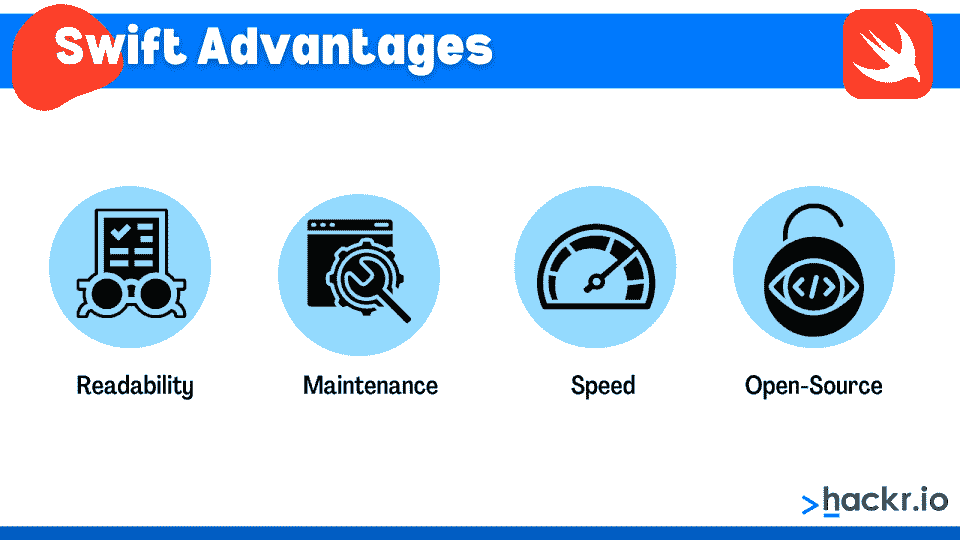
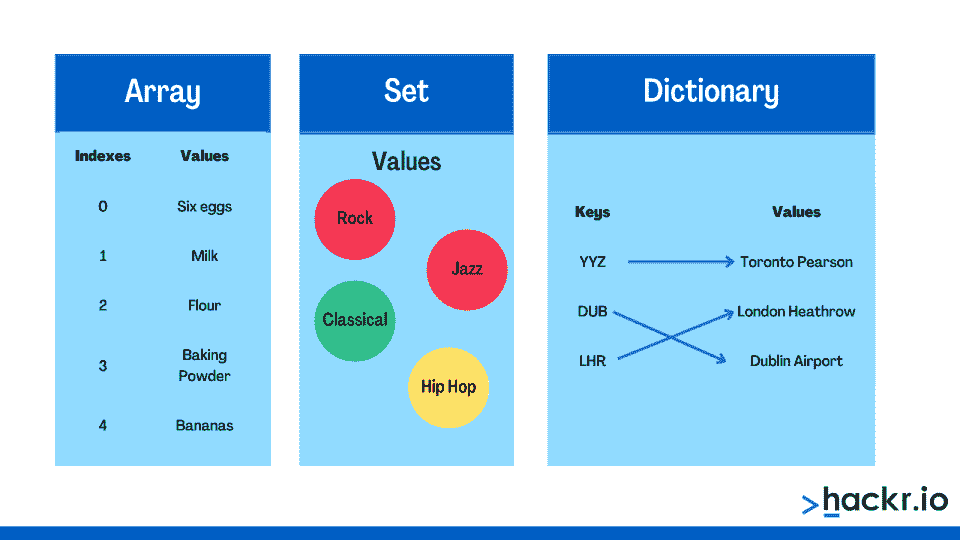
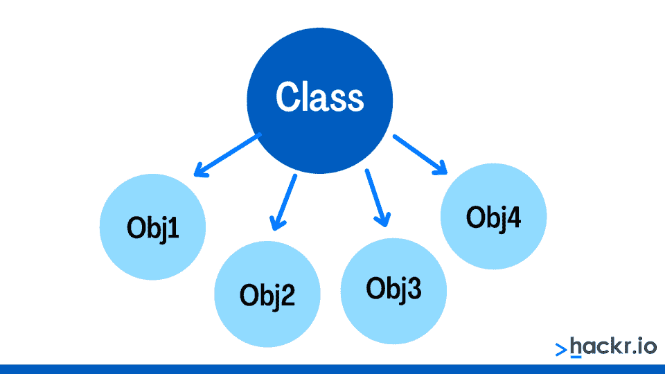
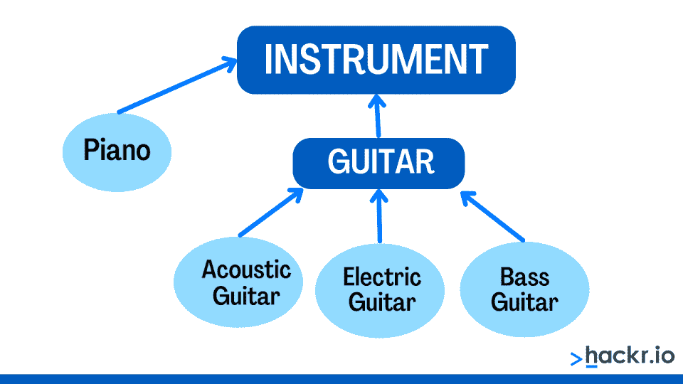

# 2023 年 50 大 Swift 面试问题和答案[更新]

> 原文：<https://hackr.io/blog/swift-interview-questions>

Swift 是一种用户友好的[编程语言](https://hackr.io/blog/what-is-programming-language)，用于为 iOS、iPadOS、macOS、tvOS 和 watchOS 创建应用程序。开发人员也使用 Swift 进行 Linux 开发。它是 Objective-C 的替代语言，两者都是为苹果设备创建应用程序而设计的。

Swift 语法既简洁又富于表现力。它需要尖端的特性，并允许开发人员进行前端和后端应用程序开发。你知道吗，Xcode，macOS 最流行的 ide 之一，从版本 6 开始就集成了 Swift。

Swift 和 iOS 开发人员在[就业市场](https://www.bls.gov/ooh/computer-and-information-technology/software-developers.htm)需求量很大。如果你打算从事 iOS 开发人员职业，学习和掌握 Swift 是必不可少的。

为快速面试做准备？不用担心；我们为你准备了这些顶级的 iOS Swift 面试问题，帮助你获得理想的工作。

## **热门 iOS Swift 面试问答**

Swift 新手？经验丰富的老兵？我们将 swift 上的 iOS 面试问题分为基本、中级和高级，以适应所有经验类型。

让我们从基础开始:

### **Swift 基本面试问答**

还是初学者？这些是你在初级开发人员的面试中可能会听到的一些问题。

#### **1。什么是 iOS Swift？**

苹果公司于 2014 年 6 月创建了 Swift，以帮助开发人员为移动和桌面平台创建应用程序。该语言适用于 macOS、iOS、watchOS 和 tvOS 等操作系统。苹果开发 Swift 是为了支持 Cocoa 框架(Cocoa Touch 和 Cocoa)和 Objective-C 库。

Swift 还支持许多操作系统，如 FreeBSD、Linux 和 Darwin。

#### **2。Swift 的优势是什么？**

****

以下是使用 Swift 的一些优势:

也许 Swift 最大的好处是它简单的语法，这使得它易于读写。例如，Swift 比 Objective-C 需要更少的代码来实现一个选项。此外，Swift 取消了许多遗留的传统，比如在 if/else 语句中用分号结束行，用括号将条件表达式括起来。

另一个显著的变化是方法调用不再相互嵌套，防止了括号混乱。相反，Swift 方法和函数调用使用一个参数列表，用逗号分隔。你会发现这些依偎在 parantheses。因此，语法更简单，代码更清晰。

目标-除非 C 前进，否则 C 不能前进。相比之下，Swift 没有这些依赖性，这使得它使用起来简单得多。为了加快构建时间和提高代码效率，C 强制程序员维护两个代码文件，这同样适用于 Objective-C。

Swift 提供快速开发，降低了费用。例如，一个复杂的对象排序将比相同算法的 Python 实现快 3.9 倍。此外，它比 Objective-C 快，Objective-C 比 Python 快 2.8 倍。

Swift 的开源状态于 2015 年宣布，使后端基础设施和各种平台成为可能。通过使 Swift 开源，苹果可以获得社区反馈，以不断改进语言，因为独立开发者为其成功做出了贡献。

#### **3。我们可以使用 iOS 设备来测试苹果 iPhone 应用程序吗？**

如果我们没有 iOS 设备，你可以在苹果的 Mac 系统模拟器上测试我们的应用。

#### **4。Swift 的关键特征是什么？**

Swift 的主要特点是:

*   附加结构和枚举

*   具有协议焦点的可选类型

*   类型安全和类型推理

*   不需要分号

#### **5。描述 Swift 应用的典型 iOS 应用执行状态(iOS 应用生命周期)。**

五种最典型的执行状态如下:

**未运行**:应用已经结束，没有启动，或者完全关闭。

**Inactive** :这是一个暂时的非活动状态，应用程序在后台运行，不能接收事件。

**Active** :这是主执行状态，软件在后台运行，能够接收事件。

**后台**:应用程序在前台运行，同时仍然能够运行后台代码。

**挂起**:程序正在后台运行，已经被操作系统挂起。

#### **6。Swift 是面向对象编程的语言吗？**

Swift 是一种[面向对象的编程语言](https://hackr.io/blog/oops-concepts-in-java-with-examples)。

#### 7 .**。哪些类型的对象属于 Swift 的核心数据类型？**

Swift 使用一套标准的基本数据类型，包括文本、整数和布尔值:

*   **int** :整数值存储在 int 中。

*   **double 和 float:** 在 Swift 中处理十进制数时，会考虑 double 和 float。

*   **布尔:**使用布尔类型存储二进制值。1 和 0 条件在 Swift 中用于此数据类型。

*   **String:**Swift 中双引号内的文本由用户在字符串中定义。这里我们存储了一个字符列表。

*   **数组**:数组是列表项的分组。

*   **字典:**字典是由特定的键值对绑定在一起的特定排序的未排列元素的集合。

#### **8。如何向数组中添加元素？**

应用程序的[最流行的数据类型](https://hackr.io/blog/data-types-in-c)之一是数组(app)。数组组织应用程序数据。

在 Swift 中使用数组文字使得生成代码数组变得容易。简单的逗号表示数组元素，方括号区分值列表。

[](https://imp.i115008.net/QOJD3x)

#### **9。iOS 支持哪个 JSON 框架？**

iOS 支持 SBJson 框架，它提供了更多的控制和一个通用的 API 来简化 Json 的处理。它是一个强大且适应性很强的框架，有助于 API 的适应性操作。

#### 10。iOS 为什么要用 PLIST？

PLIST 代表财产清单。您可以在系统中将扩展名为. plist 的文件保存为 PLIST，它实际上是一个值和键的字典。这是一种可移植的轻量级方法，用于存储少量数据，通常使用 XML。

[iOS & Swift -完整的 iOS 应用开发训练营](https://click.linksynergy.com/deeplink?id=jU79Zysihs4&mid=39197&murl=https%3A%2F%2Fwww.udemy.com%2Fcourse%2Fios-13-app-development-bootcamp%2F)

#### **11。描述一本字典。**

字典关联是无序的键值对的集合。每个值都有一个不同的键，键是一种可哈希的类型，如整数或文本。您可以随时使用字典的思想来获取基于键值的值。

#### **12。Swift 中的协议是什么？**

Swift 协议类似于 Java 接口。它是 Swift 中的一个常见组件，概述了特定任务所需的质量、程序和其他规范。Swift 协议就像描述操作和特征的界面。然而，该协议仅根据其属性或基本过程来描述。

您可以定义枚举、函数和类来实现属性和方法。此外，您必须在枚举、结构或类类型名称后声明协议(单个或多个)。最后，您可以使用逗号来区分不同的协议。

#### 13。Swift 中的代表是什么？

委托是一种在类或结构之间传递数据或促进通信的设计模式。它用于处理表视图和集合视图事件，并在特定事件发生时支持从一个对象到另一个对象的消息传递。代表们直接相互交流和沟通。

#### **14。可选链接有什么作用？**

可选的更改调用可选的。在此操作中，我们可能会尝试从一系列可选值中提取一个值。如果可选的*有*值，调用可选的下标、方法或属性将返回值。同样，如果 optional 为 nil，调用下标、方法或属性将返回 nil。

#### 15。可选绑定是如何工作的？

可选的绑定概念使得可选的值可以作为变量或临时常量使用。您还可以使用该流程来确定可选的*是否包含*值。您可以将“if”和“while”语句与可选绑定一起使用，以测试可选。

#### 16。描述 Swift 模块。

模块是一段离散的分布式代码。一个[框架](https://hackr.io/blog/what-is-frameworks)或应用程序作为一个整体创建和分发，另一个模块可以使用 swift 的‘import’关键字导入它。Swift 将每个构建目标视为 Xcode 工具中的一个独立模块。

#### **17。继承有什么好处？**

继承的优点如下:

*   提供代码可重用性。
*   显著减少代码冗余。
*   减少源代码的大小，从而提高代码的可读性。
*   很容易将代码分成父类和子类。
*   通过在子类中重写基类功能来支持代码扩展性。

接下来，我们将讨论针对有经验的开发人员的中等难度的 Swift 面试问题。如果你有这种语言的工作知识，你就能很好地回答这些问题。

#### 18。如何使属性可选？

您可以通过声明一个问号(“？”)使 Swift 代码中的属性可选).当属性缺少值时，问号“？”有助于防止运行时错误。

#### **19。在应用程序启动周期中，谁调用主要的应用程序功能？**

我们的应用程序的主线程调用主函数。

#### 20。UI 元素是如何工作的？

术语“UI 元素”是指用户可见的应用程序的任何组件，包括图像、按钮、标签、文本字段等。

#### **21。每个视图控制器对象属于哪个超类？**

UIViewController 是所有视图控制器对象所属的超类。为了响应设备旋转，提供了显示它们、加载视图和旋转它们的功能。UIViewController 类提供了所有典型的系统活动。

#### **22。Swift 4.0 提供了哪些全新的功能？**

以下是 Swift 4.0 的一些最新功能:

*   Unicode 兼容字符串的快速使用
*   多个返回值和元组
*   本机抛出/尝试/捕获错误处理
*   通过扩展对结构进行序列化

您可以在开头的(/*)和结尾的(*/)之间键入多行注释。

#### **24。Xcode 使用哪些源对象？**

Xcode 使用四个源对象:框架、供应商组、数据文件和原始文件夹。

#### **25。什么是“推迟”？**

defer 语句的执行被推迟，直到当前作用域结束。

延迟操作的执行顺序与它们在源代码中列出的顺序相反。换句话说，第一个 defer 语句的代码最后运行，然后是第二个 defer 语句的代码，依此类推。

#### **26。Swift 中的元组是什么？**

元组是组合成单个复合值的许多值的集合。它包含有组织列表中的元素。可以通过两种方式访问元组的对象数据:按名称或位置。

一个 Swift tuple 可以容纳两个值，一个字符串类型，一个整数类型。

#### **27。Swift 支持哪些不同的集合类型？**

****

Swift 有三种主要的集合形式来存储值集合:

*   **数组:**数组是存储在同类数据的有序列表中的值的有序集合。

*   **集合:**集合是未定义的相同类型的不同值的集合，存储在相同类型的不同值中，但不按任何特定顺序排列。

*   **字典:**字典是键和值对之间关联的无序集合。

#### **28。同步任务和异步任务有什么区别？**

**同步**:

同步 API 调用导致代码在等待调用完成时暂停。这意味着在 API 响应之前，您的应用程序不会一直运行，您可能会将其解释为延迟或性能滞后。如果你的应用程序具有只能在收到 API 应答后*才能使用的功能，那么同步 API 调用可能是有利的。*

**异步**:

异步调用不会停止(或等待)服务器响应 API 调用。相反，当服务器响应调用时，在应用程序仍在运行的同时，调用一个“回调”函数。

#### **29。什么是枚举？**

枚举符号表示变量只能接受预定范围的值，即一周中的日期只能是从周一到周日的七天之一。

因此，在声明枚举时，必须提供所有可能值的列表。根据编译器，这些是唯一可能应用于变量的值。

#### 三十岁。Swift 中的泛型是什么？

泛型代码不标识基础数据类型。多亏了泛型，我们可以预测它将包含的类型。泛型还帮助我们优化代码。

#### 31。Swift 中的‘懒’是什么？

惰性存储属性的初始值仅在第一次调用时计算。

#### 32。Swift 中的“保护”声明是什么？

条件语句“guard”比标准条件语句多做一些承诺。

如果条件为假，执行肯定会离开当前范围(或者，至少，跳过这个循环迭代，退出循环，从当前块/函数返回，或者结束程序)。它还有一个好处，就是在余下的作用域中保持您在条件中建立的任何绑定，使您不必使用更多的嵌套“if”语句来完成像“打开四个可选值”这样简单的事情。

#### 33。Swift 中有哪些类？

****

类(和结构)是任何支持面向对象范例的编程语言的通用的、基本的构建块。它们允许您为创建对象(也称为实例化类)指定一个“模板”,该模板具有特定类型对象所共有的一组相同的属性和操作(有时称为函数或方法)。

在类和结构中使用相同的语法定义属性和函数，就像处理常规的、不相连的常量、变量和函数一样。

值得注意的是，在 Swift 中，术语 instance 比术语 object 更受青睐，主要是因为它同时适用于类和结构的实例。

### **针对高级开发人员的高级 Swift 面试问题**

也许你已经是一名 Swift 专业人士了——你可能会搜索更多高级 iOS 开发人员的招聘广告。如果你具备广泛的 Swift 知识，并且有几年的工作经验，这些是适合你的 Swift 面试问题！

#### 34。区分 Swift 中的“let”和“var”

您可以使用关键字“var”来声明实变量——其内容可以随时间改变的代码部分它可能以包含数字 10 的整数开始，您可以稍后将其修改为 5 或您喜欢的任何其他值。

可以用关键字“le”声明常量变量常量是代码的一部分，一旦启动，其内容就不会随时间而改变。初始化为存储值 10 的整数，它是不可改变的，并在整个程序执行过程中保持该值。

#### 35。Swift 中类型的基本类别是什么？

Swift 要求每个对象都有一个类型，这个类型在编译时必须是已知的。Swift 类型分为两类:

*   **值类型**，通常被描述为结构、枚举或元组，允许每个实例维护其数据的单独副本。

*   **引用类型**，其中数据的单个副本由所有实例共享，类型通常表示为一个类。

类型标识可以存储在对象内部的对象种类。

#### 36。Swift 中有哪些选项？

在 Swift 中，每个对象要么必须有一个值，要么被明确定义为可选的(可能没有值)。通过赋予它唯一的值“nil”可以让可选变量*没有值*。

在 Swift 中，当特定类型的(适当)值不存在时，使用 nil。你可能会说 nil 表示没有正确的值。您可以将任何类型的*选项设置为零。另一方面，Nil 与非选项不兼容。如果变量没有必需的值，则必须在代码中将该变量声明为可选值的正确类型。*

#### 37。Swift 中的零合并运算符是什么？

当处理可能有零值的变量时，用符号“？？，“很有帮助。

例如，如果在表达式(a？？b)，或者当“a”为零时返回默认值“b”。存储在“a”中的类型必须与表达式“b”匹配。

#### 38。Swift 中的一个函数可以返回多个值吗？如果是，如何实现？

像大多数编程语言一样，Swift 只允许每个函数返回一个值。如果这个元素是一个基本类型，你将只返回一个值。

此外，事物可以是复杂类型，如类、结构、元组或数组。在这种情况下，您可以将几个值打包成一个复杂类型。之后，您正式返回一个包含大量值的条目，这些值保存在这个数据结构中。

**下面是我们如何返回保存在一个元组中的多个值:**

```
func functionWithMultipleReturnValues(
val1: Int,
val2: Int
) -> (sum: Int, product: Int) {
let sum = val1 + val2
let prod = val1 * val2
return (sum, prod)
}
let result = functionWithMultipleReturnValues(val1: 10, val2: 20)
let s = result.sum
let p = result.product
```

#### 39。函数中形参和实参的区别？

这两个词在编程语言中经常互换使用，但略有不同。argument(也称为实参数)是指实际提供的输入，parameter(也称为形参)是指函数声明中的变量。

例如，变量“x”是函数定义“f(x) = x+1”中的参数，而函数调用“f(10)”中的函数自变量是值“10”。参数可以被认为是一种类型，而实参可以被认为是一个实例。

#### 40。Swift 中的闭包是什么？

闭包是独立的代码单元。其他编程语言的 Objective-C 和 lambdas 中的块可以和 Swift 中的闭包相媲美。闭包本质上是 Swift 的匿名函数，一种将词汇范围的名称绑定付诸实践的方法。

构造闭包时名称绑定到的值或存储位置与每个局部使用但在封闭作用域中指定的变量相关联。与简单的函数不同，闭包使函数能够通过闭包对变量的引用来访问那些被捕获的变量，即使函数是在它们的作用域之外被调用的。

#### 41。什么是变异方法？

实现结构(和枚举)的变异方法允许您从它们的实例方法中改变值类型特征。根据设计，值类型的实例方法不能更改其任何属性。您必须使用“mutating”关键字 must 来实现这种技术。

#### **42。什么是并发？**

术语“并发运行”指的是同时进行两个活动的任务。当计算机内核将两个进程分配给不同的内核时，这两个内核同时执行这些进程的指令。类似的情况包括在现有连接结束之前新连接开始，需要立即关注。从更广泛的意义上来说，当我们不得不几乎同时做许多事情时，它就会发生。当几个任务开始并发运行时，并行执行——一种特定类型的并发执行发生了。

#### **43。什么是多态性？**

****

多态性是任何面向对象编程语言的基本构件。它使用单个符号来表示许多不同种类的实体或不同类型实体的单个接口的可用性。有了多态性，您的代码可以在父类或其子类上操作，这取决于支持的层次结构(对象族)。

#### **44。什么是访问控制？**

访问控制限制谁可以访问代码的某些部分。您可以使用访问控制来隐藏实现细节，并通过选定的接口启用代码访问。

Swift 提供不同级别的访问:

*   **开放访问:**通过开放访问(“开放”和“公共”访问)，您可以使用来自定义模块和其他模块的任何源文件中的实体。

*   **内部访问:**您可以使用任何源文件中来自其定义模块的实体，但不能在该模块之外的源文件中使用。在 Swift 中，这是默认的访问说明符。

*   **文件私有访问**:您只能使用定义源文件中的实体。

*   私有访问:将资源的使用限制在包含它的声明中。

#### **45。什么是单体设计模式？**

Singleton 是“创造性设计模式”类别中用于对象生产的设计模式。它允许我们拥有一个类的单一实例。单例对象经常用于提供应用程序配置选项。

例如，当您的应用程序启动时，它创建或初始化一个全局环境，并用预先配置的参数填充它。在适当的时候，应用程序的几个部分可能会使用这些配置设置。

#### **46。JSON 是什么？**

JSON 是一种基于文本的、人类可读的数据传输标准，它表达简单的数据结构和对象。JSON 偶尔也会用在客户端和服务器端编程环境中。

基于 [JavaScript 编程语言](https://hackr.io/blog/how-to-learn-javascript)，JSON 最初是作为 Netscape Navigator Web 浏览器的页面脚本语言创建的。JSON 语法允许对象、数组、数字、字符、布尔值和 null 的序列化。

#### **47。什么是代码覆盖率？**

代码覆盖率衡量有多少生产代码与自动化测试套件同时执行。通常用比率来表示。例如，如果您的测试覆盖了 100 行代码中的 75%,那么只有 25%的代码被执行。只需 25 行代码就可以轻松隐藏 bug。代码覆盖率表明代码的运行能力以及测试的好坏。

#### **48。编写代码，从 Swift 的索引中删除一个元素。**

```
// Initialize Array with 5 elements
var array = [1, 2, 3, 4, 5]
// Remove element at index: 2
array.remove(at: 2)
// Print array element
print(array) 
```

#### 49。什么是立面设计模式？

facade 模式隐藏了系统的复杂性，使其更易于使用。它符合结构设计模式。客户端程序可以通过这种设计访问系统，但它通过为客户端提供一个更友好的用户界面来隐藏其工作原理。该方法创建一个类(FACADE ),该类具有调用其他系统相关类和用户定义函数的委托。因此，客户端代码只与 Facade 对话，而不与实际系统对话。

#### 50。什么是类型别名？

您可以使用类型别名重命名程序中现有的数据类型。一旦声明了类型别名，就可以在整个程序中使用它来代替原始类型。不能生成具有类型别名的新类型。

## **奖励提示**

以下是给你的一些额外的建议，或许可以成为厨师完善 iOS Swift 面试的秘诀:

*   **选择认证:**Swift 认证展示您的技能，给雇主留下深刻印象。
*   **构建项目:**如果您是初学者，尝试简单易行的 Swift 项目，并将其添加到您的投资组合中。
*   保持简历更新:确保在简历中充分描述你的技能。尽力描述你的技能在以前的工作中帮助你取得的具体成果。
*   模拟面试:尝试模拟面试来模拟真实的面试，测试你如何回答困难的问题。

## **结论**

如果你复习并练习了这份 Swift 面试问题清单，我们相信你会实现你梦想中的 iOS 开发人员职业生涯！

继续学习与核心 Swift 编程逻辑、面向对象设计、设计模式和实施相关的 Swift 主题。如果你对其他开发人员的机会持开放态度，你也可以考虑复习其他面试问题。

## **常见问题解答**

#### **1。Swift 是真正的编程语言吗？**

Swift 是一种通用编程语言，从软件设计原则、性能和安全性的当代视角出发。

#### **2。Swift 使用什么类型的代码？**

Swift 主要使用 C++代码。

#### **3。Swift 是高级语言吗？**

是的，Swift 是一种高级编程语言，支持高效的应用程序开发。

**人也在读:**