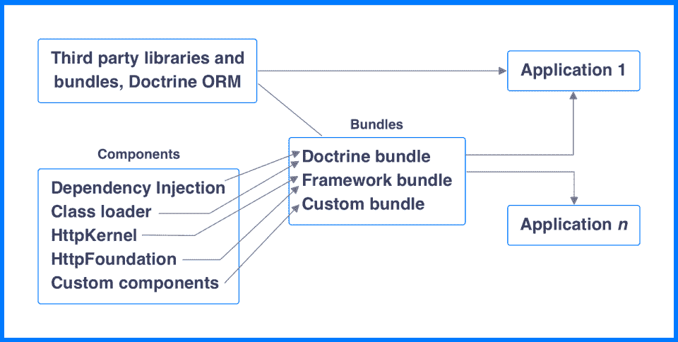
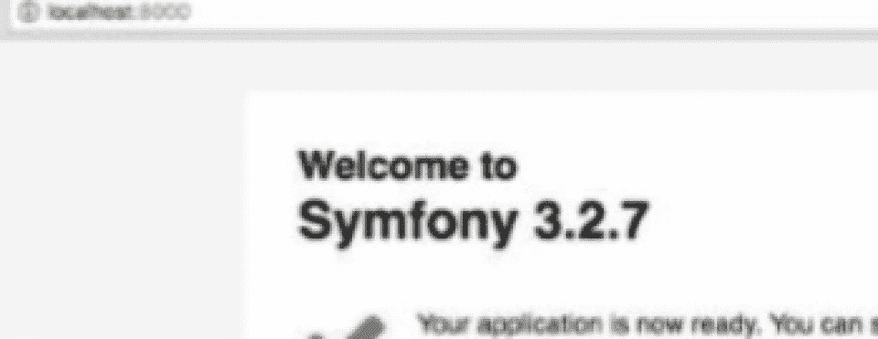
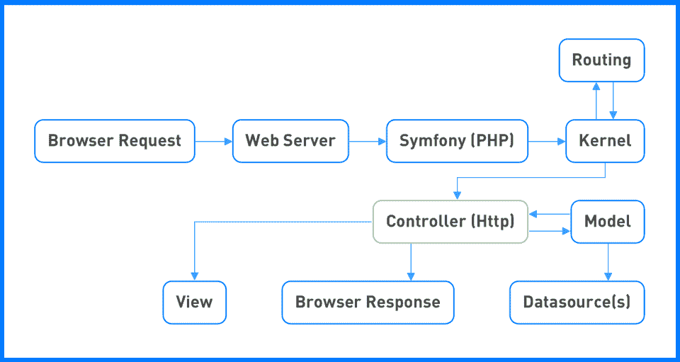

# Symfony 框架-完全初学者指南

> 原文：<https://hackr.io/blog/symfony-framework>

Symfony 是一个为 web 应用程序设计的开源 PHP 框架。本文将讨论 Symfony 是如何出现的，重要的组件，架构，工作流程，安装的基本步骤等等。

它已经成为网络服务的基础。Symfony 包含可重用的 PHP 库和组件。像 Laravel 和 Drupal 这样的项目在其应用程序中使用 Symfony 组件。

开发 Symfony 是为了减少 web 应用程序的创建和维护时间，并避免重复的任务。它受 Spring 框架的影响和启发很大。

## **Symfony 的历史**

Symfony 由 SensioLabs 发布，于 2005 年 10 月 18 日作为自由软件发布。它是在麻省理工学院许可下发布的。然而，2007 年发布了更稳定的第一个版本，然而，它没有 2.0 版本有前途。然而，开发人员发现了升级和向后兼容性的主要问题。最好和最有前途的版本是 2.3，它有很好的稳定性和特性。之后的升级，2.4，2.5，2.6，就没那么突出了，以后的版本都是向后兼容的。当前版本是 5.2，它有一些重要的特性，比如伪本地化、控制台上的 24 位颜色、可翻译的消息对象、对 PHP 8 属性/注释的支持等等。

## **特性**

正如我们之前提到的，Symfony 的主要目标是优化网络应用。Symfony 框架有以下独特的特性:

*   基于 MVC 的微框架(模型-视图-控制器)
*   高性能 PHP 框架
*   解耦的可重用组件
*   错误记录和会话管理功能
*   灵活的 URI 路由
*   充满活力的社区
*   高度成熟的树枝模板引擎
*   可扩展，代码可读性好
*   支持多种数据库平台

## **Symfony 架构**

该架构很简单，由可重用的组件和包组成。

组件提供单一的专门功能。例如，HTTP 组件、缓存组件、文件系统组件等。这些只是独立的 PHP 库。

捆绑包就像插件一样，更容易创建和使用。一个捆绑包可以使用许多 Symfony 组件，并提供许多功能。Symfony 核心 web 框架本身是一个包(FrameworkBundle)。

组件可以访问任意数量的包。框架中常用的捆绑包有 FrameworkBundle、FrameworkExtraBundle、DoctrineBundle。除此之外，我们还可以有定制捆绑包和教义捆绑包。

Symfony 应用程序可以独立访问组件和捆绑包。下图显示了组件和捆绑包之间的完整关系:



除了 FrameworkBundle 之外，还需要提及以下组件:

**HttpKernel**

该组件提供了创建快速灵活的基于 HTTP 的应用程序所需的构件。可以使用命令安装它:

`$ composer require symfony/HTTP-kernel`

如果您现在不理解上面的内容，请不要担心，我们将在下一节中介绍这是什么！)

使用 HttpKernel 组件的一些项目有 Drupal、OroCRM、Lumen、Thelia、Sulu 等。内核在内部定义了一个工作流，以请求开始，以响应结束。它解析控制器、参数并使用 handle()方法获得响应。事件驱动 HttpKernel 工作流中的所有步骤。

**HttpFoundation**

HTTP foundation 组件负责将面向对象层添加到 HTTP 规范中。作为每个 HTTP 请求一部分的全局变量，如 GET、POST、COOKIE、SESSION 等。，被包装在面向对象的层中。要安装该组件，请给出如下命令:

`$ composer require symfony/HTTP-foundation`

**DoctrineBundle**

要了解 DoctrineBundle，我们需要知道什么是教义。

教义是一个项目或一组 PHP 库，提供持久的服务。它包含 ORM(对象关系映射器)和数据库抽象层(DBAL)。它使用教条查询语言(DQL)，SQL 的面向对象对应物，来编写数据库查询。有了教条，就不需要存储和维护复杂的 XML 数据库模式。

DoctrineBundle 将 ORM 和 DBAL 层集成到 Symfony 应用程序中。您还可以获得一组控制台命令、配置选项和 web 调试工具栏收集器。要安装软件包，请键入:

`$ composer require doctrine/doctrine-bundle`

要获得特定于数据库的包，例如，如果您想要 DoctrineMongoDBBundle，您应该将特定的包添加到 composer.json 文件:

```
"require": {
 `"doctrine/mongodb-odm-bundle": "^3.0"`
`    },`
```

 `然后从 compose.json 文件的目录(位置)使用 update 命令安装依赖项:

`$ php composer.phar update doctrine/mongodb-odm-bundle`

## **如何下载并安装 Symfony**

要在你的机器上安装 Symfony，你应该有 PHP 5.4 或更高版本。除此之外，有一个像 WAMP 或微软 IIS for Windows，MAMP for Mac，LAMP for Linux，或 XAMP/Nginx(多平台)这样的网络服务器也不错。

您可以使用以下命令通过命令行直接安装安装程序:

`$mkdir -p /usr/local/bin `

`$curl -LsS https://symfony.com/installer -o /usr/local/bin/symfony `

`$chmod a+x /usr/local/bin/symphony`

一旦我们安装了安装程序，我们就可以创建一个新的应用程序:

`symfony new <our_app_name>`

执行此命令后，Symfony 将被下载到您的系统上，项目将被创建，其目录为‘first app/’。

要运行应用程序，我们需要启动服务器:

`cd <our_app_name> `

`PHP bin/console server:run`

要查看安装是否成功，打开浏览器，进入 localhost:8080。您应该会看到一条欢迎消息:



一旦安装了框架，就可以安装所需的组件和包了，如前一节所示！

## **简单的 Symfony 工作流程**

Symfony 框架提供了企业应用程序所需的所有特性。以下是 Symfony web 应用程序如何工作的典型工作流程:



典型的工作流程由以下步骤组成:

*   用户通过浏览器提出应用请求，使用 HTTP 协议，即[【http://xyz.com】](http://xyz.com)
*   反过来，浏览器将请求传递给 Apache、WebSphere 等 web 服务器。
*   然后，服务器将用户请求转发到底层 PHP 层。PHP 层又将其重定向到 Symfony web 框架。
*   核心组件 HttpKernel 解析请求的控制器(我们在架构中看到了这一点)。它使用路由组件将请求转发到目标请求控制器。
*   主要业务逻辑在控制器层执行。
*   接下来，DoctrineORM 进入画面，控制器通过它与模型进行交互。DoctrineORM 负责连接到数据源。
*   流程完成后，控制器会自行生成响应，或通过视图引擎创建响应。视图引擎只是一个负责将响应转换成 HTML 格式的组件。
*   响应被发送回网络服务器。然后，web 服务器将响应传输给用户(浏览器)。

## **Symfony 框架优势**

Symfony 的优势有:

1.  **快节奏的开发** :由于 Symfony 是一个基于组件的框架，所以可以很容易地安装和使用。这使得开发更快更有效，并帮助开发人员快速构建应用程序。
2.  **灵活性** :凭借依赖注入(DI)和事件调度等特性，Symfony 让开发人员可以轻松创建具有最高配置水平的复杂应用，为代码提供灵活性。
3.  **可扩展性** :由于一切都是捆绑包，并添加了独特的功能，开发者可以重用捆绑包或添加到框架中。不需要修改框架；只有这个包可以被配置来满足特定的项目需求。
4.  **稳定性** :在最初的小故障之后，Symfony 的新版本已经相当稳定和可持续。它们也与公共 API 兼容。
5.  **易于开发** :开发人员不需要担心次要的功能，专注于他们的业务逻辑，而框架会处理核心功能。Symfony 适用于各种规模的项目，因为它采用了基于组件和捆绑包的架构。Web 调试工具栏有助于在开发的早期阶段解决不同的问题，确保高质量的可交付成果。

## **Symfony 组件**

Symfony 很容易学习，因为它由组件和捆绑包组成，如果你知道核心组件和捆绑包，你可以很容易地创建新的应用程序。一些重要的组件有:

**1。查找器**

它提供了通过遍历文件来快速搜索所提到的路径中的文件和目录的类。

**2。文件系统**

提供执行基本文件操作的命令，如创建文件或文件夹，检查文件是否存在等。

**3。类装入器**

提供了 PSR-0 和 PSR-4 的类加载器标准的实现。它还可以自动加载类。

**4。依赖注入**

提供容器来处理依赖关系。框架通过服务容器广泛地使用这个组件。

**5。事件调度员**

提供基于事件的 PHP 编程。对象可以通过调度和侦听事件来相互通信。

**6。串行器**

通过串行化器，我们可以将 PHP 对象转换成不同的格式，如 JSON、binary、XML 等。，并将它们转换回 PHP 对象，而不会丢失任何数据。

**7。表情语言**

提供了一个表达式引擎，让代码更整洁更小巧。ExpressionLanguage 由两种处理表达式的方式组成:求值(表达式的计算不需要编译成 PHP)和编译(表达式被编译以便可以被缓存然后求值)。它支持许多语法，如文字、对象、操作符、函数、数组等。

**8。工作流程**

通过提供处理有限状态机的高级工具，允许高级 PHP 编程。

**9。HttpFoundation**

为 PHP 默认提供的 HTTP 请求和响应对象提供一个面向对象的层。

10。表单

支持在 web 应用程序中轻松创建表单

**11。http kernel〔t1〕**

负责 web 应用程序的整个请求-响应过程。它是 Symfony 架构的主要组成部分。

**12。路由**

路由决定了应用程序中应该处理特定请求的部分。它将手头的请求映射到一组预定义的配置变量。

Symfony 还有很多组件，可以 [访问 Symfony 官方网站](https://symfony.com/doc/current/components/index.html) 全部查看。

## **Symfony 捆绑包**

包是以特定结构排列的文件和文件夹的集合。这种安排使得多个应用程序可以重用这些包。主要的 Symfony 应用程序被打包成一个包，称为 AppBundle。捆绑包的其他一些例子可以是 AdminBundle(一个管理站点)、HelloMobileBundle(一个 hello 移动应用程序)等。

捆绑包由以下部分组成:

*   ***控制器*** :所有的控制器都放在控制器文件夹
*   ***依赖注入*** :所有与 DI 和配置相关的文件都在这里
*   ***资源/配置*** :捆绑相关配置
*   ***资源/公共*** : CSS、JS、图片等。，与此处捆绑相关。
*   ***资源/视图*** :存储与捆绑相关的所有视图模板
*   ***测试*** :所有的捆绑单元测试都存放在这个文件夹

您可以轻松定制任何第三方捆绑包的一部分，用于您的应用程序。查看[Symfony bundle overriding](https://symfony.com/doc/current/bundles/override.html)了解更多详情。

## **延伸阅读**

我们已经为您介绍了足够多的内容，让您可以开始使用 Symfony。这篇文章应该已经引起了人们对 Symfony 的兴趣，并且您将能够理解 Symfony 框架的基本概念。学习 Symfony，要了解 PHP 框架。要学习 Symfony，可以查看我们的综合 [课程清单和教程](https://hackr.io/tutorials/learn-symfony) (部分完全免费！！).你也可以阅读一些顶级书籍，如 Symfony 或[Symfony 权威指南。](https://www.amazon.com/Definitive-Guide-symfony-Francois-Zaninotto/dp/1590597869/ref=sr_1_2?dchild=1&keywords=Symfony&qid=1610219238&sr=8-2)`