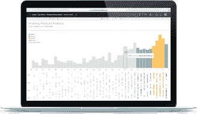
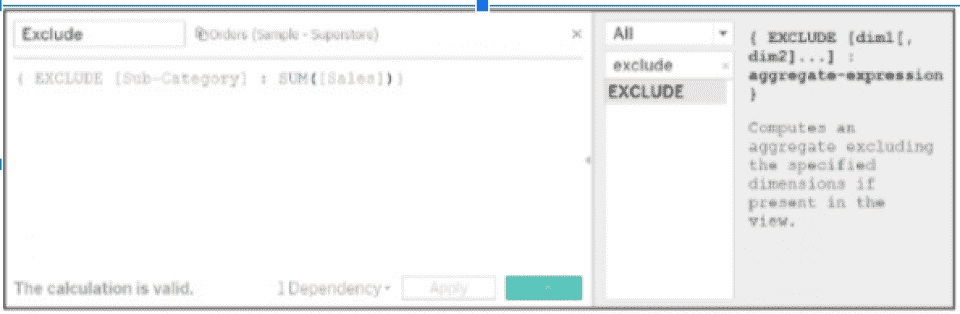

# 2023 年 54 个顶级 Tableau 面试问答

> 原文：<https://hackr.io/blog/tableau-interview-questions>

Tableau 是最常用的商业智能工具之一。该工具有助于分析数据，而不会被软件元素淹没。

作为如此重要的工具，对 Tableau 专家的需求很大。

如果你想准备面试，我们已经提到了一些最重要的和最常见的问题，这将有助于你了解 Tableau 的基础知识。你不需要事先掌握 Tableau 知识就能理解这篇文章，因为我们已经讨论了基础知识，直到高级部分。

## Top Tableau 面试问答

让我们从 Tableau 开始，准备好摇滚面试。

#### 1.什么是 Tableau？

Tableau 是一款商业智能软件，能够处理海量数据，并支持从各种来源收集的[数据](https://hackr.io/blog/what-is-data-science)的交互式可视化。

***图像演职员表:** [画面](https://www.tableau.com/why-tableau/what-is-tableau)*

它帮助许多企业处理数字，以获得增长和发展的洞察力。这个工具允许人们连接到各自的数据。

Tableau 市场上的一些竞争对手有 Apache Superset、Qlik 和 Metabase。

#### 2.Tableau 有什么优点？

以下是为您的企业使用 Tableau 的优势:

*   它显示了高性能，因为它可以处理数百万的数据行，而没有任何复杂性。使用 Tableau 的一个主要优点是你将得到不同类型的可视化。
*   它增强了移动用户的移动性，因为该工具可供 iOS 和 Android 用户等移动用户使用，并允许他们跟踪统计数据。您可以在手机上使用桌面版的所有功能。
*   Tableau 有一个强大的、扩大的、活跃的热心人社区，他们愿意帮助你解决与 Tableau 相关的问题。你可以很容易地在网上找到各种资源和指南供你参考。
*   Tableau 由希望积极部署移动商务智能的用户使用。
*   Tableau 提供了简单而频繁的更新，包括几个元素，使该工具以各种方式对用户有用。
*   与市场上的替代产品(如 Qlik)相比，您会发现这个工具是一个低成本的解决方案。
*   它有一个简单的用户界面，易于学习、理解和使用。

#### 3.使用 Tableau 时有哪些挑战？

以下是使用 Tableau 时的一些挑战:

*   使用 Tableau，您将无法获得报告的自动刷新。您将无法选择日程安排；因此，这需要手动更新后端数据。
*   这个工具没有为开发人员提供导入定制视觉效果的自由。
*   Tableau 具有条件格式，因此如果您必须使配置类似于多个列，用户需要手动完成，因为没有直接的方法来完成此操作。这是一项非常耗时的活动。
*   Tableau 有一个只能用于选择单个值的静态参数。所以如果数据有变化，每次都需要手动更新参数。你不会有任何自动的方法去做那件事。
*   如果您试图以不同于开发人员屏幕分辨率的分辨率查看仪表板，Tableau 仪表板的布局将会扭曲。
*   使用这个工具，您只能进行基本的预处理和更改数据类型。理想情况下，数据将被导出到完美的表中，因此需要数据清理，这需要额外的工具在加载前对数据进行预处理。

#### 4.Tableau 有哪些特点？

以下是 Tableau 的特点。：

*   **Dashboard** :使用可视对象、故事为您提供完整的数据视图，允许您添加多个对象，提供不同类型的布局和格式，并允许用户应用正确的过滤器。它允许您选择将仪表板或其元素从一个工作簿复制到另一个工作簿。
*   **协作和共享**:您将获得许多与其他用户协作和以可视化、仪表板等形式共享关键数据的选项。您可以安全地共享数据以获得快速反馈。
*   **实时数据和内存数据**:可以连接实时数据源和内存数据，用户可以不受任何限制地从各种来源获取数据。它为您提供了额外的数据连接功能，如自动提取刷新等。
*   **强大的安全性:** Tableau 拥有全防安全系统，确保建立数据连接的安全认证和权限系统。此外，Tableau 可以很容易地与 Kerberos 等其他安全协议集成。
*   **移动视图**:您将获得 Tableau 的移动版本，允许用户随时创建他们的仪表板和报告。您将能够创建自定义的移动布局。

#### 5.Tableau 的一些用途是什么？

*   商业智能
*   [数据可视化](https://hackr.io/blog/what-is-data-visualization)
*   数据混合
*   数据协作
*   这将有助于将查询转化为可视化
*   它将有助于创建无代码数据查询
*   有助于分析实时数据
*   用于管理大量元数据
*   用于导入大量数据

#### 6.解释 Tableau 中的数据可视化。

数据可视化是指使用地图、图表、图形和其他可视元素对数据或收集的信息进行图形化表示。借助数据的可视化表示，你会理解复杂的趋势。各种公司利用这种方法来更好地了解他们的数据，并通过轻松提供复杂的数据来创造更好的用户体验。

#### 7.Tableau 的各种产品有哪些？

[Tableau 有五种不同的产品:](https://www.tableau.com/products)

*   Tableau 服务器
*   桌面桌面
*   Tableau 阅读器
*   Tableau 在线
*   Tableau 公共

#### 8.什么是 Tableau 桌面？

这是 Tableau 的产品之一，允许用户编码，然后相应地修改报告。该过程将从创建报告和图表开始，这些报告和图表将创建一个仪表板，整个工作在 Tableau 桌面中完成。

根据连接和数据源，Tableau Desktop 进一步分类如下:

这个版本足够接近 Tableau 桌面版。但是在个人桌面版本中，工作簿是私有模式，访问受限。这意味着您不能发布工作簿，但可以将其用于个人用途。

*   **Tableau 桌面专业版**

这个版本与 Tableau Desktop 非常相似，在 Tableau Desktop 中创建的作品将发布在 Tableau 服务器上。这个版本将拥有对所有数据类型的完全访问权限，这使得它适合在 Tableau 服务器上发布作品。

#### 9.什么是 Tableau Reader？

该工具帮助用户获得使用 Tableau Public 或 Tableau Desktop 生成的可视化效果和工作簿。您可以过滤这些数据，但只能进行有限的修改。由于工作簿的任何用户都可以在 Tableau reader 的帮助下查看它，因此这是不安全的。

#### 10.什么是 Tableau 服务器？

该产品用于共享使用 Tableau 桌面应用程序创建的可视化效果和工作簿。将作品上传到服务器后，每个人都可以访问。要在 Tableau Server 中共享仪表板，您需要在 Tableau Desktop 中发布该作品。然而，授权用户不需要安装 Tableau 服务器，因为他们只需要登录来验证报告。

#### 11.什么是 Tableau Public？

这款产品适合注重省钱的用户。顾名思义，生成的工作簿并不保存在本地，而是上传到 Tableau 的公共云中，以便公众可以访问这些工作。这是一个具有成本效益的版本，使其更适合想要学习和与其他人共享数据的用户。

#### 12.什么是 Tableau Online？

Tableau Online 是一个类似 Tableau Server 的分享工具。但在 Tableau Online 的情况下，数据将保存在 Tableau group 维护的云服务器上。您可以在 Tableau Online 上发布的数据没有存储限制。Tableau Server 和 Online 都需要使用 Tableau Desktop 生成的工作簿来广播数据。

#### 13.Tableau 和 MS Excel 有什么区别？

Tableau 和 Excel 都是[数据分析工具](https://hackr.io/blog/data-analytics-courses)，具有不同的探索数据的方法。Excel 处理电子表格中的列和行，而 Tableau 在拖放功能的帮助下处理数据。

| 表 | **MS Excel** |
| 一个[数据可视化工具](https://hackr.io/blog/data-visualization-tools)，提供所收集数据的图像和图形表示。 | 一种电子表格工具，其中数据以行和列的形式显示。 |
| 它将提供你从未想过的洞察力。您可以获得各种类型的交互式可视化，部署数据钻探工具，并探索几个数据集，而无需了解您正在寻找的洞察力。 | 对于使用 Excel，您应该事先了解您想要的洞察力，然后使用各种公式。 |
| 这是一种简单的交互式方法。 | 您应该具备获得实时数据可视化的编程知识。 |

#### 14.Tableau 文件有哪些不同的类型？

*   **工作簿:**它可能包含一个或多个工作表和仪表板。
*   书签:它将存储一个单独的电子表格，并允许你轻松地分享工作。
*   **打包工作簿:**它有一个支持本地文件背景图片和数据的工作簿。
*   **数据提取文件:**这些是整个数据源的本地副本。
*   **数据连接文件:**它是一个 XML 文件，包含与连接相关的所需信息。

#### 15.解释 Tableau 中数据服务器的重要性。

您可以将数据服务器用于两个目的:

*   它会将数据集的所有数据持续同步到过去的计算中。它将为可以从任何地方访问的定义创建别名。
*   有了数据服务器，您不必为了运行可视化报告而将所有数据下载到本地机器。你可以通过服务器轻松使用互联网上的数据。

#### 16.解释表格中的度量和尺寸。

度量和维度都是有助于在 Tableau 中定义特定数据集的属性。

度量被定义为根据维度进行分析的可测量的量。您可以向由维度检查的单个字符串中添加任意数量的度量。例如，为了检查学校中的学生人数，姓名、地址和学号被认为是度量标准。

但是，维度是使可视化发生的描述。它允许用户唯一地描述指标。

#### 17.解释 Tableau 中的过滤器和不同类型的过滤器。

使用过滤器，您可以限制不需要的数据，并帮助显示我们想要的数据。有三种不同类型的过滤器可用:

*   **快速过滤器:**当您在运行期间动态更改值时，您可以使用此过滤器查看过滤选项并过滤仪表板上可用的工作表。
*   **上下文过滤器**:您可以使用该过滤器来过滤将被传送到各种工作表的数据。每当工作表在数据源上运行查询时，都会创建一个临时平面表来计算图表。该表将包含所有未被任何上下文过滤器过滤掉的值。
*   **数据源过滤器:**该过滤器擅长限制来自数据库的数据；这取决于您选择的维度。或者，您可以通过将文件拖到过滤器上来创建传统过滤器。

#### 18.用表格解释离散和连续。

离散维度是指将每个条目与其他实体区别对待的维度。例如，产品名称和国家是离散维度的一个例子。

连续维度被视为另一系列的一部分。例如，日期和年份。

#### 19.解释 Tableau 中的组。

该组被认为是将创建单个总体子类别的类别的集合。

#### 20.解释 Tableau 中的集合。

集合类似于组，但是具有输出而不是输入。与特定类别相关联的输出值的集合被视为一个集合。

例如，在超市数据集中，如果你绘制了所有类别的利润，你将能够创建任何类别的利润集。

#### 21.解释 Tableau 中的参数。

一个参数被认为是动态值，通过避免需要频繁地改变过滤器来节省时间。您可以轻松地为过滤器、参考线和所需计算中的常数值创建参数。您可以从仪表板中更改参数值。

#### 22.什么是热图？

[热图](https://evolytics.com/blog/tableau-201-make-heat-map/)是一种用于可视化和比较数据的定性方法。热图将允许您在一个表中比较几个类别的量化方法，而无需创建图表。

通常，较高的值用较暗的红色表示，而较低的值用蓝色阴影表示。但是，您可以根据自己的轻松程度和理解程度来改变颜色。

#### 23.Tableau 中的树状图是什么？

在树形图的帮助下，您将能够根据图示的大小对数据进行定量分析。矩形是树形图的基本单位，它将表示所选度量的所有值的总和。然后，根据所选维度的每个类别中的度量，将创建的矩形进一步划分为更小的矩形。

#### 24.解释 Tableau 中的数据引擎。

Tableau 的数据引擎是一个分析数据库，专门用于实现即时查询响应、预测性能、无缝集成到现有的数据基础架构中。如果您正在处理大量数据，导入、创建索引和排序数据可能需要一些时间，但其他一切都将无缝运行。数据引擎不是内存技术，因为导入的数据将存储在磁盘中。

#### 25.解释 Tableau 中的双轴。

这是用户在同一图表中查看两个度量的两个尺度时使用的一种现象。各种网站使用双轴来比较两个指标及其在特定年份的增长率。在双轴的帮助下，您可以轻松地一次比较多个测量值，这些测量值可以有两个相互叠加的独立轴。下面是一个例子。

#### 26.解释表格中的聚集和分解。

汇总是在更高和更汇总的级别查看值或度量的过程。每当您使用货架上的测量时，Tableau 将通过对所有数据求和来汇总数据。如果聚合应用于任何字段，您可以很容易地确定它，因为该函数将在字段名前面可见。例如，字段“总和”将显示为总和(销售额)。

在分解数据时，您将获得数据源的每一行。这在分析视图中可以使用的度量时非常有用。例如，假设您正在分析一项调查的结果，其中一个坐标轴代表用户的年龄。您可以汇总“年龄”字段来确定参与者的平均年龄，也可以分解数据来确定参与者的年龄。

#### 27.如何在 Tableau 中检查底层的 SQL 查询？

我们有两个选项来查看 Tableau 中的底层 [SQL](https://hackr.io/blog/how-to-learn-sql) 查询。

*   首先，记录关于主要事件的性能信息。您可以在 Tableau 工作簿中检查绩效指标。
*   要检查指标，请转到:
    帮助- >设置和性能- >开始性能记录
    帮助- >设置和性能- >停止性能记录。
*   您可以检查系统上“我的文档”文件夹下的 Tableau 存储库文件夹。如果要检查活动连接，请检查 log.txt 和 tabprotosrv.txt 文件。如果您想检查提取，检查 tdeserver.txt 文件。

#### 28.什么是 TDE 档案？

tde 代表 Tableau 桌面——它是一个扩展名为. TDE 的文件。该文件存储从 MS Excel、MS Access 等外部来源提取的数据。下面我们提到了 TDE 文件的一些方面，这些方面使其更适合支持分析和数据发现:

*   TDE 是一个按列存储数据的商店。
*   另一个重要的方面是 TDEs 是架构感知的，这意味着 TDEs 将使用从 RAM 到硬盘的计算机内存的所有部分，并在工作时利用每个部分。

#### 29.什么是 Tableau 中的故事？

故事是一个包含一系列工作表或仪表板的工作表，这些工作表或仪表板一起工作以传递任何有用的信息。

在 Tableau 中，你可以创建一个故事来展示事实之间的联系，提供一个有意义的背景，并指定决策与结果之间的关系。

故事中出现的每一页称为一个故事点。

#### 30.创作一个故事的步骤是什么？

你可以用不同的方式创作一个故事。每个故事点可以基于任何视图或仪表板。整个故事可以基于相同的虚拟化、注释等。然后，您可以使用一个故事创建一个业务案例来演示一系列事件。

*   首先，单击“新建故事”选项卡。
*   然后从左下角选择文章的大小。选择任何预定义的大小，或根据您的要求设置自定义大小，以像素为单位。
*   默认情况下，文章的标题取自工作表名称。要更改标题名称，请双击标题。选择标题的字体、颜色和对齐方式，然后单击“应用”实施更改。
*   现在，从左侧的 Story 选项卡中拖动一个工作表，并将其放到视图的中央。
*   然后，单击“添加选项”来添加概述故事点的标题。
*   通过将文本对象拖到故事工作表中，您可以使用注释来为观众突出显示关键要点。
*   然后，您可以对视图中的字段应用筛选或排序，然后通过单击 Update 选项保存更改。

#### 31.解释之间的区别。twbx 和. twb。

区别如下:

的。twbx 存储了构建可视化所需的所有重要信息以及数据源。这就是所谓的打包工作簿，它将文件包压缩在一起。

的。twb 存储指令，比如如何与数据源交互。在可视化创建过程中，Tableau 通过提取来查看用于构建可视化的数据源。您不能单独共享它，因为它仅包含说明，并且数据源需要单独附加。

#### 32.解释 Tableau 中的细节层次(LOD)表达。

您可以使用 LOD 表达式在数据源级别运行包含多个维度的复杂查询，而不是将所有数据都带到 Tableau 界面。

考虑下面的例子:

我们已经展示了家具类别及其子类别的比例。现在查看整个家具的销售额，而不是关注其子类别，您需要从计算字段中删除子类别，如下所示。

现在，可视化看起来如下所示。

#### 33.发布工作簿后，如何在 Tableau 中安排工作簿？

以下是在完成发布后在 Tableau 中安排工作簿的简单步骤。

*   首先，登录到 Tableau 服务器，然后导航到 content -> data sources 或 content -> workbooks(这取决于您想要刷新的内容类型)。
*   现在选中您要刷新的数据源或工作簿的复选框，然后选择操作->提取刷新。
*   您将看到一个对话框，选择时间表，然后选择适当的时间表。如果选定的计划可用，请指定所需的刷新类型—完全刷新或增量刷新。

#### 34.如何在仪表板中嵌入网页？

要在仪表板中嵌入网页，您只需遵循以下步骤:

*   首先，导航到仪表板。
*   在“对象”下找到“网页”选项，并双击它。
*   然后你需要在对话框中提供网页的网址(这里我们用的是[https://en.wikipedia.org/wiki/](https://en.wikipedia.org/wiki/))。
*   您可以看到网页将出现在仪表板上。

#### 35.你如何使网页动态化？

要使网站充满活力，你可以遵循下面提到的简单步骤:

*   首先，我们将把 Map by Sales 带入视图，显示州名及其销售额。

*   然后，导航到仪表板。
*   在“对象”下找到“网页”选项，并双击它
*   你会看到一个对话框。您不必在那里提供 URL 并单击 Ok。
*   从菜单中选择仪表板，然后选择“操作”选项。
*   然后点击“添加操作”选项，然后选择“转到 URL”
*   现在，你必须在 URL 选项下提供 URL，[https://en.wikipedia.org/wiki/](https://en.wikipedia.org/wiki/)。单击旁边的箭头，然后选择“状态”
*   然后点击“选择选项”并点击“确定”
*   现在，无论您选择哪个州，您都将获得该州的维基百科页面。

#### 36.如何优化 Tableau 仪表板的性能？

有多种方法可以优化 Tableau 仪表板的性能:

*   您可以使用重要的字段和记录，并从可视化中移除不需要的字段，或者使用正确的提取过滤器。
*   通过使用操作和参数过滤器，确保使用有限的过滤器。这将有助于减少查询负载。
*   使用最小值/最大值而不是平均值，因为平均值函数比最小值/最大值函数需要更多的处理时间。
*   确保使用布尔或数字计算，而不是字符串计算，因为字符串处理将花费更多的时间。

#### 37.如何进行数据融合？

有两种方法可以执行数据混合:

*   一种是自动方式，Tableau 将根据一些公共维度和匹配值自动定义两个数据源之间的关系。这种类型的关系用橙色表示。
*   另一种方式是手动方式，其中用户将手动定义关系。

#### 38.提及数据混合的功能。

以下是数据混合的一些功能。

*   主数据源和辅助数据源之间存在特定的关系。
*   每当您执行数据混合时，每个工作表都有一个主连接，并且可以有几个辅助连接。
*   蓝色用于主要连接，所有次要连接将为橙色。

#### 39.什么是混合轴？

使用混合轴，您可以在单个轴中显示多个度量，并且所有标记都在单个窗格中指定。

*   使用混合轴，您将能够拖动列中的尺寸
*   您可以拖动列中的第一个度量
*   您可以拖动现有轴中的第二个度量
*   us/multiple measures _ blended axes . html

#### 40.什么是数据建模？

数据建模是对数据对象的分析，主要用于识别数据对象之间的关系。它不仅是为软件创建图表的无缝过程，而且是产生面向对象编程的技术先进的方法。

数据建模的工作原理非常简单:数据模型连接跨数据库的表，然后发出一组指令。这样，每当您使用 Tableau 中的数据时，无论您是自动配置还是手动配置，它都会调用数据模型。

值得注意的是，数据建模利用了传统的模式和技术。反过来，它们提供了一种跨各种平台定义和处理数据资源的简单方法。在采用这种尖端的数据建模方式之前，您必须经历许多考验。例如，您必须创建一个数据模型，首先列出所有的表，然后同时匹配它们——这个过程通常非常耗时且成本高昂。

使用数据建模，您可以轻松完成以下任务:

*   您可以通过简单地指定它们之间的关系来进行 Tableau 扩充、修复连接和联合。
*   您可以基于特定字段创建易于理解的 SQL 查询。
*   保证你在练习册上的速度。怎么会？通过缩短 SQL 查询，数据建模将允许您特定的可视化。
*   您使用它来减少记录的重复。得益于其在可视化级别定义数据源的能力，数据建模减少了对多个 LOD 计算的需求。
*   您不会遇到任何数据混合问题。它允许您导航以前需要混合的任何情况。

#### 41.Tableau 中的 KPI 是什么？

使用 Tableau，您可以借助形状卡中的关键绩效指标，根据关键指标快速有效地分析任何公司的有效性。

首先，您需要创建一个计算字段，然后根据所需的参数将值指定为成功或失败。然后，您将使用维度和创建的计算字段绘制图表，并自动更改为形状。然后在形状卡中为 KPI 指定成功和失败值，以便更好地理解。

#### 42.解释画面中的箱子。

在 Tableau 中，bin 是大小相等的容器，用于存储可以轻松放入 bin 大小的数据值。

简而言之，数据仓将有助于将数据分组为大小相等的组，这有助于系统地查看数据。您可以将所有离散字段视为一组字段。

#### 43.用 Tableau 解释分析。

要分析图表上绘制的数据，可以使用 Tableau 的内置特性。您可以使用各种工具，例如向图表添加一条平均线，Tableau 会在将工具放在图表上后计算该平均线。您可以使用其他功能，如聚类、百分比等。，用于浏览和检查数据。您可以从每个工作表的“分析”选项卡中使用所有这些工具来创建任何图表。这些功能只有在您可以将它们实现到特定的工作表中时才可见。

#### 44.Tableau 中的页架是什么？

借助页面架，您可以更高效地轻松理解多个图表。如果在单个工作表中有多个图，并且希望逐个查看这些图，可以将负责创建图表的维(而不是单个图表)拖放到页面架。之后，您将获得各种选项来逐个滚动不同的图表，并可以对它们进行分析。

#### 45.什么是 Tableau 开发者？

Tableau 开发人员理解并知道使用各种来源的原始数据创建数据可视化和有用见解的过程。此人还应该负责创建其他人正在使用的高级仪表板，并使人们更容易有效地使用 Tableau。

#### 46.如何在 Tableau 中隐藏仪表板？

您不能在 Tableau 中隐藏仪表板，但是如果您将仪表板发布到网站，您将能够隐藏仪表板。为此，您需要设置一个命令，仅在您单击特定按钮时显示仪表板。但是您可以在发布仪表板之前隐藏工作表，而不是隐藏仪表板。那么默认情况下，人们将只能看到仪表板，而不能看到单个的工作表。

#### 47.如何在 Tableau 中创建层次结构？

默认情况下，已经根据字段值为数据源创建了某种层次结构。您甚至可以通过在数据窗格中将字段拖到另一个字段的顶部来创建自定义的层次结构。然后，您可以输入层次结构的名称，然后按 Ok。您还可以向层次结构中添加一些额外的字段。将数据安排在层次结构中会使浏览数据类别变得更容易。

#### 48.怎么把 MongoDB 和 Tableau 联系起来？

下面是用 Tableau 连接 MongoDB 的步骤:

*   要连接 MongoDB 和 Tableau，您需要一个额外的驱动程序。你需要从[这里](https://www.tableau.com/support/drivers)下载并安装那个驱动。
*   安装完成后，需要打开 Tableau，选择 connect 部分前面的 MongoDB BI 连接器。
*   如果您在主列表中找不到它，那么在“到服务器”菜单下，您会看到一个名为“更多”的选项在那里可以找到 MongoDB BI 连接器。
*   现在，您需要输入服务器的名称，输入特定数据库的用户名和密码。然后，在连接到 SSL 服务器时选择“需要 SSL”复选框。
*   然后选择“登录”进入数据源。

#### 49.解释 Tableau 中的级联过滤器。

级联过滤器可以被认为是给予特定过滤器的优先权，该过滤器然后在先前过滤的数据源之上应用附加过滤器。您可以右键单击要用作主过滤器的过滤器。但是您必须确保它被设置为仪表板中的所有值，然后选择后续的过滤器。您需要选择相关的值来层叠过滤器。这将有助于提高仪表板的性能，因为级联过滤器比在源数据上运行所有过滤器花费的时间更少。

#### 50.如何提高 Tableau 中的性能？

您可以通过各种方式提高 Tableau 的性能，但是最常用的方法是对数据源使用 extract 选项，这被认为是最强大的工具。创建完仪表板之后，您就可以运行性能记录器了。你会拿到展示 Tableau 表演的表格。

*   您还可以通过减少视图中的遮罩数量来提高性能。
*   确保使用较少的过滤器。
*   此外，确保使用包含字段而不是排除字段。
*   如果您想要过滤大量数据，那么您应该使用上下文过滤器。
*   为了减少查询执行时间，您可以使用级联过滤器。

#### 51.运行 Tableau mobile 需要的 Android OS 最低版本是什么？

Tableau mobile 可以在 7 版或更高版本的 Android 设备上运行。Tableau mobile 可用于查看在 Tableau Desktop、Tableau Server 和 Tableau Online 上创建的可视化效果。

#### 52.Tableau 中的散点图是什么？

您可以使用散点图来显示两个或多个有或没有维度的度量。要绘制散点图，必须在行中有一个度量，在列中有一个度量。然后你可以用卡片的几个维度做进一步的细节描述。在散点图的帮助下，您可以在空白的地方绘制数据点，这些数据点将根据度量中存在的值形成某种形状。

#### 53.如何在 Tableau 中显示轴？

在 Tableau 中，您可以根据需要显示和隐藏任何轴。为此，您需要右键单击轴，然后选择“取消选择”选项来隐藏轴。如果您想要显示轴，那么再次右键单击行或列中的字段，并选择“显示标题”选项以恢复隐藏的轴。

#### 54.如何给 Tableau 仪表盘添加一个 logo？

您可以在 Tableau 仪表板中添加徽标，方法是进入 objects 窗格并选择 import image 选项。确保将默认平铺选项更改为浮动类型。

然后，您可以将对象拖放到仪表板上，并从您的系统中选择所需的徽标。图像应该是这样的格式。jpg 或者. png，如果想用它做背景，可以使用图片右侧的小下拉选项。之后，您需要选择“放在后面”选项来增加图像的大小，以将其用作水印标志。

## **结论**

在当今时代，数据被认为是 IT 行业中最重要的东西，因此获得一个可理解的数据视图也同样重要。Tableau 是一种将各种来源的数据可视化的方法，因此成为当今世界的热门技能。

以下是 Tableau 面试中最常被问到的问题。这篇文章将帮助你理解 Tableau 的基础知识和一些高级特性。不管你有没有 Tableau 的先验知识，这个指南足以让你在面试的最后时刻重温你的技能。